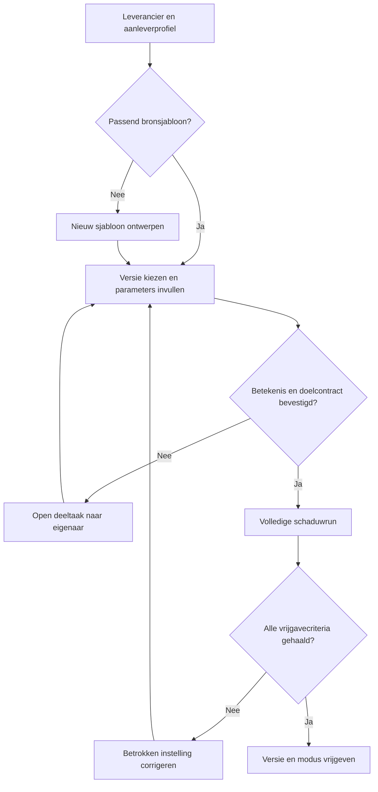
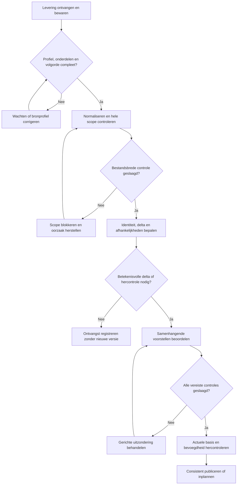
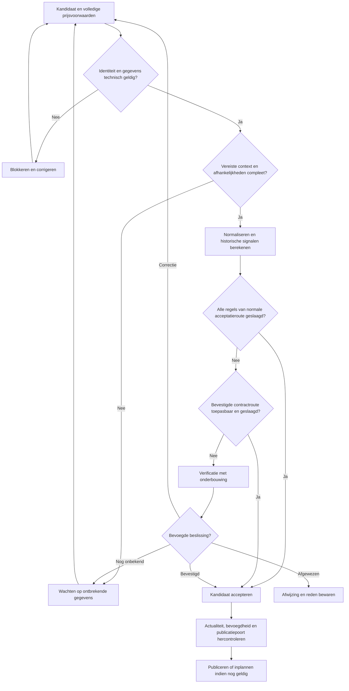
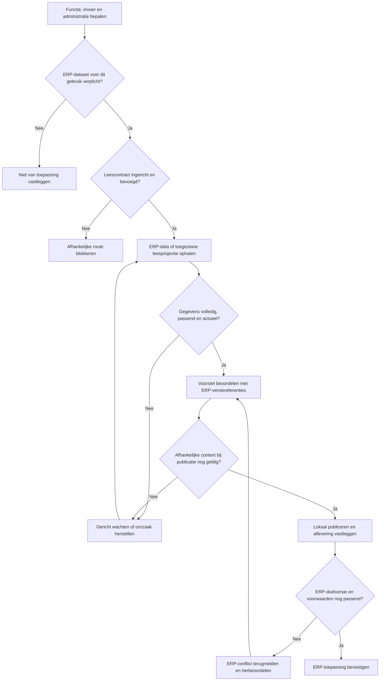
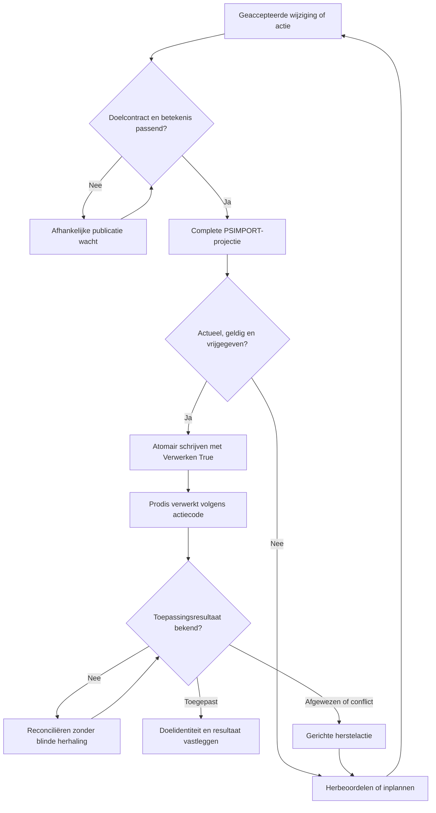
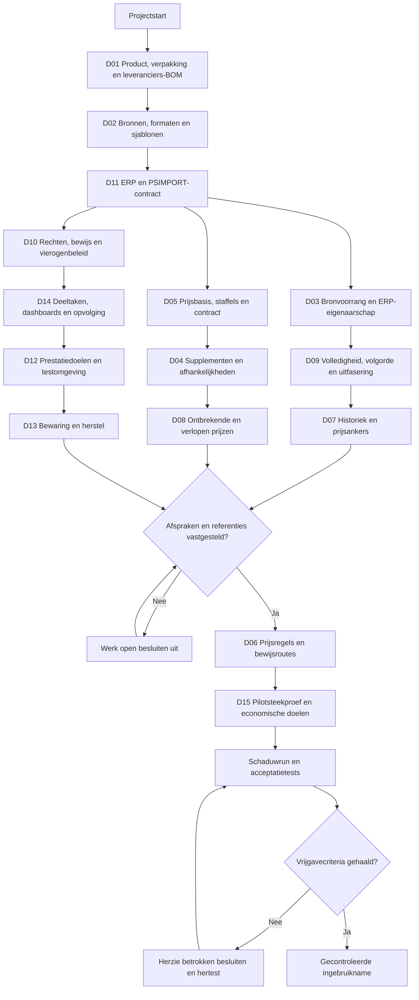

# Businessanalyse voor automatische artikelimport en prijsacceptatie

*Projectbasis voor een centrale artikelbibliotheek met gecontroleerde publicatie*

Versie 1.4 | 21 september 2026 | Status ter inhoudelijke vaststelling

Uitgebreide Markdown-uitgave met behoud van beslispunten D01 tot en met D15. Versie 1.4 voegt de inrichting vóór import, herbruikbare bronsjablonen, getypeerde bookmarks en afzonderlijke Prodis-publicatieprofielen toe. De aangeleverde PSIMPORT-data view is opgenomen met alle 96 Real-veldbindingen en de niet-fysieke parameters. Invulmethoden, Verwerken=True, actiegestuurde delete, veilig behoud van bestaande waarden, representatiegrenzen en toepassingsbevestiging zijn uitgewerkt. De zeven verplichte en zestien voorwaardelijke ERP-datasets blijven behouden, aangevuld met gerichte referenties voor gebruikte PSIMPORT-velden en de afzonderlijke publicatieroute. Eigen BOM’s, eigen productie en eigen kits blijven buiten scope. De uitgave bevat 92 functionele eisen, 10 niet functionele eisen en 232 gespecificeerde applicatietests; deze tests zijn nog niet uitgevoerd.

| Versie | Wijziging |
| --- | --- |
| 1.0 | Oorspronkelijke businessanalyse |
| 1.1 | Markdown-uitgave en flowchart van de vijftien projectbesluiten |
| 1.2 | Uitwerking van leveringen, leverancierssamenstellingen, verpakkingen, staffels en prijsverificatie; uitbreiding naar 46 functionele eisen en 128 gespecificeerde tests |
| 1.3 | Prodis als operationeel ERP: artikelen, bibliotheekartikelen, koppelingen en aankoopvoorkeur; één artikeleenheid, leveranciersverpakkingen buiten Prodis. Zeven verplichte en zestien voorwaardelijke ERP-datasets, leescontracten en vierde flowchart, deeltaken en dashboardontwerp; 70 functionele eisen en 184 gespecificeerde tests |
| 1.4 | Inrichting vóór import, zeven stappen, sjablonen/bookmarks en DASH07–DASH09; PSIMPORT-veldcontract voor 96 Real-bindingen, technische invulmethoden, delete en terugmelding; 92 functionele eisen en 232 gespecificeerde tests |

Het project moet correcte artikelwijzigingen snel beschikbaar maken en alleen uitzonderingen aan gebruikers voorleggen. Het voorgestelde ontwerp bewaart brongegevens, wijzigingsvoorstellen en actieve bibliotheekgegevens afzonderlijk. Een prijsbeoordelingsmotor combineert vergelijkbare prijshistoriek met vastgestelde parameters. Goedkeuring gebeurt per samenhangende wijzigingsgroep, met een laatste controle vóór publicatie.

Dit document beschrijft het volledige beoogde proces, de bedrijfsregels, het logische gegevensmodel, de acceptatiecriteria, de testcatalogus en de invoering. Het is een basis voor functioneel ontwerp, backlog en implementatie. De genoemde testresultaten zijn verwachte resultaten; er is nog geen applicatie gebouwd of getest. Voorgestelde drempels en prestatiedoelen moeten vóór productie met representatieve leveranciersdata worden vastgesteld.

## Inhoud

- [1 Bedrijfsdoel en uitgangspunten](#1-bedrijfsdoel-en-uitgangspunten)
- [2 Reikwijdte en afbakening](#2-reikwijdte-en-afbakening)
- [3 Rollen en bevoegdheden](#3-rollen-en-bevoegdheden)
- [4 Begrippen en logische gegevensstructuur](#4-begrippen-en-logische-gegevensstructuur)
  - [ERP-eigenaarschap en verplichte gegevens](#42-gegevensgrens-tussen-erp-en-importsysteem)
  - [Voorwaardelijk verplichte ERP-gegevens](#44-voorwaardelijk-verplichte-erp-gegevens)
  - [Wat het importsysteem zelf bewaart](#45-gegevens-die-het-importsysteem-zelf-beheert)
- [5 Bronafspraken en ontvangst](#5-bronafspraken-en-ontvangst)
  - [Inrichting vóór import en zeven deeltaken](#56-inrichting-vóór-de-eerste-import)
  - [Bronsjablonen en bookmarks](#58-twee-afzonderlijke-soorten-herbruikbare-sjablonen)
- [6 Het proces van ontvangst tot actieve bibliotheek](#6-het-proces-van-ontvangst-tot-actieve-bibliotheek)
- [7 Statussen en geldigheid](#7-statussen-en-geldigheid)
- [8 Identiteit duplicaten en relaties](#8-identiteit-duplicaten-en-relaties)
- [9 Delta bronvoorrang en bibliotheekindeling](#9-delta-bronvoorrang-en-bibliotheekindeling)
- [10 Acceptatie per wijzigingsgroep](#10-acceptatie-per-wijzigingsgroep)
- [11 De prijsbeoordelingsmotor](#11-de-prijsbeoordelingsmotor)
- [12 Bestandsbrede kwaliteitscontrole](#12-bestandsbrede-kwaliteitscontrole)
- [13 Werkvoorraad en menselijke behandeling](#13-werkvoorraad-en-menselijke-behandeling)
  - [Deeltaken en afhankelijkheden](#133-van-uitzondering-naar-concrete-deeltaken)
  - [Dashboards en schermindeling](#135-dashboards-per-doel-en-rol)
- [14 Functionele eisen](#14-functionele-eisen)
- [15 Publicatie integratie en herstel](#15-publicatie-integratie-en-herstel)
  - [ERP-leescontract en storingsgedrag](#152-leescontract-voor-erp-gegevens)
  - [PSIMPORT-publicatie en invulregels](#156-psimport-als-concrete-prodis-publicatieroute)
  - [Verwerken en delete](#159-verwerken-delete-en-veilige-vrijgave)
- [16 Niet functionele eisen en beheer](#16-niet-functionele-eisen-en-beheer)
- [17 Monitoring en kwaliteitssturing](#17-monitoring-en-kwaliteitssturing)
- [18 Teststrategie en uitgangsdata](#18-teststrategie-en-uitgangsdata)
- [19 Invoering en migratie](#19-invoering-en-migratie)
- [20 Projectfasen en op te leveren resultaten](#20-projectfasen-en-op-te-leveren-resultaten)
- [21 Risicoanalyse](#21-risicoanalyse)
- [22 Besluiten die voor realisatie moeten worden vastgelegd](#22-besluiten-die-voor-realisatie-moeten-worden-vastgelegd)
- [23 Conclusies en zakelijke onderbouwing](#23-conclusies-en-zakelijke-onderbouwing)
- [24 Technische achtergrond en verwijzingen](#24-technische-achtergrond-en-verwijzingen)
- [25 Herleidbaarheid van eisen naar tests](#25-herleidbaarheid-van-eisen-naar-tests)
- [26 PSIMPORT-veldcatalogus](#26-psimport-veldcatalogus)

## 1 Bedrijfsdoel en uitgangspunten

Leveranciers en aankoopverenigingen leveren artikelgegevens met verschillende structuren, kwaliteit en frequenties. Een bestand bevat ongeveer 10.000 tot 400.000 artikelen. Sommige bronnen leveren dagelijks, andere wekelijks of jaarlijks. De gegevens omvatten eigenschappen, referenties, prijzen, alternatieven, supplementen en mogelijke duplicaten tussen leveranciers.

Het bedrijfsdoel is een betrouwbare, actuele en vrij groepeerbare artikelbibliotheek. Een volledige levering mag niet op handmatige goedkeuring wachten doordat enkele artikelen fouten bevatten. Tegelijk mogen verkeerde prijzen, onzekere identificaties of ongeldige relaties niet automatisch actief worden.

De centrale ontwerpbeslissing is dat een levering een verzameling beweringen van een bron is. Het systeem beoordeelt die beweringen, bepaalt de werkelijke verschillen en publiceert uitsluitend de wijzigingen die aan de toepasselijke regels voldoen. Een geaccepteerde bronwaarde hoeft niet de voorkeurswaarde in de centrale bibliotheek te worden.

De volgende uitgangspunten gelden voor het ontwerp:

- Een stabiele interne artikelidentiteit staat los van leverancierscodes en benamingen.

- Prijzen blijven gekoppeld aan de juiste leverancier, overeenkomst en prijsbasis.

- Een recente ontvangst bewijst geen recente inhoudelijke wijziging.

- Een fout blokkeert de kleinste groep wijzigingen die inhoudelijk samenhangt.

- Onzekere artikelidentiteit blokkeert alle wijzigingen die van die identiteit afhangen.

- Elke automatische en handmatige beslissing is herleidbaar tot bron, regels en gebruikte gegevens.

- Herhaling, parallelle verwerking en herstel na een storing mogen geen dubbele of verloren wijzigingen veroorzaken.

- Automatische acceptatie betekent dat vastgestelde controles slagen; het bewijst niet dat de bronwaarde in de werkelijkheid juist is.

Succes wordt beoordeeld op actualiteit én kwaliteit. Het aandeel automatische acceptaties mag nooit als enige doelstelling gelden, omdat versoepelde regels dat percentage kunstmatig kunnen verbeteren.

## 2 Reikwijdte en afbakening

Binnen de beoogde reikwijdte vallen ontvangst van bestanden of berichten, bronprofielen, normalisatie, herkenning, ontdubbeling, verschillenberekening, validatie, prijsbeoordeling, werkvoorraad, publicatie, bibliotheekindeling, historiek, rapportage en gecontroleerd herstel. CSV, XML en andere formaten kunnen via adapters naar hetzelfde interne formaat worden omgezet. De concrete eerste formaten worden per pilotbron gekozen.

De oplossing beheert zowel nieuwe artikelen als wijzigingen, uitfaseringen, expliciete verwijderverzoeken en correcties op eerder aangeleverde gegevens. Bibliotheken kunnen overlappen en worden op leverancier, aankoopvereniging of eigen classificatie ingericht.

Buiten de eerste projectfase vallen automatische onderhandelingen, bestellingen, betalingen, voorraadoptimalisatie, berekening van verkoopmarges en het achteraf wijzigen van historische orders of facturen. Ook een zelflerend model dat zonder expliciet beleid prijzen goedkeurt valt buiten de eerste versie. Een latere uitbreiding kan aanbevelingen geven, maar moet dezelfde acceptatiepoorten respecteren.

Het operationele ERP is Prodis. De opdrachtgever heeft de tijdelijke schrijftabel `%prodis_write%PSIMPORT` en haar data view aangeleverd. De operationele leestabellen, fysieke veldbindings, verwerkersemantiek, terugmeldinterface, het totaal aantal leveranciers en de totale catalogusomvang zijn nog te inventariseren. De implementatietechnologie van het importsysteem blijft open. Koppelingen met afnemende toepassingen zijn wel een expliciet onderdeel van het functionele ontwerp.

### 2.1 Vastgestelde uitbreiding en uitsluiting

Binnen scope vallen ook leveranciers-BOM’s: samenstellingen die een leverancier of fabrikant als bron aanlevert en waarvoor het platform componenten, hoeveelheden, versies, geldigheid en relaties beheert. Dit is beheer van aangeleverde artikelinformatie. Het systeem voert daarmee geen productie uit.

Eigen BOM’s voor eigen productie of zelf samengestelde kits vallen op uitdrukkelijke keuze buiten deze analyse. Er worden geen eigen stuklijsteditor, productieorders, materiaalverbruik, eigen assemblagevoorraad, bewerkingsplanning of berekening van eigen productiekosten gerealiseerd. Een toekomstige uitbreiding vereist een afzonderlijke scopebeslissing. Interne indelingen en gecontroleerde correcties van leveranciersgegevens blijven wel binnen scope.

Het platform moet prijsvoorwaarden kunnen uitleggen en voor een gevraagde hoeveelheid een bestelbare hoeveelheid en bedrag kunnen berekenen. Dit is informatie en validatie; het plaatsen van bestellingen, automatisch extra inkopen om korting te halen en voorraadoptimalisatie blijven buiten scope. Jaarafspraken en cumulatieve kortingen worden alleen berekend als de vereiste contract- en afnamegegevens beschikbaar en bevoegd ontsloten zijn; anders worden ze als voorwaardelijk getoond.

### 2.2 ERP-gegevens uitlezen zonder een tweede ERP te bouwen

Het importsysteem moet operationele referentiegegevens en, waar nodig, commerciële of historische gegevens uit het ERP kunnen uitlezen. Het wordt geen tweede beheeromgeving voor ERP-stamgegevens, contracten, voorraad of transacties. De eigenaar van ieder gegeven wordt op logisch object en zo nodig op veldniveau vastgelegd. De opdrachtgever heeft voor Prodis bevestigd dat er artikelen, daaraan gekoppelde bibliotheekartikelen en een aankoopvoorkeursleverancier zijn. Prodis heeft in deze inrichting één artikeleenheid en geen leveranciersdoosbarcodes of andere verpakkingseenheden.

Met databases wordt in deze analyse een logische gegevensverzameling bedoeld. Een dataset kan in één ERP-database staan, over meerdere tabellen verdeeld zijn of via een view, API of beheerde export worden ontsloten. Er wordt niet verondersteld dat voor iedere rij in de inventaris een afzonderlijke fysieke database nodig is. Werkelijke ERP-leesbronnen zijn nog te inventariseren. Voor de afzonderlijke afleverroute zijn de PSIMPORT-aanduiding en Magic-veldbindingen nu aangeleverd; de runtime-resolutie en verwerkingsbetekenis moeten nog worden bevestigd.

De verplichte ERP-basis in 4.3 geldt voor productiegebruik van de geïntegreerde ERP-route. Ongewijzigde bronopslag, parsing en schaduwverwerking kunnen vóór aansluiting al plaatsvinden. Een ontbrekende ERP-aansluiting mag niet worden voorgesteld als een afgeronde ERP-integratie. Alleen gegevens die werkelijk van ERP-referenties afhangen, wachten op die referenties; onafhankelijke leverancierscatalogusinformatie kan volgens het eigen acceptatiebeleid beschikbaar komen.

Deze uitbreiding vraagt uitsluitend uitlezen van de benoemde ERP-datasets. De reeds beschreven aflevering van goedgekeurde wijzigingen aan afnemers blijft een afzonderlijke integratiestroom. Zij geeft de leesconnector geen schrijfbevoegdheid op ERP-tabellen. Aanmaak of wijziging van operationele ERP-artikelen verloopt via de afzonderlijke PSIMPORT-publicatieroute uit 15.6–15.12, nadat het doel- en verwerkingscontract is bevestigd.

## 3 Rollen en bevoegdheden

| Rol | Verantwoordelijkheid | Bevoegdheid |
| --- | --- | --- |
| Proceseigenaar | Doelen, kwaliteit, prioriteiten en productieacceptatie | Stelt beleid, verantwoordelijkheden en vrijgave vast |
| Databeheerder | Artikelidentiteit, eigenschappen, relaties en uitzonderingen | Corrigeert en beoordeelt binnen toegewezen bronnen |
| Prijsverantwoordelijke | Prijsafwijkingen, contractcontext en referentieprijzen | Bevestigt prijsexcepties en nieuwe prijsankers |
| Integratiebeheerder | Bronprofielen, adapters en technische uitval | Beheert mappings en hervat verwerking |
| Applicatiebeheerder | Gebruikers, inrichting, monitoring en herstel | Beheert toegangen en technische werking |
| Bibliotheekgebruiker | Raadplegen en gebruiken van goedgekeurde informatie | Leest toegestane bibliotheken en meldt fouten |
| Controleur | Reconstructie van wijzigingen en besluiten | Leest historiek en auditgegevens |

Eén persoon kan meerdere rollen vervullen. Het systeem legt wel vast in welke bevoegdheid een handeling gebeurt. Voor bulkacceptaties, identiteitsfusies en verruiming van prijsregels is expliciete bevoegdheid nodig. Een vierogencontrole is configureerbaar; de inzet daarvan is een open beleidskeuze, geen aanname.

## 4 Begrippen en logische gegevensstructuur

Een centraal artikel vertegenwoordigt één afgesproken productvariant. Een verpakking kan een afzonderlijke handelsvariant of een aanbieding met omrekening zijn. Die granulariteit wordt per domein vastgelegd en mag tijdens imports niet impliciet wisselen. Een andere verpakking, uitvoering of kwaliteit is niet automatisch een duplicaat.

| Entiteit | Betekenis en belangrijkste gegevens |
| --- | --- |
| Bron | Aanleverende organisatie of kanaal, verwachte frequentie, tijdzone en vertrouwensstatus |
| Bronprofiel | Versie van formaat, mapping, eenheden, sleutels, scope en volledigheidsafspraken |
| Import | Bestandsidentiteit, inhoudshash, ontvangst, bronversie, profielversie, status en tellingen |
| Bronrecord | Ongewijzigde inhoud, locatie in bestand, parseerresultaat en normalisatieversie |
| Centraal artikel | Interne ID, productvariant, levenscyclusstatus en geaccepteerde kenmerken |
| Leveranciersartikel | Leverancier, catalogusscope, externe code en koppeling aan een intern artikel |
| Referentie | Code, codestelsel, uitgever, bron, geldigheid en betekenis |
| Prijscontext | Leveranciersaanbieding, overeenkomst, prijssoort, valuta, belastingbasis en regime; verwijst naar geldige verpakking en prijsvoorwaarden |
| Prijsversie | Versie van volledige prijsvoorwaarden, bedragen en staffels, geldigheid, herkomst, acceptatie en oorspronkelijke bronwaarden |
| Relatie | Van-artikel, naar-artikel, type, richting, toepassingsvoorwaarden en bron |
| Supplement | Optioneel accessoire of verplichte toeslag, met relatie of berekeningsregel |
| Bibliotheek | Groeperingsregels, zichtbaarheid en eventuele plaatselijke presentatiekeuzes |
| Lidmaatschap | Artikel of leveranciersaanbod in een bibliotheek, handmatig of regelgestuurd |
| Wijzigingsvoorstel | Oude waarde, kandidaatwaarde, wijzigingsgroep, basisversie en afhankelijkheden |
| Beoordeling | Besluit, redenen, parameters, referenties, regelversie en tijdstip |
| Behandelgeval | Uitzondering, eigenaar, prioriteit, status en samenhangende meldingen |
| Override | Tijdelijke of blijvende menselijke uitzondering met scope en reden |
| Publicatiegebeurtenis | Doelversie, wijziging en afleverstatus voor afnemende systemen |

Een bronrecord kan meerdere wijzigingsgroepen opleveren. Meerdere leveranciersartikelen kunnen naar hetzelfde centrale artikel verwijzen. Een artikel kan in meerdere bibliotheken staan. Een prijscontext heeft meerdere versies in de tijd, maar voor dezelfde vraag naar contract, hoeveelheid en tijdstip moet één ondubbelzinnige toepasselijke prijs worden gevonden, of expliciet worden gemeld dat geen bruikbare prijs beschikbaar is.

De unieke externe artikelidentiteit bestaat minimaal uit leverancier, catalogusscope en artikelcode. Bij hergebruik van codes is een generatie of geldigheidsperiode nodig. Een referentie wordt nooit globaal uniek verondersteld zonder rekening te houden met het codestelsel en de uitgever.

Voor financiële waarden wordt decimale rekenkunde gebruikt. De bronprecisie blijft bewaard. Hoeveelheden, omzettingsfactoren, valuta en eenheden zijn getypeerde gegevens. Codes zijn tekst; voorloopnullen blijven behouden. Niet aangeleverd, onbekend, leeg en expliciet wissen zijn afzonderlijke toestanden.

### 4.1 Aanvullende objecten en begrenzing

| Object | Minimale inhoud en betekenis |
| --- | --- |
| Leveringsenvelop | Bron, levering-ID, bronversie/volgnummer indien beschikbaar, profielversie, scope, volledig/delta, tijden en verwachte onderdelen |
| Leveringsonderdeel | Bestand of bericht, soort gegevens, omvang, hash indien beschikbaar, afhankelijkheid en ontvangststatus |
| Leveranciersaanbieding | Commerciële variant van een leveranciersartikel: verpakking, bestelregels, contractscope en gekoppelde prijsvoorwaarden; meerdere aanbiedingen per product zijn mogelijk |
| Verpakkingsversie | Bron-/aanbiedingsspecifieke inhoud en omzetting naar basiseenheid, eventuele eigen barcode, geldigheid en bewijs |
| Prijsvoorwaardenset | Samenhangende versie van prijsbasis, staffelregeling, kortingen, verplichte prijscomponenten en toepassingsvoorwaarden |
| Staffelregel | Stabiele bronregel-ID indien aanwezig, ondergrens, eventuele bovengrens, grens-eenheid, bedrag of korting en prijsbasis |
| Staffelregeling | Berekeningswijze, aggregatiescope, geldigheid, regels en eventuele benodigde afnamereferentie |
| Leveranciers-BOM | Bron, BOM-ID, samengesteld artikel, type/doel en bronautoriteit |
| BOM-versie | Versie, geldigheid, productvariant, basishoeveelheid/-eenheid, volledigheid en acceptatiestatus |
| BOM-regel | Regel-ID/positie, componentartikel, hoeveelheid, eenheid en eventuele toepassings- of vervangingsvoorwaarden |
| Prijsberekening | Gevraagde en bestelbare hoeveelheid, gebruikte set-/verpakkingsversie, staffel(s), toeslagen, datum, afronding en totaal |
| Prijsonderbouwing | Bevestiging of contractreferentie met bron, bewijs, bevoegde controleur, scope, geldigheid en intrekkingsstatus |

Prijscontext, voorwaardenset en vergelijkingscontext zijn verschillend. De context identificeert het aanbod; de set bevat de versieerbare voorwaarden. Voor historische vergelijking worden bedragen bij dezelfde economische vraag genormaliseerd. Een gewijzigde doosinhoud of staffelgrens mag de vergelijking niet omzeilen door ongemerkt een nieuwe reeks zonder historiek te starten. Als economische vergelijkbaarheid ontbreekt, geldt expliciete herbeoordeling in plaats van een geforceerde vergelijking.

Een BOM-component blijft een zelfstandig artikel. Hetzelfde artikel kan in meerdere leverancierssamenstellingen voorkomen en elders als alternatief of supplement dienen. Betekenis en hoeveelheid horen bij de relatie. Een componentartikel is niet automatisch uitwisselbaar omdat er een algemene alternatiefrelatie bestaat.

### 4.2 Gegevensgrens tussen ERP en importsysteem

Er worden drie rollen onderscheiden: het systeem dat een gegeven inhoudelijk beheert, het systeem dat een kandidaat aanlevert en het systeem dat een lees- of auditkopie bewaart. Een lokale kopie maakt het importsysteem niet tot eigenaar van het ERP-gegeven.

| Gegeven | Beheer en gezag | Rol importsysteem |
| --- | --- | --- |
| Operationele ERP-artikelidentiteit, administraties, leveranciersstatus en bestaande ERP-koppelingen | ERP | Uitlezen, herkennen en gebruiken als gecontroleerde referentie |
| Door de organisatie overeengekomen ERP-contracten, gerechtigdheid en commerciële uitzonderingen | ERP voor de in D03 aangewezen velden | Uitlezen; supplierfeed mag deze voorwaarden niet stilzwijgend overschrijven |
| Geplaatste orders, ontvangsten, facturen, creditnota’s en voorraad | ERP | Alleen noodzakelijke gegevens of gecontroleerde aggregaten uitlezen als de gebruikte functie die nodig heeft |
| Aangeleverde leverancierscatalogus, nieuwe prijsbeweringen en bron-BOM’s | Leverancier als bron; importsysteem voor ontvangst en acceptatiestatus | Ongewijzigd bewaren, normaliseren, beoordelen en bibliotheekversies publiceren |
| Prodis-bibliotheekartikelen, koppelingen naar Prodis-artikelen en aankoopvoorkeur | Prodis voor bestaande operationele records en voorkeur | Uitlezen als uitgangssituatie; nieuwe bronkandidaten en goedgekeurde afleveringen blijven afzonderlijk traceerbaar |
| Interne catalogusidentiteit, bronkandidaten en kruisverwijzingen | Importsysteem voor herkenning en acceptatie | Koppelt aan zowel Prodis-artikel-ID als Prodis-bibliotheekartikel-ID; geen concurrerend onderhoud van hetzelfde operationele record |
| Importprofielen, regels, voorstellen, besluiten, bewijsverwijzingen en werkvoorraad | Importsysteem | Zelf beheren en versieerbaar bewaren |

Er zijn drie te onderscheiden identiteiten: het interne catalogus-/bronrecord van de importlaag, het bestaande Prodis-bibliotheekartikel en het operationele Prodis-artikel. De bestaande Prodis-bibliotheek wordt dus niet als een onbekende, nog te bouwen ERP-functie behandeld. De importlaag bewaart kandidaten en herkenningssleutels, terwijl gepubliceerde operationele Prodis-records hun eigen ID en gezag behouden.

Een nieuw catalogusrecord mag nog geen Prodis-bibliotheekartikel of Prodis-artikel hebben. De kruisverwijzing bevat import-ID, Prodis-instantie, administratie, eventuele Prodis-bibliotheekartikel-ID, eventuele Prodis-artikel-ID, leverancier en status. De precieze cardinaliteit en plaats van de aankoopvoorkeur in de Prodis-tabellen worden geïnventariseerd; de analyse veronderstelt niet dat er slechts één bibliotheekartikel per artikel bestaat.

De ERP-artikelstam blijft leidend voor bestaande ERP-artikelnummers, operationele basiseenheden en blokkeringen. Leveranciersdata kan een wijzigingsvoorstel opleveren, maar wijzigt die velden niet via de leesconnector. De bibliotheek bewaart daarnaast leverancierskenmerken en geaccepteerde bronwaarden volgens de veldvoorrang uit hoofdstuk 9. Er zijn nooit twee onbeperkte schrijvers voor hetzelfde veld binnen dezelfde scope.

De volgende verplichtingsniveaus worden gebruikt:

- **Altijd verplicht voor de ERP-route:** de zeven logische basisdatasets ERP01–ERP07 moeten ontsloten en inhoudelijk bruikbaar zijn voordat die route in productie gaat. Een dataset mag aantoonbaar leeg zijn als er nog geen relevante records bestaan. Een ontbrekende dataset of onbereikbare interface is niet hetzelfde als een lege dataset.
- **Voorwaardelijk verplicht:** ERP08–ERP23 zijn nodig zodra een genoemde functie de gegevens uit het ERP gebruikt of het ERP voor die gegevens leidend is. De exacte trigger wordt per bron, administratie en contract vastgelegd.
- **Niet van toepassing:** de bijbehorende functie is niet actief en de aangeleverde inhoud vereist haar ook niet. De dataset hoeft dan niet ontsloten te worden. Een beslissende voorwaarde mag niet worden genegeerd door een functie uit te schakelen.
- **Eigen gegevens van het importsysteem:** de gegevens uit 4.5 zijn geen vooraf te eisen ERP-tabellen. Het importsysteem bouwt ze zelf op.

### 4.3 Altijd verplichte ERP-basisgegevens

De tabel beschrijft het voorgestelde minimale leescontract, niet een vaststelling dat deze tabellen al bestaan. Een adapter mag gegevens uit meerdere tabellen of vaste ERP-instellingen combineren tot het contract. Ook bij één administratie en één valuta moeten de waarden expliciet uitleesbaar of via een versieerbare ERP-configuratie ontsloten zijn.

| ID | Logische ERP-dataset | Minimaal uit te lezen | Doel en gedrag bij ontbreken |
| --- | --- | --- | --- |
| ERP01 | Administraties en integratiecontext | ERP-instantie, administratie-ID, actieve status, basisvaluta, afgesproken tijdzone en zakelijke scope | Voorkomt vermenging tussen bedrijven; zonder eenduidige context geen productiepublicatie via de betrokken ERP-route |
| ERP02 | Leveranciersstam | Stabiele leveranciers-ID, administratie, codes, naam, actieve/geblokkeerde status en relevante inkoopblokkering | Bron aan de juiste leverancier koppelen; onbekende of geblokkeerde relatie houdt afhankelijke operationele aanbieding tegen |
| ERP03 | Prodis-artikelstam | Artikel-ID, administratie, artikelcode, onderscheidende identiteit/variant, de ene artikeleenheid en beschikbare levenscyclus-/blokkeerstatus | Bestaande artikelen herkennen; de ene eenheid is de operationele rekenbasis en wordt niet door een leveranciersdoos overschreven |
| ERP04 | Prodis-bibliotheekartikelen | Bibliotheekartikel-ID, beschikbare bron-/leveranciersidentiteit en externe code, kenmerken en bestaande operationele status; prijsvelden alleen voor zover werkelijk aanwezig | Bestaande doelrecords herkennen en dubbel aanmaken voorkomen; fysieke velden en prijsmogelijkheden moeten nog worden vastgesteld |
| ERP05 | Prodis artikel–bibliotheekrelaties en aankoopvoorkeursleverancier | Administratie, artikel-ID, gekoppelde bibliotheekartikel-ID’s, leveranciersreferenties, aankoopvoorkeur en beschikbare status/versie | Bestaande relaties en voorkeur respecteren; exacte opslag op artikel, relatie of ander record wordt via de adapter ontsloten |
| ERP06 | Betekenis en precisie van de Prodis-artikeleenheid | De werkelijk gebruikte eenheidscode(s), betekenis/dimensie en hoeveelheidsprecisie; ontsloten uit artikelvelden of bevestigde configuratie | Eén eenheid per artikel volstaat; er wordt geen tabel met alternatieve Prodis-eenheden of dozenfactoren verplicht gesteld |
| ERP07 | Valutacodes en afrondingsinstellingen | Gebruikte valuta, betekenis, reken-/presentatieprecisie en relevante ERP-afrondingsregels | Prijscontext en numerieke aansluiting bepalen; wisselkoersen zijn alleen conditioneel nodig via ERP21 |

ERP05 wordt voor Prodis afgeleid uit de bestaande artikel–bibliotheekkoppelingen en aankoopvoorkeur. Er wordt geen afzonderlijke directe leverancier-artikeltabel verondersteld. De adapter kan meerdere Prodis-records combineren. Een nieuwe administratie of artikel kan nog geen koppelingen hebben; alleen een aantoonbaar lege uitkomst geldt als leeg. Omdat het bestaan van deze Prodis-functie is bevestigd, mag een ontbrekende mapping of mislukte query niet als afwezigheid van de functie worden afgedaan.

Verplicht aanwezig betekent dat de gegevensstructuur en het leescontract beschikbaar zijn. Het betekent niet dat elk nieuw leveranciersartikel vooraf in het ERP moet bestaan. Een ontbrekende individuele mapping kan leiden tot een catalogusartikel met status nog niet gekoppeld aan ERP. Alleen functies die een operationele ERP-ID vereisen blijven dan wachten. Een onbekende record-ID mag niet via een willekeurige vervangende ID worden opgelost.

### 4.4 Voorwaardelijk verplichte ERP-gegevens

De gegevens in deze tabel blijven in het ERP beheerd als zij operationele ERP-gegevens zijn. Een nieuwe leveranciersbewering over verpakking, prijs, staffel of BOM blijft daarnaast als brongegeven in het importsysteem bewaard. Zo ontstaat geen verplichting om iedere nieuwe bronwaarde eerst in het ERP op te slaan voordat zij kan worden beoordeeld.

| ID | Logische ERP-dataset | Verplicht zodra | Minimale gegevens en gevolg bij ontbreken |
| --- | --- | --- | --- |
| ERP08 | Eventuele ERP-bestelregels of toekomstige verpakkingsmodule | Uitsluitend als werkelijk aanwezige Prodis-bestelregels worden gebruikt of later expliciet een verpakkingsmodule wordt aangesloten | Alternatieve eenheden en leveranciersdoosbarcodes zijn volgens de opgegeven huidige inrichting niet aanwezig. Leveranciersverpakking en doosinhoud worden nu in de importlaag beheerd; bestaan van minimum-/veelvoudvelden is nog te verifiëren |
| ERP09 | Aankoopcontracten en prijsafspraken | Een prijs wordt toegepast op basis van een door het ERP beheerd contract | Contract-ID, leverancier, geldige deelnemers, artikelbereik, valuta, looptijd, prioriteit en blokkeerstatus; geen contractprijs zonder geldige toepasselijkheid |
| ERP10 | Aankoopverenigingen en lidmaatschappen | Gerechtigdheid tot groepsprijzen of operationele ERP-groepsindeling wordt gebruikt | Vereniging/groep, deelnemende administratie of relatie, contractlink en geldigheidsperiode; catalogusgroepering zonder commerciële aanspraak vereist dit niet automatisch |
| ERP11 | Contractkortingen, bonusregelingen, staffelafspraken en acties | Door ERP beheerde afspraken de nettoprijs of een bevestigde uitzonderingsroute bepalen | Basis, volgorde, berekeningswijze, grenzen, scope, periode, cumulatieregel en versie; leverancierstaffels zelf blijven brongegevens in het importsysteem |
| ERP12 | Actuele operationele aankoopprijzen, handmatige prijsblokkeringen en overrides | ERP-prijzen een referentie zijn of goedgekeurde bibliotheekprijzen naar het ERP worden afgeleverd | Prijscontext, bedrag, eenheid, staffels, geldigheid, oorsprong, override en doelversie; aflevering wacht bij onbekende doeltoestand of conflict |
| ERP13 | Historische ERP-prijsversies en bevestigde referenties | Migratie, ankers of prijsbeoordeling expliciet ERP-historiek gebruikt | Vergelijkbare context, bedragen, geldigheid, bekende tijd, herkomst en verificatiestatus; ontbrekende historiek geeft cold-startbeleid, geen verzonnen gemiddelde |
| ERP14 | Inkooporders en orderregels | Een contractstaffel of toets afname op basis van bestelde hoeveelheden/bedragen gebruikt | Order- en regel-ID, leverancier, contract, artikel, eenheid, hoeveelheid/bedrag, relevante datum, status en annuleringen; geen gerealiseerde ontvangst of factuur veronderstellen |
| ERP15 | Goederenontvangsten en retouren | De afspraak afname op basis van ontvangen goederen gebruikt | Ontvangst-/retourregels, artikel, leverancier, contractkoppeling, eenheid, hoeveelheid, datum en correctiestatus; ontbrekende informatie maakt de cumulatieve berekening onvolledig |
| ERP16 | Aankoopfactuurregels en creditnota’s | De afspraak afname op basis van gefactureerde bedragen/hoeveelheden gebruikt of facturen aanvullend prijsbewijs vormen | Document/regel, leverancier, contract, artikel, basis, valuta, bedrag, datum, status, credit-/correctiekoppeling; factuurprijs wordt niet vanzelf catalogusprijs |
| ERP17 | Voorraad en reserveringen | De bibliotheek actuele beschikbaarheid vanuit eigen ERP-voorraad toont | Artikel, locatie, voorraadsoort, beschikbare hoeveelheid, reservering en peiltijd; zonder gegevens beschikbaarheid onbekend, niet nul; gewone prijsimport blijft mogelijk |
| ERP18 | ERP-artikelgroepen, varianten en classificaties | Mapping, validatie, bronvoorrang of prijsprofielen ERP-classificaties gebruiken | Codes, hiërarchie/variantdimensies, status en artikelkoppeling; zuiver eigen bibliotheekindeling vereist deze dataset niet |
| ERP19 | Bestaande leveranciers-BOM’s en componentregels | ERP leidend is voor bestaande leveranciers-BOM’s of een ERP-afnemer hun doelversie moet vergelijken | Bron, BOM-ID, artikel, versie, hoeveelheidsbasis, regels, geldigheid en status; ontvangen leveranciers-BOM’s kunnen zonder ERP-BOM-module in de bibliotheek beheerd worden |
| ERP20 | Operationele supplement- en toeslagdefinities | De berekening door ERP beheerde verplichte toeslagen, statiegeld- of supplementafspraken gebruikt | Type, basis, bedrag/formule, eenheid, toepasselijkheid en geldigheid; zonder verplichte component geen complete afhankelijke totaalprijs |
| ERP21 | Wisselkoersen | Het systeem prijzen naar een andere valuta omrekent | Valutapaar, koersrichting, koerssoort, datum, geldigheidsbeleid en versie; EUR- en USD-prijzen afzonderlijk bewaren vereist geen conversiekoers |
| ERP22 | Belastingcodes, tarieven en toepassingsregels | Inclusief/exclusief-bedragen worden omgerekend of een prijsberekening belastingregels nodig heeft | Code, tarief, context, geldig-vanaf/-tot en berekeningsbasis; uitsluitend netto exclusief bewaren vereist niet automatisch een tarieventabel |
| ERP23 | Vestigingen, magazijnen en locatiescopes | Prijs, contract, aanbod of beschikbaarheid van een operationele locatie afhangt | Locatie-ID, administratie, type, status en relevante koppelingen; zonder locatiecontext geen plaatsgebonden prijsclaim |

Niet elke voorwaardelijke dataset is een nieuwe projectfunctie. Voorraad uitlezen blijft bijvoorbeeld beperkt tot een expliciet gekozen beschikbaarheidsweergave; het activeert geen voorraadoptimalisatie. ERP19 gaat uitsluitend over leveranciers-BOM’s. Eigen productie-BOM’s, bewerkingen en eigen kits worden niet alsnog verplicht of geïmporteerd.

Een feature kan gegevens uit meer dan één dataset nodig hebben. Een gefactureerde jaarstaffel vraagt bijvoorbeeld ERP09, ERP11 en ERP16; een groepscontract voegt ERP10 toe. Alleen als koersconversie nodig is komt ERP21 erbij. Bij bestelling- of ontvangstgebaseerde afspraken wordt de daarvoor overeengekomen transactiebasis gebruikt. Order, ontvangst en factuur mogen niet als drie onafhankelijke afnames van dezelfde levering worden opgeteld.

### 4.5 Gegevens die het importsysteem zelf beheert

| Gegevensverzameling | Waarom in het importsysteem | Relatie tot ERP |
| --- | --- | --- |
| Bronprofielen, kanaalconfiguratie en mappings | Definieert hoe leveranciers worden ontvangen en geïnterpreteerd | Verwijst naar ERP-codes; beheert de ERP-codebetekenis niet opnieuw |
| Ruwe leveringen, manifesten, bronrecords en ontvangsthistoriek | Bewijs en reproduceerbare herverwerking | Geen ERP-transacties |
| Interne catalogus-/bronrecords, leveranciersaanbiedingen en bronreferenties | Herkenning en acceptatie, inclusief producten die nog niet operationeel zijn | Verwijst naar bestaande Prodis-bibliotheekartikelen en artikelen; geen tweede beheer van die operationele records |
| Geaccepteerde bronprijzen, verpakking, staffels, relaties en leveranciers-BOM’s | Gecontroleerde bibliotheekversies en bronhistoriek | Alleen een expliciete afnemer ontvangt goedgekeurde wijzigingen |
| Delta’s, voorstellen, afhankelijkheden en werkvoorraad | Eigen acceptatieproces | Mag ERP-gegevens als referentie gebruiken |
| Prijsregels, historische selecties, ankers en prijsonderbouwing | Uitlegbare automatische of handmatige besluiten | Een anker kan op bevestigd ERP-bewijs steunen; dat geeft geen beheerrecht op de ERP-prijs |
| Bibliotheekindelingen en plaatselijke presentatie | Eigen raadpleegfunctie | ERP-classificaties kunnen invoer zijn, maar eigen indeling hoeft niet terug naar ERP |
| Audit, publicatiegebeurtenissen, afleverstatus en synchronisatieposities | Herstel, integratie en controleerbaarheid | Herkent eigen teruggelezen publicaties via oorsprong en correlatie |
| Leesprojecties en bewijsselecties van ERP-gegevens | Efficiënt beoordelen en het oorspronkelijke besluit reconstrueren | Kopieën met versie, peiltijd en bronverwijzing; geen tweede onderhoudsscherm of zelfstandige ERP-waarheid |

Het systeem hoeft geen volledige order-, factuur- of voorraadadministratie te kopiëren. Een gecontroleerd leesmodel of berekend aggregaat kan volstaan als definitie, peiltijd, volledigheid, bronversie en relevante correcties aantoonbaar zijn. Alleen een totaal zonder traceerbare berekeningsbasis is onvoldoende voor een doorslaggevende jaarstaffelbeslissing.

### 4.6 Register van werkelijke ERP-bronnen en afhankelijkheden

Voor ERP01–ERP23 wordt tijdens inventarisatie één register bijgehouden. Er is geen daadwerkelijke Prodis-database geïnspecteerd. Voor artikelstam, bibliotheekartikelen, koppelingen, aankoopvoorkeur en één artikeleenheid is de functionele aanwezigheid door de opdrachtgever bevestigd; fysieke mapping en technische uitleesbaarheid zijn nog te onderzoeken. Alternatieve eenheden en leveranciersdoosbarcodes zijn volgens de opdrachtgever niet aanwezig in de huidige inrichting. De aanvullende PSIMPORT-data view toont wel barcode-, hoeveelheid-, prijs- en zes staffelparen in de tijdelijke schrijftabel; hun bestaan bevestigt nog geen operationele verpakkingsmodule of berekeningsgedrag. Overige datasets zijn nog te inventariseren of gemotiveerd niet van toepassing.

| Registerveld | Vast te leggen |
| --- | --- |
| Logische dataset-ID | ERP01 tot en met ERP23 |
| Eigenaar | ERP-beheerder en zakelijke eigenaar van de inhoud |
| Fysieke vindplaats | ERP-instantie, database/schema, tabellen/views of endpoint; echte namen pas na inventarisatie |
| Activeringsvoorwaarde | Altijd of concrete functie, bron, contract en administratie |
| Sleutels en relaties | Technische en zakelijke sleutels inclusief administratie; referenties naar andere datasets |
| Veldmapping | Bronnen, types, eenheden, decimalen, null-betekenis, codes en tijdzone |
| Toegang | Leesinterface, service-identiteit, autorisatie en toegestane administraties |
| Wijzigingsmechanisme | Snapshot, wijzigingsfeed, bronversie, delete-/intrekkingssignalen en hervatpositie |
| Actualiteitsbeleid | Maximale ouderdom per gebruik, hercontrolemoment en behandeling van ERP-uitval |
| Volledigheid | Scope, extractieversie en controles op ontbrekende delen/records |
| Gebruik | Concrete regels, berekeningen, publicaties en schermen die hiervan afhangen |
| Ontbrekingsgedrag | Scope die wacht, toegestane fallback of expliciet onbekende presentatie |
| Verificatiestatus | Niet onderzocht, beschikbaar, bevestigd leeg, niet van toepassing, ontbrekend, verouderd of technisch onbereikbaar |
| Bewijs en tests | Mappingvoorbeeld, eigenaarbesluit, testgeval en laatste succesvolle controle |

Een dataset kan technisch bereikbaar maar inhoudelijk onbruikbaar zijn, bijvoorbeeld zonder eenheid of zonder onderscheid tussen geannuleerde en geldige transacties. Voor vrijgave moeten beide aspecten worden vastgesteld. Het register is onderdeel van D11 en wordt bijgewerkt bij wijzigingen van ERP-schema of gebruikte functies.

### 4.7 Bevestigde Prodis-inrichting en leveranciersverpakking

De volgende uitgangspunten komen rechtstreeks uit de beschreven huidige inrichting; zij zijn geen resultaat van een database-inspectie.

| Onderdeel | Huidige Prodis-situatie | Ontwerpgevolg |
| --- | --- | --- |
| Artikelen | Aanwezig | Prodis-artikel-ID en bestaande eenheid uitlezen |
| Bibliotheekartikelen | Aanwezig en gekoppeld aan artikelen | Bestaande bibliotheek-ID’s en relaties meenemen; geen parallelle operationele bibliotheek aanmaken |
| Aankoopvoorkeursleverancier | Aanwezig | Door Prodis beheerde voorkeur uitlezen en respecteren |
| Eenheid | Eén eenheid per artikel | Naar die eenheid normaliseren; de eenheid niet naar DOOS wijzigen om een import passend te maken |
| Alternatieve leverancierseenheden | Niet aanwezig volgens huidige beschrijving | Verpakkingsvarianten en omzettingen in de importlaag bewaren |
| Barcodes van leveranciersdozen | Niet aanwezig volgens huidige beschrijving | Bij de leveranciersverpakking in de importlaag bewaren; niet als stukbarcode of in een willekeurig Prodis-veld wegschrijven |
| Hoeveelheid- en staffelvelden in PSIMPORT | Best. HV, Verk. HV, Min aantal voor korting en zes FROM_QTY/NET_PRICE-paren aangeleverd | Betekenis, eenheden, volumestaffel-/schijfwerking en operationele toepassing nog bevestigen |
| Operationele minimumafname en bestelveelvoud | Nog niet vastgesteld hoe Prodis ze afdwingt | Aanwezigheid van een tijdelijk hoeveelheidveld is geen bewijs van bestelgedrag |
| Prijsvelden in PSIMPORT en operationele prijsbasis | Basisprijs, Prijs 1–5, aankoop-/brutoprijs, percentages en codes aangeleverd; doelbasis en toepassing nog open | Betekenis en prioriteit per veld bevestigen; één eenheid betekent niet automatisch één prijsveld of prijsbasis één |

Voorbeeld: een Prodis-artikel heeft eenheid ST. Via een Prodis-bibliotheekartikel is het gekoppeld aan leverancier A, die als aankoopvoorkeursleverancier is ingesteld. A levert dozen van twaalf voor 120 euro per doos. De importlaag bewaart leveranciersartikelcode, verpakkings-ID, twaalf stuks per doos, eventuele doosbarcode, besteleenheid, minimum/veelvoud, bronprijs en geldigheid. De genormaliseerde prijs is tien euro per Prodis-stuk. Prodis behoudt ST.

De verpakkingsregistratie in de importlaag krijgt een sleutel met bron/leverancier, aanbieding, verpakkingsvariant en geldigheid. Zij bevat de verwijzing naar het Prodis-bibliotheekartikel en, wanneer bekend, het Prodis-artikel. De barcode wordt bewaard met codestelsel en verpakkingsniveau; codegelijkheid op doosniveau mag niet automatisch tot gelijkstelling met een stuk of een ander artikel leiden. Ontbrekende barcodes zijn geen fout als het bronprofiel ze niet vereist.

De aankoopvoorkeursleverancier wordt niet vervangen omdat een andere leverancier een nieuwere of lagere prijs aanlevert. Andere aanbiedingen kunnen naast de voorkeursaanbieding worden bijgewerkt. Als de voorkeur naar B wijzigt in Prodis, worden afhankelijke selecties en eventuele standaardprijsopvragen opnieuw beoordeeld. Ontbreekt een geldige prijs voor de voorkeur, dan wordt dat gemeld; een vervangende leverancier wordt alleen gebruikt wanneer een expliciet vastgesteld fallbackbeleid dit toestaat.

Het importeren van verpakkingen maakt geen leveranciers-BOM en geen eigen kit aan. Een doos van twaalf identieke stuks is hier een handelsverpakking met omzettingsfactor. De bestaande regels voor productidentiteit blijven bepalen of de inhoud werkelijk hetzelfde artikel is.

### 4.8 Toedeling van ontbrekende verpakkingsgegevens

| Gegeven | Beheerlocatie in de beschreven inrichting | Gebruik in Prodis-koppeling |
| --- | --- | --- |
| Bestaande artikel- en bibliotheek-ID’s, hun relatie en aankoopvoorkeur | Prodis | Uitlezen als operationele uitgangssituatie |
| Enige operationele artikeleenheid | Prodis | Vaste doelbasis voor hoeveelheid en prijs |
| Leveranciersdoos, inhoud en andere verpakkingseenheden | Importsysteem als geaccepteerde leveranciersgegevens | Normalisatie en prijsuitleg; geen vereiste nieuwe Prodis-eenheid |
| Leveranciersdoosbarcode | Importsysteem bij de betreffende verpakking | Traceerbaar raadplegen; geen verondersteld doelveld in Prodis |
| Leveranciersminimum, bestelveelvoud, staffel en oorspronkelijke prijsbasis | Importsysteem; bestaande Prodis-regels alleen aanvullend indien geverifieerd | Volledige commerciële betekenis bewaren en doelcompatibiliteit controleren |
| Genormaliseerde prijs op de Prodis-eenheid | Berekening in importsysteem | Alleen afleveren naar een bevestigd passend prijsveld en onder het publicatiebeleid van 15.5 |

Daarmee wordt de in 4.4 genoemde voorwaardelijke ERP08-dataset voor alternatieve eenheden en doosbarcodes niet als ontbrekende verplichte Prodis-module behandeld. De benodigde gegevens bestaan in de importlaag. Een toekomstige keuze om ze ook in Prodis onder te brengen is een afzonderlijke uitbreidingsbeslissing en geen stilzwijgende voorwaarde om dit project te starten.

### 4.9 Taken als eigen gegevens van de importlaag

Behandelgevallen bevatten menselijke deeltaken met type, eigenaar, status, afhankelijkheden, kandidaatversie, termijn en beslisreferentie. Een gedeelde oorzaak kan meerdere voorstellen verbinden. Claims, overdrachten, bewijs en afrondingen zijn auditbaar. Deze gegevens worden door het importsysteem beheerd; de dashboards zijn weergaven op dezelfde taakregistratie en vereisen geen extra Prodis-tabellen. De details en schermen staan in 13.3–13.7.

### 4.10 Configuratie- en publicatieobjecten in de importlaag

Het importsysteem beheert leveranciers-/aanleverprofielen, bronsjablonen en versies, parameterdefinities en bindings, codevertalingen, een geregistreerde methodecatalogus, Prodis-publicatieprofielen, effectieve configuraties, proefruns, vrijgaven en een afleverregister. Iedere import en publicatie verwijst naar de gebruikte versies. Deze objecten worden niet als nieuwe ERP-stamtabellen ingevoerd. Een sjabloon bevat structuur en regels; commerciële waarden en artikelgebonden verpakkingen blijven gekoppeld aan hun bron, aanbieding en geldigheid.

### 4.11 Aanvullende referenties en voorzieningen voor PSIMPORT

ERP01–ERP23 blijven de basisinventaris met zeven altijd verplichte en zestien voorwaardelijke datasets. Onderstaande PSR-regels specificeren aanvullend welke code-/referentiegegevens een gekozen PSIMPORT-veld nodig heeft. Zij worden waar mogelijk op dezelfde ERP-datasets gemapt en vertegenwoordigen geen verplicht nieuw fysiek databasestelsel. De feitelijke Prodis-bron kan een bestaande tabel, view, applicatie-enumeratie of expliciet bevestigde configuratie zijn.

| Referentie | Verplicht zodra | Eigenaar / leesbron | Niet-gebruikgedrag |
| --- | --- | --- | --- |
| PSR01 BTW-codes | ARIMP_BTW wordt gezet, vertaald of gewist | Prodis-codebetekenis; ERP22 aanvullend als belastingbedragen worden omgerekend | Geen aparte belastingberekening verplicht voor uitsluitend prijsopslag met vaste bevestigde basis |
| PSR02 Rekeningstelsel | Aankoop-/verkooprekening wordt gezet of gewijzigd | Prodis/rekeningstelsel van betrokken administratie | Bestaande waarden beschermen; geen leveranciergestuurd rekeningbeheer |
| PSR03 Locaties en depots | Lokatie/Depot wordt gezet of gevalideerd | Bestaande locatie-/depotgegevens; hergebruik ERP23 indien passend | Geen aanvullende voorraad- of magazijnmodule verplicht zonder deze functie |
| PSR04 Artikelclassificaties | Assortiment, soort, genre, Genre 1–8, statistiekgroep of andere beheerde codes worden gebruikt | Prodis-codelijsten/configuratie; hergebruik ERP18 waar toepasselijk | Niet gebruikte dimensies volgen bevestigd behoud-/neutraalbeleid |
| PSR05 Prijs- en kortingscodes | Korting Code, Prijs Code(s), Prijstabel, Prijspolitiek of Prijs_vastgelegd sturen de toepassing | Prodis-prijsconfiguratie; contractgegevens ERP09/ERP11 indien relevant | Geen gegiste code; geen dubbele korting of ongewenste override |
| PSR06 Besturings- en aanvullende codes | VLTCode, Stuurcode, E_SUPPLIER, landcode of actiecode wordt gebruikt | Bevestigde Prodis-betekenis, referentie of versieerbare enumeratie | Onbekende betekenis blokkeert betrokken veld/actie, niet alle onafhankelijke imports |

Codes die enkel ongewijzigd worden behouden volgen het bevestigde behoudcontract; de publisher voert geen ongeautoriseerde herclassificatie uit. Voor velden met een actuele status- of autorisatiecontrole is de passende recente referentie wel vereist. Een onbekende codelijst of mislukte query is niet gelijk aan een geldige lege lijst.

| Publicatievoorziening | Verplichting | Grens en beheer |
| --- | --- | --- |
| OUT01 PSIMPORT-doelcontract en toegang | Verplicht voor operationele aflevering via PSIMPORT; niet voor louter ontvangst/schaduwverwerking | `%prodis_write%PSIMPORT`, bevestigde fysieke binding, sleuteltoekenning, types, actiecodes, verwerker en veilig schrijf-/toepassingsprotocol; ERP-beheer beheert het doel, aparte publisher schrijft |
| OUT02 Toepassingsresultaat en correlatie | Verplicht om de PSIMPORT-route als gecontroleerd geïntegreerd vrij te geven | Nog te bepalen Prodis-resultaatinterface/log of aantoonbare verificatie; resultaat en doelidentiteit teruglezen; geen nieuwe resultaatstabel als bestaand veronderstellen |

Een alleen-lezenconnector krijgt door OUT01 geen extra rechten. De oorspronkelijke verplichte leesdatasets blijven verplicht waar het gebruik ze vereist; PSIMPORT vervangt artikelstam, bibliotheekrelaties of voorkeur niet. Ontbreken OUT01 of OUT02, dan kan schaduwverwerking doorgaan, terwijl operationele publicatie wacht op een bewezen protocol.

## 5 Bronafspraken en ontvangst

Elke bron krijgt vóór automatische publicatie een vastgesteld bronprofiel. Dat profiel beschrijft transport, verwachte frequentie, bestandsherkenning, encoding, scheidingstekens of XML-paden, verplichte velden, sleutels, decimalen, valuta, eenheden, prijstypen, staffels en tijdzone. Het profiel bevat ook de toegestane bibliotheekscope en bronvoorrang per veldgroep.

Voor ieder bestandstype wordt expliciet gekozen tussen volledige momentopname en gedeeltelijke wijzigingslevering. Bij een momentopname wordt exact vermeld welke leverancier, catalogus, contracten en relatietypen volledig zijn. Volledigheid voor artikelen betekent niet automatisch volledigheid voor prijzen of supplementen.

Geneste gegevens in CSV kunnen als een gestructureerde lijst in één cel of als meerdere regels worden aangeleverd. Het profiel legt de syntaxis, escaping en groeperingssleutel vast. De adapter levert in beide gevallen dezelfde interne structuur op. Een fout in een geneste lijst wordt op de betrokken relatie of groep gerapporteerd wanneer de hoofdidentiteit nog betrouwbaar leesbaar is.

Ontvangst verloopt in vier stappen: de levering duurzaam bewaren, een unieke importidentiteit vastleggen, het vastgestelde profiel selecteren en de technische bestandscontrole uitvoeren. Een onvolledige overdracht, onbekende profielversie of kapotte bestandsstructuur blokkeert publicatie. Een uitleesbaar bestand met enkele ongeldige records kan verder worden verwerkt.

Hetzelfde bestand opnieuw ontvangen creëert een ontvangstwaarneming, maar geen dubbele bedrijfswijzigingen. Eenzelfde bronversie met andere inhoud wordt als versieconflict behandeld. De verwerking mag die niet stilzwijgend als een gewone nieuwere versie beschouwen.

Bij ontbrekende wijzigingsdatums wordt de afgesproken bronvolgorde gebruikt. Is ook die afwezig of onbetrouwbaar, dan krijgt de bron een expliciet beleid voor ontvangstvolgorde en beperkte autoriteit. Het systeem verzint geen inhoudelijke wijzigingsdatum.

### 5.1 Kanalen en onboarding

Eén centrale ontvangstlaag ondersteunt verschillende leverancierskanalen. Per bron wordt gekozen voor ophalen via API, HTTPS of SFTP, aanleveren op een afgesproken endpoint of SFTP-locatie, een uploadportaal of eventueel herkenbare e-mailbijlagen. Welke kanalen in de pilot worden gerealiseerd volgt uit D02. Een leverancier hoeft zijn bestaande formaat niet te wijzigen als een betrouwbaar bronprofiel mogelijk is.

Transport, bestandsstructuur en bedrijfsbetekenis zijn afzonderlijke afspraken. Een geslaagde download bevestigt geen correcte prijs. Het bronprofiel bevat kanaal, toegestane afzender, planning, bestandsherkenning, formaatversie, sleutels, scope, volgorde, volledigheidsbewijs, foutafhandeling en opvolging. Na onboarding verloopt de normale ontvangst zonder handmatige tussenkomst. Een structureel gewijzigde bron vraagt een nieuwe profielversie en proefverwerking.

### 5.2 Gescheiden stromen en samenhangende levering

| Stroom | Inhoud | Mogelijke frequentie |
| --- | --- | --- |
| Artikelstam | Omschrijvingen, referenties, kenmerken en identificatie | Wekelijks of bij wijziging |
| Commerciële voorwaarden | Prijzen, verpakking, staffels, contractkortingen en geldigheid | Dagelijks of bij wijziging |
| Relaties en samenstellingen | Alternatieven, supplementen en leveranciers-BOM’s | Bij wijziging |
| Assortimentsstatus | Actief, uitgefaseerd, ingetrokken of niet leverbaar | Volgens bronafspraak |

Deze stromen mogen samen in één bestand of afzonderlijk binnenkomen. Stabiele bron- en artikelidentificaties verbinden de gegevens. Afzonderlijke frequenties zijn toegestaan, mits een prijs steeds naar de juiste geldige verpakking, contractvoorwaarden en verplichte supplementen verwijst.

Een logische levering kan meerdere bestanden omvatten. Ontbreekt bijvoorbeeld het verplichte toeslagenbestand, dan wacht de afhankelijke prijsscope. Onafhankelijke beschrijvingen mogen na hun eigen controlepoort door. De relatie tussen leveringsonderdelen wordt in de envelop of het bronprofiel vastgelegd; gelijktijdig arriveren is op zichzelf geen bewijs dat bestanden bij elkaar horen.

### 5.3 Leveringsenvelop, volledigheid en volgorde

| Afspraak | Verplicht gedrag |
| --- | --- |
| Bron en scope | Leverancier, catalogus, contracten, gegevenssoorten en eventueel deelbereik eenduidig bepalen |
| Levering-ID en bronvolgorde | Dubbele ontvangst, versieconflicten en ontbrekende deltaberichten herkennen |
| Volledig of delta | Per gegevenssoort en bij geneste gegevens per ouder/type expliciet vastleggen |
| Tijden | Ontvangsttijd, bronaanmaaktijd, inhoudelijke wijzigingstijd en zakelijke ingangsdatum onderscheiden |
| Verwachte onderdelen | Manifest, aantal onderdelen, afgesproken eindmarkering of gelijkwaardige controle gebruiken |
| Controlegetallen | Beschikbare aantallen, bestandsgroottes en checksums toetsen; zij bewijzen op zichzelf geen zakelijke juistheid |
| Profielversie | Alleen een goedgekeurde interpretatie toepassen |

Metadata die de leverancier niet aanlevert kan deels uit het vaste profiel komen. Het platform genereert zelf een ontvangst-ID en ontvangsttijd, maar verzint geen bronwijzigingstijd, bronvolgnummer of volledigheidsverklaring. Onbekende volledigheid verhindert verwijderingen op grond van afwezigheid.

Een half overgedragen bestand wordt niet gepubliceerd. De bronafspraak kan bijvoorbeeld een tijdelijke naam plus gereedmelding of een gecontroleerd manifest gebruiken. Alleen een enige tijd onveranderde bestandsgrootte geldt niet als afdoende bewijs. Bij een API met meerdere pagina’s moet vaststaan dat alle pagina’s tot dezelfde consistente momentopname behoren voordat afwezigheid als verwijdering kan worden geïnterpreteerd. Kan de bron dit niet bieden, dan vervalt die volledigheidsclaim.

Een leverancier mag dagelijks een volledig bestand van 400.000 artikelen leveren; het platform berekent zelf de betekenisvolle delta. Voor echte deltaberichten zijn een uitgangssituatie, volgordebeleid en herstelmogelijkheid nodig. Een ontbrekende noodzakelijke voorganger blokkeert de afhankelijke delta; herstel gebeurt via het ontbrekende bericht of een volledige gecontroleerde herlevering. Periodieke volledige reconciliatie wordt per bron afgesproken.

Idempotentie wordt binnen bron en scope bepaald op leveringsidentiteit, inhoud en betekenisvolle metadata. Dezelfde bytes met een andere toepasselijke geldigheidsperiode zijn niet zonder meer dezelfde zakelijke levering. Een nieuw ontvangsttijdstip alleen is geen nieuwe prijsversie.

### 5.4 Gemengde CSV/XML-bestanden en lijsten

Een bestand kan artikeldefinities én relaties bevatten. Bij XML staan kinderen onder het artikel of in afzonderlijke secties. Bij CSV zijn zowel een lijst in één cel als meerdere regels met een regeltype toegestaan. Het bronprofiel maakt de ouderkoppeling, gegevenstypes en lijstbetekenis expliciet. De voorbeelden gebruiken fictieve codes.

```xml
<artikelen>
  <artikel code="ART001">
    <omschrijving>Verwarmingsketel</omschrijving>
    <supplementen volledig="true">
      <supplement regel="10" artikelcode="SUP001" aantal="1" verplicht="true" />
      <supplement regel="20" artikelcode="SUP002" aantal="2" verplicht="false" />
    </supplementen>
  </artikel>
  <artikel code="SUP001"><omschrijving>Montageset</omschrijving></artikel>
  <artikel code="SUP002"><omschrijving>Aansluitstuk</omschrijving></artikel>
</artikelen>
```

Voor eenvoudige verwijzingen kan een CSV-cel een afgesproken lijstseparator gebruiken:

```csv
artikelcode;omschrijving;supplementen;alternatieven
ART001;Verwarmingsketel;SUP001|SUP002;ART002|ART003
```

Een lijst met eigenschappen per koppeling kan als JSON in een geciteerde CSV-cel worden aangeleverd. De adapter parseert eerst CSV en daarna de afgesproken JSON-inhoud:

```csv
artikelcode;omschrijving;supplementen
ART001;Verwarmingsketel;"[{""regel"":""10"",""code"":""SUP001"",""aantal"":1,""verplicht"":true},{""regel"":""20"",""code"":""SUP002"",""aantal"":2,""verplicht"":false}]"
```

Dezelfde bedrijfsinformatie kan op meerdere regels staan:

```csv
regeltype;artikelcode;regel;omschrijving;doelartikelcode;aantal;verplicht
ARTIKEL;ART001;;Verwarmingsketel;;;
SUPPLEMENT;ART001;10;;SUP001;1;true
SUPPLEMENT;ART001;20;;SUP002;2;false
ARTIKEL;SUP001;;Montageset;;;
ARTIKEL;SUP002;;Aansluitstuk;;;
```

Per adapter gelden de volgende voorwaarden:

- Scheidingstekens, quoting, escape-regels, decimalen, booleans en maximale nesting zijn vastgelegd; codes blijven tekst.
- Een verwijzing naar SUP001 definieert het artikel SUP001 niet. De definitie moet al bestaan of elders worden aangeleverd. De regelvolgorde in hetzelfde bestand mag herkenning niet verhinderen.
- Volledige vervanging van een lijst en toevoeging/wijziging/verwijdering van losse relaties hebben verschillende expliciete instructies. Een ontbrekende kolom wijzigt niets; een lege lijst verwijdert uitsluitend bij vastgelegde vervangingssemantiek en passende scope.
- Een regel-ID of andere bevestigde sleutel maakt wijzigingen en verwijderingen ondubbelzinnig. Hetzelfde component kan meermaals op verschillende posities voorkomen; alleen ouder plus component is daarom niet altijd uniek.
- Een ongeldige JSON-lijst mag geen gedeeltelijke vervanging of lege lijst worden. De betrokken relatiegroep wacht; onafhankelijke artikelinformatie kan doorgaan als de buitenste CSV-structuur betrouwbaar is.
- Bij beschadigde CSV-quoting of XML-structuur waardoor recordgrenzen onbetrouwbaar zijn, wordt de betrokken bestandsscope geblokkeerd.
- Herlevering in een andere toegestane representatie levert dezelfde interne betekenis op en veroorzaakt geen kunstmatige delta.

### 5.5 Ontvangstbevestiging en verwerkingsrapport

Ontvangen betekent dat de gegevens duurzaam zijn vastgelegd. Volledig betekent dat de afgesproken onderdelen aanwezig en gecontroleerd zijn. Verwerkt betekent dat alle onderdelen een verklaarde uitkomst hebben; het betekent niet dat alles gepubliceerd is. Het rapport vermeldt apart: ongewijzigd, gepubliceerd, ingepland, wacht op afhankelijkheid, wacht op verificatie, afgewezen en technisch ongeldig. Tellingen van bronregels, logische artikelen en wijzigingsgroepen blijven onderscheiden.

Het platform bewaart de ontvangst en kan een status via dashboard, portaal of afgesproken integratie beschikbaar stellen. Automatische berichten aan leveranciers vragen een ingerichte ontvanger en een vastgesteld kanaal. De analyse veronderstelt geen automatisch verzonden e-mails.

### 5.6 Inrichting vóór de eerste import

Naast de behandeling van importuitzonderingen krijgt het project een afzonderlijke inrichtingsworkflow. Het resultaat is een vrijgegeven configuratie waarmee een leverancier zonder terugkerend invulwerk kan leveren. Een leverancier heeft één inrichtingsdossier en één of meer aanleverprofielen, bijvoorbeeld artikelen wekelijks, prijzen dagelijks en relaties bij wijziging. Een aankoopvereniging kan een gedeeld formaat aanbieden zonder dat alle aangesloten leveranciers dezelfde prijzen, identiteit of rechten krijgen.

De inrichting heeft drie niveaus:

| Niveau | Eenmalig vast te leggen | Wie beheert? |
| --- | --- | --- |
| Algemene standaarden | ERP-aansluiting, rollen, codelijsten, validatieregels, goedgekeurde prijscontroleprofielen en Prodis-publicatieprofiel | Integratiebeheer met databeheer en prijsverantwoordelijke |
| Leveranciersprofiel | Bestaande Prodis-leverancier, administratie, bibliotheekbereik, verantwoordelijken, bronautoriteit en leveranciersafspraken | Databeheer en inkoop |
| Aanleverprofiel | Kanaal, ontvangstplanning, formaat, bronsjabloonversie, invulparameters, scope, volledigheid en lijst-/prijsbetekenis | Bronbeheer, databeheer en inkoop volgens stap |

Dit zijn configuratieniveaus. De inhoudelijke voorrang van prijsregels blijft de vastgestelde hiërarchie in 11.3 volgen. Een leveranciersprofiel mag een contractregel of beschermde algemene controle niet ongemerkt overrulen. Iedere effectieve instelling toont waarde, herkomst, versie, lokale afwijking en bevoegde eigenaar. Er is geen verborgen regel dat de laatst gewijzigde instelling altijd wint.

### 5.7 Zeven inrichtingsstappen met eigen deeltaken

| Stap | Verantwoordelijke | Invoer of beslissing | Controleerbaar gereedcriterium |
| --- | --- | --- | --- |
| IN01 Leverancier en context | Databeheer | Administratie, bestaande Prodis-leverancier, bibliotheekbereik, brongezag en verantwoordelijken | Identiteiten en bevoegd bereik bevestigd; ontbrekende operationele koppelingen als afhankelijkheid vastgelegd |
| IN02 Aanlevering | Integratiebeheer | Kanaal/verbindingsprofiel, toegestane afzender, planning, formaat, volledig/delta, scope, volgorde en gereedmelding | Ontvangstproef geslaagd; afspraken over volledigheid, foutmeldingen en uitblijvende levering vastgelegd |
| IN03 Veldkoppelingen | Databeheer | Voorbeeldbestand, bronsjabloon, bronpaden, keys, childrecords, parameters en lijstsemantiek | Verplichte bronnen gekoppeld; oorspronkelijke waarden en interpretatie naast elkaar beoordeeld; geen onopgeloste bookmark |
| IN04 Prijs, verpakking en relaties | Inkoop met databeheer | Prijssoort, valuta/belastingbasis, prijsbasishoeveelheid, eenheden, verpakking, staffeltype, aggregatie, supplementen en eventueel leveranciers-BOM | Commerciële betekenis bevestigd; voorbeeldomrekening en betrokken afhankelijkheden kloppen |
| IN05 Acceptatiebeleid | Prijsverantwoordelijke | Goedgekeurd regelprofiel, historie/anker, cold start, uitzonderingsroute en lokale afwijkingen | Beleidsversie en bevoegdheid vastgelegd; productiegrenzen gekalibreerd; P0 blijft uitsluitend testprofiel |
| IN06 Bestemming en publicatie | Integratiebeheer met ERP-beheer | Bibliotheek, PSIMPORT-profiel, veldgezag, update-/deletebeleid, sleuteltoekenning, terugmelding en verwerkingsmodus | Toepasselijke doelvelden en codes bevestigd; betekenis blijft behouden; gerichte afhankelijkheden bekend |
| IN07 Proefrun en vrijgave | Proceseigenaar met betrokken eigenaren | Proefresultaten, open punten, activatiemoment en terugvalplan | Alle verplichte stappen en toepasselijke tests geslaagd; volledige schaduwrun beoordeeld; bevoegde vrijgave van exact deze versie |

De workflow is hervatbaar. Niet-afhankelijke taken kunnen naast elkaar worden uitgevoerd; afhankelijke taken tonen hun voorganger. Iedere taak gebruikt claimen, versiecontrole, rechten en audit uit hoofdstuk 13. Automatisch herkende velden zijn voorstellen; herkenning van een kolom met de naam Prijs bevestigt geen prijsbasis. Een technische standaard als `ARIMP_Verwerken = True` kan eenmaal in het publicatieprofiel worden vastgesteld en vraagt vervolgens geen handmatige bevestiging per artikel of leverancier.

Staffelgrenzen, prijzen, doosinhoud en relaties blijven in beginsel artikelgebonden brongegevens. De configuratie bepaalt hun vindplaats en betekenis. Een vaste doosinhoud is alleen toegestaan bij een expliciet bevestigde uniforme scope; een afwijkende rij wordt niet met de standaard overschreven. Verschijnt een bronwaarde die strijdig is met een vaste afspraak, dan volgt een conflict. Optionele instellingen verschijnen wanneer het gebruikte gegevenstype ze nodig maakt. Een vereiste voorwaardelijke instelling kan niet worden overgeslagen door het betreffende paneel te verbergen.

### 5.8 Twee afzonderlijke soorten herbruikbare sjablonen

| Sjabloon | Verantwoordelijkheid | Voorbeeld |
| --- | --- | --- |
| Bronsjabloon | Bestandsstructuur naar het getypeerde interne model | `ArtikelNr` naar leveranciersreferentie; XML-prijsnode naar bronbedrag; JSON-lijst in CSV naar supplementrelaties |
| Prodis-publicatieprofiel | Geaccepteerde interne gegevens naar de overeengekomen PSIMPORT-velden en acties | Geïdentificeerd Prodis-artikel naar `ARIMP_Nummer`; geaccepteerde aankoopprijs naar het bevestigde aankoopprijsveld |

Een bronsjabloon bevat formaat/encoding, kolommen of XML-paden/namespaces, recordtypen, sleutel- en parentvelden, datumnotatie, decimale notatie, null-/leegtebeleid, lijststructuur, codelijsten en getypeerde omzettingen. Een lijst heeft afzonderlijk de betekenis volledige vervanging, aanvulling of expliciete delta op een bekende versie. Een herbruikbare formaatdefinitie impliceert geen gedeelde leveranciersidentiteit of bronautoriteit.

Het publicatieprofiel hoort bij een bevestigde Prodis-inrichting en verwerkerversie. Het kan door alle passende bronnen worden gebruikt. Afwijkende administraties of verwerkerversies krijgen een eigen binding of profielversie; dezelfde veldnamen bewijzen geen identiek gedrag. Leveranciers koppelen hierdoor hun brongegevens één keer aan interne begrippen, terwijl de Prodis-doelmapping centraal wordt beheerd. Ruwe leveranciersvelden worden niet buiten de acceptatieketen rechtstreeks doorgeschreven.

### 5.9 Bookmarks als getypeerde invulparameters

Bookmarks zijn benoemde parameters, geen vrije tekstvervanging of uitvoerbare code. Iedere parameter heeft type, scope, eigenaar, verplichtheid, eventuele standaard, toegestane waarden en validatieregel. Codes blijven tekst inclusief voorloopnullen.

| Parameter | Type en gebruik | In te vullen door |
| --- | --- | --- |
| `{{prodis_leveranciernummer}}` | Verwijzing naar bestaande leverancier; uitgaande Alpha 7 controleren | Databeheer via ERP-selectie |
| `{{administratie}}` | Geautoriseerde ERP-context; bepaalt binding en sleutels | Integratiebeheer |
| `{{bibliotheek}}` | Bevestigde bibliotheek-ID; geen automatische gelijkstelling met `ARIMP_Groep` | Databeheer |
| `{{prodis_artikelgroep}}` | Getoetste doelgroep indien deze binnen de hele scope vast is | Databeheer |
| `{{prijslijst}}` | Identiteit van prijscontext binnen de importlaag | Inkoop |
| `{{standaard_valuta}}` | Alleen toepassen bij toegestane afwezigheid van bronvaluta en bevestigde scope | Inkoop |
| `{{prijscontroleprofiel}}` | Verwijzing naar een vastgelegde beleidsversie | Prijsverantwoordelijke |
| `{{publicatieprofiel}}` | Verwijzing naar Prodis-doelcontract en versie | Integratiebeheer |

Een ontbrekende verplichte parameter blokkeert de betrokken configuratie/publicatie. Een lege tekst, nul en niet aangeleverd blijven verschillend. Een standaard mag een aanwezige ongeldige bronwaarde niet ongemerkt repareren. Per instelling staat expliciet of een bronveld, vaste parameter of afleiding gezag heeft; tegenstrijdige bronnen geven een conflict. Verbindingsgeheimen blijven in een afzonderlijk beveiligd verbindingsprofiel en worden niet in exporteerbare sjablonen gekopieerd.

### 5.10 Instellingenscherm, overerving en wijzigingen

Per bron- of doelveld toont het scherm: zakelijke naam, technisch pad, datatype/lengte, invulmethode, effectieve waarde of voorbeeldwaarde, herkomst, voorwaarde voor verplichtheid, validatie en eigenaar. Invulmethoden zijn bronwaarde, profielparameter, vaste waarde, versieerbare afleiding, beslisregel, technische toekenning en gecontroleerd behouden/leegmaken. Voor PSIMPORT zijn deze methoden nader vastgelegd in 15.7 en hoofdstuk 26.

Voorbeeld: het scherm toont `bedrag = 120`, `eenheid = DOOS`, `inhoud = 12`, prijsbasis één doos, genormaliseerd tien per ST en de uitgaande prijs volgens de bevestigde Prodis-prijsbasis. De gebruiker kan door de keten bron → interne betekenis → doelwaarde navigeren. Een ontbrekende omrekening toont een blokkering in plaats van een fictieve voorbeeldprijs.

Sjabloonherkenning gebruikt bijvoorbeeld kolommen, recordtypen, XML-root/namespace en formaatversie om passende kandidaten voor te stellen. Een ambigu of slechts gedeeltelijk passend formaat wordt niet automatisch geactiveerd. Tijdens normale verwerking wordt het bestand aan de actieve binding getoetst; een afwijkende structuur kan niet ongemerkt een ander sjabloon selecteren.

Een bron bindt aan expliciete versies van bronsjabloon, vertalingen, methoden, parameters, prijsbeleid en publicatieprofiel. Overerving heeft een vastgestelde voorrang; cirkels en gelijke conflicterende definities blokkeren compilatie van de configuratie. Beschermde controles zijn niet lokaal uit te schakelen. Een lokale override krijgt scope, reden, eigenaar en zo nodig einddatum. Terugkeren naar overerving maakt zichtbaar welke waarde weer geldt.

Een wijziging aan een actief sjabloon maakt een nieuwe conceptversie. De toepassing toont alle getroffen bronnen, velden, conversies, kandidaten en verwachte publicatieverschillen. Er volgt geen automatische uitrol naar bestaande bindings. Iedere geselecteerde bron krijgt hercontrole en vrijgave. Een prijsbasiswijziging maakt bijvoorbeeld de eerdere prijsinterpretatie en proefrun ongeldig; een wijziging aan een niet-beslissende toelichting hoeft geen prijsherbeoordeling te veroorzaken. De afhankelijkheden bepalen wat opnieuw moet worden bevestigd.

### 5.11 Proefrun, status en activatie

Configuratiestatussen zijn concept, wacht op bevestiging, gereed voor proef, proef geslaagd, vrijgegeven voor gepland gebruik, actief, gepauzeerd en vervangen. Status wordt afgeleid uit bewijs en poorten. Een handmatig vinkje kan een mislukte controle niet overschrijven.

Een beperkte voorbeeldproef geeft snel feedback, maar bewijst geen volledige leveranciersdekking. De volledige schaduwrun verwerkt representatieve gehele leveringen met geldige én ongeldige voorbeelden, nieuwe/bestaande artikelen, relevante relaties en prijsvoorwaarden. Zij schrijft geen operationele PSIMPORT-rijen met `Verwerken = True`. Schaduwresultaten staan in de importlaag of een aantoonbaar geïsoleerde testomgeving.

Het proefrapport bevat bronhashes, alle configuratieversies, mappingdekking, ontbrekende parameters, nieuwe/gewijzigde/ongewijzigde records, beoordelingsuitkomsten, PSIMPORT-voorbeelden, behoudgedrag, overschrijdingen en open afhankelijkheden. Prijsprofielen worden daarnaast volgens 11.9 gekalibreerd en onafhankelijk geëvalueerd. De vrijgever beoordeelt precies de beproefde versie en ingangsdatum. Voor schaduwverwerking of ontvangst kan een profiel eerder actief worden dan voor operationele Prodis-publicatie; deze bevoegdheden zijn afzonderlijk zichtbaar.

Bij wijziging blijft de bestaande actieve configuratie gelden totdat de opvolger is vrijgegeven. Een lopende import houdt de vastgelegde configuratieversies; de overgang naar een nieuwe versie volgt een expliciete grens. Bestaande pending kandidaten worden gericht herbeoordeeld of afgehandeld onder een vastgelegd overgangsbeleid. Een configuratierollback draait reeds toegepaste artikelwijzigingen niet terug; daarvoor geldt gecontroleerd herstel uit hoofdstuk 15.



## 6 Het proces van ontvangst tot actieve bibliotheek

1. Bewaar de levering en koppel bron en profielversie.

2. Controleer overdracht, structuur, volledigheidssignalen en bestandsbrede afwijkingen.

3. Normaliseer bronrecords zonder oorspronkelijke gegevens te overschrijven.

4. Herken leveranciersartikelen en beoordeel nieuwe of gewijzigde identiteiten.

5. Bepaal betekenisvolle wijzigingen tegenover de geaccepteerde toestand van dezelfde bron en context.

6. Bouw voorstellen per wijzigingsgroep en leg afhankelijkheden vast.

7. Voer structurele, inhoudelijke, relationele en prijscontroles uit.

8. Accepteer veilige voorstellen automatisch; zet uitzonderingen in de werkvoorraad.

9. Controleer vlak vóór publicatie opnieuw de basisversie, geldigheid, bronvoorrang en blokkeringen.

10. Publiceer de samenhangende wijziging, historiek en publicatiegebeurtenis als één geheel.

11. Werk bibliotheekselecties en afnemende systemen bij; volg afleveringen op.

12. Sluit de import af met een reconciliatie van records, voorstellen en uitkomsten.

Een nieuw artikel wordt pas zichtbaar wanneer de minimale kern, identiteit en verplichte afhankelijkheden zijn aanvaard. Het ontbreken van een prijs hoeft het artikel zelf niet onzichtbaar te maken, maar het aanbod wordt dan als zonder bruikbare prijs getoond. Of het bestelbaar is, is een afzonderlijke bedrijfsregel.

Wanneer een levering onmisbare bestanden samenbrengt, bijvoorbeeld een prijslijst plus verplichte toeslagen, is de combinatie een publicatie-eenheid. De losse bestanden mogen al worden ingelezen, maar de afhankelijkheid moet volledig zijn voordat de betrokken prijs wordt gepubliceerd.

### 6.1 Ontvangst- en publicatieflow

Deze operationele flow is aanvullend op de vijftien projectbesluiten in paragraaf 22.1. De poort geldt per afgesproken onafhankelijke leveringsscope; een foutieve bron houdt andere bronnen niet tegen.



Een afwijzing is een expliciete einduitkomst voor de betreffende kandidaat en hoeft niet door de herstel-lus te gaan. De laatste hercontrole kan bij een gewijzigde basis opnieuw naar beoordeling terugsturen. Publicatie van de geaccepteerde groep blijft atomair zoals beschreven in hoofdstuk 15.

## 7 Statussen en geldigheid

Importstatus, voorstelstatus en prijsstatus zijn verschillende zaken. Een afgeronde import kan nog open behandelgevallen hebben. Een aanvaarde prijs kan ingepland zijn. Een actieve prijs kan later verlopen zonder dat er een nieuwe levering is.

| Object | Status | Betekenis |
| --- | --- | --- |
| Import | Ontvangen of in verwerking | Opgeslagen of bezig met controles en voorstellen |
| Import | Wacht op volledigheid of voorganger | Ontbrekend onderdeel, pagina of noodzakelijk deltabericht verhindert verwerking van de afhankelijke scope |
| Import | Geblokkeerd | Bestandsbrede reden verhindert publicatie |
| Import | Afgerond of afgerond met uitzonderingen | Alle verwerkbare records hebben een verklaarde uitkomst |
| Voorstel | Te beoordelen | Wacht op validatie of menselijke beslissing |
| Voorstel | Wacht op afhankelijkheid | Bijvoorbeeld onbekend doelartikel of ontbrekende toeslag |
| Voorstel | Geaccepteerd | Alle vereiste beslissingen zijn genomen |
| Voorstel | Afgewezen | Niet toepassen, met reden en scope |
| Voorstel | Vervangen | Een nieuwere kandidaat voor dezelfde context heeft het voorstel ingehaald |
| Voorstel | Gepubliceerd | Actieve of ingeplande versie is duurzaam vastgelegd |
| Prijsversie | Ingepland | Aanvaard maar nog niet ingegaan |
| Prijsversie | Actief | Toepasselijk op de huidige vraag en het huidige tijdstip |
| Prijsversie | Verlopen of ingetrokken | Niet meer bruikbaar als actuele prijs |

Geen delta is een verwerkingsuitkomst, geen nieuwe prijsversie. Een waarschuwing is een melding met ernst en blokkeringsscope; zij is geen alternatieve levenscyclusstatus.

Geldigheidsintervallen worden halfopen behandeld: vanaf het begin inclusief, tot het einde exclusief. Een bron die einddatums inclusief aanlevert wordt volgens het profiel omgerekend. Tijdstippen worden eenduidig opgeslagen; datumprijzen worden volgens de brontijdzone geïnterpreteerd. Bij overgang naar zomer- of wintertijd moet de ingangsdatum onveranderd correct blijven.

Een nieuwere bronversie mag een ouder actief tijdvak niet onbedoeld herschrijven. Correcties met terugwerkende kracht worden als correctie geregistreerd. Bestaande orders en facturen behouden hun gebruikte prijsversie. Een toekomstprijs krijgt bij activering opnieuw controles op relevante gewijzigde context, ingetrokken goedkeuringen en afhankelijkheden.

## 8 Identiteit duplicaten en relaties

Een bestaande bevestigde leverancierskoppeling is het eerste herkenningsmiddel. Nieuwe kandidaten worden gezocht op gecontroleerde referenties, fabrikant en productkenmerken. Een exacte codeovereenkomst is een aanwijzing die nog consistent moet zijn met variant, merk en verpakking. Een checksum van een identificatiecode bewijst alleen syntactische geldigheid.

Een eenduidige match zonder tegenspraak kan automatisch worden gekoppeld onder een vastgesteld bronbeleid. Meerdere kandidaten, hergebruikte codes of strijdige identificerende kenmerken gaan naar beoordeling. Alleen een vergelijkbare omschrijving of een hoge tekstscore is onvoldoende voor automatische samenvoeging.

Bij een nieuw product zijn minimaal nodig: een stabiele bronidentiteit, voldoende onderscheidende productinformatie, een geldige variantdefinitie en afwezigheid van een onopgelost serieus duplicaatconflict. Ontbreekt die basis, dan blijft het product in de ontvangstlaag.

Een fusie bewaart alle oude interne IDs als traceerbare verwijzingen, behoudt leveranciersaanbiedingen en wordt vooraf op impact gecontroleerd. Een latere splitsing moet mogelijk zijn met herstel van koppelingen en relaties. Een fusie mag geen prijs van leverancier A verplaatsen naar de context van leverancier B.

Relaties hebben een type en richting. Een alternatief is een ander artikel en kan alleen in bepaalde toepassingen bruikbaar zijn. De relatie is niet automatisch wederkerig of transitief. Een vervanger kan een ingangsdatum hebben. Een onderdeel- of samenstellingsrelatie mag geen verboden cyclus veroorzaken. Cycli in alternatieven zijn niet op zichzelf fout; de regel hangt van het relatietype af.

Een relatie naar een nog onbekend artikel wacht op herkenning. Zodra dat artikel beschikbaar wordt, wordt de relatie opnieuw gecontroleerd. Er wordt geen onvolledig publiek artikel aangemaakt uitsluitend om een verwijzing technisch sluitend te maken.

Supplementen moeten inhoudelijk worden onderscheiden. Een optioneel accessoire kan apart wachten. Een verplichte milieutoeslag, statiegeldcomponent of onmisbaar onderdeel beïnvloedt de prijs of bestelbaarheid en wordt in dezelfde afhankelijkheidsgroep meegenomen. Recursieve toeslagberekeningen en dubbel getelde toeslagen zijn niet toegestaan.

### 8.1 Leveranciers-BOM’s als afzonderlijk beheerde samenstelling

Een leveranciers-BOM beschrijft welke componenten in welke hoeveelheden behoren bij een door de bron gedefinieerd samengesteld artikel. De bron blijft eigenaar van de definitie. De bibliotheek bewaart de oorspronkelijke leveranciersverwijzingen en de bevestigde koppelingen naar centrale artikelen. Eigen productie-BOM’s en eigen kits blijven uitgesloten volgens paragraaf 2.1.

Voorbeeld: één leveranciersset bevat één pomp, twee aansluitstukken en vier bouten. De BOM-kop bevat bron, BOM-ID, versie, samengesteld artikel, basishoeveelheid, eenheid, geldigheid en toepassingsscope. Iedere regel bevat een regel-ID, component, hoeveelheid, eenheid en eventuele variantvoorwaarden. Een BOM voor tien sets wordt eerst naar die basishoeveelheid geïnterpreteerd; vier bouten per tien sets betekent niet vier bouten per set.

Een component kan zelf een leveranciers-BOM hebben. Verwijzingen tussen niveaus moeten naar een ondubbelzinnig toepasselijke versie leiden. Een cyclus in de effectief toepasselijke samenstelling is verboden. Voorwaardelijke alternatieven worden gecontroleerd in hun toegestane configuraties; wanneer de voorwaarden onvoldoende eenduidig zijn, volgt beoordeling.

### 8.2 Acceptatie van BOM-versies

De volledige resulterende BOM-versie is een acceptatie-eenheid. Een delta op één regel is toegestaan, maar wordt toegepast op een gekende basisversie en daarna als geheel gevalideerd. Er ontstaat geen half gepubliceerde BOM met slechts de geldige componentregels.

Voor publicatie moeten artikelidentiteit, componentverwijzingen, regelidentificaties, basishoeveelheid, eenheden en omzettingen geldig zijn. Voor gewone componentregels moeten hoeveelheden positief zijn. Eventuele bijzondere bronregeltypes vereisen expliciete modellering; zij mogen niet stilzwijgend als gewone componenten worden behandeld. Tevens gelden volledigheid, afwezigheid van verboden cycli en een eenduidige versiekeuze per datum en toepassingsscope.

Een doelartikel dat later in hetzelfde bestand staat wordt eerst opgelost. Een werkelijk onbekende vereiste component laat de BOM wachten. De vorige versie blijft alleen bruikbaar binnen haar eigen geldigheid. Onafhankelijke artikelgegevens kunnen ondertussen gepubliceerd worden.

Een algemene alternatiefrelatie vervangt geen BOM-component automatisch. Vervanging vraagt toestemming binnen de betreffende bron-BOM en haar toepassingsvoorwaarden. Hetzelfde onderdeel op twee verschillende posities is toegestaan als beide regelidentificaties en hoeveelheden geldig zijn; het systeem mag deze regels niet onbedoeld ontdubbelen.

### 8.3 Prijsafhankelijkheid en gerichte hercontrole

De aangeboden prijs van een leveranciersset is een eigen commerciële prijs. Die hoeft niet gelijk te zijn aan de som van de losse componentprijzen. Het platform overschrijft de setprijs daarom niet met een zelf berekende componentensom. Berekening van eigen productiekosten valt buiten scope.

Een ontbrekende componentprijs maakt een structureel geldige BOM niet automatisch ongeldig. De bronafspraak bepaalt of de setprijs zelfstandig bruikbaar is. Is een component of toeslag noodzakelijk voor de interpretatie van de aanbieding of een afgesproken totaalprijs, dan wacht die afhankelijke prijsgroep wel. BOM-volledigheid, prijsbruikbaarheid en bestelbaarheid zijn afzonderlijke toestanden.

Het systeem houdt bij welke samenstellingen van een component of sub-BOM afhangen. Een gewijzigde identiteit, geldigheid of toegelaten vervanging veroorzaakt gerichte hercontrole. Een gewone componentprijswijziging veroorzaakt uitsluitend hercontrole van werkelijk daarvan afhankelijke prijsvoorwaarden; zij creëert niet automatisch een nieuwe BOM-versie. Historische verwijzingen behouden hun gebruikte versies.

## 9 Delta bronvoorrang en bibliotheekindeling

Een delta is een inhoudelijk verschil na afgesproken normalisatie. De vergelijking negeert ontvangsttijd, regelvolgorde van ongeordende lijsten en irrelevante numerieke presentatie. Volgorde wordt wel behouden wanneer zij bedrijfsbetekenis heeft, bijvoorbeeld prioriteit van alternatieven. Een checksum versnelt vergelijking maar vervangt de inhoudelijke definitie niet.

Geen inhoudelijke delta betekent alleen dat de broninhoud gelijk bleef. Een gewijzigde mapping, parameter, artikelkoppeling, override, geldigheid of afhankelijkheid kan alsnog een nieuwe beoordeling vereisen. Het systeem bewaart daarom naast de inhoudshash ook de gebruikte beoordelingscontext en haar versies. Dezelfde invoer onder dezelfde context heeft hetzelfde besluit; een gewijzigde context kan het besluit aantoonbaar veranderen.

Eerst wordt per bron vastgesteld wat veranderde ten opzichte van haar geaccepteerde toestand. Daarna wordt bepaald of de nieuwe waarde volgens bronvoorrang de centrale voorkeurswaarde wordt. Een bronwaarde die niet wint blijft beschikbaar met herkomst. Eén globaal veld voor laatst gewijzigd is hiervoor onvoldoende.

Voorrang wordt per veldgroep en scope bepaald: toepasselijke context, expliciete menselijke override, bevoegde primaire bron, eventuele toegestane vervangende bron en pas daarna volgorde binnen vergelijkbare bronversies. Bij gelijkwaardige maar tegenstrijdige bronnen blijft de bestaande waarde staan en ontstaat een conflict. De volgorde waarin processen toevallig eindigen mag nooit de winnaar bepalen.

Een fabrikant kan leidend zijn voor technische eigenschappen, een leverancier voor zijn prijs en de eigen organisatie voor indeling. Een aankoopvereniging die een leveranciersprijs doorgeeft is een afzonderlijk kanaal. Wanneer beide kanalen dezelfde prijscontext claimen, moet het bronbeleid bepalen wie bevoegd is; er mogen geen twee prijsreeksen door toevallige overschrijving vermengd raken.

Bibliotheken verwijzen naar geaccepteerde artikelen en aanbiedingen. Groeperingsregels krijgen een versie. Wijziging van een indelingsregel maakt een controleerbaar verschiloverzicht. Handmatige lidmaatschappen of plaatselijke omschrijvingen zijn expliciete overrides met een duidelijk bereik.

Een ontbrekend artikel in een volledige, succesvol verwerkte momentopname kan aanleiding zijn tot uitfasering volgens het bronbeleid. Een gedeeltelijk bestand of een bestand met onbekende volledigheid mag dit niet veroorzaken. Publicatie van afwezigheden gebeurt pas na volledige reconciliatie en eventuele ingestelde respijtperiode. Historische verwijzingen blijven bestaan.

### 9.1 Delta op voorwaarden en samenstellingen

Een gelijk gebleven genormaliseerde stukprijs betekent niet dat er geen delta is. Gewijzigde doosinhoud, minimumafname, bestelveelvoud, staffelgrens, prijsbasis, toepassingsscope of geldigheid zijn afzonderlijke betekenisvolle wijzigingen. Bij een BOM tellen component, positie, hoeveelheid, eenheid, versie en toepassingsvoorwaarde mee.

Een gewijzigde volgorde van ongeordende staffelregels of BOM-regels veroorzaakt geen delta, maar een gewijzigde betekenisvolle positie wel. Het bronprofiel bepaalt dat onderscheid. Nieuwe verklaringen, ingetrokken bewijs of gewijzigde referenties kunnen ook zonder nieuwe bronprijs een herbeoordeling nodig maken.

### 9.2 ERP-gezag en tweerichtingsconflicten

Bronvoorrang onderscheidt een leveranciersbewering van een operationeel ERP-gegeven. Een nieuwe doosinhoud uit een leverancierbestand kan correct zijn voor een nieuwe aanbieding, maar mag een bestaande operationele ERP-basiseenheid of handmatige blokkering niet ongemerkt wijzigen. Het conflict is zichtbaar en wordt behandeld door de bevoegde eigenaar.

Een ERP-stamwijziging of ingetrokken contractgerechtigdheid kan zonder nieuwe leverancierimport gerichte herbeoordeling veroorzaken. Het systeem registreert welke ERP-recordversies bij ieder besluit betrokken waren. Teruggelezen eigen publicaties worden herkend aan oorsprong, objectversie en correlatie, zodat ze niet als onafhankelijke nieuwe prijsbevestiging tellen of een eindeloze synchronisatielus veroorzaken.

## 10 Acceptatie per wijzigingsgroep

De standaardgroepen zijn identiteit, beschrijving, prijsvoorwaarden, relaties en indeling. Een afhankelijkheid kan groepen samenvoegen tot één acceptatie-eenheid. Het systeem valideert ook de resulterende combinatie van nieuwe en behouden waarden; het is onvoldoende dat iedere losse wijziging geldig lijkt.

Een omschrijvingscorrectie en een optioneel alternatief kunnen onafhankelijk van de prijs worden behandeld. Prijs, valuta, prijseenheid, relevante verpakkingsfactor en verplichte toeslagen vormen daarentegen één samenhangend geheel. Onzekerheid over identiteit zet alle afhankelijke groepen stil.

| Uitkomst | Publicatie | Afhandeling |
| --- | --- | --- |
| Geldig en actueel | Automatisch | Besluit en gebruikte regels bewaren |
| Geldig met niet blokkerende waarschuwing | Automatisch | Zichtbare melding met beperkte impact |
| Inhoudelijk twijfelachtig | Wacht | Bevoegde gebruiker beoordeelt bewijs en afwijking |
| Technisch of structureel ongeldig | Geblokkeerd | Eerst gegevens of inrichting corrigeren |
| Afhankelijkheid ontbreekt | Wacht | Gericht opnieuw verwerken zodra afhankelijkheid wijzigt |
| Geen relevante delta | Geen publicatie | Alleen ontvangst en beschikbaarheid bijwerken |
| Oud of vervangen voorstel | Geen publicatie | Historiek bewaren en eventuele werkvoorraad afsluiten |

De laatste geldige versie blijft beschikbaar zolang haar eigen geldigheid dat toelaat. Verlopen prijzen worden nooit stilzwijgend verlengd om een geblokkeerde nieuwe prijs te verbergen. Een bibliotheek kan daarom een artikel met de melding geen actuele prijs bevatten.

### 10.1 Uitgebreide acceptatie-eenheden

| Voorstel | Samenhangende publicatie-eenheid | Wat onafhankelijk kan doorgaan |
| --- | --- | --- |
| Nieuwe verpakking met prijs | Verpakkingsfactor, prijsbasis, besteleenheid, minimum/veelvoud, staffelset en verplichte prijscomponenten voor die aanbieding | Beschrijving en niet afhankelijke relaties |
| Gewijzigde staffel | Volledige resulterende prijsvoorwaardenset voor de toepasselijke periode en scope | Andere onafhankelijke contracten of prijssoorten |
| Gewijzigde leveranciers-BOM | Volledige resulterende BOM-versie en vereiste verwijzingen | Losse componentartikelen en onafhankelijk bruikbare setprijs |
| Prijs met bewijs | Kandidaat, toepasselijke bewijsreferentie, bevoegd besluit en gecontroleerde actuele context | Onafhankelijke wijzigingsgroepen |

De eenheid wordt zo klein mogelijk gekozen, maar nooit kleiner dan de werkelijke afhankelijkheid. Een prijs mag niet tijdelijk met een oude doosinhoud of onvolledige staffeltabel zichtbaar worden. Het systeem beoordeelt altijd de combinatie van nieuwe en behouden waarden.

## 11 De prijsbeoordelingsmotor

De motor beantwoordt twee afzonderlijke vragen: is de prijs technisch toepasbaar en is de verandering voldoende aannemelijk voor automatische acceptatie? Daarna beslist de publicatielaag wanneer en waar de aanvaarde prijs actief wordt. Een gunstige historische vergelijking kan een foutieve valuta, ontbrekende eenheid of onzekere identiteit nooit compenseren.

### 11.1 De vergelijkingscontext

Vergelijk prijzen uitsluitend binnen dezelfde economische betekenis. De vergelijkingssleutel identificeert hetzelfde product of bevestigde equivalente productinhoud, dezelfde leveranciersaanbieding, contract of aankoopvereniging, prijssoort, valuta, belastingbasis en promotiecontext. Eenheid, verpakking, staffels en bestelhoeveelheid worden expliciet meegenomen bij het berekenen van vergelijkbare bedragen; een gewijzigd grensbedrag mag niet uitsluitend een nieuwe vergelijkingssleutel veroorzaken en zo historische controle ontwijken. Een prijs van een andere leverancier kan aanvullend bewijs leveren, maar vervangt niet automatisch de eigen prijshistoriek.

Normalisatie rekent bedragen alleen om wanneer omzettingsfactoren bevestigd zijn. Een bedrag van 100 euro voor een doos van 10 stuks kan naar 10 euro per stuk worden herleid. De bronwaarde en de doosvoorwaarden blijven bewaard. Verandert de inhoud van de doos naar 12, dan is opnieuw beoordeling van de samenhang nodig. Een onbekende wisselkoers of omzettingsfactor veroorzaakt een blokkering of beoordeling, geen gok.

Een brutoprijs, contractkorting, staffel en verplichte toeslagen worden afzonderlijk opgeslagen. Een berekende nettoprijs gebruikt de vastgestelde volgorde en afronding uit het contractprofiel. Ontbreekt een noodzakelijke component, dan is de totale prijs niet publiceerbaar. Andere onafhankelijke prijssoorten kunnen wel beschikbaar blijven.

### 11.2 Bruikbare historiek

De referentiehistoriek bevat uitsluitend aanvaarde prijzen uit dezelfde vergelijkingscontext, met een herleidbare oorsprong. Afgewezen, openstaande en later ongeldig verklaarde prijzen zijn geen referentiemateriaal. Een onbetrouwbare initiële migratie krijgt geen status betrouwbare historiek alleen doordat zij al lang aanwezig is.

Voor de historische band worden alleen werkelijk verstreken geldigheidsdagen gebruikt, vóór zowel de ingangsdatum van de kandidaat als het beoordelingsmoment. De bijbehorende prijzen moeten op het beoordelingsmoment bekend en aanvaard zijn. Een toekomstige aanvaarde prijs kan wel de voorafgaande geplande prijs zijn voor de afzonderlijke stapcontrole, maar wordt niet als reeds waargenomen historiek geteld. De kandidaat telt zichzelf nooit mee. De geselecteerde versie-IDs en het kennistijdstip worden opgeslagen, zodat een latere correctie de oorspronkelijke beslissing niet onzichtbaar herschrijft.

Dagelijkse herlevering van dezelfde prijs creëert geen nieuwe onafhankelijke prijswaarneming. Voor statistiek gebruiken we een voorgestelde vaste kalenderbemonstering: maximaal één geaccepteerde geldige prijs per kalenderdag binnen het historische venster. Alleen dagen met aantoonbare geldigheid tellen mee. Daardoor bepaalt de aanleverfrequentie niet het gewicht. Een stabiele prijs kan voldoende historie geven als zij aantoonbaar geldig was; zij hoeft niet eerst meerdere keren te veranderen.

Naast recente historiek is er een bevestigd prijsanker. Dat is een expliciet goedgekeurd uitgangspunt met bedrag, context, datum en eigenaar. Automatische dagelijkse wijzigingen schuiven dit anker niet mee. Daardoor kunnen opeenvolgende kleine verhogingen niet onbeperkt de eigen acceptatiegrens verplaatsen. Een nieuw contract of een structurele marktverandering kan tot een nieuw anker leiden, na een afzonderlijke beslissing.

Een actieprijs of tijdelijke korting krijgt een apart regime. Terugkeer naar een reeds goedgekeurde reguliere prijs wordt binnen dat regime beoordeeld. Een tijdelijke lage prijs mag het normale prijsniveau niet onbedoeld als nieuwe basis vastleggen.

### 11.3 Parameters en overerving

Elk parameterprofiel heeft een versie, eigenaar, toepassingsscope en ingangsdatum. Overerving volgt in de voorgestelde inrichting: algemene standaard, artikelgroep, bron of prijslijst, contract en expliciete artikeluitzondering. De configuratie legt de volgorde vast; bij meerdere even specifieke conflicterende profielen stopt automatische acceptatie. Uitzonderingen hebben een reden en waar nodig een einddatum.

| Parameter | Betekenis | Voorbeeldprofiel P0 |
| --- | --- | --- |
| HIST_WINDOW_DAYS | Terugkijkperiode vóór ingangsdatum | 180 dagen |
| HIST_MIN_COVERED_DAYS | Vereiste geldige kalenderdagen in venster | 60 dagen |
| LAST_MAX_AGE_DAYS | Maximale afstand tot einde laatste referentieperiode | 35 dagen |
| STEP_UP_PCT en STEP_DOWN_PCT | Toegelaten verandering tegenover vorige vergelijkbare prijs | Beide 5 procent |
| ABS_FLOOR | Kleine absolute tolerantie per genormaliseerde eenheid | 0,02 euro |
| HIST_BASE_PCT | Minimale historische band rond de mediaan | 5 procent |
| HIST_MAD_MULTIPLIER | Vermenigvuldiger voor historische spreiding | 3 |
| HIST_CAP_PCT | Maximale historische band | 20 procent |
| ANCHOR_UP_PCT en ANCHOR_DOWN_PCT | Maximale afwijking van bevestigd anker | Beide 10 procent |
| ALLOW_ZERO | Nulprijs toegestaan voor dit prijstype | Nee |
| COLD_START_MODE | Beleid zonder voldoende betrouwbare historiek | Handmatige beoordeling |
| FUTURE_ACTIVATION_RECHECK | Controle bij ingang van toekomstprijs | Ja |

P0 is een exact testprofiel voor voorbeelden en regressietests, geen voorgestelde algemene productiegrens. Productieparameters worden vastgesteld op basis van risico, prijssoort, werkelijke historiek en proefverwerking. Een jaarlijks aangeleverde bron kan een ander recentheids- en volledigheidsbeleid nodig hebben. Er wordt geen lineaire tijdcorrectie toegepast die een afwijking vanzelf veilig maakt omdat lang niet is aangeleverd.

Aanvullende parameters bepalen afronding, onafhankelijke absolute limieten, promotiebeleid, geldigheidsduur van ankers, bestandsbrede alarmen, prioriteit en eventuele tweede goedkeuring. Een onafhankelijke absolute limiet is een extra controle; ABS_FLOOR is uitsluitend een kleine tolerantie tegen onevenredige procentuele signalen bij zeer lage prijzen.

### 11.4 Berekeningen en grensgevallen

De motor vergelijkt ongeronde decimale werkwaarden, na normalisatie op een vastgestelde precisie. Alleen de presentatie wordt afgerond. Gelijkheid aan een toegelaten grens is toegestaan. Waarden net buiten de grens zijn niet toegestaan voor automatische acceptatie. De afrondingsregel is onderdeel van de profielversie.

De stapcontrole berekent het verschil tussen nieuwe en vorige prijs. De toegelaten stijging is het grootste bedrag van ABS_FLOOR en het ingestelde stijgingspercentage van de vorige prijs. Voor daling wordt afzonderlijk hetzelfde gedaan met het dalingspercentage. Een vorige prijs van nul levert geen procentuele deling op: de motor gebruikt het specifieke nulprijsbeleid of vraagt beoordeling.

Voor de historische band wordt de mediaan van de kalenderwaarnemingen genomen. Daarna wordt de mediaan van de absolute afwijkingen van die mediaan bepaald, aangeduid als MAD. De voorlopige band is het grootste bedrag van ABS_FLOOR, HIST_BASE_PCT maal de mediaan en HIST_MAD_MULTIPLIER maal MAD. De uiteindelijke band is hoogstens het grootste bedrag van ABS_FLOOR en HIST_CAP_PCT maal de mediaan. De nieuwe prijs moet binnen mediaan plus of min die band liggen. Dit is een uitlegbare beleidsregel, geen statistische garantie.

Het prijsanker heeft een afzonderlijke opwaartse en neerwaartse procentuele grens, eveneens met ABS_FLOOR. Deze controle blijft gelden als de recente historische mediaan langzaam verschuift. Is geen geldig anker aanwezig, dan kan een expliciet goedgekeurde contractreferentie die rol vervullen. Ontbreekt ook die, dan geldt het cold-startbeleid.

De berekeningen worden alleen uitgevoerd op positieve referenties binnen het toepasselijke prijstype. Negatieve bedragen horen bijvoorbeeld bij een afzonderlijk krediet- of toeslagtype als het domein dat toestaat. Zij worden niet door dezelfde positieve aankoopprijsregels geforceerd.

### 11.5 Beslisvolgorde en uitkomst

1. Controleer identiteit, bevoegdheid van de bron en volledigheid van de prijscontext.

2. Controleer bedrag, eenheid, valuta, geldigheid, staffels en verplichte componenten.

3. Controleer bronvolgorde, overlap en eventuele actieve overrides.

4. Selecteer profiel, referentiehistoriek, vorige prijs en prijsanker.

5. Bepaal of historiek en referenties voldoende en recent genoeg zijn.

6. Voer stapcontrole, historische band, ankercontrole en eventuele contractcontroles uit.

7. Combineer met bestandsbrede blokkeringen en afhankelijkheden.

8. Leg uitkomst, alle relevante redenen en invoerversies vast.

De uitkomsten zijn automatisch aanvaarden, menselijke beoordeling, wachten op afhankelijkheid of technisch blokkeren. Alle verplichte controles binnen de toepasselijke route moeten slagen voor automatische acceptatie. De historische route gebruikt stap, band en anker. Een afzonderlijk bevoegde bevestigde contractroute kan een verklaarde economische afwijking toestaan onder de voorwaarden van paragraaf 11.9; technische controles, bronautoriteit en actualiteit blijven altijd verplicht. P0 activeert die aanvullende route niet. Een optionele risicoscore kan de werkvoorraad sorteren, maar mag een gefaalde verplichte regel niet wegmiddelen.

Een gebruiker mag een plausibele uitzondering met bewijs goedkeuren. Een technische fout moet eerst worden gecorrigeerd. Goedkeuring van één uitzondering verruimt geen algemene drempel. Een nieuw prijsanker, een nieuwe bronregel of een tijdelijke override is een aparte, bevoegde handeling.

De motor retourneert minimaal: besluit-ID, kandidaat-ID, context, nieuwe en vorige prijs, afwijkingen, historische mediaan en band, anker, redenencodes, parameterprofiel, referentieversies, geldigheid, beoordelingsmoment en eventuele vervaldatum van het besluit.

### 11.6 Rekenvoorbeelden met P0

In het basistestgeval is de vorige prijs 10,00 euro, de historische mediaan 10,00 euro, MAD nul en het bevestigde anker 10,00 euro. Er zijn 90 geldige kalenderdagen en de referentie is recent. De stapgrens is 0,50 euro, de historische band 0,50 euro en de ankergrens 1,00 euro.

| Kandidaat | Verwachte uitkomst | Verklaring |
| --- | --- | --- |
| 10,30 euro | Automatisch aanvaarden | Alle drie de controles slagen |
| 10,50 euro | Automatisch aanvaarden | Exact op stapgrens en historische bovengrens |
| 10,5001 euro | Beoordeling | Buiten de grens op werkprecisie |
| 13,50 euro | Beoordeling | Stap, historiek en anker overschreden |
| 9,50 euro | Automatisch aanvaarden | Exact op neerwaartse grens |
| 0,00 euro | Technisch blokkeren | Nulprijs is niet toegestaan in P0 |
| 100,00 euro per bevestigde doos van 10 | Geen bedragdelta na omrekening | Overige gewijzigde voorwaarden wel afzonderlijk controleren |

Voor sluipende afwijking gebruiken we een tweede geval: vorige prijs en recente mediaan 10,90 euro, historisch bereik voldoende, bevestigd anker nog 10,00 euro. Een nieuwe prijs van 11,01 euro blijft binnen de stap- en historische band maar overschrijdt de ankergrens van 11,00 euro. De uitkomst is beoordeling. De motor voorkomt zo dat een reeks kleine verhogingen de onafhankelijke controle omzeilt.

### 11.7 Verpakking, bestel- en prijseenheid

Het interne artikel heeft een basiseenheid, bijvoorbeeld stuk. Een leveranciersaanbieding kan uitsluitend per doos leverbaar zijn, terwijl de prijs per doos, per stuk of per honderd stuks is opgegeven. Daarom worden basiseenheid, besteleenheid, verpakkingsinhoud, minimumafname, bestelveelvoud, prijseenheid en prijsbasishoeveelheid afzonderlijk vastgelegd.

Voor één aanbieding met twaalf identieke stuks per doos geldt:

| Bronprijs | Prijs per stuk | Prijs per doos |
| --- | --- | --- |
| 120 euro per 1 doos | 10 euro | 120 euro |
| 10 euro per 1 stuk | 10 euro | 120 euro |
| 1.000 euro per 100 stuks | 10 euro | 120 euro |

De formule voor een eenvoudige prijs zonder staffel of toeslag is:

`prijs_per_basiseenheid = bronbedrag / (prijsbasishoeveelheid × basiseenheden_per_prijseenheid)`

Voor hoeveelheid en prijs worden decimale werkwaarden of exact afgesproken breuken gebruikt; afgeronde schermbedragen worden niet terug als rekenbasis gebruikt. Bij 100 euro voor twaalf stuks moet één doos nog steeds 100 euro kosten, ook als het scherm een afgeronde stukprijs toont. De contractregel bepaalt de afronding van regelbedragen, toeslagen en totaal.

De factor is afhankelijk van de leveranciersaanbieding en geldigheidsperiode. Leverancier A kan per twaalf leveren en B per twintig; beide kunnen naar hetzelfde centrale product verwijzen als hun productinhoud aantoonbaar gelijk is. De doos kan een eigen handelscode of barcode houden. Het systeem neemt nooit algemeen aan dat iedere doos twaalf bevat.

Voor een bestelling van vijftien stuks met uitsluitend hele dozen van twaalf zijn twee dozen en dus 24 stuks nodig. Bij 120 euro per doos is het bedrag 240 euro. Minimumafname en bestelveelvoud worden beide toegepast. De definitie van het veelvoud en een eventuele oorsprong, bijvoorbeeld veelvouden vanaf nul of vanaf de minimumafname, moeten expliciet zijn; een dubbelzinnige combinatie mag niet worden geraden.

Een ontbrekende factor kan alleen worden aangevuld vanuit een reeds bevestigde, nog toepasselijke verpakkingsversie voor dezelfde aanbieding. De factor wordt niet afgeleid uit een omschrijving, prijsverhouding of vermoedelijke standaarddoos. Een prijs die al per stuk geldt wordt niet nogmaals door de doosinhoud gedeeld. Nul, negatieve, tegenstrijdige of voor het product niet toegestane omzettingen blokkeren de groep.

Verpakkingswijzigingen worden tegelijk met de prijsvoorwaarden beoordeeld. 120 euro voor twaalf stuks naar 120 euro voor tien stuks betekent 10 naar 12 euro per stuk, dus 20 procent stijging. 120 euro voor twaalf naar 240 euro voor 24 laat de stukprijs gelijk, maar verandert wel de minimale aankoop en blijft dus een delta. Historische prijzen behouden hun oorspronkelijke verpakking.

### 11.8 Staffels als versie van prijsvoorwaarden

Een staffel behoort bij de leveranciersaanbieding en overeenkomst, niet als één algemene korting bij het centrale artikel. Zij bevat grenshoeveelheden en eenheden, bedragen of korting, prijsbasis, geldigheid, berekeningswijze en aggregatiescope. De aggregatie kan per orderregel, per bestelling, over een expliciet bepaalde artikelgroep of over een periode gelden. Groepering van regels gebeurt uitsluitend volgens contractafspraak.

Zonder bevestigde aggregatie- en berekeningswijze kan geen definitieve staffelprijs worden bepaald. Cumulatieve jaarafname of een achteraf betaalde bonus mag niet als gegarandeerde directe stukprijs verschijnen als de benodigde afname of het behalen van de voorwaarde onbekend is. Indien zulke gegevens niet beschikbaar zijn, toont het platform de voorwaarde en houdt de bonus buiten een onvoorwaardelijk bedrag.

#### 11.8.1 Voorbeeld met dozen van twaalf

De volgende tabel gebruikt volumestaffels: de bereikte prijs geldt voor alle dozen van de betreffende bestelling. Alle bedragen zijn testbedragen zonder toeslagen en exclusief belasting.

| Bestelde hoeveelheid | Prijs per doos | Genormaliseerde prijs per ontvangen stuk |
| --- | --- | --- |
| 1 tot en met 4 dozen | 120 euro | 10 euro |
| 5 tot en met 9 dozen | 108 euro | 9 euro |
| Vanaf 10 dozen | 96 euro | 8 euro |

Bij een behoefte van vijftig stuks rondt het systeem eerst af naar vijf bestelbare dozen, dus zestig stuks. De toepasselijke prijs is 108 euro per doos en het totaal 540 euro. De negen euro per stuk geldt voor de zestig ontvangen stuks; het platform verbergt de tien extra stuks niet.

Bij schijvenstaffels wordt iedere hoeveelheidschijf apart berekend. Voor dezelfde vijf dozen zijn de eerste vier dozen 120 euro en de vijfde 108 euro, samen 588 euro. De berekeningswijze mag niet uit de bedragen worden afgeleid. Een daling van de totale prijs rond een volumestaffelgrens kan contractueel correct zijn; dat is geen automatische technische fout en geeft geen toestemming om zelfstandig meer te bestellen.

#### 11.8.2 Grenzen, delta en acceptatie

Intern worden grenzen eenduidig uitgedrukt, bij voorkeur als ondergrens inclusief en bovengrens exclusief. Voor hele dozen komt de eerste voorbeeldstaffel dan overeen met `[1,5)`, de tweede met `[5,10)` en de laatste met `[10,onbegrensd)`. Een bron met alleen vanaf-grenzen krijgt de volgende grens als einde. Fractionele hoeveelheden zijn alleen toegestaan als de eenheid en bestelvoorwaarden dat toelaten.

De volledige resulterende staffelset wordt gecontroleerd op geordende grenzen, ongeldige of dubbele intervallen, tegenstrijdige overlap, onbekende eenheden en onverklaarde gaten voor toegestane bestelhoeveelheden. Een expliciete basisprijs of bewust niet bestelbaar interval kan een ogenschijnlijk gat verklaren. Een hogere prijs bij grotere afname is een beoordelingssignaal tenzij contractueel verboden; niet ieder niet-dalend patroon is structureel ongeldig.

Het bronprofiel legt vast of een bestand de volledige set vervangt of losse regels wijzigt. Het ontbreken van een regel in een delta verwijdert die regel niet. Ook bij een gedeeltelijke wijziging wordt de volledige uitkomst tegen dezelfde basisversie beoordeeld en atomair gepubliceerd. Conflicterende wijzigingen vragen herberekening van die uitkomst.

Staffelgrenzen worden historisch beoordeeld via dezelfde economische hoeveelheidsvragen. Als negen euro per stuk voortaan pas vanaf acht dozen geldt in plaats van vijf, dan wordt de bestelling van vijf dozen duurder: van negen naar tien euro per stuk, circa 11,11 procent. Ongewijzigde bedragen sluiten een prijsdelta dus niet uit.

Voor de vergelijking worden de relevante oude en nieuwe grenzen naar vergelijkbare basishoeveelheden vertaald. De motor evalueert de toegestane hoeveelheden direct onder, op en boven die grenzen en eventueel bekende gebruikshoeveelheden. Voor schijvenstaffels worden totaal en effectieve eenheidsprijs berekend. Bij een veranderd bestelveelvoud wordt bovendien dezelfde behoefte doorgerekend met de oude en nieuwe bestelbare hoeveelheid. Deze eindige controles worden aangevuld met structurele controle van alle intervallen en formuleonderdelen; zij vervangen die controle niet.

De bestaande stap-, historische en ankerregels worden toegepast op deze vergelijkbare prijs-/hoeveelheidsvragen. Een anker kan dus een bevestigde prijsvoorwaardenset zijn. Bij onvoldoende historische dekking voor een nieuwe relevante hoeveelheid geldt de aanvangsroute voor dat bereik. Alleen vergelijking van gelijk genummerde staffels is niet toegestaan. Iedere blokkerende uitkomst blokkeert de afhankelijke nieuwe voorwaardenset.

#### 11.8.3 Presentatie en prijsopvraag

Zonder gevraagde hoeveelheid toont de bibliotheek de staffeltabel en aankoopvoorwaarden. Een vanaf-prijs moet de drempel vermelden, bijvoorbeeld: vanaf acht euro per stuk bij tien dozen van twaalf. Het systeem presenteert niet alleen de laagste prijs alsof deze voor iedere afname geldt.

Met een hoeveelheid worden behoefte, werkelijk bestelbare hoeveelheid, gebruikte verpakking, toepasselijke staffel(s), prijsbasis, toeslagen, afronding en totaal getoond. De prijsopvraag gebruikt leverancier, aanbieding, contract, hoeveelheid, rekendatum en eventueel aggregatiecontext. Ontbrekende beslissende context leidt tot een voorwaardelijke indicatie of geen definitieve prijs, niet tot een willekeurig gekozen minimum.

### 11.9 Prijsafwijking, bewijs en onzekerheid

Een sterk hogere of lagere prijs kan zakelijk correct zijn. Een technisch correct ontvangen getal kan al bij de leverancier fout zijn. Het platform kan de werkelijkheid niet uitsluitend uit dat getal bewijzen. Automatische acceptatie betekent dat de voorgeschreven controles en onderbouwing voldoen; het is geen garantie dat iedere bronfout wordt herkend.

#### 11.9.1 Drie soorten vaststelling

| Vaststelling | Voorbeeld | Behandeling |
| --- | --- | --- |
| Aantoonbaar ongeldig volgens het gegevenscontract | Niet-numeriek bedrag, verboden nulprijs, tegenstrijdige prijseenheden | Technische of inhoudelijke blokkering; eerst corrigeren |
| Ongebruikelijk en onvoldoende verklaard | Veertig procent stijging bij gelijke voorwaarden | Wacht op verificatie; geen label bewezen fout |
| Voldoende onderbouwd binnen beleid | Bevestigde tariefwijziging die op precies deze context en datum geldt | Bevoegd accepteren of een expliciet toegestane bevestigde contractroute gebruiken |

Kleine afwijkingen kunnen fouten bevatten en grote afwijkingen kunnen juist zijn. Daarom worden omvang, context, recente historiek, onafhankelijk anker, periode tussen wijzigingen, bronkwaliteit, patronen in de levering en toepasselijk bewijs gecombineerd. Andere leveranciers tellen alleen als aanvullende vergelijking wanneer product en commerciële voorwaarden werkelijk vergelijkbaar zijn. Een lage prijs elders bewijst geen fout bij deze leverancier.

Een algemene factor honderd in een bestand is een sterk onderzoekssignaal, geen verklaring die de prijzen juist maakt. Ook dertig herleveringen van dezelfde verdachte prijs leveren geen dertig onafhankelijke bevestigingen. De kalenderbemonstering uit paragraaf 11.2 meet duur van geaccepteerde geldigheid; zij bewijst niet hoeveel onafhankelijke broncontroles zijn uitgevoerd. Beide begrippen blijven gescheiden.

#### 11.9.2 Bevestigde onderbouwing

Bewijs kan bijvoorbeeld bestaan uit een gecontroleerde leveranciersbevestiging, een overeengekomen contractprijs, een toepasselijke tariefwijziging of een bevestigde tijdelijke actie. Het platform legt vast wie de toepasbaarheid controleerde, voor welke artikelen, bron, contracten, hoeveelheden en datums de bevestiging geldt en wanneer zij vervalt. Vrije tekst in de import zoals akkoord of prijsverhoging is op zichzelf onvoldoende bewijs.

Er zijn twee toegestane manieren om een economische uitzondering te accepteren:

1. Een bevoegde gebruiker bevestigt de concrete kandidaat na het bekijken van de afwijking en onderbouwing. De gebruikelijke technische en actualiteitscontroles blijven gelden.
2. Een vooraf bevoegde, versieerbare contractroute controleert de kandidaat exact tegen een bevestigde afspraak of expliciete toegestane berekening. Zij is begrensd in bron, artikelen, contract, datum, eenheden en hoeveelheid. Afwijkingen buiten die scope vallen terug op normale beoordeling. Activering hiervan is een expliciete beleidskeuze; P0 bevat deze route niet.

Bijvoorbeeld: tien naar veertien euro kan volgens de historische route wachten, maar via een toepasselijke gecontroleerde tariefwijziging worden geaccepteerd. De motor bewaart de historisch overschreden grenzen én de grond waarop de economische uitzondering is toegestaan. Hij registreert niet alsof de oorspronkelijke bandcontrole ineens geslaagd is.

Goedkeuring van een kandidaat verandert niet automatisch drempels of anker. Een nieuw prijsanker is een aparte bevoegde beslissing. Intrekking of correctie van bewijs maakt afhankelijke besluiten vindbaar en veroorzaakt gerichte hercontrole. Foutieve gegevens worden via een nieuwe versie hersteld; oude auditsporen blijven intact.

#### 11.9.3 Parameters, kalibratie en grens van de garantie

Profielen onderscheiden stijging en daling, absolute en relatieve omvang, artikelgroep, bron, contractregime en leveringsfrequentie. Er geldt geen algemene regel dat bijvoorbeeld meer dan twintig procent fout is. Een jaarlijks bijgewerkte prijs vraagt een andere beoordeling dan een dagelijkse, maar tijdsverloop verklaart een afwijking niet zelfstandig.

De werkvoorraad kan daarnaast worden geprioriteerd op ontbrekende actuele prijs, ingangsdatum, omvang en aantoonbaar commercieel gebruik. Een indicatieve risicoscore is een rangschikking en mag niet als gekalibreerde foutkans worden gepresenteerd zonder aantoonbare validatie.

Kalibratie gebruikt bekende correcte wijzigingen, bekende fouten, legitieme grote stijgingen/dalingen en onbevestigde gevallen. Onbevestigde gevallen worden niet als juist of fout gelabeld. De evaluatieset staat los van de set waarmee grenzen zijn gekozen. Rapportage bevat foutieve automatische acceptaties, correcte wijzigingen die verificatie vroegen, vertraging en werkvoorraad, per bron en prijstype. Achteraf geaccepteerde uitzonderingen zijn niet automatisch onnodige controles: het bewijs kan pas tijdens behandeling beschikbaar zijn gekomen.

De vorige prijs blijft uitsluitend bruikbaar zolang deze nog geldig en niet ingetrokken of aantoonbaar onbruikbaar is. Een nieuw bevestigd tarief kan de oude prijs ongeldig maken, ook als de oude einddatum leeg was. Is de nieuwe prijs nog in verificatie, dan toont het systeem expliciet geen bevestigde actuele prijs. Historische prijsinformatie mag ter referentie zichtbaar zijn met duidelijke status, zonder actuele prijs te suggereren.

### 11.10 Flow van de prijsbeslissing



Een ontbrekende referentie is onvoldoende bewijs voor de normale historische route, geen bewijs van een foute prijs. De bevestigde contractroute kan uitsluitend economische onzekerheid oplossen; zij omzeilt geen technische fout, onbevoegde bron, bestandsblokkering of verouderde basis. Bij een mislukte laatste hercontrole gaat de kandidaat terug naar de toepasselijke beoordelingsstap.

### 11.11 ERP-gegevens als prijsreferentie en berekeningsvoorwaarde

De motor gebruikt niet standaard alle ERP-historiek. Alleen de in het afhankelijkhedenregister aangewezen datasets worden gelezen. Zij behouden hun eigen betekenis: een catalogusprijs, overeengekomen contractprijs, orderprijs en werkelijk gefactureerde prijs zijn niet zonder normalisatie onderling uitwisselbaar.

Een ERP-prijs kan slechts referentie of anker zijn wanneer artikel, leverancier, contract, eenheid, verpakking, staffel, valuta, geldigheid, herkomst en verificatiestatus voldoende bekend zijn. Aanwezigheid in het ERP is geen bewijs van juistheid. De motor bouwt daarnaast zijn eigen gecontroleerde bibliotheekhistoriek op; daarom is ERP13 geen algemene voorwaarde voor elke nieuwe bron of prijsreeks.

Voor cumulatieve staffels bepaalt de contractdefinitie welke transactiebasis, datum, periodegrens, status, artikelen en deelnemers meetellen. Retouren, creditnota’s en annuleringen worden volgens die afspraak verwerkt. Er wordt één economische afname berekend, ook als order, ontvangst en factuur met elkaar gekoppeld zijn. Achteraf gecorrigeerde transacties krijgen een nieuwe berekeningsversie; het oorspronkelijke besluit behoudt zijn toen bekende gegevens.

Een geaggregeerde ERP-uitkomst is bruikbaar wanneer periode, contractscope, telling, correctiebeleid en bronpeiltijd zijn vastgelegd. Ontbrekende actuele afname maakt het afhankelijke voordeel voorwaardelijk of onberekenbaar. Het systeem neemt geen nulafname aan en presenteert een toekomstige jaarbonus niet als reeds zekere directe korting.

Valutaomrekening vereist ERP21 of een ander expliciet aangewezen gezaghebbend koerskanaal binnen het afgesproken ERP-leescontract. De primaire prijs in de bronvaluta blijft behouden. Een ontoepasselijke koers of ontbrekende koersdatum veroorzaakt een blokkering van de conversie, niet van het bewaren van de correct geïdentificeerde bronprijs. Belastingconversie en ERP-toeslagen volgen dezelfde afhankelijkheidsregel.

## 12 Bestandsbrede kwaliteitscontrole

Vóór de eerste publicatie van een levering is een controle over het volledige technisch ingelezen bestand nodig. Daarmee worden fouten ontdekt die op artikelniveau geldig lijken: verschoven kolommen, gewijzigde decimalen, een onverwacht lege catalogus, massale nulprijzen, een grote sprong in verpakkingsfactoren of een vrijwel algemene factor 100.

De controle kijkt onder andere naar recordaantallen, uitleesbaarheid, onbekende sleutels, conflicterende duplicaatregels, prijsverhoudingen, ontbrekende eenheden, valuta en het aandeel verwijderingen. Drempels worden per bronprofiel vastgelegd. Bij een nieuwe bron zonder vergelijkingsbasis wordt deze controle tijdens onboarding expliciet beoordeeld.

Een blokkerend bestandsalarm houdt de betrokken importscope tegen voordat wijzigingen actief worden. Overige onafhankelijke imports mogen doorgaan. Na herstel volgt herbeoordeling met een nieuwe profiel- of besluitversie. De gebruiker kan de oorzaak per getroffen set bekijken; er worden niet duizenden identieke taken aangemaakt.

Deze volledige technische controle veroorzaakt enige wachttijd voordat de eerste wijziging zichtbaar wordt. Dat is een bewuste keuze. Pas na die poort kunnen artikelwijzigingen in kleine groepen worden gepubliceerd. Een alternatief met gecontroleerde deelbestanden is alleen toegestaan wanneer hun volledigheid en onafhankelijkheid expliciet zijn afgesproken.

## 13 Werkvoorraad en menselijke behandeling

De werkvoorraad toont per artikel de geblokkeerde groepen, de huidige en voorgestelde waarden, bron en geldigheid, de exacte reden, verwante meldingen en de gevolgen van een beslissing. Bij prijzen worden historische ontwikkeling, referentieband en anker getoond. Het scherm moet tevens tonen welke onafhankelijke groepen al zijn gepubliceerd.

Bevoegde acties zijn bevestigen, corrigeren, koppelen aan een ander artikel, als nieuw artikel aanmaken, afwijzen, wachten op broninformatie, een doelgerichte override instellen of doorgeven aan de juiste eigenaar. Iedere actie bewaart gebruiker, tijd, reden en eventueel bewijs. Het oorspronkelijke bronrecord blijft intact.

Een behandelgeval wordt herkend op broncontext, artikel of voorlopige sleutel, wijzigingsgroep en materiële probleeminhoud. Herhaling van hetzelfde probleem verhoogt het aantal waarnemingen en de laatste ontvangstdatum, maar maakt geen nieuwe taak. Een nieuwe fout of wezenlijk gewijzigde kandidaat kan wel een nieuw of heropend geval opleveren.

Afwijzing geldt voor de beoordeelde kandidaatinhoud en vastgelegde scope. Identieke herlevering blijft onderdrukt. Wijzigen regels, geldigheidsperiode of relevante context, dan mag gericht herbeoordeling plaatsvinden. De reden voor heropening is zichtbaar. Onderdrukking betekent niet dat toekomstige andere fouten worden genegeerd.

Nieuwere voorstellen vervangen alleen oudere voorstellen voor dezelfde vergelijkbare context en geldigheidsbetekenis. Een prijs voor oktober vervangt niet automatisch een open prijs voor november. Een nieuwe prijswaarde zonder eenheid kan geen eerder volledig voorstel blind vervangen.

Voor bevestiging controleert het systeem de actuele basisversie. Is intussen een andere wijziging gepubliceerd, dan wordt het voorstel opnieuw vergeleken en beoordeeld. De gebruiker ziet het nieuwe verschil voordat een conflicterende goedkeuring kan worden afgerond.

Bulkacties zijn mogelijk voor een duidelijk geselecteerde homogene verzameling met dezelfde oorzaak en regel. Het scherm toont aantallen en impact. Elk voorstel wordt bij uitvoering opnieuw op actualiteit en bevoegdheid gecontroleerd. Gedeeltelijke mislukkingen worden afzonderlijk gerapporteerd; er is geen knop die alle harde fouten toch publiceert.

Prioriteit wordt bepaald door ontbrekende of verlopen prijzen, nabijheid van de ingangsdatum, commercieel gebruik indien bekend, omvang van de afwijking en ouderdom van het geval. Kennis van omzet of gebruik wordt alleen toegepast als betrouwbare data beschikbaar is; die wordt niet verondersteld.

### 13.1 Aanvullende informatie voor de beoordelaar

Het prijsscherm toont de oorspronkelijke bronprijs én de genormaliseerde prijs, verpakking, prijsbasis, volledige oude en nieuwe staffeltabel, contract, geldigheid en de rekenvragen waarop een afwijking optreedt. Bij een verschoven staffelgrens toont het bijvoorbeeld dat vijf dozen voortaan 600 in plaats van 540 euro kosten, ook al bleven de aangeleverde staffelbedragen gelijk.

Bij iedere melding staat of het gaat om ongeldige gegevens, ontbrekende context of een onverklaarde afwijking. De gebruiker ziet bestaande onderbouwing, scope en vervaldatum en kan bevestigen met bewijs, corrigeren, afwijzen of op broninformatie wachten. Het toevoegen van bewijs alleen publiceert nog niets; het actuele voorstel moet opnieuw worden beoordeeld.

Bij leveranciers-BOM’s toont het scherm de oude en nieuwe samenstelling, hoeveelheidsbasis, onopgeloste componenten en gevolgen voor afhankelijke gegevens. De actie betreft de gehele resulterende versie. Er is geen functie voor het ontwerpen van een eigen productie-BOM of eigen kit.

Een algemeen akkoord voor alle hoge prijzen is geen geldige bulkactie. Een bulkbevestiging kan wel steunen op één gecontroleerde tariefwijziging met afgebakende scope; iedere actuele kandidaat moet afzonderlijk aan die scope en overige controles voldoen.

### 13.2 ERP-oorzaken in de werkvoorraad

Een behandelaar moet kunnen onderscheiden tussen een ontbrekend ERP-record, een technisch onbereikbare dataset, een verouderde leesprojectie, een onbevoegde administratie en een zakelijk conflict. De melding vermeldt logische dataset-ID, betrokken administratie, laatste succesvolle leesversie, geraakte groepen en herstelactie.

Een ERP-verbindingsfout wordt toegewezen aan integratiebeheer en niet aan honderden prijsbeoordelaars. Een geblokkeerd leveranciersrecord of betwist contract gaat naar de zakelijke eigenaar. De gebruiker kan een ontbrekende technische referentie niet omzeilen door een kandidaatprijs goed te keuren. Bij een nieuw bibliotheekartikel zonder ERP-koppeling kan een apart operationeel aanmaakproces worden aangevraagd; dat is geen wijziging via de leesconnector.

### 13.3 Van uitzondering naar concrete deeltaken

Een behandelgeval bundelt één zakelijk probleem met zijn voorstellen en getroffen artikelen. Daaronder staan concrete deeltaken. Een deeltaak wordt alleen aangemaakt als een menselijke handeling nodig is. Ontvangst, parseren, omrekenen, controles uitvoeren en publiceren zijn automatische processtappen; zij worden zichtbaar gevolgd, maar niet als te doen werk aan gebruikers toegewezen.

De acceptatie-eenheid en de menselijke taak zijn verschillend. Voor één prijsvoorwaardenset kunnen bijvoorbeeld twee deeltaken nodig zijn: verpakking bevestigen en een resterende prijsafwijking beoordelen. De prijsset wordt pas als geheel geaccepteerd wanneer alle verplichte beslissingen en systeemcontroles geslaagd zijn. Twee taken betekenen niet twee afzonderlijke halve prijspublicaties.

Een taak heeft minimaal:

| Veld | Vereiste inhoud |
| --- | --- |
| Identiteit en context | Taak-ID, behandelgeval-ID, bron, administratie, artikel/aanbieding en exacte kandidaatversie |
| Taaktype | Bijvoorbeeld artikel koppelen, verpakking bevestigen, prijs verifiëren, relatie herstellen of ERP-leesfout oplossen |
| Aanleiding | Heldere reden, wat fout of onbekend is en welke uitkomst nu wordt tegengehouden |
| Uitvoerbare opdracht | Eén concrete handeling met relevante huidige en voorgestelde gegevens |
| Benodigde invoer | Bewijs, correctie, gekozen koppeling of bevestiging; alleen voor dit taaktype vereiste velden |
| Gereedcriterium | Controleerbare voorwaarde waaronder de taak klaar is; niet alleen een afgevinkt vakje |
| Verantwoordelijkheid | Eén verantwoordelijke werkgroep en hoogstens één actuele behandelaar; claim- en overdrachtsinformatie |
| Afhankelijkheden | Voorgangers, gedeelde oorzaak, benodigde broninformatie en vervolgcontroles |
| Prioriteit en termijn | Impact, eventuele ontbrekende actuele prijs, zakelijke ingangsdatum, behandeltermijn en ouderdom |
| Status en audit | Open, opgepakt, wacht, gereed of vervangen/afgesloten met reden, actor, tijdstip en beslisreferentie |

Voor ieder taaktype wordt een sjabloon vastgesteld: aanleiding, rol, scherm, vereiste gegevens, toegestane acties, gereedcriterium en vervolg. Vrije tekst alleen is onvoldoende om een betrouwbare taakverdeling te krijgen.

#### Voorbeeld: een prijs van 156 euro per doos met nog onbevestigde doosinhoud

Het Prodis-artikel gebruikt ST en de oude vergelijkbare prijs is tien euro per stuk. De leverancier meldt twaalf stuks per doos, maar de factor moet volgens het bronbeleid eerst bevestigd worden. De bedragen en codes in dit voorbeeld zijn fictief.

| Stap | Uitvoerder | Voorwaarde om te starten | Gereedcriterium |
| --- | --- | --- | --- |
| Artikel herkennen | Systeem | Bronrecord leesbaar | Eenduidige bevestigde koppeling of een aparte herkenningstaak |
| Verpakking bevestigen | Databeheerder | Identiteit zeker | Toepasselijke factor en verpakking onderbouwd vastgelegd; hercontrole geslaagd |
| Stukprijs en afwijking berekenen | Systeem | Verpakking geldig | 156 / 12 = dertien euro per stuk; afwijking tegenover tien is dertig procent |
| Prijs verifiëren | Prijsverantwoordelijke | Context compleet en afwijking blijft volgens regels onverklaard | Bevoegd bevestigen met bewijs, corrigeren, afwijzen of gemotiveerd wachten |
| Publicatie controleren | Systeem | Alle verplichte besluiten gereed | Actuele versies en afhankelijkheden kloppen; volledige set publiceren of inplannen |
| Prodis-aflevering opvolgen | Systeem; integratiebeheer bij conflict | Passend doelbeleid en gereed voorstel | Toepassing bevestigd of één concrete uitzonderingstaak aangemaakt |

Een geplande vervolgcontrole kan zichtbaar zijn als wachtende stap, maar verschijnt nog niet als uitvoerbare persoonlijke taak. Als de herberekende prijs automatisch aan alle regels voldoet, vervalt de noodzaak van een menselijke prijstaak met de reden automatisch afgedaan. De gebruiker hoeft een reeds opgelost probleem niet alsnog goed te keuren.

### 13.4 Verdeling, status en gedeelde oorzaken

Taken worden eerst gerouteerd op type, administratie, bron, bibliotheek en bevoegdheid. Binnen een werkgroep kan een behandelaar claimen of kan een bevoegde coördinator toewijzen. Een collega ziet wie de taak behandelt. Gelijktijdig claimen of beslissen gebruikt versiecontrole, zodat twee personen niet onafhankelijk dezelfde kandidaat afsluiten.

| Taakstatus | Zichtbaarheid en toegestane actie |
| --- | --- |
| Uitvoerbaar | Alle noodzakelijke voorgangers gereed; gebruiker kan claimen en behandelen |
| Opgepakt | Eén behandelaar actief; overdracht mogelijk met reden |
| Wacht op voorganger | Context nog niet compleet; reden en verantwoordelijke voorgaande taak zichtbaar |
| Wacht op externe informatie | Bronbevestiging ontbreekt; eigenaar en opvolgdatum verplicht |
| Wacht op tweede goedkeuring | Alleen indien het vierogenbeleid geldt; tweede bevoegde persoon nodig |
| Gereed | Besluit en vereiste hercontrole opgeslagen; eventuele publicatie heeft een eigen status |
| Vervangen of afgesloten | Kandidaat ingehaald, oorzaak vervallen of besluit afgewezen; geschiedenis blijft bewaard |

Bevestigen is alleen mogelijk wanneer de gebruiker bevoegd is, verplichte onderbouwing aanwezig is en de kandidaat nog actueel is. Correctie verandert niet de ruwe bron; zij maakt een controleerbare gecorrigeerde kandidaat en start de toepasselijke validatie opnieuw. Afwijzen geldt voor de betrokken kandidaat/groep, niet stilzwijgend voor de volledige import. Het gereedmelden van een taak bewijst niet dat de ERP-aflevering geslaagd is.

Een fout in één bronprofiel of een defect ERP-contractkanaal kan honderden aanbiedingen raken. Dat veroorzaakt één gedeeld oorzakelijk behandelgeval met één herstelactie en een lijst van getroffen voorstellen. Deze voorstellen wachten op dezelfde afhankelijkheid. Na herstel worden ze gericht opnieuw beoordeeld; overblijvende individuele fouten krijgen wel eigen taken. Aantallen getroffen artikelen worden niet voorgesteld als aantallen persoonlijke taken.

Herhaalde levering van hetzelfde probleem creëert geen nieuwe dagelijkse taak. Een nieuwere kandidaat koppelt aan het bestaande geval waar het probleem hetzelfde blijft. Oude taken worden vervangen of opnieuw beoordeeld op basis van de nieuwe versie; een oude schermbeslissing mag de nieuwe kandidaat niet ongemerkt goedkeuren. Taakafhankelijkheden mogen geen cirkel vormen; een onoplosbare kring is een procesconfiguratiefout.

Prioritering gebeurt op concrete impact: geen bruikbare actuele prijs, nabije ingangsdatum, omvang van het getroffen bereik, toepasselijke behandeltermijn en ouderdom. Bekende omzet of gebruik kan meewegen wanneer betrouwbaar beschikbaar; hiervoor wordt geen extra ERP-historiek verplicht gemaakt als die functie niet gebruikt wordt. Het beleid bepaalt of een termijn tijdens extern wachten pauzeert. Open ouderdom en wachttijd blijven in ieder geval zichtbaar.

### 13.5 Dashboards per doel en rol

De toepassing krijgt één samenhangende werkomgeving met rolgebonden werkweergaven. Een gebruiker ziet standaard zijn uitvoerbare taken en kan de wachtende gevallen met reden raadplegen. Dezelfde taak wordt niet in meerdere onafhankelijke registraties onderhouden wanneer zij op verschillende schermen zichtbaar is.

| Scherm | Voor wie | Wat staat centraal? | Belangrijkste actie |
| --- | --- | --- | --- |
| DASH01 Teamoverzicht | Proceseigenaar en coördinator | Uitvoerbare taken, termijnen, ontbrekende actuele prijzen, gedeelde oorzaken en verdeling per werkgroep | Naar oorzaak of werklijst gaan; gericht toewijzen |
| DASH02 Mijn taken | Iedere behandelaar | Alleen toegestane taken, met type, bron, artikel, reden, prioriteit, termijn en afhankelijkheid | Taak claimen, openen en volgende uitvoerbare taak behandelen |
| DASH03 Artikelgegevens | Databeheer | Onzekere identiteit, Prodis-koppeling, verpakking, supplementen en volledige leveranciers-BOM-versies | Koppelen, factor onderbouwen, relatie corrigeren of versie beoordelen |
| DASH04 Prijsbeoordeling | Prijsverantwoordelijke | Oude/nieuwe bronprijs én genormaliseerde prijs, staffelgrenzen, historie, anker, bewijs en impact | Bevestigen met bewijs, corrigeren, afwijzen of informatie afwachten |
| DASH05 Leveringen en ERP | Integratiebeheer | Onvolledige bestanden, profielproblemen, ERP-datasets, bereikbaarheid, actualiteit en getroffen scope | Gedeelde oorzaak herstellen en gerichte herverwerking starten |
| DASH06 Publicatie en opvolging | Beheer en proceseigenaar | Geaccepteerd versus ingepland versus lokaal gepubliceerd versus door Prodis toegepast, conflicten en achterstand | Aflevering herstellen of besluit-/doelconflict laten beoordelen |

DASH03 en DASH04 gebruiken dezelfde werklijst- en detailstructuur met velden voor hun taaktype. Er worden geen aparte toepassingen per leverancier gebouwd. Actuele cijfers respecteren de inzagebevoegdheid: verborgen contracten mogen niet via titels, aantallen, zoekresultaten of exports uitlekken.

Op DASH01 zijn aantallen behandelgevallen, menselijke taken, getroffen artikelen en wijzigingsgroepen afzonderlijk benoemd. De tiles en cijfers verwijzen naar dezelfde filterdefinitie als hun onderliggende lijst. Naast automatische verwerking blijft zichtbaar hoeveel correcte wijzigingen op verificatie wachten en hoe oud ze zijn. Een hoge automatische acceptatie is niet het enige kwaliteitscijfer.

### 13.6 Opbouw van het taakscherm

Het taakscherm heeft een vaste indeling:

1. Bovenaan: actiegerichte taaknaam, artikel/bron, eigenaar, termijn en status. Bijvoorbeeld verpakking bevestigen in plaats van foutcode 472.
2. Processtrook: afgeronde voorgangers, huidige taak en wachtende vervolgstappen. Automatische stappen zijn herkenbaar en vragen geen handmatige vinkjes.
3. Links of bovenaan op mobiel: huidige en aangeleverde gegevens naast elkaar, alleen voor de betreffende beslissing.
4. Rechts of daaronder: waarom de taak bestaat, ontbrekend bewijs, gevolgen van een beslissing en een invoerveld voor correctie of onderbouwing.
5. Onderaan: één hoofdactie passend bij de taak, plus de relevante secundaire acties. Publicatie en technische hercontrole volgen hun eigen regels.

Voor een verpakkingstaak ziet de gebruiker bijvoorbeeld Prodis-eenheid ST, bronprijs 156 per doos, voorgestelde inhoud twaalf, berekende prijs dertien per stuk en het bronbewijs. Voor een prijstaak ziet hij vervolgens de afwijking van dertig procent, de geldige verpakking en de beschikbare onderbouwing. Een onbekende factor wordt niet als een bewezen prijssprong getoond.

Bij een geblokkeerde stap is de reden zichtbaar, met een verwijzing naar de voorganger en diens eigenaar. De knop bevestigen is niet actief zolang verplichte context ontbreekt. Voor een technische fout is de actie corrigeren of herstellen; prijsakkoord omzeilt die fout niet. Toegangs- en statuscontroles worden ook buiten de gebruikersinterface afgedwongen.

Na een beslissing blijft het resultaat zichtbaar: taak afgerond, opnieuw te beoordelen, wacht op informatie of afgewezen. De gebruiker kan direct naar de volgende uitvoerbare taak. Voor bulkacties toont een voorcontrole kandidaten, huidige versies, bewijsbereik en uitzonderingen; een gewijzigde kandidaat blijft afzonderlijk conflicteren.

### 13.7 Visueel ontwerpvoorbeeld en taakopslag

Het gesprek bevat een interactief ontwerpvoorbeeld met fictieve gegevens voor teamoverzicht, persoonlijke werklijst en behandelgeval. Het demonstreert schermopbouw, rolselectie, afhankelijke taken en een lokale voorbeeldbeslissing. Het is geen werkende ERP-koppeling en slaat geen echte goedkeuringen op. De functionele eisen in dit document zijn leidend voor de latere implementatie.

Voor het echte systeem worden taak-ID, behandelgeval, type, afhankelijkheden, claim, eigenaar, status, kandidaatversie, termijn en beslisreferentie in de importdatabase opgeslagen. Prodis hoeft hiervoor geen taak- of dashboardtabellen te krijgen. De feitelijke Prodis-artikelen, bibliotheekartikelen en aankoopvoorkeur blijven de gegevensgrens uit hoofdstuk 4 volgen.

De schermen moeten bruikbaar zijn op een breed bureaublad en op een smal scherm. Tabellen mogen op mobiel naar gestapelde taakregels en details overgaan; de belangrijke gegevens en beslisknoppen blijven beschikbaar. Status is herkenbaar aan tekst en niet uitsluitend aan kleur. Toetsenbordbediening en een zichtbare focus zijn nodig. Het dashboardontwerp wordt met de beoogde behandelaars getest voordat alle werkvoorraden worden gebouwd.

### 13.8 Inrichtingsdashboards vóór import

De eerste zes dashboards behandelen verwerking en uitzonderingen. De inrichting krijgt aanvullende werkweergaven op dezelfde taakvoorziening. Een configuratietaak verwijst naar de exacte profiel-/sjabloonversie, terwijl een importtaak naar een kandidaatversie verwijst. Hun werkvoorraden en tellingen worden niet vermengd.

| Scherm | Doel en zichtbare informatie | Concrete acties |
| --- | --- | --- |
| DASH07 Leveranciers inrichten | Per leverancier en aanleverprofiel: huidige modus/versie, voortgang IN01–IN07, open verplichte instellingen, eigenaar, blokkering en volgende uitvoerbare taak | Dossier openen, bestaand sjabloon kiezen, taak claimen/toewijzen, concept hervatten |
| DASH08 Sjablonen en parameters | Bronsjablonen en publicatieprofielen apart; versies, gebruikte bindings, lokale afwijkingen, open codes/methoden en impact van voorgestelde wijziging | Versie vergelijken, afwijking vastleggen, getroffen bronnen selecteren voor proef en gefaseerde uitrol |
| DASH09 Proefruns en vrijgave | Exacte configuratieversies, voorbeeld-/volledige proef, mappingdekking, prijs-/doelverschillen, open fouten en eigenaarsbevestiging | Proef starten, resultaat onderzoeken, gerichte taak heropenen, passende modus en ingangsdatum vrijgeven of pauzeren |

DASH07 begint met een werklijst: leverancier, aanleverprofiel, status, eerstvolgende actie, eigenaar en concrete reden waarom activering nog wacht. Een processtrook IN01–IN07 toont per stap bevestigd, nog in te vullen of geblokkeerd. Rechts of onderaan staat de taakinhoud met actuele instellingen en bron-/doelvoorbeeld. De voortgang noemt afgeronde verplichte stappen én resterende blockers; een percentage alleen is onvoldoende.

Op het veldscherm staan zakelijke naam, invulmethode, effectieve waarde, oorsprong, voorbeeld, validatie en verantwoordelijke. Standaarden worden overgenomen en zichtbaar bevestigd; de gebruiker voert geen tientallen reeds vastgestelde technische constanten opnieuw in. Een prijsbasisvraag blijft bij inkoop; een verbindingstest bij integratiebeheer. Persoonlijke inrichtingswerklijsten tonen alleen uitvoerbare taken binnen de bevoegdheid. Een gedeelde ontbrekende PSIMPORT-code krijgt één herstelactie met zichtbare getroffen bindings.

Het in het gesprek getoonde inrichtingsvoorbeeld bevat fictieve gegevens en lokale demonstratieacties. Het bewijst geen werkende opslag, toegangscontrole of Prodis-koppeling. De eisen en proefcriteria in deze analyse blijven leidend.

## 14 Functionele eisen

Alle onderstaande eisen behoren tot het beoogde project. De fasering bepaalt wanneer ze beschikbaar komen. Must betekent noodzakelijk voor een betrouwbare productievoorziening; Should betekent wenselijk en planbaar na de eerste gecontroleerde ingebruikname.

| ID | Eis en toetsbaar resultaat | Prioriteit |
| --- | --- | --- |
| FR01 | Elke levering is ongewijzigd terugvindbaar met bron, hash, tijden en profielversie | Must |
| FR02 | Bronprofielen leggen parsing, scope, sleutels, volledigheid en leegtebetekenis vast | Must |
| FR03 | Herhaling en herstart creëren geen dubbele bedrijfswijzigingen | Must |
| FR04 | Bestandsbrede controles kunnen publicatie vóór de eerste wijziging tegenhouden | Must |
| FR05 | Normalisatie behoudt de oorspronkelijke waarden en betekenisvolle precisie | Must |
| FR06 | Identiteit wordt eenduidig gekoppeld of blijft geblokkeerd voor beoordeling | Must |
| FR07 | Fusie en splitsing behouden herkomst, aanbiedingen en herstelbaarheid | Must |
| FR08 | Alleen materiële delta in dezelfde broncontext creëert een nieuw voorstel | Must |
| FR09 | Bronvoorrang is per veldgroep deterministisch en conflicten zijn zichtbaar | Must |
| FR10 | Acceptatiegroepen respecteren afhankelijkheden en valideren het eindresultaat | Must |
| FR11 | Prijzen zijn afzonderlijk per economische context en geldigheidsperiode beschikbaar | Must |
| FR12 | Prijsbesluiten gebruiken vergelijkbare historiek, ankers en versieerbare parameters | Must |
| FR13 | Grenzen, nulgevallen, afronding en onvoldoende historiek hebben vast gedrag | Must |
| FR14 | Toekomstprijzen, terugwerkende correcties en verlopen prijzen worden onderscheiden | Must |
| FR15 | Relaties hebben type, richting, geldigheid en regels voor afhankelijkheden | Must |
| FR16 | Verplichte supplementen en prijscomponenten worden consistent meegerekend | Must |
| FR17 | Bibliotheken kunnen overlappen en verwijzen naar geaccepteerde gegevens | Must |
| FR18 | Werkvoorraad bundelt herhalingen en toont oorzaak, verschil en beslismogelijkheden | Must |
| FR19 | Handmatige correctie bewaart brondata en gaat opnieuw door validatie | Must |
| FR20 | Verouderde voorstellen kunnen een nieuwere actieve versie niet overschrijven | Must |
| FR21 | Overrides hebben expliciete scope, reden, bevoegdheid en levensduur | Must |
| FR22 | Afwezigheid leidt alleen onder vastgestelde volledigheidsregels tot uitfasering | Must |
| FR23 | Elke publicatie is atomair, herleidbaar en herstelbaar via een nieuwe correctie | Must |
| FR24 | Afnemende systemen ontvangen versieerbare, herhaalbaar verwerkbare wijzigingen | Must |
| FR25 | Importtellingen sluiten aan op bronrecords, voorstellen en beslisuitkomsten | Must |
| FR26 | Iedere relevante beslissing en configuratiewijziging is auditbaar | Must |
| FR27 | Activering van een bron of regelversie ondersteunt proefverwerking zonder publicatie | Must |
| FR28 | Toegang en bevoegdheden worden op bron, bibliotheek en actie afgedwongen | Must |
| FR29 | Bulkbeoordeling controleert iedere actuele kandidaat en rapporteert deeluitkomsten | Should |
| FR30 | Monitoring signaleert vertraging, kwaliteitsafwijkingen en uitblijvende bronnen | Must |
| FR31 | Afhankelijke records worden gericht opnieuw beoordeeld na relevante wijzigingen | Must |
| FR32 | Zoek- en detailweergaven tonen herkomst, actuele geldigheid en ontbrekende prijs | Must |
| FR33 | Leveringsprofielen onderscheiden kanaal, envelop, volledigheid, scope en bronvolgorde; onvolledige delen publiceren niet | Must |
| FR34 | Gemengde XML/CSV, lijsten in cellen en meerdere regeltypes leveren dezelfde getypeerde interne gegevens; lijstfouten veroorzaken geen impliciete verwijdering | Must |
| FR35 | Leveranciers-BOM’s hebben volledige versieacceptatie, geldige hoeveelheden en componenten; eigen BOM-beheer is uitgesloten | Must |
| FR36 | BOM-afhankelijkheden worden gericht herbeoordeeld zonder leverancierssetprijzen automatisch uit componentprijzen af te leiden | Must |
| FR37 | Aanbiedingsspecifieke verpakkingen, bestelregels en prijsbasissen worden exact en met geldigheid naar de basiseenheid omgerekend | Must |
| FR38 | Een hoeveelheidvraag toont bestelbare hoeveelheid, verpakking en totaal; bronbedragen en afrondingsregels blijven leidend | Must |
| FR39 | Staffeltype, grens-eenheid, prijsbasis, aggregatiescope en geldigheid zijn expliciet; ontbrekende afnamecontext levert geen onvoorwaardelijke prijs | Must |
| FR40 | De volledige resulterende staffelset wordt gevalideerd en atomair met haar verpakkings- en prijscontext gepubliceerd | Must |
| FR41 | Historische prijscontrole vergelijkt dezelfde economische hoeveelheidsvragen rond oude en nieuwe staffel- en verpakkingsgrenzen | Must |
| FR42 | Ongeldige gegevens, onverklaarde afwijking en voldoende onderbouwde uitzondering krijgen verschillende redenen en afhandeling | Must |
| FR43 | Prijsonderbouwing en eventuele bevestigde contractroute hebben bevoegdheid, versie, beperkte scope en intrekbare afhankelijkheden | Must |
| FR44 | Prijsregels worden getoetst op juiste grote wijzigingen en foutieve kleine wijzigingen; herhaling is geen onafhankelijk bewijs en risicoscores zijn niet vanzelf foutkansen | Must |
| FR45 | Ontvangst-, verwerkings- en publicatie-uitkomsten zijn afzonderlijk zichtbaar en reconciliëren ook gemengde bestanden | Must |
| FR46 | Bibliotheek en prijsopvraag tonen staffelvoorwaarden, hoeveelheidsbasis en ontbrekende actuele prijs zonder misleidende vanaf-prijs | Must |
| FR47 | Het gegevensregister benoemt ERP01–ERP23 met eigenaar, minimale velden, verplichte status en fysieke leesbron; ERP-stam- en transactiedata krijgen geen tweede beheeromgeving in het importsysteem | Must |
| FR48 | Voorwaardelijke ERP-afhankelijkheden worden per gebruikte functie en invoer vastgesteld; ontbreken blokkeert precies de afhankelijke functie of scope | Must |
| FR49 | ERP-leescontracten respecteren administratie, sleutels, types, versies, volledigheid en alleen-lezenbevoegdheid | Must |
| FR50 | Bibliotheekartikelen en operationele ERP-artikelen blijven onderscheiden; nieuwe catalogusartikelen kunnen zonder verzonnen ERP-ID bestaan | Must |
| FR51 | ERP-leesprojecties bewaren bronversie, peiltijd en actualiteitsgrens; publicatie gebruikt een toepasselijke referentie en hercontroleert relevante wijzigingen | Must |
| FR52 | Bevestigd lege, ontbrekende, onbereikbare, verouderde en niet toepasselijke ERP-datasets hebben afzonderlijke uitkomsten en gericht herstel | Must |
| FR53 | Cumulatieve prijzen gebruiken precies de contractueel gekozen ERP-transactiebasis, inclusief relevante correcties, zonder dubbele afname te tellen | Must |
| FR54 | ERP-eenheden, verpakkingen, valuta, koersen en belastingregels worden alleen in de juiste context gebruikt; niet gebruikte berekeningen eisen geen onnodige datasets | Must |
| FR55 | ERP-aflevering respecteert actuele doelversies en operationele overrides; lokale acceptatie is niet hetzelfde als geslaagde ERP-publicatie | Must |
| FR56 | Onboarding controleert bereikbaarheid én inhoud van alle toepasselijke ERP-datasets, bewaart bevindingen en voorkomt ongecontroleerde activering | Must |
| FR57 | Besluiten bewaren gebruikte ERP-referentieversies; gewijzigde ERP-gegevens en intrekkingen veroorzaken gerichte herbeoordeling zonder terugkoppellus | Must |
| FR58 | ERP-lezingen zijn begrensd en herstartbaar; grote imports veroorzaken geen onbeheerste zoekopdracht per artikel of volledige ERP-transactiekopie | Must |
| FR59 | De Prodis-adapter onderscheidt artikel, gekoppeld bibliotheekartikel en aankoopvoorkeur; bevestigde functionele aanwezigheid wordt gescheiden van nog te onderzoeken fysieke mapping | Must |
| FR60 | Leveranciersverpakkingen, omrekenfactoren en doosbarcodes worden buiten de beschreven Prodis-inrichting in de importlaag beheerd met bron, verpakkingsniveau, versie en geldigheid | Must |
| FR61 | Imports wijzigen de ene Prodis-artikeleenheid of aankoopvoorkeursleverancier niet; wijzigingen uit Prodis veroorzaken gerichte herbeoordeling van afhankelijke selecties | Must |
| FR62 | Prodis-aflevering respecteert de bevestigde doelprijsbasis en bewaakt verlies van verpakking- en staffelvoorwaarden; er wordt geen onvoorwaardelijke aankoopprijs gesuggereerd als die betekenis niet kan worden behouden | Must |
| FR63 | Uitzonderingen worden opgesplitst in concrete menselijke deeltaken met eigenaar, opdracht, invoer, afhankelijkheden en controleerbaar gereedcriterium; automatische stappen zijn geen verplichte menselijke taken | Must |
| FR64 | Taakafhankelijkheden bepalen uitvoerbaarheid; hercontrole kan een vervolgbaar taaktype activeren of automatisch laten vervallen zonder gedeeltelijke bedrijfsacceptatie | Must |
| FR65 | Een gedeelde oorzaak bundelt getroffen voorstellen in één herstelgeval; herlevering veroorzaakt geen dubbele taken en nieuwere kandidaten vervangen verouderde taakcontext | Must |
| FR66 | Toewijzing, claimen, overdracht en eventueel vierogenbeleid respecteren rollen, scopes en gelijktijdige wijzigingen | Must |
| FR67 | Dashboards bieden teamoverzicht, persoonlijke taken, artikelgegevens, prijzen, integratie en publicatie met consistente tellingen en directe taaknavigatie | Must |
| FR68 | Het taakscherm toont relevante oude/nieuwe gegevens, blokkering, bewijs en impact; een beslissing vereist actuele context en leidt tot zichtbare hercontrole of uitkomst | Must |
| FR69 | Wachtende taken behouden een verantwoordelijke, oorzaak en opvolging; prioriteit en termijnen zijn expliciet en terug te vinden in de werkvoorraad | Must |
| FR70 | Taak- en dashboardweergaven zijn toegankelijk op smalle schermen, werken met toetsenbord en lekken geen gegevens via rollen, filters of tellingen | Must |
| FR71 | De inrichting vóór import bestaat uit zeven hervatbare stappen met eigenaar, afhankelijkheden, versie en aantoonbaar gereedcriterium | Must |
| FR72 | Conditionele instellingen verschijnen bij gebruikte gegevenssoorten; artikelgebonden waarden komen uit brongegevens en verplichte betekenis kan niet worden verborgen | Must |
| FR73 | Herbruikbare bronsjablonen blijven gescheiden van Prodis-publicatieprofielen; dezelfde structuur kan meerdere leveranciers bedienen zonder identiteit of commerciële context te vermengen | Must |
| FR74 | Bookmarks zijn getypeerde, gevalideerde parameters; ontbrekend, leeg, nul en ongeldige bronwaarden hebben expliciet verschillend fallbackgedrag | Must |
| FR75 | Configuratieovererving toont effectieve waarde en herkomst; lokale afwijkingen zijn bevoegd en traceerbaar, conflicten/cirkels blokkeren activering | Must |
| FR76 | Sjablonen, methoden en bindings zijn versieerbaar; wijzigingen vereisen impactanalyse en gerichte vrijgave, zonder stille uitrol naar actieve bronnen | Must |
| FR77 | Voorbeeldproef en volledige schaduwrun zijn onderscheiden; operationele activering vereist toepasselijke tests en kan niet op P0-voorbeeldparameters of een onbeproefde versie steunen | Must |
| FR78 | DASH07–DASH09 tonen inrichting, sjabloonimpact en proef-/vrijgavestatus met concrete open taken en aansluitende tellingen | Must |
| FR79 | Alle 96 aangeleverde Real-veldbindingen krijgen een doelcontract met invulmethode, gezag, type, verplichtheid, leegtegedrag, prijs-/eenheidsbetekenis en verificatiestatus | Must |
| FR80 | Een versieerbare methodecatalogus ondersteunt bronwaarde, parameter, constante, afleiding, actie, technische sleutel en gecontroleerd behoud/wissen zonder uitvoerbare broncode | Must |
| FR81 | Een brede PSIMPORT-rij bevat alleen geaccepteerde wijzigingen en veilig behandelde overige velden; prijsupdates respecteren ERP-gezag, nul/leeg/wissen en actuele doeltoestand | Must |
| FR82 | Verwerken=True wordt uitsluitend met een complete vrijgegeven opdracht atomair zichtbaar; gedeeltelijke rijen of samenhangende groepen kunnen niet worden verwerkt | Must |
| FR83 | Delete- en andere acties volgen bevestigde Prodis-codes, identiteit, scope en bevoegd beleid; leveranciersintrekking en afwezigheid zijn geen impliciete artikelverwijdering | Must |
| FR84 | De publisher bewaakt representatiegrenzen zoals zes staffelparen, numeriek supplement en beperkte relaties; commercieel verlies blokkeert de getroffen publicatie | Must |
| FR85 | Doelvalidatie controleert werkelijke opslaggrenzen, Alpha-codes, voorloopnullen, lengtes, precisie, teken en prijs-/percentagewerking zonder stille afkapping | Must |
| FR86 | Recordtoekenning, afleverregister, herstart en ontvangerprotocol voorkomen sleutelbotsing en dubbel effect, ook bij onzekere afleverresultaten | Must |
| FR87 | Geschreven naar PSIMPORT, afgewezen, onzeker resultaat en door Prodis toegepast hebben afzonderlijke statussen en aantoonbare correlatie naar opdracht en doelidentiteit | Must |
| FR88 | Aanvullende Prodis-codes en referenties PSR01–PSR06 worden uitsluitend voor gebruikte doelvelden verplicht; OUT01/OUT02 behoren tot de afzonderlijke publicatieroute | Must |
| FR89 | Lopende imports en opdrachten houden vaste configuratieversies; activering en publicatie hercontroleren actualiteit, geldigheid en toepasselijke overgangsregels | Must |
| FR90 | De volledige bron-naar-doelprojectie toont normalisatie en materiële delta, respecteert coherente acceptatie en bewaakt betekenis bij afronding, staffelgrenzen en prijsbasis | Must |
| FR91 | Inrichtings-, sjabloon-, methode- en vrijgaveacties respecteren rollen en scope op scherm en API; brondata en bookmarks kunnen beschermde regels niet uitschakelen | Must |
| FR92 | Het PSIMPORT-contract onderscheidt aangeleverde Magic-bindingen, fysieke kolommen en virtuals; schema-/verwerkerwijzigingen vragen contractcontrole vóór nieuwe toepassing | Must |

## 15 Publicatie integratie en herstel

Publicatie legt de nieuwe geaccepteerde versie, auditinformatie, acceptatiestatus en een afleverbare wijzigingsgebeurtenis samen vast. Een transactie zorgt dat gedeeltelijke combinaties niet zichtbaar worden. De database dwingt daarnaast unieke sleutels en geldige verwijzingen af. Deze principes worden technisch beschreven in de bronnen bij hoofdstuk 24; de keuze van database blijft open.

Bij gelijktijdige verwerking wordt een versiecontrole of passende vergrendeling gebruikt. Na een conflict wordt op de nieuwe actuele toestand opnieuw beslist. Het is onvoldoende een algemene transactie te gebruiken zonder te controleren of de beoordeelde basisversie nog klopt. De concrete oplossing moet worden bewezen met concurrentietests.

De ontvangst- en verwerkingslaag mag parallel werken. Schrijfacties op dezelfde artikel- of prijscontext worden geordend of gecontroleerd. Een leveranciersbron die traag of defect is, mag de andere bronnen niet stilleggen. Afhankelijke relaties volgen pas nadat hun vereiste artikelen en voorwaarden zijn gepubliceerd.

Integratiegebeurtenissen bevatten minimaal gebeurtenis-ID, object-ID, objectversie, wijzigingstype, effectieve datum en correlatie naar de import. Aflevering kan worden herhaald. De ontvanger onthoudt verwerkte gebeurtenis-IDs en voorkomt dat een oudere objectversie een nieuwere versie overschrijft. De integratie belooft geen absoluut eenmalige netwerkaflevering.

Zoekindexen en externe bibliotheekkopieën kunnen achterlopen. Zij tonen een verwerkingsmoment of versie. Voor een handeling waarbij een prijs beslissend is, wordt de actuele prijs uit de leidende gegevensbron opgevraagd. Een cache mag geen verlopen prijs als actueel bevestigen.

Na een storing wordt hervat vanaf een duurzaam controlepunt. Een reeds afgeronde wijziging wordt niet nogmaals als nieuwe wijziging gepubliceerd. Definitief mislukte taken krijgen een technische werkvoorraad met begrensde retries en een oorzaak, zodat businessgebruikers geen netwerkfouten hoeven te behandelen als prijsproblemen.

Herstel van een foutieve publicatie gebeurt als een nieuwe gecontroleerde correctie. Historiek wordt niet gewist. Een volledig importbestand terugdraaien mag niet blind latere goede wijzigingen verwijderen. Eerst wordt bepaald welke actuele versies nog van de foutieve publicatie afhangen. Reeds uitgevoerde orders of facturen worden gemeld voor afzonderlijke zakelijke opvolging.

### 15.1 Publicatiecontract voor samengestelde gegevens

Een gebeurtenis voor prijsvoorwaarden verwijst naar de complete geaccepteerde set, de gebruikte verpakkingsversie en haar ingangsdatum. Een BOM-gebeurtenis identificeert bron, BOM, versie en de complete toepasselijke samenstelling of een ondubbelzinnige delta op een bekende basis. Afnemers mogen niet zelf nieuwe bedragen met oude eenheden combineren.

Publicatie van een toekomstig pakket controleert bij activering opnieuw BOM- of prijsafhankelijkheden, verpakking, staffels, bewijs en de geldende bevoegdheid. Gewijzigde afhankelijkheden kunnen activering tegenhouden. Intrekking van een bevestiging of aanbieding wordt als eigen gebeurtenis doorgegeven. Historische prijsopvragen gebruiken zowel zakelijke geldigheid als de vastgelegde kennis-/versiecontext wanneer reconstructie vereist is.

### 15.2 Leescontract voor ERP-gegevens

Per dataset wordt een ondersteunde API, een expliciete alleen-lezenview of een beheerde consistente export afgesproken. Directe tabellezing is alleen een technische keuze wanneer schema, toegang en belasting beheersbaar zijn; de analyse veronderstelt geen vaste databasetechnologie. De connector wijzigt geen ERP-artikelen, contracten, voorraden of transacties.

Iedere extractie legt ERP-instantie, administratie, datasetscope, schemaversie, extractiemoment, bronversie of wijzigingspositie en volledigheidsstatus vast. Aanmaak, wijziging, verwijdering en intrekking moeten onderscheidbaar zijn. Een ontbrekende rij in een gedeeltelijke extractie betekent geen verwijdering. Een volledige snapshot wordt pas als nieuwe leesversie actief nadat alle afgesproken onderdelen zijn gecontroleerd.

Een bron zonder bruikbaar wijzigingsnummer kan volgens een vastgelegd snapshotbeleid worden gelezen. Een bronwijzigingstijd mag niet worden verzonnen op grond van ontvangsttijd. Als meerdere tabellen samen één beslissende context vormen, bijvoorbeeld contract, leden en staffels, moet de combinatie consistent zijn of bij gebruik opnieuw worden gevalideerd. Losse leesacties zijn niet automatisch één consistente ERP-momentopname.

Sleutels bevatten waar nodig administratie én object-ID; een identieke artikel- of leverancierscode in twee bedrijven mag niet naar hetzelfde operationele record worden vertaald. De adapter vertaalt ERP-codes, eenheden, datums, tijdzone en decimalen naar het interne model zonder de bronbetekenis te veranderen. Relevante nul-, leegte- en statuswaarden worden expliciet gemapt.

Het uitlezen gebeurt bij voorkeur in begrensde batches, via wijzigingsleveringen of via een gecontroleerde lokale leesprojectie. Een bestand met 400.000 artikelen mag niet automatisch 400.000 afzonderlijke ERP-roundtrips veroorzaken. Alleen de benodigde velden en relevante scopes worden opgehaald. Een projectie is herbouwbaar en niet door een gebruiker als ERP-master te wijzigen; minimale bewijsselecties voor een besluit blijven volgens het bewaarbeleid traceerbaar.

### 15.3 Actualiteit, storingen en publicatie over de systeemgrens

Per gebruik wordt een maximale toegestane ouderdom en hercontrolebeleid vastgesteld. Er geldt geen ononderbouwde algemene cacheduur. Contractgerechtigdheid, leveranciers-/artikelblokkering, operationele overrides en doelversies vragen vóór hun afhankelijke publicatie een passend actuele controle. Bijna onveranderlijke codelijsten kunnen een ander beleid krijgen. Zonder vastgesteld actualiteitsbeleid gaat de betrokken ERP-route niet in productie.

| Waargenomen toestand | Gedrag |
| --- | --- |
| Dataset niet van toepassing | Geen verplichte lezing; overige verwerking gaat door |
| Dataset beschikbaar en volledig | Gebruik de geldige versie volgens actualiteitsbeleid |
| Dataset aantoonbaar leeg | Behandel leegte volgens de betekenis, bijvoorbeeld geen bestaande koppelingen; verzin geen referentierecord |
| Individueel vereist record ontbreekt | Alleen afhankelijke aanbieding, berekening of ERP-aflevering wacht; nieuw bibliotheekartikel kan afzonderlijk bestaan |
| Dataset ontbreekt of niet ontsloten | Activering van de afhankelijke ERP-functie geblokkeerd; ontbrekende inrichting registreren |
| Lezing mislukt of toegang geweigerd | Niet als lege dataset behandelen; technische taak en begrensde herpoging |
| Laatste projectie nog bruikbaar volgens beleid | Mag alleen binnen die concrete scope en grens worden gebruikt met zichtbare peiltijd |
| Projectie te oud of context gewijzigd | Nieuwe afhankelijke beslissing/publicatie wacht of wordt herbeoordeeld; ontvangen leveranciersdata blijft bewaard |

Een ERP-storing blokkeert niet noodzakelijk alle ontvangst en alle bibliotheken. Onafhankelijke gegevens kunnen volgens hun normale poorten doorstromen. Een storing op een kritieke contractbron mag daarentegen niet worden verborgen door een onbekende korting als nul of een onbekend lidmaatschap als geldig aan te nemen.

De lokale acceptatie en de ERP-aflevering vormen geen enkele impliciete database-transactie. De importlaag bewaart haar besluit en aflevergebeurtenis atomair. De ERP-afnemer controleert vervolgens bij toepassing de relevante actuele doelversie, bevoegdheid en operationele blokkeringen. Is de ERP-toestand na de lezing veranderd, dan volgt een conflict en herbeoordeling. Een voorafgaande leescontrole alleen sluit die race niet uit.

Afleverstatussen onderscheiden klaar voor aflevering, afgeleverd, door ERP toegepast, conflict en technisch mislukt. Een ontvangstbevestiging van de afnemer is niet automatisch een bevestiging dat de ERP-prijs is gewijzigd. Als het ERP geen geschikte versiecontrole of gecontroleerde importfunctie ondersteunt, moet eerst een veilig toepassingsprotocol worden ontworpen; er volgt geen blinde directe update door de leesconnector.

### 15.4 Flow voor verplichte en voorwaardelijke ERP-gegevens



De laatste ERP-stappen gelden alleen als deze wijziging ook naar het ERP moet. Een bibliotheekpublicatie kan een andere afnemer hebben. Niet van toepassing geeft geen toestemming om een daadwerkelijk noodzakelijke contract-, identiteits- of eenheidscontrole over te slaan. Een bevestigde lege dataset kan een geldige uitkomst zijn; een ontbrekend vereist record blijft een afzonderlijke afhankelijkheid.

### 15.5 Aflevering naar Prodis met één artikeleenheid

Een correcte omrekening is noodzakelijk maar bewaart niet automatisch alle aankoopvoorwaarden. Tien euro per stuk zegt op zichzelf niet dat uitsluitend dozen van twaalf bestelbaar zijn. Daarom krijgt elke uitgaande veldmapping een vastgelegde betekenis en een controle of essentiële voorwaarden in het afnemende gebruik behouden blijven.

| Situatie | Toegestane verwerking |
| --- | --- |
| Bronprijs 120 per doos van twaalf, Prodis-eenheid ST | Bereken tien per stuk; behoud oorspronkelijke prijs en verpakking in de importlaag; lever alleen aan een bevestigd passend prijsveld |
| Prodis-prijsbasis is bijvoorbeeld honderd stuks | Lever volgens de vastgelegde doelprijsbasis, dus 1.000 voor honderd stuks; geen tweede onbedoelde omrekening |
| Leverancier levert een doosbarcode zonder passend Prodis-veld | Bewaar bij de importverpakking; wijzig geen artikelbarcode en misbruik geen vrij veld |
| Staffelprijs is afhankelijk van hoeveelheid | Geef bij een hoeveelheidsvraag de juiste prijs; schrijf niet zonder context de laagste staffel in een algemeen operationeel prijsveld |
| Bestelverpakking kan niet in Prodis worden opgeslagen | Houd de voorwaarden in de importlaag beschikbaar; bepaal expliciet hoe het afnemende proces ze raadpleegt en toepast |
| Essentiële voorwaarden kunnen in het operationele gebruik niet worden toegepast of herkenbaar gemaakt | Blokkeer het publiceren als onvoorwaardelijk bruikbare operationele aankoopprijs; volledige catalogusinformatie kan binnen haar eigen geldigheidsregels raadpleegbaar blijven |

De gebruiker kiest niet tijdens iedere import handmatig een doosfactor; die factor wordt uit bevestigde bron- of mappinggegevens gebruikt. Een nieuwe of gewijzigde factor doorloopt wel acceptatie. De importlaag verandert de Prodis-artikeleenheid en aankoopvoorkeursleverancier niet om een kandidaat passend te maken.

Een eventueel enkelvoudig standaardprijsveld heeft een afzonderlijk vastgesteld selectiebeleid, bijvoorbeeld de geldige basisstaffel van de aankoopvoorkeursleverancier. Eerst moet worden bevestigd dat zo’n veld bestaat en waarvoor Prodis het gebruikt. Een standaardprijs is geen volledige vervanging van de staffelregeling. Ontbreekt een veilig vastgesteld veldbeleid, dan wordt geen willekeurige prijs weggeschreven.

Voor een behoefte van vijftien stuks blijft de bestelbare hoeveelheid twee dozen of 24 stuks. Een latere bestel-/berichtintegratie moet expliciet afspreken of de leverancier twee DOOS of 24 ST ontvangt en hoe afronding en bestelvoorwaarden worden afgedwongen. Het automatisch plaatsen of verzenden van die bestelling blijft buiten deze analyse. Bij de projectvrijgave wordt wel getoetst dat een genormaliseerde prijs niet als vrij bestelbaar per stuk wordt voorgesteld wanneer die aankoopmogelijkheid ontbreekt.

In het gegevensregister wordt per Prodis-doelveld bijgehouden: beschikbaarheid, prijsbasis, vaste eenheid, leverancier-/bibliotheekkoppeling, staffelondersteuning, hoeveelheidcontext, geldigheidsmogelijkheden en wat buiten Prodis beheerd blijft. De leesconnector en de afzonderlijke afleverkoppeling behouden hun gescheiden verantwoordelijkheden.

### 15.6 PSIMPORT als concrete Prodis-publicatieroute

De opdrachtgever heeft de tijdelijke Prodis-importtabel en haar Magic-data view aangeleverd. Deze gegevens vervangen de eerdere algemene onbekendheid over het afleverformaat; zij bewijzen nog niet hoe de achterliggende Prodis-verwerker elk veld toepast.

| Onderdeel | Aangeleverde informatie / ontwerpstatus |
| --- | --- |
| Main source | `IMPORT` |
| Fysieke aanduiding | `%prodis_write%PSIMPORT` in `Default Database` |
| Link 1 | Mode Write, tabel IMPORT, key Record; geen conditie of success flag opgegeven |
| Recordbinding | `ARIMP_Record` wordt gelokaliseerd met `[Import_Art Import PSIMPORT.V_ImportRecordId]` als onder- en bovengrens |
| Veldinventaris | 96 als Real aangeduide veldbindingen; volledige aangeleverde types en pictures in hoofdstuk 26 |
| Niet-fysieke invoer | `P_RECORD` als parameter en vier virtuals; geen extra PSIMPORT-kolommen |
| Gewenste vrijgaveregel | Iedere gepubliceerde verwerkingsklare rij krijgt `ARIMP_Verwerken = True` |
| Actiemethode | `ARIMP_DELETE` wordt afgeleid uit de goedgekeurde verwerkingsactie; exacte codes en werking nog te bevestigen |

De veldnamen zijn de aangeleverde Magic-namen, niet een geverifieerde lijst SQL-kolomnamen. Ook fysieke resolutie van `%prodis_write%`, sleuteltoekenning, insert-/updategedrag, opslagbereik en transactiemogelijkheden moeten in de werkelijke omgeving worden bevestigd. Er is geen live Prodis-database of verwerkingsprogramma geïnspecteerd.

De keten is: bron ontvangen, via bronsjabloon normaliseren, identiteit en context bepalen, delta en acceptatie uitvoeren, een publicatieopdracht vastleggen, PSIMPORT-projectie samenstellen en laten toepassen door Prodis. Ongewijzigde groepen, afgewezen voorstellen en kandidaten in verificatie genereren geen uitvoerbare PSIMPORT-opdracht. De minimale coherente groep uit hoofdstuk 10 blijft leidend; een technisch bredere rij mag geen onaanvaarde wijzigingen meenemen.

PSIMPORT is een tijdelijke afleverstructuur en geen vervanging van de eigen bronopslag, historiek, prijscontext, verpakkingen, BOM’s, taken of audit. Geaccepteerde gegevens die niet in PSIMPORT passen blijven beheerd in de importlaag of krijgen een afzonderlijk overeengekomen publicatiecontract. De bestaande ERP-leesconnector behoudt alleen leesrechten; de aparte publisher krijgt de vastgestelde beperkte schrijfrechten voor deze route.

### 15.7 Volledige invulregels en veldcontract

Voor ieder PSIMPORT-veld bestaat één effectieve, versieerbare invulregel. Volledig ingevuld betekent dat ieder veld een bewuste behandeling heeft. Een niet gebruikte optionele eigenschap hoeft geen verzonnen waarde te krijgen. Sommige velden zijn alleen verplicht bij aanmaak, een bepaalde artikelsoort of een specifieke actie; de tabeldefinitie bepaalt dit niet alleen.

| Invulmethode | Voorbeeld | Voorwaarde |
| --- | --- | --- |
| Bronwaarde | Geaccepteerde Nederlandse omschrijving | Gezag en acceptatie voor dit veld vastgesteld |
| Profielparameter/bookmark | `{{prodis_leveranciernummer}}` | Getypeerde, bevoegde en bestaande ERP-referentie |
| Vaste waarde | `ARIMP_Verwerken = True` | Alleen in een complete vrijgegeven publicatieopdracht |
| Afleiding | Bronprijs 120 per doos van twaalf → tien per ST → doelprijsbasis | Alle factoren en reken-/afrondingsregels bevestigd |
| Beslismethode | Actie normaal of verwijderen → toepasselijke `ARIMP_DELETE`-code | Actie, scope, bevoegdheid en Prodis-codecontract bevestigd |
| Technische toekenning | `ARIMP_Record` | Unieke, ondersteunde sleuteltoekenning; geen bronregelnummer als veronderstelde vrije sleutel |
| Behouden | Bestaande beheerde locatie behouden bij prijsupdate | De verwerker ondersteunt ongewijzigd laten, of actuele samenstelling en conflictcontrole zijn bewezen |
| Expliciet leegmaken | Toegestane intrekking van een optionele waarde | Aparte wisintentie, veldrecht en aantoonbare wissemantiek |
| Niet van toepassing | Niet gebruikte facultatieve eigenschap | Gedocumenteerde neutrale behandeling door de verwerker; geen willekeurige nul/lege tekst |

De methodecatalogus bewaart methodenaam, versie, in-/uitvoertypes, scope, benodigde referenties, deterministische berekening, foutuitkomsten en bevoegdheden. Regels verwijzen naar geregistreerde methoden en gecontroleerde formules; een leverancierbestand kan geen programma of opdracht aanleveren. Voor identieke invoer en referentieversies moet dezelfde projectie ontstaan.

Het uitgewerkte veldcontract bevat minimaal: technische binding, zakelijke betekenis, datatype/picture, werkelijke opslaglimiet, invulmethode, bron/eigenaar, voorwaardelijke verplichtheid, toegestane waarden, null/ontbrekend/leeg/nul/wisgedrag, precisie, eenheid, prijsbasis, updatebeleid, actie-afhankelijkheid, afhankelijkheden, foutclassificatie en bewijs van test op bestaande en nieuwe artikelen. De catalogus in hoofdstuk 26 geeft voor alle velden de startinvulling en markeert open semantiek. Een ingevulde ontwerpregel is geen geverifieerde implementatie.

Bij prijsvelden worden bedrag, percentage, kortingcode en prijspolitiek als samenhangend pakket beoordeeld. Een percentage kan een afleiding of override in Prodis activeren. De combinatie van netto bedrag met een onbedoeld opnieuw toegepaste korting is verboden. Voorraden, rekeningen, aankoopvoorkeur en andere door Prodis beheerde gegevens krijgen geen leveranciersgezag uitsluitend omdat een PSIMPORT-veld bestaat.

### 15.8 Delta publiceren via een brede importregel

De projectie wordt samengesteld uit geaccepteerde nieuwe waarden en de expliciet toegestane behandeling van overige velden. Voor elk veld kent de importlaag intenties instellen, behouden, expliciet wissen en niet van toepassing. Deze intenties hoeven geen fysieke PSIMPORT-kolommen te zijn; de adapter vertaalt ze uitsluitend via aantoonbaar ondersteunde Prodis-logica.

Bij een uitsluitend gewijzigde aankoopprijs moeten bijvoorbeeld omschrijvingen, voorraad, locatie, rekeningen en vastgelegde prijsafspraken behouden blijven. Een lege of nulwaarde in de afleverrij mag niet stilzwijgend als behoud worden geïnterpreteerd. Als de verwerker een volledig record verwacht, is het eventueel nodig bestaande Prodis-waarden mee te nemen. Dit gebeurt alleen met bevestigde veldbetekenis, actuele referentie en conflictcontrole op het moment van toepassing. Vooraf lezen en later blind alle velden overschrijven voorkomt geen gelijktijdigheidsverlies.

Als een veilig behoud-/patchprotocol ontbreekt, wacht de getroffen publicatieroute totdat dit is opgelost. Mogelijke implementaties zijn een ondersteunde veldselectie, actiespecifieke importlogica of een gecontroleerde ontvanger die doelversies toetst. Er wordt geen niet-bestaande PSIMPORT-veldmaskerkolom verondersteld.

Nieuwe artikelen volgen de bevestigde aanmaakregels voor onder andere groep/nummer, eenheid en eventuele verplichte codes. De leveranciersreferentie is niet automatisch het operationele artikelnummer. Doelgroep, bibliotheek-ID, artikel-ID en `ARIMP_Record` zijn afzonderlijke begrippen. Als Prodis een nummer toekent, moet de terugmelding dat nummer met de oorspronkelijke publicatieopdracht verbinden.

Niet iedere technisch gewijzigde projectie betekent nieuwe bedrijfsdata. Als twee geaccepteerde bronwaarden na toegestane afronding dezelfde doelwaarde opleveren, wordt een extra doelupdate alleen verstuurd als een andere betekenisvolle wijziging of expliciete actie dit vereist. Herkomst, bronprecisie en eventuele representatieafwijking blijven traceerbaar; ontoelaatbaar precisieverlies blokkeert de projectie.

### 15.9 Verwerken, delete en veilige vrijgave

`ARIMP_Verwerken = True` is in het voorgestelde publicatieprofiel een vaste technische waarde. Deze staat uitsluitend op een complete, geaccepteerde en operationeel vrijgegeven opdracht. De vlag mag nooit een prijscontrole, toekomstige ingangsdatum of ontbrekende afhankelijkheid omzeilen.

| Interne actie | PSIMPORT-behandeling |
| --- | --- |
| Aanmaken of wijzigen | Complete vrijgegeven rij; `Verwerken = True`; bevestigde code voor normale verwerking |
| Goedgekeurde verwijderactie | Rij met volgens het deletecontract vereiste identiteit en velden; `Verwerken = True`; bevestigde verwijdercode |
| Uitfaseren, blokkeren of leveranciersaanbod intrekken | Alleen vertalen naar een passende bevestigde actie; niet automatisch gelijkstellen aan operationeel artikel verwijderen |
| Geen delta, afgewezen of wachtende kandidaat | Geen uitvoerbare rij publiceren |
| Toekomstige geldigheid | In de importlaag inplannen en bij activering hercontroleren; vroeg afleveren alleen bij bewezen ondersteuning voor toekomstige toepassing |

De exacte Alpha 1-codes voor `ARIMP_DELETE` zijn nog niet aangeleverd. Er worden geen waarden zoals Y, J, 1 of True verondersteld. Voor elke ondersteunde actie worden effect, objectscope, vereiste identificatie, verwerking van overige velden, foutuitkomst en terugmelding vastgelegd. Verwijderen kan een artikel, bibliotheekvermelding of leveranciersrelatie raken; de concrete werking moet bevestigd zijn. Intrekking van leverancier A mag een gedeeld Prodis-artikel of aanbod van B niet onbedoeld verwijderen. Bestaande transactiereferenties en herstelbeleid blijven gerespecteerd.

Een ontbrekende rij in een gedeeltelijke of onvolledige bronlevering veroorzaakt nooit automatisch een delete. Afwezigheidsverwerking blijft aan scope, volledigheidsbewijs, eventuele respijtperiode en bevoegd beleid uit hoofdstuk 9 gebonden.

De complete rij inclusief de vaste vlag wordt in één ondersteunde atomaire opslagactie zichtbaar gemaakt. Als een hele groep meerdere rijen nodig heeft, moet ook de verwerker een groepsvrijgave of gelijkwaardige garantie ondersteunen voordat die groep als geheel toegepast kan worden. Zonder bewezen rij-/groepsisolatie en leesgedrag mag Prodis geen gedeeltelijke opdracht zien. Een alternatief is een afzonderlijke voorbereiding en expliciete gereedmelding, maar alleen wanneer Prodis die aantoonbaar respecteert. De aanwezigheid van een Logical-veld alleen bewijst geen transactiegarantie.

Een fout tussen samenstellen en vrijgeven resulteert in geen verwerkbare rij. Productie-schaduwtests gebruiken geen operationele rijen met `Verwerken = True`. Pauzeren voorkomt verdere vrijgave; reeds vrijgegeven opdrachten worden eerst gereconcilieerd en niet blind uit de tijdelijke tabel verwijderd.

### 15.10 Grenzen van doelvelden en verlies van betekenis

| Gegeven | Aangetroffen doelmogelijkheid | Verplichte behandeling |
| --- | --- | --- |
| Staffelprijzen | Zes paren FROM_QTY / NET_PRICE | Type, grens-eenheid, prijsbasis, basisprijs en gedrag bij minder staffels bevestigen; volledige set als één groep |
| Zevende of complexere staffel | Geen extra paar in de aangeleverde view | Niet afkappen of stilzwijgend laagste prijs kiezen; publicatie van de betrokken voorwaarden wacht tenzij aantoonbaar verliesloze vertaling of apart afnemend contract is vastgesteld |
| Supplementbedrag | Numeriek `ARIMP_Supplement` | Alleen een bedrag met bevestigde betekenis; geen lijst van supplementartikelen in dit veld |
| Alternatieven, relaties en leveranciers-BOM | Enkele vervangartikelvelden; geen volledige relatierepresentatie aangetoond | Volledige relaties in importlaag; aparte interface vereist voor operationele overdracht die PSIMPORT niet ondersteunt |
| Barcodes | Twee Alpha 13-velden | Betekenis/soort/verpakkingsniveau bevestigen; voorloopnullen behouden; geen afkappen, samenvoegen of willekeurige doosbarcode over artikelbarcode |
| Verpakking en eenheden | Fact. EH, Best. HV, Verk. HV, Coefficient, Inhoud en tekstvelden | Semantiek in verwerker onderzoeken; aanwezigheid is geen bewijs van een leveranciersverpakkingsmodule |
| Prijscontext | Meerdere prijs-/percentagevelden, codes en prijstabel | Supplier, contract, valuta, belastingbasis en geldigheid moeten eenduidig blijven; contexten niet samenpersen in hetzelfde doelveld |
| Geldigheid en valuta | Geen afzonderlijke volledige geldigheids-/valutarepresentatie aangetoond | Doelcontext bevestigen; Wijzigingsdatum niet veronderstellen als ingangsdatum; toekomstige prijs niet te vroeg toepassen |
| Vrije tekst en externe ID | Omschrijving 70, memo 200, URL 100, INFO 20 en PIM-ID 25 volgens view | Lengtes/encoding controleren; geen stille afkapping van identificaties, URL’s of inhoud; bron blijft intact |

Toegestane redactionele verkorting van een beschrijving is alleen een expliciete veldregel met zichtbare bron en doeltekst. Identificaties en commerciële voorwaarden worden niet op die manier verkort. De opgegeven Magic Numeric-grootte en picture zijn geen bewijs van een SQL-precision/scale. Werkelijke opslag, afronding, tekens en bereik worden met grensgevallen getest.

Bij teruggaan van zes naar drie staffels moet de nieuwe set de oude drie hogere staffels aantoonbaar vervangen of verwijderen. Onbenutte velden leeg/nul maken zonder kennis van de verwerker is onvoldoende. Een volumestaffel en een schijvenstaffel zijn niet onderling uitwisselbaar. Eenheden van grenzen en prijzen worden beide omgerekend: tien dozen van twaalf zijn 120 stuks; een prijs per doos wordt slechts eenmaal naar de juiste doelbasis omgezet.

### 15.11 Sleutels, terugmelding en herstel

De publisher bewaart in de importdatabase een afleverregister met opdracht-ID, administratie, bron/import, artikel-/bibliotheek-ID, geaccepteerde objectversie, actie, configuratieversies, doelbasistoestand, payloadhash, toegewezen `ARIMP_Record`, pogingen, tijden en resultaat. Dit register is geen extra veronderstelde PSIMPORT-kolom. `ARIMP_EXTERNAL_PIM_ID` wordt alleen gebruikt voor zijn bevestigde zakelijke identificatiefunctie; het is niet automatisch een event-ID.

De interne opdracht-ID maakt ontvangst en herstart traceerbaar. Dubbelen voorkomen vereist bovendien een ondersteund deduplicatie-/toepassingsprotocol aan Prodis-zijde of een gelijkwaardig bewezen mechanisme. De Record-sleutel alleen bewijst dat niet. Reeds gebruikte sleutels worden niet opnieuw toegewezen zolang de verwerker ze nog kan lezen of hun resultaat onduidelijk is. Capaciteit en allocatie worden met gelijktijdige bronnen en batches van 400.000 artikelen getoetst; uit de picture `(6)` wordt geen veilige sleutelruimte afgeleid.

| Afleverstatus | Betekenis |
| --- | --- |
| Klaar voor projectie | Geaccepteerde opdracht wacht op doelvalidatie en actuele voorwaarden |
| Wacht op doelcontract of conflict | Veldsemantiek, referentie, representatie of doelversie verhindert veilige toepassing |
| Klaar voor aflevering | Complete projectie en vrijgavecontroles geslaagd |
| Geschreven naar PSIMPORT | Atomaire schrijfactie bevestigd; operationeel effect nog niet bewezen |
| In verwerking / resultaat onbekend | Alleen gebruiken bij passend bewijs; timeout betekent geen bewezen mislukking |
| Door Prodis toegepast | Positieve toepassingsbevestiging gekoppeld aan opdracht, effect en doelidentiteit |
| Door Prodis afgewezen | Zakelijke/technische afwijzing met oorzaak en relevante velden |
| Herstel vereist | Resultaat onzeker, conflict of definitieve fout; gerichte reconciliatie/taak |

De ontvangende verwerking moet een toepasbaar resultaat leveren via een afgesproken log, resultaatdataset, interface of gecontroleerde verificatie. Er is nog geen concrete resultaatstabel aangeleverd. Verdwijnen van de tijdelijke rij of wijzigen van `Verwerken` bewijst op zichzelf geen succesvolle toepassing. Een onbekend resultaat wordt eerst gereconcilieerd; blind opnieuw invoegen kan een dubbele create/delete of overschrijving veroorzaken.

Voor toepassing worden de relevante actuele doeltoestand en overrides getoetst, of een gelijkwaardig veilig protocol toegepast. Als de verwerker dit niet ondersteunt, wordt de ontbrekende garantie als integratiewerk opgeleverd vóór productie. Fouten gaan naar één gerichte technische of zakelijke taak; ze leiden niet tot het opnieuw accepteren van reeds goedgekeurde bronwaarden zonder aanleiding. Correctie na onjuiste toepassing gebeurt als een nieuwe opdracht en bewaart de geschiedenis.

### 15.12 Flow van acceptatie naar bevestigde Prodis-toepassing



## 16 Niet functionele eisen en beheer

| ID | Eis | Voorgesteld acceptatiecriterium |
| --- | --- | --- |
| NF01 | Verwerkingscapaciteit | 400.000 bronartikelen inclusief representatieve relaties en prijzen verwerken binnen 30 minuten op vastgelegde referentieomgeving |
| NF02 | Actualiteit na bestandscontrole | 95 procent van automatisch aanvaarde huidige wijzigingen binnen 5 minuten na de controlepoort gepubliceerd |
| NF03 | Interactieve respons | 95 procent van zoek- en detailacties binnen 2 seconden onder afgesproken belasting |
| NF04 | Gegevensintegriteit | Geen gedeeltelijke prijsvoorwaarden, dubbel effect of verloren update in storings- en concurrentietests |
| NF05 | Herstel | Voorgesteld RPO maximaal 15 minuten en RTO maximaal 4 uur bij verlies van de omgeving |
| NF06 | Toegang en vertrouwelijkheid | Toegangstests blokkeren iedere ongeautoriseerde actie en contractinzage |
| NF07 | Uitlegbaarheid | Iedere gepubliceerde prijs is terug te voeren op bron, context, regelversie en besluit |
| NF08 | Onderhoudbaarheid | Versies van adapters, mappings, regels en besluiten zijn afzonderlijk traceerbaar |
| NF09 | Schaalbaarheid | Geheugengebruik blijft begrensd; geen verplichte verwerking van alle leveranciers in één geheugenbatch |
| NF10 | Bewaring en archivering | Bewaartermijnen per gegevenssoort zijn vastgesteld; herstel uit archief is aantoonbaar |

De tijdsdoelen zijn voorstellen en geen gemeten prestaties. Voor NF01 worden hardware, totaal catalogusvolume, aantal prijs- en relatieregels per artikel, parallelle imports en percentage wijzigingen vooraf vastgelegd. Eén artikel kan veel records opleveren; alleen 400.000 eenvoudige regels testen is onvoldoende. Ontvangstvertraging bij de leverancier en tijd voor menselijke beoordeling vallen buiten de technische verwerkingstijd, maar worden wel apart gemeten.

Bronbestanden, contractprijzen en toegangssleutels worden passend afgeschermd. Sleutels komen niet in logs. Logging bevat technische identificatie en foutcontext zonder onnodig volledige vertrouwelijke gegevens te kopiëren. Externe XML-entiteiten, ongecontroleerde archiefuitpakking en onbegrensde geneste invoer worden niet toegestaan. Exportbestanden mogen invoertekst niet onbedoeld als spreadsheetformule uitvoeren.

Back-ups, herstelprocedures en toegang worden vóór productie getest. RPO geldt voor herstel na verlies van de omgeving; voor een bevestigde transactie in een normaal werkende omgeving geldt duurzame opslag. Of synchronisatie met een uitwijkomgeving nodig is om het gewenste RPO te bereiken wordt in het technisch ontwerp bepaald.

Bewaartermijnen worden als bedrijfsbesluit vastgelegd voor bronbestanden, prijsversies, behandelgevallen, auditlogs en technische logs. Het verwijderen van oude bestanden mag de afgesproken reconstructie van prijsbesluiten niet onmogelijk maken. Er wordt in dit document geen wettelijke bewaartermijn verondersteld.

### 16.1 Beheer van ERP-lezingen

De referentieomgeving voor NF01, NF03 en NF09 omvat de afgesproken ERP-latentie, aantallen datasets, wijzigingsgraad, batchlimieten en eventuele leesprojecties. De benchmark meet ook belasting van het ERP. Een snelle import die de operationele ERP-omgeving onbruikbaar maakt voldoet niet aan de eis. Concrete limieten worden met ERP-beheer vastgelegd.

De leesidentiteit krijgt alleen toegang tot de overeengekomen datasets en administraties. Bevoegdheid om ERP-data technisch te lezen geeft een bibliotheekgebruiker geen toegang tot alle contracten of facturen. Een gedeelde leesprojectie moet dezelfde zakelijke afscherming behouden. Audit toont dataset- en recordreferenties en noodzakelijke beslisgegevens; niet iedere transactie hoeft volledig in een log te staan.

Schemaveranderingen worden contractueel gedetecteerd. Een ontbrekend verplicht veld, nieuwe statusbetekenis of gewijzigde eenheid kan de getroffen adapter blokkeren tot een geteste mappingversie beschikbaar is. Herstart gebruikt een bevestigde wijzigingspositie; bij onzekere volledigheid volgt een nieuwe gecontroleerde snapshot. Sleutels en technische geheimen blijven buiten gewone logs.

## 17 Monitoring en kwaliteitssturing

Het dashboard onderscheidt ontvangstvertraging, verwerkingstijd, wachttijd door businessregels en vertraging in externe publicatie. Per bron worden de verwachte volgende levering, laatste succesvolle import, laatste geldige prijs en het aantal open gevallen getoond. De verwachte frequentie wordt volgens de afspraken geïnterpreteerd; een jaarbron krijgt geen dagelijks ontbreekt-alarm.

| Maatstaf | Definitie | Gebruik |
| --- | --- | --- |
| Automatische acceptatie | Automatisch geaccepteerde wijzigingsgroepen gedeeld door alle beoordeelde groepen met delta | Werkbesparing meten; geen losstaand kwaliteitsdoel |
| Actualiteit | Tijd tussen bruikbare ontvangst en publicatie van een huidige wijziging | Vertraging per processtap vinden |
| Correctie na publicatie | Gepubliceerde prijzen die wegens een fout worden gecorrigeerd gedeeld door alle gepubliceerde prijzen | Veiligheid van de automatische route bewaken |
| Onterechte blokkering | Beoordeelde uitzonderingen die ongewijzigd worden goedgekeurd gedeeld door beoordeelde uitzonderingen | Regels gericht verbeteren |
| Open werkvoorraad | Aantal materieel unieke gevallen, ouderdom en prioriteit | Capaciteit en achterstanden plannen |
| Prijsdekking | Aanbiedingen met een bruikbare actuele prijs gedeeld door aanbiedingen waarvoor een prijs nodig is | Verlopen en ontbrekende prijzen zichtbaar maken |
| Bronkwaliteit | Ongeldige records en bestandsalarmen per levering | Bronproblemen structureel oplossen |
| Reconciliatie | Verschil tussen ontvangen, uitgesloten, verwerkte en onleesbare records | Verlies of dubbele verwerking aantonen |

Recordtellingen en wijzigingsgroeptellingen worden apart gehouden: één record kan nul, één of meerdere voorstellen produceren. Een dashboard mag die aantallen niet optellen alsof het dezelfde eenheid is. Voor de ontvangstlaag moet ieder bronrecord een verklaarde uitkomst hebben. Voor de voorstellaag moet ieder voorstel een verklaarde status en eventuele taak hebben.

De operatie kent drie werkvoorraden: technische storingen, datakwaliteit en prijsbeoordelingen. Per categorie zijn eigenaar, opvolgtermijn en escalatiepad vastgesteld. Meldingen naar andere personen of systemen worden pas ingericht nadat kanalen en ontvangers zijn aangewezen.

### 17.1 Aanvullende kwaliteitsindicatoren

Volg afzonderlijk het aantal onvolledige leveringen, ontbrekende delta-voorgangers, afwijkende verpakkingen, ongeldige BOM-versies, onvolledige staffelsets en prijzen in verificatie. Toon bij ontbrekende actuele prijzen welke oorzaak en afhankelijkheid de beschikbaarheid verhindert.

De indicator onterechte blokkering uit de tabel is een signaal voor onderzoek, geen automatische conclusie dat de regel fout was. Een ongewijzigd goedgekeurde prijs kan terecht verificatie hebben gevraagd. Voor echte kwaliteitsmeting wordt onderscheiden of het beslissende bewijs al bij de oorspronkelijke beoordeling beschikbaar was of pas later werd toegevoegd. Meet ook de bekende foutieve acceptaties en de vertraging bij aantoonbaar correcte grote wijzigingen.

### 17.2 Dashboard voor ERP-afhankelijkheden

Toon per toepasselijke ERP-dataset: eigenaar, administratie, verplichtingsreden, technische bereikbaarheid, laatste succesvolle extractie, bronversie, peiltijd, volledigheid, schema-status en aantal getroffen voorstellen. Niet van toepassing is zichtbaar onderscheiden van onbekend of defect.

Volg daarnaast ERP-leesbelasting, vertraging van de wijzigingsfeed, open referentieconflicten, ongekoppelde nieuwe catalogusartikelen en verschillen tussen lokaal gepubliceerd en door ERP toegepast. Eén gedeelde ERP-storing krijgt een gezamenlijk technisch incident met gerelateerde voorstellen, geen los incident per artikel.

### 17.3 Metingen voor inrichting en PSIMPORT

Meet per bron de tijd tot eerste bruikbare schaduwrun, tijd tot vrijgave, aantallen verplichte open instellingen, sjabloonhergebruik, lokale afwijkingen en getroffen bindings bij wijzigingen. De noemer van mappingdekking bestaat uit voor deze actie verplichte en gebruikte velden; 96 technisch gevulde waarden is geen bewijs van correcte inrichting.

Volg afzonderlijk klaarstaande opdrachten, geschreven PSIMPORT-rijen, bevestigde toepassingen, afwijzingen, onzekere resultaten, doelconflicten en representatieblokkeringen. Eén opdracht kan meerdere betekenisvolle velden bevatten; veld-, rij-, opdracht- en artikeltellingen blijven gescheiden. Alarmen richten zich op toepassingsachterstand en onbekende resultaten, niet alleen op succesvolle databasewrites.

## 18 Teststrategie en uitgangsdata

De teststrategie omvat tests van afzonderlijke regels, adaptercontracten, volledige imports, gelijktijdigheid, storingen, prestaties, beveiliging, herstel en gebruikersacceptatie. Daarnaast wordt historiek opnieuw afgespeeld om prijsregels te kalibreren. Daarbij mag de motor op elk historisch beoordelingsmoment alleen informatie gebruiken die toen beschikbaar was; toekomstige kennis mag geen voordeel geven.

De hieronder beschreven catalogus is een specificatie. Alle gevallen hebben status niet uitgevoerd. Tijdens realisatie krijgt ieder geval een uitvoering, omgeving, invoerbestand of script, werkelijk resultaat, bewijs en eventueel defectnummer. Verwachte uitkomsten mogen niet als behaalde resultaten worden gerapporteerd.

Basisset B0: leverancier A, artikelcode A100, centraal artikel C100, contract K1, EUR, netto exclusief belasting, per stuk, staffel vanaf 1 en geen toeslagen. De actuele prijs is 10,00 euro. Er zijn 90 geldige historische kalenderdagen tegen 10,00 euro, een recent referentietijdvak en een bevestigd anker van 10,00 euro. P0 uit hoofdstuk 11 geldt. De bronidentiteit, datums, publicatiebevoegdheid en het bestand zijn geldig tenzij de test iets anders bepaalt.

Aanvullende sets bevatten leverancier B met hetzelfde product maar andere prijs, een contract K2, een doos van 10, een doos van 12, een optioneel accessoire, een verplichte toeslag, een toekomstprijs, een ambigu duplicaat en een bron zonder historiek. Alle identificaties en bedragen in de tests zijn testgegevens.

### 18.1 Ontvangst en normalisatie

| Test en eisen | Invoer en handeling | Verwacht resultaat |
| --- | --- | --- |
| T01 FR01 FR02 FR25 | Importeer een geldig bestand met 10.000 identificeerbare records en bekend profiel | Bronbytes, hash en profiel zijn terugvindbaar; elk record heeft een uitkomst; tellingen sluiten |
| T02 FR02 FR04 | Lever een afgebroken XML-bestand of onvolledige overdracht aan | Import geblokkeerd; geen gedeeltelijke publicatie |
| T03 FR02 FR04 | Wijzig een verplichte kolomnaam zonder nieuw profiel | Schemafout met kolom en bronversie; geen automatische interpretatie |
| T04 FR03 | Lever exact hetzelfde bestand tweemaal en herstart de taak | Twee ontvangstwaarnemingen mogelijk; geen extra actieve versies of dubbele relaties |
| T05 FR01 FR03 | Lever dezelfde bronversie aan met een andere inhoudshash | Versieconflict zichtbaar; geen stille overschrijving |
| T06 FR05 FR08 | Lever 12,50 en 12.500 aan volgens hun correcte decimalenprofiel | Zelfde genormaliseerd bedrag; geen prijsdelta door presentatie |
| T07 FR05 FR06 | Lever artikelcode 00123 naast 123 aan | Codes blijven onderscheiden tenzij een expliciete bevestigde mapping geldt |
| T08 FR02 FR05 | Lever een veld niet aan, daarna leeg, daarna met expliciete wisinstructie | Drie verschillende betekenissen volgens profiel; geen impliciete verwijdering |
| T09 FR02 FR15 | Lever dezelfde alternatieven als CSV-lijst en als gegroepeerde losse regels | Zelfde interne relaties; fouten verwijzen naar juiste bronlocatie |
| T10 FR04 FR25 | Vermenigvuldig vrijwel alle prijzen met 100 en configureer een bijpassend bestandsalarm | Hele betrokken scope wacht vóór eerste publicatie; één gebundelde oorzaak met getroffen records |

### 18.2 Identiteit en relaties

| Test en eisen | Invoer en handeling | Verwacht resultaat |
| --- | --- | --- |
| T11 FR06 | Wijzig alleen de omschrijving van een bestaande bevestigde leverancierscode | Zelfde interne artikelidentiteit; alleen relevante tekstwijziging |
| T12 FR06 FR11 | Lever bij B hetzelfde bevestigd geïdentificeerde product aan met prijs 11 euro | Koppeling naar C100; eigen prijscontext van B; prijs A blijft intact |
| T13 FR06 | Lever een nieuw artikel met twee serieuze productmatches aan | Beoordeling; geen fusie en geen prijs op een willekeurige kandidaat |
| T14 FR06 | Hergebruik A100 voor een aantoonbaar andere productvariant | Identiteitsconflict; afhankelijke updates geblokkeerd |
| T15 FR06 | Lever een nieuw voldoende geïdentificeerd product aan onder een goedgekeurd aanmaakbeleid | Nieuw centraal artikel; herlevering herkent hetzelfde artikel |
| T16 FR07 | Voeg twee artikelen samen en splits ze daarna gecontroleerd terug | Aanbiedingen en herkomst behouden; oude IDs traceerbaar; prijscontexten niet vermengd |
| T17 FR15 FR31 | Lever een alternatief naar een nog onbekend doel; importeer daarna dat doel | Alleen relatie wacht; daarna gerichte hercontrole en publicatie |
| T18 FR15 | Maak een cyclus in een samenstelling en dezelfde cyclus in toegestane alternatieven | Samenstellingscyclus geblokkeerd; alternatief behandeld volgens eigen typeregels |

### 18.3 Delta en acceptatiegroepen

| Test en eisen | Invoer en handeling | Verwacht resultaat |
| --- | --- | --- |
| T19 FR08 | Herlever een artikel dertig dagen met ongewijzigde inhoud | Last seen verandert; inhoudelijke versie en prijswaarnemingen worden niet dertigmaal toegevoegd |
| T20 FR08 FR15 | Wijzig alleen de volgorde van een ongeordende referentielijst | Geen delta; wel delta wanneer het profiel de volgorde betekenisvol maakt |
| T21 FR09 | Lever een nieuwe tekst van een lagere bron terwijl de primaire bronwaarde geldig is | Bronwaarde bewaard; centrale voorkeurswaarde blijft gelijk |
| T22 FR09 | Laat twee even bevoegde bronnen conflicteren in twee verwerkingsvolgordes | In beide runs hetzelfde conflict; finishvolgorde kiest geen winnaar |
| T23 FR10 | Combineer een geldige prijswijziging met een ongeldig optioneel alternatief | Prijs publiceert; uitsluitend relatie blijft open |
| T24 FR10 FR16 | Combineer een nieuwe basisprijs met een ontbrekende verplichte toeslag | Hele afhankelijke prijsgroep wacht; geen onvolledige totaalprijs |
| T25 FR10 | Wijzig prijs en eenheid tegelijk, maar maak de nieuwe eenheid ongeldig | Oude complete prijsvoorwaarden blijven; nieuwe prijs wordt niet op oude eenheid gezet |
| T26 FR10 | Wijzig twee individueel geldige waarden die samen strijdig zijn | Validatie van eindtoestand blokkeert de groep |
| T27 FR17 FR32 | Plaats één artikel in twee bibliotheken en wijzig een centrale eigenschap | Beide verwijzen naar dezelfde geaccepteerde versie; lokale override blijft alleen lokaal |
| T28 FR22 | Laat een artikel weg uit een deltafile en vervolgens uit een volledige gevalideerde snapshot | Deltafile verwijdert niets; snapshot volgt expliciet uitfaseringsbeleid |

### 18.4 Prijsbeoordeling

| Test en eisen | Invoer en handeling | Verwacht resultaat |
| --- | --- | --- |
| T29 FR12 FR13 | B0 met nieuwe prijs 10,30 euro | Automatisch aanvaard; afwijking, referenties en P0 vastgelegd |
| T30 FR12 FR13 | B0 met 10,50 en afzonderlijk 10,5001 euro | Exacte grens aanvaard; waarde erboven naar beoordeling |
| T31 FR12 FR13 | B0 met 9,50 en afzonderlijk 9,4999 euro | Exacte ondergrens aanvaard; lagere waarde naar beoordeling |
| T32 FR12 | B0 met 13,50 euro | Beoordeling met alle relevante overtredingen; actieve prijs blijft 10 zolang geldig |
| T33 FR12 FR13 | Vorige en mediaan 10,90, anker 10,00; kandidaat 11,01 | Stap en historiek slagen; anker blokkeert automatische acceptatie |
| T34 FR12 FR13 | Historische mediaan 10 en MAD nul | Band blijft 0,50 onder P0; geen deling door nul of band zonder tolerantie |
| T35 FR12 | Historische mediaan 10, MAD 2 en P0 | Historische band wordt begrensd op 2,00; spreiding kan band niet onbeperkt vergroten |
| T36 FR12 | Lever dezelfde verdachte prijs dertigmaal aan zonder goedkeuring | Geen opname in referentiehistoriek; één materieel behandelgeval |
| T37 FR12 FR13 | Nieuw artikel zonder voldoende historiek en zonder bevestigde contractreferentie | Cold-startbeoordeling; geen automatische goedkeuring wegens ontbrekende referenties |
| T38 FR12 FR13 | B0 met maar 59 gedekte kalenderdagen; daarna exact 60 | Eerste geval onvoldoende historiek; tweede mag overige controles doorlopen |
| T39 FR12 FR13 | Laatste referentieperiode eindigt 35 dagen en afzonderlijk 36 dagen vóór kandidaat | 35 voldoet aan P0; 36 vereist beoordeling wegens verouderde referentie |
| T40 FR11 FR13 | B0 met nul, negatief bedrag en onleesbare numerieke waarde | Voor dit prijstype geblokkeerd met passende reden; geen numerieke overflow of deling door nul |
| T41 FR11 FR12 | Kandidaat heeft USD of contract K2 in plaats van EUR en K1 | Geen vergelijking met B0 alsof context gelijk is; aparte context en passend aanvangsbeleid |
| T42 FR05 FR10 FR12 | Bevestigde 100 euro per doos van 10; daarna onbekende inhoud van doos | Eerste correct naar 10 per stuk; tweede geblokkeerd tot omzetting bevestigd is |
| T43 FR11 FR13 | Staffel vanaf 1 en vanaf 10; vraag aantallen 9 en 10; voeg daarna conflicterende overlap toe | Juiste staffel op beide grenzen; dubbelzinnige staffelset geblokkeerd |
| T44 FR12 FR14 | Tijdelijke goedgekeurde actieprijs loopt af en reguliere goedgekeurde prijs keert terug | Actieregime eindigt volgens planning; geen vervuiling van reguliere historiek |
| T45 FR12 FR21 | Keur één afwijkende prijs goed zonder parameterwijziging | Alleen kandidaat toegestaan; P0 en prijsanker blijven ongewijzigd |
| T46 FR12 FR27 | Wijzig een drempel, voer proefverwerking uit en activeer daarna versie P1 | Proefrun publiceert niets; latere besluiten verwijzen naar juiste profielversie |
| T47 FR12 FR13 | Twee even specifieke parameterprofielen spreken elkaar tegen | Configuratieconflict; geen willekeurige keuze of automatische acceptatie |

### 18.5 Werkvoorraad en levenscyclus

| Test en eisen | Invoer en handeling | Verwacht resultaat |
| --- | --- | --- |
| T48 FR18 FR19 | Corrigeer een onleesbare prijs en bevestig een plausibele uitzondering | Bronwaarde behouden; correctie opnieuw gevalideerd; gebruiker en reden vastgelegd |
| T49 FR18 | Wijs een kandidaat af en lever identieke kandidaat opnieuw aan | Geen dagelijkse nieuwe taak; afwijzing en nieuwe waarneming zichtbaar |
| T50 FR18 FR31 | Lever na afwijzing een wezenlijk gewijzigde kandidaat aan | Nieuwe beoordeling mogelijk met zichtbaar verband naar oude beslissing |
| T51 FR20 | Open voorstel 10,30; publiceer intussen andere geldige versie; keur oude scherminhoud goed | Versieconflict en herbeoordeling; geen blinde overschrijving |
| T52 FR14 FR20 | Open prijzen voor oktober en november; ontvang verbeterde oktoberprijs | Alleen passende oktoberkandidaat wordt vervangen; november blijft behouden |
| T53 FR21 FR31 | Tijdelijke handmatige override verloopt | Gerichte herbeoordeling volgens bronbeleid; geen permanente verborgen blokkering |
| T54 FR14 FR32 | Aanvaarde toekomstprijs vóór en op haar ingangsdatum opvragen | Vóór ingang oude prijs; op ingang nieuwe prijs als activeringscontroles slagen |
| T55 FR14 FR31 | Wijzig verpakking of trek toeslag in tussen goedkeuring en toekomstige ingang | Activering wordt opnieuw beoordeeld; geen publicatie op verouderde aannames |
| T56 FR14 FR32 | Oude prijs verloopt terwijl nieuwe prijs geblokkeerd staat | Artikel blijft zichtbaar waar toegestaan; geen actuele prijs; geen stilzwijgende verlenging |
| T57 FR14 | Verwerk een prijsinterval over datumgrens en zomertijdwisseling | Halfopen grenzen en brontijdzone correct; geen dubbel of ontbrekend moment door conversiefout |
| T58 FR22 FR25 | Ontvang onvolledige snapshot met ontbrekende artikelen | Geen afwezigheidsverwijdering zolang volledigheid niet bewezen is |

### 18.6 Gelijktijdigheid integratie en herstel

| Test en eisen | Invoer en handeling | Verwacht resultaat |
| --- | --- | --- |
| T59 FR03 FR20 FR23 NF04 | Twee workers publiceren tegelijk voor dezelfde prijscontext | Eén consistente volgorde; verliezende kandidaat herbeoordeeld; geen verloren update |
| T60 FR23 NF04 | Forceer uitval tussen prijswijziging, audit en statusopslag | Alles of niets duurzaam; geen halve publicatie |
| T61 FR03 FR24 NF04 | Crash na commit maar vóór bevestiging aan worker | Retry herkent reeds verwerkt besluit; geen dubbele bedrijfswerking |
| T62 FR24 | Lever gebeurtenis dubbel en daarna oudere versie na nieuwere versie | Ontvanger verwerkt idempotent; oudere versie overschrijft nieuwere niet |
| T63 FR24 FR30 | Extern afnemend systeem is tijdelijk onbereikbaar | Lokale aanvaarding blijft traceerbaar; levering wacht en wordt later hervat |
| T64 FR23 FR26 | Herstel foutieve import nadat latere correcte wijzigingen bestaan | Alleen passende actuele afhankelijkheden gecorrigeerd; latere goede wijzigingen blijven |
| T65 FR14 FR23 | Corrigeer prijs met terugwerkende kracht na gebruik in een order | Bibliotheekhistoriek gecorrigeerd met kennistijd; gebruikte orderprijs blijft bewaard |
| T66 FR23 NF05 | Herstel de omgeving uit back-up en replay van beschikbare leveringen | RPO en RTO gemeten; tellingen en audit sluiten; geen dubbele publicatie |
| T67 FR25 | Eén bronrecord maakt drie groepen, waarvan twee slagen en één wacht | Eén record verantwoord; drie voorstellen met juiste uitkomsten; aantallen niet vermengd |

### 18.7 Beheer beveiliging en capaciteit

| Test en eisen | Invoer en handeling | Verwacht resultaat |
| --- | --- | --- |
| T68 FR28 NF06 | Gebruiker zonder prijsbevoegdheid probeert API en schermgoedkeuring | Beide geweigerd; geen mutatie; toegangscontrole gelogd |
| T69 FR28 NF06 | Gebruiker van bibliotheek A vraagt verborgen contractprijs B op | Geen uitlek via details, zoekresultaten, export of foutbericht |
| T70 FR02 NF06 | Lever XML met externe entiteit, buitensporige nesting en te groot archief aan | Veilig afgewezen binnen ingestelde grenzen; geen ongeoorloofde externe toegang |
| T71 FR29 | Bulkactie op honderd gevallen; tien zijn inmiddels gewijzigd | Actuele gevallen opnieuw gecontroleerd; conflicten apart gemeld; geen stale approvals |
| T72 FR30 | Laat een dagbron en jaarbron volgens hun eigen schema uitblijven | Alleen toepasselijke termijn veroorzaakt alarm; eigenaar en oorzaak zichtbaar |
| T73 NF01 NF02 NF09 | Verwerk 400.000 artikelen met afgesproken relaties, staffels en wijzigingsgraad | Doorlooptijd, geheugen en publicatielatentie voldoen aan vastgestelde benchmark |
| T74 NF01 NF03 NF09 | Voer gelijktijdige imports uit terwijl gebruikers zoeken en beoordelen | Afgesproken respons en capaciteit gehaald; één bron kan overige niet uithongeren |
| T75 FR26 NF07 NF08 | Reconstrueer willekeurige automatische, handmatige en gecorrigeerde prijsbesluiten | Bron, regels, referenties en eindwaarde volledig verklaarbaar |
| T76 NF10 | Archiveer gegevens volgens testbeleid en reconstrueer ouder prijsbesluit | Binnen afgesproken bewaarscope herstelbaar; geen gebroken auditverwijzingen |
| T77 FR27 | Speel historiek af met kandidaten en later bekende correcties | Geen toekomstige kennis in vroegere beslissingen; rapport toont verwachte verschillen |
| T78 FR06 FR12 FR27 | Migreer bestaande catalogus met onzekere duplicaten en onbevestigde prijzen | Twijfel zichtbaar; geen automatische status betrouwbare referentie door migratie alleen |
| T79 FR16 FR31 | Wijzig verplichte toeslag na publicatie van basisprijs | Betrokken totaalprijs opnieuw berekend en beoordeeld; geen dubbele toeslag |
| T80 FR26 FR30 FR31 | Verklaar een eerder gebruikt prijsanker ongeldig | Afhankelijke besluiten vindbaar; gerichte hercontrole en impactmelding zonder auditverlies |

### 18.8 Gebruikersacceptatie en vrijgave

De databeheerder doorloopt een volledige levering met goede artikelen, een nieuw product, een duplicaatconflict en een onbekend alternatief. De prijsverantwoordelijke doorloopt gewone prijswijziging, afwijking, verplichte toeslag en toekomstprijs. De integratiebeheerder herstelt een mislukte import en controleert reconciliatie. De proceseigenaar beoordeelt dashboard, steekproef van automatische besluiten en open risico's.

Vrijgave vereist dat alle toepasselijke Must-eisen aantoonbaar zijn afgedekt, alle integriteits- en bevoegdheidstests slagen en geen open defect bestaat dat verkeerde identiteit, prijs of vertrouwelijke inzage kan veroorzaken. Kleine niet blokkerende defecten kunnen alleen met eigenaar, tijdelijke maatregel en herstelafspraak worden geaccepteerd.

Een pilot begint met schaduwverwerking: het systeem berekent voorstellen en beslissingen zonder de bestaande productiegegevens te wijzigen. Daarna worden geselecteerde bronnen en wijzigingsgroepen geactiveerd. Prijsregels worden gekalibreerd met een bevroren testset en een aparte evaluatieset. De resultaten worden uitgesplitst naar bron, prijstype en risicocategorie.

In een beoordeelde pilotsteekproef mogen geen onverklaarde foutieve automatische prijsacceptaties voorkomen. Dat criterium is een vrijgavevoorwaarde voor die steekproef en geen bewijs dat toekomstige fouten onmogelijk zijn. Omvang en samenstelling van de steekproef worden vooraf door de proceseigenaar vastgesteld.

### 18.9 Aanvullende acceptatietests voor versie 1.2

Ook onderstaande tests zijn nog niet uitgevoerd op een applicatie. De bedragen zijn verwachte rekenuitkomsten voor de testinvoer. Voor prijsacceptatie geldt P0 tenzij een test expliciet een bevoegde andere route instelt. Een test van parsing of berekening impliceert op zichzelf nog geen automatische prijsacceptatie. Leveranciers-BOM’s zijn binnen scope; eigen BOM’s zijn uitgesloten.

| Test en eisen | Invoer en handeling | Verwacht resultaat |
| --- | --- | --- |
| T81 FR33 FR45 | Ontvang artikelen en prijzen, maar nog niet het volgens het profiel verplichte toeslagenbestand | Ontvangst bevestigd; afhankelijke prijsscope wacht; onafhankelijke artikelgroepen mogen na hun poort verder |
| T82 FR33 FR04 | Bestand groeit nog en heeft geen afgesproken gereedmelding; voeg daarna complete manifestcontrole toe | Geen publicatie vóór volledigheid; daarna normale bestandscontrole en verwerking |
| T83 FR33 FR22 | API-pagina’s komen uit wisselende snapshots en missen een stabiele volledigheidsbasis | Geen afwezigheidsverwijderingen; ontbrekende volledigheid expliciet gemeld |
| T84 FR33 FR03 | Ontvang noodzakelijke delta 103 na 101 terwijl 102 ontbreekt; lever daarna 102 | 103 wacht; gecontroleerd herstel verwerkt de volgorde zonder dubbele werking |
| T85 FR33 FR08 | Herlever identieke bronwaarden met uitsluitend een nieuw ontvangsttijdstip; daarna met een nieuwe zakelijke ingangsdatum | Eerst geen inhoudelijke versie; daarna geldigheidsdelta beoordelen |
| T86 FR34 FR15 | Lever dezelfde supplementen met aantallen en booleans via XML, JSON-in-CSV en regeltypes | Dezelfde interne relaties; geen representatiedelta; bronlocaties blijven verklaarbaar |
| T87 FR34 FR05 | Gebruik puntkomma, dubbele quote, voorloopnul en toegestane newline in geciteerde CSV-waarden | Exacte bedoelde waarden en recordgrenzen behouden; geen foutieve extra kolommen |
| T88 FR34 FR10 | JSON in de supplementencel is ongeldig maar buitenste CSV en artikelidentiteit zijn geldig | Geen lege of halve vervangingslijst; betrokken relatiegroep wacht; onafhankelijke beschrijving kan doorgaan |
| T89 FR34 FR15 | Verwijs naar een supplement dat pas later in hetzelfde bestand als artikel wordt gedefinieerd | Identificaties eerst opgelost; koppeling kan daarna zonder blijvende onbekend-doelmelding worden geaccepteerd |
| T90 FR34 FR02 | Vergelijk ontbrekende lijstkolom, expliciete lege volledige lijst en een verwijderactie in een delta | Respectievelijk behouden, scoped leegmaken en alleen bedoelde regel verwijderen na controles |
| T91 FR35 FR34 | Importeer een leveranciers-BOM voor één set met één pomp, twee aansluitstukken en vier bouten | Eén volledige geaccepteerde BOM-versie met correcte bron, regels, eenheden en productkoppelingen |
| T92 FR35 FR10 | Eén van drie vereiste BOM-componenten blijft onbekend | Nieuwe gehele BOM-versie wacht; geen twee-regels-BOM gepubliceerd; onafhankelijke gegevens kunnen doorgaan |
| T93 FR35 FR15 | Importeer een componenthoeveelheid nul en afzonderlijk een kringverwijzing via een sub-BOM | Gewone nulcomponent en toepasselijke cyclus blokkeren hun volledige BOM-versie |
| T94 FR35 FR05 | BOM met basishoeveelheid tien sets bevat vier bouten; vraag inhoud voor tien sets op | Vier bouten voor tien sets, niet veertig; oorspronkelijke basis blijft zichtbaar |
| T95 FR35 FR20 | Pas een regel-delta toe op BOM-versie 1 terwijl versie 2 inmiddels actief is | Basisconflict; opnieuw op actuele versie beoordelen, geen blinde regelvervanging |
| T96 FR35 FR34 | Dezelfde bout staat op posities 10 en 20 met verschillende aantallen | Beide geldige regels behouden; geen onbedoelde ontdubbeling op componentcode |
| T97 FR36 FR35 | Component heeft een algemeen alternatief; er is geen toelating binnen de leveranciers-BOM | Geen automatische vervanging van de component |
| T98 FR36 FR11 | Wijzig de prijs van een los component van een set met zelfstandig aangeboden vaste setprijs | Losse prijs beoordeeld; setprijs en BOM-versie blijven gelijk tenzij een expliciete andere afhankelijkheid geldt |
| T99 FR36 FR31 | Trek een sub-BOM-versie in die door twee actieve leveranciers-BOM’s wordt gebruikt | Beide afhankelijke samenstellingen gericht herbeoordeeld; historische verwijzingen behouden |
| T100 FR37 FR11 | Zelfde bevestigde product bij A per twaalf en B per twintig stuks | Eén passend centraal product met twee aparte verpakkings-/aanbiedingscontexten; geen globale doosfactor |
| T101 FR37 FR05 | Lever 120 per doos van twaalf, 10 per stuk en 1.000 per honderd stuks | Alle leveren 10 per stuk; bronprijzen en hun prijsbasissen blijven afzonderlijk bewaard |
| T102 FR37 FR10 | Verander 120 per doos van twaalf naar 120 per doos van tien | 20 procent stukprijsstijging gedetecteerd; verpakking en prijs als één voorstel beoordeeld |
| T103 FR37 FR08 | Verander 120 per twaalf naar 240 per 24 met alleen hele dozen bestelbaar | Geen stukprijsverschil maar wel verpakkings- en aankoopvoorwaardendelta |
| T104 FR37 FR42 | Lever een doosprijs zonder factor en zonder bruikbare eerdere verpakkingsversie | Prijs wacht op context; geen gok uit omschrijving of verhouding tot vorige prijs |
| T105 FR38 FR37 | Vraag vijftien stuks, dozen van twaalf, minimum één doos en veelvoud één doos, prijs 120 per doos | Twee dozen, 24 ontvangen stuks, totaal 240 euro |
| T106 FR38 FR13 | Doos van twaalf kost 100 euro; scherm rondt stukprijs af op twee decimalen | Berekening van één doos blijft 100 euro, geen 99,96 euro door schermafronding |
| T107 FR39 FR38 | Vraag vijftig stuks met dozen van twaalf en volumestaffels 120/108/96 bij 1/5/10 dozen | Vijf dozen, zestig stuks, 108 per doos, 540 euro totaal |
| T108 FR39 FR38 | Dezelfde vijf dozen met een schijvenstaffel: eerste vier 120 en volgende vijf 108 | Totaal 588 euro; niet 540 euro |
| T109 FR39 FR40 | Staffeltype of eenheid van de grens is onbekend | Geen definitieve automatische staffelberekening; context naar beoordeling |
| T110 FR39 FR46 | Contractkorting hangt af van jaarafname, maar betrouwbare cumulatieve afname ontbreekt | Korting zichtbaar als voorwaardelijk; niet opgenomen als gegarandeerde directe prijs |
| T111 FR39 FR40 | Twee orderregels van drie dozen; vergelijk contract per regel met contract per bestelling | Per regel zes dozen tegen 120 is 720; per bestelling zes tegen 108 is 648; aggregatie niet stilzwijgend gekozen |
| T112 FR40 FR13 | Vraag vier, vijf, negen en tien dozen op; voeg daarna overlappende of onverklaard ontbrekende intervallen toe | Eerst juiste grensprijzen; ongeldige set daarna volledig geblokkeerd |
| T113 FR40 FR20 | Lever een delta op één staffel en laat andere staffels weg | Andere regels behouden; volledige resulterende set gevalideerd op actuele basis; geen gedeeltelijke publicatie |
| T114 FR41 FR12 | Verplaats de drempel voor negen euro per stuk van vijf naar acht dozen, met tien euro eronder | Bij vijf dozen stijging van negen naar tien euro gedetecteerd, circa 11,11 procent, ondanks gelijke prijsbedragen |
| T115 FR41 FR37 | Houd stukprijzen gelijk maar vergroot het verplichte bestelveelvoud | Zelfde behoefte doorgerekend onder oude en nieuwe regels; extra afname en gewijzigd bestelbedrag zichtbaar |
| T116 FR42 FR12 | B0 met 14 euro en zonder toepasbare onderbouwing | Onverklaarde afwijking naar verificatie; niet automatisch afgewezen als bewezen fout |
| T117 FR42 FR43 | B0 met 14 euro, passende gecontroleerde tariefbevestiging en bevoegde handmatige acceptatie | Kandidaat kan na harde controles worden geaccepteerd; overschrijding, bewijs en bevoegd besluit behouden; P0 en anker wijzigen niet |
| T118 FR43 FR28 | Dezelfde bevestiging geldt voor K1 maar kandidaat voor K2; test ook ingetrokken of verlopen bewijs | Geen bevestigde-routeacceptatie buiten geldige scope; normale beoordeling blijft nodig |
| T119 FR43 FR10 | Voeg correcte tariefbevestiging toe terwijl de verpakkingsfactor tegenstrijdig is | Technische/contextfout blijft blokkeren; bewijs omzeilt geen harde controle |
| T120 FR43 FR31 | Trek onderbouwing in nadat meerdere prijzen ermee zijn geaccepteerd | Afhankelijke besluiten gevonden en gericht herbeoordeeld; audit en historische versies blijven behouden |
| T121 FR44 FR12 | Herlever dezelfde verdachte prijs dertig dagen zonder bevestiging | Geen zelfstandige bevestigingen of betrouwbare nieuwe referenties; één gekoppeld behandelgeval |
| T122 FR44 FR27 | Evaluatieset bevat correcte grote stijging/daling, foutieve kleine wijziging en onbevestigde gevallen | Uitkomsten apart gerapporteerd; onzeker is geen juist/fout-label; geen claim dat alle kleine wijzigingen juist zijn |
| T123 FR45 FR25 | Eén gemengd bestand produceert artikelen, supplementen, BOM’s en staffelgroepen met verschillende uitkomsten | Ontvangst en verwerking onderscheiden; record- en groepstellingen sluiten zonder aantallen te vermengen |
| T124 FR46 FR32 | Vraag voorbeeldstaffels op zonder hoeveelheid en daarna met vijftig stuks | Eerst volledige voorwaarden of vanaf acht bij minstens 120 stuks; daarna vijf dozen, zestig stuks en 540 euro |
| T125 FR46 FR14 | Nieuwe prijs wacht op verificatie terwijl oude prijs is ingetrokken zonder eerdere expliciete einddatum | Geen bevestigde actuele prijs; oude prijs uitsluitend als historische referentie getoond |
| T126 FR35 FR28 | Probeer via import of beheer een eigen productie-BOM/kit te publiceren als leveranciers-BOM zonder bevoegde bron | Eigen BOM-beheer niet beschikbaar binnen scope; bronautoriteit voorkomt omzeiling |
| T127 FR43 FR42 | Activeer afzonderlijk testbeleid met bevestigde contractroute; test exacte tariefmatch en een afwijkende kandidaat | Alleen match binnen scope kan automatisch door na harde controles; afwijking naar normale beoordeling; route en historische signalen gelogd |
| T128 FR40 FR23 | Onderbreek publicatie tussen nieuwe verpakking, staffels en verplichte toeslag | Alles of niets zichtbaar; herstart veroorzaakt geen gemengde voorwaarden of dubbele versie |

### 18.10 Uitgebreide vrijgavevoorwaarden

Naast paragraaf 18.8 omvat de pilot een levering met gemengde gegevenstypes, minstens één leveranciers-BOM, twee verschillende verpakkingen voor hetzelfde product, een wijziging van verpakkingsinhoud, volume- en schijvenstaffels en een verschoven staffelgrens. Prijsverantwoordelijken beoordelen zowel een legitieme grote wijziging met bewijs als een ogenschijnlijk kleine bronfout.

Voor ingebruikname moeten ontvangst-/volledigheidsafspraken, alle gebruikte eenheden, prijseenheden, veelvouden, staffeltypes, aggregatiescopes en BOM-eigenaarschap zijn vastgesteld. Een in de pilot niet gebruikte invoervariant kan gefaseerd worden gerealiseerd, maar een actieve bron mag nooit gegevens publiceren waarvoor noodzakelijke controles nog ontbreken. Eigen BOM-functionaliteit is geen vrijgavevereiste en blijft buiten scope.

De tests T01–T128 uit versie 1.2 zijn een specificatie, geen verslag van uitgevoerde softwaretests; versie 1.3 vult deze aan met T129–T160. Rekenvoorbeelden en documentstructuur kunnen afzonderlijk worden gecontroleerd; dat bewijst geen werkende import- of acceptatieapplicatie.

### 18.11 Acceptatietests voor ERP-afhankelijkheden

Deze tests zijn ontwerpgevallen en nog niet uitgevoerd tegen een echte ERP-omgeving. Het register ERP01–ERP23 is eveneens nog te inventariseren. De termen vereist en niet van toepassing worden steeds beoordeeld voor de concrete functie, bron, administratie en contractscope.

| Test en eisen | Invoer en handeling | Verwacht resultaat |
| --- | --- | --- |
| T129 FR47 FR56 | Inventariseer ERP01–ERP23 voor een administratie zonder de echte tabellen vooraf te veronderstellen | Iedere dataset heeft eigenaar, verplichtingsreden en mappingstatus; echte namen worden alleen na verificatie geregistreerd |
| T130 FR47 FR52 FR56 | ERP03 is niet ontsloten bij activering van de geïntegreerde route | ERP-productieactivering geblokkeerd; ontvangen leveranciersbestanden blijven beschikbaar voor staging en schaduwverwerking |
| T131 FR47 FR50 FR52 | ERP05 is gecontroleerd leeg voor een nieuwe administratie of een artikel zonder bibliotheekkoppeling | Lege uitgangssituatie voor die scope aanvaard; bestaande Prodis-relatiefunctie blijft aanwezig; geen fictieve koppelingen |
| T132 FR49 FR52 | ERP05 geeft een timeout of ontbrekende autorisatie in plaats van een antwoord | Niet als lege tabel behandeld; geen massale aanmaak of ontkoppeling; technische oorzaak zichtbaar |
| T133 FR49 FR50 | Twee administraties gebruiken artikelcode 100 en leverancierscode 20 voor verschillende operationele records | Koppelingen blijven per ERP-instantie en administratie gescheiden; geen ongewenste samenvoeging |
| T134 FR50 FR06 | Een geldig nieuw leveranciersartikel bestaat nog niet in ERP03 | Bibliotheekartikel kan volgens beleid ontstaan; status niet aan ERP gekoppeld; afhankelijke ERP-aflevering wacht |
| T135 FR49 FR28 | Probeer met de ERP-leesidentiteit een leverancier, prijs of contract te wijzigen | Schrijfactie geweigerd; geen ERP-mutatie via de leesconnector |
| T136 FR48 FR56 | Gebruik uitsluitend algemene netto EUR-prijzen zonder contract of voorraadweergave | Niet gebruikte contract-, afname-, koers- en voorraaddatasets zijn niet vereist; basisdatasets blijven vereist |
| T137 FR48 FR56 | Lever een contractprijs aan terwijl de overeenkomst niet uit de vereiste ERP09 kan worden vastgesteld | Prijs niet als algemene prijs publiceren door contractfunctie uit te schakelen; afhankelijke context wacht |
| T138 FR48 FR57 | ERP10-lidmaatschap verloopt na een prijsbesluit maar vóór toepasselijke ingang | Groepsprijs opnieuw beoordeeld en geen actuele aanspraak zonder geldig lidmaatschap |
| T139 FR54 FR37 | Leverancier levert een bevestigde doosinhoud; ERP is niet eigenaar van aankoopverpakkingen | Omrekening volgens geaccepteerde bronversie kan zonder ERP08-module; ERP-basiseenheid blijft gecontroleerd |
| T140 FR54 FR57 | In een afzonderlijk toekomstig profiel is ERP08 expliciet leidend voor bevestigde verpakking twaalf; kandidaat meldt tien | Geen stille vermenging; conflict beoordelen. Dit profiel wordt niet verondersteld voor de beschreven huidige Prodis-inrichting |
| T141 FR54 FR11 | Bewaar EUR- en USD-prijzen in hun eigen valuta zonder omrekening | Geen ERP21-koers vereist; aparte prijscontexten en geen vergelijking alsof valuta gelijk zijn |
| T142 FR54 FR52 | Vraag daarna omzetting van USD naar EUR zonder toepasselijke koersdatum en koers | Conversie wacht; oorspronkelijke USD-prijs blijft bewaard en wordt niet met een gegiste koers gepubliceerd |
| T143 FR54 FR48 | Vergelijk uitsluitend netto exclusief bewaren met een gevraagde inclusief/exclusief-omrekening | Alleen de tweede functie vereist passende ERP22-belastinggegevens |
| T144 FR48 FR35 | Ontvang een leveranciers-BOM terwijl ERP geen leveranciers-BOM-module heeft en geen BOM-doel is | Importlaag kan bron-BOM accepteren zonder ERP19; eigen productie-BOM’s blijven buiten scope |
| T145 FR48 FR52 | Schakel eigen voorraadweergave in terwijl ERP17 niet beschikbaar is | Beschikbaarheid onbekend tonen, niet nul; normale onafhankelijke prijsimport kan doorgaan |
| T146 FR53 FR39 | Contract gebruikt gefactureerde jaarafname; geldige facturen bedragen 1.000 en toepasselijke credits 100 | Afname volgens afgesproken grondslag is 900; bijbehorende orders en ontvangsten worden niet nogmaals opgeteld |
| T147 FR53 FR39 | Contract gebruikt bestelde afname; een orderregel is volgens contract volledig geannuleerd | Geannuleerde regel uitgesloten; factuurhistoriek vervangt de gekozen orderbasis niet |
| T148 FR53 FR52 | Jaarafname-aggregaat heeft geen bekende periode, scope of volledigheidsstatus | Geen definitieve jaarstaffelkorting; onvolledige bronbasis zichtbaar |
| T149 FR51 FR52 | ERP is tijdelijk onbereikbaar maar bevestigde leesprojectie valt binnen vastgesteld actualiteitsbeleid | Alleen toegestane scopes kunnen doorgaan met vastgelegde versie en peiltijd; geen algemene vrijstelling |
| T150 FR51 FR52 | Dezelfde leesprojectie overschrijdt de vastgestelde maximale ouderdom | Nieuwe afhankelijke besluiten wachten; bronbestanden blijven ontvangen; geen onbekende waarden als nul |
| T151 FR51 FR57 | Contractkop en ledenlijst komen uit strijdige extractieversies | Geen schijnbaar consistente contractcontext publiceren; nieuwe samenhangende lezing of hercontrole nodig |
| T152 FR55 FR20 | ERP-doelprijs of override wijzigt na beoordeling maar vóór toepassing van de aflevergebeurtenis | ERP-toepassing detecteert doelconflict en meldt terug; geen blinde overschrijving; lokale status blijft apart zichtbaar |
| T153 FR55 FR24 | ERP-ontvanger bevestigt ontvangst maar toepassing faalt daarna | Afgeleverd is niet gelijk aan door ERP toegepast; retry of conflict blijft traceerbaar |
| T154 FR57 FR03 | Eigen gepubliceerde prijs komt via de ERP-leesfeed terug met dezelfde oorsprong en correlatie | Geen nieuwe onafhankelijke bevestiging, oneindige wijzigingslus of dubbele prijsversie |
| T155 FR57 FR26 | Een beslissende ERP-contractversie wordt later gewijzigd of ingetrokken | Oorspronkelijk besluit blijft reconstrueerbaar; afhankelijke huidige voorstellen worden gericht herbeoordeeld |
| T156 FR56 FR49 | ERP-adapter mist na schemawijziging een verplicht veld voor eenheid of status | Contractcontrole blokkeert de getroffen scope; geen stille standaardwaarde; mappingwijziging vraagt proefverwerking |
| T157 FR58 NF01 NF09 | Verwerk 400.000 artikelen met de afgesproken ERP-latentie en batch-/leesprojectie-inrichting | Geen verplichte losse lookup per artikel; ERP-belasting, geheugen en doorlooptijd voldoen aan vastgestelde benchmark |
| T158 FR58 FR03 | Onderbreek ERP-synchronisatie midden in een batch en hervat vanaf bevestigde positie | Geen verloren of dubbel werkzame wijzigingen; onvolledige snapshot wordt niet actief |
| T159 FR48 FR54 | Locatiegebonden contract, ERP-classificatie en verplichte ERP-toeslag zijn actief; verwijder afzonderlijk benodigde ERP23-, ERP18- en ERP20-referentie | Alleen de betrokken classificatie, prijscontext of totaalprijs wacht; overige scopes blijven onafhankelijk |
| T160 FR47 FR12 | ERP13-prijshistoriek ontbreekt bij een nieuwe bron; er is geen ander bevestigd prijsanker | Geen generieke ERP-blokkade wegens optionele historiek; cold-startbeoordeling volgens prijsbeleid, geen fictief gemiddelde |

### 18.12 Aanvullende vrijgavevoorwaarden voor ERP-integratie

Vóór productie van een ERP-route zijn ERP01–ERP07 en alle getriggerde datasets uit ERP08–ERP23 technisch en inhoudelijk gecontroleerd. Per dataset zijn bron, eigenaar, sleutels, mapping, volledigheid, actualiteitsbeleid en storingsgedrag vastgesteld. Bevestigd lege datasets hebben een expliciete onderbouwing. Niet toepasselijke datasets hebben een vastgelegde functiereden.

De acceptatie omvat een nieuwe catalogus zonder ERP-artikel, een bestaand gekoppeld artikel, een gewijzigde ERP-blokkering, een verouderde leesprojectie, een toegangs-/netwerkfout en een gelijktijdige ERP-doelwijziging. Indien transactiestaffels actief zijn, worden ook retouren, credits, annuleringen en voorkoming van dubbeltelling getest. De tests voor de Prodis-inrichting in 18.13 vullen deze ERP-tests aan. Alle applicatietests zijn nog uit te voeren; versie 1.4 bevat inclusief inrichting, sjablonen en PSIMPORT 232 gespecificeerde gevallen.

### 18.13 Acceptatietests voor de bevestigde Prodis-inrichting

Deze aanvullende gevallen gebruiken de door de opdrachtgever beschreven mogelijkheden. De werkelijke Prodis-tabellen en prijsvelden zijn nog niet onderzocht. De tests zijn nog uit te voeren.

| Test en eisen | Invoer en handeling | Verwacht resultaat |
| --- | --- | --- |
| T161 FR59 FR50 | Lees bestaand Prodis-artikel, gekoppeld bibliotheekartikel en aankoopvoorkeur uit afzonderlijke gemapte records | Alle identiteiten en relaties behouden; bibliotheekrecord wordt niet als nieuw aangemaakt wegens verwarring met artikel-ID |
| T162 FR60 FR61 | Prodis-eenheid is ST; leverancier levert DOOS met twaalf identieke stuks | Verpakking en factor in importlaag; Prodis-eenheid blijft ST; geen alternatieve eenhedentabel vereist |
| T163 FR62 FR54 | Bronprijs 120 per doos van twaalf; doelprijsveld is geverifieerd per honderd Prodis-stuks | Genormaliseerd tien per stuk en uitgaand 1.000 per honderd; oorspronkelijke doosprijs behouden |
| T164 FR60 FR59 | Bron bevat een doosbarcode terwijl Prodis geen passend verpakkingsbarcodeveld heeft | Barcode blijft op bronverpakking; geen overschrijving van een eventuele stukbarcode of willekeurig vrij veld |
| T165 FR61 FR09 | Voorkeursleverancier A blijft actief; B levert een lagere of nieuwere prijs | Aanbod B kan worden bijgewerkt; aankoopvoorkeur A blijft onveranderd |
| T166 FR60 FR37 | Bronprijs is per doos maar doosinhoud is onbekend en Prodis bevat uitsluitend ST | Prijsomrekening wacht; de enige ERP-eenheid bewijst geen doosinhoud |
| T167 FR62 FR55 | Doelprijsveld of betekenis van de Prodis-prijsbasis is nog niet vastgesteld | Geen automatische operationele prijsaflevering naar een gegist veld; kandidaat blijft traceerbaar beschikbaar |
| T168 FR62 FR39 | Bronstaffels zijn tien, negen en acht per stuk; Prodis-doel vraagt een prijs zonder hoeveelheidcontext en zonder selectiebeleid | Niet automatisch acht opslaan; volledig aanbod behouden en doelbeleid laten vaststellen |
| T169 FR62 FR38 | Er is behoefte aan vijftien stuks, maar leverancier verkoopt per twaalf en afnemend proces kan die voorwaarde niet toepassen | Toon 24 stuks of twee dozen; geen vrij bestelbare vijftien stuks suggereren; onveilige operationele prijsclaim geblokkeerd |
| T170 FR59 FR50 | Nieuw bronartikel heeft al een bestaand Prodis-bibliotheekrecord maar nog geen operationele artikelkoppeling | Bestaande bibliotheek-ID hergebruikt; ontbrekende artikelkoppeling apart behandeld; geen dubbel bibliotheekartikel |
| T171 FR60 FR61 | Prijs 120 blijft gelijk terwijl bevestigde inhoud twaalf naar tien stuks wijzigt | Nieuwe verpakkingsversie en twintig procent stukprijsstijging beoordeeld; Prodis-eenheid blijft ST |
| T172 FR61 FR57 | Aankoopvoorkeur wijzigt in Prodis van A naar B terwijl voor B geen geldige prijs beschikbaar is | Afhankelijke standaardselectie opnieuw beoordeeld; ontbrekende voorkeursprijs zichtbaar; geen stille terugval zonder beleid |

### 18.14 Acceptatietests voor deeltaken en dashboards

De volgende gevallen toetsen de latere applicatie. Het interactieve ontwerpvoorbeeld gebruikt fictieve gegevens en vervangt deze tests niet.

| Test en eisen | Invoer en handeling | Verwacht resultaat |
| --- | --- | --- |
| T173 FR63 FR10 | Prijsvoorstel vraagt zowel bevestiging van verpakking als resterende prijsverificatie | Twee concrete menselijke stappen, één samenhangende prijsacceptatie; automatische reken-/publicatiestappen staan niet als verplichte handtaken in de lijst |
| T174 FR64 FR31 | Bevestig twaalf stuks per doos bij bronprijs 156 en oude stukprijs tien | Systeem herberekent dertien en dertig procent; prijstaak wordt alleen uitvoerbaar als verificatie volgens beleid nodig blijft |
| T175 FR65 FR52 | Eén ERP-contractstoring raakt 183 voorstellen | Eén technisch herstelgeval met alle getroffen voorstellen; geen 183 identieke persoonlijke herstelacties |
| T176 FR66 FR20 | Twee bevoegde gebruikers claimen en beslissen dezelfde taak gelijktijdig | Eén actuele claim/beslissing; tweede krijgt conflict of overdrachtspad; geen dubbele of verouderde acceptatie |
| T177 FR66 FR70 FR28 | Databeheerder zonder prijsbevoegdheid probeert via scherm of API een prijsuitzondering te bevestigen | Beide routes weigeren; verborgen prijscontexten blijven afgeschermd |
| T178 FR68 FR43 | Bevestig een economische uitzondering zonder vereist bewijs en daarna met toepasselijk bewijs op een actuele kandidaat | Eerste actie geweigerd; tweede doorloopt bevoegdheid en hercontrole; bron en besluit blijven traceerbaar |
| T179 FR65 FR20 | Nieuwe kandidaat vervangt de waarde terwijl een gebruiker de oude prijstaak open heeft | Oude schermactie accepteert nieuwe waarde niet; gewijzigde context zichtbaar; geen onnodig dubbel behandelgeval |
| T180 FR69 FR64 | Zet een taak op wacht op broninformatie en lever later relevante bevestiging | Eigenaar en opvolgdatum verplicht; wachtreden zichtbaar; gerichte herbeoordeling bepaalt uitvoerbaarheid |
| T181 FR63 FR68 | Wijs één prijsvoorstel af terwijl een onafhankelijke beschrijvingswijziging geldig is | Alleen betrokken kandidaat/groep en daarvan afhankelijke taken afgehandeld; geldige beschrijving kan door |
| T182 FR67 FR70 FR25 | Vergelijk dashboardcijfers met de gefilterde lijst voor rollen met verschillende inzage | Taken, gevallen, artikelen en groepen tellen afzonderlijk en sluiten aan; geen informatielek via verborgen aantallen |
| T183 FR67 FR68 FR70 | Open werkvoorraad en taakdetail op 320 pixels breed en bedien alle toegestane acties met toetsenbord | Essentiële waarden, afhankelijkheden en acties bereikbaar; geen overlappende knoppen of betekenis uitsluitend in kleur |
| T184 FR66 FR68 | Vierogenbeleid is actief; dezelfde persoon probeert beide goedkeuringen af te ronden | Tweede goedkeuring door dezelfde persoon geweigerd; taak gereed pas na bevoegde tweede beslissing en geldige hercontrole |

### 18.15 Acceptatietests voor inrichting en sjabloonhergebruik

Alle onderstaande gevallen hebben status niet uitgevoerd. Gebruik een geïsoleerde Prodis-testomgeving met een bevestigde verwerkerversie voor toepassingsgedrag; een nagebootste adapter alleen bewijst geen werkelijk Prodis-effect. Testdata zijn fictief. Exacte codes en opslaggrenzen komen uit het vastgestelde doelcontract en worden niet uit deze ontwerpvoorbeelden gegist.

| Test en eisen | Invoer en handeling | Verwacht resultaat |
| --- | --- | --- |
| T185 FR71 FR91 | Doorloop IN01–IN07 met verschillende bevoegde eigenaren, onderbreek na IN03 en hervat | Invoer en taakversies behouden; alleen bevoegde eigenaar bevestigt; vrijgave vereist alle toepasselijke gereedcriteria |
| T186 FR72 FR37 FR39 | Activeer eerst een stukprijsbron, daarna staffels en dozen met variabele inhoud per artikel | Alleen toepasselijke extra instellingen verplicht; inhoud en grenzen uit bron; geen vaste doosinhoud over afwijkende artikelen |
| T187 FR73 FR50 | Bind hetzelfde bronsjabloon aan twee leveranciers met dezelfde artikelcode maar andere Prodis-leverancier en prijscontext | Mapping hergebruikt; leveranciersaanbiedingen, parameters en identiteiten blijven gescheiden |
| T188 FR73 FR34 | Gebruik herbruikbare mapping voor CSV met JSON-childlijst en een passend XML-sjabloon voor dezelfde inhoud | Equivalent intern model; lijst-/deltasemantiek blijft expliciet; geen rechtstreekse ongecontroleerde PSIMPORT-kopie |
| T189 FR74 FR85 | Laat verplichte leverancierbookmark ontbreken; vul daarna code 0000123 in; test daarnaast lege en nulparameters | Ontbrekend blokkeert; code behoudt zeven tekens; leeg en nul volgen afzonderlijke getypeerde regels |
| T190 FR74 FR05 | Profiel heeft standaard EUR; bron bevat eerst geen valuta en daarna een aanwezige ongeldige valutacode | Standaard alleen bij toegestane afwezigheid; ongeldige aanwezige bron blijft fout en wordt niet stil vervangen |
| T191 FR75 | Stel lokale parameterafwijking in en herstel daarna overerving | Effectieve waarde, oorsprong, reden en versie zichtbaar; terugkeer gebruikt de actuele gebonden standaardversie |
| T192 FR75 FR91 | Maak cyclische overerving, gelijkwaardige conflicterende regels of override van een beschermde controle | Configuratie geweigerd met oorzaak; geen laatst-gewijzigd-wint of stille uitschakeling |
| T193 FR76 FR78 | Wijzig een gedeeld sjabloon dat twintig actieve aanleverprofielen gebruiken | Nieuwe conceptversie en impactlijst; twintig actieve bindings blijven ongewijzigd tot afzonderlijke geteste uitrol |
| T194 FR76 FR89 | Activeer versie 2 terwijl een import met versie 1 loopt en nog kandidaten openstaan | Lopende verwerking reproduceerbaar; overgang expliciet; geraakte kandidaten herbeoordeeld zonder gemengde configuratie |
| T195 FR77 | Twee voorbeeldregels slagen, maar de volledige schaduwrun bevat afwijkende verpakkingen en ontbrekende verplichte mappings | Voorbeeldsucces maakt bron niet productiegereed; gerichte blokkerende taken en volledig proefrapport |
| T196 FR77 FR27 | Probeer productie vrij te geven met alleen P0-testwaarden of met een gewijzigde niet opnieuw beproefde configuratie | Productievrijgave geweigerd; benodigde kalibratie, proef en eigenaarbesluit zichtbaar |
| T197 FR78 FR70 FR91 | Vergelijk inrichtingsdashboard met takenlijst voor twee rollen op smal scherm | Leveranciers, profielen, taken en blockers afzonderlijk geteld; aantallen sluiten aan; geen verborgen scope of onbereikbare acties |
| T198 FR71 FR78 | Wijzig na IN04 de prijsbasis en na proef de veldkoppeling | Afhankelijke bevestigingen en proefresultaat ongeldig; concrete eigenaar ziet heropende taak; onafhankelijke bevestigingen blijven waar toepasselijk behouden |

### 18.16 Acceptatietests voor PSIMPORT en verwerkingsmethoden

| Test en eisen | Invoer en handeling | Verwacht resultaat |
| --- | --- | --- |
| T199 FR79 FR92 | Importeer de aangeleverde data-view-inventaris in het veldregister | Precies 96 Real-bindingen geregistreerd; P_RECORD en vier virtuals apart; nummers zijn viewposities, geen verzonnen SQL-kolommen |
| T200 FR92 | Fysieke kolomnamen of betekenis van een Magic-picture zijn nog niet bevestigd | Metadata kan worden beoordeeld; geen gegiste SQL-write of automatisch aangenomen precision/scale in productieroute |
| T201 FR80 FR91 | Voer dezelfde geregistreerde methodeversie tweemaal uit en lever daarnaast uitvoerbare tekst als bookmark aan | Zelfde waarden en referenties geven identieke projectie; tekst wordt niet uitgevoerd; type-/bevoegdheidscontrole faalt indien ongeldig |
| T202 FR80 FR90 | Bronprijs 120 per doos van twaalf, doelbasis honderd ST; gebruik vaste Verwerken-regel en leverancierparameter | Projectieprijs 1000 per honderd ST; factor eenmaal toegepast; technische waarden uit profiel en niet uit ongeautoriseerde bronkolommen |
| T203 FR81 FR61 | Wijzig uitsluitend aankoopprijs bij bestaand artikel met beheerde omschrijvingen, voorraad, rekeningen en aankoopvoorkeur | Alleen toegestane prijsgroep verandert; overige waarden en voorkeur aantoonbaar behouden |
| T204 FR81 FR79 | Stuur achtereenvolgens ontbrekend, lege tekst, nul en expliciete wisintentie voor hetzelfde toegestane doelveld | Vier vastgelegde gedragingen; geen automatische leeg-is-behoud-aanname of onbedoelde nulprijs |
| T205 FR81 FR55 | Lees bestaand doelrecord, wijzig het in Prodis en laat daarna de samengestelde PSIMPORT-rij toepassen | Conflict of gelijkwaardig veilig protocol beschermt tussentijdse wijziging; geen blinde overschrijving met oude behouden waarden |
| T206 FR82 FR23 NF04 | Forceer fout tijdens schrijven van een rij en van een meerregelige samenhangende opdracht terwijl Prodis leest | Geen gedeeltelijke verwerkbare rij/groep; complete vrijgave atomair of bewezen protocol; onveilige route wordt niet vrijgegeven |
| T207 FR77 FR82 | Voer schaduwrun uit met een publicatieprofiel waarin Verwerken vast True is | Alleen simulatieprojectie of geïsoleerde testomgeving; geen operationeel verwerkbare PSIMPORT-rij |
| T208 FR83 FR79 | Vraag delete terwijl de betekenis van ARIMP_DELETE-code niet is vastgesteld; test daarna een bevestigd deletecontract | Eerste opdracht wacht; tweede bevat alleen bevestigde actiecode, vereiste velden en goedgekeurde scope |
| T209 FR83 FR22 | Trek leveranciersaanbod A in voor een gedeeld Prodis-artikel met aanbod B en bestaande transactieverwijzingen | Geen algemene artikelverwijdering; alleen passende bevestigde actie, afhankelijkheden en operationele beperkingen respecteren |
| T210 FR83 FR22 | Artikel ontbreekt in onvolledig bestand; test daarna aantoonbaar volledige scope met bevestigd afwezigheidsbeleid | Geen delete bij onvolledigheid; volledige scope volgt expliciete reconciliatie, respijt en actiebevoegdheid |
| T211 FR83 FR86 FR87 | Prodis past een delete toe maar de antwoordverbinding valt weg; herstart publisher | Eerst resultaat correleren; geen blinde nieuwe delete, heraanmaak of sleutelhergebruik |
| T212 FR84 FR40 | Lever zes geldige volumestaffels die exact bij de bevestigde Prodis-semantiek passen | Zes volledige paren met passende grens-/prijsbasis; set als geheel toegepast |
| T213 FR84 | Lever zeven staffels zonder verliesloze doelvertaling of afgesproken aanvullende interface | Betrokken voorwaardenset niet afgeknipt gepubliceerd; volledige bronset behouden en concrete representatietaak |
| T214 FR84 FR81 | Bestaand doel heeft zes staffels; nieuwe geaccepteerde set heeft drie | Oude paren vier tot zes aantoonbaar vervallen volgens getest contract; geen reststaffels door behoud van lege velden |
| T215 FR84 FR39 | Bron bevat schijvenstaffels of cumulatieve jaarstaffels, doelverwerker ondersteunt alleen bestelvolumestaffels | Geen betekenisverwisseling; betrokken publicatie wacht of gebruikt een expliciet passend aanvullend contract |
| T216 FR90 FR84 FR37 | Grens tien dozen van twaalf, bedrag 108 per doos; doel gebruikt grens ST en prijs per ST | Grens 120 ST en prijs 9 per ST; commerciële doosvoorwaarden blijven toepasbaar; geen dubbele omrekening |
| T217 FR84 FR15 | Bron bevat een toeslagbedrag en drie supplementrelaties plus leveranciers-BOM | Bedrag alleen indien semantisch passend naar Supplement; relaties/BOM blijven volledig beheerd en krijgen eigen route indien overdracht vereist |
| T218 FR85 FR60 | Lever barcode van veertien tekens, leveranciersreferentie van 26 en afbeeldings-URL van 101 tekens | Overschrijding van aangeleverde veldlengtes zichtbaar; niets stil afkappen; doosbarcode niet naar onjuist artikelveld verplaatsen |
| T219 FR85 FR79 | Test werkelijke positieve/negatieve opslaggrenzen, extra decimalen, nul, kortingspercentage en netto-plus-korting-combinatie | Bevestigde precision/scale, teken- en nulregels toegepast; ontoelaatbaar verlies en dubbele korting blokkeren |
| T220 FR81 FR88 | Lever Alpha Stock aantal en een depotcode zonder bevestigd voorraadgezag | Geen numerieke of operationele voorraadmutatie op basis van veldnaam; bestaande ERP-voorraad beschermd; alleen relevante inrichting wacht |
| T221 FR86 NF01 NF04 | Publiceer 400.000 artikelen met parallelle leveranciers en onderbreek sleuteltoekenning | Geen Record-botsing, ongecontroleerde wrap of verlies; herstart en ontvangerprotocol binnen vastgestelde capaciteit aantoonbaar |
| T222 FR86 FR87 | PSIMPORT-write commit slaagt maar antwoord raakt verloren; dezelfde opdracht wordt herhaald | Afleverregister en ontvangerprotocol voorkomen dubbel bedrijfseffect; onzeker resultaat eerst gereconcilieerd |
| T223 FR87 | Verwerken verandert of tijdelijke rij verdwijnt zonder positieve toepassingsbevestiging | Status niet automatisch toegepast; resultaat onbekend/herstel vereist met correlatie en opvolging |
| T224 FR88 FR48 | Configureer rekening/Btw-/classificatievelden eerst als niet gebruikt en daarna als actieve doelvelden | Alleen toepasselijke PSR-referenties verplicht; bestaande ERP-datasets hergebruikt; geen nieuwe fysieke databases verondersteld |
| T225 FR88 FR52 | Query voor verplichte rekening- of stuurcodereferentie faalt of levert een onbekende code | Technisch falen en zakelijk onbekende code onderscheiden; geen lege lijst of standaardcode als vervanging |
| T226 FR89 FR14 | Prijs gaat volgende maand in en PSIMPORT heeft geen bevestigde toekomstige activering | Nu geen uitvoerbare rij; planning in importlaag met hercontrole op ingangsdatum; Wijzigingsdatum niet als toekomstmechanisme misbruiken |
| T227 FR89 FR20 | Doelcontract wordt ingetrokken of kritieke referentie verandert na acceptatie maar vóór PSIMPORT-vrijgave | Gerichte hercontrole en blokkering; oude goedkeuring geeft geen vrijstelling van nieuw conflict |
| T228 FR81 FR90 FR10 | Eén artikel heeft een afgewezen prijs en onafhankelijke goedgekeurde omschrijving | Alleen omschrijving mag via veilig behoudbeleid door; brede doelrij neemt afgewezen prijs niet mee; zonder veilig protocol wacht die route |
| T229 FR92 FR79 | Verwerker/schema wijzigt prijsbetekenis of verwijdert een gebruikt veld | Contractversieconflict zichtbaar; getroffen publisher stopt tot mapping en toepasselijke regressie opnieuw zijn vrijgegeven |
| T230 FR91 FR28 | Onbevoegde databeheerder probeert prijsprofiel, deletecode of technische methode te wijzigen via scherm en API | Beide routes handhaven rechten en beschermde instellingen; audit bevat de poging zonder gegevenslek |
| T231 FR87 FR78 | Rij is lokaal geaccepteerd en geschreven maar Prodis weigert de artikelactie | Acceptatie, aflevering en toepassing afzonderlijk zichtbaar; gerichte eigenaar krijgt herstelactie en foutcontext |
| T232 FR90 FR08 | Bronprecisie verandert zonder materieel doelverschil; test daarnaast ontoelaatbare prijsafronding | Geen nutteloze nieuwe doelupdate bij gelijkwaardig eindresultaat; bronhistorie blijft; onaanvaardbaar betekenisverlies blokkeert |

### 18.17 Vrijgavevoorwaarden voor de nieuwe inrichting en PSIMPORT-route

Voor operationele activering zijn de toepasselijke IN01–IN07-stappen afgerond, bindings/versionering bevestigd, alle gebruikte/verplichte doelvelden inhoudelijk geverifieerd en geen blokkerende bookmarks of codes meer open. Ongebruikte velden hebben een bewezen neutraal-/behoudbeleid; technisch onbekende semantiek wordt niet met lege tekst weggewerkt.

De schaduwrun omvat hele leveringen en de toepasselijke positieve/negatieve gevallen. De PSIMPORT-route bewijst behoud van niet gewijzigde gegevens, geteste actiecodes, veilige True-vrijgave, bescherming tegen gelijktijdige updates, idempotent herstel en aantoonbare toepassingsresultaten. Een bron met meer dan zes staffels of niet ondersteunde relatiegegevens krijgt geen vrijgave die betekenisverlies toestaat. Rechtmatige afzonderlijke weergave in de importlaag blijft mogelijk.

De gereedmelding vermeldt versie, bewijs, eigenaar, datum, toegestane modus en resterende beperkingen. Goedkeuring van één eenvoudige bron is geen algemene vrijgave voor alle sjablonen, artikelsoorten, acties of administraties.

## 19 Invoering en migratie

De eerste stap is een inventaris van bronnen, bestaande bibliotheken, artikelidentiteiten, prijssoorten, contracten, relaties en afnemende systemen. Per bron worden representatieve bestanden verzameld: gewone levering, grote levering, prijswijziging, foutieve levering en eventuele correctie. Waar historiek ontbreekt, wordt dat expliciet als datagap geregistreerd.

Bij migratie krijgen bestaande artikelen een stabiele interne identiteit. Herkomst wordt behouden of als onbekend gemarkeerd. Potentiële duplicaten worden eerst geclusterd voor beoordeling; fysieke samenvoeging is geen onomkeerbare eerste stap. Bestaande prijzen kunnen operationeel worden overgenomen met hun geldigheid, maar worden pas referentie voor automatische beoordeling na afgesproken verificatie.

De pilot bevat bij voorkeur bronnen met verschillende kenmerken: een frequente prijsbron, een grote catalogus en een bron met relaties of toeslagen. Daarmee worden zowel actualiteit als structuur en volume bewezen. Concrete bronkeuze is een projectbesluit.

Tijdens de overgang is per prijscontext exact één systeem bevoegd om de actieve prijs te publiceren. Parallel vergelijken mag; ongereguleerde dubbele schrijvers zijn niet toegestaan. Een omschakelmoment legt laatste verwerkte bronversies, actuele prijsversies en open gevallen vast.

Het terugvalplan vermeldt hoe automatische publicatie per bron of groep wordt gepauzeerd, welk systeem tijdelijk leidend is, hoe nieuwe leveringen worden bewaard en hoe later veilig wordt hervat. Terugval betekent geen verlies van ontvangen data en geen blinde terugzetting over latere wijzigingen heen.

Na livegang volgt een afgesproken observatieperiode met dagelijkse controle van actuele prijzen, steekproeven, foutcorrecties, wachtrijen en ontbrekende leveringen. Uitbreiding naar volgende bronnen gebeurt pas wanneer de pilotcriteria aantoonbaar zijn gehaald.

### 19.1 Aanvullende onboardinggegevens

Verzamel per pilotbron ook een voorbeeld van een volledige levering en delta, eventuele manifesten, gemengde records/lijsten, verpakkingswijzigingen, staffeltabellen en een leveranciers-BOM. Leg ontbrekende of onbekende bronafspraken vast vóór autopublicatie. Bestaande verpakkingsfactoren en staffels worden niet louter op grond van hun aanwezigheid als bevestigd beschouwd.

Migreer prijsreeksen met hun oorspronkelijke eenheden, staffels en contractcontext. Ontbreken die, dan zijn historische bedragen geen betrouwbare vergelijkingsreeks. Verzamel daarnaast echte bevestigde tariefwijzigingen en bekende bronfouten voor gescheiden kalibratie en evaluatie. De pilot mag grote correcte wijzigingen niet als fout labelen uitsluitend om een hoger detectiepercentage te rapporteren.

### 19.2 Inventarisatie en activering van ERP-gegevens

Begin met de zeven basisdatasets en registreer voor iedere gebruikte ERP-instantie en administratie de daadwerkelijke bron. Toets daarna per gekozen leverancier en functie welke conditionele datasets nodig zijn. Een bron met algemene stukprijzen heeft een kleiner ERP-leesbereik dan een bron met groepscontracten en gefactureerde jaarstaffels.

Gebruik voorbeeldrecords voor een bestaand artikel, een ongekoppeld nieuw catalogusartikel, een geblokkeerde leverancier en eventuele bijzondere eenheden of contracten. Leg verschil in identiteit tussen bibliotheek en ERP vast vóór migratie. Ontsluit alleen noodzakelijke transacties of gecontroleerde aggregaten. Begin de geïntegreerde proefrun nadat de gegevenscontracten inhoudelijk zijn bevestigd.

Er is in deze analyse nog geen verbinding met een ERP-database gemaakt. De PSIMPORT-tabelaanduiding en Magic-data view zijn door de opdrachtgever geleverd; fysieke bindings, leesbronnen, API-paden en product-specifieke verwerkingsgaranties blijven te verifiëren inventarisatie-uitkomsten. Beschikbare functies worden pas geactiveerd nadat hun afhankelijkheden en herstart-/storingsscenario’s zijn bewezen.

### 19.3 Specifiek te bevestigen in Prodis

De eerste technische inventarisatie zoekt de daadwerkelijke sleutels en velden van artikelen, bibliotheekartikelen, hun relaties en aankoopvoorkeursleverancier. Zij legt vast waar de ene artikeleenheid staat en hoe prijsbasis en afronding in bestaande prijsvelden werken. De PSIMPORT-data view bevat inmiddels aantoonbaar zes staffelparen en meerdere prijs-/hoeveelheidsvelden volgens de aangeleverde metadata. Hoe de Prodis-verwerker deze toepast, hoe minimum/veelvoud worden afgedwongen en of toekomstige geldigheid wordt ondersteund moet nog worden onderzocht. Hoofdstuk 26 vormt het startregister; de verwerking van lege/nulwaarden, Verwerken, Delete, Record en terugmelding is onderdeel van de pilot.

Alternatieve verpakkingseenheden en leveranciersdoosbarcodes worden op basis van de gegeven huidige situatie in de importlaag gepland. Hun afwezigheid in Prodis blokkeert de start niet. Vóór operationele prijsaflevering moet wel zijn aangetoond hoe de bijbehorende voorwaarden behouden blijven. Wijziging van aankoopvoorkeur, eigen BOM’s of uitbreiding van Prodis met een verpakkingsmodule wordt niet automatisch meegenomen.

### 19.4 Invoering van sjablonen en publicatieprofielen

Inventariseer eerst leveranciers met gedeelde formaten, bijvoorbeeld binnen een aankoopvereniging. Selecteer voor de pilot twee leveranciers met hetzelfde formaat en verschillende parameters plus één afwijkend formaat. Ontwerp het bronsjabloon op representatieve volledige bestanden; splits structurele afspraken en commerciële context. Migreer bestaande mappings met expliciete herkomst, eigenaar en versie. Een overeenkomstige kolomnaam volstaat niet als bewijs van gelijke betekenis.

Leg vervolgens één toepasselijk PSIMPORT-publicatieprofiel vast, inclusief de gebruikte velden uit hoofdstuk 26, technische constanten, methoden, PSR-referenties, OUT01/OUT02 en nieuw-/bestaand-/deletegedrag. Start met ontvangst en schaduwverwerking, voer toepassingsproeven in de testomgeving uit en activeer daarna per bron de gecontroleerde operationele route. Toon in de vrijgave de exacte ondersteunde gegevens en beperkingen; breid de scope uit met dezelfde poorten.

## 20 Projectfasen en op te leveren resultaten

| Fase | Op te leveren resultaat | Afhankelijkheid en afrondingscriterium |
| --- | --- | --- |
| P1 Vaststelling | Goedgekeurde scope, broninventaris, begrippen, besluiten en pilotdata | Eigenaren benoemd; kritieke open vragen opgelost |
| P2 Fundament | Datamodel, bronopslag, profielen, normalisatie, identiteit en audit | T01 tot T18 en relevante beveiligingscontroles slagen |
| P3 Acceptatie | Delta, groepen, bronvoorrang, werkvoorraad en consistente publicatie | T19 tot T28 en kern van T48 tot T67 slagen |
| P4 Prijsbeoordeling | Versieerbare parameters, historiek, ankers, toekomstprijzen en verklaringen | T29 tot T47 en tijdscontroles slagen; historische proefrun beoordeeld |
| P5 Integratie en beheer | Bibliotheken, afnemers, monitoring, herstel en prestatierapport | T59 tot T80 voor toepasselijke scope slagen |
| P6 Pilot en uitbreiding | Schaduwrapport, gebruikersacceptatie, beheerinstructies en gecontroleerde livegang | Vrijgavecriteria hoofdstuk 18 gehaald; terugvalplan geoefend |

Het eerste bruikbare verticale resultaat is één bron die van ontvangst tot gecontroleerde actieve prijs kan worden verwerkt, inclusief één menselijke uitzondering. Alleen een snelle parser is geen bruikbaar eerste product. De minimale productiescope bevat al idempotentie, audit, afhankelijkheden, betrouwbare identiteit en bescherming tegen verouderde besluiten.

Complexere matching, rijkere dashboards, bulkbeoordeling en geavanceerde prijssignalering kunnen later worden uitgebreid. Relaties of toeslagen die binnen een gekozen pilotbron verplicht zijn, mogen niet als latere verbetering worden uitgesteld wanneer zij de juistheid van de prijs bepalen.

De backlog wordt per fase opgesplitst in taken met een verwijzing naar FR- en NF-eisen en testgevallen. Een taak is gereed wanneer gedrag, foutpad, audit, bevoegdheid en relevante tests zijn opgeleverd. Schattingen in tijd en budget volgen pas na broninventaris en een proef met de moeilijkste pilotbestanden.

Belangrijke afhankelijkheden zijn beschikbaarheid van historische prijsdata, bevestiging van eenheden en contracten, een eigenaar voor prijsregels, toegang tot afnemende systemen en een representatieve testomgeving. De doorlooptijd wordt mede bepaald door deze zakelijke besluiten, niet alleen door programmeerwerk.

### 20.1 Aanvulling van de projectfasen

De bestaande fasen P1–P6 blijven behouden. P1 stelt expliciet de uitsluiting van eigen BOM’s en het eigenaarschap van leveranciers-BOM’s vast. P2 omvat enveloppen, gemengde adapters, verpakkingsversies en de BOM-objecten. P3 omvat complete BOM- en prijsvoorwaardensets en hun werkvoorraad. P4 omvat staffelberekening, vergelijking op gelijke hoeveelheidsvragen en controleerbare prijsonderbouwing. P5 omvat hun integratiegebeurtenissen en monitoring. P6 neemt de toepasselijke aanvullende tests T81–T128 en de uitgebreide vrijgavevoorwaarden mee.

Tests van ontvangst en parsing worden vroeg uitgevoerd; tests van BOM’s en volledige prijssets horen bij de bijbehorende verticale route. Staffels en verpakking zijn geen optionele verfijning als een gekozen bron ze gebruikt. De invoering van een bevestigde automatische contractroute kan later volgen; handmatige bevoegde verificatie van prijsafwijkingen moet vanaf de eerste productiefase beschikbaar zijn.

### 20.2 ERP-werkpakketten en projectresultaten

| Fase | Aanvullend resultaat |
| --- | --- |
| P1 | Ingevuld eigenaarschaps- en afhankelijkhedenregister ERP01–ERP23; fysieke mapping van de toepasselijke datasets; alleen-lezencontract en activeringsvoorwaarden |
| P2 | ERP-adapter voor basisgegevens, administratiegebonden sleutels, versieerbare leesprojecties en contracttests |
| P3 | ERP-conflicten, ontbrekende referenties en gerichte herbeoordeling in werkvoorraad en publicatiepoort |
| P4 | Alleen benodigde contract-, koers- of transactielezingen; aantoonbare betekenis van ERP-prijsreferenties en cumulatieve afname |
| P5 | Doelversiecontrole, afzonderlijke ERP-afleverstatus, monitoring, schemawijzigingsdetectie en herstel |
| P6 | Toepasselijke tests T129–T172 uitgevoerd; alleen benodigde datasets in productie geactiveerd |

Een afgerond werkpakket vermeldt welke gegevens in het ERP blijven en welke eigen importgegevens zijn gerealiseerd. Een volledige kopie van het ERP is geen vereiste of beoogd resultaat.

### 20.3 Werkpakketten voor gebruikerswerk en dashboards

P1 benoemt per taaktype een zakelijke eigenaar en stelt gereedcriteria, termijnen en bevoegdheden vast. P3 levert de gedeelde taakregistratie, afhankelijkheden, claims, persoonlijke werklijst en taakdetail op. P4 voegt de prijsvergelijking en bewijsacties toe. P5 omvat de technische werkvoorraad en Prodis-afleveropvolging. P6 toetst met echte behandelaars of zij zonder interpretatie van technische foutcodes weten wat zij moeten doen.

De eerste bruikbare UI-route omvat één geval met verpakkingstaak, automatische herberekening en eventuele prijsverificatie. Daarna worden taaktypen met dezelfde schermopbouw toegevoegd. Alleen een overzicht met aantallen zonder uitvoerbare taken en afhandelingsscherm is geen afgeronde dashboardfunctie.

### 20.4 Werkpakketten voor inrichting, hergebruik en PSIMPORT

| Fase | Op te leveren resultaat | Gereedbewijs |
| --- | --- | --- |
| P1 | IN01–IN07, veldgezag, sjabloonfamilies, 96-veldenregister, PSR01–PSR06 en OUT01/OUT02 geïnventariseerd | Benoemde eigenaren, bronvoorbeelden en gesloten kritieke semantiekvragen |
| P2 | Bronsjablonen, getypeerde bookmarks, overerving, versiebindings en methodecatalogus | Zelfde formaat voor twee leveranciers zonder contextvermenging; configuratie- en contracttests |
| P3 | Inrichtingsdossiers/deeltaken, DASH07–DASH09, impactanalyse en hervatbare workflow | Gebruiker kan ontbrekende instellingen gericht afronden; verboden overrides geweigerd |
| P4 | Prijsinterpretatie en preview van bron tot doel, kalibratie en representatiecontrole | Verpakking, staffels, doelbasis en geaccepteerde delta aantoonbaar consistent |
| P5 | PSIMPORT-publisher, veilig behoud, actiecodes, atomaire vrijgave, afleverregister en resultaatcorrelatie | Nieuw/bestaand/delete, race-, fout- en herstartpaden in echte testverwerking bewezen |
| P6 | Volledige schaduwruns, toepasselijke T185–T232, gefaseerde versie-uitrol en beheerinstructie | Bevoegde vrijgave per bron, verwerkingsmodus en profielversie; terugval geoefend |

Niet iedere leverancier krijgt een aparte implementatie. Een extra leverancier binnen een bestaande formaatfamilie hoort hoofdzakelijk uit parameterbinding, contextbevestiging en proefrun te bestaan. Een technisch nieuw bronformaat of andere Prodis-verwerker vraagt wel een nieuw of aangepast contract.

## 21 Risicoanalyse

| Risico | Gevolg | Maatregel |
| --- | --- | --- |
| Verkeerde artikelmatch | Prijs en eigenschappen op verkeerd product | Sterke herkenning, tegenspraakcontrole en identiteitsblokkering |
| Verpakking of valuta verkeerd geïnterpreteerd | Groot commercieel prijsverschil | Getypeerde context, bevestigde omrekening en groepsacceptatie |
| Vuile historiek | Onjuiste referentie voor nieuwe prijzen | Geverifieerde migratie, expliciete ankers en intrekbare referenties |
| Kleine opeenvolgende afwijkingen | Geleidelijke prijsvervuiling | Onafhankelijk prijsanker en langere-termijncontrole |
| Te strenge regels | Grote werkvoorraad en verouderde prijzen | Schaduwtesten en gerichte kalibratie per context |
| Te ruime regels | Foute automatische acceptatie | Bevroren tests, steekproeven en monitoring van correcties |
| Bestandsfout raakt alles | Massale vervuiling | Bestandsbrede poort vóór publicatie |
| Parallelle of laattijdige verwerking | Verloren update of terugzetting | Versiecontrole, bronvolgorde en herbeoordeling |
| Gebrek aan beoordelaars | Prijzen blijven geblokkeerd | Eigenaar, prioriteit, opvolgtermijnen en bundeling van oorzaken |
| Onvolledige snapshot | Onterechte uitfasering | Scope en volledigheid expliciet bewijzen |
| Niet zichtbare integratieachterstand | Afnemer gebruikt oude prijzen | Aflevermonitoring en actuele prijscontrole bij gebruik |
| Te vroege automatisering | Onbekende bronregels komen direct in productie | Gefaseerde onboarding en schaduwverwerking |

### 21.1 Aanvullende risico’s

| Risico | Gevolg | Maatregel |
| --- | --- | --- |
| Eenvoudige lijst verkeerd als complete vervanging geïnterpreteerd | Verlies van supplementen of componenten | Semantiek per ouder/type vastleggen; fouten nooit als lege lijst verwerken |
| Alleen BOM-regels afzonderlijk accepteren | Onvolledige samenstelling zichtbaar | Volledige versie valideren en atomair publiceren |
| Eigen en leveranciers-BOM vermengen | Onbedoelde uitbreiding en onbevoegde mutatie | Eigen BOM’s uitsluiten; bronautoriteit afdwingen |
| Besteleenheid aangezien voor prijseenheid | Dubbele of ontbrekende prijsomrekening | Eenheden, prijsbasis en verpakkingsfactor afzonderlijk modelleren |
| Alleen staffelbedragen vergelijken | Verslechterde hoeveelheidsgrens onopgemerkt | Oude en nieuwe economische hoeveelheidsvragen vergelijken |
| Vanaf-prijs zonder afnamevoorwaarde | Misleidende bibliotheekprijs | Drempel en verpakking tonen; bij hoeveelheid volledige berekening |
| Grote afwijking gelijkstellen aan fout | Correcte actuele prijzen blijven onnodig geblokkeerd | Verificatie met bewijs en afgebakende bevoegde uitzonderingen |
| Bronherhaling als bevestiging tellen | Onjuiste prijs wordt eigen referentie | Kandidaten uitsluiten; referentieanker onafhankelijk houden |
| Bewijs heeft te ruime of verlopen scope | Onterechte automatische uitzondering | Exacte contextmatch, geldigheid en intrekking controleren |
| Jaarbonus als gegarandeerde korting presenteren | Te lage actuele aankoopprijs | Voorwaardelijke prijsstatus bij ontbrekende afnamegegevens |

### 21.2 Risico’s aan de ERP-grens

| Risico | Gevolg | Maatregel |
| --- | --- | --- |
| ERP-gegevens ook lokaal als master onderhouden | Tegenstrijdige artikelen, contracten of blokkeringen | Eigenaarschap per object/veld; alleen-lezenprojecties en apart wijzigingsproces |
| Alle ERP-tabellen vooraf verplicht verklaren | Onnodige koppelkosten en vertraagde start | Zeven basisdatasets; overige uitsluitend bij aantoonbare gebruiksvoorwaarde |
| Noodzakelijke dataset als optioneel wegzetten | Verkeerde contract- of staffelprijs | Afhankelijkheden afleiden uit actieve functie én ontvangen inhoud |
| Timeout behandelen als lege tabel | Massale aanmaak, ontkoppeling of verkeerde nulwaarden | Leegte, ontbrekend, fout en onbekend afzonderlijk modelleren |
| Verouderde contract- of blokkeergegevens | Onterechte prijs of ERP-publicatie | Actualiteitsbeleid, gerichte hercontrole en doelversiecontrole |
| Order, ontvangst en factuur optellen | Te hoge afname en onterecht gunstige staffel | Eén contractueel bepaalde transactiebasis met correcties |
| Alleen vooraf ERP lezen | Doel kan tussen lezen en schrijven veranderen | Voorwaardelijke ERP-toepassing en afzonderlijke conflictstatus |
| Zelfde codes in meerdere administraties | Onjuiste koppeling of ongeoorloofde inzage | ERP-instantie en administratie in sleutels en toegangscontrole |
| Lookup per bronartikel | Hoge ERP-belasting en trage verwerking | Batches, wijzigingenfeeds en controleerbare leesprojecties |

### 21.3 Risico’s van sjablonen en PSIMPORT

| Risico | Gevolg | Beheersing |
| --- | --- | --- |
| Gedeeld sjabloon wijzigt alle bronnen direct | Massale verkeerde interpretatie | Vaste bindings, impactlijst, proef en gerichte uitrol |
| Bookmark vult ongeldige bronwaarde stil aan | Onopgemerkte verkeerde leverancier, eenheid of valuta | Getypeerde parameters en expliciet afwezigheids-/conflictbeleid |
| Alle doelvelden technisch vullen zonder gezag | Gewijzigde voorraad, rekeningen of voorkeur | Veldcontract, bevestigde behoudwerking en toepassingscontrole |
| Verwerken=True zichtbaar vóór rij compleet is | Prodis verwerkt een gedeeltelijke opdracht | Atomaire vrijgave en bewezen lees-/groepsprotocol |
| Deletecode raakt gedeeld artikel | Onbedoelde verwijdering buiten bronbereik | Bevestigde actiecode, doelidentiteit en zakelijke scope |
| Staffel/relatie past niet in PSIMPORT | Verkeerde operationele prijs of verloren relatie | Representatiepoort en afzonderlijke route waar nodig |
| Tijdelijke rij verdwijnt en wordt als succesvol gezien | Fout blijft verborgen of retry verdubbelt effect | Positieve toepassingscorrelatie, onzeker-resultaatstatus en reconciliatie |
| Brede rij bevat oude ERP-waarden | Latere menselijke wijziging wordt overschreven | Doelcontrole bij toepassing of gelijkwaardig veilig protocol |

## 22 Besluiten die voor realisatie moeten worden vastgelegd

De volgende punten zijn concrete beslissingen voor de projectstart. De analyse geeft een voorgestelde richting, maar doet niet alsof deze keuzes al door de organisatie zijn goedgekeurd.

| ID | Besluit | Voorgestelde richting | Eigenaar en moment |
| --- | --- | --- | --- |
| D01 | Productvariant, verpakking en leverancierssamenstelling | Centrale identiteit, brongebonden verpakking, BOM-eigenaarschap; eigen BOM’s uitgesloten | Databeheer vóór datamodel |
| D02 | Eerste bronnen, leveringskanalen en formaten | Frequentie, volume, envelop, gemengde CSV/XML, lijstsemantiek, bronsjablonen en bookmarks vaststellen | Proceseigenaar in P1 |
| D03 | Bronautoriteit en ERP-eigenaarschap per gegeven | Per veld/context vastleggen wat ERP beheert en wat bron- of bibliotheekdata is | Databeheer en inkoop vóór P3 |
| D04 | Verplichte supplementen en afhankelijkheden | Effect op prijs, BOM-volledigheid en bestelbaarheid per type vastleggen | Prijsverantwoordelijke vóór P3 |
| D05 | Prijssoorten, verpakking en staffelberekening | Prijsbasis, omzetting, minimum/veelvoud, staffeltype, aggregatie, afronding en toeslagen vastleggen | Inkoop vóór P4 |
| D06 | Prijsbeoordeling en toegestane bewijsroute | Contextspecifieke kalibratie, signalen, uitzonderingsbeleid; P0 uitsluitend testprofiel | Prijsverantwoordelijke vóór pilot |
| D07 | Historiek en prijsankers bij migratie | Alleen geverifieerde gegevens als betrouwbare referentie | Databeheer vóór migratie |
| D08 | Ontbrekende, ingetrokken en verlopen prijs | Geen stille verlenging; voorwaardelijke staffels en historische referenties herkenbaar tonen | Proceseigenaar vóór P3 |
| D09 | Volledigheid, volgorde en uitfasering | Scope per stroom/lijst, leveringsonderdelen, delta-herstel en eventuele respijtperiode | Bronbeheer vóór onboarding |
| D10 | Goedkeuringsrechten, bewijs en vierogenbeleid | Bevoegdheid voor prijsuitzondering, bewijsroute, anker en volledige BOM-versie | Proceseigenaar vóór UAT |
| D11 | ERP-datasets, systeemgrenzen en technologie | ERP01–ERP23 en toepasselijke PSR-referenties; PSIMPORT-veldcontract, OUT01/OUT02, codes, atomiciteit en terugmelding vastleggen | Technisch verantwoordelijke en ERP-beheer in P1 |
| D12 | Prestatiedoelen en testomgeving | NF01 tot NF03 inclusief ERP-leeslatentie, belasting en herstel als te bevestigen startpunt | Proceseigenaar en ERP-beheer vóór benchmark |
| D13 | Bewaring en herstel | Termijnen, RPO en RTO expliciet vaststellen | Beheer en proceseigenaar vóór productie |
| D14 | Deeltaken, dashboards en opvolgtermijnen | Taaksjablonen, IN01–IN07, eigenaar, afhankelijkheden, gereedcriteria en DASH01–DASH09 vastleggen | Proceseigenaar vóór pilot |
| D15 | Pilotsteekproef en economische doelstellingen | Inclusief BOM, verpakking, staffels, prijsuitschieters, gedeelde sjablonen en PSIMPORT-verwerkingsacties; aparte evaluatieset | Proceseigenaar vóór schaduwrun |

### 22.1 Flowchart van de vijftien beslispunten

Deze flowchart toont een voorgestelde route voor het vaststellen van de projectbeslissingen D01 tot en met D15. De nummers verwijzen naar de besluitentabel hierboven. De blokken bevatten de inhoudelijke keuzes; de ruiten zijn gezamenlijke controlepunten. Dit is een projectroute, geen controleprocedure die bij iedere artikelregel opnieuw wordt uitgevoerd.

Na de basiskeuzes kunnen artikeldata, prijsafspraken en beheer naast elkaar worden uitgewerkt. De drie takken moeten voldoende zijn afgerond voordat prijsparameters definitief worden vastgesteld. De pijlen geven een praktische werkvolgorde aan; zij maken niet elke opeenvolgende keuze tot een harde technische afhankelijkheid.



De route heeft vier aandachtspunten:

- **Basis:** D01, D02 en D11 bepalen wat als hetzelfde artikel geldt, welke leveringen worden verwerkt en welke systemen daarbij betrokken zijn.
- **Inhoud en beheer:** D03, D09 en D07 bepalen bronvoorrang en betrouwbare referenties. D05, D04 en D08 bepalen de volledige betekenis en bruikbaarheid van prijzen. D10, D14, D12 en D13 bepalen bevoegdheden, opvolging, prestatiedoelen en herstel.
- **Pilot:** D06 legt het te beproeven parameterprofiel vast. D15 legt steekproef, nulmeting, economische doelen en vrijgavecriteria vast vóór de schaduwrun. De definitieve productieparameters volgen uit de beoordeelde kalibratie.
- **Vrijgave:** bij een onvoldoende resultaat worden de betrokken keuzes, gegevens of inrichting aangepast en de relevante tests herhaald. Bij een voldoende resultaat volgt gecontroleerde ingebruikname volgens hoofdstuk 19.

Een terugkoppeling kan ieder betrokken beslispunt heropenen. Een verpakkingsprobleem gaat bijvoorbeeld terug naar D01 of D04, een verkeerde historische referentie naar D07 en een te ruime prijsgrens naar D06. Iedere herziening krijgt een versie en een vastgelegde reden.

### 22.2 Reikwijdte van de besluiten na uitbreiding

Er blijven precies vijftien projectbesluiten. De aanvullingen zijn opgenomen in bestaande besluiten, zodat verwijzingen naar D01–D15 geldig blijven. De uitsluiting van eigen BOM’s is reeds door de opdrachtgever bepaald; die wordt niet opnieuw als open keuze behandeld. D01 concretiseert alleen de leveranciers-BOM’s en product-/verpakkingsidentiteit binnen die scope.

D02 en D09 leggen de ontvangstafspraken vast. D04 en D05 bepalen de samenhang en berekening van de prijsvoorwaarden. D06, D07 en D10 regelen de historische referenties, prijsverificatie en bevoegd bewijs. De operationele flows in 6.1 en 11.10 tonen de dagelijkse verwerking; de flow in 22.1 blijft de projectbeslisroute.

### 22.3 ERP-afhankelijkheden binnen de vijftien besluiten

De uitbreiding voegt geen zestiende projectbesluit toe. D11 omvat het register met zeven verplichte basisdatasets en zestien voorwaardelijke datasets. D03 legt het gezag per veld vast. D05 bepaalt welke contract-, transactie-, koers- of belastinggegevens een berekening nodig heeft. D07 bepaalt of ERP-historiek bruikbaar is als referentie. D10 bepaalt de toegang; D12 en D13 omvatten ERP-belasting en herstel.

Bij het vaststellen van D11 wordt niet alleen gevraagd welke database wordt gebruikt, maar voor iedere toepasselijke dataset: waar staan de gegevens, wie beheert ze, hoe kunnen we ze lezen, wanneer zijn ze actueel genoeg en wat moet wachten als ze ontbreken? De flow in 15.4 concretiseert die dagelijkse afhankelijkheidscontrole.

### 22.4 Inrichting en PSIMPORT binnen dezelfde vijftien besluiten

D02 omvat sjabloonfamilies en aanleverprofielen. D03 legt invulgezag en behoud van bestaande velden vast. D05 bevestigt doelprijsbasis, hoeveelheidvelden en de zes staffelparen. D09 omvat delete-/uitfaseerbeleid en volledigheid. D10 regelt inrichting, methodebeheer en vrijgave. D11 bevat het volledige PSIMPORT-veldcontract, benodigde codes/referenties, sleuteltoekenning, veilige toepassing en terugmelding. D14 omvat IN01–IN07 en DASH07–DASH09. D15 vereist toepasselijke proeven van hergebruik en Prodis-effect. Er wordt geen zestiende beslispunt toegevoegd.

Open verificaties zijn onder andere de exacte delete-/stuurcodes, null-/behoudwerking, prijs-/percentageprioriteit, betekenis van Fact. EH/Best. HV/Verk. HV/Coefficient, toekomstige geldigheid, Record-allocatie, doelversiecontrole en toepassingsresultaat. De keuze om complete vrijgegeven opdrachten met Verwerken=True aan te bieden is opgenomen als gewenste profielregel; technisch bewijs dat de verwerker dit veilig toepast blijft een vrijgavevoorwaarde.

## 23 Conclusies en zakelijke onderbouwing

Het project is conceptueel uitvoerbaar als een gecontroleerde gegevensketen met afzonderlijke bronopslag, beoordelingslaag en actieve bibliotheek. De betrouwbaarheid komt uit de combinatie van identiteit, prijscontext, tijd, herkomst, afhankelijkheden en versieerbare beslisregels. Alleen delta detecteren of alleen op de laatste prijs controleren is onvoldoende.

De prijsbeoordelingsmotor is een zelfstandig functioneel onderdeel. Zij mag geen onverklaarbare allesomvattende score produceren als vervanging van controles. Het aanbevolen begin is een deterministische motor met per regel zichtbaar bewijs, historische referenties en een onafhankelijk prijsanker. Daarmee kunnen parameters op echte data worden verbeterd zonder de beslissingen oncontroleerbaar te maken.

Acceptatie per samenhangende wijzigingsgroep biedt de gewenste snelheid. Correcte onafhankelijke gegevens worden gepubliceerd terwijl fouten gericht wachten. Dat is alleen veilig wanneer afhankelijkheden expliciet zijn en het resulterende artikel opnieuw consistent wordt bevonden. Bij onzekere identiteit of verplichte prijscomponenten moet de blokkering daarom ruimer zijn.

Een centrale artikelidentiteit voorkomt versnippering over bibliotheken. Leveranciersaanbiedingen, contractprijzen en bronwaarden blijven afzonderlijk om commerciële betekenis en herkomst te behouden. Bibliotheken worden beheersbare selecties met eventuele eigen presentatie, niet ongecontroleerde kopieën van dezelfde gegevens.

De verwachte opbrengst bestaat uit minder handmatige behandeling, snellere prijsactualiteit, minder terugkerende correcties en betere traceerbaarheid. De financiële opbrengst kan pas worden berekend met een nulmeting: huidige importfrequentie, aantal handmatig gecontroleerde regels, minuten per correctie, kosten van fouten en beheerkosten. Er wordt daarom geen besparingspercentage of terugverdientijd verondersteld.

Meet vóór de pilot de huidige tijdsbesteding en fouten. Vergelijk daarna een gelijkwaardige periode en bronmix. Neem naast bespaarde behandeling ook extra beheer van regels, uitzonderingen en bronprofielen mee. Een hoge automatische acceptatie is alleen waardevol wanneer prijsjuistheid en actualiteit aantoonbaar verbeteren.

Het project kan starten met het vaststellen van D01 tot D05 en D11, het verzamelen van pilotbestanden en het uitwerken van één volledige verticale verwerkingsroute. Productievrijgave volgt pas na vaststelling van de overige kritieke besluiten, geslaagde acceptatietests, een beoordeelde schaduwrun en een geoefend herstelpad. De testcatalogus levert hiervoor de basis; zij bevat nog geen bewijs van een bestaande implementatie.

### 23.1 Conclusies na de aanvullende analyse

De gegevenslevering mag per leverancier verschillen in kanaal, formaat en frequentie, zolang het bronprofiel identiteit, volledigheid en betekenis vastlegt. Eén bestand mag artikelen, relaties, leveranciers-BOM’s en prijsvoorwaarden bevatten. Het fysieke bestandsformaat bepaalt niet de interne acceptatie-eenheid.

Een leveranciers-BOM krijgt eigen versiebeheer en volledige acceptatie van de samenstelling. Eigen productie en eigen kits vallen buiten dit project. Leverancierssetprijzen blijven zelfstandige commerciële gegevens en worden niet zonder afspraak vervangen door de som van componentprijzen.

Een artikel in stuks kan aanbiedingen in dozen hebben. Verpakking, besteleenheid, prijseenheid en prijsbasis zijn afzonderlijke maar samenhangende gegevens. Staffels maken de prijs afhankelijk van hoeveelheid en context; de bibliotheek moet daarom een verklaarbare prijsfunctie beheren en niet uitsluitend één bedrag per artikel.

Historische prijscontrole moet dezelfde economische vragen vergelijken en zowel bedragen als voorwaarden beoordelen. Een verschoven staffelgrens of kleinere doos kan een prijsstijging veroorzaken zonder gewijzigde bronprijs. Een prijswijziging is niet fout enkel omdat zij groot is. Onverklaarde afwijkingen vragen verificatie; technische fouten vragen correctie; bevestigde uitzonderingen vragen afgebakende bevoegdheid en bewijs.

De gewenste snelle automatische verwerking blijft mogelijk door volledige leveringen te controleren en daarna onafhankelijke geldige groepen door te laten. De acceptatiegrens ligt bij een coherente artikelgroep, BOM-versie of prijsvoorwaardenset. De uitgebreide eisen en vijftien projectbesluiten blijven de projectbasis; versie 1.4 brengt de testcatalogus inclusief inrichting, sjabloonhergebruik en PSIMPORT op 232 gespecificeerde gevallen.

### 23.2 Conclusie over ERP-databeheer

Het importsysteem heeft een eigen database voor bronleveringen, catalogus, acceptatie, regels en audit. Het ERP blijft eigenaar van de operationele stamgegevens, overeenkomsten en transacties die het beheert. Het importsysteem moet die gegevens betrouwbaar kunnen lezen zonder ze als tweede administratie te onderhouden.

Voor de geïntegreerde Prodis-route zijn de logische basisdatasets administraties, leveranciers, artikelen, Prodis-bibliotheekartikelen, artikel–bibliotheekrelaties met aankoopvoorkeur, betekenis van de ene artikeleenheid en valuta/afronding verplicht. Zestien aanvullende datasets worden uitsluitend verplicht wanneer de gebruikte functie of het vastgelegde gegevensgezag dat vereist. Een fysieke ERP-tabelstructuur wordt hiermee niet voorgeschreven of als bestaand verondersteld.

Nieuwe catalogusartikelen hoeven nog geen ERP-artikel te zijn. Ontbrekende ERP-context blokkeert de afhankelijke operationele functie en wordt zichtbaar gemaakt. Het systeem blijft brongegevens ontvangen en kan onafhankelijke informatie verwerken. Voorwaardelijke prijsvoordelen worden niet als zeker getoond wanneer hun onderbouwing ontbreekt.

De scheiding maakt eigenaarschap, implementatievolgorde en kosten controleerbaar. Het project moet eerst de werkelijke ERP-mapping en leescontracten invullen; de analyse bevat nu de eisen en tests waarmee die aansluiting kan worden beoordeeld.

### 23.3 Gevolg van de beschreven Prodis-inrichting

Prodis beschikt al over de operationele artikelen, gekoppelde bibliotheekartikelen en aankoopvoorkeur. De importlaag moet daarop aansluiten en die relaties uitlezen. Haar eigen opslag dient voor brongegevens, verrijking, verificatie en gecontroleerde aflevering, niet voor concurrerend beheer van dezelfde Prodis-records.

De ene Prodis-artikeleenheid is de vaste operationele basis. Leveranciersdozen, alternatieve verpakkingen, omzettingsfactoren en doosbarcodes blijven in de importlaag. Een prijs kan naar de Prodis-eenheid worden omgerekend, maar volledige aankoopvoorwaarden mogen daarbij niet verdwijnen. De voorkeursleverancier blijft een keuze die in Prodis wordt beheerd.

Het concrete project kan starten zonder een verpakkingsmodule in Prodis te veronderstellen. PSIMPORT levert inmiddels een concrete aangeleverde doelstructuur, inclusief zes staffelparen. De nog te bevestigen betekenis en toepassing van die velden en het behoud van staffel- en bestelvoorwaarden blijven expliciete integratievoorwaarden voor productievrijgave.

### 23.4 Conclusie over menselijke behandeling

De gebruiker krijgt concrete deeltaken met een eigenaar, uitvoerbare actie en zichtbaar gereedcriterium. Afhankelijkheden bepalen welke taak nu kan starten. Automatische verwerking blijft automatisch; een gebruiker krijgt alleen werk wanneer bewijs, correctie of een bevoegd besluit nodig is.

Een teamoverzicht, persoonlijke werklijst en gedeeld taakdetail vormen de basis. Gespecialiseerde weergaven voor artikelgegevens, prijzen, integratie en publicatie gebruiken dezelfde registratie. Gedeelde technische oorzaken worden één keer hersteld, terwijl de gevolgen voor alle betrokken artikelen zichtbaar blijven. Zo wordt de omvang van een levering niet rechtstreeks de omvang van de menselijke werkvoorraad.

### 23.5 Conclusie over inrichting, hergebruik en volledige invulling

De inrichting vóór import krijgt eigen deeltaken en dashboards. Gebruikers bevestigen bronbetekenis en afwijkingen, terwijl algemene standaarden en herbruikbare bronsjablonen herhaald invulwerk beperken. Getypeerde bookmarks leveren leverancierscontext; artikelgebonden waarden blijven brongegevens. Een apart Prodis-publicatieprofiel voorkomt dat de doelmapping voor iedere leverancier opnieuw moet worden opgebouwd.

Voor alle 96 aangeleverde PSIMPORT-veldbindingen kan een invulregel worden gedefinieerd. Die regel kan een geaccepteerde bronwaarde, parameter, constante, afleiding, actie, sleuteltoekenning of veilige behoud-/wisbehandeling zijn. Verwerken=True past daarin als technische vrijgaveregel; Delete wordt vanuit een goedgekeurde actie naar bevestigde codes vertaald. Volledige invulbaarheid van het doelschema betekent niet dat onbekende informatie mag worden verzonnen of dat alle relaties en commerciële context in PSIMPORT passen.

De concrete uitvoerbaarheid is afhankelijk van het bevestigde verwerkingscontract: juiste prijs-/eenheidsbetekenis, veilig behoud bij delta, zes staffelparen zonder verlies, atomaire vrijgave, beschermde delete-scope, doelconflicten en betrouwbare terugmelding. De aangeleverde data view bewijst de beschikbare bindingen, niet die garanties. Het project heeft hiermee een concrete bouw- en testbasis; operationele vrijgave volgt pas na aantoonbare uitvoering van de toepasselijke tests.

## 24 Technische achtergrond en verwijzingen

De bedrijfsregels, drempels en fasering in deze analyse zijn ontwerpvoorstellen voor dit project. De onderstaande primaire documentatie onderbouwt de vermelde technische en conceptuele principes. De verwijzingen betekenen geen keuze voor een database, ERP of betaalplatform.

Transacties bundelen gerelateerde bewerkingen zodat zij als geheel slagen of niet worden toegepast. Zie PostgreSQL documentatie over transacties: [https://www.postgresql.org/docs/current/tutorial-transactions.html](https://www.postgresql.org/docs/current/tutorial-transactions.html)

Unieke sleutels en foreign keys ondersteunen respectievelijk uniciteit en geldige verwijzingen. Zij vervangen de inhoudelijke bedrijfsvalidatie niet. Zie PostgreSQL documentatie over constraints: [https://www.postgresql.org/docs/current/ddl-constraints.html](https://www.postgresql.org/docs/current/ddl-constraints.html)

Gelijktijdige verwerking vereist een passend isolatie- en conflictbeleid; sommige strategieën vragen herhaling van transacties na een conflict. Zie PostgreSQL documentatie over transactie-isolatie: [https://www.postgresql.org/docs/current/transaction-iso.html](https://www.postgresql.org/docs/current/transaction-iso.html)

Geraadpleegd op 20 september 2026. Bij het technisch ontwerp moeten de garanties van de daadwerkelijk gekozen database en integratievoorziening worden geverifieerd.

### 24.1 Aanvullende primaire bronnen

- Een BOM beschrijft componenten en kan eigen versies, toepassingsvoorwaarden en meerdere niveaus hebben. Dit ondersteunt het onderscheid tussen leveranciers-BOM en losse artikelrelaties: [Microsoft Learn — Bills of materials and formulas](https://learn.microsoft.com/en-us/dynamics365/supply-chain/production-control/bill-of-material-bom).
- Basiseenheden en alternatieve aankoop-/verkoopeenheden worden via hoeveelheidsfactoren verbonden. Dit ondersteunt de scheiding tussen het interne stuk en de leveranciersdoos: [Microsoft Learn — Set up units of measure](https://learn.microsoft.com/en-us/dynamics365/business-central/inventory-how-setup-units-of-measure).
- Volumestaffels passen de bereikte eenheidsprijs toe op de volledige hoeveelheid; schijvenstaffels berekenen iedere schijf afzonderlijk. De bron gebruikt abonnementsvoorbeelden; de rekenkundige begrippen worden hier op aankoopvoorwaarden toegepast: [Stripe — Tiered pricing](https://docs.stripe.com/subscriptions/pricing-models/tiered-pricing).
- Een statistische uitschieter is een aanleiding voor onderzoek en niet automatisch een fout. Dit ondersteunt de scheiding tussen ongeldige gegevens en onverklaarde prijsafwijkingen: [NIST — Detection of Outliers](https://www.itl.nist.gov/div898/handbook/eda/section3/eda35h.htm).

Deze bronnen onderbouwen begrippen; de concrete acceptatiepoorten, voorbeeldbedragen, parameterkeuzes en scopes in dit document zijn projectontwerp. Het project claimt geen statistische zekerheid of gerealiseerde prestaties op basis van deze verwijzingen.

### 24.2 Projectbron voor PSIMPORT en configuratie

De PSIMPORT-inventaris in 15.6 en hoofdstuk 26 is rechtstreeks overgenomen uit de door de opdrachtgever in dit gesprek aangeleverde data view en veldlijst. Het is projectinformatie, geen geraadpleegde openbare productdocumentatie. De gewenste vaste Verwerken-waarde en actiegestuurde Delete zijn in het gesprek besproken en als ontwerpregels opgenomen. Exacte codewaarden en operationele effecten zijn niet aangeleverd en blijven zichtbaar open.

De workflow, sjabloonstructuur, methoden, dashboards en aanvullende acceptatietests zijn projectontwerp op basis van deze informatie. Voor deze uitbreiding is geen Prodis-database, verwerkingsprogramma of productieomgeving geopend of aangepast.

## 25 Herleidbaarheid van eisen naar tests

Deze matrix koppelt alle 92 functionele en 10 niet functionele eisen aan de 232 gespecificeerde testgevallen. Dekking betekent dat een toets is beschreven, niet dat de eis gerealiseerd is. Alle applicatietestgevallen zijn nog uit te voeren. T01–T184 zijn behouden; T185–T198 betreffen inrichting en sjablonen, T199–T232 het PSIMPORT-contract, de verwerkingsmethoden en samenhangende integratie. De PSIMPORT-data view is aangeleverd, maar runtime-bindings, verwerker en interfaces zijn nog niet geïnspecteerd of getest. Visuele voorbeelden zijn ontwerpen met fictieve gegevens.

| Eis | Testgevallen |
| --- | --- |
| FR01 | T01, T05 |
| FR02 | T01, T02, T03, T08, T09, T70, T90 |
| FR03 | T04, T05, T59, T61, T84, T154, T158 |
| FR04 | T02, T03, T10, T82 |
| FR05 | T06, T07, T08, T42, T87, T94, T101, T190 |
| FR06 | T07, T11, T12, T13, T14, T15, T78, T134 |
| FR07 | T16 |
| FR08 | T06, T19, T20, T85, T103, T232 |
| FR09 | T21, T22, T165 |
| FR10 | T23, T24, T25, T26, T42, T88, T92, T102, T119, T173, T228 |
| FR11 | T12, T40, T41, T43, T98, T100, T141 |
| FR12 | T29, T30, T31, T32, T33, T34, T35, T36, T37, T38, T39, T41, T42, T44, T45, T46, T47, T78, T114, T116, T121, T160 |
| FR13 | T29, T30, T31, T33, T34, T37, T38, T39, T40, T43, T47, T106, T112 |
| FR14 | T44, T52, T54, T55, T56, T57, T65, T125, T226 |
| FR15 | T09, T17, T18, T20, T86, T89, T93, T217 |
| FR16 | T24, T79 |
| FR17 | T27 |
| FR18 | T48, T49, T50 |
| FR19 | T48 |
| FR20 | T51, T52, T59, T95, T113, T152, T176, T179, T227 |
| FR21 | T45, T53 |
| FR22 | T28, T58, T83, T209, T210 |
| FR23 | T59, T60, T64, T65, T66, T128, T206 |
| FR24 | T61, T62, T63, T153 |
| FR25 | T01, T10, T58, T67, T123, T182 |
| FR26 | T64, T75, T80, T155 |
| FR27 | T46, T77, T78, T122, T196 |
| FR28 | T68, T69, T118, T126, T135, T177, T230 |
| FR29 | T71 |
| FR30 | T63, T72, T80 |
| FR31 | T17, T50, T53, T55, T79, T80, T99, T120, T174 |
| FR32 | T27, T54, T56, T124 |
| FR33 | T81, T82, T83, T84, T85 |
| FR34 | T86, T87, T88, T89, T90, T91, T96, T188 |
| FR35 | T91, T92, T93, T94, T95, T96, T97, T126, T144 |
| FR36 | T97, T98, T99 |
| FR37 | T100, T101, T102, T103, T104, T105, T115, T139, T166, T186, T216 |
| FR38 | T105, T106, T107, T108, T169 |
| FR39 | T107, T108, T109, T110, T111, T146, T147, T168, T186, T215 |
| FR40 | T109, T111, T112, T113, T128, T212 |
| FR41 | T114, T115 |
| FR42 | T104, T116, T117, T127 |
| FR43 | T117, T118, T119, T120, T127, T178 |
| FR44 | T121, T122 |
| FR45 | T81, T123 |
| FR46 | T110, T124, T125 |
| FR47 | T129, T130, T131, T160 |
| FR48 | T136, T137, T138, T143, T144, T145, T159, T224 |
| FR49 | T132, T133, T135, T156 |
| FR50 | T131, T133, T134, T161, T170, T187 |
| FR51 | T149, T150, T151 |
| FR52 | T130, T131, T132, T142, T145, T148, T149, T150, T175, T225 |
| FR53 | T146, T147, T148 |
| FR54 | T139, T140, T141, T142, T143, T159, T163 |
| FR55 | T152, T153, T167, T205 |
| FR56 | T129, T130, T136, T137, T156 |
| FR57 | T138, T140, T151, T154, T155, T172 |
| FR58 | T157, T158 |
| FR59 | T161, T164, T170 |
| FR60 | T162, T164, T166, T171, T218 |
| FR61 | T162, T165, T171, T172, T203 |
| FR62 | T163, T167, T168, T169 |
| FR63 | T173, T181 |
| FR64 | T174, T180 |
| FR65 | T175, T179 |
| FR66 | T176, T177, T184 |
| FR67 | T182, T183 |
| FR68 | T178, T181, T183, T184 |
| FR69 | T180 |
| FR70 | T177, T182, T183, T197 |
| FR71 | T185, T198 |
| FR72 | T186 |
| FR73 | T187, T188 |
| FR74 | T189, T190 |
| FR75 | T191, T192 |
| FR76 | T193, T194 |
| FR77 | T195, T196, T207 |
| FR78 | T193, T197, T198, T231 |
| FR79 | T199, T204, T208, T219, T229 |
| FR80 | T201, T202 |
| FR81 | T203, T204, T205, T214, T220, T228 |
| FR82 | T206, T207 |
| FR83 | T208, T209, T210, T211 |
| FR84 | T212, T213, T214, T215, T216, T217 |
| FR85 | T189, T218, T219 |
| FR86 | T211, T221, T222 |
| FR87 | T211, T222, T223, T231 |
| FR88 | T220, T224, T225 |
| FR89 | T194, T226, T227 |
| FR90 | T202, T216, T228, T232 |
| FR91 | T185, T192, T197, T201, T230 |
| FR92 | T199, T200, T229 |
| NF01 | T73, T74, T157, T221 |
| NF02 | T73 |
| NF03 | T74 |
| NF04 | T59, T60, T61, T206, T221 |
| NF05 | T66 |
| NF06 | T68, T69, T70 |
| NF07 | T75 |
| NF08 | T75 |
| NF09 | T73, T74, T157 |
| NF10 | T76 |

## 26 PSIMPORT-veldcatalogus

Deze catalogus bewaart alle 96 als Real opgegeven veldbindingen uit de aangeleverde data view. De eerste kolom is het nummer in die view; ontbrekende tussenliggende nummers worden niet aangevuld met verzonnen velden. Alle Real-regels verwijzen naar Link 1 (IMPORT). De oorspronkelijke schrijfwijze, typegrootte en opgegeven picture zijn behouden. Deze labels zijn geen zelfstandig geverifieerde fysieke SQL-kolomnamen of opslaglimieten.

De voorgestelde invulwijze is een startpunt voor het publicatieprofiel. Bij meerdere genoemde opties wordt vóór activering één deterministische effectieve regel gekozen voor de betreffende actie/scope. Elk veld krijgt daarnaast de contractkenmerken uit 15.7. Bron-, reken- en codevelden zijn pas bruikbaar na hun normale acceptatie. Behouden, wissen en niet van toepassing moeten ook bij ongebruikte velden veilig zijn uitgewerkt. Geen enkele open verificatie wordt stil als technisch bewezen aangemerkt.

### 26.1 Identiteit, omschrijvingen en classificatie

| Viewnr. | Veldbinding | Aangeleverd type en picture | Voorgestelde invulwijze | Controle of open betekenis |
| --- | --- | --- | --- | --- |
| 2 | `ARIMP_Record` | `Numeric 4 (6)` | Technische toekenning | Allocatie, uniciteit, locate/updategedrag, hergebruik en werkelijk bereik bevestigen; geen artikel-ID. |
| 3 | `ARIMP_Groep` | `Alpha 8 (U8A)` | ERP-identiteit / bevestigde parameter | Groep binnen administratie bevestigen; geen automatische gelijkstelling aan bibliotheek-ID. |
| 4 | `ARIMP_Nummer` | `Alpha 30 (U30A)` | ERP-identiteit / aanmaakmethode | Bestaand doelnummer of goedgekeurde nummerregel; leveranciersreferentie blijft apart. |
| 5 | `ARIMP_Gestript` | `Alpha 30 (U30A)` | Versieerbare afleiding | Exacte Prodis-stripregel bevestigen; botsingen detecteren; originele code behouden. |
| 6 | `ARIMP_Omschrijving NED` | `Alpha 70 (X70A)` | Geaccepteerde brontekst | Taal, lengte en ontbrekend/wisgedrag; geen stille afkapping. |
| 7 | `ARIMP_Omschrijving FRA` | `Alpha 70 (X70A)` | Geaccepteerde brontekst | Taal, lengte en ontbrekend/wisgedrag; geen automatische vertaling als bronfeit. |
| 8 | `ARIMP_Omschrijving DUI` | `Alpha 70 (X70A)` | Geaccepteerde brontekst | Taal, lengte en ontbrekend/wisgedrag vastleggen. |
| 9 | `ARIMP_Omschrijving ENG` | `Alpha 70 (X70A)` | Geaccepteerde brontekst | Taal, lengte en ontbrekend/wisgedrag vastleggen. |
| 10 | `ARIMP_Alfa naam` | `Alpha 70 (X70A)` | Brontekst / afleidingsmethode | Zakelijke functie en afleiding bevestigen; geen gegiste alfabetisering. |
| 11 | `ARIMP_Leverancier Nummer` | `Alpha 7 (U7A)` | Profielparameter / ERP-verwijzing | Bestaande bevoegde leverancier in juiste administratie; voorloopnullen behouden. |
| 12 | `ARIMP_Leverancier Groep` | `Alpha 10 (X10A)` | Bronvertaling / profielparameter | Betekenis en toegestane codes bevestigen; niet verwarren met artikelgroep. |
| 13 | `ARIMP_Leverancier Referentie` | `Alpha 25 (U25)` | Geaccepteerde leveranciersreferentie | Exacte identiteit inclusief voorloopnullen; te lange code niet afkappen. |
| 14 | `ARIMP_Leverancier Barcode` | `Alpha 13 (#13A)` | Geaccepteerde barcode | Codestelsel, lengte en verpakkingsniveau bevestigen; geen bewijs van doosbarcodefunctie. |
| 15 | `ARIMP_Verkooprekening` | `Alpha 10 (10A)` | ERP / bevoegde parameter | Rekening valideren indien ingesteld; bestaande rekening beschermen bij prijsupdate. |
| 16 | `ARIMP_BTW` | `Alpha 1 (UA)` | Bevestigde codevertaling | Prodis-BTW-code is geen aangeleverd percentage; fiscale code en gebruik bevestigen. |
| 17 | `ARIMP_Populariteit` | `Alpha 5 (U5)` | ERP / bevoegde bronregel | Betekenis, eigenaar en updatebeleid vastleggen; niet uit prijs afleiden. |
| 18 | `ARIMP_Lokatie` | `Alpha 10 (U10A)` | ERP / bevoegde parameter | Locatie en scope valideren; leveranciersdata wijzigt geen eigen locatie zonder veldrecht. |
| 19 | `ARIMP_Statistiekgroep` | `Alpha 5 (U5A)` | Bevestigde codevertaling | Codelijst, eigenaar en bestaande waarde controleren. |
| 20 | `ARIMP_NIS` | `Numeric 4 (#8Z)` | Bevestigde bron-/codemapping | Zakelijke betekenis en codestelsel open; niet afleiden uit veldnaam alleen. |
| 21 | `ARIMP_Barcode` | `Alpha 13 (#13A)` | Geaccepteerde artikelbarcode | Artikel-/verpakkingsniveau en formaat bevestigen; doosbarcode niet over stukbarcode schrijven. |
| 22 | `ARIMP_Assortiment` | `Alpha 1 (U)` | Bevestigde codevertaling | Toegestane waarden, verplichtheid en veldgezag vaststellen. |
| 23 | `ARIMP_Genre` | `Alpha 8 (U8A)` | Bevestigde classificatiemapping | Codestelsel en ERP-classificatie valideren indien gebruikt. |
| 24 | `ARIMP_Genre 1` | `Alpha 10` | Bevestigde classificatiemapping | Betekenis van dimensie 1 en codelijst afzonderlijk vastleggen. |
| 25 | `ARIMP_Genre 2` | `Alpha 10` | Bevestigde classificatiemapping | Betekenis van dimensie 2 en codelijst afzonderlijk vastleggen. |
| 26 | `ARIMP_Genre 3` | `Alpha 10` | Bevestigde classificatiemapping | Betekenis van dimensie 3 en codelijst afzonderlijk vastleggen. |
| 27 | `ARIMP_Genre 4` | `Alpha 10` | Bevestigde classificatiemapping | Betekenis van dimensie 4 en codelijst afzonderlijk vastleggen. |
| 28 | `ARIMP_Genre 5` | `Alpha 10` | Bevestigde classificatiemapping | Betekenis van dimensie 5 en codelijst afzonderlijk vastleggen. |
| 29 | `ARIMP_Genre 6` | `Alpha 10` | Bevestigde classificatiemapping | Betekenis van dimensie 6 en codelijst afzonderlijk vastleggen. |
| 30 | `ARIMP_Genre 7` | `Alpha 10` | Bevestigde classificatiemapping | Betekenis van dimensie 7 en codelijst afzonderlijk vastleggen. |
| 31 | `ARIMP_Genre 8` | `Alpha 10` | Bevestigde classificatiemapping | Betekenis van dimensie 8 en codelijst afzonderlijk vastleggen. |
| 32 | `ARIMP_Korting Code` | `Alpha 10` | Contract-/codevertaling | Werking naast nettobedrag en percentages bevestigen; geen dubbele korting. |

### 26.2 Prijzen, percentages en supplement

| Viewnr. | Veldbinding | Aangeleverd type en picture | Voorgestelde invulwijze | Controle of open betekenis |
| --- | --- | --- | --- | --- |
| 33 | `ARIMP_Decimalen Prijzen` | `Numeric 2` | Publicatieparameter / ERP-regel | Toegestane precisie en invloed op opslag versus weergave onderzoeken. |
| 34 | `ARIMP_Prijs Code` | `Alpha 1 (U)` | Bevestigde code-/beslismethode | Prijssoort, berekening en toegestane codewaarden vastleggen. |
| 35 | `ARIMP_Basisprijs` | `Numeric 8 (#6.#3AZ)` | Geaccepteerd bedrag / afleiding | Prijssoort, valuta, belastingbasis, eenheid, prijsbasis en kortingwerking bevestigen. |
| 36 | `ARIMP_Wijzigingsdatum` | `Date 4 (DD/MM/YYYY)` | Bevestigde datummethode | Bronwijziging of verwerkingsdatum expliciet kiezen; niet als ingangsdatum veronderstellen. |
| 37 | `ARIMP_Prijs 1` | `Numeric 8 (#6.#3AZ)` | Geaccepteerd bedrag / afleiding | Functie van prijsniveau 1 en samenhang met percentage en prijspolitiek bevestigen. |
| 38 | `ARIMP_Prijs 2` | `Numeric 8 (#6.#3AZ)` | Geaccepteerd bedrag / afleiding | Functie van prijsniveau 2 en samenhang met percentage en prijspolitiek bevestigen. |
| 39 | `ARIMP_Prijs 3` | `Numeric 8 (#6.#3AZ)` | Geaccepteerd bedrag / afleiding | Functie van prijsniveau 3 en samenhang met percentage en prijspolitiek bevestigen. |
| 40 | `ARIMP_Prijs 4` | `Numeric 8 (#6.#3AZ)` | Geaccepteerd bedrag / afleiding | Functie van prijsniveau 4 en samenhang met percentage en prijspolitiek bevestigen. |
| 41 | `ARIMP_Prijs 5` | `Numeric 8 (#6.#3AZ)` | Geaccepteerd bedrag / afleiding | Functie van prijsniveau 5 en samenhang met percentage en prijspolitiek bevestigen. |
| 42 | `ARIMP_Prijs 1 %` | `Numeric 4 (N###.##AZ)` | Geaccepteerd percentage / methode | Grondslag, teken, schaal en prioriteit tegenover Prijs 1 bevestigen. |
| 43 | `ARIMP_Prijs 2 %` | `Numeric 4 (N###.##AZ)` | Geaccepteerd percentage / methode | Grondslag, teken, schaal en prioriteit tegenover Prijs 2 bevestigen. |
| 44 | `ARIMP_Prijs 3 %` | `Numeric 4 (N###.##AZ)` | Geaccepteerd percentage / methode | Grondslag, teken, schaal en prioriteit tegenover Prijs 3 bevestigen. |
| 45 | `ARIMP_Prijs 4 %` | `Numeric 4 (N###.##AZ)` | Geaccepteerd percentage / methode | Grondslag, teken, schaal en prioriteit tegenover Prijs 4 bevestigen. |
| 46 | `ARIMP_Prijs 5 %` | `Numeric 4 (N###.##AZ)` | Geaccepteerd percentage / methode | Grondslag, teken, schaal en prioriteit tegenover Prijs 5 bevestigen. |
| 47 | `ARIMP_VLTCode` | `Alpha 1 (U)` | Bevestigde code-/beslismethode | Betekenis en verwerkingsgevolg open; geen standaardcode verzinnen. |
| 48 | `ARIMP_Akp Prijs` | `Numeric 8 (#6.#3AZ)` | Geaccepteerde aankoopprijs / afleiding | Bevestigde doelprijsbasis, leverancier/contract en relatie tot Akp Prijs % respecteren. |
| 49 | `ARIMP_Akp Prijs %` | `Numeric 4 (N###.##AZ)` | Contract-/percentageafleiding | Grondslag en teken bevestigen; netto aankoopprijs niet nogmaals ongewenst korten. |
| 50 | `ARIMP_Prijs Code Bruto` | `Alpha 1 (U)` | Bevestigde code-/beslismethode | Toegestane codes en relatie tot Bruto Prijs en percentage vastleggen. |
| 51 | `ARIMP_Bruto Prijs` | `Numeric 8 (#6.#3AZ)` | Geaccepteerd bedrag / afleiding | Bruto-betekenis bevestigen; niet automatisch gelijkstellen aan inclusief BTW. |
| 52 | `ARIMP_Bruto Prijs %` | `Numeric 4 (N###.##AZ)` | Contract-/percentageafleiding | Grondslag, teken en prioriteit ten opzichte van bedrag bevestigen. |
| 53 | `ARIMP_Supplement` | `Numeric 8 (#6.#3AZ)` | Geaccepteerde toeslag / afleiding | Bedrag, basis en cumulatie bevestigen; geen lijst met supplementrelaties. |

### 26.3 Eenheden, hoeveelheden en artikelbeheer

| Viewnr. | Veldbinding | Aangeleverd type en picture | Voorgestelde invulwijze | Controle of open betekenis |
| --- | --- | --- | --- | --- |
| 54 | `ARIMP_Fact. EH` | `Alpha 3 (UUUA)` | ERP-eenheid / bevestigde vertaling | Werkelijke betekenis van factuureenheid vaststellen; enige operationele eenheid beschermen. |
| 55 | `ARIMP_Best. HV` | `Numeric 8 (N#8.#3AZ)` | Geaccepteerde hoeveelheid / afleiding | Betekenis, eenheid en verhouding tot minimum/veelvoud bevestigen. |
| 56 | `ARIMP_Verk. HV` | `Numeric 8 (N#8.#3AZ)` | ERP / geaccepteerde hoeveelheid | Betekenis en eenheid bevestigen; geen leveranciersdoosfactor veronderstellen. |
| 57 | `ARIMP_Gewicht` | `Numeric 8 (#6.#3AZ)` | Geaccepteerde eigenschap / afleiding | Gewichtseenheid en netto/bruto/per-stuk/per-verpakking vastleggen. |
| 58 | `ARIMP_Coefficient` | `Numeric 4 (N###.##AZ)` | Bevestigde rekenmethode | Werkelijke functie open; niet zonder bewijs als verpakking- of prijsfactor gebruiken. |
| 59 | `ARIMP_Dec. Vrd` | `Numeric 2` | ERP / bevoegde parameter | Hoeveelheidsprecisie en effect op operationele voorraad bevestigen. |
| 60 | `ARIMP_Vervangartikel` | `Alpha 20 (U20A)` | Geaccepteerde vervangrelatie | Richting, doelidentiteit en lengte bevestigen; geen volledige alternatievenlijst. |
| 61 | `ARIMP_Soort` | `Alpha 1 (UA)` | Bevestigde codevertaling | Artikelsoort en daaruit volgende verplichte velden vastleggen. |
| 62 | `ARIMP_Aankooprekening` | `Alpha 10 (U10A)` | ERP / bevoegde parameter | Bestaande/geautoriseerde rekening valideren; beschermen bij zuivere prijsupdate. |
| 63 | `ARIMP_Land van oorsprong` | `Alpha 3 (UUUA)` | Geaccepteerde bron / codevertaling | Verwacht landcodestelsel bevestigen; niet afleiden uit adres leverancier. |
| 64 | `ARIMP_Memo` | `Alpha 200` | Geaccepteerde tekst | Append/vervangen/behouden en lengte expliciet; geen technische payload verstoppen. |
| 65 | `ARIMP_Inhoud` | `Alpha 15 (X15A)` | Geaccepteerde eigenschap / formattering | Tekstveld; betekenis en eenheid bevestigen; geen bewezen numerieke doosfactor. |
| 66 | `ARIMP_Bestelhoev. txt` | `Alpha 15 (X15A)` | Geaccepteerde tekst / formattering | Presentatietekst is niet vanzelf een afdwingbare bestelregel. |
| 67 | `ARIMP_Prijstabel` | `Alpha 15 (X15A)` | Bevestigde prijs-/codeverwijzing | Identiteit en betekenis bevestigen; niet de staffelset als tekst opslaan. |
| 68 | `ARIMP_Prijspolitiek` | `Alpha 1 (U)` | Bevoegde beleids-/codemethode | Operationele prijswerking bevestigen; leverancier kan prijsbeleid niet willekeurig wijzigen. |
| 69 | `ARIMP_Prijs_vastgelegd` | `Alpha 1 (U)` | ERP / bevoegde beslismethode | Codes en overridewerking bevestigen; bestaande prijsblokkering respecteren. |
| 70 | `ARIMP_Min. vrd` | `Numeric 8 (N#8.#3AZ)` | ERP / afzonderlijk bevoegde waarde | Eenheid en voorraadbeleid bevestigen; geen automatische voorraadoptimalisatie. |
| 71 | `ARIMP_Max. vrd` | `Numeric 8 (N#8.#3AZ)` | ERP / afzonderlijk bevoegde waarde | Eenheid en samenhang met minimum bevestigen; beschermen bij prijsimport. |
| 72 | `ARIMP_Wordt vervangen door` | `Alpha 20 (U20A)` | Geaccepteerde vervangrelatie | Richting en verschil met Vervangartikel bevestigen; doelcode kan korter zijn dan Nummer. |
| 73 | `ARIMP_Stuurcode` | `Alpha 5` | Bevestigde actiemethode / parameter | Besturingsbetekenis, toegestane codes en effecten in Prodis onderzoeken. |
| 74 | `ARIMP_Verwerken` | `Logical 1 (5)` | Vaste technische waarde True | Uitsluitend complete vrijgegeven opdracht; logische True niet als gegiste tekstcode schrijven. |
| 75 | `ARIMP_Min aantal voor korting` | `Numeric 8 (N#8.#3AZ)` | Geaccepteerde voorwaarde / afleiding | Grens-eenheid, inclusiviteit en relatie tot staffels/kortingcode bevestigen. |
| 76 | `ARIMP_Depot` | `Alpha 20` | ERP / bevoegde parameter | Doeldepot en context bevestigen; leverancier geeft geen recht eigen depot te wijzigen. |
| 77 | `ARIMP_Stock aantal` | `Alpha 10` | ERP / expliciet geautoriseerde bron | Is Alpha; betekenis eigen voorraad/leveranciersbeschikbaarheid open; niet als vrije voorraadmutatie gebruiken. |

### 26.4 Zes staffelparen

| Viewnr. | Veldbinding | Aangeleverd type en picture | Voorgestelde invulwijze | Controle of open betekenis |
| --- | --- | --- | --- | --- |
| 78 | `ARIMP_STAFFEL_1_FROM_QTY` | `Numeric 8 (N#8.#3AZ)` | Geaccepteerde staffelgrens 1 | Volledige set; grens-eenheid, inclusiviteit en ordening bevestigen. |
| 79 | `ARIMP_STAFFEL_1_NET_PRICE` | `Numeric 8 (#6.#3AZ)` | Geaccepteerde staffelprijs 1 | Prijsbasis en netto-betekenis; alleen samen met grens en overige voorwaarden. |
| 80 | `ARIMP_STAFFEL_2_FROM_QTY` | `Numeric 8 (N#8.#3AZ)` | Geaccepteerde staffelgrens 2 | Volledige set; ongebruikt paar alleen volgens bevestigd wis-/behoudbeleid. |
| 81 | `ARIMP_STAFFEL_2_NET_PRICE` | `Numeric 8 (#6.#3AZ)` | Geaccepteerde staffelprijs 2 | Prijsbasis en samenhang; geen afzonderlijke halve staffel publiceren. |
| 82 | `ARIMP_STAFFEL_3_FROM_QTY` | `Numeric 8 (N#8.#3AZ)` | Geaccepteerde staffelgrens 3 | Volledige set; ongebruikt paar alleen volgens bevestigd wis-/behoudbeleid. |
| 83 | `ARIMP_STAFFEL_3_NET_PRICE` | `Numeric 8 (#6.#3AZ)` | Geaccepteerde staffelprijs 3 | Prijsbasis en samenhang; geen afzonderlijke halve staffel publiceren. |
| 84 | `ARIMP_STAFFEL_4_FROM_QTY` | `Numeric 8 (N#8.#3AZ)` | Geaccepteerde staffelgrens 4 | Volledige set; ongebruikt paar alleen volgens bevestigd wis-/behoudbeleid. |
| 85 | `ARIMP_STAFFEL_4_NET_PRICE` | `Numeric 8 (#6.#3AZ)` | Geaccepteerde staffelprijs 4 | Prijsbasis en samenhang; geen afzonderlijke halve staffel publiceren. |
| 86 | `ARIMP_STAFFEL_5_FROM_QTY` | `Numeric 8 (N#8.#3AZ)` | Geaccepteerde staffelgrens 5 | Volledige set; ongebruikt paar alleen volgens bevestigd wis-/behoudbeleid. |
| 87 | `ARIMP_STAFFEL_5_NET_PRICE` | `Numeric 8 (#6.#3AZ)` | Geaccepteerde staffelprijs 5 | Prijsbasis en samenhang; geen afzonderlijke halve staffel publiceren. |
| 88 | `ARIMP_STAFFEL_6_FROM_QTY` | `Numeric 8 (N#8.#3AZ)` | Geaccepteerde staffelgrens 6 | Zesde en laatste aangetoonde paar; extra staffels niet stilzwijgend negeren. |
| 89 | `ARIMP_STAFFEL_6_NET_PRICE` | `Numeric 8 (#6.#3AZ)` | Geaccepteerde staffelprijs 6 | Complete prijsvoorwaardenset; meer dan zes grenzen vraagt apart doelbeleid. |

### 26.5 Aanvullende informatie, actie en externe identiteit

| Viewnr. | Veldbinding | Aangeleverd type en picture | Voorgestelde invulwijze | Controle of open betekenis |
| --- | --- | --- | --- | --- |
| 90 | `ARIMP_URL_IMAGE` | `Alpha 100` | Geaccepteerde URL | Lengte en formaat; te lange URL niet afkappen; geen belofte van automatische afbeeldingsdownload. |
| 91 | `ARIMP_INFO_1` | `Alpha 20` | Expliciet benoemde bron-/parameterregel | Zakelijke betekenis, eigenaar en lengte vastleggen; geen generieke opslag voor relaties. |
| 92 | `ARIMP_INFO_2` | `Alpha 20` | Expliciet benoemde bron-/parameterregel | Zakelijke betekenis, eigenaar en lengte vastleggen; geen generieke opslag voor relaties. |
| 93 | `ARIMP_INFO_3` | `Alpha 20` | Expliciet benoemde bron-/parameterregel | Zakelijke betekenis, eigenaar en lengte vastleggen; geen generieke opslag voor relaties. |
| 94 | `ARIMP_INFO_4` | `Alpha 20` | Expliciet benoemde bron-/parameterregel | Zakelijke betekenis, eigenaar en lengte vastleggen; geen generieke opslag voor relaties. |
| 107 | `ARIMP_DELETE` | `Alpha 1 (UA)` | Goedgekeurde actie → Prodis-code | Exacte codes en verwijder-/uitfaseerwerking open; geen True of 1 veronderstellen. |
| 105 | `ARIMP_EXTERNAL_PIM_ID` | `Alpha 25` | Bevestigde externe identiteit | Uniciteit/scope en PIM-identiteit bevestigen; geen willekeurige idempotentiesleutel. |
| 115 | `ARIMP_E_SUPPLIER` | `Numeric 8 (10)` | Bevestigde leveranciersverwijzing | Betekenis en bron open; niet automatisch gelijkstellen aan Leverancier Nummer. |

### 26.6 Parameters en virtuals buiten de fysieke doelvelden

| Viewnr. | Naam | Kind / source | Aangeleverd type | Betekenis voor de koppeling |
| --- | --- | --- | --- | --- |
| 1 | `P_RECORD` | Parameter / Virtual | Alpha 512 | Programmaparameter; geen PSIMPORT-kolom. Serialisatie en aanroepbetekenis nog te bevestigen |
| 103 | `V_Value` | Virtual / Virtual | Alpha 500 | Werkvariabele in het verwerkingsprogramma; geen fysieke doelmapping |
| 109 | `V_SUPP_SUPPLIER` | Virtual / Virtual | Alpha; lengte niet opgegeven | Werkvariabele; inhoud en relatie tot leverancierparameter moeten uit programmalogica blijken |
| 112 | `V_SUPP_GRP` | Virtual / Virtual | Alpha; lengte niet opgegeven | Werkvariabele; geen extra kolom aannemen |
| 113 | `V_SUPP_DISCOUNT_CODE` | Virtual / Virtual | Alpha; lengte niet opgegeven | Werkvariabele; kortingwerking niet uit naam alleen afleiden |

### 26.7 Verificatie van het veldregister

Bij technische inventarisatie wordt ieder gebruikt veld gekoppeld aan de werkelijke kolom of ondersteunde invulinterface en aan de ontvangende Prodis-logica. Per actie wordt bewezen: aanmaakvereisten, wijzigingsgezag, interpretatie van afwezig/leeg/nul, expliciet wissen, waardeprioriteit, defaults, eenheden/prijsbasis, opslaggrens en resultaat. Codevelden krijgen een echte codelijst of bevestigde enumeratie; afleidingen een methodeversie en rekenvoorbeeld.

De recordlocate op V_ImportRecordId bewijst nog niet hoe nieuwe sleutels worden gemaakt of hoe een insert bij ontbrekende rij werkt. Evenmin bewijst een Logical-veld veilige batchvrijgave, of een Alpha 1-deleteveld welke actiecodes toegestaan zijn. Deze vragen worden als inrichtingstaken afgehandeld en met T199–T232 getoetst.

De veldcatalogus is compleet voor de aangeleverde view. Eventuele aanvullende fysieke kolommen, andere Prodis-importprogramma’s of aanvullende relatie-/BOM-interfaces behoren pas tot het contract nadat zij daadwerkelijk zijn geïnventariseerd.
