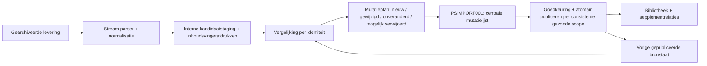
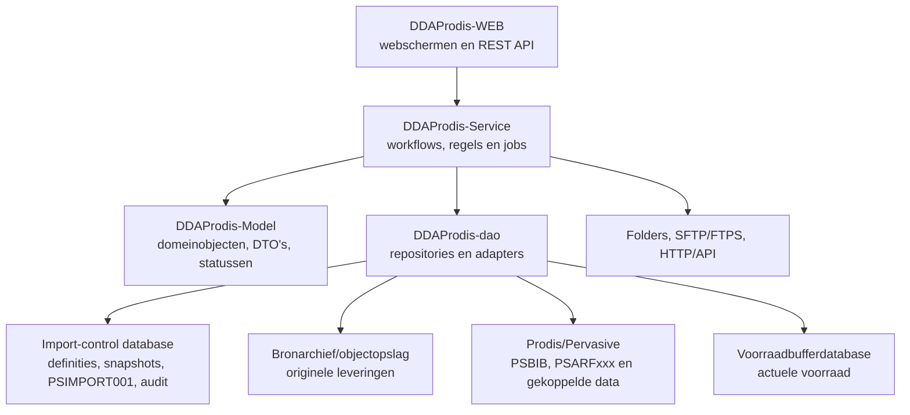

# Businessanalyse — import en beheer van leveranciersbibliotheken

Status: levend normatief bouwcontract — **klaar voor de afgebakende proefversie**  
Datum eerste versie: 14/09/2026  
Doel: normatieve specificatie voor een volledige nieuwe implementatie

## 1. Documentstatus en gebruik

Dit document wordt het centrale bouwcontract voor de nieuwe toepassing. Het beschrijft uiteindelijk de volledige functionele werking, businessregels, gegevensstructuur, gebruikersinteracties, uitzonderingen, controles, technische randvoorwaarden en acceptatietesten.

Historische analysepassages gebruiken drie zekerheidsniveaus:

- **Bevestigd**: expliciet door de domeineigenaar meegedeeld of rechtstreeks aangetoond in de legacybron.
- **Afgeleid**: logisch afgeleid uit de beschikbare broncode of configuratie; hoofdstuk 16 bepaalt de norm wanneer bevestiging ontbrak.
- **Open**: historische aanduiding uit de onderzoeksfase; na hoofdstuk 16 uitsluitend nog per-bronconfiguratie of verificatie-evidence, geen vrije implementatiekeuze.

De catalogus-/prijsproefversie mag op dit bouwcontract starten. Wanneer tijdens de implementatie toch een ontbrekende of tegenstrijdige businessregel wordt ontdekt, wordt eerst dit document gecorrigeerd en de impact op reeds gebouwde onderdelen bepaald. Concrete leveranciersmappings, credentials en golden resultaten blijven verplichte onboardingdata; zij mogen nooit door programmeeraannames worden ingevuld.

## 2. Businesscontext

### 2.1 Probleemstelling

Leveranciers en aankoopverenigingen leveren omvangrijke artikelcatalogi aan. Binnen Prodis worden deze catalogi **bibliotheken** genoemd. Eén levering kan meer dan één miljoen artikelen bevatten.

De aangeleverde gegevens zijn niet betrouwbaar genoeg om zonder controle rechtstreeks over te nemen:

- bestanden kunnen technisch of structureel fout zijn;
- afzonderlijke regels kunnen fout zijn;
- prijzen en andere waarden kunnen ontbreken of onwaarschijnlijk zijn;
- referentievelden kunnen fout, leeg, gewijzigd of inconsistent zijn;
- een leverancier kan dezelfde fout op een zeer groot aantal regels maken;
- een correctie moet daarom zowel individueel als in bulk kunnen worden uitgevoerd.

Het systeem moet onbetrouwbare brondata gecontroleerd omzetten naar betrouwbare, bruikbare en traceerbare Prodis-bibliotheken.

### 2.2 Hoofddoel

Een bevoegde Prodis-gebruiker moet zelf:

1. een bron kunnen registreren;
2. kunnen aangeven hoe bestanden worden aangeleverd;
3. het bestandstype en de structuur kunnen configureren;
4. velden uit de bron kunnen koppelen aan interne velden;
5. transformaties, controles en matchingregels kunnen beheren;
6. een import kunnen testen en uitvoeren;
7. fouten en twijfelgevallen kunnen onderzoeken;
8. iedere automatisch voorgestelde actie manueel kunnen uitvoeren of wijzigen;
9. dezelfde manuele actie in bulk kunnen toepassen op een geselecteerde verzameling regels;
10. het resultaat kunnen controleren, goedkeuren, toepassen, terugvinden en verklaren.

### 2.3 Centrale businessregel

> Important business rule discovered  
> De leverancierscatalogus is broninformatie, maar niet automatisch de waarheid. Een import mag de interne bibliotheek alleen wijzigen nadat de gegevens en de voorgenomen wijzigingen volgens configureerbare regels zijn gecontroleerd.

### 2.4 Schaalconstraint

> Important technical constraint discovered  
> De oplossing moet bestanden met meer dan één miljoen artikelregels verwerken. De architectuur moet daarom streaming of begrensde batches, efficiënte bulkdatabasebewerkingen, hervatbaarheid en controleerbare tussenresultaten ondersteunen. Het volledige bestand in werkgeheugen laden of per regel een los databaseproces uitvoeren is niet aanvaardbaar als basisontwerp.

## 3. Terminologie — normatief tenzij expliciet als legacyobservatie aangeduid

| Begrip | Voorlopige betekenis | Status |
|---|---|---|
| Bron | De geregistreerde oorsprong en aanleverwijze van catalogusgegevens, bijvoorbeeld leverancier, aankoopvereniging, FTP-locatie, lokaal bestand of API. | Bevestigd, verdere afbakening open |
| Leverancier | De commerciële partij waaraan een leveranciersnummer en leveranciersspecifieke artikelreferenties gekoppeld kunnen zijn. | Bevestigd |
| Aankoopvereniging | Een bronorganisatie die catalogusgegevens voor één of meerdere leveranciers kan aanleveren zonder zelf noodzakelijk verkoper te zijn. De concrete leveranciers- en bibliotheekscope is configuratiedata. | Bevestigd |
| Bibliotheek | Een logisch afgebakende Prodis-catalogus met bibliotheekartikelen, prijzen en bijbehorende artikelinformatie. In legacy heeft iedere bibliotheek een afzonderlijk fysiek `PSARFxxx`-bestand; dat is een technische partitionering en geen noodzakelijke businessgrens voor verwerking. | Bevestigd, datamodel open |
| Bibliotheekzoekleverancier | Het leveranciersnummer op de bibliotheekregistratie `PSBIB`, voornamelijk gebruikt om bibliotheken te zoeken en te filteren. Het komt in circa 98% van de gevallen overeen met de leverancier van de onderliggende bibliotheekartikelen; in circa 2% kan het bijvoorbeeld de aankoopvereniging zijn die de catalogus aanbiedt maar zelf geen artikelen verkoopt. | Bevestigd door gebruiker |
| Bibliotheekartikel | Een nog niet noodzakelijk operationeel catalogusartikel binnen een specifieke bibliotheek. De aanbiedingsidentiteit volgt het gekozen drie- of vierdelige profiel; kritieke referenties koppelen aanbiedingen indirect aan hetzelfde artikel. | Bevestigd |
| Artikel | De operationele vorm van een bibliotheekartikel in het centrale Prodis-artikelbestand. Het ontstaat normaal wanneer het bibliotheekartikel werkelijk wordt verkocht of aangekocht. Het kan ook op manuele vraag worden aangemaakt, maar dat levert op zichzelf geen zakelijke meerwaarde. | Bevestigd door gebruiker en legacyflow |
| Artikelpromotie | Het gecontroleerd materialiseren/kopiëren van een bibliotheekartikel naar een operationeel artikel, met behoud van de herkomst en de nodige leverancier-, prijs-, voorraad- en referentiekoppelingen. | Afgeleid uit legacyprogramma 956; term voor nieuw ontwerp |
| CAB-ID | Algemene externe sleutel die VROOAM als aankoopgroep gebruikt om artikelen over aangesloten partijen heen te identificeren. De sleutel wordt soms fout aangeleverd. | Bevestigd, formaat en uniciteit open |
| Supplementartikel | Een zelfstandig artikel, vaak uit een gespecialiseerde bibliotheek zoals Bebat, dat als bijkomend artikel of toeslag aan een ander artikel wordt gekoppeld. | Bevestigd, financiële semantiek open |
| Supplementrelatie | De relatie van een hoofdartikel naar een supplementartikel, met minstens referentie, volgnummer en mogelijk hoeveelheid en eigenschappen. | Afgeleid uit legacy, te bevestigen |
| Importdefinitie | Een configureerbare veldmapping die bronkolommen of bronposities omzet naar genormaliseerde importvelden en daarbij transformaties kan uitvoeren. | Bevestigd in legacy |
| Importbatch | Eén geregistreerde verwerkingspoging van één of meerdere ontvangen bronbestanden met een vaste configuratieversie. | Nieuw ontwerp, te bevestigen |
| Bronregel | De oorspronkelijke fysieke of logische record uit een ontvangen bestand. | Nieuw ontwerp, te bevestigen |
| Werkregel | De geïnterpreteerde en genormaliseerde vorm van een bronregel waarop validatie, correctie en matching worden uitgevoerd. | Nieuw ontwerp, te bevestigen |
| Bulkfout | Dezelfde of vergelijkbare fout die door de leverancier op veel bronregels werd gemaakt en via één gecontroleerde bulkactie kan worden gecorrigeerd. | Bevestigd |
| Bulk-identiteitsincident | Een systematische wijziging of fout in een externe identificatie, bijvoorbeeld een toegevoegde prefix voor duizenden `cab_id`- of PIM-ID-waarden, die als één patroon moet worden onderzocht en beslist. | Nieuw ontwerp, afgeleid uit businesscontext |

## 4. Onderzochte bronnen

### 4.1 Legacyprogramma's

De eerste analyse is gebaseerd op:

- `Prg_1232_Import_Artikelen_STOCK.md` — hoofdorchestratie;
- `Prg_1472_Interface_Settings.md` — registratie en configuratie van interfaces;
- `Prg_1223_Import_Artikelen_Auto.md` — automatische artikel-/bibliotheekroute;
- `Prg_1170_Import_Art_Import_PSIMPORT.md` — lezen, mappen en opbouwen van de importwerkfile;
- `Prg_1171_Import_Art_Controle_PSIMPORT.md` — controles vóór het definitief wegschrijven;
- `Prg_1172_Import_Art_Wegsch_art_PSIMPORT.md` — wegschrijven naar het centrale artikelbestand;
- `Prg_1179_Wegschrijven_bib_in_wacht.md` — wegschrijven naar een bibliotheek;
- `Prg_956_Creatie_Artikel_vanuit_Bib_B.md` — een bibliotheekartikel naar een operationeel artikel kopiëren;
- `Prg_885_Bibliotheken.md` — beheer van het centrale `PSBIB`-bibliotheekregister en de fysieke `PSARFxxx`-bestanden;
- `Prg_800_Bibliotheekartikelen.md` — detailstructuur van bibliotheekartikelen, inclusief leverancier per regel;
- `Prg_821_Controle_Externe_Lev_referenties.md` — achterafdetectie en manuele/bulkcorrectie van inconsistenties tussen bibliotheek-, artikel-, leverancier- en externe referenties;
- `Prg_1251_Write_import_article_STOCK.md` — eenvoudig stock-/prijsimportpad;
- `Prg_1267_Calculate_price_by_imp_STOCK.md` — selectie/berekening van een artikelprijs na import;
- `Prg_1185_Prijsupdate.md` — afgeleide verkoop-, aankoop- en brutoprijzen;
- de overige transitief aangeroepen legacyprogramma's zoals 1181, 1186, 249, 710, 896, 956, 961 en 996, voor zover relevant voor artikel-, groep-, supplement- en koppellogica.

Programma 1203 wordt vanuit 1232 nog genoemd, maar de aanroep is daar expliciet uitgeschakeld. Het geldt daarom niet als actief pad van 1232, maar blijft relevant als historische referentie.

De bestaande technische analyse `analyse-1472-create-stock-parameters-en-1232.md` blijft een ondersteunende bron. Dit document vertaalt de technische bevindingen naar een volledige business- en productspecificatie.

### 4.2 Aangeleverde voorbeeldconfiguratie

| Bestand | Inhoud | Records | Recordlengte |
|---|---|---:|---:|
| `ST_VROOAM_03453H.txt` | één interfaceheader | 1 | 857 |
| `ST_VROOAM_03453D.txt` | detailparameters | 104 | 225 |
| `ST_VROOAM_03453T.txt` | mappings/vertalingen | 86 | 241 |
| `Importdef_VROOAM2.csv` | importdefinitie `VROOAM2` | 37 | CSV met 15 kolommen |
| `02006_02006H/D/T.txt` | interfaceheader, 107 details en 84 vertalingen voor leverancier 02006 | 192 totaal | fixed-width exports |
| `Importdef_HT3101.csv` | importdefinitie voor interface 02006 | 36 | CSV met 15 kolommen |
| `06509_06509H/D/T.txt` | interfaceheader, 87 details en 84 vertalingen voor Bebat | 172 totaal | fixed-width exports |
| `Importdef_06509.csv` | importdefinitie voor Bebat | 20 | CSV met 15 kolommen |

De bestanden zijn fixed-width exports van de interfaceconfiguratie, niet de leverancierscatalogus zelf. Een in de export aanwezig geheim wordt niet in dit document overgenomen. Geheimen mogen in de nieuwe oplossing niet als leesbare configuratiewaarde worden geëxporteerd of gelogd.

### 4.3 Lokaal bronarchief

Alle voor deze analyse gebruikte aangeleverde bestanden, relevante legacyprogramma's, schermopnamen en de bestaande technische analyse zijn als ongewijzigde lokale kopie verzameld in [`sources`](./sources/README.md). De map bevat een inventaris en beveiligingsaandachtspunten.

## 5. Reconstructie van de legacyflow

### 5.1 Configuratiemodel

De legacyoplossing verdeelt de configuratie over minstens vier concepten:

1. **Interfaceheader (`InterfaceHeaders`)**
   - unieke interfacenaam;
   - import- of exportrichting;
   - bestandstype;
   - automatisch uitvoeren;
   - uit te voeren programma;
   - planning en uitvoeringsdagen/-tijden;
   - laatste uitvoering en gebruikersinformatie.
2. **Interfacedetails (`InterfaceDetail`)**
   - key/value-instellingen voor verbinding, bestanden, verwerking, doelbibliotheek, prijzen, controles, logging en opschoning.
3. **Interfacevertalingen (`InterfaceTranslations`)**
   - veldmapping zoals kolom, positie en lengte;
   - filters en berekeningen;
   - lijsten of selecties die niet goed in één detailwaarde passen;
   - in bepaalde gevallen leveranciers- of bestandsnaamspecifieke waarden.
4. **Importdefinitie (`Import Definitie`, legacy `PSIMPDEF`)**
   - de eigenlijke bron-naar-importveldmapping voor de uitgebreide bibliotheekroute;
   - per doelveld: kolom, positie, lengte, include/exclude, vaste waarde of functie, prefix, suffix en berekening;
   - ondersteuning voor tekst, gescheiden bestanden en XML.

> Important technical constraint discovered  
> De volledige bronstructuur zit in de legacy niet uitsluitend in `InterfaceSettings`. Bij `Create_Articles = B/BS` verwijst `ArtImp_Importsoort` naar een afzonderlijke importdefinitie. Voor het voorbeeld is dat `VROOAM2`. Deze definitie is inmiddels aangeleverd en bevat 37 mappings. Voor minstens één mapping is daarnaast de afzonderlijke tabel `Import Definitie map` (`PSIMPDEFMAP`) nodig.

### 5.2 Legacy hoofdroute in programma 1232

Programma 1232:

1. fixeert gebruiker, datum en tijd van de run;
2. leest alle interfaceparameters en mappings;
3. bepaalt de aanleverwijze: FTP, lokaal bestand of API/HTTP;
4. ondersteunt datumplaceholders in URL en bestandsnaam;
5. maakt een lokale `IN`- en jaargebonden archiefstructuur;
6. downloadt één bestand of een volledige FTP-map;
7. kan meerdere bestanden samenvoegen;
8. kan ZIP-bestanden uitpakken;
9. kan tabtekens vooraf vervangen;
10. kan voor testdoeleinden een bestand afkappen en schakelt dan verwijderacties uit;
11. kiest vervolgens een verwerkingsroute op basis van `Create_Articles`;
12. archiveert of verwijdert het verwerkte bestand volgens configuratie;
13. kan een terugkoppelbestand schrijven.

### 5.3 Routering op basis van `Create_Articles`

| Waarde | Legacygedrag | Relevantie |
|---|---|---|
| `B` of `BS` | Uitgebreide artikel-/bibliotheekroute via programma 1223. | Actief voor het VROOAM-voorbeeld |
| `N` of leeg/overig | Eenvoudig stock-/prijsimportpad: tellen, lezen, schrijven via 1251 en daarna oude stock opruimen. | Alternatief actief pad |
| `Y` | Historische route naar programma 1203, maar de aanroep is in 1232 uitgeschakeld. | Historisch/inactief |

### 5.4 Uitgebreide bibliotheekroute

Voor `B/BS` verloopt de actieve legacyketen als volgt:

```text
1232 Import Artikelen STOCK
→ 1223 Import Artikelen (Auto)
→ tijdelijke importwerkfile verwijderen/opnieuw aanmaken
→ 1170 bestand lezen en via importdefinitie mappen
→ 1171 geïmporteerde werkregels controleren
→ bij geslaagde controle:
   → 1179 naar bibliotheek schrijven (route B)
   of
   → 1172 naar centraal artikelbestand schrijven (route A)
→ oude/ontbrekende koppelingen of bibliotheekregels conditioneel opruimen
→ resultaatmemo en eventueel foutbericht/e-mail
```

### 5.5 Inlezen en mappen in programma 1170

Het bronbestand wordt eerst omgezet naar een tijdelijke importstructuur (`PSIMPORT` of een bibliotheekspecifieke variant). De importdefinitie kan per doelveld:

- een bronkolom kiezen;
- binnen die kolom een positie en lengte selecteren;
- een prefix en suffix toevoegen;
- een vaste waarde gebruiken;
- een functie of formule toepassen;
- een berekening uitvoeren;
- een include/exclude-regel toepassen;
- XML-paden en attributen lezen;
- bronwaarden naar hoofdartikel-, prijs-, voorraad-, staffel-, PIM- en supplementvelden mappen.

De legacywerkstructuur bevat onder meer:

- artikelgroep, artikelnummer, gestript nummer en meertalige omschrijvingen;
- leverancier, leveranciersgroep, leveranciersreferentie en leveranciersbarcode;
- algemene barcode, assortiment, genre en aanvullende classificaties;
- kortingscode, prijsbeleid, basisprijs, aankoopprijs, brutoprijs en verkoopprijzen;
- percentages, prijsdecimalen, coefficient en wisselkoers;
- eenheden, bestelhoeveelheid, inhoud en gewicht;
- minimum- en maximumvoorraad;
- depot, stock en zes prijsstaffels;
- afbeeldings-URL en vier informatievelden;
- externe PIM-identiteit en externe leveranciersidentiteit;
- alternatieven en supplementgegevens;
- een `Verwerken`-indicator die bepaalt of de regel verder mag.

#### 5.5.1 Beschikbare include-/excluderegels

De aanvullende legacydocumentatie bevestigt zes configureerbare vergelijkingen op een bronkolom:

| Operator | Betekenis |
|---|---|
| `Equals` | De bronwaarde moet exact gelijk zijn aan de filterwaarde. |
| `Does not equal` | De bronwaarde mag niet exact gelijk zijn aan de filterwaarde. |
| `Begins with` | De bronwaarde moet met de filterwaarde beginnen. |
| `Ends with` | De bronwaarde moet met de filterwaarde eindigen. |
| `Contains` | De bronwaarde moet de filterwaarde bevatten. |
| `Does not contain` | De bronwaarde mag de filterwaarde niet bevatten. |

Voor de nieuwe oplossing moet per filter bovendien expliciet worden vastgelegd:

- of de vergelijking hoofdlettergevoelig is;
- of spaties vooraf worden getrimd;
- hoe `null`, leeg en ontbrekende kolommen worden behandeld;
- welke tekencodering en locale gelden;
- of de regel de bronregel includeert, uitsluit of als fout markeert;
- welke fout- of uitsluitreden op de werkregel wordt bewaard.

#### 5.5.2 Beschikbare berekeningen en transformaties

De legacydocumentatie toont de volgende bewerkingen:

| Bewerking | Legacybedoeling | Aandachtspunt voor de nieuwe oplossing |
|---|---|---|
| Optellen, aftrekken, vermenigvuldigen, delen | Eenvoudige rekenkundige bewerking, bijvoorbeeld `+5`. | Type, afronding, decimalen en delen door nul moeten expliciet zijn. |
| `Map` | Een gevonden bronwaarde via een mapping naar een andere waarde vertalen. | De mappingversie, niet-gevonden-waarde en geldigheidsperiode moeten traceerbaar zijn. |
| `Delete` | De regel voor verwerking uitschakelen wanneer de waarde gelijk is aan de opgegeven waarde. | De regel blijft in staging bewaard met reden; fysiek verwijderen is niet toegestaan. |
| `Concatenate` | Meerdere bronkolommen in opgegeven volgorde tot één waarde samenvoegen. | Scheidingsteken, lege delen en maximale lengte moeten configureerbaar zijn. |
| `Percentage` | De waarde door een andere kolom delen en vermenigvuldigen met 100. | Vereist geldige teller en noemer; nul of ontbrekende noemer is een fout, geen stil resultaat nul. |
| `Split` | Een waarde op een scheidingsteken splitsen en het gekozen onderdeel nemen, bijvoorbeeld `|<i>5`. | Indexbasis, ontbrekend onderdeel en escaping moeten vastliggen. |
| `Num expr` | Complexe numerieke expressie met `<V>` voor de huidige waarde en `<Kx>` voor bronkolom x. | Alleen een beperkte, gevalideerde expressietaal; geen willekeurige code-uitvoering. |
| `String expr` / `Tekst expr` | Complexe tekstexpressie met `<V>` en `<Kx>`. | Zelfde veiligheids- en validatieregels als numerieke expressies. |

> Important technical constraint discovered  
> Een nieuwe configuratie-editor moet een formule bij registratie compileren/valideren en met voorbeeldregels kunnen testen. Een syntactisch geldige maar onuitvoerbare formule mag niet pas tijdens een miljoenenimport ontdekt worden.

#### 5.5.3 Veldvereisten uit de legacy-importdefinitie

De aanvullende documentatie groepeert doelvelden als volgt:

| Categorie | Veldnummers | Betekenis voor verwerking |
|---|---|---|
| Verplichte importvelden | `9, 10, 11` | Zonder leverancier, leveranciersgroep en leveranciersreferentie slaagt de import niet. |
| Extra sleutel | `23` | Kortingscode kan als aanvullend sleutelveld worden gebruikt. |
| Standaard voor artikel | `2, 4, 8, 45` | Artikelnummer, NL-omschrijving, alfanaam en facturatie-eenheid worden aanbevolen als bronmapping of vaste waarde. |
| Verplicht voor een volledig artikel | `13, 24, 25, 41, 45, 46, 49, 50, 51, 59` | Assortiment, prijsdecimalen, prijscode, brutoprijscode, facturatie-eenheid, bestelhoeveelheid, voorraaddecimalen, verkooprekening, BTW-code en aankooprekening moeten beschikbaar zijn voordat een nieuw artikel operationeel volledig is. |

De laatste twee categorieën zijn niet gelijk aan een technisch verplichte importsleutel. Volgens de legacytekst kan de import doorgaan, maar moeten ontbrekende artikelgegevens nadien in het artikelscherm worden aangevuld. De nieuwe oplossing moet daarom minstens onderscheid maken tussen:

1. **onverwerkbaar** — de regel mist de vereiste identiteit;
2. **verwerkbaar maar niet creatieklaar** — er is voldoende identiteit, maar onvoldoende data om automatisch een volledig artikel aan te maken;
3. **creatieklaar** — alle verplichte artikelgegevens zijn geldig;
4. **bestaand artikel bijwerkbaar** — ontbrekende creatievelden zijn niet noodzakelijk omdat een eenduidig bestaand artikel wordt bijgewerkt, voor zover het veldbeleid dat toestaat.

> Important business rule discovered  
> “Verplicht voor import” en “verplicht om een nieuw artikel volledig aan te maken” zijn verschillende controles en mogen niet tot één algemene foutstatus worden herleid.

In de legacy wordt een regel minstens afgewezen wanneer de gemapte leverancier of leveranciersreferentie leeg is. Andere afwijzingen komen uit filters, ontbrekende groepen, duplicatecontrole of latere bestaanscontroles.

### 5.6 Controles in programma 1171

Na het mappen voert de legacy onder meer deze controles uit:

- geen lege import;
- configureerbaar minimum- en maximumaantal bronregels;
- vergelijking van het aantal geldige importregels met de bestaande bibliotheekomvang;
- detectie van nieuwe of onbekende leveranciersgroepen;
- vergelijking van nieuwe en bestaande prijzen met een maximaal afwijkingspercentage;
- controle of een artikel of bibliotheekartikel al bestaat wanneer creëren niet is toegestaan;
- detectie van dubbele regels op leverancierssleutel;
- aanvullen van ontbrekende leveranciersgroep of kortingscode vanuit een bestaande match;
- verwijderen van werkregels waarvan `Verwerken = nee`.

De controle produceert vooral PDF-controlelijsten en een globale geslaagd/mislukt-uitkomst. Individuele foutregels worden daarna uit de tijdelijke import verwijderd.

> Important business rule discovered  
> Legacy maakt onderscheid tussen technische inlezing, inhoudelijke controle en definitief wegschrijven. Deze fasering moet behouden blijven, maar de nieuwe oplossing moet afgewezen regels en hun redenen bewaren in plaats van ze uit de werkset te verwijderen.

> Important technical constraint discovered  
> De aangetroffen legacyvoorwaarde voor `RecordCount_Tol%` lijkt de import te blokkeren wanneer de telling juist **binnen** de tolerantie ligt. Dit moet tegen de Magic-bron en het operationele gedrag worden geverifieerd; het mag niet blind worden gekopieerd.

### 5.7 Wegschrijven naar de bibliotheek in programma 1179

Programma 1179 is het centrale doelpad van de uitgebreide bibliotheekimport. Het leest de genormaliseerde records uit de door de gebruiker aangeduide `252 IMPORT`/`PSIMPORT`-werkfile en materialiseert die primair als bibliotheekgegevens. Het programma bevat daarnaast de synchronisatie met reeds bestaande operationele artikelen en hun gekoppelde bestanden.

> Important business rule discovered  
> Het doel van een catalogusimport is in de eerste plaats het opbouwen en onderhouden van bibliotheekartikelen. Een geldige importregel wordt niet automatisch een operationeel artikel. Het onderscheid bibliotheekartikel → artikel is een levenscyclusovergang, geen tweede naam voor hetzelfde importrecord.

Voor iedere geldige werkregel:

1. wordt een intern bibliotheeknummer gezocht of aangemaakt;
2. wordt de leveranciersgroep gekoppeld of, indien toegestaan, aangemaakt;
3. worden beschrijvingen, classificaties, leverancier en referenties bijgewerkt;
4. worden eenheden, voorraadkenmerken en aanvullende velden bijgewerkt;
5. worden prijsvelden volgens prijscode en prijsbeleid berekend;
6. worden wijzigingsdatums bijgehouden;
7. wordt geprobeerd het bibliotheekartikel aan een reeds bestaand operationeel artikel te koppelen;
8. worden PIM-, externe leverancier-, barcode-, stock- en supplementkoppelingen bijgewerkt;
9. worden niet-teruggevonden oude records conditioneel verwijderd.

De legacy kan voor het koppelen van een bibliotheekartikel aan een intern artikel verschillende referentietypes gebruiken:

| Code | Matchbasis |
|---|---|
| `EK` | externe PIM-ID |
| `ES` | externe leverancier/merk plus artikelreferentie |
| `B` | barcode, eerst in artikelen en daarna in artikel-leverancierkoppelingen |
| `R` | leveranciersreferentie, ook in gestripte vorm |

Na een gevonden kandidaat volgt nog een leverancierscontrole voordat een artikel-leverancierkoppeling wordt geschreven.

Dit is legacygedrag, nog geen goedgekeurde nieuwe matchstrategie. De prioriteit, uniciteit, conflictbehandeling en combinatie van deze sleutels moeten expliciet als businessregels worden ontworpen.

#### 5.7.1 Legacypartitionering per bibliotheek

De legacy verwerkt steeds één bibliotheek per programmarun. Dat is geen inhoudelijke eis van de catalogusimport, maar een beperking van de Pervasive/Magic-opbouw: dezelfde logische bibliotheekdatabase kon niet in één proces gelijktijdig op twee verschillende fysieke bestanden worden geopend.

De bibliotheekregistratie en bibliotheekdetails zijn fysiek gescheiden:

| Niveau | Legacy-opslag | Kenmerken |
|---|---|---|
| Bibliotheekregister | database `298:PSBIB`, fysiek `%prodis%PSBIB` | Eén record per bibliotheek met onder meer bibliotheeknummer, naam, leveranciersnummer en memo. |
| Bibliotheekdetails | logisch model `PSARFBIB`, fysieke bestanden `%BIB%PSARFxxx` | Dezelfde recordstructuur per bibliotheek, maar een afzonderlijk bestand zoals `PSARF001`, `PSARF095` of `PSARF097`. |

Legacyprogramma 885 bouwt de fysieke bestandsnaam op als `%BIB%PSARF` plus het driecijferige bibliotheeknummer. Programma 1171 telt op dezelfde manier dynamisch het bestand van de gekozen bibliotheek. Hoewel programmadocumentatie vaak het standaardmodel `%BIB%PSARF001` toont, wordt de feitelijke bibliotheek dus door het bibliotheeknummer en het overeenkomstige fysieke bestand bepaald.

Omdat het bibliotheeknummer impliciet in de bestandsnaam zit, hoeft een `PSARFxxx`-detailrecord zelf geen bibliotheeknummer te bevatten. Bij migratie naar één gedeelde relationele tabel moet `bibliotheek_id` daarom expliciet aan iedere detailregel en afgeleide relatie worden toegevoegd.

> Important technical constraint discovered  
> “Eén bibliotheek per import” is uitsluitend een legacy-uitvoeringsbeperking. De nieuwe oplossing mag een levering of importbatch over meerdere bibliotheken verwerken, mits iedere werkregel een eenduidige doelbibliotheek heeft en validatie, autorisatie, tellingen en opschoning per bibliotheekpartitie worden uitgevoerd.

#### 5.7.2 Bibliotheekzoekleverancier versus regelleverancier

`PSBIB` bevat op bibliotheekniveau een veld `Leveranciernr`. Dit veld dient voornamelijk om een bibliotheek via leverancier of aankoopvereniging te kunnen zoeken en filteren. Operationeel geldt volgens de gebruiker ongeveer deze verdeling:

- circa 98%: `PSBIB.Leveranciernr` komt overeen met de leverancier van de onderliggende bibliotheekartikelen;
- circa 2%: `PSBIB.Leveranciernr` verwijst bijvoorbeeld naar een aankoopvereniging die de catalogus aanbiedt, maar zelf geen artikelen verkoopt.

De detailstructuur `PSARFxxx` bevat per bibliotheekartikel afzonderlijk:

- `ARBIB_Leverancier`;
- `ARBIB_Leverancier_Referentie`;
- `ARBIB_Leverancier_Groep`;
- `ARBIB_Leverancier_Kortingcode`.

Het leveranciersnummer op `PSBIB` hoeft niet overeen te stemmen met `ARBIB_Leverancier` op iedere detailregel. Vooral een bibliotheek van een aankoopvereniging of samengestelde catalogus kan regels van meerdere leveranciers bevatten.

> Important business rule discovered  
> `PSBIB.Leveranciernr` is zoek-/selectiemetadata en geen normatieve leverancierssleutel. Het veld mag niet worden gebruikt om de leverancier van alle bibliotheekartikelen af te leiden, te overschrijven of te valideren. Voor matching, prijsregels, leveranciersgroepen en artikelpromotie is de leverancier van de detailregel leidend, tenzij een expliciete bronregel anders bepaalt.

Voor de nieuwe oplossing zijn dit daarom afzonderlijke relaties:

```text
Bibliotheek ── zoekleverancier of catalogusaanbieder
Bibliotheekartikel ── werkelijke leverancier van deze catalogusregel
Bibliotheekartikel ── leveranciersgroep, kortingscode en leveranciersreferentie
```

Een verschil tussen bibliotheekzoekleverancier en regelleverancier is op zichzelf geen fout of waarschuwing. Alleen een expliciet bronbeleid, bijvoorbeeld “deze bibliotheek mag uitsluitend leverancier X bevatten”, kan hiervan een validatieregel maken.

Deze scheiding is ook bepalend voor opschoning. Wanneer één bron slechts een deel van een bibliotheek beheert, mag “niet meer aangeleverd” uitsluitend worden toegepast op detailregels waarvoor die bron aantoonbaar eigenaar is. De leverancier op `PSBIB` is onvoldoende bewijs van eigenaarschap. Iedere bibliotheekregel moet daarom herleidbaar zijn tot bron, configuratieversie en laatste geldige importbatch.

> Important technical constraint discovered  
> Destructieve synchronisatie moet minimaal worden begrensd door `bron + doelbibliotheek + door die bron beheerde records`. Een volledige bibliotheek leegmaken of beëindigen op basis van alleen het `PSBIB`-leveranciersnummer is niet toegestaan.

#### 5.7.3 Primaire en gekoppelde gegevensbestanden

1179 gebruikt `IMPORT`/`PSIMPORT` als stagingbron en schrijft of onderhoudt, afhankelijk van configuratie en gevonden relaties, minstens de volgende gegevensgebieden:

| Gebied | Legacybestand/tabel | Rol |
|---|---|---|
| Bibliotheekartikel | `PSARFBIB` / `%BIB%PSARF001` | Primaire catalogusrecord met identiteit, omschrijvingen, classificatie, eenheden en prijzen. |
| Leveranciersgroepdefaults | `PSGRPIMP` | Levert of ontvangt groep-, kortings- en standaardpercentages; een ontbrekende groep kan conditioneel worden aangemaakt via programma 1186. |
| Bibliotheekstock/-prijsstock | `PSARFSPB` | Stock- en prijsinformatie op bibliotheekniveau per leverancier/depot. |
| Operationeel artikel | `PSARFNAW` / `ARTICLES` | Wordt alleen bijgewerkt wanneer een bestaand artikel eenduidig is gekoppeld en artikelupdate is toegestaan. |
| Artikel-leverancier | `PSARFLEV` | Multi-suppliergegevens, voorkeuren en prijsinformatie per artikel/leverancier. |
| Artikel-leverancier-referentie | `PSARFLER` | Referentiekoppeling tussen artikel, leverancier, leveranciersreferentie, groep en kortingscode. |
| Artikel-leverancier-barcode | `PSARFLEB` | Leveranciersbarcodes gekoppeld aan een operationeel artikel. |
| Operationele voorraad | `PSARFVRD` | Onder meer minimum- en maximumvoorraad voor het operationele artikel. |
| Supplier price/stock | `PSARFSPS` | Leveranciersprijs en stock per operationeel artikel, leverancier en depot. |
| Externe PIM-identiteit | `EXTPIMID1` | Externe PIM-ID voor een bibliotheekartikel of operationeel artikel. |
| Externe leveranciersidentiteit | `E_SUPP_ART` | Koppeling met een externe leverancier-/artikelidentiteit. |
| Externe barcode | `EXTBARCODES` | Barcode-identiteiten voor bibliotheek- of operationele artikelen. |
| Alternatieven | `PSARFALT` | Relaties tussen operationele alternatieve artikelen. |
| Supplementen | `PSARFSUP` | Operationele multi-supplementrelaties. |
| Minimumaantal korting | gekoppelde minimumaantaltabel | Minimumhoeveelheid voor korting op het operationele artikel. |
| Run-/verwijderwerkset | `ARTICLESRT` | Tijdelijke markering voor expliciete verwijderfuncties en batchopschoning. |

Deze bestanden vormen samen één logisch resultaat. De nieuwe oplossing mag een regel daarom niet als succesvol markeren wanneer alleen `PSARFBIB` is geschreven maar verplichte gekoppelde mutaties gedeeltelijk zijn mislukt. Per regel en batch moet zichtbaar zijn welke mutaties gepland, uitgevoerd, overgeslagen, mislukt of teruggedraaid zijn.

#### 5.7.4 Relatie met bestaande operationele artikelen

Wanneer `P_Update Artikel` actief is, zoekt 1179 via `PSARFLER` of het bibliotheekartikel al aan een operationeel artikel verbonden is. Alleen als een intern artikelnummer bestaat, worden artikelgegevens en prijzen bijgewerkt. Daarbij spelen de aankoop- en verkoopvoorkeursleverancier een belangrijke rol:

- basis- en aankoopprijs worden alleen via de geschikte aankoopvoorkeur doorgeschreven;
- verkoopprijzen en -percentages volgen de verkoopvoorkeur;
- wanneer aankoop- en verkoopvoorkeur bij verschillende leveranciers liggen, kan 1179 percentages van de verkoopvoorkeur ophalen;
- gekoppelde voorraad, supplementen, PIM-ID, externe leveranciersidentiteit en barcodes kunnen mee worden bijgewerkt;
- lege centrale artikelvelden kunnen vanuit het bibliotheekartikel worden aangevuld, terwijl bestaande waarden vaak behouden blijven.

> Important business rule discovered  
> Een leveranciercatalogus mag de centrale artikelprijzen niet zonder meer overschrijven. Of een geïmporteerde leveranciersprijs mag doorstromen naar het operationele artikel hangt af van de aankoop-/verkoopvoorkeur, prijscode, prijspolitiek en beschikbare prijscomponenten.

#### 5.7.5 Koppelen zonder automatisch een artikel te creëren

Als nog geen multi-supplierkoppeling werd gevonden en `P_MS_CREATE` actief is, probeert 1179 een bestaand artikel te herkennen. De configureerbare referentietypes zijn externe PIM-ID (`EK`), externe leverancier (`ES`), barcode (`B`) en leveranciersreferentie (`R`, inclusief gestripte vorm). Na een kandidaatmatch controleert 1179 de leverancier en kan het vervolgens `PSARFLER`, `PSARFLEV`, `PSARFLEB` en stockgegevens schrijven.

Dit creëert een nieuwe leveranciersrelatie naar een bestaand artikel; het creëert niet automatisch voor iedere catalogusregel een nieuw record in `ARTICLES`.

> Important technical constraint discovered  
> “Artikel gevonden”, “nieuwe leverancier aan bestaand artikel gekoppeld” en “nieuw operationeel artikel gecreëerd” zijn drie verschillende uitkomsten. Zij vereisen afzonderlijke statussen, auditgebeurtenissen en autorisatieregels.

#### 5.7.6 Promotie van bibliotheekartikel naar artikel

De eigenlijke creatie van een operationeel artikel vanuit een bibliotheekartikel gebeurt in de aangetroffen legacy via programma 956. Dit programma:

1. leest het bibliotheekartikel;
2. controleert of al een artikel of leverancier-referentiekoppeling bestaat;
3. kent alleen bij werkelijke creatie een nieuw intern artikelnummer toe;
4. kopieert de relevante bibliotheekvelden naar `ARTICLES`;
5. maakt de voorraadstructuur aan;
6. schrijft de multi-supplier- en leverancier-referentiekoppelingen;
7. neemt supplier-price-stock over;
8. retourneert het bestaande artikel wanneer de relatie al bestond.

De aanroepen tonen verschillende triggers:

- verwerking van een elektronische order in programma 2330;
- import/verwerking van verkoop-, factuur- of aankoopregels in programma 462;
- noodzakelijke creatie van gekoppelde PIM- of supplementartikelen;
- expliciete manuele/bulkcreatie via programma 2550 of een volledige bibliotheekkopie via programma 2367.

Dit bevestigt de door de gebruiker beschreven hoofdregel: een bibliotheekartikel wordt normaal pas een artikel wanneer commercieel gebruik — verkoop of aankoop — dat vereist. Manuele promotie blijft technisch mogelijk, maar creëert zonder concrete operationele behoefte geen zakelijke meerwaarde.

> Important business rule discovered  
> Automatische catalogusimport mag geen massale artikelcreatie veroorzaken. De standaardlevenscyclus is `bibliotheekartikel beschikbaar` → `gekozen in verkoop/aankoop` → `operationeel artikel gecreëerd of bestaand artikel hergebruikt`.

Voor het nieuwe ontwerp moet promotie idempotent zijn: herhaalde verwerking van dezelfde order, aankoopregel of manuele opdracht moet hetzelfde operationele artikel teruggeven en mag geen duplicaat creëren.

#### 5.7.7 Normatieve artikelpromotieflow

Artikelpromotie is een afzonderlijk proces naast cataloguspublicatie. Een geldige cataloguspublicatie kan een bibliotheekaanbieding dus wel aanmaken of wijzigen, maar zet nooit zelf een `ARTICLES`-mutatie klaar.

| Onderdeel | Vastgelegde regel |
|---|---|
| Toegelaten triggers | Een concrete verkoopregel, aankoopregel of andere expliciete operationele vraag. Een bevoegde gebruiker mag eveneens individueel of in bulk promotie aanvragen. |
| Geen automatische massapromotie | Het opnieuw inlezen van een catalogus, een prijswijziging, een match op EAN/PIM/CAB of een gevonden bestaand artikel is op zichzelf geen promotietrigger. |
| Zoekvolgorde | Zoek eerst een reeds gekoppeld operationeel artikel via de bestaande, toegelaten relaties. Bestaat er een eenduidige match, hergebruik dat artikel en maak hoogstens de ontbrekende leveranciersrelatie aan. |
| Geen eenduidige match | Maak slechts na de operationele trigger een nieuw centraal artikel aan; de promotie gebruikt de bibliotheekaanbieding als bron en legt bronbibliotheek, aanbieding en reden vast. |
| Ambigue of kritieke referentie | Geen automatische koppeling of creatie. Maak een identiteitsincident of een manueel beoordelingsvoorstel. |
| Te kopiëren gegevens | Alleen velden waarvoor de promotiematrix een expliciete route naar `ARTICLES`, `PSARFLEV`, `PSARFLER`, `PSARFLEB`, voorraadstructuur of operationele supplementrelatie bevat. Kritieke referenties worden gevalideerd, niet blind overschreven. |
| Prijzen | Een catalogusprijs **mag** binnen dezelfde `252 IMPORT`-/WebBase-publicatie naar het centrale artikel doorstromen wanneer de gekoppelde bibliotheekaanbieding op dat moment voorkeursleverancier voor aankoopprijs en/of verkoopprijs is. De bestaande Prodis-uitvoerder bepaalt per prijscomponent wat mag wijzigen; prijscontrole en prijsbeleid blijven verplicht. |
| Herhaling | De idempotentiesleutel bevat minstens triggerbron/-id, bibliotheekaanbieding en promotiedoel. Herhaling geeft hetzelfde centrale artikel terug en verdubbelt geen relatie. |
| Controle en audit | Elke promotie krijgt een eigen mutatieplan, voor/na-waarden, koppelmethode, gebruikte bewijsreferenties, goedkeuring waar nodig en resultaatstatus. |

Een nieuw centraal artikel is dus een gevolg van commercieel gebruik, niet van het bestaan van catalogusdata. Daardoor blijven miljoenen bibliotheekaanbiedingen licht, terwijl enkel werkelijk gebruikte artikelen operationele structuren en onderhoud krijgen.

#### 5.7.8 Artikelupdatestap binnen dezelfde publicatieverwerking

De bibliotheekimport mag na een geslaagde bibliotheekmutatie binnen dezelfde `252 IMPORT`-/WebBase-verwerking een **idempotente artikelupdate-opdracht** uitvoeren. Dit is geen brede tabelwrite vanuit de delta-engine: de bestaande Prodis-uitvoerder bepaalt of een gekoppeld operationeel artikel bestaat, welke voorkeurrelatie actief is en welke mutaties daardoor toegelaten zijn.

| Situatie na update van een bibliotheekaanbieding | API-actie |
|---|---|
| Geen gekoppeld centraal artikel | Geen prijswrite. Alleen een expliciete verkoop-/aankooptrigger of bevoegde promotieopdracht kan artikelcreatie vragen. |
| Gekoppeld artikel, bron is aankoopvoorkeursleverancier | Laat de artikelservice de toegelaten aankoopprijscomponenten en daarvan afgeleide percentages bijwerken. |
| Gekoppeld artikel, bron is verkoopsvoorkeursleverancier | Laat de artikelservice de toegelaten verkoopprijscomponenten en daarvan afgeleide percentages bijwerken. |
| Bron is zowel aankoop- als verkoopsvoorkeur | Beide regels zijn toepasselijk, per component en volgens prijsbeleid. |
| Bron is geen relevante voorkeur | Catalogusprijs blijft in de bibliotheek; geen centrale prijswrite. |
| Prijsincident, ontbrekende koppeling of onzekere voorkeur | Geen centrale prijswrite; de bibliotheekmutatie volgt haar eigen publicatiebeleid en het issue blijft zichtbaar. |

Elke API-opdracht bevat minstens de bibliotheekaanbieding, het gekoppelde artikel indien bekend, de publicatiebundel, mutatie-id, prijscomponenten, voor/na-waarden, definitieversie en idempotentiesleutel. Zij kan zo dezelfde cataloguswijziging veilig opnieuw ontvangen zonder dubbel effect. Artikelcreatie, het aanmaken van leveranciersrelaties en het bijwerken van een bestaand artikel zijn afzonderlijke opdrachtsoorten, maar mogen allemaal vanuit de bibliotheekpublicatie worden aangestuurd wanneer hun expliciete voorwaarden zijn voldaan.

### 5.8 Eenvoudig stock-/prijsimportpad

Wanneer de uitgebreide artikelroute niet wordt gekozen:

1. telt 1232 het bestand;
2. leest het iedere regel volgens `Column`, `Position` en `Lenght` uit de interfacevertalingen;
3. past optionele berekeningen en filters toe;
4. roept 1251 aan voor geldige regels;
5. 1251 zoekt artikelen in één of meerdere bibliotheken;
6. schrijft leveranciersstock en bibliotheekstock;
7. kan de basisprijs volgens laagste/hoogste/altijd-regels herberekenen;
8. ruimt na afloop records op die niet de datum/tijdmarkering van de huidige run hebben.

Dit pad is gevaarlijk wanneer een onvolledig of verkeerd geïnterpreteerd bestand toch als geldig wordt beschouwd: ontbrekende artikelen kunnen dan als niet meer geleverd worden behandeld. De nieuwe oplossing mag destructieve synchronisatie pas uitvoeren na expliciete volledigheidscontroles en goedkeuring.

### 5.9 Achterafcontrole in programma 821

Programma 821 `Controle Externe Lev referenties` werd gebouwd om na verwerking inconsistenties zichtbaar en herstelbaar te maken. Het vertrekt vanuit operationele artikelen met een externe PIM-ID en vergelijkt meerdere opgeslagen representaties van dezelfde leveranciersidentiteit:

```text
ARTICLES centraal artikel
↔ PSARFLEV artikel/leverancier
↔ PSARFLER artikel/leverancier/externe referentie
↔ PSARFxxx bibliotheekartikel via externe PIM-ID
↔ E_SUPPLIER_ARTICLE externe leverancier/merkenreferentie
```

De gebruiker kan de controle beperken tot een leverancier en leveranciersgroep, al dan niet inclusief multi-supplierrecords. Er kan optioneel ook met de gestripte leveranciersreferentie worden vergeleken.

#### 5.9.1 Gevonden inconsistentiefamilies

De code en het controlescherm tonen minstens de volgende fout- en inconsistentiefamilies:

| Familie | Vergelijking of probleem |
|---|---|
| Ontbrekende extra leveranciersreferentie | Voor een bestaand `PSARFLEV`-record ontbreekt het bijbehorende `PSARFLER`-record. |
| Verschil multi versus extra referentie | Leveranciersreferentie, gestripte referentie, leveranciersgroep of kortingscode verschilt tussen `PSARFLEV` en `PSARFLER`. |
| Verschil bibliotheek versus multi | Referentie, groep of kortingscode van het bibliotheekartikel verschilt van `PSARFLEV`. |
| Verschil bibliotheek versus extra referentie | Referentie, groep of kortingscode van het bibliotheekartikel verschilt van `PSARFLER`. |
| Externe leverancier inconsistent | `E_SUPPLIER` en externe artikelreferentie verschillen tussen centraal artikel, bibliotheek of `E_SUPPLIER_ARTICLE`. |
| Referentie wijst naar ander artikel | De bibliotheek- of multi-leveranciersreferentie wordt ook bij een ander intern artikel gevonden. |
| Artikelidentiteit verschilt | Bibliotheekartikelcode en centrale artikelcode of hun gestripte vormen zijn niet identiek waar dat wel werd verwacht. |
| Voorkeursleverancier geraakt | De inconsistente relatie is de aankoopvoorkeur; een correctie kan daardoor centrale referentie, groep, omschrijving of artikelcode wijzigen. |
| Ontbrekende multi-leverancier | Een verwachte `PSARFLEV`-relatie ontbreekt, waardoor een extra referentie niet veilig kan worden herbouwd. |
| Dubbele sleutel/index | Herbouw botst op een reeds bestaande combinatie voor artikel, leverancier, referentie, groep en kortingscode. |
| Correct record bestaat naast fout record | De juiste `PSARFLER`-combinatie bestaat al, terwijl ook een afwijkende of dubbele relatie aanwezig is. |
| Ongeldige of ontbrekende gestripte referentie | De normale referentie bestaat, maar de genormaliseerde/gestripte variant ontbreekt of wijkt af. |

Programma 821 beschrijft daarmee de belangrijke **cross-database referentie-inconsistenties**. Het is niet de volledige fouttaxonomie van een leveranciersimport: technische bestandsfouten, ontbrekende kolommen, ongeldige getallen, prijsafwijkingen, supplementproblemen en volumecontroles komen uit andere delen van de importflow.

#### 5.9.2 Huidige herstelacties

Het controlescherm ondersteunt individuele en bulkacties:

- leveranciersgroep en kortingscode vanuit het bibliotheekartikel overnemen;
- de CAB-/bibliotheekreferentie overnemen in multi-leverancier, extra referentie en bij aankoopvoorkeur ook het centrale artikel;
- `PSARFLER` verwijderen en opnieuw opbouwen vanuit `PSARFLEV`;
- dezelfde herbouw alleen uitvoeren wanneer artikelcodes identiek zijn, of voor alle geselecteerde records;
- een multi-leveranciersrelatie verwijderen;
- een externe TecDoc/e-supplierrelatie verwijderen en opnieuw creëren;
- rechtstreeks het betrokken bibliotheekartikel of operationele artikel openen;
- filteren op leverancier, groep, kortingscode, identieke artikelcode, aankoopvoorkeur, verwijzing naar een ander artikel en verschillen tussen de gekoppelde bestanden.

Sommige acties kunnen centrale artikelvelden wijzigen, waaronder artikelcode, gestripte code, leveranciersreferentie, groep, kortingscode, omschrijving en alfanaam. Dat zijn geen onschuldige technische reparaties; hun zakelijke impact moet vooraf zichtbaar zijn.

> Important business rule discovered  
> Een referentiefout kan tegelijk meerdere opgeslagen representaties raken. Een herstelbeslissing moet daarom één samenhangend mutatieplan opleveren voor bibliotheekartikel, artikel, multi-leverancier, extra referenties en externe koppelingen. Losse veldcorrecties mogen geen nieuwe onderlinge inconsistentie creëren.

#### 5.9.3 Legacygedrag dat niet mag worden overgenomen

- De controle gebeurt nadat de betrokken gegevens reeds zijn geïmporteerd.
- Afwijkingen worden in een tijdelijke geheugentabel `SUPPLIER_REF_CHECK` verzameld en vormen geen blijvend issue- en auditregister.
- Bij een ontbrekende `PSARFLER` maakt de scan zelf al een record aan; detectie is dus niet zuiver read-only.
- Bulkherbouw verwijdert `PSARFLER` en creëert het opnieuw zonder een vooraf bewaard, atomair mutatieplan.
- Een bulkactie kan CAB-/bibliotheekgegevens tot in het centrale voorkeursartikel doorduwen.
- De legacycode bevat redundante vergelijkingen en minstens één verdachte veldtoewijzing in `Update van ARBIB`, waar een kortingscode naar een groepsveld lijkt te worden geschreven. Dit moet niet worden gekopieerd.

> Important technical constraint discovered  
> Pre-importcontrole moet productiedata volledig read-only analyseren. Geen ontbrekende koppeling mag tijdens detectie automatisch worden aangemaakt, verwijderd of herschreven. Iedere voorgestelde mutatie wordt eerst persistent opgeslagen, gevalideerd, getoond en volgens autorisatie goedgekeurd.

## 6. Analyse van de voorbeeldinterface `ST_VROOAM_03453`

### 6.1 Bevestigde configuratiekenmerken

- uitvoerprogramma: legacyprogramma 1232;
- richting: import;
- type: CSV;
- aanlevering: FTP;
- volledige FTP-map verwerken: ja;
- bestandsselectie: wildcard voor tekstbestanden;
- meerdere bestanden worden ondersteund;
- scheidingsteken: tab;
- één headerregel overslaan;
- doel: bibliotheekroute (`Create_Articles = B`);
- importdefinitie: `VROOAM2`;
- doelbibliotheek: `00066`;
- leverancier in interfacedetails: `05000`;
- leverancierswaarde in vertalingen: `03453`;
- leveranciersgroep mag worden aangemaakt;
- artikelen mogen worden aangemaakt;
- matchingsegmenten leverancier, leveranciersreferentie en leveranciersgroep staan aan;
- kortingscode en barcode maken volgens deze configuratie geen deel uit van de importsleutel;
- oude bibliotheekregels mogen worden verwijderd (`BIB_Delete = Y`);
- supplementen worden opgeschoond;
- excludes en duplicatecontrole worden volgens de legacyvlaggen overgeslagen;
- minimum, maximum en relatieve recordtolerantie staan op nul en bieden hier dus geen bescherming;
- e-mailwaarschuwing staat uit;
- het bronbestand wordt na verwerking gearchiveerd;
- geheimen zijn als leesbare waarden aanwezig in de legacy-export.

### 6.2 Belangrijke observaties

1. De generieke `Column`-waarden voor de standaard stockvelden zijn leeg; alleen `Position = 1` en `Lenght = 100` zijn gevuld. Dit bevestigt dat de uitgebreide `VROOAM2`-importdefinitie de eigenlijke catalogusstructuur bepaalt.
2. De interface bevat zowel een algemene leverancier (`05000`) als een leverancierswaarde (`03453`) in de vertalingen. Hun verschillende businessrollen moeten worden verklaard.
3. `BIB_Delete = Y` staat aan terwijl alle tellingdrempels nul zijn. Een onvolledig bestand kan daardoor in principe een destructieve opschoning veroorzaken.
4. Duplicate- en excludecontroles worden overgeslagen. Dit is alleen veilig wanneer de bron of importdefinitie daar elders sluitende garanties voor geeft.
5. De configuratie bevat geen veilige scheiding tussen verbindingseigenschappen en geheimen.

### 6.3 Importdefinitie `VROOAM2`

De CSV bevat 37 unieke doelveldnummers. Er zijn geen dubbele doelveldnummers. Alle regels hebben dezelfde set van 15 configuratiekolommen.

De definitie gebruikt bronkolommen tot en met kolom 55. Omdat `Positie` en `Lengte` overal nul zijn, wordt telkens de volledige waarde van de geselecteerde, tabgescheiden bronkolom gebruikt.

#### 6.3.1 Rechtstreekse bronmappings

| Doelnr. | Intern importveld | Bronkolom | Verwerking |
|---:|---|---:|---|
| 2 | Artikelnummer | 11 | hoofdletters |
| 4 | Nederlandse omschrijving | 9 | rechtstreeks |
| 8 | Alfanaam | 9 | hoofdletters |
| 9 | Leverancier | 40 | via `PSIMPDEFMAP` vertaald, calculation `7` |
| 10 | Leveranciersgroep | 43 | hoofdletters |
| 11 | Leveranciersreferentie | 42 | hoofdletters; verplicht in legacy |
| 12 | Leveranciersbarcode | 12 | rechtstreeks |
| 15 | Genre 1 | 5 | rechtstreeks |
| 16 | Genre 2 | 7 | rechtstreeks |
| 17 | Genre 3 | 6 | rechtstreeks |
| 26 | Basisprijs | 45 | numerieke conversie |
| 33–37 | Verkoopprijspercentage 1–5 | 49 | bronkolom 49 gedeeld door basisprijs in kolom 45, maal 100 |
| 39 | Aankoopprijs | 47 | gebruik kolom 48 wanneer die niet `0` is, anders kolom 47 |
| 40 | Aankoopprijspercentage | 47 | gekozen aankoopprijs gedeeld door kolom 45, maal 100 |
| 52 | Populariteit | 50 | rechtstreeks |
| 219 | Externe PIM-ID | 4 | rechtstreeks |
| 220 | Alternatieven | 14 | aanvullende PIM-relaties |
| 221 | Externe leverancier/merk | 18 | numerieke conversie |
| 300 | PIM-supplement A | 53 | rechtstreeks |
| 301 | PIM-supplement B | 54 | rechtstreeks |
| 302 | PIM-supplement C | 55 | rechtstreeks |

#### 6.3.2 Vaste waarden

| Doelnr. | Intern importveld | Vaste waarde | Legacybetekenis |
|---:|---|---|---|
| 13 | Assortiment | `V` | legacy vaste waarde; betekenis niet raden, als configureerbare stamdatawaarde migreren en valideren |
| 14 | Genre | `079` | vaste artikelclassificatie |
| 24 | Aantal prijsdecimalen | `3` | prijzen worden op drie decimalen beheerd |
| 25 | Prijscode | `0` | procentuele prijsberekening |
| 41 | Bruto prijscode | `0` | brutoadviesprijs wordt procentueel berekend |
| 45 | Facturatie-/verkoop-/besteleenheid | `ST` | stuk |
| 46 | Bestelhoeveelheid | `1` | standaard één |
| 49 | Aantal voorraaddecimalen | `2` | voorraadhoeveelheden met twee decimalen |
| 50 | Verkooprekening | `704500` | boekhoudkundige betekenis te bevestigen |
| 51 | BTW-code | `3` | betekenis/tarief en geldigheidsperiode te bevestigen |
| 59 | Aankooprekening | `604500` | boekhoudkundige betekenis te bevestigen |

#### 6.3.3 Regel-filter

Doelveld 901 (`Extra 2`) leest bronkolom 3 en gebruikt include/exclude-code `1` met waarde `BENL`.

In legacy betekent code `1`: markeer de werkregel als niet te verwerken wanneer de bronwaarde niet exact gelijk is aan de ingestelde waarde. Alleen regels waarvoor bronkolom 3 na trimmen gelijk is aan `BENL` blijven dus in de import.

> Important business rule discovered  
> De VROOAM2-definitie importeert uitsluitend de `BENL`-populatie uit het aangeleverde bestand. Deze filter is onderdeel van de datasetafbakening, niet alleen een technische veldmapping. De betekenis van `BENL` en de gewenste hoofdlettergevoeligheid moeten nog worden bevestigd.

#### 6.3.4 Leveranciervertaling

Bronkolom 40 wordt niet rechtstreeks als Prodis-leverancier opgeslagen. Calculation `7` zoekt de bronwaarde op in `PSIMPDEFMAP` voor importdefinitie `VROOAM2` en vervangt ze door de gemapte waarde.

Als geen mapping wordt gevonden, laat de legacycode de oorspronkelijke bronwaarde staan. Alleen een lege uiteindelijke leverancier wordt afgewezen. Een onbekende maar niet-lege leverancierscode kan daardoor verder worden verwerkt.

> Important business rule discovered  
> Een ontbrekende leveranciervertaling mag in de nieuwe oplossing niet stilzwijgend terugvallen op de oorspronkelijke externe code. De regel moet minstens de status `onbekende leveranciermapping` krijgen en mag pas verder na een expliciete mapping of gebruikersbeslissing.

De inhoud van `PSIMPDEFMAP` voor `VROOAM2` is niet in de beschikbare export aanwezig. Dit is een verplichte onboarding-verificatie: vóór activering wordt de mapping via database-export, bestand of domeinbevestiging gereconstrueerd; zij wordt nooit geraden.

#### 6.3.5 Prijsberekening

De VROOAM2-definitie gebruikt een procentueel prijsmodel:

```text
basisprijs = numerieke waarde van bronkolom 45
verkoopprijsbron = numerieke waarde van bronkolom 49
verkooppercentage 1 t/m 5 = verkoopprijsbron / basisprijs × 100

gekozen aankoopprijs =
    bronkolom 48, wanneer bronkolom 48 niet gelijk is aan 0
    anders bronkolom 47

aankooppercentage = gekozen aankoopprijs / basisprijs × 100
```

Programma 1185 berekent vervolgens voor prijscode `0`:

```text
verkoopprijs n = afronden(basisprijs × verkooppercentage n / 100 × coefficient)
aankoopprijs   = afronden(basisprijs × aankooppercentage / 100 × coefficient)
```

Omdat alle vijf verkooppercentages uit dezelfde bronkolom 49 worden berekend, worden de vijf verkoopprijzen in beginsel identiek, tenzij latere logica ze anders beïnvloedt.

Er is geen rechtstreekse VROOAM-mapping voor brutoprijs of brutopercentage. Bij bruto prijscode `0` gebruikt programma 1179 daarom het bestaande of vanuit de leveranciersgroep opgehaalde standaard-brutopercentage.

> Important technical constraint discovered  
> De legacyconversies gebruiken `Val(...)`. Ongeldige of lege prijswaarden kunnen daardoor als nul eindigen. Calculation `A` en calculation `11` delen door bronkolom 45 zonder zichtbare voorafgaande nulcontrole. De nieuwe oplossing moet lege waarde, geldige nul, ongeldig getal en deling door nul als verschillende toestanden behandelen.

> Important business rule discovered  
> Prijsberekeningen mogen niet worden uitgevoerd zolang basisprijs, gekozen aankoopprijs en verkoopprijsbron niet afzonderlijk geldig zijn verklaard. Een fout mag nooit stil naar nul worden omgezet of met een eerder opgeslagen prijs worden gemengd zonder expliciete regel.

### 6.4 Ontbrekende VROOAM-evidence voor onboarding

Voor een exacte reconstructie ontbreken nog:

- de `PSIMPDEFMAP`-regels voor importdefinitie `VROOAM2`, minimaal voor leveranciersmapping uit bronkolom 40;
- een werkelijk VROOAM-catalogusbestand met minstens de gebruikte kolommen 3, 4, 5, 6, 7, 9, 11, 12, 14, 18, 40, 42, 43, 45, 47, 48, 49, 50, 53, 54 en 55;
- de businessbetekenis van bronkolommen en hun officiële leverancierskolomnamen;
- bevestiging van `BENL`, assortiment `V`, genre `079`, BTW-code `3` en de twee grootboekrekeningen.

### 6.5 Drie bevestigde bronpatronen

De aangeleverde voorbeelden tonen dat het nieuwe systeem minstens drie wezenlijk verschillende bronpatronen moet ondersteunen.

| Patroon | Voorbeeld | Identificatie | Bijzonder gedrag |
|---|---|---|---|
| Aankoopgroep | VROOAM | leverancier + leveranciersgroep + kortingscode + leveranciersreferentie; `cab_id` als artikelreferentie | één bestand kan gegevens over meerdere aangesloten partijen bevatten; de algemene sleutel kan fout worden aangeleverd |
| Zelfstandige leverancier | 02006 | leverancier + leveranciersgroep + kortingscode + leveranciersreferentie | dezelfde artikelregel kan één of meerdere supplementrelaties bevatten |
| Supplementbibliotheek | 06509 Bebat | leverancier + leveranciersgroep + kortingscode + leveranciersreferentie | zelfstandige bibliotheek waarvan artikelen hoofdzakelijk als supplement voor andere artikelen worden gebruikt |

> Important business rule discovered  
> De matchingstrategie is bronafhankelijk. Het systeem mag geen universele sleutelvolgorde afdwingen. Een bronconfiguratie bepaalt welke identificaties beschikbaar, verplicht en betrouwbaar zijn, maar ambiguïteiten en conflicten moeten altijd expliciet zichtbaar blijven.

> Important business rule discovered  
> Een sleutel zoals `cab_id` is bewijs voor een mogelijke match, niet automatisch een onweerlegbare identiteit. Wanneer andere kenmerken de sleutel tegenspreken of de sleutel meerdere kandidaten oplevert, moet de regel naar een conflictstatus gaan.

### 6.6 Voorbeeld 02006 — zelfstandige leverancier met inline supplementen

#### 6.6.1 Interfaceconfiguratie

De interface `02006_02006`:

- gebruikt programma 1232 en de bibliotheekroute `B`;
- verwerkt een lokaal, puntkomma-gescheiden CSV-bestand;
- slaat twee headerregels over;
- gebruikt importdefinitie `HT3101`;
- schrijft naar bibliotheek `00007`;
- staat automatische uitvoering toe, legacyplanning dagelijks om 20:00;
- mag nieuwe artikelen aanmaken, maar geen nieuwe leveranciersgroepen;
- gebruikt leverancier, leveranciersreferentie en leveranciersgroep als sleutelonderdelen;
- gebruikt kortingscode en barcode niet als importsleutelsegment;
- gebruikt barcode wel voor het zoeken van een intern artikel (`MS_ReferenceType = B`);
- schrijft gevonden barcodes naar de barcodetabel (`Feed_Barcode = Y`);
- controleert duplicaten en excludes omdat beide `Skip...`-vlaggen op `N` staan;
- verwijdert niet-teruggevonden oude bibliotheekartikelen (`BIB_Delete = Y`);
- verwijdert geen oude multi-supplierkoppelingen (`MS_Delete = N`);
- heeft geen actieve minimum-, maximum- of relatieve recordtolerantie.

De interface bevat oude of niet-actieve FTP- en leverancierswaarden die niet overeenkomen met de actieve lokale importdefinitie. Omdat de aanlevermodus lokaal is, worden bepaalde FTP-waarden functioneel genegeerd.

> Important technical constraint discovered  
> Legacyconfiguraties kunnen waarden bevatten die voor de gekozen route niet actief zijn en uit een gekopieerde of vroegere configuratie afkomstig lijken. De nieuwe gebruikersinterface moet conditioneel tonen welke instellingen actief zijn, niet-relevante instellingen uitschakelen en bij routewijziging expliciet waarschuwen voor opnieuw actief wordende oude waarden.

#### 6.6.2 Hoofdartikelmapping `HT3101`

| Doelnr. | Intern importveld | Bron/waarde | Verwerking |
|---:|---|---|---|
| 1 | Artikelgroep | vast `3101` | interne groep |
| 2 | Artikelnummer | kolom 3 | rechtstreeks |
| 4 | Omschrijving NL | kolom 4 | `UPPER(...)` via calculation `12` |
| 5 | Omschrijving FR | kolom 6 | `UPPER(...)` |
| 6 | Omschrijving DE | kolom 4 | hergebruik NL-bronwaarde, hoofdletters |
| 7 | Omschrijving EN | kolom 4 | hergebruik NL-bronwaarde, hoofdletters |
| 8 | Alfanaam | kolom 4 | hoofdletters |
| 9 | Leverancier | vast `02006` | onderdeel van importsleutel |
| 10 | Leveranciersgroep | vast `3101` | onderdeel van importsleutel |
| 11 | Leveranciersreferentie | kolom 3 | onderdeel van importsleutel |
| 12 | Leveranciersbarcode | kolom 1 | geen importsleutel, wel bruikbaar voor interne match |
| 13 | Assortiment | vast `V` | legacy vaste waarde; betekenis niet raden, als configureerbare stamdatawaarde migreren en valideren |
| 26 | Basisprijs | kolom 7 | numerieke conversie |
| 55 | NIS | kolom 19 | numerieke conversie |
| 56 | Algemene barcode | kolom 1 | naar barcodetabel indien toegestaan |

Vaste financiële waarden zijn: prijscode `0`, prijsdecimalen `3`, brutoprijscode `0`, eenheid `ST`, voorraaddecimalen `2`, verkooprekening `704100`, aankooprekening `604100` en BTW-code `3`.

De importdefinitie bevat geen verkoopprijspercentages, aankoopprijs of aankooppercentage. Programma 1179 valt daardoor voor de prijsberekening terug op percentages uit de bestaande of gekoppelde leveranciersgroep. De precieze operationele bedoeling hiervan moet worden bevestigd.

#### 6.6.3 Supplement 1 op dezelfde bronregel

| Eigenschap | Definitie |
|---|---|
| Supplementleverancier | vast `06510` |
| Supplementgroep | vast `0001` |
| Supplementreferentie | bronkolom 21 |
| Hoeveelheid | bronkolom 20 |
| `PA` — Prijs Artikel | vast `Y` |
| Referentietype | `INT`: het supplementartikel moet reeds intern/binnen de bibliotheekstructuur bestaan |
| Volgnummer | `1` |

#### 6.6.4 Bedoeld supplement 2 op dezelfde bronregel

| Eigenschap | Definitie |
|---|---|
| Supplementleverancier | vast `06509` — Bebat |
| Supplementgroep | vast `0005` |
| Supplementreferentie | bronkolom 18 |
| Hoeveelheid | bronkolom 17 |
| `PA` — Prijs Artikel | vast `Y` |
| Volgnummer | `2` |

De referentieregel heet in de aangeleverde configuratie echter opnieuw `REF_SUPP_INT_1`, terwijl leverancier, groep, hoeveelheid en `PA` voor deze tweede set suffix `_2` gebruiken.

Legacy haalt het supplementvolgnummer uit het laatste deel van de veldnaam. Daardoor wordt de tweede referentie als supplementpositie `1` behandeld. Dit kan botsen met de eerste supplementrelatie of supplementpositie `2` zonder correcte referentie achterlaten.

> Important technical constraint discovered  
> De gebruiker bevestigt dat doelnr. 307 in `HT3101` een configuratiefout bevat: `REF_SUPP_INT_1` moet `REF_SUPP_INT_2` zijn. De analyse interpreteert deze mapping daarom als supplementpositie 2, maar de oorspronkelijke aangeleverde configuratie blijft ongewijzigd als auditbewijs.

#### 6.6.5 Afgeleide supplementflow

```text
hoofdartikelregel 02006
→ supplementset 1 uitlezen
→ artikel zoeken met leverancier 06510, groep 0001 en referentie uit kolom 21
→ hoeveelheid uit kolom 20 koppelen
→ supplementset 2 uitlezen
→ Bebat-artikel zoeken met leverancier 06509, groep 0005 en referentie uit kolom 18
→ hoeveelheid uit kolom 17 koppelen
→ beide relaties afzonderlijk valideren en bewaren
```

> Important business rule discovered  
> Een supplement op een leveranciersregel is geen tekstveld of bedrag, maar een relatie naar een afzonderlijk supplementartikel. De relatie heeft minstens een positie, supplementleverancier, supplementgroep, externe referentie en hoeveelheid.

`PA` staat voor **Prijs Artikel** en is voor beide supplementen van `HT3101` bevestigd als `Y`. Het financiële effect, herhaalde relaties en het gedrag bij een ontbrekend supplementdoel zijn normatief vastgelegd in de supplementsecties en hoofdstuk 16.

De legacycode vult de supplementhoeveelheid als volgt:

```text
als numerieke hoeveelheid = 0 → hoeveelheid 1
anders                        → aangeleverde numerieke hoeveelheid
```

Daardoor worden leeg, niet-numeriek en expliciet nul in legacy allemaal hoeveelheid `1`.

> Important business rule discovered  
> De gebruiker bevestigt dat een ontbrekende of lege supplementhoeveelheid via een expliciet geconfigureerde default hoeveelheid `1` kan krijgen. Een niet-numerieke waarde blijft een validatiefout. Een expliciete numerieke nul blijft nul en is standaard ongeldig; alleen een versieerbare `SUP_TYPE`-regel kan nul toelaten.

#### 6.6.6 Configureerbare supplementvelden en vervangingsgedrag

De aanvullende legacydocumentatie bevestigt twee supplementmechanismen:

1. **PIM-supplementen inline** via `PIM_SUPP_?`: meerdere supplementen worden met een externe PIM-sleutel aan het hoofdartikel gekoppeld.
2. **Supplementen inline** via een genummerde set velden, waaronder leverancier, groep, kortingscode, artikelgroep, omschrijving en interne/externe referentie.

Een supplementset kan verder waarden bevatten met de codes:

| Code | Betekenis |
|---|---|
| `VALUE_SUPP_DFT_?` | Waarde |
| `QTY_SUPP_DFT_?` | Aantal |
| `PA_SUPP_DFT_?` | Prijs Artikel |
| `VA_SUPP_DFT_?` | Vast aantal |
| `PK_SUPP_DFT_?` | Prijs Klant |
| `DESC_SUPP_DFT_?` | Omschrijving |
| `ASSOR_SUPP_DFT_?` | Assortiment |

Legacy vereist dat deze parameters in de juiste volgorde worden opgenomen en leidt de supplementpositie af uit `?`. In de nieuwe oplossing wordt een supplement als één expliciet configuratieobject opgeslagen; veldvolgorde en suffixinterpretatie mogen de samenhang niet bepalen.

Voor PIM-supplementen beschrijft de legacydocumentatie vervangingsgedrag: aan het begin van de hoofdartikelregel worden alle bestaande PIM-supplementen verwijderd, waarna de aangeleverde set opnieuw wordt toegevoegd.

> Important business rule discovered  
> Een leveranciersregel beschrijft voor PIM-supplementen kennelijk een volledige gewenste relatieset en niet enkel losse toevoegingen. Dit vervangingsprincipe moet nog functioneel worden bevestigd voor alle supplementtypes.

> Important technical constraint discovered  
> De nieuwe oplossing mag niet eerst bestaande relaties verwijderen en daarna pas de nieuwe set valideren. Ze bouwt en valideert eerst de volledige kandidaatset en vervangt de relaties vervolgens atomair, gekoppeld aan de importbatch. Bij een fout blijft de vorige geldige set behouden en wordt de kandidaatset als fout traceerbaar.

De legacy bewaart supplementrelaties met een updategebruiker, updatedatum en updatetijd. Bij opschoning wordt een relatie als oud beschouwd met een voorwaarde waarin zowel datum als tijd moeten verschillen. Een tweede import op dezelfde dag kan daardoor mogelijk oude supplementrelaties behouden. Dit moet tegen de exacte deleteconditie en praktijkdata worden geverifieerd.

> Important technical constraint discovered  
> Opschoning van supplementrelaties mag in de nieuwe oplossing niet op losse datum-/tijdvergelijkingen steunen. Iedere relatie die tijdens synchronisatie werd gezien, moet aan de unieke importbatch worden gekoppeld; pas na een geslaagde, goedgekeurde batch mogen niet-meer-aangeleverde relaties volgens expliciet beleid worden beëindigd.

### 6.7 Voorbeeld 06509 — Bebat als supplementbibliotheek

#### 6.7.1 Interfaceconfiguratie

De interface `06509_06509`:

- gebruikt programma 1232 en de bibliotheekroute `B`;
- verwerkt een lokaal/UNC, puntkomma-gescheiden CSV-bestand;
- slaat één headerregel over;
- gebruikt importdefinitie `06509`;
- schrijft naar bibliotheek `00064`;
- staat automatische uitvoering volgens de aangeleverde header niet toe;
- mag nieuwe artikelen aanmaken, maar geen nieuwe leveranciersgroepen;
- gebruikt leverancier, leveranciersreferentie en leveranciersgroep als sleutelonderdelen;
- verwijdert niet-teruggevonden bibliotheekartikelen (`BIB_Delete = Y`);
- verwijdert niet-teruggevonden multi-supplierkoppelingen (`MS_Delete = Y`);
- gebruikt barcode als intern matchtype (`MS_ReferenceType = B`), maar de importdefinitie levert geen barcode aan;
- gebruikt decimal comma-conversie;
- heeft geen zichtbare actieve volumetoleranties in de aangeleverde configuratie.

De interface bevat eveneens oude of niet-actieve FTP- en algemene leverancierswaarden die niet overeenkomen met de vaste leverancier in de importdefinitie.

#### 6.7.2 Importdefinitie `06509`

| Doelnr. | Intern importveld | Bron/waarde | Verwerking |
|---:|---|---|---|
| 2 | Artikelnummer | kolom 1 | rechtstreeks |
| 4 | Nederlandse omschrijving | kolom 2 | rechtstreeks |
| 8 | Alfanaam | kolom 2 | hoofdletters |
| 9 | Leverancier | vast `06509` | onderdeel van importsleutel |
| 10 | Leveranciersgroep | vast `0005` | onderdeel van importsleutel |
| 11 | Leveranciersreferentie | kolom 1 | onderdeel van importsleutel |
| 13 | Assortiment | vast `K` | vermoedelijk kost/supplementartikel; te bevestigen |
| 24 | Aantal prijsdecimalen | vast `3` |  |
| 25 | Prijscode | vast `0` | procentueel |
| 26 | Basisprijs | kolom 3 | numerieke conversie met decimale-kommaomgeving |
| 38 | VLT-code | vast `A` | beïnvloedt het ophalen van een bijzondere aankoopprijs/-percentage |
| 41 | Bruto prijscode | vast `0` | procentueel |
| 45 | Eenheid | vast `ST` | stuk |
| 49 | Voorraaddecimalen | vast `2` |  |
| 50 | Verkooprekening | vast `704002` | betekenis te bevestigen |
| 51 | BTW-code | vast `3` | betekenis/tarief te bevestigen |
| 59 | Aankooprekening | vast `604002` | betekenis te bevestigen |

`Bestelhoeveelheid` en beide barcodevelden zijn in de definitie aanwezig maar leeg. Zij mogen in de nieuwe oplossing niet als een betekenisvolle nul of lege overschrijving worden behandeld zonder expliciete veldregel.

#### 6.7.3 Rol als supplementbibliotheek

Bebat-artikelen worden als zelfstandige bibliotheekartikelen ingelezen. Andere imports, zoals `HT3101`, verwijzen vervolgens via leverancier `06509`, groep `0005` en een leveranciersreferentie naar deze artikelen.

> Important business rule discovered  
> Een bibliotheek kan een functionele rol hebben, bijvoorbeeld `supplementbibliotheek`, zonder dat haar artikelen uitsluitend als supplement mogen bestaan. De rol beïnvloedt matching, presentatie en gebruik, maar mag de zelfstandige identiteit en prijshistoriek van het bibliotheekartikel niet verbergen.

> Important business rule discovered  
> Een supplementrelatie mag pas automatisch worden gelegd wanneer precies één geldig supplementartikel wordt gevonden binnen de bedoelde supplementbibliotheek of leverancierscontext. Nul kandidaten en meerdere kandidaten zijn afzonderlijke fouttoestanden.

### 6.8 Gevolgen voor bron- en configuratiemodel

De nieuwe bronconfiguratie moet naast gewone veldmappings ook herhaalbare samengestelde structuren ondersteunen. Supplementen mogen niet via speciale veldnamen zoals `REF_SUPP_INT_1` en `QTY_SUPP_DFT_2` worden gecodeerd.

Voorgesteld logisch configuratiemodel:

```text
Importdefinitie
├── gewone veldmappings
├── identificatieprofiel
│   ├── beschikbare sleutels
│   ├── verplichte sleutels
│   ├── normalisatie per sleutel
│   └── prioriteit/conflictregels
├── prijsprofiel
├── datasetfilters
└── herhaalbare relaties
    └── supplementdefinitie [0..n]
        ├── positie
        ├── leveranciermapping of vaste leverancier
        ├── groepmapping of vaste groep
        ├── referentiemapping
        ├── hoeveelheidmapping
        ├── relatietype/eigenschappen
        └── gedrag bij ontbrekende of ambigue match
```

Dit maakt twee, drie of meer supplementen mogelijk zonder veldnamen te interpreteren of posities over losse configuratieregels te verspreiden.

## 7. Functionele richting voor de nieuwe oplossing

Dit hoofdstuk legt reeds bevestigde productvereisten vast; precieze schermen en datamodellen volgen later.

### 7.1 Bronregistratie door de Prodis-gebruiker

De gebruiker moet een bron kunnen registreren en beheren zonder programmatuur te wijzigen. Een bronconfiguratie moet minstens omvatten:

- herkenbare naam en omschrijving;
- type bronpartij: leverancier, aankoopvereniging of ander kanaal;
- gekoppelde leverancier(s) en/of leveranciersgroepering;
- aanleverwijze: upload, lokaal pad, FTP/SFTP of API;
- bestandsselectie en eventueel meerdere bestanden per levering;
- compressie en uitpakregels;
- bestandstype, encoding, scheidingsteken of fixed-width-structuur;
- header- en footerregels;
- doelbibliotheek of doelbibliotheken;
- planning en mogelijkheid tot manuele uitvoering;
- versieerbare importdefinitie;
- controles, drempels en goedkeuringsbeleid;
- archivering en bewaartermijnen;
- notificaties;
- afzonderlijk, veilig beheerde geheimen.

### 7.2 Configureerbare bestandsstructuur

De gebruiker moet met voorbeelddata de structuur kunnen definiëren en testen. Per doelveld moet minimaal configureerbaar zijn:

- bronkolom, kolomnaam, XML/JSON-pad of vaste positie/lengte;
- gegevenstype;
- verplicht of optioneel;
- trimmen, hoofd-/kleine letters en tekens verwijderen;
- prefix, suffix en vaste waarde;
- datum-, getal- en decimaalnotatie;
- waardevertaling;
- berekening;
- include/exclude;
- standaardwaarde;
- gedrag bij ontbrekende, ongeldige of meervoudige waarde.

Iedere configuratiewijziging moet een nieuwe versie vormen. Een importbatch blijft altijd gekoppeld aan exact de gebruikte configuratieversie.

### 7.3 Manuele acties

De gebruiker moet op een individuele werkregel minstens kunnen:

- de oorspronkelijke bronregel bekijken;
- alle geïnterpreteerde en genormaliseerde waarden bekijken;
- validatiefouten en waarschuwingen bekijken;
- gevonden matchkandidaten en gebruikte matchregels bekijken;
- een waarde corrigeren;
- een andere match kiezen;
- een artikel koppelen of ontkoppelen;
- een nieuw bibliotheekartikel laten aanmaken;
- de regel uitsluiten;
- de regel opnieuw laten valideren en matchen;
- de voorgenomen wijzigingen vergelijken met de bestaande toestand;
- de actie goedkeuren of afwijzen.

### 7.4 Bulkacties

Iedere geschikte manuele actie moet ook op een expliciet geselecteerde verzameling regels kunnen worden uitgevoerd. Bulkselectie moet mogelijk zijn via filters zoals:

- dezelfde foutcode;
- hetzelfde bronveld of dezelfde ongeldige waarde;
- dezelfde leverancier, groep, merk of bibliotheek;
- dezelfde importbatch of hetzelfde bronbestand;
- dezelfde matchstatus;
- dezelfde voorgestelde correctie;
- een zoekresultaat of handmatig geselecteerde regels.

Een bulkactie moet vóór uitvoering tonen:

- selectiecriterium en exact aantal getroffen regels;
- oude en nieuwe waarde of actie;
- voorbeeldregels;
- waarschuwingen en mogelijke conflicten;
- of de actie omkeerbaar is;
- wie de actie uitvoert en waarom.

Na uitvoering moet per regel een auditrecord bestaan. Een bulkactie is dus één gebruikershandeling, maar nooit één onverklaarbare massamutatie.

> Important business rule discovered  
> Bulkcorrecties zijn kernfunctionaliteit omdat leveranciers structurele fouten over grote delen van een bestand kunnen verspreiden. De gebruiker moet dezelfde correctie niet regel per regel hoeven uitvoeren.

### 7.5 Scheiding tussen correctie en brondata

De originele bronbestanden en bronregels moeten onveranderd bewaard blijven. Correcties worden opgeslagen als afzonderlijke, traceerbare beslissingen of transformaties. Daardoor blijft zichtbaar:

- wat de leverancier werkelijk heeft aangeleverd;
- welke automatische normalisatie is toegepast;
- welke gebruiker welke manuele of bulkcorrectie heeft uitgevoerd;
- welke uiteindelijke waarde naar Prodis is geschreven;
- welke configuratie- en regelversie daarbij gold.

### 7.6 Persistent inconsistentie- en uitzonderingsbeheer

Iedere gevonden fout of inconsistentie wordt als een persistent issue opgeslagen. Een issue bevat minimaal:

- stabiele foutcode en categorie;
- ernst en blokkerend karakter;
- bron, levering, bestand, batch, bibliotheek en werkregel;
- betrokken artikel-, leverancier-, groep-, referentie-, PIM- en e-supplier-identiteiten;
- verwachte, ontvangen en bestaande waarden;
- betrokken tabellen/entiteiten;
- gebruikte detectieregel en regelversie;
- voorgestelde herstelactie en volledige impact;
- eerste en laatste detectietijdstip en aantal voorkomens;
- status, eigenaar en auditgeschiedenis.

Minimale issuestatussen zijn:

```text
GEVONDEN
→ AUTOMATISCH_OPGELOST
→ WACHT_OP_BEOORDELING
→ GECORRIGEERD
→ AANVAARD_VOOR_DEZE_BATCH
→ AANVAARD_VIA_UITZONDERINGSREGEL
→ AFGEWEZEN
→ VERVALLEN_UITZONDERING
→ OPNIEUW_GEOPEND
```

Een technisch onleesbaar bestand, ontbrekende identiteit of niet-reconcilieerbare financiële mutatie kan als niet-aanvaardbare blokkerende fout worden geconfigureerd. Niet iedere foutsoort mag dus worden weggeklikt; per foutcode bepaalt beleid of correctie, tijdelijke aanvaarding of permanente uitzondering toegestaan is.

#### 7.6.1 Toekomstige herkenning en aanvaarding

Een gebruiker met de juiste rechten kan van een beoordeeld issue een uitzonderingsregel maken. Mogelijke geldigheid:

| Aanvaardingsscope | Gebruik |
|---|---|
| **Eenmalig** | Alleen deze record/mutatie in deze Publicatiebundel. |
| **Patroon/bulk** | Alleen dezelfde bewezen foutsignatuur binnen de gekozen import of bundel. |
| **Tijdelijk bronbeleid** | Toekomstige gevallen voor één bron/importdefinitie, altijd met vervaldatum en eventuele limiet. |
| **Permanent beleid** | Alleen door een nieuwe, versieerbare Importdefinitie of beleidsversie; “permanent” betekent tot expliciete intrekking. |

- alleen deze werkregel;
- alleen deze batch of levering;
- een exact bibliotheekartikel of operationeel artikel;
- een exacte externe referentie, CAB-ID, PIM-ID of e-suppliercombinatie;
- leverancier + groep + eventueel kortingscode;
- één bron en doelbibliotheek;
- een gecontroleerd waarde- of foutpatroon;
- geldig tot een bepaalde datum/tijd;
- geldig voor maximaal een aantal toepassingen;
- geldig zolang een numerieke afwijking binnen een expliciete limiet blijft;
- geldig tot handmatige intrekking.

Een uitzonderingsregel bevat minstens reden, maker, goedkeurder indien vereist, creatiedatum, ingangsdatum, einddatum, maximaal gebruik, huidig gebruik, scope, oorspronkelijke bewijsregels en regelversie. “Permanent” betekent tot intrekking, niet dat de oorspronkelijke inconsistentie uit de audit verdwijnt.

Een kritisch identiteitsincident — in het bijzonder een wijziging van EAN, PIM-ID, CAB-ID of `E_MARK + ARTICLE_REFERENCE` — mag niet via een gewone uitzonderingsregel worden genegeerd. Het vereist altijd een afzonderlijk goedgekeurde individuele migratie of een bewezen bulkidentiteitsincident.

Bij een volgende import wordt een issue eerst normaal gedetecteerd. Daarna zoekt het systeem een actieve uitzonderingsregel op basis van een stabiele issuevingerafdruk. Het issue blijft zichtbaar als **aanvaard**, maar blokkeert de publicatie niet. De regel mag niet matchen wanneer materiële identiteitsvelden buiten de goedgekeurde scope zijn gewijzigd.

Een uitzondering vervalt of wordt opnieuw ter beoordeling aangeboden wanneer:

- de einddatum is bereikt;
- het maximale aantal toepassingen is bereikt;
- de afwijkingslimiet wordt overschreden;
- leverancier, bibliotheek, identiteit of fouttype buiten de scope verandert;
- de onderliggende detectieregel betekenisvol is gewijzigd;
- de uitzondering handmatig wordt ingetrokken;
- dezelfde uitzondering onverwacht veel vaker voorkomt dan historisch normaal.

> Important business rule discovered  
> Aanvaarden betekent: de inconsistentie is bekend, verklaard en binnen een expliciete scope toegestaan. Het betekent niet dat de data als correct wordt herschreven of dat toekomstige detectie wordt uitgeschakeld.

### 7.7 Voorbereide import en snelle publicatie

Het grootste reken- en besliswerk gebeurt vóór de gebruiker toestemming geeft om te publiceren:

1. bronbestand onveranderd bewaren;
2. volledig parsen, mappen en normaliseren;
3. alle kandidaten en gekoppelde Prodis-entiteiten ophalen;
4. matching, prijsberekening en referentiecontroles uitvoeren;
5. bestaande uitzonderingsregels toepassen;
6. fouten per type en overeenkomstige herstelvoorstellen groeperen;
7. individuele en bulkbeslissingen verwerken;
8. iedere getroffen werkregel opnieuw valideren;
9. de volledige voorgenomen databasewijzigingen persistent voorbereiden;
10. totalen, conflicten en verwijderimpact vooraf reconciliëren;
11. een goedkeuringssnapshot bevriezen.

Na goedkeuring hoeft de publicatiefase niet opnieuw het volledige bronbestand te analyseren. Ze controleert alleen of de gebruikte configuratie, uitzonderingsregels en geraakte productierecords sinds de snapshot niet zijn gewijzigd en voert daarna de voorbereide mutaties in efficiënte batches uit.

Als productiedata intussen is gewijzigd, worden alleen de geraakte plannen als verouderd gemarkeerd en opnieuw berekend. Een publicatie mag nooit snel zijn door deze concurrencycontrole over te slaan.

> Important technical constraint discovered  
> Bij volumes boven één miljoen regels moeten issue-detectie, issuevingerafdrukken, kandidaatmatches en mutatieplannen persistent en set-based worden opgebouwd. Het beoordelingsscherm leest samenvattingen en gepagineerde details; het mag de volledige import niet telkens opnieuw berekenen.

### 7.8 Bulk-identiteitsincidenten

Een massale wijziging van een externe sleutel is een afzonderlijk type bronincident. Voorbeeld: een leverancier voegt per ongeluk een prefix toe aan 10.000 `cab_id`-waarden. Zonder patroonherkenning ziet het systeem 10.000 onbekende artikelen of 10.000 mogelijke nieuwe externe ID's; dat is zowel operationeel onbruikbaar als gevaarlijk voor matching.

Het systeem vergelijkt daarom een nieuwe levering met de laatste goedgekeurde bron- en bibliotheektoestand. Het zoekt naar een herhaalbaar, één-op-één patroon, bijvoorbeeld:

- prefix of suffix toegevoegd/verwijderd;
- voorloopnullen toegevoegd/verwijderd;
- hoofdletter-/kleineletterconversie;
- vaste scheidingstekens toegevoegd/verwijderd;
- voorspelbare hernummering volgens een geconfigureerde transformatie;
- andere wijziging waarbij alle sterke identiteitsvelden gelijk blijven en alleen de externe sleutel systematisch verschuift.

Een bulkvoorstel is alleen geldig wanneer minimaal:

1. de oude en nieuwe externe sleutel binnen de scope één-op-één koppelen;
2. de door de bron geconfigureerde harde identiteitsvelden gelijk blijven;
3. het nieuwe ID niet al aan een ander artikel of bibliotheekartikel gekoppeld is;
4. het oude en nieuwe ID niet gelijktijdig als twee actieve identiteiten voor conflicterende artikelen voorkomen;
5. het patroon voldoende omvangrijk en consistent is volgens de ingestelde drempels;
6. uitzonderingen, splitsingen, samenvoegingen en ambigue regels afzonderlijk worden afgescheiden.

Het scherm groepeert de 10.000 regels dan onder één **bulk-identiteitsincident** en toont minstens:

| Informatie | Voorbeeld |
|---|---|
| Patroon | `CAB-` werd als prefix toegevoegd aan de vroegere `cab_id`. |
| Getroffen regels | 10.000 totaal; 9.978 eenduidig; 14 ambigue; 8 conflicten. |
| Bewijs | Leverancier, leveranciersreferentie, merk en verpakking zijn gelijk gebleven. |
| Tegenbewijs | Nieuwe CAB-ID bestaat al bij 8 andere artikelen. |
| Impact | Bibliotheek-, PIM-, leveranciersreferentie- en eventuele artikelkoppelingen die wijzigen. |
| Voorstel | Oude ID historiseren; nieuwe ID actief maken; conflicten niet publiceren. |
| Toepassingsscope | Alleen deze batch, deze bron, één bibliotheek of toekomstige bestanden. |

De gebruiker beslist één keer per incident, niet 10.000 keer per regel. Mogelijke beslissingen:

- **aanvaarden als ID-migratie**: oude ID blijft als historische alias bestaan, nieuwe ID wordt actief;
- **normaliseren voor deze levering**: de prefix wordt alleen tijdens deze batch verwijderd voor matching;
- **bronregel voor de toekomst opslaan**: de transformatie wordt na expliciete goedkeuring als versieerbare bronnormalisatie toegepast;
- **opsplitsen**: eenduidige regels verwerken en ambigue/conflicterende regels naar beoordeling sturen;
- **verwerpen**: alle gewijzigde IDs als nieuwe of foutieve gegevens behandelen.

> Important business rule discovered  
> Een bulkidentiteitscorrectie is geen gewone uitzondering. Zij moet een verklarend patroon, een afgebakende selectie, een impactanalyse en een expliciete beslissing hebben. Een fout met 10.000 regels wordt als één incident beheerd, maar behoudt audit en resultaat per individuele regel.

#### 7.8.1 Historiek en bescherming tegen verkeerde massamutaties

Een goedgekeurde ID-migratie overschrijft nooit de oude externe identiteit zonder historiek. Per identiteit wordt minimaal bewaard:

- interne bibliotheekartikel- of artikelidentiteit;
- type externe sleutel, bijvoorbeeld `CAB_ID` of `PIM_ID`;
- oorspronkelijke en nieuwe waarde;
- status `actief`, `historisch`, `betwist` of `geweigerd`;
- geldigheid vanaf/tot;
- bron, batch, incident en beslisser;
- reden en bewijs van de wijziging.

De standaard voor grote aantallen is **voorstel en expliciete goedkeuring**, ook wanneer de zekerheid hoog is. Een bron kan alleen automatische publicatie van een bulk-ID-migratie toestaan wanneer de Prodis-gebruiker daarvoor vooraf drempels, harde identiteitsvelden, maximaal aantal records, maximaal percentage van de bibliotheek en vereiste autorisatierol heeft geconfigureerd.

Regels die niet in het patroon passen worden nooit meegetrokken in de bulkcorrectie. Een mogelijke splitsing (één oud ID naar meerdere nieuwe IDs), samenvoeging (meerdere oude IDs naar één nieuw ID) of bestaande dubbele nieuwe ID blijft blokkerend totdat een gebruiker de zaak afzonderlijk beoordeelt.

## 8. Voorlopige gewenste end-to-endflow

```text
Bron configureren en versie vrijgeven
→ bestand ontvangen of ophalen
→ levering en bestanden registreren
→ duplicaat en technische integriteit controleren
→ bestand veilig als onveranderde bron bewaren
→ structuur detecteren/toepassen
→ bronregels streaming inlezen
→ waarden mappen en normaliseren
→ veld- en regelvalidaties uitvoeren
→ matchkandidaten zoeken en scoren
→ prijs-, volume- en volledigheidscontroles uitvoeren
→ cross-database referentiecontroles uit programma 821 vóór publicatie uitvoeren
→ bulk-identiteitsincidenten detecteren en groeperen
→ automatische voorstellen en persistent mutatieplan opbouwen
→ bestaande uitzonderingsregels herkennen en gecontroleerd toepassen
→ niet-aanvaarde uitzonderingen in werklijst tonen
→ individuele of bulkcorrecties, aanvaardingen of uitzonderingsregels vastleggen
→ opnieuw valideren en matchen
→ impact/delta tegenover huidige bibliotheek berekenen
→ gereed mutatieplan en reconciliatietotalen bevriezen
→ goedkeuring volgens beleid
→ korte actualiteits-/concurrencycontrole uitvoeren
→ voorbereide wijzigingen transactioneel/in batches publiceren
→ totalen en reconciliatie uitvoeren
→ batch afsluiten, rapporteren en archiveren
```

Een toekomstige uitwerking moet voor iedere stap de normale flow, alternatieve flow, foutflow, hervatting, annulering, herverwerking en concurrency beschrijven.

## 9. Legacyrisico's die niet blind mogen worden overgenomen

- vertrouwen op aanwezigheid in de laatste import om oude records direct te verwijderen;
- ontbrekende of ongeldige regels uit de werkset wissen waardoor hun foutgeschiedenis verdwijnt;
- globale geslaagd/mislukt-status zonder volledige foutinventaris per regel;
- leesbare wachtwoorden in configuratie en exports;
- configuratie verspreid over meerdere tabellen zonder expliciete versie;
- destructieve verwerking zonder verplichte plausibiliteitsdrempels;
- onduidelijke of mogelijk foutieve recordtolerantievoorwaarde;
- matching waarbij de eerste gevonden kandidaat voldoende kan zijn zonder expliciete ambiguïteitsstatus;
- numerieke conversies die ongeldige tekst mogelijk stil naar nul omzetten;
- nul gebruiken als zowel geldige waarde als signaal “niet aangeleverd”, vooral bij prijzen en aantallen;
- hard gecodeerde maximale aantallen kolommen, veldlengtes en regelaantallen;
- PDF-lijsten als primaire foutafhandeling in plaats van een doorzoekbare werklijst;
- achterafcontrole van referentie-inconsistenties nadat foutieve gegevens al gepubliceerd zijn;
- productiedata wijzigen tijdens het detecteren van inconsistenties;
- tijdelijke geheugentabellen gebruiken zonder blijvende issuehistoriek;
- delete-and-recreate-herstellingen zonder atomair mutatieplan en rollbackbewijs;
- variabele betekenis van configuratievlaggen en omgekeerde `Skip...`-semantiek.

## 10. Historische domeinvragen — opgelost in de normatieve uitwerking

Dit hoofdstuk bewaart de vragen die de analyse hebben gestuurd. De normatieve antwoorden staan in de latere beslissingen en in hoofdstuk 16; onderstaande formuleringen zijn geen open implementatiekeuzes meer.

### 10.1 Eerst te beantwoorden: bron, leverancier en bibliotheek

1. Is één geregistreerde bron altijd gekoppeld aan precies één leverancier, of kan een aankoopvereniging in één bestand meerdere leveranciers aanleveren?
2. Wat is in het voorbeeld het onderscheid tussen leverancier `05000` en waarde `03453`?
3. Kan één bron naar meerdere bibliotheken schrijven? Kan één bibliotheek gegevens van meerdere bronnen bevatten?
4. Wat maakt een bibliotheekartikel uniek binnen Prodis?
5. Mag hetzelfde fysieke/commerciële artikel in meerdere bibliotheken voorkomen en zo ja, hoe worden die instanties verbonden?
6. Welke formele rol heeft een `cab_id`: is die uniek over heel VROOAM, per merk, per leverancier of per aangesloten grossier?
7. Welke brongegevens moeten een `cab_id` bevestigen of tegenspreken wanneer de sleutel fout is aangeleverd?
8. Mag een bibliotheek expliciet als supplementbibliotheek worden gemarkeerd, en welke gevolgen heeft dat functioneel?
9. Kan één aangeleverd bestand regels voor meerdere doelbibliotheken bevatten, en via welk bronveld of welke regel wordt de doelbibliotheek dan bepaald?
10. Als één batch meerdere bibliotheken bevat en één bibliotheekpartitie faalt, mogen de overige partities worden gepubliceerd of moet de volledige levering atomair worden tegengehouden?
11. Kan één bibliotheek door meerdere bronnen worden onderhouden en hoe wordt het eigenaarschap van iedere detailregel verdeeld?

### 10.2 Daarna: identiteit en matching

1. Welke referenties kunnen beschikbaar zijn: leveranciersreferentie, barcode/EAN, merk/fabrikantreferentie, externe PIM-ID, TecDoc-identiteit of andere?
2. Welke referentie is per bron leidend?
3. Welke normalisaties zijn toegestaan voordat een referentie wordt vergeleken?
4. Wanneer mogen twee afwijkende referenties toch als hetzelfde artikel worden beschouwd?
5. Wat moet gebeuren bij nul, één of meerdere matchkandidaten?
6. Mag een gebruiker een match permanent als regel opslaan voor toekomstige imports?

### 10.3 Supplementen

1. Welk exact operationeel en financieel effect heeft `Prijs Artikel = Y`?
2. Is een supplement verplicht, optioneel of afhankelijk van de hoofdartikelhoeveelheid?
3. Is de supplementhoeveelheid per stuk, verpakking, bestelling of facturatie-eenheid?
4. Moet een expliciet aangeleverde hoeveelheid `0`, zoals in legacy, eveneens naar `1` worden omgezet?
5. Mag één hoofdartikel meerdere relaties naar hetzelfde supplementartikel hebben?
6. Wat gebeurt met het hoofdartikel wanneer het supplement niet wordt gevonden?
7. Mag de gebruiker een foutieve supplementreferentie individueel of in bulk corrigeren en als toekomstige mapping bewaren?
8. Wanneer wordt een oude supplementrelatie verwijderd als ze niet meer in een nieuwe catalogus voorkomt?
9. Geldt “volledige set vervangen” voor alle supplementtypes of alleen voor PIM-supplementen?
10. Moeten prijswijzigingen in een supplementbibliotheek onmiddellijk doorwerken in alle hoofdartikelen, of pas bij verkoop/orderberekening?

### 10.4 Artikellevenscyclus en promotie

1. Op welk exact moment wordt een bibliotheekartikel bij verkoop operationeel: bij toevoegen aan offerte, bestelling, leverbon of factuur?
2. Op welk exact moment gebeurt dit bij aankoop: bij bestelvoorstel, bestelling, ontvangst of aankoopfactuur?
3. Welke bibliotheekvelden worden bij promotie eenmalig gekopieerd en welke blijven nadien vanuit catalogusimports synchroniseren?
4. Welke artikelvelden worden vanaf eerste commercieel gebruik eigendom van de Prodis-gebruiker en mogen niet meer door de leverancier worden overschreven?
5. Mag een geannuleerde eerste transactie een reeds gecreëerd maar verder ongebruikt artikel weer deactiveren, of blijft het artikel bestaan?
6. Welke rollen mogen een bibliotheekartikel manueel promoveren en moet daarvoor een reden worden geregistreerd?
7. Hoe wordt zichtbaar vanuit welk bibliotheekartikel en welke importbatch een artikel oorspronkelijk werd gecreëerd?
8. Wat gebeurt met leverbaarheid en voorkeursleverancier wanneer het bronbibliotheekartikel later uit de catalogus verdwijnt?

> Important business rule discovered  
> Een operationeel artikel dat reeds werd verkocht of aangekocht, en de bijbehorende historische transacties, mogen nooit door catalogusopschoning worden verwijderd. Het verdwijnen van een bibliotheekartikel kan hoogstens leverbaarheid, actieve leveranciersrelaties of catalogusstatus wijzigen volgens afzonderlijk beleid.

### 10.5 Aanvaarding en uitzonderingsregels

1. Welke foutcodes mogen nooit worden aanvaard en moeten altijd worden gecorrigeerd?
2. Wie mag een issue alleen voor de huidige batch aanvaarden?
3. Wie mag een herbruikbare uitzonderingsregel maken, verlengen of intrekken?
4. Voor welke uitzonderingen is vier-ogen-goedkeuring verplicht?
5. Welke standaardtermijnen gelden voor tijdelijke uitzonderingen?
6. Betekent een gebruikslimiet een aantal regels, batches, bestanden of leveringen?
7. Bij welk onverwacht volume moet een geldige uitzondering toch opnieuw blokkeren?
8. Moet een bijna vervallen of bijna opgebruikte uitzondering vooraf een notificatie geven?
9. Mogen uitzonderingen bronoverschrijdend gelden, of moeten zij altijd minstens aan één bron gekoppeld zijn?
10. Welke verschillen moeten alleen worden aanvaard en welke mogen als automatische toekomstige correctieregel worden opgeslagen?

### 10.6 Bulk-identiteitsincidenten

1. Welke velden zijn per bron hard genoeg om een gewijzigde `cab_id` of PIM-ID te bevestigen?
2. Welke patronen mag het systeem voorstellen: enkel prefix/suffix/tekens, of ook configureerbare hernummeringsregels?
3. Vanaf welk absoluut aantal én percentage regels wordt een systematisch patroon als bulkincident gemeld?
4. Mag een eenduidig deel van een bulkincident worden gepubliceerd terwijl conflicten worden vastgehouden?
5. Wanneer mag een goedgekeurde correctie als automatische bronnormalisatie voor volgende leveringen gelden?
6. Welke maximale omvang mag automatisch worden toegepast, en wanneer is vier-ogen-goedkeuring verplicht?
7. Hoe lang moet een oude externe ID nog als zoekbare historische alias behouden blijven?

### 10.7 Nog aan te leveren voor volledige reconstructie

- de inhoud/export van `PSIMPDEFMAP` voor importdefinitie `VROOAM2`;
- één of meer echte catalogusbestanden waarop deze interface draait;
- voorbeelden van bekende leveranciersfouten, vooral referentiefouten en bulkfouten;
- voorbeelden van de gewenste manuele correctie in Prodis;
- uitleg van de operationele betekenis van `B`, `BS`, bibliotheek, multi-supplier en leveranciersgroepering;
- voorbeelden van correcte en foutieve prijsupdates en van gewenste verwijderlogica.
- uitleg van het financieel effect van `Prijs Artikel`, `VLT-code A`, assortiment `K` en de precieze rol van Bebat-prijzen;
- formele definitie, formaat en bekende foutpatronen van `cab_id`.

## 11. Beslissingslog

| Datum | Beslissing of vaststelling | Status |
|---|---|---|
| 14/09/2026 | De nieuwe oplossing wordt eerst volledig gespecificeerd; implementatie start pas na goedkeuring van de analyse. | Bevestigd |
| 14/09/2026 | De gebruiker beheert bron, bestandstype en structuur via een Prodis-scherm. | Bevestigd |
| 14/09/2026 | Alle relevante automatische acties moeten ook manueel uitvoerbaar zijn. | Bevestigd |
| 14/09/2026 | Manuele acties moeten waar zinvol in bulk kunnen worden toegepast. | Bevestigd |
| 14/09/2026 | De legacyflow wordt als bron gebruikt, maar het vroegere vertrouwen in leveranciersdata wordt niet als nieuwe businessregel overgenomen. | Bevestigd |
| 14/09/2026 | Importdefinitie `VROOAM2` bevat 37 doelveldmappings, een `BENL`-filter, leveranciervertaling en afgeleide prijspercentages. | Bevestigd uit configuratie |
| 14/09/2026 | Bronnen kunnen verschillende identificatieprofielen hebben: `cab_id` voor een aankoopgroep versus leverancier + groep + referentie voor een zelfstandige leverancier. | Bevestigd |
| 14/09/2026 | Leveranciersregels kunnen meerdere supplementrelaties bevatten; supplementartikelen bestaan in zelfstandige bibliotheken zoals Bebat. | Bevestigd |
| 14/09/2026 | Doelnr. 307 van `HT3101` is fout geconfigureerd als `REF_SUPP_INT_1` en moet inhoudelijk als `REF_SUPP_INT_2` worden gelezen. | Bevestigd door gebruiker |
| 14/09/2026 | `PA` betekent `Prijs Artikel`; voor beide supplementsets in `HT3101` is de waarde `Y`. | Bevestigd door gebruiker |
| 14/09/2026 | Een ontbrekende of lege supplementhoeveelheid kan via expliciete definitiedefault waarde `1` krijgen; niet-numerieke invoer blijft fout en expliciete nul is standaard ongeldig. | Bevestigd en normatief gesloten |
| 14/09/2026 | Legacy ondersteunt zes filteroperatoren en reken-, map-, delete-, concatenate-, percentage-, split-, numerieke- en tekstexpressietransformaties. | Bevestigd uit aanvullende documentatie |
| 14/09/2026 | Importidentiteit vereist velden 9, 10 en 11; creatiegereedheid van een volledig nieuw artikel is een afzonderlijke controle. | Bevestigd uit aanvullende documentatie |
| 14/09/2026 | De primaire bestemming van de uitgebreide catalogusimport is het bibliotheekartikel; een importregel wordt niet automatisch een operationeel artikel. | Bevestigd door gebruiker en programma 1179 |
| 14/09/2026 | Een artikel is normaal een bibliotheekartikel dat door werkelijk verkoop- of aankoopgebruik operationeel werd gemaakt. Manuele creatie is mogelijk maar heeft zonder operationele behoefte geen zakelijke meerwaarde. | Bevestigd door gebruiker |
| 14/09/2026 | Programma 1179 onderhoudt naast `PSARFBIB` ook gekoppelde prijs-, stock-, leverancier-, referentie-, barcode-, PIM-, externe leverancier-, alternatief- en supplementgegevens. | Bevestigd uit legacyprogramma 1179 |
| 14/09/2026 | De feitelijke kopie/promotie van bibliotheekartikel naar artikel loopt in legacy via programma 956 en moet idempotent blijven. | Bevestigd uit legacyprogramma 956 en zijn aanroepers |
| 14/09/2026 | Catalogusopschoning mag een operationeel artikel met verkoop-/aankoophistoriek niet verwijderen. | Bevestigd als gevolg van de artikeldefinitie |
| 14/09/2026 | Eén bibliotheek per legacy-import is een Pervasive/Magic-beperking door afzonderlijke fysieke `PSARFxxx`-bestanden, geen businessregel voor het nieuwe systeem. | Bevestigd door gebruiker en legacy |
| 14/09/2026 | `PSBIB.Leveranciernr` is niet noodzakelijk gelijk aan `PSARFxxx.ARBIB_Leverancier`; de leverancier op de detailregel blijft een afzonderlijk gegeven. | Bevestigd door gebruiker en legacydatamodellen |
| 14/09/2026 | Een afwijking tussen bibliotheekzoekleverancier en detailleverancier is alleen fout wanneer een expliciet bronbeleid dat bepaalt. | Bevestigd ontwerpgevolg |
| 14/09/2026 | `PSBIB.Leveranciernr` is voornamelijk een zoekfilter: circa 98% verwijst naar de onderliggende leverancier en circa 2% bijvoorbeeld naar de aankoopvereniging die de catalogus aanbiedt maar zelf geen artikelen verkoopt. | Bevestigd door gebruiker |
| 14/09/2026 | De referentie-inconsistenties uit programma 821 moeten in de nieuwe oplossing vóór publicatie worden gedetecteerd en getoond. | Bevestigd door gebruiker |
| 14/09/2026 | Parsing, matching, validatie, uitzonderingsherkenning en mutatieplanning gebeuren vóór goedkeuring; na goedkeuring volgt een snelle publicatie van het voorbereide plan. | Bevestigd door gebruiker; technische invulling voorlopig |
| 14/09/2026 | Een bekende inconsistentie kan voor één geval, toekomstige gevallen, een termijn of een limiet worden aanvaard, maar blijft zichtbaar en auditbaar. | Bevestigd door gebruiker |
| 14/09/2026 | Detectie van inconsistenties is read-only; wijzigingen worden pas na expliciete beslissing en validatie gepubliceerd. | Nieuw ontwerp, afgeleid uit gewenst voorafcontroleproces |
| 14/09/2026 | Systematische wijzigingen van externe IDs, zoals een foutieve prefix op duizenden `cab_id`-waarden, worden als één bulk-identiteitsincident gedetecteerd, beoordeeld en auditbaar toegepast. | Bevestigd door gebruiker; detailbeleid open |
| 15/09/2026 | CAB-/PIM-ID is niet brongebonden: dezelfde waarde is bronoverschrijdend een sterke artikelreferentie voor indirecte koppeling. Herkomst blijft traceerbaar, maar de ID is niet blind betrouwbaar en mag geen onomkeerbare migratie alleen dragen. | Bevestigd door gebruiker |
| 15/09/2026 | De Importdefinitie kiest voor de volledige importfile één bibliotheekonafhankelijk aanbiedingsidentiteitsprofiel. `kortingscode = null` betekent zonder kortingscode; expliciet leeg (`""`) of gevuld betekent met kortingscode. EAN/PIM/CAB zijn afzonderlijke artikelreferenties, uniek binnen een bibliotheek, die aanbiedingsidentiteiten indirect kunnen koppelen aan hetzelfde artikel. | Bevestigd door gebruiker |
| 15/09/2026 | Een E-supplierrelatie (`E_SUPPLIER_ARTICLE` met `E_SUPPLIER`) levert binnen de bibliotheek ook de indirecte artikelreferentie `E_MARK + ARTICLE_REFERENCE`. Deze koppelroute is traceerbaar naast EAN/PIM/CAB en wijzigt nooit de aanbiedingsidentiteit. | Bevestigd door gebruiker en legacystructuur |
| 15/09/2026 | EAN-code, `E_MARK + ARTICLE_REFERENCE`, PIM-ID en CAB-ID zijn kritieke koppelreferenties naar interne artikelen. Wijziging, verwijdering, hergebruik of dubbelzinnige toevoeging wordt nooit automatisch gepubliceerd maar altijd als individueel of bulkidentiteitsincident beoordeeld. | Bevestigd door gebruiker |
| 15/09/2026 | `null` en expliciet leeg zijn verschillende sleuteltoestanden: `null` betekent dat kortingscode niet wordt gebruikt; `""` is een expliciete lege kortingscode binnen de vierdelige sleutel. De geselecteerde sleutelvorm moet altijd eenduidig zijn. | Bevestigd door gebruiker |
| 15/09/2026 | Nieuwe aanbiedingen mogen bij initialisatie na goedkeuring worden gemaakt en dagelijks alleen onder een absolute én procentuele creatiedrempel; daarboven wordt één bulkcreatie-incident gemaakt. | Bevestigd door gebruiker |
| 15/09/2026 | Een bibliotheek kan via een expliciete, volledig traceerbare herinitialisatie volledig worden leeggemaakt en opnieuw ingelezen. Herimport van dezelfde set, ook na herinitialisatie, moet dezelfde zakelijke eindtoestand opleveren. | Bevestigd door gebruiker |
| 15/09/2026 | Eenheid, verkoopaantal en bestelaantal zijn operationele artikelvelden. Een catalogusimport mag ze niet als bronbeheerde bibliotheekvelden automatisch overschrijven. | Bevestigd door gebruiker |
| 15/09/2026 | De volledige PSIMPORT-veldcatalogus is zichtbaar in de configuratie. Elk veld krijgt een standaard- en actieve eigenaar: Catalogusbron, Prijscontrole, Prodis-gebruiker of Kritieke referentie. Catalogusbron en Prodis-gebruiker zijn configureerbaar; kritieke referenties zijn vast. | Bevestigd door gebruiker |
| 15/09/2026 | Bij meerdere actieve catalogusbronnen wordt de winnende bron per bibliotheek en veldgroep bepaald door een versieerbare prioriteitsregel; gelijke prioriteit met verschillende waarden blokkeert. “Laatste import wint” is verboden. | Bevestigd door gebruiker |
| 15/09/2026 | `SUPPLIER_REF_SUPPLEMENT` koppelt hoofd- en supplementaanbieding via twee maal vier referentievelden. `EXTERNAL_PIM_SUPPLEMENT` ondersteunt daarnaast een complete supplementset via ouder- en supplement-PIM/CAB. Beide routes vereisen een expliciet volledig-set- of deltacontract. | Bevestigd door gebruiker en legacystructuur |
| 15/09/2026 | Een gevalideerde bibliotheeksupplementrelatie kan alleen naar een operationeel artikel worden doorgegeven via voorkeursleverancier of een reeds goedgekeurde indirecte artikelkoppeling; de bibliotheekrelatie en herkomst blijven behouden. | Bevestigd door gebruiker |
| 15/09/2026 | Supplementprijsberekening gebeurt buiten de catalogusimport. `Prijs via artikel` gebruikt `ARTICLES.SUPPLEMENT` en heeft voorrang op `Prijs via klant`; die laatste bepaalt anders of de klantkortingsstructuur wordt toegepast. `SUP_QTY` is per hoofdartikel en `SUP_VAST_AANTAL` maakt dit aantal vast. | Bevestigd door gebruiker |
| 15/09/2026 | `SUP_VALUE_NUM` is de bewaarde numerieke waarde; `SUP_VALUE` is programmatorisch fout en wordt niet in het nieuwe relationele model bewaard. `SUP_TYPE` groepeert supplementen zakelijk, bijvoorbeeld Bebat of Schroot. | Bevestigd door gebruiker |
| 15/09/2026 | Supplementvelden kunnen per Importdefinitie een vaste waarde, bronmapping, bronmapping met expliciete default of verklaarde lookup gebruiken. Supplementaanbiedingen, leveranciersreferentie-relaties en PIM/CAB-relaties mogen afzonderlijke imports zijn en worden in één bundel afhankelijk geordend. | Bevestigd door gebruiker |
| 15/09/2026 | Gezonde delen van een import of Publicatiebundel mogen gepubliceerd worden wanneer andere delen fouten bevatten. Publicatie blijft atomair per consistente record-, set-, verwijder- of afhankelijkheidsscope; foutieve scopes blijven zichtbaar en ongepubliceerd. | Bevestigd door gebruiker |
| 15/09/2026 | Uitzonderingen kunnen eenmalig, voor een patroon/bulk, tijdelijk per bronbeleid of permanent via een nieuwe definitie gelden. Kritieke identiteitsincidenten zijn nooit gewone uitzonderingen maar vereisen migratie- of bulkincidentgoedkeuring. | Bevestigd door gebruiker |
| 15/09/2026 | Elke import in een publicatiebundel schrijft precies één tijdstempel-/`IMPORT_MARKER`-regel naar de centrale mutatielijst, ook zonder inhoudelijke mutaties. | Bevestigd door gebruiker |
| 15/09/2026 | Na een aantoonbaar volledige set is fysieke verwijdering toegestaan voor uitsluitend catalogus-/bibliotheekartikelen die aan de verwijderbaarheidsvoorwaarden voldoen; operationele artikelen blijven beschermd. | Bevestigd door gebruiker |
| 15/09/2026 | Elke importdefinitie kiest één expliciete basisprijs die door de Prodis-gebruiker per bibliotheekartikel wordt gebruikt. Adviesprijs, aankoopprijs of een andere goedgekeurde bronprijs kan die basisprijs zijn; alle overige prijzen worden als nauwkeurig percentage van die basisprijs beheerd. | Bevestigd door gebruiker |
| 15/09/2026 | Prijsanomalieën worden vóór publicatie beoordeeld op regel-, prijscluster/groep- en volledig importniveau. GAKP, LAKP en ADI zijn obsoleet en maken geen deel uit van het nieuwe prijsmodel. | Bevestigd door gebruiker |
| 15/09/2026 | De afwijkingscontrole gebruikt uitsluitend vorige prijs, 50-daags gemiddelde en 200-daags gemiddelde als referenties. Eén instelbare procentuele grens van de importdefinitie geldt voor alle drie. | Bevestigd door gebruiker |
| 15/09/2026 | Prijscontrole geldt voor Basisprijs, AKP%, VKP1% tot en met VKP5% en VKPBruto%. De screening bundelt gelijksoortige systematische prijsfouten binnen één import als één bulkprijsincident, met details alleen op aanvraag. | Bevestigd door gebruiker |
| 15/09/2026 | Prijscontrole heeft twee alternatieve blokkerende modellen: directe procentuele afwijkingscontrole op gekozen referenties, of boxplotcontrole met historiekvenster, dekking en minimale procentuele band. Elke afgeleide prijsverhouding wordt in dezelfde streaming-normalisatie berekend en gecontroleerd. | Bevestigd; standaardgrens 15% |
| 15/09/2026 | De robuuste prijscontrole gebruikt standaard maximaal 100 goedgekeurde waarnemingen binnen 200 dagen, minimaal 20 waarnemingen en 1,5 × IQR, met een band van minstens ±15% rond de mediaan. | Bevestigd |

## 12. Analysebacklog

- [x] Programma 1232 en hoofdroutes identificeren.
- [x] Voorbeeldbestanden classificeren en veilig profileren.
- [x] Actieve VROOAM-route tot en met 1179 identificeren.
- [x] Primaire en gekoppelde gegevensbestanden van programma 1179 inventariseren.
- [x] Onderscheid tussen bibliotheekimport, koppeling met bestaand artikel en artikelpromotie via programma 956 vastleggen.
- [x] Fysieke bibliotheekpartitionering via `PSARFxxx` en het afzonderlijke `PSBIB`-register vastleggen.
- [x] Bibliotheekzoekleverancier onderscheiden van leverancier per bibliotheekdetailregel.
- [x] Programma 821 en zijn cross-database inconsistentiefamilies reconstrueren.
- [x] Individuele en bulkherstelacties uit programma 821 inventariseren.
- [x] Legacyconfiguratiemodel op hoofdlijnen reconstrueren.
- [x] Importdefinitie `VROOAM2` op veldniveau reconstrueren.
- [x] De gebruikte veldnummers van `VROOAM2` aan legacy-importvelden koppelen.
- [x] Ontbrekende `PSIMPDEFMAP` voor `VROOAM2` als verplichte onboarding-verificatie classificeren; niet raden en niet architectuurblokkerend maken.
- [x] Importdefinities `HT3101` en `06509` op veldniveau reconstrueren.
- [x] Inline supplementconfiguratie in `HT3101` reconstrueren.
- [x] Dubbele suffix `REF_SUPP_INT_1` in `HT3101` als configuratiefout bevestigd en als positie 2 geïnterpreteerd.
- [x] `cab_id`-formaat, scope, normalisatie en conflictregels uitwerken.
- [x] Matching en creatielogica uit 1179/1172 als beslismatrices documenteren.
- [x] Verkoop-, aankoop- en manuele triggers voor artikelpromotie documenteren.
- [x] Verwijder-, opschoon- en ontbrekend-in-nieuwe-levering-logica documenteren.
- [x] Broneigenaarschap en opschoningsscope bij meerdere bronnen en leveranciers binnen één bibliotheek uitwerken.
- [x] Het legacyprijsmodel vervangen door de bevestigde basisprijs-/percentage- en controlebusinessregels.
- [x] Supplement-, barcode-, PIM- en multi-supplierflows afbakenen.
- [x] Nieuwe fouttaxonomie en ernstniveaus ontwerpen.
- [x] Legacyfouten consolideren in domein/issuecodes; de volledige adaptercodecatalogus wordt als implementatie-export gegenereerd.
- [x] Matrix bepalen welke foutcategorieën corrigeerbaar, tijdelijk aanvaardbaar, permanent uitzonderbaar of nooit aanvaardbaar zijn.
- [x] Scope-, termijn-, limiet-, verval- en heropeningsregels voor uitzonderingen definitief vastleggen.
- [x] Identiteitsprofielen, patroonherkenning en beslismatrix voor bulk-ID-migraties uitwerken.
- [x] Persistent mutatieplan, actualiteitscontrole en snelle publicatiefase technisch ontwerpen.
- [x] Statusmodellen voor bron, levering, bestand, batch en mutatie ontwerpen.
- [x] Autorisaties en vier-ogenbeleid bepalen.
- [x] Datamodel, auditmodel, idempotentie en herverwerking uitwerken.
- [x] Schermen en gebruikersflows uitwerken.
- [x] Niet-functionele eisen en volume-/performantiedoelen kwantificeren.
- [x] Acceptatie- en scenariomatrix opstellen.

## 13. Vergelijking met de vernieuwde implementatie `Prodis1232Impl`

### 13.1 Wat deze implementatie reeds goed afbakent

De vernieuwde code vormt een bruikbare technische uitvoeringsbasis. Zij ondersteunt bronophaling via FTP, lokale map/ZIP en API/HTTP, en routeert volgens `CREATE_ARTICLES` naar bibliotheekimport (`B`) of stockimport (`N`). Voor bibliotheken selecteert zij per bron en bibliotheek een importdefinitie, leest CSV, RAI of XML, splitst grote bestanden in delen van 100.000 regels en schrijft die via een tijdelijke `PSIMP###`-tabel weg. Ook PIM-alternatieven, PIM-supplementen en leveranciersreferentie-supplementen zijn voorzien.

Dit bevestigt het einddoel uit de legacy: een leverancieraanlevering technisch kunnen omzetten naar bibliotheekgegevens, met afgeleide mappings en gekoppelde gegevens. De implementatie is daarom waardevol als latere *publish-engine*, maar niet als de volledige businessflow.

### 13.2 Essentieel verschil met de beoogde nieuwe businessflow

De huidige uitvoering doet in dezelfde flow: ophalen, parsen, mappen en direct publiceren. Daardoor bestaat er geen duurzaam leveringsdossier met bronbestand, versie van de configuratie, genormaliseerde werkregels, issues, voorgestelde matches en een bevroren mutatieplan. De gebruiker kan dus niet eerst de gevonden inconsistenties uit 821, referentiefouten, PIM/cab-ID-conflicten of een bulkprefix-incident beoordelen en pas daarna snel publiceren.

De nieuwe hoofdflow moet daarom zijn:

```mermaid
flowchart LR
  A[Bronbestand veilig ontvangen] --> B[Ongewijzigde bron plus hash bewaren]
  B --> C[Parser en versie van importdefinitie]
  C --> D[Werkregels en kandidaatmatches]
  D --> E[Preflight: validatie, 821-controles, bulkdetectie]
  E --> F[Gebruiker corrigeert of aanvaardt per scope]
  F --> G[Goedgekeurd en bevroren mutatieplan]
  G --> H[Snelle, idempotente publicatie]
  H --> I[Reconciliatie, audit en archief]
```



`Prodis1232Impl` hoort primair bij stap H. Stappen A-G en I zijn noodzakelijke domeinonderdelen, niet louter extra logging.

### 13.3 Vastgestelde functionele risico's in de vernieuwde code

| Vaststelling | Zakelijk gevolg | Vereiste in nieuwe oplossing |
|---|---|---|
| Per chunk van maximaal 100.000 regels wordt onmiddellijk geschreven en daarna gearchiveerd. | Een levering kan deels gepubliceerd zijn wanneer een later deel faalt; herstart is niet aantoonbaar idempotent. | Publiceer uitsluitend een goedgekeurd mutatieplan; bewaar voortgang per actie en maak hervatting veilig. Archiveer de originele levering pas na eindstatus. |
| CSV-parser gebruikt vast `;`, header en eerste record overslaan, terwijl de bronconfiguratie separator en headergedrag hoort te bepalen. | Een tabgescheiden of afwijkend bestand kan fout gelezen worden zonder dat de gebruiker vooraf een structurele fout ziet. | Parsercontract per bron expliciet versioneren en voor publicatie valideren op kolomtelling, header, separator, encoding en recordaantal. |
| Ongeldige numerieke waarden worden op meerdere plaatsen stil `0`; ook ontbrekende stock wordt `0`. | Een leveranciersfout kan een prijs, hoeveelheid of stock onbedoeld nul maken. | Ongeldige waarde is een issue met oorspronkelijke tekst; alleen een expliciet bronbeleid mag een default invullen. |
| De mapper zet verwerking vooral aan zodra leverancier en referentie aanwezig zijn. | Aanwezigheid is geen bewijs dat groep, referentie, PIM/cab-ID of match consistent is. | Pas een match- en validatieprofiel toe, inclusief 821-controles en identiteitsvertrouwen. |
| Importregels en configuratie worden niet als versie of snapshot aan een levering gekoppeld. | Een later gewijzigde importdefinitie verklaart een historische publicatie niet meer. | Sla configuratiesnapshot, bronhash, parserresultaat, correcties en beslissingen samen op. |
| De stockroute verwijdert oude stock na elk bestand. | Bij een levering met meerdere bestanden kan vroegtijdig als verdwenen worden beschouwd wat nog in een volgend bestand komt. | Pas ontbrekend-in-set/verwijderlogica pas toe na bevestiging van de volledige, geldige leveringsset. |
| `CREATE_ARTICLES` ondersteunt hier alleen `B` en `N`; legacy kent ook andere routes zoals `BS`. | Functionele routes kunnen stil wegvallen bij migratie. | Leg alle toegelaten routes als expliciet, testbaar bronbeleid vast; blokkeer onbekende routes vóór verwerking. |
| Referentie-supplement-upsert wist eerst alle supplementen van de hoofdreferentie en schrijft daarna de aangeleverde set. | Zonder gevalideerde volledige set kan een gedeeltelijk bestand bestaande supplementen verliezen. | Pas vervanging atomair toe, per volledig gevalideerde hoofdregel en met eigenaarschap, batchherkomst en herstelmogelijkheid. |
| `ArticleImportEnum` gebruikt nummer `218` zowel voor stockaantal als delete; de laatste enumwaarde overschrijft de eerste in de lookup. | Een mapping met veld 218 kan semantisch fout in de staging terechtkomen. | Unieke, versieerbare veldidentiteiten afdwingen en een definitie vóór gebruik technisch valideren. |

### 13.4 Technische veiligheids- en traceerbaarheidsregels die uit de vergelijking volgen

1. Een parser of mapping mag geen ongeldige bedrijfswaarde omzetten naar `0`, lege tekst of een stillere fallback zonder issuecode.
2. De originele aanlevering blijft immutable bewaard, ook wanneer zij intern wordt opgesplitst of samengevoegd.
3. Een chunk is uitsluitend een technische verwerkingseenheid; de zakelijke eenheid is de volledige levering/batch.
4. Gebruikte importdefinitie, mappingtabellen, broninstellingen, correctieregels en acceptaties worden als versie vastgezet vóór beoordeling.
5. Archiveer pas wanneer de leveringsstatus definitief `gepubliceerd`, `afgewezen` of `geannuleerd` is; een technische fout behoudt alles voor herstel.
6. Directe database-mutaties voor alternatieven en supplementen mogen alleen afkomstig zijn van goedgekeurde mutatieacties, niet van niet-verwerkbare of afgekeurde regels.
7. Fouten tijdens opruimen, downloaden of archiveren zijn nooit zwijgend te negeren; zij geven een zichtbare technische issue met herstelactie.

## 14. Bronregistratie, bestandsverkenning en identiteitsdeclaratie

### 14.0 Terminologie van de verwerkingsstappen

Om verwarring te vermijden gebruikt de gebruikersinterface de volgende termen. **Publicatie** is de officiële naam voor de laatste, muterende stap naar de bibliotheek.

| Term | Betekenis | Worden bibliotheek-/artikelgegevens gewijzigd? |
|---|---|---|
| **Ophalen / ontvangen** | Bestand(en) of API-pagina's uit de Leveringsconfiguratie naar beveiligde opslag brengen. | Nee. |
| **Inlezen** | Formaat parsen naar een tijdelijke, streaming werkset: CSV/Excel/XML/JSON-regels worden technisch leesbaar gemaakt. | Nee. |
| **Screenen / preflight** | Structuur-, identiteit-, record- en businesscontroles uitvoeren; issues en een voorstel tot wijzigingen maken. | Nee. |
| **Testen met manueel bestand** | Dezelfde inlees- en screeningstappen uitvoeren op een geüploade kopie. | Nee. |
| **Publicatie** | Het goedgekeurde mutatieplan idempotent toepassen op bibliotheekartikelen en toegelaten gekoppelde gegevens. | Ja. |
| **Archiveren / reconciliëren** | Leveringsresultaat, samenvatting en bron bewaren; aantallen/resultaat vergelijken. | Alleen technische/auditstatus, geen nieuwe catalogusinhoud. |

Een API met 412 pagina's wordt dus eerst volledig **opgehaald, ingelezen en gescreend als één levering**. Pas na een geldige beoordeling wordt die levering, indien de gebruiker dat kiest, **gepubliceerd naar de bibliotheek**. De API-pagina's of het bronbestand zelf worden niet “gepubliceerd”.

### 14.1 Doel en uitgangspunt

De bronconfiguratie wordt een begeleide gebruikersflow. Een Prodis-gebruiker moet zonder XML-padnotatie, technische kolomnummers of handmatig geplakte `[i]`-expressies een nieuwe catalogusbron kunnen registreren, verkennen, declareren, volledig controleren en onmiddellijk als testbron gebruiken.

De oude importdefinitie blijft een waardevolle expressietaal voor mappings, filters en berekeningen, maar mag niet langer het primaire scherm of de enige manier zijn om een structuur te begrijpen. De wizard bouwt een versioneerbare bron- en structuurdefinitie op; geavanceerde mapping blijft beschikbaar als expliciete expertmodus.

### 14.2 Ondersteunde bronkanalen

| Kanaal | Gebruik | Bij aanmaak onmiddellijk mogelijk | Beleid |
|---|---|---|---|
| Handmatige upload | Gebruiker plaatst één of meer bestanden in een afgeschermde handmatige container. | Ja. | Beste startpunt voor een nieuwe bron en voor een eenmalige test; selectie gebeurt daarna via dezelfde bestandsvoorwaarden. |
| Lokale of netwerkschijf | Gekende servermap/container. | Ja, mits de serveraccount leesrecht heeft. | Niet een pad op het toestel van de browsergebruiker, maar een beheerde serverlocatie. |
| SFTP, FTPS of tijdelijk FTP | Gekende externe servermap/container. | Ja, via verbindings- en lijsttest. | SFTP/FTPS voorkeur; externe credentials versleuteld opgeslagen, nooit in export of log. |
| HTTPS-download | HTTPS-container of manifest dat bestanden kan oplijsten. | Ja, via veilige testdownload. | Een vaste URL wordt intern als virtuele container met één kandidaatbestand gemodelleerd. |
| API | REST/JSON of leveranciersendpoint met paging/authenticatie. | Ja, via testrequest. | Een endpoint dat bestanden/resources oplijst is een virtuele container; bewaar de onbewerkte response/pagina's. |
| Beheerde DDA-cloudopslag | Afgeschermde DDA-objectcontainer/prefix. | Ja. | Per klant/bron gescheiden opslag, encryptie, bewaartermijn, toegangsrollen, malwarecontrole en audit. |

Klassieke onbeveiligde FTP kan tijdelijk enkel als compatibiliteitsoptie bestaan, met zichtbare veiligheidswaarschuwing en migratieplan naar SFTP/FTPS. E-mailbijlagen, browserautomatisering en PDF/OCR worden niet voorzien in de eerste versie. Een toekomstige stock-plugin kan dezelfde bronadapters hergebruiken, maar krijgt een afzonderlijk frequentie-, validatie- en publicatiebeleid.

Een bron start altijd vanuit een **folder/container**, nooit vanuit een bestandnaam als primaire configuratie. De gebruiker bouwt vervolgens een uitbreidbare bestandsselectie via **“Voorwaarde toevoegen”** en **“Groep toevoegen”**, niet door zelf wildcards te typen. Ondersteunde voorwaarden zijn minstens: bestandsnaam is gelijk aan / begint met / eindigt op / bevat, extensie is, bestandsgrootte, wijzigingsdatum en eventueel een door de connector aangeleverde metadatawaarde. Voorwaarden binnen één groep worden gecombineerd met `EN`; groepen met `OF`.

Het VROOAM-voorbeeld “lees zowel `ABP9*.csv` als `ABP4*.csv`” wordt dus leesbaar geconfigureerd als:

```text
(bestandsnaam begint met ABP9  EN extensie is csv)
OF
(bestandsnaam begint met ABP4  EN extensie is csv)
```

De gebruiker kan later nieuwe voorwaarden toevoegen zonder de betekenis in een ondoorzichtige tekenreeks te moeten reconstrueren. Het selectiebeleid bevat daarnaast: al dan niet submappen doorzoeken (standaard nee), hoofdlettergevoeligheid, verwacht minimum/maximaal aantal bestanden, stabiele sortering en wat te doen wanneer geen bestand matcht. Geen match, te veel matches of een niet-verwacht bestand is een leveringsissue, geen lege succesvolle import.

Wanneer meerdere geselecteerde bestanden samen één cataloguslevering vormen, worden ze als **één logische dataset** streaming na elkaar gelezen, in een expliciet vastgelegde volgorde (standaard bestandsnaam oplopend). Ze worden niet fysiek samengeplakt. Elk bestand moet individueel aan hetzelfde formaat-, encoding- en headercontract voldoen; een header wordt per bestand gecontroleerd en niet als data doorgegeven. Bestandsgrenzen blijven in de leveringsmanifesten behouden, zodat een issue altijd naar het juiste bestand kan verwijzen. Opschoning of ontbrekend-in-set-logica gebeurt pas nadat de volledige geselecteerde bestandset geldig is.

> Important business rule discovered  
> Catalogus en prijs worden normaal dagelijks verwerkt; stock en beschikbaarheid kunnen per kwartier wijzigen. Stock/availability maakt daarom geen deel uit van de cataloguspublicatie en mag deze nooit blokkeren of erdoor worden opgeschoond.

### 14.3 Formaatkeuze en structuurherkenning

De gebruiker kiest na de bronselectie het formaat. De extensie en een korte inhoudsanalyse geven een voorstel; een lege configuratie betekent dus niet dat het systeem moet gokken zonder feedback.

| Formaat | Eerste versie | Declaratievorm |
|---|---|---|
| Tekst/CSV | Ja | separator, quote/escape, encoding, headerregels, decimalen, datum/tijd, vaste posities indien relevant. |
| Flat file met vaste posities | Ja | recordlengte, encoding, startpositie en lengte per veld. |
| Excel workbook (`.xlsx`) | Ja | werkblad, headerregel, bereik/tabel en eventuele verborgen/lege rijen. |
| XML | Ja | visuele boom en herhaalbare recordnode kiezen; velden worden daarna als klikbare paden aangeboden. Geen vrije `[i]`-syntax nodig. |
| JSON | Ja | root-array of herhaalbaar object kiezen; velden via visuele boom en voorbeeldwaarden. |
| Folder | Ja, als container | gebruiker definieert bestandrollen en kiest voor elke rol een onderliggend formaat. |
| PDF | Nee, initieel | Niet toelaten voor catalogusimport; enkel later na apart OCR- en betrouwbaarheidsontwerp. |

Bij XML en JSON kiest de gebruiker eerst de herhaalbare artikelnode. Het systeem toont vervolgens een vlakke lijst met voorgestelde veldnamen, het leesbare pad, voorbeeldwaarden, aanwezigheidsgraad en kardinaliteit. Een pad met herhaalde kinderen wordt expliciet als lijst/supplementrelatie aangeduid; de gebruiker kiest of het een hoofdveld, herhaalde relatie of onbruikbaar gegeven is.

#### Bepalen van de recordnode in complexe XML/JSON

De **recordnode** is de herhaalbare technische structuur die precies één zakelijke importwerkregel voorstelt. Voor een catalogus is dat normaal één aanbiedings- of artikelrecord, niet de XML-root, een bestandheader, een prijsstaffel, een afbeelding of een supplement op zich. Deze keuze is bepalend: zij definieert het aantal werkregels, de relatieve veldpaden, de identiteitscontrole, duplicatendetectie en later de publicatiescope.

Het systeem doet daarom een volledige, streaming **structuurverkenning** vóór de keuze en biedt kandidaten aan; het kiest niet autonoom.

| Wat het systeem per kandidaat analyseert | Waarom dit relevant is |
|---|---|
| Leesbaar pad en ouderstructuur, bijvoorbeeld `catalogus > producten > product` | De gebruiker moet de zakelijke plaats herkennen, zonder technische `[i]`-notatie. |
| Aantal voorkomens en verdeling per bestand/deelbestand | Een artikelrecord moet normaal vaak terugkeren; een header normaal eenmaal. |
| Directe en geneste velden met voorbeeldwaarden en aanwezigheidspercentage | Toont of leverancier, referentie, omschrijving en prijs werkelijk binnen de kandidaat zitten. |
| Herhaalbare kindstructuren | Onderscheidt een artikel met `prijzen[]`, `barcodes[]` of `supplementen[]` van een platte artikelregel. |
| Kandidaten voor sterk identificerende velden en hun duplicaat-/leegpercentage | Een hoofrecord zonder bruikbare identiteit is vermoedelijk de verkeerde keuze of onvolledig. |
| Geschat aantal uitgeklapte regels bij kindlijsten | Voorkomt dat drie prijzen en twee barcodes onbedoeld zes hoofdartikelen maken. |

De wizard toont dit als een boom met een kolom **“maak hiervan”**. Per node kan de gebruiker uitsluitend een van deze rollen kiezen:

| Rol | Effect |
|---|---|
| Hoofdartikelrecord | Eén werkregel per voorkomen; identiteit wordt op dit niveau gedeclareerd. Er is exact één per bronversie. |
| Enkelvoudig hoofdveld | Eén waarde binnen het hoofdartikel, eventueel via een visueel gekozen relatief pad. |
| Herhaalde kindrelatie | Nul of meer gekoppelde waarden onder één hoofdartikel, bijvoorbeeld supplementen, alternatieve barcodes of prijsstaffels. |
| Geselecteerd kindrecord voor afvlakking | Alleen wanneer het zakelijke doel werkelijk één regel per kind is; de wizard vereist dan een expliciete parent-child sleutel en toont de verwachte vermenigvuldiging. |
| Header/context | Geldt voor de volledige levering, bijvoorbeeld datum, valuta of leverancier; geen artikelveld. |
| Negeren | Wordt bewaard in de ruwe bron maar niet gemapt. |

Voorbeeld: bij `catalogus > producten > product > prijzen > prijs` kiest de gebruiker `product` als hoofdartikelrecord en `prijs` als herhaalde prijsrelatie. De applicatie maakt dus niet één catalogusregel per prijsnode. Bij een bestand waar elk `prijs`-element zelf een unieke aanbieding met leverancier + referentie bevat, kan `prijs` wel een hoofrecord zijn, maar pas na expliciete bevestiging en identiteitscontrole.

Na de keuze voert de applicatie over **100% van de bron** een recordnode-validatie uit:

1. het feitelijke aantal hoofdrecords en het aantal records zonder sterke identiteit;
2. duplicaten binnen de gekozen identiteitsscope;
3. records met ontbrekende of meerwaardige velden waar één waarde vereist is;
4. maximum/percentiel-aantallen voor kindrelaties en onverwachte combinaties;
5. vergelijking met een eventueel eerder goedgekeurde structuurversie (nieuw pad, verdwenen pad, sterk gewijzigde aantallen);
6. een representatieve lijst van records vóór en na de voorgestelde afvlakking.

De gebruiker kan de structuur opslaan als concept en ermee testen, maar een productierun blokkeert wanneer de hoofrecord niet expliciet bevestigd is of de preflight een blokkerende identiteits- of structuurfout toont. Een wijziging van hoofrecord, relatierol of relatieve veldpaden creëert altijd een nieuwe structuurversie; zij mag nooit ongemerkt een bestaande bron vervangen.

#### Gebruikersdocumentatie als onderdeel van de brondefinitie

Naast de technische structuurdefinitie bewaart Prodis per bronversie een leesbare **catalogushandleiding**. Die handleiding wordt gedeeltelijk automatisch uit de gekozen bron, recordnode, identiteitsprofiel en mappings opgebouwd en kan door een bevoegde gebruiker worden aangevuld. Zij is zichtbaar in de wizard, bij iedere latere wijziging en op het importresultaat.

De handleiding moet een nieuwe gebruiker in staat stellen de catalogus correct opnieuw te laden zonder de technische implementatie te kennen. Zij bevat minimaal:

| Onderdeel | Voor de gebruiker leesbare inhoud |
|---|---|
| Doel en eigenaar | Welke leverancier/aankoopvereniging, welke bibliotheek, catalogus of prijsdoel en wie inhoudelijk verantwoordelijk is. |
| Bron ophalen | Waar de levering vandaan komt, hoe een test wordt uitgevoerd, welke bestanden/rollen verwacht worden en wat te doen als een bestand ontbreekt. Geheimen worden nooit getoond. |
| Formaat | CSV/flat file/Excel/XML/JSON, encoding, separator/header of geselecteerd werkblad/recordpad in gewone taal. |
| Hoofdartikelrecord | Bijvoorbeeld: “elk element **Product** onder **Catalogus > Producten** is één catalogusartikel”. Inclusief verwacht recordaantal en twee geanonimiseerde voorbeeldrecords. |
| Identiteit | Gekozen sterke sleutel, scope en ondersteunende controlevelden; inclusief waarom prijs, stock en omschrijving niet als sleutel gelden. |
| Veldvertaling | Bronnaam/pad, begrijpelijke betekenis, Prodis-doelveld, type, transformatie/default en validatieregel. |
| Kindrelaties | Hoe prijsstaffels, supplementen, alternatieve barcodes of andere herhalingen aan het hoofdartikel gekoppeld worden. |
| Kwaliteitsgrenzen | Wat blokkeert, wat als waarschuwing verschijnt, welke uitzonderingen bestaan en wie ze mag aanvaarden. |
| Uitvoeren en herstellen | Stappen voor test, volledige preflight, beoordeling, goedkeuring, publicatie, annuleren en herverwerken. |
| Wijzigingshistoriek | Wie welke structuur-/mappingversie wijzigde, waarom en vanaf wanneer zij geldig is. |

De wizard geeft bij elke stap dezelfde compacte instructiekaart:

1. **Wat betekent deze keuze?** — zakelijke uitleg, geen technische jargon.
2. **Wat moet u hier kiezen?** — concrete actie met bronvoorbeeld.
3. **Hoe controleert Prodis dit?** — aantallen, duplicaten, types, stamdata en relaties.
4. **Wanneer mag u verder?** — expliciete groene/gele/rode criteria.
5. **Wat als dit fout is?** — herstelactie, zonder bestaande productiedefinitie te overschrijven.

Voor de recordnode wordt bijvoorbeeld getoond: *“Kies de herhaalbare groep die één verkoopbaar of aankoopbaar catalogusartikel voorstelt. Kies niet de bestandheader, een losse prijsregel of een supplement, tenzij die volgens uw bron zelf een zelfstandig artikel voorstelt.”* Daarna toont de wizard live: *“U kiest `Product`: 124.892 hoofdrecords, 0,03% zonder referentie, gemiddeld 1,2 prijzen en 0,4 supplementen per product.”*

De handleiding is geen statische help-pdf. Zij is gekoppeld aan precies de goedgekeurde bron- en structuurversie, exporteerbaar als Markdown/PDF en afdrukbaar voor leveranciers- of interne procedures. Bij een wijziging aan recordnode, identiteit, formaat of mapping markeert Prodis de bestaande handleiding als te herzien en verlangt het een wijzigingsreden vóór activering.

#### Semantische veldextractie in XML en JSON

Voor complexe structuren bewaart Prodis geen breekbare positie zoals `metadata[3]` en ook niet alleen een onleesbare geplakte XPath. Een veldbinding bestaat uit een **anker**, een **selectievoorwaarde** en een **waarde-extractie**, steeds relatief aan de gekozen hoofrecord.

Voor de aangeleverde prijsstructuur (logisch genormaliseerd als `<metadata><Parameter>VKP</Parameter><Value>15.03</Value></metadata>`) wordt de binding bijvoorbeeld als volgt bewaard:

| Onderdeel | Bewaarde regel | Leesbare documentatie |
|---|---|---|
| Anker | relatieve herhaalbare relatie `metadata` onder het hoofartikel | “Doorzoek de metadata van dit artikel.” |
| Selectie | kindveld `Parameter` is exact `VKP` | “Gebruik uitsluitend de metadata met parameter VKP.” |
| Waarde | kindveld `Value` | “Neem Value als verkoopprijs.” |
| Doel en type | `catalogus.verkoopprijs`, decimaal, bronnotatie punt | “Lees `15.03` als verkoopprijs 15,03.” |
| Kardinaliteit | exact nul of één resultaat per hoofartikel | “Geen VKP is een ontbrekende prijs; meer dan één VKP is een conflict.” |

Technisch wordt deze regel als een versieerbaar, formaatneutraal extractieobject opgeslagen, bijvoorbeeld:

```json
{
  "recordAnchor": "artikel",
  "relation": "metadata",
  "selector": { "field": "Parameter", "operator": "equals", "value": "VKP" },
  "valueField": "Value",
  "targetField": "verkoopprijs",
  "dataType": "decimal",
  "cardinality": "zero_or_one"
}
```

De gebruikersinterface bouwt deze regel via klikken: eerst kiest de gebruiker een `metadata`-voorbeeld, vervolgens het identificerende kind `Parameter`, kiest waarde `VKP`, en daarna het doelkind `Value`. De technische XML-/JSON-parser vertaalt die opgeslagen regel pas bij uitvoering naar het juiste streamingpad. Daardoor blijft de definitie leesbaar, versieerbaar en bruikbaar wanneer de interne parser later wijzigt.

De preflight controleert per hoofartikel of de regel nul, één of meerdere resultaten geeft. Bij meerdere `VKP`-waarden bewaart zij alle bronwaarden als bewijs en maakt een conflictissue; zij kiest nooit stil de eerste of laatste. Een onbekende parameter, bijvoorbeeld `AKP` of `PROMO`, blijft als ongekende metadata zichtbaar en kan later via dezelfde gebruikersflow als apart prijsveld, toeslag of negeren worden gedeclareerd.

Dezelfde prijs kan in een andere bron rechtstreeks onder het artikel voorkomen, bijvoorbeeld `<Article><VKP>15.03</VKP></Article>`. Dan maakt de gebruiker geen selectievoorwaarde: hij kiest rechtstreeks het kindveld `VKP` onder de hoofrecord `Article`. Functioneel blijven beide declaraties identiek: doelveld `verkoopprijs`, type decimaal en kardinaliteit nul of één. Het verschil zit uitsluitend in de extractievorm.

| Extractievorm | Voorbeeld | Bewaarde betekenis |
|---|---|---|
| Rechtstreeks veld | `Article > VKP` | “Lees `VKP` van dit artikel als verkoopprijs.” |
| Sleutel-waarderelatie | `Article > metadata` met `Parameter = VKP`, waarde `Value` | “Zoek metadata met parameter VKP en lees Value als verkoopprijs.” |

De gebruikershandleiding toont altijd de leesbare betekenis en het bronvoorbeeld, niet de interne parsernotatie. Daardoor kan dezelfde catalogusdefinitie gecontroleerd worden, ook wanneer een leverancier later bijvoorbeeld een directe `VKP` omzet naar de metadata-variant: dat is een zichtbare structuurwijziging waarvoor de gebruiker een nieuwe bronversie beoordeelt.

### 14.9 Header-, kolom- en omvangscontract voor CSV, flat file en Excel

Ook een CSV- of Excelbron krijgt een versieerbaar **structuurcontract**. Het contract controleert niet alleen of een bestand kan worden ingelezen, maar of het nog dezelfde betekenis heeft als de goedgekeurde catalogusbron. Een gewijzigde kolomnaam is daarom een relevante vroege indicatie van een leveranciersfout, zelfs wanneer het bestand technisch leesbaar blijft.

Voor CSV en Excel kiest de gebruiker eerst de echte headerregel. Titelregels, lege regels, een exportdatum, een logo, samengevoegde Excelcellen of toelichtingen erboven horen niet bij de header. Het systeem toont de eerste relevante rijen en stelt de header voor, maar de gebruiker bevestigt die. Bij een flat file zonder header wordt een recordlengte- en positiecontract gebruikt; de inhoudelijke controle gebeurt dan via de gekozen velden en hun patronen.

Per bronveld bewaart Prodis beide herkenningspunten:

| Onderdeel | Voorbeeld | Rol |
|---|---|---|
| Logische veldnaam | `Leveranciersreferentie` | Leesbare documentatie en primaire semantische herkenning. |
| Genormaliseerde headernaam | `leveranciersreferentie` (trim, case en toegelaten normalisatie) | Tolerant voor onbelangrijke schrijfwijzeverschillen, niet voor betekeniswijziging. |
| Verwachte positie | Excel `K`, CSV-kolom 11, of flat-file positie/length | Detecteert verschuivingen en ondersteunt bestanden zonder stabiele header. |
| Rol en verplichting | sterk identiteitsveld, prijs, optioneel omschrijvingsveld | Bepaalt ernst van een afwijking. |
| Eventueel headerpatroon | bijvoorbeeld `^Catalogus\s+\d{4}$` | Alleen voor vooraf gedeclareerde dynamische headers, zoals een jaartal. |

Bij initialisatie mag de gebruiker dus klikken op de kolomnaam **of** op de positie `K`; de wizard slaat altijd beide vast wanneer een header bestaat. De headernaam is normaliter de semantische ankerwaarde; positie is de extra structurele controle. Hierdoor kan Prodis de volgende situaties onderscheiden:

| Situatie bij nieuwe levering | Beoordeling |
|---|---|
| Dezelfde header op dezelfde positie | Groen. |
| Dezelfde header, maar verschoven van `K` naar `L` | Structurele waarschuwing/blokkering volgens bronbeleid; er is mogelijk een ingevoegde kolom. Toon verschillen en laat pas na beoordeling een nieuwe versie toe. |
| Andere header op dezelfde positie | Blokkerende semantische fout voor verplichte of identiteits-/prijsvelden: mogelijk betekeniswijziging. |
| Header en positie beide gewijzigd | Blokkerende structuurwijziging; niet automatisch mappen op basis van toevallige waarden. |
| Extra onbekende kolom | Waarschuwing; toegestaan wanneer zij geen gekozen velden verschuift of overschrijft. |
| Verwachte optionele kolom ontbreekt | Waarschuwing of blokkering volgens de veldverplichting. |
| Header met toegelaten jaartal/exportdatumpatroon | Groen indien het gedeclareerde patroon klopt; de waarde wordt als leveringcontext opgeslagen, niet als artikelkolom. |

Het contract bevat verder een **omvangsprofiel** op leveringsniveau: ruw aantal fysieke regels, aantal geldige hoofdrecords, aantal afgewezen records, verwacht aantal bestanden en, waar relevant, aantallen per bestandrol. De vergelijking met de vorige goedgekeurde levering gebruikt configureerbare absolute én procentuele grenzen. Een afwijking zoals 100 regels in plaats van gewoonlijk 100.000, of plots 400.000 regels, wordt zichtbaar voordat een catalogus wordt gepubliceerd. Een grote maar plausibele seizoens- of assortimentswijziging is een beoordeelbare waarschuwing, geen automatische verwijderopdracht.

De volledige header-, structuur- en omvangscontrole gebeurt vóór mapping en publicatie en over de volledige levering. De gebruiker ziet een duidelijke vergelijking, bijvoorbeeld:

```text
Levering 2026-09-14 versus goedgekeurde versie 5
- Kolom K: "Leveranciersreferentie" ongewijzigd
- Kolom L: nieuwe kolom "Promotiecode"
! Kolom M: "Netto prijs" verschoven van L naar M
! 124.892 hoofdrecords verwachtprofiel 110.000-140.000: binnen grens
```

Een geaccepteerde structurele wijziging maakt altijd een nieuwe bron-/structuurversie met reden, goedkeurder en aangepaste handleiding. Zij wijzigt nooit stil de actieve versie. Deze aanpak geldt analoog voor XML/JSON: daar worden recordnode, relatieve paden, verplichte velden en kardinaliteiten gecontroleerd als structuurcontract.

#### Concreet voorbeeld: VROOAM CSV-levering

De aangeleverde VROOAM-header is een semikolon-gescheiden, platte artikelstructuur met één headerregel en één catalogusrecord per volgende regel. De eerste twee voorbeeldregels tonen onder meer `datetime` in formaat `dd/MM/yyyy HH:mm:ss`, actie `MODIFIED`, cultuur `BENL`, een VROOAM-artikel-ID, productgegevens en een leveranciersaanbieding met prijzen.

De bronversie moet bij initiatie minimaal het volgende contract krijgen:

| Onderdeel | VROOAM-declaratie | Controle |
|---|---|---|
| Formaat | Tekst/CSV, separator `;`, één headerregel, expliciete encoding bevestigen | Header, parsing en kolomtelling over 100% van het bestand. |
| Hoofdrecord | Eén fysieke CSV-datalijn is één VROOAM-catalogusrecord | Aantal datalijnen = aantal hoofdrecords, behoudens expliciet afgekeurde parsefouten. |
| Leveringscontext | `datetime`, `action`, `culture` | Datumformaat valideren; cultuur `BENL` als bronfilter/contract; actie bepaalt full-versus-delta-beleid. |
| Centrale artikelidentiteit | `vrm_article_id` | Kandidaten op leegte, duplicaten, patroon en wijziging tegenover vorige levering controleren. |
| Leveranciersaanbieding | `supplier_code`, `supplier_article_number`, eventueel `supplier_group` en/of `supplier_primary_key` volgens definitief bronbeleid | Samengestelde identiteit en relatie met centrale ID controleren. |
| Prijsgegevens | `supplier_gross_price`, `supplier_discount`, `supplier_net_price`, promotie-, retail-, statiegeld-, recyclage- en toeslagvelden | Punt als decimaalscheiding, geen stille nulwaarde, prijssoort en geldigheidsdatums controleren. |
| Referentiedata | EAN, eenheid, merk, Tecdoc, artikelcategorie en prijs-/ordercodes | Tekst bewaren waar nodig; stamdata/vertalingen en formaatregels toepassen. |

De kernregel voor VROOAM wordt dus niet: *“`vrm_article_id` is altijd waar”*. Voorlopig luidt zij:

> `vrm_article_id` is een sterke, door VROOAM aangeboden centrale kandidaatidentiteit. De relatie met de leveranciersaanbieding blijft controlebewijs. Een gewijzigde of foutieve `vrm_article_id` wordt pas gemigreerd wanneer de gekozen ondersteunende velden een eenduidige één-op-één-relatie aantonen, of wanneer de gebruiker het incident expliciet beoordeelt.

In de getoonde regels vormen bijvoorbeeld `supplier_code = 0101790`, `supplier_article_number = D23554` en `supplier_primary_key = D23554` waardevol bewijs naast `vrm_article_id = 50520982`. Of `supplier_group = 35` ook deel is van de harde leverancierssleutel moet nog als VROOAM-bronbeleid worden beslist; een korting-/groepcode kan in de tijd wijzigen en is daarom niet vanzelf sterk.

De broncontrole vergelijkt bij iedere levering minimaal de volledige, geordende headerlijst. In deze VROOAM-versie is bijvoorbeeld een wijziging van `supplier_net_price` naar `net_price` op dezelfde positie een blokkerende semantische wijziging. Een toegevoegde kolom achteraan is zichtbaar als waarschuwing; een toegevoegde kolom midden in de structuur veroorzaakt bovendien positieverschuivingen en vereist beoordeling. Waarden zoals een bestandsexportdatum boven de header kunnen alleen voorkomen wanneer zij als aparte, dynamische contextregel zijn gedeclareerd; `datetime` in dit voorbeeld is daarentegen een waarde per artikelrecord en wordt als datum/tijdveld gevalideerd.

`action = MODIFIED` mag niet enkel als tekst worden opgeslagen. De bronconfiguratie moet expliciet verklaren of deze levering een volledige catalogus, een delta of een gemengde set is. Een bestand met alleen `MODIFIED`-regels kan nooit de basis zijn om ontbrekende catalogusartikelen of leveranciersaanbiedingen te verwijderen. Verwijdering vereist een volledige, gevalideerde set of een expliciete verwijderactie met eigen bewijsregel.

De prijscontrole kan in dit voorbeeld ook een businesswaarschuwing geven: `supplier_gross_price = 14.5` met `supplier_discount = 40` leidt rekenkundig tot `supplier_net_price = 8.7`. Dit is een controle op bronconsistentie, geen recht om een afwijkende prijs stil te herberekenen. De gebruiker of bronregel bepaalt welke prijs leidend is en welke afrondingsmarge toegestaan is.

### 14.10 Eén document, meerdere onafhankelijke importdefinities

Een ontvangen document en een importdefinitie zijn verschillende objecten:

- **Documentbron**: bijvoorbeeld één driemaandelijkse HiKOKI-werkmap, met ongewijzigd origineel, hash, ontvangsttijd, leverancier, archiefstatus en documentversies.
- **Importdefinitie**: een zelfstandige, versieerbare declaratie die een welbepaald deel van één documentversie gebruikt: werkblad, header, gegevensbereik, eventuele filter en veldmapping.

Eén documentbron kan dus meerdere importdefinities voeden. Een definitie heeft nooit impliciet “de hele Excel”; zij bezit steeds een expliciete selector. Voor Excel bestaat die selector minstens uit `werkblad + headerregel + start datarij + gebruikte kolommen`, eventueel aangevuld met een tabel/bereik en filter. Voor CSV is het dezelfde gedachte zonder werkblad: `header + datarijen + filter`.

> Beslissing voor versie 1  
> Eén importdefinitie leest exact één gegevensset: bij Excel één werkblad (met één geselecteerde header- en datazone), bij CSV/flat file één bestand. Een import mag in versie 1 geen gegevens uit meerdere werkbladen samenvoegen, joinen of verrijken.

Een Excelbestand met meerdere werkbladen is dus wel volledig toegelaten als broncontainer. In de wizard ziet de gebruiker alle werkbladen met naam, zichtbaarheid, vermoedelijke header, gebruikt bereik en voorbeeldregels. Hij kiest vervolgens **één** werkblad voor deze importdefinitie. Die keuze is even bepalend als de keuze van de hoofrecord bij XML/JSON: de werkmap is de container; het geselecteerde werkblad is de ene dataset waarop header-, identiteit-, filter- en omvangscontroles gelden.

Wanneer een klant gegevens uit meerdere werkbladen nodig heeft, maakt hij vooraf zelf een expliciet koppel-/consolidatiebestand met één duidelijke header en dataset. Dat bestand wordt als afzonderlijke documentbron geregistreerd en krijgt zijn eigen identiteit, headercontract, validatie en audit. Prodis verbergt dus geen complexe Excel-join achter een catalogusimport; dit houdt de oorsprong, foutanalyse en gebruikersdocumentatie begrijpelijk.

| Voorbeeldselector | Zelfstandige importbetekenis |
|---|---|
| Werkblad `Machines & Accu`, header rij 2, data vanaf rij 3 | Hoofdcatalogus machines en accu's. |
| Werkblad `ProLine accessoires`, header rij 2, data vanaf rij 3 | Accessoirecatalogus. |
| Werkblad `EOL Machines`, header rij 2, data vanaf rij 3 | Einde-levensduurmelding; eigen actiebeleid, nooit automatisch verwijderen. |
| Werkblad `Machines & Accu`, zelfde bereik, filter `GROEP = PT` | Een klant wil uitsluitend de relevante productgroep verwerken. |
| Eén CSV, zelfde header, filter `culture = BENL` | Een klant importeert alleen de Benelux-regels uit één leveranciersbestand. |

Een filter is bijgevolg onderdeel van de importdefinitie en van haar identiteit-/omvangscontract. De documentbron blijft volledig bewaard en wordt maar één keer gelezen; iedere definitie krijgt daarna haar eigen gefilterde werkset, controles, issues, goedkeuring en publicatiestatus. Een fout of blokkering in de EOL-import verhindert dus niet automatisch een geldige accessoire-import uit hetzelfde document.

#### Vervangen van een documentversie en impactanalyse

Wanneer een gebruiker een nieuwe HiKOKI-werkmap uploadt, gebeurt dit nooit als overschrijving. Prodis maakt eerst een nieuwe documentversie en archiveert de vroegere `.xlsx` volgens bewaartermijn. Vervolgens wordt de nieuwe versie eenmaal geprofileerd: bestands- en workbookhash, werkbladen, zichtbaarheid, gebruikte bereiken, informatieregels, mogelijke headerregels, kolomcontracten, recordaantallen, formules/fouten en gegevensprofielen.

Daarna berekent Prodis voor elke gekoppelde actieve import afzonderlijk een impact:

| Impact per import | Betekenis | Actie |
|---|---|---|
| Niet geraakt | Het geselecteerde werkblad/bereik en relevante structuur zijn ongewijzigd. | Informatief; import mag de nieuwe documentversie gebruiken na gewone gegevenspreflight. |
| Alleen gegevens gewijzigd | Zelfde selector en contract, andere artikels/prijzen. | Normale volledige inhoudelijke preflight. |
| Compatibele uitbreiding | Bijvoorbeeld extra ongebruikte kolom of extra rijen buiten het geselecteerde bereik. | Waarschuwing/informatief volgens beleid; mapping blijft ongewijzigd. |
| Structuur geraakt | Header, positie, type, bereik, filterveld of werkbladnaam veranderde. | Alleen deze import blokkeren en laat gebruiker de nieuwe structuurversie beoordelen. |
| Selector niet meer vindbaar | Werkblad verwijderd/hernoemd of header/datazone niet herkenbaar. | Blokkerende fout voor deze import; andere imports blijven onafhankelijk. |

Bij een manuele vervanging toont de gebruiker vooraf een **impactlijst**: “dit document voedt 6 importdefinities; 3 zijn structureel ongewijzigd, 2 hebben alleen gegevenswijzigingen, 1 (`EOL Machines`) vindt zijn werkblad niet meer.” Dit is informatief en helpt plannen, maar Prodis verandert geen mapping, filter of actieve importversie automatisch. Elke geraakte definitie wordt afzonderlijk herzien en goedgekeurd.

#### Bevindingen uit `HiKOKI Prijslijst Benelux-BE 01-09-2026.xlsx`

De geanalyseerde werkmap bevat onder meer de werkbladen `Machines & Accu`, `nieuwe nouvelles machines`, `EOL Machines`, `ProLine accessoires`, `nieuw nouvelles`, `HiKOKI specifique`, `onderdelen pieces détachées`, `ServiceSystem` en `ServiceGroups`. Dit toont waarom één algemene Excel-definitie onvoldoende is.

- In de meeste catalogusbladen is **rij 1** een meertalige, informatieve geldigheidsmededeling (prijzen excl. BTW, geldigheidsperiode) en is **rij 2** de werkelijke header. De tekst van rij 1 hoort als documentcontext te worden opgeslagen en mag niet als artikelkolom of harde header dienen.
- `Machines & Accu` heeft bijvoorbeeld 21 gebruikte kolommen en productgegevens vanaf rij 3; `ProLine accessoires`, `HiKOKI specifique` en `onderdelen pieces détachées` hebben een kleinere, andere kolomset. Zij krijgen elk een eigen contract.
- `ServiceSystem` wijkt af: de werkelijke matrixheader start later (rij 4) en bevat serviceprijs-groepen, geen gewone artikelcatalogus. Dit kan een aparte, later te ontwerpen importsoort zijn of bewust buiten catalogusimport blijven.
- `EOL Machines` bevat status en alternatief. Dat is semantisch een levenscyclusmelding, geen bewijs dat een artikel fysiek uit de bibliotheek of uit operationele historiek mag worden verwijderd.
- De profielsleutel moet `Artikelnummer` als tekst behandelen, ook wanneer andere bladen `artikelnr` gebruiken of waarden numeriek tonen. EAN moet eveneens als tekst ingelezen worden om voorloopnullen en lengte betrouwbaar te behouden.
- In rij 1 komt in bepaalde cellen een bestaand Excel-foutresultaat `#VALUE!` voor. De importprofiler moet formules, berekende waarden en foutcellen afzonderlijk rapporteren; een fout in een informatierij mag niet onzichtbaar worden, maar blokkeert alleen wanneer de geselecteerde import daarvan afhankelijk is.

Deze werkmap is dus een concreet voorbeeld van de regel: **de documentversie is gedeeld, de importbeslissing is altijd lokaal per importdefinitie.**

#### Vereenvoudigde, door de gebruiker voorbereide dataset: `02006_02006`

De aangeleverde `02006_02006.csv` toont het aanbevolen vereenvoudigingspatroon. Het is een semikolonbestand met dezelfde inhoudelijke structuur als werkblad `Machines & Accu` uit de bijhorende werkmap: informatierij 1, header rij 2, daarna één artikel per regel en 21 gegevenskolommen. De voorbeelden tonen onder meer `Artikelnummer`, `EAN`, omschrijvingen, `Power Prijs`, `GROEP`, Bebat- en Recupelvelden. De CSV gebruikt een Windows/West-Europese tekenreeks (geen UTF-8); encoding is dus een expliciet onderdeel van het contract.

Dit is in versie 1 de juiste oplossing wanneer de gewenste import anders gegevens uit meerdere werkbladen, complexe Excel-formules of externe koppelingen zou moeten combineren:

1. de gebruiker of leverancier maakt buiten Prodis één duidelijke consolidatie-/koppelset;
2. die set bevat precies één dataset, bij voorkeur een CSV of één waardenwerkblad in `.xlsx`;
3. de gebruiker registreert die set als bronsoort **handmatig voorbereid bestand**;
4. Prodis archiveert en valideert de aangeleverde set vervolgens volledig, maar reconstrueert of wijzigt de voorafgaande Excel-logica niet.

Een handmatig voorbereid bestand is geen onzichtbare afleiding van de oorspronkelijke HiKOKI-werkmap. Het is een zelfstandige bronversie met:

| Vast te leggen gegeven | Waarom |
|---|---|
| Bestandsnaam, hash, ontvangen/gecreëerd tijdstip en archiefkopie | Herleidbaarheid van precies de verwerkte data. |
| Bronsoort `handmatig voorbereid` en verantwoordelijke gebruiker/organisatie | Duidelijk dat Prodis niet zelf de consolidatie uitvoerde. |
| Facultatieve verwijzing naar oorspronkelijke leveranciersdocument(en) en bewerkingsreden | Ondersteunt onderzoek zonder een complexe technische afhankelijkheid te creëren. |
| Eigen header-, positie-, type-, identiteit- en omvangscontract | De voorbereide set kan onafhankelijk van de bronwerkmap veranderen of fout zijn. |
| Controle op formules/foutcellen bij `.xlsx` | Een formulefout, zoals `#VALUE!`, blokkeert alleen wanneer zij in het geselecteerde gegevensbereik of een gebruikte contextwaarde zit. |

Voorbereide Excelbestanden worden voor catalogusimport bij voorkeur als **waardenbestand** aangeleverd: één werkblad, geen noodzakelijke externe verbindingen, geen verborgen joins en geen afhankelijkheid van lokale Excel-herberekening. Indien de gebruiker toch formules gebruikt om zijn koppelset op te bouwen, exporteert hij vóór upload een waardenversie of Prodis blokkeert de import wanneer de geselecteerde data formules zonder betrouwbare berekende waarde, externe verbindingen of foutwaarden bevat.

Het verschil tussen de twee scenario's is bewust:

| Scenario | Wat Prodis doet | Wat de gebruiker doet |
|---|---|---|
| Eén leverancierwerkmap, één zelfstandig werkblad nodig | Selecteert en valideert dat ene werkblad per import. | Declareert de import en eventuele filter. |
| Gegevens uit meerdere werkbladen of bestanden moeten worden gekoppeld | Importeert alleen de aangeleverde geconsolideerde dataset. | Maakt en onderhoudt vooraf zelf de koppelset. |

Voor `02006_02006.csv` kan de initiële declaratie dus zijn: CSV, `;`, expliciet Windows-1252/vergelijkbare encoding, informatierij 1 als context, header rij 2, data vanaf rij 3, bronveld `Artikelnummer` als leveranciersreferentie, `EAN` als artikelreferentie, prijsveld `Power Prijs`, en eventueel filter `GROEP`. Leverancier, leveranciersgroep en kortingscode worden daarbij gemapt of als vaste waarden verklaard zodat de volledige aanbiedingsidentiteit ontstaat. De volledige scan moet vervolgens onder meer nagaan of die volledige sleutel uniek is, of `EAN` uniek en tekstueel geldig is binnen de bibliotheek, of de prijs decimalen bevat en of de header en 21-kolomsstructuur nog overeenkomen.

### 14.4 Wizard voor een nieuwe catalogusbron

1. **Bron kiezen en testen** — kanaal, credentials/secret, pad/URL of upload, bestandselectie en veilige connectietest.
2. **Bronbestand vastleggen** — volledige ongewijzigde levering naar quarantaineopslag kopiëren, hash en ontvangstmetadata registreren. De wizard werkt uitsluitend op die vastgelegde kopie.
3. **Formaat en recordstructuur** — formaatvoorstel bevestigen, CSV/flat-file details invullen of XML/JSON-recordnode visueel selecteren.
4. **Preview declareren** — toon bijvoorbeeld eerste 200 representatieve regels plus kolom-/padprofiel; gebruiker geeft begrijpelijke namen en wijst doelvelden aan.
5. **Records beperken (optioneel)** — gebruiker verklaart welke records tot deze import behoren, bijvoorbeeld alleen `culture = BENL` of `GROEP = PT`.
6. **Identiteitsprofiel eerst** — binnen deze expliciete importscope selecteert de gebruiker welke velden een catalogusartikel identificeren en welk gewicht zij hebben.
7. **Semantiek en typen** — doelveld, bronwaarde, transformatie, tekst/numeriek/datum/tijd, null-regel en validatieregel per geselecteerd veld declareren.
8. **Volledige preflight** — volledige bron streaming scannen, duplicaten, structuurafwijkingen, sterke-ID-conflicten en referentieproblemen produceren.
9. **Test en activering** — gebruiker ziet aantallen, issues en voorgestelde matches; pas na een geldige preflight wordt de bronversie activeerbaar voor dagelijkse catalogusruns.

Een bron kan na stap 4 als **concept/testbaar** bestaan. Een geplande of productiepublicatie kan echter alleen op een volledig gecontroleerde, goedgekeurde versie. Zo is “onmiddellijk gebruiken” mogelijk zonder de controle te omzeilen.

#### Recordfilters: zakelijk vóór identiteit, technisch zo vroeg mogelijk

Een recordfilter hoort functioneel na de structuurkeuze: pas dan weet de gebruiker welke bronvelden bestaan en kan hij zeggen welke deelcatalogus deze import vertegenwoordigt. Het filter is vervolgens onderdeel van de importscope, niet enkel een schermfilter. Voorbeelden zijn `culture = BENL`, `GROEP = PT`, `Status <> EOL` of een combinatie daarvan.

Er bestaan twee filtervormen:

| Filtervorm | Voorbeeld | Uitvoering bij grote bestanden |
|---|---|---|
| Bronveldfilter | `culture = BENL` op een ongewijzigde CSV/Excel/XML/JSON-waarde | Tijdens het streamen onmiddellijk na parsen; alleen passende records gaan door naar identiteit en verdere mapping. |
| Doelveldfilter | `leveranciersgroep = 35`, waarbij de waarde eerst via vertaling/normalisatie wordt afgeleid | De mapper bouwt een afhankelijkheidsgrafiek en berekent per record uitsluitend de velden die voor dit filter nodig zijn; pas daarna worden de overige gekozen doelvelden berekend. |

De gebruiker mag dus ook op een doelveld filteren. De gebruikerservaring blijft logisch (“importeer alleen deze leveranciersgroep”), maar de uitvoering wordt gecompileerd naar de vroegst mogelijke streamingstap. Prodis maakt daarbij geen volledig artikelobject en voert geen dure referentiecontroles uit voor een record dat al zeker buiten de filter valt.

Toch wordt de volledige bron technisch gelezen: header/structuur, parsefouten en ruw recordaantal worden over 100% gecontroleerd. De preflight rapporteert altijd `totaal gelezen`, `uitgesloten door filter`, `binnen scope`, `fout vóór filter` en `fout binnen scope`. Duplicaat-, identiteit-, prijs- en stamdatacontroles gebeuren volledig voor alle **binnen-scope**-records; uitgesloten records krijgen geen kostbare artikelmatch, behalve wanneer nodig om een technische bronfout te verklaren.

Een filterwijziging creëert een nieuwe importdefinitieversie en vereist opnieuw een volledige preflight. Zij mag nooit leiden tot verwijdering van records die voortaan buiten scope vallen: ontbrekend-in-levering en opschoning worden altijd beperkt tot dezelfde goedgekeurde bron-, bibliotheek- én filterscope.

### 14.11 Statusmodel voor een importdefinitie en asynchrone screening

Een volledige screening kan bij grote catalogi minuten of langer duren. De gebruiker mag de wizard daarom verlaten en later terugkomen. Prodis behandelt de screening als een duurzame achtergrondtaak met voortgang, herstartinformatie en een permanente resultaatweergave.

Eén enkel statusveld is onvoldoende. Een bestaande definitie kan bijvoorbeeld actief blijven terwijl een nieuw document nog gecontroleerd wordt, of terwijl een voorgestelde nieuwe definitieversie blokkeringen bevat. Het scherm toont daarom drie onafhankelijke statusassen.

| Statusas | Mogelijke waarden | Betekenis |
|---|---|---|
| **Levenscyclus definitieversie** | `Concept`, `Ter goedkeuring`, `Actief`, `Opgeschort`, `Ingetrokken/gearchiveerd` | Bepaalt of deze versie voor nieuwe catalogusleveringen mag worden gebruikt. |
| **Screeningstatus** | `Niet gestart`, `In wachtrij`, `Bezig`, `Gepauzeerd/herstelbaar`, `Technisch mislukt`, `Voltooid`, `Geannuleerd` | Toestand van de meest recente achtergrondscreening van precies deze versie plus documentversie. |
| **Validatieresultaat** | `Nog onbekend`, `Blokkerend`, `Beoordeling nodig`, `Geldig met waarschuwingen`, `Geldig` | Zakelijke uitkomst van de laatst voltooide screening; bepaalt of goedkeuring/publicatie mogelijk is. |

De normale levenscyclus bij het aanmaken van een nieuwe leverancierimport is:

```text
Concept
  -> screening aangevraagd / in wachtrij / bezig
  -> blokkerend of beoordeling nodig
  -> gebruiker corrigeert of aanvaardt toegelaten issues
  -> ter goedkeuring
  -> actief
```

`Technisch mislukt` is geen validatieresultaat. Het betekent bijvoorbeeld dat de bron tijdens screening niet leesbaar was, een serververbinding wegviel of de job niet hervat kon worden. De ongewijzigde bron, de reeds verwerkte voortgang en de technische fout blijven bewaard; de gebruiker kan veilig opnieuw starten of een beheerder laten herstellen.

Wanneer een **actieve** definitie een nieuw document ontvangt, blijft de actieve versie actief. De nieuwe levering krijgt een eigen leverings-/preflightstatus en kan `bezig`, `blokkerend` of `beoordeling nodig` zijn zonder de definitie zelf te deactiveren. Alleen een beheerder of bevoegde gebruiker kan de definitie bewust `opschorten`, bijvoorbeeld omdat de leverancier structureel verkeerd levert.

Bij terugkeer ziet de gebruiker minimaal:

- welke definitieversie en documentversie worden gescreend;
- starttijd, laatste voortgangstijd, verwerkte/totale records en eventueel bestanden;
- aantallen: gelezen, uitgefilterd, binnen scope, geldig, waarschuwingen en blokkeringen;
- de laatste veilige checkpoint en mogelijkheid tot hervatten wanneer toegestaan;
- duidelijke volgende actie: **wachten**, **issues bekijken**, **configuratie aanpassen**, **ter goedkeuring aanbieden**, **activeren** of **opnieuw proberen**.

Statuswijzigingen zijn auditgebeurtenissen met tijdstip, actor, reden en betrokken configuratie-/documenthash. Een nieuwe wijziging aan bron, structuur, filter, identiteit of mapping maakt geen actieve versie stil ongeldig: zij creëert een nieuwe conceptversie naast de bestaande actieve versie. Pas na goedkeuring wordt die nieuwe versie de opvolger.

#### Manueel testbestand voor een servergebonden API- of SFTP-bron

Een operationele API-, SFTP- of netwerkmappath kan om veiligheidsredenen uitsluitend vanaf de importserver bereikbaar zijn. De browsergebruiker krijgt dan geen toegang tot credentials of tot het live bestand. Dat mag het ontwerpen en testen van een importdefinitie niet verhinderen.

Daarom heeft iedere brondefinitie een actie **“Test met manueel bestand”**. De gebruiker uploadt een door leverancier of beheerder bezorgde kopie, of kiest een eerder afgeschermd opgeslagen DDA-testbestand. Die testlevering vervangt uitsluitend de **transportstap**; zij gebruikt daarna exact dezelfde goedgekeurde of conceptversie van formaat, datasetselectie, filters, identiteit, mappings en controles als de servergebonden bron.

| Eigenschap | Regel |
|---|---|
| Toegang | De gebruiker ziet nooit API-token, SFTP-wachtwoord of serverpad. De verbindingstest en productieophaling blijven server-side. |
| Herkomst | Het bestand krijgt label `manuele testkopie`, uploader, tijdstip, hash en optionele verwijzing naar de verwachte operationele bron. |
| Verwerking | Zelfde parser en volledige preflight als productie; geen aparte “lichte testparser”. |
| Resultaat | Zelfde issuecodes, recordaantallen, structuurvergelijking, voorgestelde matches en mutatieplan-preview als een echte levering. |
| Publicatie | Standaard uitsluitend simulatie/dry run: geen wijzigingen in bibliotheek, artikel, prijs, supplement, stock of opschoning. |
| Onvolledige kopie | Duidelijk label `niet representatief voor volledige levering`; geen omvangsbaseline, geen ontbrekend-in-set-controle en nooit verwijderlogica. |
| Bewaring | Afgeschermd volgens test-retentiebeleid; apart van het productiearchief, maar voldoende lang voor audit en herhaalbaar onderzoek. |

Een gebruiker kan dus een nieuwe definitie bouwen en laten screenen met een manueel bestand, ook wanneer de uiteindelijke API-call pas op de productieserver kan plaatsvinden. Voor activering is vervolgens een afzonderlijke **server-side verbindings- en ophaaltest** nodig: die controleert uitsluitend bereikbaarheid, autorisatie en bestandselectie vanaf de werkelijke importomgeving. Pas wanneer zowel de manuele inhoudelijke test als die servertest slagen, kan de definitie ter goedkeuring worden aangeboden.

Wanneer een gebruiker bewust een manuele kopie als echte eenmalige productiebron wil gebruiken, is dat een afzonderlijke, geautoriseerde actie `manuele productielevering`; zij mag niet per ongeluk volgen uit “Test met manueel bestand” en gebruikt dezelfde volledige preflight en audit als elke andere productielevering.

#### Wijziging van alleen laag 1: nieuwe locatie, behoud van structuur en records

Een importdefinitie wordt technisch samengesteld uit drie versieerbare onderdelen:

```text
toegangs-/leveringsversie (laag 1)
  + structuur-/datasetversie (laag 2)
  + recordverwerkingsversie (laag 3)
```

Wanneer de gebruiker enkel laag 1 wijzigt — bijvoorbeeld andere SFTP-map, API-endpoint, HTTPS-URL, bestandsfilter of overschakeling van testupload naar serverophaling — maakt Prodis een nieuwe **toegangs-/leveringsversie in concept**. De bestaande structuurselectie, headercontract, filters, identiteit, mappings en recordregels blijven als onveranderde verwijzingen behouden. De gebruiker configureert die dus niet opnieuw.

De eerste ophaling via die nieuwe locatie is inhoudelijk wél altijd een **nieuwe levering met nieuwe data**. Zij krijgt een nieuw leverings-ID, originele bestandskopie/hash, recordset, preflightresultaat en mutatieplan. Alleen de regels waarmee Prodis die data leest en beoordeelt (laag 2 en 3) worden hergebruikt. “Laag 1 wijzigen” betekent dus nooit dat oude screeningresultaten op nieuwe data worden hergebruikt of dat nieuwe data rechtstreeks wordt gepubliceerd.

| Stap | Wat gebeurt er |
|---|---|
| 1. Wijziging opslaan | Oude actieve locatie blijft werken; de nieuwe locatie is een conceptversie met auditreden. |
| 2. Servertest | Vanaf de werkelijke importserver: connectie, autorisatie, container en bestandsvoorwaarden, aantal en grootte van geselecteerde bestanden controleren. |
| 3. Contracttest | Op minstens één werkelijke levering de bestaande laag-2-structuur en laag-3-recordpreflight uitvoeren. Er wordt niets gepubliceerd. |
| 4a. Alles compatibel | Alleen laag 1 wordt goedgekeurd als opvolger. Laag 2 en 3 blijven dezelfde versies; de gebruiker kan de nieuwe toegang activeren. |
| 4b. Structuur of inhoud niet compatibel | De wijziging van laag 1 blijft concept/geblokkeerd. Prodis toont het verschil, bijvoorbeeld andere header of ander werkblad; pas dan maakt de gebruiker bewust een nieuwe laag-2- en eventueel laag-3-versie. |

Een locatieverandering is dus geen recht om het nieuw gevonden bestand als gelijkwaardig te veronderstellen. Vooral een gewijzigd bestandsfilter kan een andere bestandsset opleveren; daarom zijn bestandsaantal, header, recordaantallen en volledige binnen-scope controle opnieuw nodig. Toch is dit een **hercontrole**, geen herdeclaratie: bij compatibiliteit blijven alle eerder goedgekeurde keuzes intact.

Alleen een wijziging van bijvoorbeeld planning, notificatieadres of technische retry-instelling zonder andere locatie/selectie mag als lichte laag-1-wijziging worden getest zonder een nieuwe inhoudelijke levering. De bestaande actieve versie wordt nooit tijdens die test overschreven; bij mislukking blijft zij de operationele bron.

### 14.13 Traceability en wijzigingshistoriek over alle lagen

Elke wijziging en iedere verwerking moet van eind tot eind herleidbaar zijn. Tracing is niet enkel technische logging, maar een zakelijke auditketen waarmee een gebruiker maanden later kan beantwoorden: *welke data veranderde, waarom, uit welk bestand, volgens welke definitie en met wiens goedkeuring?*

De kernrelatie is:

```text
Gepubliceerd bibliotheekgegeven
  <- mutatieactie en voor/na-waarde
  <- goedgekeurd mutatieplan
  <- recordissue / matchbeslissing / aanvaarding
  <- genormaliseerde importrecord met bronregel
  <- levering en onveranderd bronbestand
  <- laag 1 toegang + laag 2 structuur + laag 3 recordregels
```

| Traceerniveau | Onveranderlijk vast te leggen gegevens |
|---|---|
| **Laag 1: bestandlocatie/levering** | Connectorsoort, server-side locatie-identificatie zonder geheimen, bestandsfilter, geselecteerde bestanden, ontvangsttijd, bestandsgrootte, hash, bron-/leverings-ID, ophaalresultaat en retry's. |
| **Laag 2: structuur/dataset** | Gekozen werkblad of recordnode, header/datazone, encoding/separator, kolom-/padcontract, structuurvingerafdruk, structuurversienummer en verschil met voorganger. |
| **Laag 3: recordregels** | Filter, identiteitsprofiel, mappings/transformaties, vertaaltabellen, validatieregels, configuratiesnapshot/hash en versienummer. |
| **Record (op vraag, geen logstroom)** | Stabiele bronpositie/-sleutel en alleen de minimale verwijzing waarmee een geselecteerd record opnieuw uit de bewaarde bron en configuratiesnapshot kan worden verklaard. |
| **Beslissing** | Actor of systeemregel, tijdstip, reden, vorige/nieuwe status, goedkeuring en eventuele verval-/gebruikslimiet van een aanvaarding. |
| **Publicatiebatch** | Mutatieplan-ID, aantallen per actietype/resultaat, betrokken bibliotheken, uitvoertijd, fout/herstelstatus, idempotentiesleutel en compacte manifest-/verschilhashes. |

Wijzigingen worden append-only geregistreerd: een gebruiker wijzigt nooit stil de historische laag-1-, laag-2- of laag-3-versie. Elke wijziging bevat minstens `wie`, `wanneer`, `wat veranderde`, `oude waarde`, `nieuwe waarde`, `reden`, `goedkeuringsstatus` en verwijzing naar de vervangende versie. Geheimen zoals tokens en wachtwoorden worden gemaskeerd; de audit vermeldt hoogstens dat een secret of connectorreferentie veranderde.

> Schaalregel  
> Prodis schrijft **geen audit- of loggingevent per gelezen, gefilterd, gematcht of gepubliceerd record**. Bij miljoenen regels zou dat opslag, indexering en verwerking onnodig domineren.

De schaalbare verdeling is:

| Gegeven | Bewaarwijze |
|---|---|
| Ruwe bronlevering | Eén immutable bestand/object per levering, met hash en bewaartermijn; geen kopie per record in een log. |
| Screening | Batchstatus, voortgang/checkpoints, totalen per issuecode en beperkte representatieve voorbeelden. Bij massale gelijke fout: één patroonincident met aantallen, niet één miljoen logregels. |
| Uitgesloten of normale records | Alleen tijdelijke streaming-/werkdata volgens verwerkingsretentie; geen blijvende recordaudit. |
| Records met issue | Alleen de nodige issue-evidence of een compacte sleutelverwijzing; identieke issues worden gegroepeerd en pagina's pas op vraag opnieuw afgeleid. |
| Publicatie | Eén batchmanifest met aantallen, configuratiehashes en verschilhashes. Alleen wanneer een gebruiker een concreet artikel/prijsvak onderzoekt, wordt de herkomst via sleutel + levering + bronbestand opgezocht of opnieuw berekend. |
| Configuratie- en gebruikersbeslissingen | Volledige, permanente append-only audit, omdat dit volume klein en zakelijk cruciaal is. |

De gegevenstrace is dus **query-gedreven**: de gebruiker vraagt bijvoorbeeld “waar komt de huidige prijs van artikel X vandaan?” Prodis gebruikt dan de huidige relatie/sleutel, het publicatiebatchmanifest, de juiste leveringshash en de historische configuratiesnapshot om uitsluitend dat record te reconstrueren. Indien later blijkt dat daarvoor een permanent per-record bewijs nodig is voor een uitzonderlijk proces, wordt dit als gericht herkomstkenmerk in het domeinmodel opgeslagen, niet als algemene communicatielog.

#### Drie gescheiden registraties: definitietrace, filelog en recordevidence

De begrippen mogen niet door elkaar lopen. Zij hebben een ander doel, volume en bewaarbeleid.

| Registratie | Eenheid | Wat wordt vastgelegd | Retentie en schaal |
|---|---|---|---|
| **Tracing op importdefinities** | Een wijziging aan laag 1, 2 of 3 | Wie wijzigde locatie/bestandsfilter, structuur/header/werkblad, filter/identiteit/mapping; oude en nieuwe versie, reden, goedkeuring en tijdstip. | Permanent/append-only. Volume is klein en volledig auditeerbaar. |
| **Logging op files/leveringen** | Iedere dagelijkse levering en elk fysiek bestand daarin | Leverings-ID, brondefinitieversie, geselecteerde bestanden, hashes, grootte, ontvangst-/start-/eindtijd, technische status, aantallen en batchresultaat. | Eén compacte logregel per levering/bestand/run; schaalbaar, ook bij dagelijkse of frequente stockleveringen. |
| **Recordevidence, geen recordlogging** | Alleen geselecteerde uitzonderingen of een opgevraagde trace | Issuegroep met aantallen/voorbeelden, manuele correctie/aanvaarding, of herkomst van één onderzocht artikel. | Gericht en tijdelijk of volgens issue-retentie; nooit één logevent voor ieder normaal record. |

Een dagelijkse cataloguslevering met één bestand produceert dus bijvoorbeeld één leveringslog, één bestandslog, een beperkt aantal run-/fase-events en issuegroeptotalen. Een levering met tien bestanden produceert tien bestandslogs binnen één leveringslog. Zij produceert **niet** tienmaal het aantal regels aan recordlogs.

Recordlogging is inderdaad gevaarlijk en wordt bewust niet als standaard voorzien:

- miljoenen logevents per run maken opslag, indexen, back-ups en herstel duurder dan de import zelf;
- dezelfde bronwaarden bestaan dan onnodig in ruw bestand, werkdata, doeldata en log, met hogere beveiligings- en bewaarrisico's;
- logvolumes maken de werkelijk belangrijke configuratie- en leveringsproblemen moeilijker vindbaar;
- een generieke logregel per record is zelden voldoende om een matchbeslissing te verklaren, maar geeft wel de indruk van volledige traceerbaarheid;
- retry's en herverwerking kunnen makkelijk dubbele of tegenstrijdige recordlogs produceren.

De veilige standaard is daarom: bewaar het originele bronbestand één keer, bewaar de configuratiesnapshot en het batchmanifest, groepeer gelijke fouten, en reconstrueer normale recorddetails alleen wanneer iemand ze opvraagt. Alleen wanneer een record **uitzonderlijk** is — manueel gecorrigeerd, aanvaard tegen een regel, in conflict, of onderwerp van expliciet onderzoek — mag beperkte recordevidence worden opgeslagen. Die evidence bevat alleen wat voor de beslissing nodig is en verwijst waar mogelijk naar bronbestand + bronpositie in plaats van alle recorddata te dupliceren.

### 14.14 Versioning van de importdefinitie

Een importdefinitie heeft een vaste, zakelijke identiteit — bijvoorbeeld **“HiKOKI Benelux catalogus”** — en een reeks onveranderlijke revisies. De gebruiker wijzigt nooit de actieve revisie in plaats; hij maakt een opvolger. Daardoor kan elke levering altijd worden gekoppeld aan exact de regels die op dat moment golden.

```text
Importdefinitie: HiKOKI Benelux catalogus (vaste ID)
  ├─ Revisie 1: toegang v1 + structuur v1 + recordregels v1  [gearchiveerd]
  ├─ Revisie 2: toegang v2 + structuur v1 + recordregels v1  [actief]
  └─ Revisie 3: toegang v2 + structuur v2 + recordregels v2  [concept]
```

Een revisie is samengesteld uit drie afzonderlijk versieerbare snapshots:

| Component | Versieert wanneer | Voorbeelden |
|---|---|---|
| **Toegang/levering (laag 1)** | De manier waarop een levering wordt gevonden of opgehaald verandert. | SFTP-map, API-endpoint, HTTPS-URL, map- of bestandsfilter, planning. |
| **Structuur/dataset (laag 2)** | De technische betekenis of selectie van de dataset verandert. | Formaat, encoding, Excelwerkblad, header/datazone, CSV-separator, XML-recordnode. |
| **Recordregels (laag 3)** | De inhoudelijke verwerking verandert. | Recordfilter, identiteit, mapping, vertaling, datatype, validatie, prijs- of supplementbeleid. |

Een nieuwe importdefinitierevisie bevat verwijzingen naar precies één snapshot van elk component plus een samengestelde configuratiehash. Bij alleen een nieuwe SFTP-map kan revisie 2 dus `toegang v2 + structuur v1 + recordregels v1` gebruiken. De gebruiker ziet dan helder: *“alleen locatie gewijzigd; structuur en recordregels ongewijzigd.”*

#### Levenscyclus en activering van revisies

| Revisiestoestand | Betekenis |
|---|---|
| `Concept` | Bewerkbaar als opvolger; niet inzetbaar voor productie. |
| `Screening bezig` | Testbestand of serverlevering wordt tegen deze revisie beoordeeld. |
| `Beoordeling nodig` | Screening is klaar, maar issues of een wijziging vereisen actie. |
| `Ter goedkeuring` | Alle vereiste controles zijn geldig; wacht op bevoegde goedkeuring. |
| `Actief` | Mag voor nieuwe productie-leveringen worden gebruikt. |
| `Vervangen` | Was eerder actief; blijft volledig leesbaar en herverwerkbaar, maar ontvangt geen nieuwe geplande leveringen. |
| `Ingetrokken` | Mag niet geactiveerd worden; reden blijft auditbaar. |

Per zakelijke importscope kan hoogstens één revisie actief zijn. Een nieuwe revisie wordt pas actief na expliciete goedkeuring; de vorige actieve revisie krijgt dan status `Vervangen`, nooit overschreven. Een productielevering start met een snapshot van de op dat moment actieve revisie. Zelfs wanneer tijdens de verwerking revisie 4 wordt goedgekeurd, blijft die levering volledig volgens revisie 3 lopen.

#### Gebruikersacties en verschillen

De gebruiker krijgt bij “Wijzigen” geen leeg nieuw formulier maar een kopie van de actieve revisie met een wijzigingsreden. Prodis toont vóór screening een leesbare diff:

```text
Revisie 2 -> concept revisie 3
- Laag 1: ongewijzigd
~ Laag 2: werkblad 'Machines & Accu' -> 'ProLine accessoires'
~ Laag 3: identiteit Artikelnummer + EAN -> Artikelnummer
+ Laag 3: filter GROEP = PT
```

Een wijziging van structuur of recordregels markeert verplichte hercontrole; een wijziging van alleen planning kan een lichte technische validatie krijgen. Dit onderscheid is een hulpmiddel voor de gebruiker, geen omzeiling: iedere eerste productie-levering onder een nieuwe actieve revisie krijgt nog steeds haar gewone preflight.

Rollback betekent: een eerdere, volledig bekende revisie opnieuw als actieve opvolger selecteren, met reden en goedkeuring. Het herschrijft geen levering of publicatie uit het verleden. Wanneer de oude bronlocatie niet meer bereikbaar is, kan de revisie wel historisch blijven maar niet opnieuw actief worden zonder een nieuwe, geteste laag-1-opvolger.

### 14.15 Meerdere leveranciers uit één VROOAM-folder

Wanneer VROOAM voor meerdere leveranciers bestanden in dezelfde FTP/SFTP-folder levert, krijgt **elke leverancier een eigen importdefinitie**. De leveranciers mogen geen gedeelde importstatus, opschoningsscope, uitzonderingsbeleid of bibliotheekdoel krijgen, ook wanneer de bestanden technisch bijna identiek zijn.

De gebruiker kiest daarom de actie **“Nieuwe leverancier vanuit bestaande definitie”**. Bijvoorbeeld: `VROOAM – leverancier A` wordt de basis voor `VROOAM – leverancier B`.

| Onderdeel | Wat wordt hergebruikt | Wat wordt nieuw of gecontroleerd |
|---|---|---|
| Connector/container | Dezelfde beveiligde VROOAM-folder en secretreferentie kunnen worden gedeeld. | Geen credentials kopiëren; nieuwe definitie krijgt eigen selectievoorwaarden. |
| Laag 1: levering | Optioneel de planning, stabiliteitsregels en bestandstype. | Nieuwe voorwaarden, bijvoorbeeld bestandsnaam begint met `ABP4` in plaats van `ABP9`; eigen verwachte bestandset. |
| Laag 2: structuur | Dezelfde CSV/Excel/XML/JSON-structuurversie, header en datasetselectie. | Contracttest op de werkelijk geselecteerde bestanden van leverancier B. |
| Laag 3: recordregels | Mappings, datatypen, standaardvalidaties en gemeenschappelijke VROOAM-vertalingen. | Leveranciersspecifieke parameters, filters, identiteit, prijsbeleid, doelbibliotheek en uitzonderingen. |
| Audit en publicatie | Niets delen. | Eigen definitie-ID, revisies, leveringen, issues, mutatieplannen en publicatiebatch. |

De wizard toont vooraf wat wordt overgenomen en welke waarden verplicht als leveranciercontext moeten worden ingevuld. Die context bevat minstens:

1. de zakelijke naam van de nieuwe leverancier/aankoopgroepsrelatie;
2. de doelbibliotheek en — afzonderlijk — eventuele bibliotheekzoekleverancier;
3. het verwachte leveranciersnummer op de **detailrecord**, wanneer dit in de bron voorkomt;
4. de bestandsvoorwaarden voor de nieuwe bestanden;
5. vaste doelwaarden of mappings die voor deze leverancier anders zijn;
6. de identiteitsscope en eventuele leveranciersspecifieke prijs-, supplement- of acceptatieregels.

De detailleverancier en `PSBIB.Leveranciernr` blijven daarbij afzonderlijke gegevens. Het invullen van leverancier B als bibliotheekzoekfilter mag niet stil betekenen dat elke geïmporteerde detailregel ook leverancier B heeft. Wanneer de bron een leveranciersnummer bevat, wordt dit daarom idealiter ook als recordcontrole ingesteld: *“na mapping moet detailleverancier gelijk zijn aan B”*. Zo detecteert Prodis een verkeerd bestandsfilter of een gemengd VROOAM-bestand vóór publicatie.

#### Hergebruik zonder verborgen gedeelde wijzigingen

VROOAM kan een gedeeld **structuurprofiel** hebben, bijvoorbeeld `VROOAM CSV v1`. Importdefinitie A en B verwijzen dan naar dezelfde immutable structuurversie. Dit spaart configuratiewerk, maar maakt niets onveilig gedeeld:

```text
gedeelde connector: VROOAM folder v1
gedeeld structuurprofiel: VROOAM CSV v1
  ├─ import A: selectie ABP9, leveranciercontext A, recordregels A
  └─ import B: selectie ABP4, leveranciercontext B, recordregels B
```

Wijzigt later het VROOAM-structuurprofiel naar v2, dan worden A en B niet automatisch aangepast. Prodis toont voor elk welke definitie v2 zou kunnen hergebruiken; de beheerder maakt per leverancier een opvolgrevisie, voert de contracttest uit en keurt die afzonderlijk goed. Een leveranciersspecifieke wijziging van A kan B nooit beïnvloeden.

De eerste levering van leverancier B doorloopt altijd de volledige screening op B's bestandsset, ook wanneer A al lang geldig is. De gebruiker bespaart dus de declaratie van identieke structuur en mappings, maar niet de noodzakelijke bevestiging dat de nieuwe leverancierinhoud werkelijk aan die gedeelde regels voldoet.

### 14.16 Sjablonen en bookmarks voor herbruikbare importdefinities

Een **sjabloon** is een versieerbare blauwdruk voor een nieuwe importdefinitie. Het vermindert herhaald configuratiewerk, maar is nooit een verborgen gedeelde, live configuratie. Een gebruiker maakt vanuit een sjabloon altijd een eigen importdefinitie met eigen revisies, status, leveringen, issues en publicaties.

Voor VROOAM kan bijvoorbeeld een sjabloon `VROOAM leverancierscatalogus` bevatten:

- de gedeelde connectorsoort en containerkeuze;
- de CSV-structuur, header, encoding, dataset- en structuurcontroles;
- standaardmappings, datatypen en VROOAM-vertalingen;
- identiteitsprofiel en standaardvalidaties;
- vooraf gedefinieerde **bookmarks** voor de waarden die per leverancier verschillen.

Een bookmark is een benoemd, getypeerd invulveld in een sjabloon. Het is geen zoek-en-vervangtekst in willekeurige mappingexpressies.

| Bookmark | Type | Voorbeeldgebruik |
|---|---|---|
| `BESTANDS_PREFIX` | Tekst, verplicht | Voorwaarde: bestandsnaam begint met ingevulde waarde `ABP4`. |
| `DETAILLEVERANCIER` | Leveranciersreferentie, verplicht wanneer detailleverancier vast is | Vaste mapping of controle: detailleverancier moet gelijk zijn aan de gekozen leverancier. |
| `DOELBIBLIOTHEEK` | Bibliotheekreferentie | Bestemming van deze importdefinitie. |
| `BIB_ZOEKLEVERANCIER` | Leveranciersreferentie, optioneel | Afzonderlijk zoekfilter voor de bibliotheek; nooit automatisch gelijk aan detailleverancier. |
| `CULTUUR` | Keuzelijst/tekst met patroon | Recordfilter, bijvoorbeeld `BENL`. |
| `PRIJSBELEID` | Geselecteerd beleidsprofiel | Keuze van toegelaten prijsvelden, controles en afronding. |

De sjabloonbeheerder definieert voor elke bookmark: naam, uitleg, type, verplichting, standaardwaarde, toegelaten bereik/keuzelijst en de expliciete configuratieplaatsen waar hij gebruikt mag worden. Daardoor kan een bookmark bijvoorbeeld wel een bestandsvoorwaarde of een vaste leverancierswaarde invullen, maar niet onverwacht JavaScript, een databasequery of een vrije XML-expressie wijzigen.

#### Aanmaak uit sjabloon

1. Gebruiker kiest een geschikt sjabloon en de juiste sjabloonversie.
2. Prodis toont alleen de bookmarks die voor dit type import relevant zijn, met zakelijke uitleg.
3. De gebruiker vult bijvoorbeeld `ABP4`, leverancier B en doelbibliotheek 097 in.
4. Prodis materialiseert een nieuwe concept-importdefinitie: alle bookmarks zijn ingevuld in een eigen snapshot.
5. De gebruiker ziet een leesbare samenvatting en diff ten opzichte van het sjabloon.
6. De nieuwe definitie doorloopt de gewone server-/bestands-, structuur- en recordscreening vóór goedkeuring.

Na stap 4 bestaat geen runtime-afhankelijkheid meer waarbij een latere bookmarkwijziging in het sjabloon oude importen ongemerkt verandert. De definitie bewaart wel: sjabloon-ID, sjabloonversie en de bij creatie ingevulde bookmarkwaarden voor traceability.

#### Sjabloonversies en onderhoud

Een wijziging aan een sjabloon maakt een nieuwe sjabloonversie. Bestaande importdefinities blijven op hun eigen snapshot werken. De beheerder kan later per import kiezen voor **“vergelijk met nieuwere sjabloonversie”**. Prodis toont dan exact welke gedeelde regel, mapping of validatie zou wijzigen en maakt alleen na bevestiging een conceptopvolger van die importdefinitie.

Dit maakt ook bulkcreatie mogelijk zonder veiligheidsverlies: een bevoegde gebruiker kan een lijst van bookmarkwaarden klaarzetten (bijvoorbeeld leverancier, prefix en bibliotheek) en daarmee meerdere **concept**definities genereren. Iedere gegenereerde definitie krijgt nog steeds haar eigen volledige screening en goedkeuring; bulkcreatie activeert nooit automatisch tientallen leveranciersimports.

### 14.17 Aansluiting bij legacy: Leveringsconfiguratie en Importdefinitie

De nieuwe oplossing behoudt bewust de herkenbare legacybegrippen. Een gebruiker werkt niet met een volledig nieuw, verborgen configuratiemodel, maar met twee expliciete, kopieerbare en vergelijkbare configuratieobjecten.

| Object | Rol in de nieuwe oplossing | Overeenkomst met legacy |
|---|---|---|
| **Leveringsconfiguratie** | Beschrijft uitsluitend waar en hoe een levering wordt gevonden: container/folder, download/ophaalconnector, bestandsvoorwaarden, volledigheid/stabiliteit, planning en technische limieten. | De bron-/ophaalzijde van de huidige interfaceheader/-details, maar met versiebeheer, veilige secrets en leesbare voorwaardebouwer. |
| **Importdefinitie** | Beschrijft de geselecteerde dataset én hoe zij in Prodisvelden wordt vertaald/gecontroleerd: formaat, encoding, werkblad/header/recordnode, veld, kolom/positie/pad, include/exclude, berekening, waarde, prefix/suffix, mapping, identiteit, recordfilter en supplementen. | De bestaande `Import_Definitie` met dezelfde rij-per-doelveldgedachte, aangevuld met gebruikersgestuurde structuurdeclaratie. |
| **Importkoppeling** | Koppelt één versie van Leveringsconfiguratie aan één versie van een Importdefinitie, met doelbibliotheek, leveranciercontext en ingevulde bookmarks. Dit is de zelfstandige import die leveringen ontvangt en publiceert. | De operationele combinatie die vandaag verspreid in interfacegegevens en importconfiguratie zit. |

#### Velden bij het aanmaken van een Leveringsconfiguratie

De eerste stap moet bewust klein blijven. Er zijn **vijf verplichte logische velden**; afhankelijk van de gekozen ophaalwijze kan het secretprofiel automatisch of niet van toepassing zijn.

| # | Veld | Voorbeeld | Opmerking |
|---|---|---|---|
| 1 | Naam | `VROOAM folder` | Herbruikbare zakelijke naam, niet de naam van één import. |
| 2 | Ophaalwijze | `SFTP-folder`, `lokale servermap`, `DDA-container`, `API-container` | Bepaalt welke volgende invoer zichtbaar is. |
| 3 | Connector-/secretprofiel | `VROOAM SFTP productie` | Verwijzing, geen wachtwoordveld; bij lokale map of manuele container kan dit niet van toepassing zijn. |
| 4 | Folder/container | `/catalogus/export` | Altijd een container/folder, nooit een individuele bestandsnaam. |
| 5 | Bestandsselectie | Voorwaardebouwer, bijvoorbeeld “naam begint met ABP4” en “extensie is csv” | Minstens één bewuste selectieregel of expliciete keuze “alle bestanden”. |

Voor een nieuwe FTP/SFTP/FTPS-verbinding opent veld 3 een kleine sectie **Verbindingsprofiel** met de noodzakelijke technische gegevens:

| Veld in verbindingsprofiel | Voorbeeld / regel |
|---|---|
| Hostname | `sftp.vrooam.example`; een DNS-naam of beheerd serveradres. |
| Poort | Standaardwaarde volgens protocol, maar zichtbaar en wijzigbaar wanneer nodig. |
| Login | Technische gebruikersnaam, afzonderlijk van de zakelijke leverancier. |
| Authenticatiemethode | Wachtwoord, SSH-sleutel of door connector ondersteunde tokenmethode. |
| Credentialreferentie | Verwijzing naar versleuteld opgeslagen wachtwoord, sleutel of token; write-only. Na opslaan nooit opnieuw leesbaar in scherm, export, diff of log. |

De folder/container blijft bewust een veld van de Leveringsconfiguratie en niet van het verbindingsprofiel: dezelfde SFTP-server en login kunnen immers meerdere folders of leveranciersfeeds bevatten. De gebruiker kan dus een bestaand verbindingsprofiel selecteren of een nieuw profiel maken, waarna hij in de Leveringsconfiguratie de juiste folder en bestandsvoorwaarden kiest.

Keycloak blijft de oplossing voor authenticatie en autorisatie van menselijke Prodis-gebruikers. Externe leverancierscredentials worden afzonderlijk in de bestaande credentialopslag bewaard. In het verbindingsprofiel staan alleen een credentialreferentie en de vereiste technische metadata; de importserver ontsleutelt het geheim uitsluitend server-side op het moment van connectie of download. Een gebruiker met recht om een Leveringsconfiguratie te bewerken krijgt niet automatisch recht om een extern SFTP-wachtwoord te lezen.

> Important technical constraint discovered  
> Een wachtwoord voor SFTP/API kan niet als gewone éénrichtingshash worden opgeslagen wanneer de importserver het later opnieuw aan de externe server moet aanbieden. Hashing is juist voor gebruikerswachtwoorden in Keycloak, maar leverancierscredentials vereisen herstelbare **versleuteling at rest** met sleutelbeheer en strikte server-side ontsleuteling. De huidige opslagmethode moet vóór implementatie worden gecontroleerd: als zij werkelijk alleen hashes bevat, kan zij geen externe login uitvoeren.

> Security decision required  
> Leesbare persistente opslag van externe SFTP/API-wachtwoorden is niet toegelaten, ook niet tijdelijk. De minimale eerste versie gebruikt versleutelde opslag vanaf de eerste productie-inzet; wachtwoorden zijn na invoer gemaskeerd en niet opnieuw opvraagbaar. Indien die versleutelde credentialopslag niet tijdig beschikbaar is, is het veilige tijdelijke alternatief: geen geplande externe ophaling en uitsluitend een manuele bestandsupload/test waarbij het wachtwoord nergens wordt opgeslagen.

Bij kopiëren of vergelijken wordt alleen de naam/ID van het verbindingsprofiel en de credentialreferentie getoond. Een verschilrapport mag melden **“authenticatiemethode of credentialreferentie gewijzigd”**, maar nooit hostname-gevoelige details buiten de toegelaten beheerrol, login, wachtwoord, token of sleutelinhoud onthullen. Een wijziging aan een gedeeld verbindingsprofiel maakt een nieuwe profielversie en vereist expliciete her-test van elke Leveringsconfiguratie die die opvolger wil gebruiken.

#### API-verbindingsprofiel en virtuele leveringscontainer

Voor een API toont de wizard alleen de velden die bij de gekozen authenticatie en API-vorm horen. De API wordt als een **virtuele leveringscontainer** gemodelleerd: zij levert idealiter eerst een lijst/manifest van beschikbare bestanden, exports of resources; daarna werken dezelfde bestandsvoorwaarden op bijvoorbeeld naam, datum, leverancier of type. Een API die rechtstreeks één dataset teruggeeft, wordt als een container met één virtuele levering behandeld.

| API-gegeven | Voorbeeld | Doel |
|---|---|---|
| Basis-URL | `https://api.leverancier.be` | Host en gemeenschappelijk API-pad. |
| Resource-/manifestendpoint | `/exports` | Lijst van beschikbare leveringen/resources; equivalent van een folderlijst. |
| Download-/dataendpoint | `/exports/{id}/download` | Haalt één geselecteerde export/resource op. Bij directe data-API kan dit dezelfde endpoint zijn. |
| HTTP-methode | `GET` of gecontroleerd `POST` | Expliciet, geen vrije scripting. |
| Niet-geheime parameters/headers | `country=BE`, `Accept: application/json` | Selectie/onderhandeling; versieerbaar en vergelijkbaar. |
| Paginering | cursor-, pagina- of next-link-regel | Nodig om grote resource- of datasetlijsten volledig op te halen. |
| Authenticatiemethode | OAuth2 client credentials, Bearer token, API key, mTLS of Basic alleen indien noodzakelijk | Bepaalt welke bijkomende velden verschijnen. |
| Credentialreferentie | client secret, API key, token of wachtwoord | Alleen referentie; het geheim zelf blijft server-side versleuteld opgeslagen. |
| OAuth-gegevens indien nodig | token-URL, client-ID, audience/resource en scopes | Geen geheimen; gebruikt met credentialreferentie voor tokenophaling. |
| Betrouwbaarheidsregels | timeout, retry, maximale responsegrootte, verwachte contenttype | Technische leveringveiligheid. |

Voorbeelden per authenticatiemethode:

- **OAuth2 client credentials**: token-URL, client-ID, scopes/audience en credentialreferentie naar `client_secret`.
- **Bearer/API key**: headernaam en credentialreferentie naar token/API-key.
- **Basic authentication**: login plus credentialreferentie naar wachtwoord; alleen wanneer de leverancier geen veiliger alternatief heeft.
- **mTLS**: certificaat-/sleutelreferenties via de goedgekeurde serverbeveiligingsintegratie; geen certificaatinhoud in de importconfiguratie.

De gebruiker configureert geen willekeurige requestcode of JavaScript. Queryparameters, headers en endpointvariabelen zijn afzonderlijke getypeerde rijen en kunnen eventueel bookmarks gebruiken. De servertest voert achtereenvolgens token/authenticatie, manifest/resource-lijst, selectievoorwaarden en één veilige testdownload uit. De audit bewaart endpoint-identificaties, response-/leveringshashes en status, maar nooit Authorization-headers, tokens, API keys of responsegegevens als recordlog.

#### Paginering: één logische levering, geen onveilige deelimport

Paginering wordt volledig ondersteund. Er zijn twee afzonderlijke gevallen:

| Soort paginering | Voorbeeld | Verwerking |
|---|---|---|
| **Manifestpaginering** | `/exports?page=1` levert een lijst van beschikbare exportbestanden. | Prodis leest alle manifestpagina's, past daarna de bestandsvoorwaarden toe en maakt één geselecteerde bestandset voor de levering. |
| **Datapaginering** | `/articles?cursor=...` levert opeenvolgende pagina's met artikelrecords. | Alle pagina's vormen samen één virtuele bronbestand/dataset en dus één logische levering. |

In de folder-/containerweergave ziet de gebruiker alleen **echte bestanden** of door de API aangeboden **exports/resources** uit het manifest. Een manifestpagina is enkel een technische manier om die lijst op te halen; zij verschijnt niet als bestand. Ook datapagina's van één export/dataset verschijnen niet als honderden bestanden. Zij zijn transportdetails onder één virtueel bronbestand en één levering. Alleen de voortgang/detailweergave kan tonen dat bijvoorbeeld 37 van 412 pagina's verwerkt zijn.

### 14.18 Schermvergelijking: nieuwe leverancier aanmaken versus dagelijkse verwerking

De twee schermen hebben een ander doel en mogen niet in één groot formulier samenvallen. Onderstaande vergelijking interpreteert “aanmaak” als het aanmaken van een nieuwe **Importkoppeling** voor een leverancier.

| Onderdeel | Nieuwe leverancier / nieuwe Importkoppeling | Dagelijkse verwerking van bestaande leverancier |
|---|---|---|
| Gebruikerdoel | Een herbruikbare, correcte import opzetten en activeren. | Nieuwe levering opvolgen, screenen, beoordelen en eventueel publiceren. |
| Frequentie | Eenmalig of bij structurele wijziging. | Dagelijks voor catalogus/prijs; vaker voor een latere stockplugin. |
| Startpunt | Leeg, kopie van bestaande koppeling of sjabloon met bookmarks. | Actieve Importkoppeling en automatische/plande levering. |
| Leveringsconfiguratie | Kiezen, nieuw aanmaken of kopiëren; connector/container en bestandsvoorwaarden instellen. | Alleen lezen: toon gebruikte versie en geselecteerde bestanden. Wijzigen opent een opvolgrevisie, nooit een directe edit. |
| Importdefinitie | Kiezen, visueel declareren, kopiëren of vergelijken; structuur, headers, identiteit en mappings bepalen. | Alleen lezen: toon gebruikte versie, structuurcontract en recordfilters. Wijzigen opent een opvolgrevisie. |
| Bookmarks/context | Verplicht invullen: leverancier, bibliotheek, prefix, cultuur, prijsbeleid enzovoort. | Reeds opgelost in de actieve revisie; alleen zichtbaar als context. |
| Testbestand | Upload of kies een manuele kopie; dry run zonder publicatie. | Optioneel “test met manueel bestand” als aparte testlevering, nooit vermengd met de dagelijkse productielevering. |
| Controle | Initieel volledige structuur-, identiteit- en inhoudsscreening voor activering. | Volledige screening van de nieuwe levering tegen de bevroren actieve revisie. |
| Resultaat | `Concept` -> `Ter goedkeuring` -> `Actief`. | Nieuwe levering krijgt eigen status: ophalen, inlezen, screening, beoordeling en publicatie. |
| Publicatie | Niet tijdens het bouwen; hoogstens test/simulatie. | Alleen na een geldige levering en noodzakelijke beoordeling/goedkeuring. |
| Historiek | Versies, diffs, bookmarks, goedkeuringen en gebruikte sjabloon. | Leverings-/bestandslogs, samenvattingen, issuegroepen, mutatieplan en publicatiebatch. |

#### Voorgestelde hoofdschermen

**A. Wizard “Nieuwe leverancierimport”**

```text
1. Basis: naam, leveranciercontext, doelbibliotheek
2. Leveringsconfiguratie: kies/maak/kopieer connector + folder + bestandsvoorwaarden
3. Importdefinitie: kies/maak/kopieer structuur + mappings
4. Bookmarks en leveranciersspecifieke regels
5. Testbestand of server-side test
6. Achtergrondscreening en issues
7. Ter goedkeuring / activeren
```

Dit scherm helpt een gebruiker keuzes te maken. Het toont uitleg, voorbeelden, structuurpreview en vergelijkingen. Er bestaat nog geen dagelijkse productieflow totdat een revisie actief is.

**B. Overzicht “Dagelijkse levering”**

```text
VROOAM - leverancier B - bibliotheek 097
Actieve revisie: 3     Laatste publicatie: gisteren 02:14

[Nu ophalen en screenen]   [Leveringen]   [Issues]   [Definitie bekijken]

Huidige levering: screening bezig
Bestandset: 4 bestanden geselecteerd volgens actieve voorwaarden
Voortgang: 2.300.000 gelezen | 2.100.000 binnen scope | 14 foutgroepen
Volgende actie: wachten / issues beoordelen / publiceren
```

Dit scherm is operationeel en samenvattend. Het toont geen miljoenen recordregels en geen bewerkbare credentials of mappings. Vanuit **Definitie bekijken** kan een bevoegde gebruiker wel een nieuwe conceptrevisie starten; hij verlaat dan de dagelijkse flow en gaat terug naar wizard A.

#### Dagelijkse statusstroom

```text
Gepland of manueel starten
  -> bestanden/resources selecteren
  -> levering ophalen en archiveren
  -> inlezen en screenen
  -> geldig / beoordeling nodig / blokkerend
  -> publicatie naar bibliotheek of afgesloten zonder publicatie
```

De dagelijkse uitvoering gebruikt altijd één immutable snapshot van de actieve Leveringsconfiguratie, Importdefinitie en bookmarkwaarden. Daardoor kan een gebruiker tijdens een lopende levering al een nieuwe conceptrevisie voorbereiden zonder die dagelijkse levering te beïnvloeden.

### 14.19 Testen bij een nieuwe leverancierimport

Een nieuwe Importkoppeling wordt pas actief nadat de tests hieronder zijn uitgevoerd op een manuele testkopie, een server-side opgehaalde levering of beide. Een preview van enkele regels is nuttig om te configureren, maar telt niet als activeringstest. Alle tests zijn dry run: zij schrijven geen bibliotheek-, artikel-, prijs-, supplement- of stockgegevens.

| Testgroep | Concrete testen | Waarom / resultaat |
|---|---|---|
| **1. Leveringsconfiguratie** | Connector vanaf de echte importserver bereikbaar; credentialreferentie bruikbaar; hostname/poort/authenticatie; folder/container toegankelijk; manifest/listing leesbaar; bestandsvoorwaarden leveren verwacht aantal bestanden; grootte, stabiliteit en volledigheidsregel. | Bewijst dat de geplande dagelijkse import dezelfde bestanden kan vinden als de test. Geen credentials worden aan de gebruiker getoond. |
| **2. Bestandsveiligheid en integriteit** | Hash en archiefkopie; bestand niet leeg; toegelaten grootte/compressie; ZIP/Excel/XML/JSON/CSV technisch leesbaar; geen onverwachte inhoud of corruptie; API-paginering volledig en consistent. | Voorkomt dat een technisch fout of onvolledig bestand als catalogus wordt geïnterpreteerd. |
| **3. Dataset- en structuurcontract** | Bestandstype/encoding; CSV-separator, quote en header; Excelwerkblad, header- en datarij; XML/JSON-recordnode en kardinaliteit; aantal kolommen/paden; verplichte velden; headernamen én posities; formules/foutcellen in gebruikt bereik. | Bewijst dat de geselecteerde dataset nog dezelfde betekenis heeft als de declaratie. |
| **4. Declaratie en bookmarks** | Elke mapping verwijst naar bestaand bronveld/pad; doelveld-ID uniek; verplichte bookmarks ingevuld en van juist type; vaste waarden, vertalingen, filters, prefix/suffix en berekeningen zijn syntactisch/semantisch geldig; geen onveilige vrije expressie. | Bewijst dat de Importdefinitie uitvoerbaar en reproduceerbaar is. |
| **5. Volledige recordscreening** | 100% streaming parse; totaal gelezen/uitgesloten/binnen scope; vereiste waarden; tekstlengtes; datum/tijd; decimalen/afronding; artikel-/leveranciers-/EAN-codes als tekst; recordfilter geeft verwacht resultaat. | Vormt de initiële volumebaseline en maakt fouten zichtbaar die een preview mist. |
| **6. Identiteit en matching** | Sterke sleutel niet leeg en uniek binnen scope; duplicaten; bestaande catalogusmatches; één-op-één-conflicten; ondersteunend bewijs (EAN, merk, fabrikantnummer enz.); verdachte bulk-ID-wijziging. | Bewijst dat regels niet op het verkeerde bibliotheekartikel terechtkomen. |
| **7. Stamdata en businessregels** | Bestaan/geldigheid van leverancier, groep, eenheid, valuta, BTW-, prijs- en kortingscodes; prijsformaat, negatieve/lege prijs volgens beleid, geldigheidsdatums, net/bruto-/kortingscontrole waar gedeclareerd; supplement-, barcode- en alternatieve-ID-regels; relevante 821-referentiecontroles. | Scheidt een technisch leesbare regel van een zakelijk bruikbare regel. |
| **8. Publicatiesimulatie** | Mutatieplan opbouwen zonder writes; aantallen nieuw/wijziging/ongewijzigd/vasthouden; doelbibliotheek bestaat en is bevoegd; scope van vervanging/opschoning; idempotentiesleutel; verwachte duur en resources. | Toont wat de eerste echte publicatie zou doen en voorkomt verrassende massa-mutaties. |

#### Verplichte resultaten vóór activering

Voor activering moet minstens gelden:

1. Leveringsconfiguratie kan vanaf de productieserver een verwachte levering selecteren, of er is een expliciet manueel-only beleid.
2. De structuur- en mappingcontracten zijn geldig op die levering.
3. De volledige binnen-scope dataset is gescreend; de initiële recordaantallen en foutverdeling zijn als baseline opgeslagen.
4. Er zijn geen niet-opgeloste blokkerende issues en alle toegelaten uitzonderingen zijn expliciet geconfigureerd.
5. De publicatiesimulatie heeft een begrijpelijk, geautoriseerd resultaat en bevat geen onverwachte opschonings- of identity-migratieactie.
6. Een bevoegde gebruiker keurt de revisie goed.

Wanneer alleen een beperkte manuele testkopie beschikbaar is, kunnen punten 2, 4 en delen van 6-8 als concepttest worden uitgevoerd. De import blijft dan `Concept` of `Ter goedkeuring met vereiste servervalidatie`; de eerste server-side volledige levering moet vóór activering of, volgens expliciet beleid, vóór de eerste publicatie nog volledig worden gescreend. Het scherm toont altijd welk testbewijs volledig is en welk slechts representatief is.

Voor datapaginering toont Prodis één leverings-ID en één totale preflight. Intern bewaart het een compact leveringsmanifest met snapshot-/export-ID, pagina-/cursorvolgorde, aantal records per pagina, hashes en checkpoints. De pagina’s worden streaming verwerkt; zij worden niet tot één fysiek groot bestand samengeplakt en ook niet volledig in geheugen geladen.

De volgende regels zijn verplicht:

1. Indien de API een snapshot-ID, export-ID, `asOf`-tijdstip of consistente cursor aanbiedt, wordt die bij de eerste pagina vastgezet en voor alle volgende pagina's gebruikt. Dit voorkomt dat pagina 1 en pagina 300 verschillende versies van de catalogus bevatten.
2. Elke pagina moet aan hetzelfde respons- en structuurcontract voldoen. Een veranderde header/schema of onverwachte pagina is een leveringsissue.
3. Identiteitsduplicaten, filters, aantallen en referentiecontroles gelden over **alle** pagina's samen, niet per pagina afzonderlijk.
4. Publicatie start pas nadat de laatste pagina aantoonbaar is bereikt en de volledige levering geldig is. Een mislukte pagina veroorzaakt dus geen gedeeltelijke cataloguspublicatie.
5. Bij timeout/tokenverval kan de job vanaf de laatste veilige cursor/checkpoint hervatten, uitsluitend binnen dezelfde vastgezette snapshot/export. Is dat niet mogelijk, dan wordt de levering opnieuw gestart of geblokkeerd; pagina's van twee verschillende API-snapshots worden nooit gemengd.
6. De gebruikersinterface toont bijvoorbeeld: `pagina 37 van onbekend`, `3.700.000 records gelezen`, `cursor checkpoint opgeslagen`; na voltooiing: `1 virtuele levering, 412 pagina's, 4.126.882 records`.

Wanneer een API geen consistente snapshot/export of veilige hervatting biedt, is dat een zichtbare connectorbeperking. Prodis kan de data dan nog als delta behandelen wanneer de API dat expliciet ondersteunt, maar mag haar niet als volledige catalogusset gebruiken voor ontbrekend-in-set- of verwijderlogica.

De volgende instellingen zijn standaard ingeklapt en krijgen veilige defaults: submappen (nee), hoofdlettergevoeligheid, min/max aantal bestanden, vaste sorteervolgorde, minimum ouderdom/stabiliteit vóór ophalen, volledigheidsmarker, planning, retries, technische melding en retentie. Zij zijn geen verplichte drempel bij het eerste aanmaken; het systeem toont ze pas wanneer de gebruiker ze nodig heeft of wanneer het gekozen connectorprofiel er één vereist.

Bestandstype, separator/encoding, Excelwerkblad, header, XML/JSON-recordnode en veldmapping zijn dus **geen velden van Leveringsconfiguratie**. Zij horen in de volgende stap, de Importdefinitie. Hierdoor kan dezelfde VROOAM-folderconfiguratie veilig door meerdere leveranciersimports worden gedeeld, zelfs wanneer die uiteindelijk een andere dataset of importdefinitie gebruiken.

Een gebruiker kan dus:

- een bestaande **Leveringsconfiguratie** kopiëren voor dezelfde VROOAM-folder maar met andere bestandsvoorwaarden;
- een bestaande **Importdefinitie** kopiëren of als gemeenschappelijke definitie hergebruiken;
- twee versies vergelijken met een leesbare diff per instelling of veldrij;
- een nieuwe **Importkoppeling** maken die bijvoorbeeld VROOAM-bestanden `ABP4` verwerkt met dezelfde VROOAM-importdefinitie als `ABP9`.

#### Importdefinitie: legacy-compatibele rijen met bookmarks

De nieuwe importdefinitie behoudt per doelveld in essentie dezelfde informatie als de legacy:

| Legacykolom / functie | Nieuwe invulling |
|---|---|
| Nummer, veld | Zelfde doelveld en volgorde; veldcatalogus krijgt unieke, gevalideerde IDs. |
| Kolom, positie, lengte of XML-pad | Zelfde bronaanwijzing, maar XML/JSON wordt visueel gekozen en als leesbare regel opgeslagen. |
| Include/exclude en data | Zelfde zakelijke filterfunctie, met expliciete scope en testresultaat. |
| Berekening en berekeningsdata | Zelfde transformatiegedachte, maar veilig gevalideerd en zonder vrije, onbeheerste runtime-executie. |
| Prefix, suffix, vaste waarde | Zelfde functie; een waarde kan nu ook een getypeerde bookmark zijn. |
| Importdefinitie-map | Zelfde vertaaltabel-/mappingfunctie, versieerbaar. |
| Supplementvelden | Zelfde betekenis, maar met expliciete relatie/kardinaliteit en atomair vervangbeleid. |

Een bookmark verschijnt voor de gebruiker als een benoemde chip/keuze, bijvoorbeeld **`[Bookmark: DETAILLEVERANCIER]`**, niet als verborgen tekstsubstitutie. In een legacy-achtige rij kan dat concreet betekenen:

| Doelveld | Bron / waarde | Nieuwe betekenis |
|---|---|---|
| `ARIMP_Leverancier_Nu` | `[Bookmark: DETAILLEVERANCIER]` | Vaste leverancierswaarde die bij aanmaak van deze koppeling wordt ingevuld. |
| `ARIMP_Leverancier_Gr` | kolom 35 | Waarde uit de bron, zoals vandaag. |
| `ARIMP_Prijs_1` | kolom 42, berekening volgens definitie | Bronwaarde plus gecontroleerde transformatie, zoals vandaag. |
| Recordfilter | `culture = [Bookmark: CULTUUR]` | Dezelfde definitie kan voor `BENL` of een andere toegelaten cultuur worden gebruikt. |

Bookmarks kunnen ook in vooraf toegelaten Leveringsconfiguratie-plaatsen voorkomen, bijvoorbeeld **`[Bookmark: BESTANDS_PREFIX]`** in de voorwaarde “bestandsnaam begint met”. De bookmarkdefinitie blijft echter eigendom van de gekoppelde Importdefinitie/sjabloon en wordt bij het maken van de Importkoppeling ingevuld en vastgezet.

#### Kopiëren, overnemen en vergelijken

Kopiëren maakt steeds een conceptopvolger of een nieuwe conceptkoppeling. Overnemen betekent: een specifieke versie van Leveringsconfiguratie of Importdefinitie als basis refereren/materialiseren; het is geen live synchronisatie. Vergelijken werkt op drie niveaus:

1. **Leveringsconfiguratie-diff** — connector/container, bestandsvoorwaarden, volledigheid/stabiliteit en planning;
2. **Importdefinitie-diff** — formaat/datasetselectie, toegevoegde/verwijderde doelvelden, andere bronkolom/-pad, filter, transformatie, vaste waarde/bookmark of mappingtabel;
3. **Koppelings-diff** — doelbibliotheek, ingevulde bookmarks, leveranciercontext en uitzonderingsbeleid.

Secrets worden bij kopiëren als beveiligde referentie hergebruikt of opnieuw gekoppeld; zij verschijnen nooit als vergelijkbare waarde. Een importdefinitie of Leveringsconfiguratie-versie die door andere actieve koppelingen wordt gebruikt, blijft immutable. Wijzigen maakt altijd een nieuwe versie, waarna iedere betrokken leverancier bewust kan kiezen of hij die opvolger overneemt.

### 14.20 Nieuwe Import Definitie Hoofd: klein houden, versieerbare onderdelen eronder

De geanalyseerde legacy `Import Definitie Hoofd` bevat functioneel slechts drie zakelijke velden: **Code**, **Omschrijving** en **Code Vervanging**. Dat is een goed uitgangspunt. Het nieuwe hoofdscherm mag niet uitgroeien tot een tweede, onleesbare verzameling van alle importparameters.

#### Hoofdvelden

| Veld | Legacy / nieuw | Betekenis |
|---|---|---|
| **Interne definitie-ID** | Nieuw, systeemveld | Onveranderlijke technische identiteit; niet bewerkbaar. |
| **Code** | Legacy behouden | Zakelijke, unieke herkenningscode, bijvoorbeeld `VROOAM2`. Blijft stabiel over revisies. |
| **Omschrijving** | Legacy behouden | Leesbare naam, bijvoorbeeld `VROOAM catalogus CSV`. |
| **Code vervanging / opvolger** | Legacy behouden, verduidelijkt | Optionele verwijzing wanneer een definitie als geheel wordt uitgefaseerd; dit is niet hetzelfde als een nieuwe revisie. |
| **Revisienummer** | Nieuw, systeemveld | `1`, `2`, `3` …; iedere inhoudelijke wijziging maakt een opvolgrevisie. |
| **Revisiestatus** | Nieuw | `Concept`, `Screening bezig`, `Beoordeling nodig`, `Ter goedkeuring`, `Actief`, `Vervangen`, `Ingetrokken`. |
| **Gebaseerd op** | Nieuw, optioneel | Verwijzing naar gekopieerde definitie of sjabloonversie, bijvoorbeeld `VROOAM CSV v1`. |
| **Gebruikstype** | Nieuw | `Eigen definitie` of `Herbruikbaar sjabloon`; bepaalt vooral zoekbaarheid en beheer, niet de inhoudelijke verwerking. |
| **Wijzigingsreden** | Nieuw bij opvolgrevisie | Verplicht bij een wijziging; ondersteunt tracing en vergelijking. |
| **Aangemaakt / goedgekeurd door en tijdstip** | Nieuw, systeemvelden | Auditvelden, alleen lezen. |

Dat zijn dus **zes nieuwe zakelijke/operationele hoofdvelden** naast de drie legacyvelden; interne auditvelden worden automatisch beheerd. De gebruiker ziet bij eerste creatie slechts `Code`, `Omschrijving`, eventueel `Gebaseerd op`/`Gebruikstype` en daarna de inhoudelijke wizard. Revisie, status en audit verschijnen als leesbare statusinformatie.

#### Geen hoofdvelden, maar onderdelen van de Importdefinitie

De volgende zaken zijn essentieel, maar horen niet als losse velden bovenaan. Zij krijgen een eigen tab/sectie onder precies dezelfde revisie van de Importdefinitie:

| Onderdeel | Inhoud |
|---|---|
| **Structuurdeclaratie (laag 2)** | Bestandstype, encoding, separator, Excelwerkblad, header/datazone, XML/JSON-recordnode, verwachte structuur en kolom-/padcontract. |
| **Identiteitsprofiel** | Sterk identificerende, ondersteunende en zwakke/ongeschikte velden, scope en matchregels. |
| **Velddefinities** | De bestaande legacy-achtige rijdefinities: doelveld, bronkolom/positie/pad, include/exclude, berekening, vaste waarde, prefix/suffix, mapping en supplementen. |
| **Bookmarks** | Naam, type, uitleg, verplichting, standaardwaarde en toegelaten gebruiksplaatsen; de concrete bookmarkwaarde hoort in de Importkoppeling. |
| **Recordfilters en controles** | Filterregels, datatypes, verplichte waarden, prijs-/referentie-/supplementvalidaties, drempels en issuebeleid. |
| **Screening- en publicatiebeleid** | Welke controles verplicht zijn vóór activering, eventuele toegelaten uitzonderingen en veilige publicatiesimulatie. |

Expliciet **niet** in de Import Definitie Hoofd: SFTP/API-host, login, credentialreferentie, folder/container, bestandsvoorwaarden, planning, doelbibliotheek, concrete leverancier en concrete bookmarkwaarden. Die horen respectievelijk bij de Leveringsconfiguratie of de Importkoppeling.

Zo blijft de nieuwe `Import Definitie Hoofd` zeer dicht bij de legacy, maar krijgt zij de noodzakelijke versie-, hergebruik- en traceerbaarheid voor de nieuwe flow.

#### Testen op niveau van Import Definitie Hoofd

Deze testen gebeuren zodra een definitie wordt aangemaakt, gekopieerd, gewijzigd of ter goedkeuring aangeboden. Zij testen de **definitie zelf**, nog zonder een concrete SFTP-folder, leverancier, doelbibliotheek of dagelijkse levering.

| Testgroep | Concrete test | Resultaat bij fout |
|---|---|---|
| **Hoofdidentiteit** | Code is ingevuld en uniek; omschrijving is ingevuld; interne ID is geldig. | Definitie kan niet worden opgeslagen als bruikbaar concept. |
| **Opvolging en versie** | `Code Vervanging` verwijst naar een bestaande definitie en vormt geen lus; revisienummer volgt correct op; actieve revisie wordt niet rechtstreeks bewerkt; wijzigingsreden is aanwezig. | Geen opvolgrevisie of goedkeuring mogelijk. |
| **Kopie/sjabloon** | Gekozen basis- of sjabloonversie bestaat, is leesbaar en compatibel; overgenomen onderdelen zijn immutable; geen cirkel in “gebaseerd op”. | Kopiëren/overnemen blokkeert met duidelijke configuratiefout. |
| **Structuurdeclaratie** | Geselecteerd formaat is volledig verklaard; werkblad/header/datazone of XML/JSON-recordnode is eenduidig; kolom-/padcontract bevat geen dubbele of ongeldige verwijzingen. | Definitie blijft onvolledig; geen screening starten. |
| **Velddefinities** | Elke doelveld-ID is uniek; bronkolom/positie/lengte of pad is geldig voor het gekozen formaat; verplichte doelvelden zijn aanwezig; veldtypes en lengtes zijn compatibel. | Blokkerende definitiefout per veldrij. |
| **Identiteitsprofiel** | Minstens één sterke identiteitsregel; scope is gekozen; een veld is niet tegelijk sterk en zwak; ondersteunende velden zijn geldig verklaard. | Definitie kan niet ter screening/goedkeuring. |
| **Filters, mappings en berekeningen** | Operators, vaste waarden, prefix/suffix, vertalingen en berekeningen zijn syntactisch geldig; mappingtabellen bestaan; geen onveilige vrije runtime-expressie; afhankelijkheden bevatten geen cirkel. | Betrokken veldregel blokkeert; geen gedeeltelijk onverklaarde definitie. |
| **Bookmarks** | Namen zijn uniek; type, verplichting, standaard en toegelaten gebruiksplaatsen zijn gedefinieerd; iedere bookmarkreferentie bestaat en gebruikt het juiste type. | Sjabloon/definitie niet materialiseerbaar in een Importkoppeling. |
| **Beleid en consistentie** | Recordfilter, issuebeleid, screeningdrempels en publicatiebeleid spreken elkaar niet tegen; stockbeleid is niet per ongeluk onderdeel van catalogusdefinitie. | Beoordeling nodig of blokkering, afhankelijk van regel. |

Deze definitietesten kunnen volledig zonder miljoenen bronrecords en geven snelle feedback tijdens configuratie. De volgende, afzonderlijke fase gebruikt pas een concrete Importkoppeling en levering om te bewijzen dat de header werkelijk bestaat, de records matchen, stamdata geldig zijn en de publicatiesimulatie veilig is. Een definitie kan dus `technisch volledig` zijn, maar nog niet `actief voor leverancier B` totdat die tweede fase geslaagd is.

De gebruikersinterface biedt minstens twee traceerbeelden:

1. **Definitietijdlijn** — alle versies en wijzigingen van locatie, structuur, filters, identiteit, mappings, activering/opschorting en goedkeuring.
2. **Gegevenstrace op vraag** — vanuit een bibliotheekartikel, prijs, supplement of leveranciersreferentie teruggaan naar de exacte levering, bronregel, oorspronkelijke waarde, toegepaste transformatie, issues/beslissingen en verantwoordelijke gebruiker, zonder dat alle records vooraf als logs zijn opgeslagen.

Een levering bewaart altijd een immutable snapshot van de drie gebruikte lagen. Daardoor blijft een historische prijswijziging verklaarbaar wanneer de huidige map, header, mapping of leveranciersreferentie jaren later anders is. Herverwerking kiest expliciet tussen “opnieuw uitvoeren met de historische snapshot” en “opnieuw beoordelen met de huidige concept-/actieve definitie”; die twee opties mogen nooit ongemerkt hetzelfde doen.

### 14.12 Controlehiërarchie: bestandlocatie, structuur en records

De gebruiker ziet controles op drie niveaus, in deze vaste volgorde. Een lager niveau wordt pas inhoudelijk beoordeeld wanneer het hogere niveau voldoende leesbaar is. Dit voorkomt misleidende recordfouten wanneer bijvoorbeeld het verkeerde bestand of de verkeerde header werd geselecteerd.

```text
1. Bestandlocatie / levering
   2. Bestandsstructuur / dataset
      3. Records binnen de geselecteerde importscope
```

| Niveau | Centrale vraag | Voorbeelden | Resultaat bij fout |
|---|---|---|---|
| **Bestandlocatie / levering** | Hebben we precies de verwachte levering veilig ontvangen? | SFTP/HTTPS/autorisatie, container en bestandsvoorwaarden, aantal bestanden, bestandsgrootte, leeg bestand, ZIP leesbaar, duplicaat/hash, actualiteit. | Levering kan niet inhoudelijk starten; technische of leveringsissue met herstelactie. |
| **Bestandsstructuur / dataset** | Betekent dit bestand nog hetzelfde als de goedgekeurde definitie? | Formaat/encoding/separator, Excelwerkblad, XML/JSON-hoofrecord, header en kolomposities, data-start, recordlengte, verplichte velden/paden, verwacht recordaantal. | Geen veilige mapping; betreffende importdefinitie/levering blokkeert of vraagt een nieuwe structuurversie. |
| **Records** | Is elke geselecteerde catalogusregel inhoudelijk bruikbaar en consistent? | Parse/type, filteruitkomst, identiteit, duplicaat, prijs, eenheid, leverancier, referentie, supplement en cross-databasecontrole 821. | Per record een issue, met bewijs, herstelactie en impact op publicatie. |

Bestandlocatie en structuur kunnen zelf waarschuwingen bevatten, maar een onleesbare of semantisch onzekere bron mag niet worden “hersteld” door duizenden recordissues te produceren. De statuspagina groepeert issues daarom eerst op dit niveau en laat pas daarna doorzoomen naar records.

#### Drie identiteitsklassen voor records

De drie klassen zijn geen fout- of ernstniveaus. Zij beschrijven uitsluitend hoeveel een veld mag meewegen wanneer Prodis bepaalt of een bronrecord hetzelfde catalogusartikel is als een bestaand record.

| Identiteitsklasse | Betekenis | Voorbeelden | Mag het veld alleen een match beslissen? |
|---|---|---|---|
| **Sterk identificerend** | Contractueel of operationeel voldoende stabiel en uniek binnen de gekozen scope. | Leverancier + leveranciergroep + kortingscode + leveranciersreferentie. | Ja, als volledige aanbiedingsidentiteit. |
| **Ondersteunend** | Niet zelf uniek, maar sterk bewijs bij wijziging of conflict van een sterke sleutel. | Artikelbarcode/EAN, leveranciersbarcode binnen zijn leveranciercontext, fabrikantcode, merk, verpakkingseenheid, artikelgroep, gecontroleerde omschrijving. | Nee; alleen samen met een sterke of andere ondersteunende beoordeling. |
| **Zwak of ongeschikt als identiteit** | Te veranderlijk, te leeg of onvoldoende onderscheidend. | Prijs, stock, beschikbaarheid, promotietekst, vrije omschrijving zonder aanvullend bewijs. | Nee. |

De recordbeoordeling gebeurt vervolgens in meerdere stappen. De ernst van een gevonden issue komt uit het resultaat van die stappen, niet uit de klasse van één veld:

1. **Leesbaarheid en vereiste waarden** — kan de geselecteerde record technisch en semantisch worden gelezen?
2. **Sterke identiteit** — is een sterke sleutel aanwezig, uniek binnen de scope en eenduidig matchbaar?
3. **Ondersteunend bewijs** — bevestigen artikelbarcode/EAN, leveranciersbarcode binnen dezelfde leverancierscontext, fabrikantcode, merk, verpakking enzovoort de match of een vermoedelijke ID-migratie?
4. **Zwakke verschillen** — tonen prijs, stock of omschrijving enkel een signaal, zonder de identiteit te veranderen?
5. **Referentie- en businessregels** — bestaan eenheid, leverancier, prijssoort en gekoppelde referenties; zijn supplementen en 821-relaties consistent?
6. **Publicatiebeslissing** — leid de combinatie tot automatisch verwerken, vasthouden voor beoordeling, expliciete aanvaarding of blokkering?

Voorbeeld: een gewijzigde `cab_id` is niet automatisch kritiek. Als de oude en nieuwe record dezelfde eenduidige leveranciersreferentie én hetzelfde EAN/fabrikantnummer hebben, wordt het een voorstel voor ID-migratie met ondersteunend bewijs. Ontbreekt een sterke sleutel volledig, dan kan de record niet betrouwbaar worden gematcht en ontstaat een blokkerende issue. Een enkel verschil in omschrijving of prijs verandert de identiteit niet; het is hoogstens een zakelijke waarschuwing.

Issues hebben daarna afzonderlijk een **behandelstatus** (bijvoorbeeld `blokkeert`, `corrigeren`, `beoordelen`, `aanvaard volgens regel`, `waarschuwing`) en een **impactscope** (record, levering, importdefinitie of bibliotheek). Zo blijft helder wat een veld betekent, wat het controlesysteem vaststelde en welke actie nog nodig is.

Voor iedere definitie worden afzonderlijk drempels vastgelegd voor de levering als geheel, bijvoorbeeld maximaal 0 blokkerende records of maximaal 100 records ter beoordeling. Drempels veranderen een inhoudelijk onbetrouwbare record niet in een geldige record: zij bepalen enkel wanneer de **hele levering** moet stoppen in plaats van alleen betrokken records vast te houden. Iedere tijdelijke aanvaarding blijft onderworpen aan de eerder vastgelegde scope-, verval- en limietregels.

### 14.5 Identiteitsprofiel van het catalogusartikel

De identiteit is een expliciet bronbeleid, los van prijs, omschrijving en overige artikeldata. Het scherm groepeert kandidaatvelden als volgt:

| Classificatie | Betekenis | Voorbeelden | Gebruik |
|---|---|---|---|
| Sterk identificerend | Verwacht stabiel en uniek binnen afgesproken scope. | leverancier + leveranciersgroep + kortingscode + leveranciersreferentie. | Vormt de enige aanbiedingssleutel; duplicaten blokkeren of maken een bulkincident. |
| Artikelreferentie | Moet uniek zijn binnen de bibliotheek en kan aanbiedingen indirect aan hetzelfde artikel koppelen. | **artikelbarcode/EAN**, **PIM-ID**, **CAB-ID**. | Koppelt aanbiedingen; dubbele waarde binnen bibliotheek is een identiteitsincident; nooit vervanging van aanbiedingssleutel. |
| Ondersteunend | Niet uniek of onvoldoende stabiel als sleutel, maar bruikbaar als bijkomend bewijs. | merk, fabrikantnummer, **leveranciersbarcode binnen zijn leveranciercontext**, artikelgroep, verpakkingseenheid, omschrijving volgens beleid. | Bewijs bij mogelijke hernummering/prefixfout; nooit alleen automatische match. |
| Zwak/ongeschikt | Te veranderlijk, te leeg of te breed. | prijs, stock, beschikbaarheid, promotietekst, vrije omschrijving. | Enkel analyse/vergelijking; nooit identiteitsbeslissend. |

Per identiteitsveld toont de wizard direct: percentage leeg, aantal distincte waarden, duplicaten, maximale lengte, tekenpatronen, trim/case-verschillen en mogelijke vertaling/normalisatie. De gebruiker moet scope expliciet kiezen: bijvoorbeeld uniek per bron + bibliotheek, per leverancier, of per leverancier + groep. `PSBIB.Leveranciernr` mag daarbij alleen als zoekfilter worden aangeboden, niet als automatische sleutel voor een detailregel.

#### Barcode-identiteiten zijn niet uitwisselbaar

Een **artikelbarcode** (meestal EAN/GTIN) identificeert het fysieke of commerciële artikel en wordt als een afzonderlijke artikelidentiteit bewaard. Een **leveranciersbarcode** is de barcode waaronder een concrete leverancier hetzelfde artikel bestelt, verpakt of aanlevert. Die identiteit is alleen betekenisvol binnen minstens de context van de leverancier en kan dus niet zonder meer als artikelbarcode worden overgenomen of globaal uniek worden verondersteld.

De gegevens- en matchregels bewaren daarom steeds het barcodetype en de context:

| Barcodetype | Minimale context | Toegelaten gebruik |
|---|---|---|
| Artikelbarcode / EAN / GTIN | Artikel of bibliotheekartikel | Artikelreferentie; uniek binnen bibliotheek en indirecte koppeling tussen aanbiedingen, nooit vervanging van de aanbiedingssleutel. |
| Leveranciersbarcode | Leverancier; indien relevant ook leveranciersgroep en kortingscode | Ondersteunend bewijs en koppeling naar de leveranciersaanbieding; nooit zonder leveranciercontext matchen. |

De leverancierscontext van een aanbieding omvat **leverancier + leveranciersgroep** en, wanneer de importdefinitie kortingscode gebruikt, ook **kortingscode**. De kortingscode is dus geen los prijsattribuut: zij verfijnt de leveranciersgroep en hoort mee in de sleutel- en conflictcontrole wanneer dezelfde leveranciersreferentie of leveranciersbarcode binnen verschillende kortingscodes kan voorkomen. De wizard moet voor de volledige importfile expliciet vastleggen of kortingscode `null` (niet gebruikt), `""` (expliciet leeg) of gevuld wordt gemapt; hij mag die toestanden niet stil in elkaar omzetten.

#### Vaststelling uit de vernieuwde ProdisWebbase: beschikbare identiteitsvelden

De huidige import-enum onderscheidt al expliciet `ARIMP_LEVERANCIER_NUMMER`, `ARIMP_LEVERANCIER_GROEP`, `ARIMP_KORTING_CODE`, `ARIMP_LEVERANCIER_REFERENTIE`, `ARIMP_LEVERANCIER_BARCODE`, `ARIMP_BARCODE`, `ARIMP_EXTERNAL_PIM_ID` en `ARIMP_E_SUPPLIER`. Dit bevestigt dat leveranciersbarcode en artikelbarcode afzonderlijke gegevens zijn en dat de kortingscode deel uitmaakt van het bestaande datamodel.

De code voor leveranciersreferentie-supplementen gebruikt bovendien een samengestelde technische sleutel met voor het hoofdartikel: leverancier, leveranciersreferentie, leveranciersgroep en kortingscode; voor het supplement wordt dezelfde viervoudige context plus volgnummer en supplementtype gebruikt. Dat is sterk bewijs dat groeps- en kortingscontext niet mag verdwijnen bij koppeling.

De huidige mapper controleert echter niet consequent deze volledige sleutel: CSV/RAI schakelt verwerking al in wanneer enkel een leverancier aanwezig is; XML vereist leverancier én leveranciersreferentie. Geen van die technische poorten controleert momenteel systematisch leveranciergroep, kortingscode, duplicaten of bronorganisatie. Dit is een tekortkoming van de huidige uitvoeringscode, geen goedgekeurd nieuw identiteitsbeleid. De nieuwe preflight moet daarom het gekozen volledige identiteitsprofiel controleren vóór een record als verwerkbaar geldt.

De analyse van de code maakt verder drie verschillende niveaus zichtbaar die in het nieuwe ontwerp niet meer door elkaar mogen lopen:

| Niveau | Huidige ProdisWebbase | Betekenis voor nieuw ontwerp |
|---|---|---|
| **Parserpoort** | CSV/RAI: enkel aanwezigheid van leverancier; XML: leverancier + leveranciersreferentie. | Alleen een minimale leesbaarheidscontrole; dit is uitdrukkelijk geen match of goedkeuring. |
| **Zakelijke aanbiedingsidentiteit** | De velden leverancier, referentie, groep en kortingscode bestaan, maar worden niet systematisch als één profiel gevalideerd. | Eén bibliotheekonafhankelijk profiel per volledige importfile: leverancier + groep + referentie, of leverancier + groep + kortingscode + referentie. Bronorganisatie en bibliotheek zijn beheer-/publicatiescope, geen sleutelonderdeel. |
| **Technische vervangingssleutel voor supplementset** | `SUPPLIER_REF_SUPPLEM` wist en herschrijft een volledige set op basis van leverancier + referentie + groep + kortingscode. | Alleen gebruiken nadat de hoofd-aanbieding eenduidig is bepaald; setvervanging gebeurt atomair per hoofdrecord en bibliotheek. |

De huidige supplementupsert bevat bovendien twee aandachtspunten. Hij dedupliceert de individuele supplementrijen op een zeer brede sleutel (hoofdcontext, supplementcontext, volgnummer en type), maar zijn delete gebruikt enkel de vier velden van het hoofdartikel. Dat is functioneel logisch wanneer een levering een volledige supplementset voor die aanbieding vertegenwoordigt. Het is echter gevaarlijk als de input slechts gedeeltelijk is: dan verdwijnen niet-aangeleverde bestaande supplementen. De nieuwe import moet daarom vóór publicatie vastleggen of de bron een **volledige set** of een **delta** levert; alleen een gevalideerde volledige set mag vervangen.

Daarnaast bevat de deletevoorwaarde in de huidige code geen bibliotheek (`BIB`), terwijl de insert die wel bewaart. Twee bibliotheken met dezelfde leverancier + referentie + groep + kortingscode kunnen daardoor elkaars supplementset raken. De nieuwe functionele sleutel van een bibliotheekgebonden supplementset moet minstens bevatten: bibliotheek + bronorganisatie + leverancier + leveranciersreferentie + leveranciersgroep + kortingscode. Als dezelfde bronorganisatie meerdere catalogusversies naast elkaar onderhoudt, komt ook de catalogusscope erbij.

### 14.22 Supplementen: aanbevolen domeinmodel en verwerking

Een supplement is geen los veld van een artikel en ook geen tweede soort prijs. Het is een **relatie van een concrete hoofd-aanbieding naar een concrete supplementaanbieding of een vaste toeslag**. Daarom krijgt het in de nieuwe oplossing een eigen, traceerbaar object met eigen validatie en levenscyclus.

#### 14.22.1 Eerst het onderscheid dat de gebruiker moet maken

| Soort | Betekenis | Voorbeeld | Heeft een apart supplementartikel nodig? |
|---|---|---|---|
| **Artikelgebonden supplement** | Verwijst naar een werkelijk bibliotheekartikel dat aanvullend moet worden verkocht/aangekocht. | Bebat-bijdrage of verpakking met eigen referentie. | Ja, of een oplosbare kandidaat-relatie. |
| **Vaste toeslag** | Bedrag, percentage of waarde zonder zelfstandig artikel. | Milieubijdrage, statiegeld of administratiekost. | Nee. |
| **Keuze-/optioneel supplement** | Aanbieding die slechts onder een expliciete voorwaarde geldt. | Optionele verpakking of dienst. | Volgens bronbeleid. |
| **Staffel-/voorwaardelijk supplement** | Geldt vanaf hoeveelheid, periode, klantgroep of andere voorwaarde. | Toeslag onder een minimumhoeveelheid. | Volgens bronbeleid. |

Het scherm mag deze varianten niet reduceren tot één onduidelijke kolom `supplement`. De gebruiker kiest per supplementdefinitie type, prijsbetekenis, voorwaarde en bronvelden.

#### 14.22.2 Identiteit van de hoofdrelatie en van de supplementregel

De **eigenaar** van een supplementset is de hoofd-aanbieding, niet enkel het centrale artikel en niet enkel een PIM/CAB-ID:

```text
Supplementset-eigenaar =
bibliotheek + bronorganisatie + leverancier + leveranciersreferentie
+ leveranciersgroep + kortingscode
```

Een individuele supplementregel krijgt daarbovenop een stabiele regelidentiteit:

```text
supplementsoort + sequentie
of, wanneer sequentie niet betrouwbaar is:
supplementsoort + identiteit van de supplementaanbieding
```

Voor een artikelgebonden supplement is die supplementaanbieding zelf opnieuw de vaste aanbiedingsidentiteit `leverancier + referentie + groep + kortingscode`; bronorganisatie blijft herkomst, geen sleutelonderdeel. Een leveranciersbarcode blijft daarbij leveranciersgebonden; een artikelbarcode/EAN, PIM-ID of CAB-ID is een afzonderlijke artikelreferentie, uniek binnen de bibliotheek en bruikbaar om aanbiedingen indirect te koppelen. Zo'n referentie maakt een supplementrelatie echter nooit zelfstandig betrouwbaar genoeg voor een onomkeerbare migratie.

##### `SUPPLIER_REF_SUPPLEMENT`: twee gekoppelde aanbiedingsreferenties

De database `SUPPLIER_REF_SUPPLEMENT` is het gezaghebbende relationele model voor een leveranciersreferentie-supplement. De eerste acht velden vormen twee keer de aanbiedingsreferentie en koppelen dus een hoofdartikel met een supplementartikel:

| Eindpunt | Vier velden | Betekenis |
|---|---|---|
| **Hoofdaanbieding** | `ART_leverancier`, `ART_artikelref leverancier`, `ART_groep leverancier`, `ART_kortingcode leverancier` | De aanbieding waarop het supplement hangt. |
| **Supplementaanbieding** | `SUP_leverancier`, `SUP_artikelref leverancier`, `SUP_groep leverancier`, `SUP_kortingcode leverancier` | De aanbieding van het supplementartikel. |

Voor beide eindpunten geldt het gekozen identiteitsprofiel van de importfile: een kortingscode met toestand `null` wordt niet als sleutelcomponent gebruikt; een expliciet lege of gevulde code blijft onderdeel van de vierdelige referentie. De eerste acht velden bepalen dus **welke twee artikelen gekoppeld worden**. `SUP_SEQUENCE` en `SUP_TYPE` bepalen daarna welke individuele supplementrelatie het betreft wanneer tussen dezelfde eindpunten meer dan één relatie mogelijk is.

De overige relationele gegevens zijn minimaal: `SUP_VALUE_NUM`, `SUP_QTY`, `SUP_PRICE_CUSTOMER`, `SUP_VAST_AANTAL`, `SUP_PRIJS_ARTIKEL`, `SUP_ARTICLEGROUP`, `SUP_DESCRIPTION`, `SUP_ASSORTMENT`, `BIB` en auditvelden. `SUP_VALUE` is een foutieve programmatorische tekstweergave van dezelfde waarde en wordt in het nieuwe relationele model niet bewaard; de gearchiveerde bron blijft wel beschikbaar voor traceerbaarheid. De overige velden bepalen prijs-, hoeveelheid-, presentatie- en toepassingssemantiek, maar mogen nooit één van de acht koppelvelden stil vervangen.

> Important technical constraint discovered  
> In legacyprogramma 1170 wordt `SUP_PRIJS_ARTIKEL` in de updateflow geschreven vanuit de parameter `VastAantal` in plaats van uit de parameter `PrijsArtikel`. Dit is strijdig met de veldbetekenis en mag niet blind worden overgenomen; de nieuwe import mappt `SUP_PRIJS_ARTIKEL` uitsluitend vanuit de expliciete `Prijs Artikel`-waarde.

##### PIM/CAB-supplementroute via `EXTERNAL_PIM_SUPPLEMENT`

Een supplement kan ook rechtstreeks aan een PIM-/CAB-referentie hangen, bijvoorbeeld voor leeggoed. `EXTERNAL_PIM_SUPPLEMENT` bevat daarbij minimaal de externe PIM-ID van het hoofdartikel, de externe PIM-ID van het supplement, `TYPE`, `VALUE` en `VALUE_NUM`. Deze route vormt een tweede kandidaatset naast `SUPPLIER_REF_SUPPLEMENT`:

```text
ouder PIM-/CAB-ID  →  supplement PIM-/CAB-ID  →  supplementartikel in bibliotheek
```

De twee externe IDs worden eerst via de kritieke artikelreferenties naar precies één bibliotheekartikel opgelost. Ontbreekt die oplossing, is zij dubbelzinnig of botst zij met een bestaande PIM/CAB-koppeling, dan ontstaat een kritisch identiteitsincident en geen supplementmutatie. Een PIM/CAB-supplementrelatie wijzigt evenmin automatisch de aanbiedingsidentiteit of de PIM-/CAB-koppelreferentie zelf.

#### 14.22.3 Het contract per bron: volledige set, delta of alleen vaste waarden

De gebruiker moet per supplementtype expliciet één synchronisatiecontract kiezen:

| Contract | Toegelaten verwerking | Niet-toegelaten verwerking |
|---|---|---|
| **Volledige set** | Na een volledige, geldige levering: alle eerder door dezelfde bron beheerde supplementregels van diezelfde set-eigenaar atomair vervangen. | Wissen wanneer de bestandset onvolledig is, wanneer een regel fout is of wanneer de levering een delta blijkt. |
| **Delta** | Alleen expliciet nieuwe, gewijzigde of verwijderde supplementregels verwerken; een verwijdering vereist een duidelijke bronactie. | Afwezigheid interpreteren als verwijdering. |
| **Vaste waarde op hoofdrecord** | Per hoofdrecord berekenen/opslaan zonder apart artikel. | Doen alsof een artikelrelatie bestaat of een ontbrekend supplementartikel aanmaken. |

Een bron kan bijvoorbeeld prijsregels volledig leveren maar supplementen slechts als wijzigingsmeldingen. Daarom is dit contract onderdeel van de supplementdefinitie, niet één globale instelling van de import.

Voor `SUPPLIER_REF_SUPPLEMENT` wordt de complete set per hoofd-aanbieding bepaald; voor `EXTERNAL_PIM_SUPPLEMENT` per ouder-PIM/CAB-referentie. De screening moet voor iedere set aantonen welke regels verwacht, gelezen, geldig, nieuw, gewijzigd en afwezig zijn. Alleen wanneer het supplementcontract `Volledige set` is én de hele set zonder blokkerende issues gelezen werd, mag de bestaande set atomair worden vervangen. Bij ontbrekende bestanden, onvolledige records, onoplosbare doelartikelen of een delta-contract blijft de vorige set intact; er wordt hoogstens een issue of expliciete deltamutatie aangemaakt.

#### 14.22.4 Veilige verwerkingsflow

1. Lees en normaliseer de volledige kandidaatset zonder productiedata te wijzigen.
2. Bepaal de hoofd-aanbieding via het goedgekeurde identiteitsprofiel.
3. Valideer per supplement: type, sequentie, hoeveelheid, prijsbetekenis, referentiecontext en eventuele doelartikelkandidaat.
4. Groepeer issues per hoofd-aanbieding en per bulkpatroon; nooit één logevent per gelezen regel.
5. Bouw per set-eigenaar een mutatieplan: `toevoegen`, `wijzigen`, `historiseren/verwijderen` of `vaste waarde wijzigen`.
6. Laat enkel een gevalideerde volledige set een vervangingsplan genereren; houd ambigue of foutieve regels vast zonder de bestaande set te raken.
7. Publiceer de mutaties atomair per set-eigenaar, met idempotentiesleutel, configuratieversie en bronhash.

8. Bepaal pas na de bibliotheekpublicatie of een supplementrelatie naar een operationeel artikel mag worden doorgegeven. Dit kan uitsluitend wanneer het hoofdartikel via de voorkeursleverancier wordt vertegenwoordigd, of wanneer een reeds goedgekeurde indirecte artikelkoppeling via EAN/PIM/CAB/E-supplierrelatie dit artikel aanwijst. De doorgifte bewaart altijd de oorspronkelijke bibliotheekset en bron; zonder zo'n expliciete regel blijft de supplementrelatie uitsluitend in de bibliotheek.

Een herstart van dezelfde levering mag zo niet nogmaals supplementen toevoegen of een gedeeltelijke set achterlaten.

#### 14.22.5 Financiële besturingsvelden van een supplement

De catalogusimport **berekent de uiteindelijke supplementprijs niet**. Zij moet wel alle verplichte besturingsvelden met een expliciete waarde of geconfigureerde vaste default aanleveren en valideren. De latere order-/artikelverwerking voert de prijslogica uit volgens onderstaande voorrang:

| Veld | Betekenis | Verwerkingsregel |
|---|---|---|
| `SUP_PRIJS_ARTIKEL` / Prijs via artikel | De kolom `SUPPLEMENT` van het gekoppelde artikel in `ARTICLES` bepaalt de prijs. | Heeft hoogste prioriteit; wanneer `Y` wordt `SUP_PRICE_CUSTOMER` niet toegepast. |
| `SUP_PRICE_CUSTOMER` / Prijs via klant | Bepaalt of de kortingsstructuur van de klant op het supplement wordt toegepast. | Alleen relevant wanneer `SUP_PRIJS_ARTIKEL` niet `Y` is. Bij `N` blijft de basisprijs voor iedere klant gelijk. |
| `SUP_VALUE_NUM` | De numerieke supplementwaarde. | Wordt als numerieke waarde bewaard volgens `SUP_TYPE`/relatiebeleid; de import leidt er niet stil een andere prijssemantiek uit af. |
| `SUP_QTY` | Aantal supplementen **per hoofdartikel**. | Bij `SUP_VAST_AANTAL = N`: hoofdartikelaantal × `SUP_QTY`. |
| `SUP_VAST_AANTAL` / Vast aantal | Vaste hoeveelheid onafhankelijk van het aantal hoofdartikelen. | Bij `Y`: altijd exact `SUP_QTY`. |
| `SUP_TYPE` | Hulpmiddel om supplementen zakelijk te groeperen. | Bijvoorbeeld `Bebat` voor een batterijbijdrage en `Schroot` voor vooraf betaald schroot; type is op zichzelf geen prijsformule. |

De booleans `SUP_PRIJS_ARTIKEL`, `SUP_PRICE_CUSTOMER` en `SUP_VAST_AANTAL` moeten expliciet `Y` of `N` zijn; een lege/onleesbare boolean is een validatiefout. `SUP_QTY` moet numeriek en niet-negatief volgens het typebeleid zijn; de bestaande default `1` mag alleen worden gebruikt wanneer de Importdefinitie die uitdrukkelijk instelt. Een niet-numerieke waarde wordt nooit stil `0`. Ontbrekende verplichte velden blokkeren de supplementregel en, bij een volledig-setcontract, de gehele betrokken supplementset.

#### 14.22.6 Vaste waarden, bronwaarden en afzonderlijke supplementimports

Ieder supplementveld wordt in het **Supplementprofiel** per Importdefinitie verklaard. De gebruiker kiest per veld één invulmethode:

| Invulmethode | Betekenis | Voorbeeld |
|---|---|---|
| **Vaste waarde** | De definitieversie levert altijd dezelfde waarde; er wordt geen bronkolom gelezen. | `SUP_TYPE = Bebat`, `SUP_VAST_AANTAL = N`, `SUP_PRIJS_ARTIKEL = Y`. |
| **Uit bron mappen** | De waarde komt verplicht uit de geselecteerde bronkolom, XML/JSON-node of berekening. | `SUP_QTY`, supplementreferentie of `SUP_VALUE_NUM` uit een leveranciersbestand. |
| **Bron met expliciete default** | De bronwaarde wordt gebruikt; uitsluitend bij een verklaarde lege/null-toestand geldt de vaste default. | `SUP_QTY` uit bron, anders vaste default `1`. |
| **Afleiden/opzoeken** | De waarde volgt uit een verklaarde lookup of relatie, nooit uit vrije goklogica. | Supplementleverancier/-groep ophalen uit de gekozen supplementaanbieding. |

De gekozen methode, bronpad, vaste waarde/default, normalisatie en resulterende herkomst worden per regel bewaard. Een vaste waarde overschrijft dus niet stil een bronwaarde: de configuratie bepaalt vooraf of de bron überhaupt voor dat veld wordt gelezen. Dit maakt het mogelijk om dezelfde supplementsoort bij verschillende leveranciers anders te declareren zonder programmatuur te wijzigen.

Supplementen mogen volwaardige **afzonderlijke imports** zijn. Daarom kent de oplossing drie importrollen:

| Importrol | Beheert | Voorbeeld |
|---|---|---|
| **Supplementaanbieding** | Het supplementartikel en zijn eigen aanbieding/prijsscope. | Een zelfstandige Bebat-bibliotheek die eerst haar artikelen levert. |
| **Supplementrelatie** | De koppeling hoofd-aanbieding → supplementaanbieding in `SUPPLIER_REF_SUPPLEMENT`. | Een hoofdleverancier die per artikel Bebat of schroot koppelt. |
| **PIM/CAB-supplementrelatie** | De koppeling ouder-PIM/CAB → supplement-PIM/CAB in `EXTERNAL_PIM_SUPPLEMENT`. | Leeggoed dat via externe PIM-relaties wordt geleverd. |

Een relatie-import mag naar een supplementaanbieding verwijzen die door een andere Importdefinitie wordt onderhouden. De screening lost de relatie eerst op tegen de actieve bibliotheekstaat én tegen alle kandidaatsets in dezelfde Publicatiebundel. Bestaat het doelartikel nog niet, maar zit de geldige supplementaanbieding in dezelfde bundel, dan wordt de publicatie geordend: eerst de supplementaanbieding, daarna de relatie. Bestaat het doel ook daar niet, dan wordt de relatie `ONOPGELOST_SUPPLEMENT_DOEL`; zij wordt niet half gepubliceerd en een bestaande geldige relatie wordt niet verwijderd enkel omdat het aparte supplementbestand later komt.

Voor een volledige supplementset blijft de setcompleetheid dus beperkt tot de relaties die de relatiebron werkelijk beheert. De aparte Bebat- of PIM-import is geen ontbrekende regel van die set, maar een afhankelijkheid die vóór de publicatie moet kunnen worden opgelost of expliciet in wacht blijft staan.

#### 14.22.7 Gebruikersscherm en handmatige/bulkcorrecties

Het scherm toont een hoofd-aanbieding met daaronder zijn supplementset en een duidelijk onderscheid tussen **aangeleverd**, **bestaand**, **voorgesteld** en **na publicatie**. De gebruiker kan:

- één supplementregel koppelen aan een bestaand bibliotheekartikel;
- een foutieve referentie, groep, kortingscode, barcodecontext of sequentie corrigeren;
- een vaste toeslag herclassificeren als artikelgebonden supplement, of omgekeerd, mits het effect zichtbaar is;
- een issue tijdelijk aanvaarden met exacte scope, vervaldatum en gebruikslimiet;
- een patroon voor veel regels als bulkcorrectie goedkeuren, bijvoorbeeld een foutieve prefix in de supplementreferentie.

Een bulkcorrectie is steeds een versieerbare regel met voor- en nawaarde, bewijs, aantal getroffen regels, conflicten en bevoegde beslisser. Zij mag nooit als stille teksttransformatie in een importmapping verdwijnen.

#### 14.22.8 Verplichte preflighttests voor supplementen

| Test | Blokkeert wanneer |
|---|---|
| Hoofd-aanbieding | eigenaar ontbreekt, niet uniek is of niet matchbaar is. |
| Setcontract | een vervanging gevraagd wordt zonder bewezen volledige set. |
| Regelidentiteit | sequentie/alternatieve regelidentiteit leeg of dubbel is binnen dezelfde set. |
| Doelartikel | een verplicht supplementartikel ontbreekt, meerdere kandidaten heeft of buiten de toegelaten bibliotheek/context ligt. |
| Leverancierscontext | leverancier, groep of kortingscode van het supplement niet overeenkomt met het verklaarde beleid. |
| Barcode | leveranciersbarcode zonder leveranciercontext voorkomt, of artikelbarcode ten onrechte als leveranciersbarcode wordt gebruikt. |
| Prijs en hoeveelheid | waarde niet leesbaar is, prijsbasis ontbreekt of de formule niet eenduidig kan worden uitgevoerd. |
| Compleetheid | verwachte aantallen/typen of expliciete verwijderacties niet overeenkomen met de bronverklaring. |
| Publicatie-impact | een wijziging supplementen van een andere bibliotheek, bronorganisatie of niet-beheerde bron zou verwijderen/wijzigen. |

### 14.23 Delta-gedreven bibliotheekimport: één centrale `PSIMPORT001`-mutatielijst

#### Doel

De oude import werkt in essentie als een **volledige herschrijving**: bronregels gaan naar een tijdelijke `PSIMP###`-tabel en de vervolgprogramma's actualiseren vervolgens alle betrokken bibliotheeklijnen. Dat is voor een grote catalogus onnodig duur en vergroot het risico dat een technisch opnieuw gelezen, maar inhoudelijk ongewijzigde catalogus toch vele updates, locks en historische wijzigingen veroorzaakt.

De nieuwe `PSIMPORT001` vervangt het patroon van afzonderlijke tijdelijke bestanden zoals `PSIMPORT001`, `PSIMPORT002`, … per bibliotheek/import. Er is voortaan **één centraal, gedeeld bestand/tabel `PSIMPORT001`** voor alle imports. Hij is geen tijdelijke kopie van een bestand en ook geen nieuwe permanente bibliotheek: hij is de **versieerbare, controleerbare mutatielijst** tussen volledig gescreende bronleveringen en de bestaande bibliotheekgegevens.



De businessdoelstelling is: **een dagelijkse volledig aangeleverde catalogus met 1.000.000 ongewijzigde regels veroorzaakt nagenoeg geen bibliotheekupdates**. Zij wordt wel volledig gescreend, omdat duplicaten, verwijderingen en systematische bronfouten anders niet betrouwbaar zichtbaar zijn.

#### 14.23.1 Twee afzonderlijke waarheden

| Gegeven | Functie | Levensduur |
|---|---|---|
| **Bronstaat / catalogussnapshot** | Wat deze bronorganisatie voor deze bibliotheek en aanbiedingsscope laatst geldig heeft verklaard. Bevat identiteiten, relevante genormaliseerde waarden, vingerafdrukken, bronpositie en herkomst. | Blijft bestaan als vergelijkingsbasis; historisch versieerbaar. |
| **Bibliotheekartikel en relaties** | De actuele Prodis-catalogusgegevens die uit één of meer geldige bronnen voortkomen. | Worden alleen geraakt door goedgekeurde concrete mutaties. |

De interne kandidaatstaging bevat de tijdelijke vergelijkingsbasis voor een batch. `PSIMPORT001` ontvangt daarna uitsluitend de berekende mutaties: geen miljoen ongewijzigde regels. Hij wordt na succesvolle publicatie niet leeggemaakt, maar bewaart de mutatiehistoriek en status. De originele levering blijft één keer gearchiveerd; `PSIMPORT001` bewaart geen extra kopie van elk ruw record louter voor logging.

#### 14.23.2 Basisprijs, afgeleide prijzen en prijsanomalieën

Elke importdefinitie verklaart **exact één basisprijsprofiel**. De basisprijs is de prijs die de Prodis-gebruiker per bibliotheekartikel als uitgangspunt vastlegt; zij is dus niet automatisch de nettokoopprijs. De leverancier kan bijvoorbeeld een betrouwbare adviesprijs of een betrouwbare aankoopprijs leveren. De gebruiker kiest per importdefinitie welke aangeleverde prijssoort als basisprijs geldt en bevestigt de bijbehorende valuta, prijsbasis, geldigheid en prijssemantiek.

| Situatie | Basisprijs in de importdefinitie |
|---|---|
| Leverancier levert een betrouwbare adviesprijs | De genormaliseerde adviesprijs. |
| Leverancier levert een betrouwbare aankoopprijs | De genormaliseerde aankoopprijs. |
| Andere prijssoort is betrouwbaar en zakelijk gewenst | Die expliciet benoemde prijssoort, na bevoegde goedkeuring. |
| Geen prijssoort is als betrouwbare basis verklaard | De import is prijsinhoudelijk onvolledig en mag geen prijs publiceren. |

De bronprijs wordt altijd ook ongewijzigd en traceerbaar bewaard. Voor elke andere aangeleverde of in Prodis te publiceren prijs bewaart de import daarnaast een **afleidingspercentage** ten opzichte van de genormaliseerde basisprijs:

```text
percentage = andere_prijs / basisprijs × 100
afgeleide_prijs = afronden(basisprijs × percentage / 100, 2 decimalen)
```

`basisprijs` en `andere_prijs` worden vóór deze berekening op dezelfde valuta en prijsbasis genormaliseerd. Het percentage wordt als `DECIMAL(24,12)` of nauwkeuriger opgeslagen; de oorspronkelijke bronwaarde blijft behouden. Daardoor kan de toepassing de andere prijzen op twee decimalen opnieuw berekenen zonder de verhouding bij elke import opnieuw af te ronden. Een basisprijs van nul, ontbrekende valuta/prijsbasis of een niet-numerieke prijs is een prijsissue; er ontstaat dan geen percentage en geen automatische prijsupdate.

##### Twee configureerbare prijscontrolemethoden

Elke importdefinitie kiest precies één **blokkerende** controlemethode. Het andere model mag hoogstens als niet-blokkerende voorvertoning worden getoond. De eenvoudige afwijkingscontrole blijft altijd beschikbaar als voorspelbare fallback wanneer de boxplothistoriek onvoldoende is.

| Model | Werking | Geschikt voor | Resultaat |
|---|---|---|---|
| **1. Afwijkingscontrole** | Vergelijk de nieuwe basisprijs rechtstreeks met precies drie referenties: vorige geldige basisprijs, 50-daags gemiddelde en 200-daags gemiddelde. Alle vergelijkingen gebruiken dezelfde ene configureerbare procentuele drempel van de importdefinitie. | Nieuwe bron, beperkte historiek, stabiele prijsafspraken of een eenvoudig uitlegbare beveiliging. | Overschrijding geeft een lijnissue met referentie, afwijkingspercentage en ingestelde grens. |
| **2. Boxplotcontrole** | Toets de nieuwe basisprijs aan de robuuste historische boxplotband binnen het gekozen venster, dekkingspercentage en minimale procentuele prijsband. Optioneel gebeurt dit trendbewust. | Rijpe, frequente catalogi met voldoende geldige historiek en risico op systematische bronfouten. | Regel-, groeps- of bulkprijsincident met boxplotgrenzen en positie van de nieuwe prijs. |

Model 2 valt bij onvoldoende of onbetrouwbare historiek automatisch terug op model 1; het systeem doet dan nooit alsof een boxplotconclusie bewezen is. De gekozen blokkerende methode beslist; de andere methode mag uitsluitend aanvullende informatie geven.

###### Robuuste trend- en boxplotcontrole

Voor model 2 wordt per aanbiedingsidentiteit en basisprijsprofiel maximaal één **goedgekeurde, genormaliseerde basisprijs per kalenderdag** bewaard. De huidige kandidaatprijs maakt nog geen deel uit van de historiek. Elke importdefinitie configureert afzonderlijk:

- het **historiekvenster**: de laatste `N` geldige prijswaarnemingen, of de laatste `N` kalenderdagen/-maanden;
- het **dekkingspercentage**: welk centraal deel van die historiek de box vormt, bijvoorbeeld 50%, 80% of 90%; en
- de minimale toegelaten **prijsband in procent** rond de mediaan.

Een venster van de laatste 100 prijzen is dus mogelijk, maar is niet hetzelfde als 100% dekking. Bij dagelijkse catalogi kan een venster in dagen passend zijn; bij maandelijkse prijsupdates is een venster in prijswijzigingen of kalendermaanden doorgaans betekenisvoller. Op de actieve historiek berekent het systeem een boxplotband:

```text
P        = nieuwe basisprijs
M        = mediaan van historische dagprijzen binnen het gekozen venster
Dekking  = gekozen centraal dekkingspercentage
Laag     = (100 - Dekking) / 2
Hoog     = 100 - Laag
Qlaag    = percentiel Laag van die dagprijzen
Qhoog    = percentiel Hoog van die dagprijzen
Spreiding = Qhoog - Qlaag
Pct      = ingestelde_procentgrens / 100

OnderBox = Qlaag - 1,5 × Spreiding
BovenBox = Qhoog + 1,5 × Spreiding

Ondergrens = min(OnderBox, M × (1 - Pct))
Bovengrens = max(BovenBox, M × (1 + Pct))

prijsanomalie wanneer P < Ondergrens of P > Bovengrens
```

Bij 50% dekking zijn `Qlaag = Q1` en `Qhoog = Q3`: dit is de klassieke boxplot. De vaste factor `1,5` is de klassieke, eenvoudig uitlegbare boxplotgrens. De gebruiker beheert alleen `ingestelde_procentgrens` voor de prijsband; die garandeert een minimale symmetrische tolerantie rond de mediaan. De historische spreiding kan de band ruimer maken, maar nooit smaller dan de door de gebruiker gekozen procentuele marge.

Voorbeeld: bij `M = 100`, `Q1 = 98`, `Q3 = 102` is `IQR = 4`; de boxplotband is `92` tot `108`. Met een ingestelde grens van `15%` wordt de effectieve band `85` tot `115`. Een nieuwe prijs `150` is dus een anomalie. Bij een natuurlijk veel volatielere prijs kan de IQR-band ruimer worden dan de ingestelde percentageband.

Bij minder dan een configureerbaar minimum aantal geldige historische waarnemingen (aanbevolen: 20) gebruikt het systeem uitsluitend model 1. Alleen goedgekeurde prijzen komen in de boxplothistoriek; afgekeurde of nog onbeoordeelde uitschieters mogen de referentieband niet verruimen. `M`, `Qlaag`, `Qhoog`, `Spreiding`, de effectieve onder-/bovengrens en de positie van de nieuwe prijs worden samen met het issue bewaard en zichtbaar gemaakt.

##### Controle van alle afgeleide percentages

Ja: **iedere afgeleide prijsverhouding wordt voor iedere geldige record gecontroleerd**. Dit is geen tweede volledige leesronde. Tijdens dezelfde streaming-normalisatie van één record berekent de parser de basisprijs en de beperkte verzameling prijspercentages, valideert ze en schrijft alleen de genormaliseerde resultaten naar de microbatch/staging.

Per afgeleide prijs controleert de screening minstens:

1. beide bedragen zijn leesbaar, hebben dezelfde genormaliseerde valuta en prijsbasis en de basisprijs is niet nul;
2. het opgeslagen percentage heeft voldoende precisie;
3. `afronden(basisprijs × percentage / 100, 2)` gelijk is aan de genormaliseerde bronprijs op twee decimalen, binnen de expliciete afrondingstolerantie;
4. de verhouding voldoet aan de semantische grenzen van die prijssoort (een prijs mag bijvoorbeeld boven 100% van de basisprijs liggen, dus er is geen algemene kunstmatige bovengrens);
5. een wijziging van het percentage zelf afzonderlijk zichtbaar wordt, ook wanneer de basisprijs niet veranderde.

Voor miljoenen regels blijft dit lineair: `O(aantal records × aantal gemapte prijssoorten)`. Enkele decimale delingen per record zijn veel lichter dan het lezen van het bestand, normaliseren van tekst, hashen, databasevergelijking en schrijven van mutaties. De implementatie gebruikt vaste microbatches en decimale rekenkunde, niet zwevende-kommagetallen en niet alle records tegelijk in geheugen. Ongewijzigde, eerder gevalideerde verhoudingen hoeven na de snelle vingerafdrukvergelijking niet opnieuw historisch geanalyseerd te worden, maar worden bij iedere nieuwe levering wel syntactisch en rekenkundig gevalideerd terwijl de regel wordt ingelezen.

##### Prijscomponenten die altijd worden gecontroleerd

Prijscontrole is niet beperkt tot de basisprijs. Elke actieve importdefinitie controleert afzonderlijk de volgende prijscomponenten, voor zover zij in de definitie gemapt zijn:

```text
Basisprijs
AKP%                 # aankoopprijs als percentage van de basisprijs
VKP1%, VKP2%, VKP3%, VKP4%, VKP5%
VKPBruto%            # bruto-verkoopprijs als percentage van de basisprijs
```

De basisprijs wordt als geldbedrag gevolgd. De andere componenten worden als hun nauwkeurige, berekende percentage gevolgd, niet alleen als afgerond eindbedrag. Daardoor worden twee verschillende fouten zichtbaar: een fout in de basisprijs terwijl alle verhoudingen correct blijven, en een fout in bijvoorbeeld `AKP%` of `VKP3%` terwijl de basisprijs onveranderd is. Voor iedere component geldt het gekozen controlemodel van de importdefinitie: afwijking tegenover vorige/50-daagse/200-daagse referentie, óf de boxplotcontrole op de eigen historische reeks.

##### Bundeling van dezelfde prijsfout binnen één import

De screening mag bij een systematische fout nooit tienduizenden afzonderlijke meldingen als hoofdresultaat tonen. Na de regelcontroles groepeert zij alle gelijksoortige prijsissues binnen één import in een **bulkprijsincident**.

Een groep heeft minimaal dezelfde importkoppeling, levering, bibliotheekscope, prijscomponent, richting (stijging/daling) en afwijkingspatroon. Het patroon bevat bijvoorbeeld een gelijke factor, identieke procentuele afwijking binnen afrondingstolerantie, een vaste decimalenverschuiving of dezelfde buiten-bandpositie. Wanneer meerdere prijscomponenten op dezelfde records hetzelfde patroon hebben, worden zij als één gecorreleerd incident met meerdere componenten getoond.

| Situatie | Weergave en actie |
|---|---|
| Eén artikel heeft afwijkend `VKP3%` | Eén regulier lijnissue. |
| 10.000 regels hebben `Basisprijs` ongeveer +100% en alle overige percentages zijn onveranderd | Eén bulkprijsincident: vermoedelijke factor- of decimalenfout in basisprijs. |
| 10.000 regels hebben hetzelfde afwijkende `AKP%` | Eén bulkprijsincident voor `AKP%`; basisprijs blijft afzonderlijk verklaarbaar. |
| Dezelfde records hebben tegelijk een afwijkende basisprijs en meerdere VKP-percentages | Eén gecorreleerd bulkprijsincident met de betrokken componenten en een uitsplitsing per component. |

Het incident bewaart aantallen en aandeel binnen de import, de betrokken componenten, verwachte en geobserveerde verdeling, dominante afwijkingsfactor, enkele representatieve voorbeelden en een verwijzing naar de onderliggende records. De recorddetails blijven opvraagbaar, maar worden niet als massalog bewaard. De gebruiker kan het incident als geheel blokkeren, aanvaarden of de betrokken records in bulk uitsluiten; een dergelijke beslissing is versieerbaar en traceerbaar.

De basisprijs is de primaire prijs voor anomaliedetectie, maar iedere bovenstaande prijscomponent heeft een eigen historische reeks. De afwijkingscontrole bewaart per artikel en component maximaal één goedgekeurde, genormaliseerde waarde per kalenderdag en gebruikt precies drie referenties: vorige geldige waarde, gemiddelde van de laatste 50 geldige dagwaarden en gemiddelde van de laatste 200 geldige dagwaarden. De formule is voor alle drie volledig percentagegestuurd:

```text
afwijking t.o.v. referentie (%) = (nieuwe_basisprijs - referentieprijs) / referentieprijs × 100
```

Een ontbrekende, nul- of onleesbare referentie levert geen berekening maar de passende status `vorige waarde niet beschikbaar`, `50-daags gemiddelde niet beschikbaar` of `200-daags gemiddelde niet beschikbaar`. Voor een eerste geldige waarde van een component geldt dus alleen de syntactische en rekenkundige prijsvalidatie. Het 50-daags en 200-daags gemiddelde worden uitsluitend uit goedgekeurde dagwaarden van diezelfde component berekend; afgekeurde of nog onbeoordeelde uitschieters kunnen de referentie niet beïnvloeden.

| Niveau | Detectie | Voorbeeld van issue |
|---|---|---|
| **Regel / artikel** | Afwijkingscontrole vergelijkt de nieuwe basisprijs met vorige prijs, 50-daags gemiddelde en 200-daags gemiddelde; boxplotcontrole vergelijkt de nieuwe basisprijs met haar effectieve historische onder-/bovengrens. | Basisprijs stijgt 50% tegenover vorige prijs en 55% tegenover 200-daags gemiddelde. |
| **Groep** | Analyseer verdeling van basisprijswijzigingen per leverancier, leveranciersgroep, kortingscode, merk of andere gekozen prijscluster. | 10.000 regels krijgen precies dezelfde onverwachte verhoging; waarschijnlijk bronprefix-, factor- of decimalenfout. |
| **Import / levering** | Vergelijk aantallen, mediane/gemiddelde wijziging, spreiding, positieve/negatieve verdeling en anomaliepercentage met vorige geldige leveringen. | Bijna alle regels wijzigen terwijl het normale dagprofiel stabiel is; bulkprijsincident blokkeert de betrokken prijs-/recordscope, niet automatisch alle gezonde bundeldelen. |

Een anomalie wijzigt geen prijs en geen percentage. Zij levert een verklaarbaar issue met de oude en nieuwe basisprijs, per referentie de afwijking in procent, de ingestelde procentgrens, groep-/importcontext en een voorgestelde actie: toestaan, uitsluiten, tijdelijke uitzondering of bulkincident. Drempels zijn per bron/importdefinitie versioneerbaar en worden uitsluitend als percentages ingesteld. Een trendlijn is optioneel: zij is een aanvullende referentie en nooit een zelfstandige reden om een correcte bronprijs te overschrijven.

In het scherm worden beide modellen als een herkenbare **prijscontrole-box** getoond. De afwijkingscontrole-box bevat drie kleurgecodeerde regels of segmenten `t.o.v. vorige prijs`, `t.o.v. 50-daags gemiddelde` en `t.o.v. 200-daags gemiddelde`, telkens met referentiebedrag, nieuwe waarde, afwijking in procent en de gezamenlijke ingestelde procentgrens. Zij heeft geen kunstmatige statistische uiteinden.

De boxplotcontrole-box toont wel de twee uiteinden van haar geldige band: effectieve ondergrens en bovengrens, met daarin de historische box en mediaan. De nieuwe prijs wordt als afzonderlijk punt getoond; valt dat punt buiten één van beide uiteinden, dan is het rood gemarkeerd als fout. Beide weergaven tonen steeds het concrete afwijkingspercentage en zijn doorklikbaar naar de onderliggende berekening. Er is dus geen ondoorzichtige samengestelde score.

> Important business rule discovered  
> Alle prijsrelaties worden afgeleid van één expliciete basisprijs per importdefinitie. De leverancier kan die basisprijs leveren als adviesprijs, aankoopprijs of een andere goedgekeurde prijssoort. Afwijkingen rond die basisprijs worden op regel-, groep- en importniveau gescreend vóór publicatie.

#### 14.23.3 Recordidentiteit, bibliotheeklidmaatschap en artikelreferenties

Iedere genormaliseerde kandidaatregel krijgt een vaste, **bibliotheekonafhankelijke aanbiedingsidentiteit**. De commerciële referentie van een catalogusartikel, over alle bibliotheken heen, is:

```text
leverancier + leveranciersgroep + kortingscode + leveranciersreferentie
```

De Importdefinitie kiest vooraf, voor de **volledige importfile**, precies één aanbiedingsidentiteitsprofiel. Daarbij zijn `null` en een lege tekstwaarde (`""`) bewust verschillende zakelijke toestanden:

```text
Kortingscode = null / niet gemapt:
    leverancier + leveranciersgroep + leveranciersreferentie

Kortingscode = "" / expliciet leeg, of een niet-lege waarde:
    leverancier + leveranciersgroep + kortingscode + leveranciersreferentie
```

Dit is geen keuze per record. `null` betekent dat kortingscode voor deze volledige importfile niet als identiteitscomponent bestaat. Een lege waarde betekent daarentegen dat het veld wél is gemapt en de expliciete lege kortingscode dus deel uitmaakt van de vierdelige identiteit. De normalisatie bewaart daarom naast de waarde ook de toestand `NIET_GEBRUIKT`, `LEEG` of `WAARDE`; zij mag `null` nooit stil in `""` omzetten, of omgekeerd. De screening controleert de gekozen sleutelvorm op uniciteit over de hele importfile én tegen de actieve catalogus. Bestaan er onder het `null`-profiel meerdere aanbiedingen die alleen door een kortingscode verschillen, dan mag de import niet gokken welke aanbieding bedoeld wordt: dit is een blokkerend identiteitsincident. `bibliotheek`, `bronorganisatie` en catalogusscope bepalen waar en door welke levering de aanbieding zichtbaar/beheerd wordt; zij maken geen deel uit van deze unieke referentie. Dezelfde aanbiedingsidentiteit kan dus in meerdere bibliotheken voorkomen, met eigen bibliotheeklidmaatschappen en publicatiestatussen.

Alleen leverancier, leveranciersgroep of leveranciersreferentie die ontbreken of na normalisatie leeg zijn, maken de aanbiedingsidentiteit in beide profielen onverwerkbaar.

Speciale tekens zijn evenmin een identiteitsfout. Encoding, scheidingstekens, XML/JSON-escaping en Unicode-normalisatie worden op de parser-/structuurlaag verklaard en gevalideerd. De normalisatie bewaart de zakelijke waarde: zij mag bijvoorbeeld een BOM, transportspaties of ongeldig decodeerbare bytes melden, maar mag geen betekenisvolle tekens stil verwijderen of vervangen in een leveranciersreferentie, EAN/PIM/CAB of `E_MARK + ARTICLE_REFERENCE`.

Een **EAN-code, PIM-ID of CAB-ID** is geen vervanging voor de aanbiedingsidentiteit. Het is een afzonderlijke artikelreferentie die binnen één bibliotheek uniek moet zijn en als indirecte koppeling dient tussen twee of meer unieke aanbiedingsreferenties die hetzelfde artikel vertegenwoordigen, maar bij verschillende leveranciers aankoopbaar zijn. De referentie blijft ook buiten de lokale bibliotheekrelatie bestaan als artikel-/koppelreferentie, met herkomst en historiek.

Daarnaast bestaat de **E-supplier-koppelroute**. Een externe PIM-ID kan worden aangeleverd samen met een `E_SUPPLIER`-waarde. De relatie wordt bibliotheekgebonden bewaard in `E_SUPPLIER_ARTICLE` met minstens `BIB`, `ARTICLE_INTERNAL`, `E_SUPPLIER` en `ARTICLE_REFERENCE`; de stam van de externe leverancier (`E_SUPPLIER`/`E_SUPPLIERS`) levert daarbij `E_MARK`. Functioneel vormt de combinatie:

```text
bibliotheek + E_MARK + ARTICLE_REFERENCE
```

een indirecte externe artikelreferentie binnen de bibliotheek. Zij kan dus, naast EAN/PIM/CAB, aanbiedingsidentiteiten naar hetzelfde bibliotheekartikel laten verwijzen. De import moet de drie relaties afzonderlijk traceerbaar maken: aangeleverde PIM-ID, `E_SUPPLIER_ARTICLE`-koppeling en de daaruit afgeleide `E_MARK + ARTICLE_REFERENCE`-referentie.

Een conflict — bijvoorbeeld dezelfde `E_MARK + ARTICLE_REFERENCE` bij twee interne artikelen binnen dezelfde bibliotheek, of een PIM-ID die naar een andere E-supplierrelatie wijst — is een identiteitsincident vóór publicatie. Deze route creëert of wijzigt geen aanbiedingsidentiteit; ze onderhoudt uitsluitend de indirecte koppeling naar het artikel.

##### Kritieke koppelreferenties: nooit stil wijzigen

**EAN-code, `E_MARK + ARTICLE_REFERENCE`, PIM-ID en CAB-ID** zijn kritieke koppelreferenties naar interne artikelen. Zij zijn geen gewone wijzigbare importvelden. Voor een reeds bestaand bibliotheekartikel zijn de volgende gebeurtenissen altijd `Kritiek`:

- een andere waarde dan de actieve waarde;
- het verwijderen/leeg worden van een bestaande waarde;
- het hergebruiken van de waarde voor een ander intern artikel;
- het toevoegen van een bijkomende waarde wanneer daardoor een bestaande koppeling dubbelzinnig wordt.

De import maakt in die gevallen uitsluitend een `IDENTITY_REFERENCE_INCIDENT` in de centrale mutatielijst. Zij wijzigt noch de referentierelatie, noch de koppeling naar het interne artikel, noch de aanbiedingsidentiteit. Een gebruiker moet de migratie individueel of als bewezen bulkincident expliciet goedkeuren. Die beslissing bewaart altijd oude waarde, nieuwe waarde, referentietype, bibliotheek, oud en nieuw intern artikel, bewijs, beslisser en tijdstip. Een systematische fout, zoals een prefix die aan duizenden CAB- of PIM-ID's is toegevoegd, wordt als één bulkidentiteitsincident gegroepeerd.

Bij initiële creatie mag een koppelreferentie alleen worden vastgelegd na normalisatie, uniciteitscontrole binnen de bibliotheek en controle dat zij niet al aan een ander intern artikel is gekoppeld. Ook een nieuwe referentie op een bestaand artikel volgt standaard de kritieke beoordelingsroute, tenzij een expliciet toekomstig beleid een beperkt en veilig toevoegscenario definieert.

Een identieke EAN/PIM/CAB kan bijgevolg een relatie voorstellen als:

```text
leverancier + groep + kortingscode + referentie A
                 ↕ zelfde artikel via EAN/PIM/CAB
leverancier + groep + kortingscode + referentie B
```

Deze indirecte koppeling wijzigt geen van beide unieke aanbiedingsreferenties. Een dubbele EAN/PIM/CAB binnen dezelfde bibliotheek is een identiteitsincident. Omdat aangeleverde referenties fout of gewijzigd kunnen zijn, mag de referentie zonder uniciteits- en ondersteunend bewijs geen onomkeerbare samenvoeging of migratie veroorzaken. Een identiteitswijziging wordt nooit als gewone update behandeld: zij wordt een apart migratie- of bulkidentiteitsincident.

Per identiteit berekent de screening minstens gescheiden vingerafdrukken (*hashes*) over genormaliseerde waarden:

| Vingerafdruk | Omvat | Effect bij verschil |
|---|---|---|
| **Kernartikel** | Alleen velden die werkelijk het bibliotheekartikel bepalen: omschrijving, merk/fabrikantreferentie, classificatie, eenheid, verpakking en andere toegewezen artikelvelden. | Gerichte update van alleen gewijzigde bibliotheekvelden. |
| **Prijsaanbieding** | Prijssoort, bruto/netto/aankoopprijs, korting, prijsbasis, valuta, geldigheid, staffels en relevante toeslagen. | Alleen prijs-/aanbiedingsmutaties; geen artikelherschrijving. |
| **Referenties** | Artikelbarcode, leveranciersbarcode met context, externe PIM/CAB-ID, e-supplierrelaties en alternatieven. | Alleen de betreffende relatie wijzigen of als identiteitsincident vasthouden. |
| **Supplementset** | Gesorteerde, genormaliseerde set van supplementregels inclusief soort, volgnummer, identiteit, hoeveelheid, prijssemantiek en voorwaarden. | Alleen supplementset-mutie volgens volledig-set/deltacontract. |
| **Technisch bronbeeld** | Bronpositie, vrije informatievelden, exportdatum en niet-gebruikte waarden. | Geen bibliotheekmutatie; alleen traceerbaar wanneer relevant. |

Een bronbestandsdatum, gewijzigde volgorde van regels of niet-gemapte kolom mag dus niet per ongeluk een artikelupdate veroorzaken. Omgekeerd mag een prijswijziging niet verborgen blijven omdat de totale recordhash toevallig niet zorgvuldig is samengesteld. Daarom zijn één algemene recordhash én deze zakelijke deelvingerafdrukken nodig.

#### 14.23.4 Classificatie per record

Na de volledige scan krijgt elke kandidaatregel één classificatie. Alleen de eerste vier categorieën kunnen een mutatieplan opleveren:

| Classificatie | Betekenis | Publicatiegedrag |
|---|---|---|
| **Nieuw** | Geldige identiteit bestaat nog niet in de laatst geldige bronstaat. | In expliciete initialisatie: maken na goedkeuring. In dagelijkse import: automatisch maken alleen onder zowel de ingestelde absolute als procentuele creatiedrempel; boven één van beide drempels ontstaat één bulkcreatie-incident en wachten alle creaties op goedkeuring. |
| **Inhoudelijk gewijzigd** | Identiteit bestaat, maar minstens één zakelijke deelvingerafdruk verschilt. | Enkel de aangeduide domeinen muteren. |
| **Ongewijzigd** | Identiteit en alle zakelijke deelvingerafdrukken zijn gelijk. | Geen update, geen nieuwe bibliotheekwijzigingsdatum; alleen batchstatistiek en bronstaatbevestiging. |
| **Herzien van bronmetadata** | Alleen technische/niet-zakelijke brongegevens verschillen. | Geen bibliotheekmutatie. |
| **Identiteitsincident** | Sterke sleutel wijzigde, dupliceert, botst of kan niet eenduidig worden gemigreerd. | Vasthouden voor beoordeling/bulkbeslissing. |
| **Ongeldig** | Lees-, structuur-, stamdata- of businessfout. | Niet publiceren. |
| **Mogelijk verwijderd** | Record van de vorige geldige volledige set ontbreekt in de nieuwe volledige set. | Eerst volledigheidsbewijs en delete-geschiktheid controleren; daarna inactiveren, historiseren of fysiek verwijderen volgens beleid. |

Bij een initiële catalogus zijn nagenoeg alle geldige regels `Nieuw`. Bij een normale dagelijkse volledige catalogus zijn in het doelbeeld bijvoorbeeld 97% `Ongewijzigd`, 2% `Prijsaanbieding gewijzigd`, 1% andere wijziging of nieuw. De aantallen zijn geen vaste norm, maar worden als bronprofiel bewaakt: een onverwachte verschuiving vormt een levering- of bulkincident.

#### 14.23.5 Verwijderingen zijn een vergelijking van volledige sets

Een record is slechts **mogelijk verwijderd** wanneer alle volgende voorwaarden waar zijn:

1. de nieuwe levering is volgens haar contract een volledige set voor exact dezelfde bronorganisatie, bibliotheek en selectie-/supplier-scope;
2. alle verwachte bestanden of API-pagina's aanwezig en stabiel zijn;
3. structuur, recordaantal en kwaliteitsdrempels zijn geldig;
4. de vorige gepubliceerde set dezelfde scope heeft;
5. de identiteit ontbreekt na een volledige vergelijking, niet alleen na een filter-, parse- of matchfout.

Daarna bepaalt het bronbeleid wat “verwijderen” betekent. Een bronaanbieding kan worden gehistoriseerd of inactief gezet. Een **fysieke delete van een bibliotheekartikel** is toegestaan wanneer het volledigheidsbewijs geldig is én de delete-geschiktheidscontrole bevestigt dat het record uitsluitend in de catalogus/bibliotheek bestaat: geen gekoppeld operationeel artikel in het artikelbestand, geen verkoop-/aankoop- of andere historische transactie, geen actieve relatie die het record nog nodig heeft, en geen andere bron die eigenaar is van dezelfde bibliotheekdata. Een operationeel artikel en zijn historische transacties worden nooit door deze catalogusopschoning verwijderd. Bij delta's, `MODIFIED`-bestanden of onvolledige folders is afwezigheid altijd neutraal.

##### Volledigheidsbewijs (*Completeness Certificate*)

Een vinkje “volledige set” van de leverancier is nuttig bewijs, maar op zichzelf onvoldoende. De screening maakt per scope een onveranderlijk **Volledigheidsbewijs** dat pas de status `DELETE_TOEGELATEN` krijgt wanneer alle toepasselijke controles geslaagd zijn:

| Bewijscontrole | Vereiste voor volledige folder-/bestandslevering | Vereiste voor API-publicatie |
|---|---|---|
| Contract | De actieve Leveringsconfiguratie verklaart deze bron expliciet als volledige set voor bronorganisatie + bibliotheek + filterscope. | Zelfde, met expliciet snapshot-/exportcontract. |
| Manifest | Alle gedeclareerde bestandsrollen en aantallen zijn aanwezig; geen onverwacht ontbrekend deel. | Alle pagina's/resources uit één manifest/export zijn opgehaald. |
| Stabiliteit | Bestandsgrootte, wijzigingstijd en/of checksum bleven gedurende de ingestelde stabiliteitsperiode gelijk; een gedeeltelijk uploadbestand wordt niet gelezen. | Eén consistente snapshot-token, export-ID of `asOf`-moment; geen paginering over veranderende data. |
| Structuur | Header, encoding, schema/recordnode en geselecteerde dataset voldoen aan de actieve revisie. | Zelfde, plus consistente responseversie/paginering. |
| Volledige verwerking | Elke fysieke record is gelezen of met expliciete bronpositie als fout vastgelegd; geen afgebroken stream of overgeslagen bestand. | Iedere pagina heeft bevestigde cursor/volgorde; geen ontbrekende of dubbele pagina. |
| Kwaliteitsgrenzen | Recordaantal, duplicaten, parsefouten, identiteitsfouten en scope-aantallen blijven binnen de vooraf goedgekeurde delete-drempels. | Zelfde. |
| Vergelijkingsscope | De nieuwe en vorige actieve set hebben identieke bronorganisatie-, bibliotheek-, filter-, dataset- en sleutelprofielversie. | Zelfde. |
| Goedkeuring | Bij uitzonderlijke volumeafwijking of grote delete-impact: expliciete bevoegde goedkeuring. | Zelfde. |

Het certificaat bewaart manifesthash, bestands-/paginahashes, snapshot-ID, structuurvingerafdruk, aantallen, drempelresultaten, vorige baseline en beslisser. Één rode controle maakt alle ontbrekend-in-set records **niet-verwijderbaar**; de vorige bronstaat blijft dan actief.

##### Delete-geschiktheidscontrole per bibliotheekartikel

Voor elke kandidaatdelete wordt in batch gecontroleerd:

```text
volledigheidsbewijs = DELETE_TOEGELATEN
EN record wordt niet door een andere actieve bron beheerd
EN geen operationeel artikel bestaat voor dit bibliotheekartikel
EN geen historische verkoop/aankoop/transactie- of wettelijke referentie bestaat
EN geen actieve supplement-/alternatief-/prijs-/voorraadrelatie buiten de te verwijderen scope bestaat
→ fysieke delete bibliotheekartikel toegestaan

anders
→ aanbod inactief/historisch of issue ter beoordeling
```

De concrete Prodis-tabellen en referenties voor deze controle worden onderdeel van de nog op te stellen publicatiematrix. De mutatielijst toont altijd waarom een kandidaat wel of niet fysiek mag worden verwijderd.

##### Gecontroleerde herinitialisatie van een bibliotheek

Een bibliotheek mag op elk moment expliciet worden **hergeïnitialiseerd**. Dit is geen gevolg van afwezigheid in een levering, maar een afzonderlijke, traceerbare gebruikersactie: de gebruiker vraagt een volledige heropbouw van één exact gekozen bibliotheek aan. De actie verwijdert de volledige bibliotheekinhoud en haar bibliotheekgebonden relaties volgens de publicatiematrix, waarna een volledige import opnieuw wordt ingelezen.

De herinitialisatie verwijdert nooit centrale operationele artikelen, verkoop-/aankoophistoriek of andere gegevens buiten de gekozen bibliotheekscope. Zij beëindigt of blokkeert eerst actieve publicaties voor die bibliotheek, archiveert de huidige bibliotheeksnapshot en referentie-/relatiestatus, schrijft een `BIB_REINITIALIZE`-marker naar de centrale mutatielijst en registreert gebruiker, tijdstip, reden, bibliotheek, vorige aantallen en gebruikte importdefinitieversies. Pas daarna wordt de bibliotheekinhoud fysiek leeggemaakt en opnieuw opgebouwd uit een gevalideerde volledige set.

Herinitialisatie is ook een verplichte programmatest voor idempotentie:

```text
1. Importeer volledige set S in bibliotheek B.
2. Importeer dezelfde set S opnieuw in B.
   → geen dubbele records of relaties; dezelfde zakelijke eindtoestand.
3. Herinitialiseer B en importeer dezelfde set S opnieuw.
   → dezelfde zakelijke eindtoestand, aantallen, identiteiten, percentages,
     referenties en supplementrelaties als na stap 1.
```

Alleen technische auditvelden zoals batch-ID, tijdstempel en mutatiemarker mogen tussen deze runs verschillen. Een verschil in catalogusinhoud, gekoppelde referenties of supplementset is een blokkerende regressiefout.

#### 14.23.6 Supplementen volgen exact hetzelfde delta-principe

Voor iedere **ongewijzigde** hoofd-aanbieding wordt de supplementset-hash vergeleken. Alleen wanneer die hash wijzigt, worden de individuele supplementregels verder vergeleken. Daardoor kost een catalogus met miljoenen regels en onveranderde supplementen geen relationele writes.

Bij een verschil:

- worden supplementregels eerst op hun eigen regelidentiteit vergeleken;
- worden alleen nieuwe, gewijzigde en — bij een bewezen volledige set — verwijderde regels in het mutatieplan opgenomen;
- wordt de bestaande supplementset pas na de volledige validatie atomair vervangen of gedelta-update;
- blijven supplementen van andere bibliotheken, bronorganisaties en niet-beheerde bronnen onaangeraakt.

Een wijziging van enkel een hoofdartikelprijs mag dus geen supplementen herschrijven. Een wijziging van alleen een Bebat-hoeveelheid mag evenmin omschrijvingen, artikelprijzen of andere supplementen aanraken.

#### 14.23.7 Minimale structuur van de centrale `PSIMPORT001`-mutatielijst

Functioneel is `PSIMPORT001` één lijst die de gebruiker kan raadplegen, filteren en goedkeuren. Elke rij is één zakelijke mutatie, bijvoorbeeld “prijsaanbieding wijzigen”, “referentie toevoegen”, “supplementregel wijzigen” of “aanbieding inactief zetten”. Zij bevat minimaal:

| Groep | Vereiste gegevens |
|---|---|
| Context | Publicatiebundel, importkoppeling, Importdefinitie-versie, Leveringsconfiguratie-versie, batch, bibliotheek, bronorganisatie, geselecteerd bestand/publicatie en recordpositie. |
| Identiteit | ruwe én genormaliseerde sleutelcomponenten, sleutelprofielversie, eventuele CAB/PIM- of barcodecontext en matchstatus. |
| Mutatie | actietype, doelobject/-domein, vóór-/nawaarde of verwijzing ernaar, algemene hash, zakelijke deelvingerafdrukken en verschilmasker. |
| Herkomst en controle | vorige bronstaat-ID, issuegroep-/incident-ID, validatiestatus, aanvaarding/correctieregel, tijdstempels en configuratiesnapshot. |
| Publicatie | bundel-ID, uitvoervolgorde/afhankelijkheid, publicatiestatus, idempotentiesleutel en resultaat-/herstelgegevens. |

##### PSIMPORT-veldcatalogus en veldeigenaarschap

Het configuratiescherm gebruikt de volledige **PSIMPORT-veldcatalogus** als leidende lijst van alle mogelijke importdoelvelden (`ARIMP_*` en hun zakelijke doelvelden). De gebruiker ziet dus niet alleen de momenteel gemapte velden, maar ieder mogelijk veld met zijn huidige mapping, vaste/defaultwaarde, voorbeeldwaarde, normalisatie, doelobject en standaard-eigenaar. Een niet-gemapt veld blijft zichtbaar als “niet aangeleverd”; het verdwijnt niet uit het governancemodel.

Iedere velddefinitie bewaart zowel een **standaard-eigenaar** als een actieve eigenaar in de versie van de Importdefinitie. Wat legacy of het standaardsjabloon vandaag doet, is dus een wijzigbare default, geen hard gecodeerde publicatieregel. Een bevoegde gebruiker kan waar toegelaten wisselen tussen catalogusbron en Prodis-gebruiker; een wijziging maakt een nieuwe definitieversie, toont impact op bestaande mutaties en vereist minstens een nieuwe preflight.

| Eigenaar | Betekenis bij verschil tussen bron en Prodis | Ernst/resultaat |
|---|---|---|
| **Catalogusbron** | De bron is eigenaar; een geldig inhoudelijk verschil wordt een gerichte publicatiemutatie. | Ongeldige waarde = fout; geldige wijziging = mutatie/trace. |
| **Prijscontrole** | De prijscomponent wordt alleen via het gekozen prijscontrolemodel behandeld. | Binnen band = prijs-mutatie; afwijking = warning, error of bulkprijsincident volgens drempel en beleid. |
| **Prodis-gebruiker** | Prodis is eigenaar; de bron mag de waarde tonen en vergelijken, maar niet overschrijven. | Afwijking = informatie/warning; geen publicatiemutatie. |
| **Kritieke referentie** | EAN, PIM-ID, CAB-ID en `E_MARK + ARTICLE_REFERENCE` zijn vaste koppelankers. | Elke wijziging/hergebruik/dubbelzinnigheid = kritisch identiteitsincident; geen automatische publicatie. |

De eigenaar `Kritieke referentie` is niet wisselbaar via de gewone configuratie. Prijsvelden krijgen standaard `Prijscontrole`; gewone catalogusvelden kunnen standaard `Catalogusbron` of `Prodis-gebruiker` hebben. Onder meer eenheid, verkoopaantal en bestelaantal staan standaard op `Prodis-gebruiker`, maar blijven als velden zichtbaar en kunnen alleen via een expliciete eigenaarswissel volgens autorisatiebeleid naar catalogusbron worden gezet. Daardoor is deze vroegere standaard geen onveranderlijke technische beperking.

De actieve eigenaar bepaalt ook de validatie-uitkomst. Dezelfde ontbrekende of afwijkende bronwaarde kan voor een bronbeheerd verplicht veld een fout zijn, voor een Prodis-beheerd veld alleen een warning en voor een kritieke referentie een blokkerend incident. Het scherm toont dit vóór publicatie per veld, per recordgroep en als totaal; de centrale mutatielijst bevat uitsluitend de mutaties die volgens de actieve eigenaar gepubliceerd mogen worden.

##### Broneigenaarschap en prioriteit bij meerdere actieve bronnen

Veldeigenaarschap bepaalt **of** een catalogusbron een veld mag onderhouden; bronprioriteit bepaalt **welke** bron wint wanneer meer dan één actieve bron datzelfde bronbeheerde veld van hetzelfde bibliotheekartikel aanbiedt. Er bestaat nooit een impliciete regel “laatste import wint”.

De gebruiker beheert een versieerbare prioriteitsregel per bibliotheek en veldgroep, met minstens bronorganisatie, prioriteitsrang, geldigheidsperiode en reden. Voorbeelden van veldgroepen zijn omschrijvingen/classificatie, prijscomponenten, verpakking/technische gegevens en supplementrelaties. Daardoor kan bijvoorbeeld een aankoopvereniging prioriteit 1 voor omschrijvingen hebben, terwijl een rechtstreekse leverancier prioriteit 1 voor prijs heeft.

| Situatie | Resultaat |
|---|---|
| Eén actieve bron is eigenaar van het veld | Die bron kan volgens haar veldbeleid publiceren. |
| Twee bronnen leveren dezelfde waarde | Geen conflict; herkomst van beide waarnemingen blijft zichtbaar. |
| Twee bronnen leveren verschillende waarden, met verschillende prioriteit | Alleen de hoogste prioriteit levert de publicatiemutatie; de andere waarde wordt als overschreven bronwaarneming getraceerd. |
| Twee bronnen leveren verschillende waarden met gelijke prioriteit | Blokkerend bronconflict; geen automatische publicatie voor dat veld. |
| Kritieke referentie | Prioriteit is nooit een oplossing; wijziging/conflict blijft een kritisch identiteitsincident. |
| Prodis-gebruiker is eigenaar | Geen bron kan het veld overschrijven, ongeacht prioriteit. |

Iedere mutatielijstregel bewaart de concurrerende bronwaarden, de toegepaste prioriteitsregel en de reden waarom een waarde wel of niet werd gepubliceerd. Een wijziging van de prioriteitsregel maakt een nieuwe configuratieversie en start vóór publicatie minstens een impactanalyse op de betrokken bibliotheekvelden.

##### Concrete PSARF-publicatiematrix: standaardroute

Deze matrix vervangt de brede, impliciete legacyroute van programma 1179. De legacy schrijft afhankelijk van zijn pad rechtstreeks naar `PSARFBIB`, `PSARFLER`, `PSARFLEV`, `ARTICLES`, externe referentietabellen, stock en supplementtabellen. In de nieuwe oplossing is iedere route expliciet en wordt een veld alleen geschreven wanneer zijn actieve PSIMPORT-eigenaar dat toestaat.

| PSIMPORT-veldfamilie | Primaire publicatiedoel(en) | Standaardeigenaar | Create/update | Delete/inactivatie | Niet toegelaten via gewone cataloguspublicatie |
|---|---|---|---|---|---|
| Interne technische velden: `ARIMP_RECORD`, `ARIMP_NUMMER`, `ARIMP_GESTRIPT`, verwerkings- en importdatums | Kandidaatstaging, bronstaat en mutatielijst; bij creatie eventueel systeemgegenereerd `ARBIB_Artikelcode Intern` | Systeem | Alleen voor trace, matching en creatie | Geen brondelete | Bron mag geen bestaand intern artikelnummer hernummeren. |
| Aanbiedingsidentiteit: leverancier, groep, kortingscode, leveranciersreferentie | `PSARFBIB`-bibliotheekaanbieding en `PSARFLER`-relatie waar vereist | Kritieke zakelijke identiteit | Creëer alleen geldige nieuwe aanbieding; bestaande sleutel nooit gewone update | Alleen via volledige-setverwijderbeleid of expliciete migratie | Sleutelhernummering, stille merge/split of “laatste wint”. |
| Catalogusinhoud: omschrijvingen, alfaname, assortiment, genre(1–8), soort, populariteit, inhoud, gewicht, land, memo, info-/URL-velden, classificaties | `PSARFBIB:Artikelen` (`ARBIB_*`) | Catalogusbron als default, per veld wisselbaar naar Prodis-gebruiker | Gerichte veldmutatie na diff en prioriteitscontrole | Leegmaken alleen wanneer de actieve bron-/veldregel dit expliciet toelaat | Rechtstreekse `ARTICLES`-update. |
| Basisprijs, AKP%, VKP1–5%, VKPBruto%, prijscodes, prijsbeleid/-tabel, coefficient en prijsdecimalen | `PSARFBIB:Artikelen`-prijsvelden en bronstaat/prijshistoriek | Prijscontrole | Alleen na gekozen afwijkings- of boxplotcontrole; alleen gewijzigde component | Geen prijsdelete door afwezigheid; geldigheid/inactivatie volgens prijsbeleid | Rechtstreekse verkoopprijsberekening of `ARTICLES`-write door de catalogusimport. |
| Eenheid, facturatie-eenheid, bestelhoeveelheid/-tekst, verkoopeenheid/-aantal, BTW, rekeningen, voorraadminimum/-maximum, locatie en operationele parameters | Alleen zichtbaar in PSIMPORT en eventueel als voorstel; doelroute pas actief na eigenaarswissel | Prodis-gebruiker als default | Geen standaardwrite; na expliciete eigenaarswissel alleen naar de in de veldcatalogus gekozen bibliotheek- of operationele doelroute | Geen automatische delete | Stil overschrijven van operationele `ARTICLES`-gegevens. |
| Artikelbarcode/EAN en leveranciersbarcode | `EXTERNAL_BARCODES`; leveranciersbarcode eventueel `PSARFLEB`/leveranciersrelatie | Kritieke referentie voor artikelbarcode; leveranciersbarcode contextgebonden | Eerste koppeling alleen na uniciteitscontrole binnen bibliotheek | Alleen via goedgekeurd referentie-incident of volledige verwijderpolicy | Referentie hergebruiken, wijzigen of naar ander intern artikel verplaatsen. |
| Externe PIM-/CAB-ID | `EXTERNAL_PIM_ID_1`, met PIM-alternatieven/-supplementen waar van toepassing | Kritieke referentie | Eerste koppeling alleen na uniciteitscontrole en doelartikelcontrole | Alleen via individuele/bulkidentiteitsmigratie | Automatische PIM/CAB-wijziging of cleanup op basis van een gewone delta. |
| `ARIMP_E_SUPPLIER` en externe artikelreferentie | `E_SUPPLIER_ARTICLE`, gekoppeld aan `E_SUPPLIERS.E_MARK` | Kritieke referentie | Eerste geldige E-supplierkoppeling na controle van `E_MARK + ARTICLE_REFERENCE` | Alleen via identiteitsincident of gecontroleerde bibliotheekherinitialisatie | Automatische herbestemming van externe leverancier/referentie. |
| Vervangartikel, alternatieven en PIM-alternatieven | `PSARFALT` / `EXTERNAL_PIM_ALTER` of aangewezen alternatiefrelatie | Catalogusbron of Kritieke referentie volgens relatietype | Gerichte relatie-add/update na doelresolutie | Alleen complete-set/delta-contract van die relatietype | Alternatief naar onoplosbaar of ander intern artikel laten wijzen. |
| Supplementvelden en -relaties | `SUPPLIER_REF_SUPPLEMENT`, `EXTERNAL_PIM_SUPPLEMENT`, eventueel operationele supplementrelatie na expliciete doorgifteregel | Supplementprofiel / prijscontrole / kritieke referentie volgens veld | Atomair per volledige supplementset of expliciete delta | Alleen volgens supplement-setcontract | Hoofdartikel, andere set of operationeel artikel half bijwerken. |
| Stock, beschikbaarheid, depot en voorraadmutaties | Afzonderlijke voorraadbuffer/-route, niet `PSARFxxx`-cataloguspublicatie | Voorraadplugin | Buiten catalogusbundel | Buiten catalogusbundel | Catalogusimport gebruiken als hoogfrequente voorraadschrijver. |
| `ARIMP_DELETE` / bronacties | Mutatieplan als actie-instructie, nooit als veldwaarde | Systeem + volledig-setbeleid | Alleen wanneer actiecontract en consistentiescope dit toestaan | Fysieke bibliotheekdelete alleen na volledigheidsbewijs en delete-geschiktheid | Delete op basis van losse `DELETE`-kolom zonder scopebewijs. |

**Hoofdregel:** de delta-engine levert sleutelwaarden en gewijzigde waarden aan `252 IMPORT` of de functioneel identieke WebBase-uitvoerder. Die gemeenschappelijke publicatieverwerking schrijft de gekozen `PSARFxxx`-bibliotheek, relaties en — wanneer de voorwaarden zijn vervuld — het centrale `ARTICLES`-record. De delta-engine schrijft nooit zelf breed naar `ARTICLES`.

**Prijsuitzondering binnen de matrix:** na succesvolle prijscontrole kan dezelfde publicatieverwerking een centrale artikelprijs wijzigen. Alleen de bestaande Prodis-uitvoerder bepaalt op basis van de actieve aankoop- en/of verkoopsvoorkeur welke centrale prijscomponenten of percentages werkelijk mogen wijzigen. Zonder relevante voorkeur blijft de prijs uitsluitend bibliotheekdata.

##### Definitieve uitvoeringsketen: mutatielijst naar 252 IMPORT

De centrale mutatielijst is de gecontroleerde opvolger van de vroegere tijdelijke `PSIMP{bibliotheek}`-file. Zij vervangt niet de bewezen Prodis-bibliotheek- en artikelverwerkingssemantiek, maar levert daaraan uitsluitend wat werkelijk moet worden toegepast:

```text
Bronbestand
  -> mapping naar PSIMPORT-veldencatalogus / ArticleImportEnum
  -> validatie, matching, prijscontrole en delta-berekening
  -> centrale mutatielijst
  -> publicatiematrix bepaalt bestemming en toegelaten actie
  -> 252 IMPORT of functioneel identieke WebBase-variant
       met bibliotheek-/aanbiedingssleutel + uitsluitend gewijzigde waarden
  -> PSARFxxx, relaties en conditioneel centraal artikel
```

`252 IMPORT` (of de WebBase-variant) blijft daarmee de enige uitvoerder van de bestaande Prodis-logica voor bibliotheekartikel, relaties en eventuele centrale artikelupdates. Bij een gekoppeld centraal artikel mag hij prijzen enkel doorzetten wanneer de geïmporteerde bibliotheekaanbieding de relevante aankoop- en/of verkoopsvoorkeur is. De nieuwe importengine schrijft dus niet zelf breed naar `ARTICLES`; zij produceert een klein, controleerbaar mutatiepakket voor de bestaande uitvoerder.

Een uitvoerregel bevat minstens: bibliotheek, volledige aanbiedingssleutel, eventueel gekoppeld intern artikel, `ArticleImportEnum`/relatietype, actie (`CREATE`, `UPDATE`, `INACTIVATE`, `DELETE` waar toegelaten), voorwaarde voor voorkeur/veld-eigendom, oude en nieuwe waarde, bundel, definitieversie en idempotentiesleutel. Ongewijzigde velden worden niet doorgestuurd.

##### Delta-beslissing: wanneer is een regel werkelijk gewijzigd?

De bronlevering wordt altijd volledig genoeg gestreamd om haar volledigheid, duplicaten en identiteit te toetsen. Niet iedere bronregel wordt echter opnieuw aan `252 IMPORT` aangeboden. Per geldige aanbiedingsidentiteit vergelijkt de engine de nieuwe genormaliseerde kandidaat met de laatst goedgekeurde actieve bronstaat binnen dezelfde bibliotheek, bronorganisatie en importscope.

| Vergelijkingsuitkomst | Betekenis | Resultaat |
|---|---|---|
| `ONWIJZIGD` | Alle actieve, bronbezitbare en relevante genormaliseerde velden plus supplementset zijn gelijk. | Geen uitvoerregel; enkel leveringstelling en bronstaatbewijs. |
| `GEWIJZIGD` | Eén of meer toegelaten bron- of prijsvelden verschillen. | Eén of meer gerichte veldmutaties; uitsluitend de verschillen gaan naar 252 IMPORT. |
| `NIEUW` | Geldige aanbiedingsidentiteit komt niet in de actieve bronstaat voor. | Creatievoorstel volgens creatiebeleid, nooit stilzwijgende massacreëring. |
| `KRITIEK_IDENTITEITSINCIDENT` | Bestaande aanbieding heeft een gewijzigde EAN, PIM, CAB of E-supplierreferentie, of een niet-eenduidige koppeling. | Geen normale update; incident met bewijsmateriaal en eventuele migratieflow. |
| `ONGELDIG` | Identiteit, structuur, type, verplichte referentie of businessvalidatie faalt. | Geen mutatie; issue volgens ernst en uitzonderingbeleid. |
| `MOGELIJK_VERWIJDERD` | Een vorige geldige aanbieding ontbreekt in een levering met geldig volledigheidsbewijs voor exact dezelfde scope. | Alleen een verwijder-/inactivatievoorstel; nooit direct op basis van afwezigheid. |

De vergelijking gebeurt per **veld en relatietype**, niet alleen op een grote recordhash. Een hash versnelt het herkennen van volledig gelijke regels, maar bij een verschil bepaalt een veldvergelijking precies welke `ArticleImportEnum`-waarden of supplementrelaties muteren. Normalisatie is onderdeel van de definitieversie: tekencodering, trimregels, hoofd-/kleine letters waar toegestaan, datuminterpretatie, decimaalscheiding, vaste schaal en het onderscheid `null` versus expliciet leeg worden vóór vergelijking consequent toegepast.

Velden met eigenaar `Prodis-gebruiker` worden wel vergeleken en gerapporteerd, maar leveren geen uitvoerupdate op. Velden met eigenaar `Kritieke referentie` leveren bij verschil een incident op. De overige toegelaten verschillen worden per mutatie gegroepeerd, zodat bijvoorbeeld een identieke CAB-prefixfout of systematische prijsafwijking één bulkincident geeft in plaats van honderdduizend losse fouten.

##### Centrale mutatielijst: inhoud en levenscyclus

De centrale mutatielijst is geen kopie van een leverancierbestand en geen tweede artikelbestand. Zij bevat alleen het importmarker-event en de noodzakelijke, beoordeelde mutaties. Eén `IMPORT_MARKER` per opgenomen import houdt ook een volledig ongewijzigde verwerking traceerbaar zonder miljoenen ongewijzigde regels te bewaren.

| Groep | Verplichte inhoud per mutatie |
|---|---|
| Context | mutatie-id, publicatiebundel, levering, importdefinitieversie, bronorganisatie, bibliotheek en importscope |
| Doel | volledige aanbiedingssleutel, eventueel bestaand intern artikel, PSIMPORT-veld/`ArticleImportEnum` of expliciet relatietype, doelroute uit de publicatiematrix |
| Wijziging | actie, oude genormaliseerde waarde/hash, nieuwe genormaliseerde waarde/hash, eigenaar, oorzaak en bronpositie/verwijzing naar gearchiveerde levering |
| Controle | validatiestatus, prijscontrole-uitkomst, issue-/bulkincident-id, vereiste goedkeuring en toegepaste uitzondering met vervaldatum indien aanwezig |
| Uitvoering | idempotentiesleutel, geplande uitvoerder (`252 IMPORT` of WebBase-variant), uitvoerpogingen, doelrecord, publicatiestatus, tijdstempels en foutmelding zonder gevoelige brondata |

| Status | Betekenis | Toegelaten overgang |
|---|---|---|
| `GEPLAND` | Delta is berekend maar controles/afhankelijkheden zijn nog niet volledig afgerond. | `GEBLOKKEERD`, `WACHT_OP_GOEDKEURING` of `KLAAR_VOOR_PUBLICATIE` |
| `GEBLOKKEERD` | Technische of businessfout verhindert deze mutatie of haar atomaire set. | Na oplossing opnieuw plannen; nooit rechtstreeks publiceren. |
| `WACHT_OP_GOEDKEURING` | Geldig voorstel met vereiste menselijke beslissing, bijvoorbeeld bulkincident, creatiedrempel of delete. | `KLAAR_VOOR_PUBLICATIE`, `GEWEIGERD` of vervallen. |
| `KLAAR_VOOR_PUBLICATIE` | Alle voorwaarden zijn voldaan; mutatie mag in de volgende bibliotheektransactie mee. | `IN_UITVOERING` |
| `IN_UITVOERING` | 252 IMPORT/WebBase-variant verwerkt de mutatie. | `GEPUBLICEERD`, `TECHNISCH_MISLUKT` of herstelstatus. |
| `GEPUBLICEERD` | Doelwijziging is bevestigd; resultaat en idempotentiesleutel zijn bewaard. | Eindstatus, behalve een nieuwe onafhankelijke mutatie. |
| `TECHNISCH_MISLUKT` | Uitvoering faalde zonder bewezen succesvolle commit. | Veilig opnieuw proberen met dezelfde idempotentiesleutel. |
| `GEWEIGERD` / `VERVALLEN` | Voorstel is afgewezen of tijdelijke toestemming eindigde. | Eindstatus; volgende levering kan een nieuw voorstel geven. |
| `OVERGESLAGEN` | Bewust geen write, bijvoorbeeld Prodis-gebruikerseigendom of een ondertussen identieke doelwaarde. | Eindstatus met reden. |

Een supplementset, een referentiemigratie en een volledige-setdelete zijn geen losse mutatierijen die gedeeltelijk mogen eindigen. Zij krijgen een gemeenschappelijke atomaire set-id; de uitvoerder publiceert de hele set of geen enkel lid. Onafhankelijke, gezonde scopes in dezelfde publicatiebundel behouden wel hun eigen transacties en kunnen dus gedeeltelijk gezond publiceren.

##### Normatief goedkeuringsbeleid

| Situatie | Publicatiebeleid |
|---|---|
| Gewone geldige catalogus- of prijswijziging binnen de actieve drempels | Automatische publicatie toegestaan. |
| Prijswaarschuwing binnen de aanvaardbare beleidsgrens | Eén bevoegde goedkeuring vereist. |
| Bulkprijsincident, bulkcreatie of volledige-setdelete | Vier-ogen-goedkeuring vereist. |
| Tijdelijke uitzondering | Eén bevoegde goedkeuring; vier-ogen zodra het om een bulk- of hoge-impactscope gaat. |
| Permanente uitzondering via nieuwe definitieversie | Vier-ogen-goedkeuring vereist. |
| EAN-, PIM-, CAB- of E-suppliermigratie | Nooit automatisch en altijd vier-ogen-goedkeuring, met afzonderlijk migratieplan. |

Iedere uitzondering of goedkeuring bewaart scope, reden, maker, goedkeurder(s), tijdstip, bewijs, geldigheidsperiode, gebruikslimiet en vervalgedrag. Een aanvaarding onderdrukt het issue niet uit de audit: zij verandert uitsluitend de publicatiebeslissing voor haar afgebakende scope.

##### Normatief volledigheidsbewijs voor verwijderingen

Een vorige actieve aanbieding wordt uitsluitend `MOGELIJK_VERWIJDERD` wanneer zij ontbreekt in een levering die bewijst dat zij de volledige, identieke importscope bevat. Zonder dat bewijs betekent afwezigheid alleen: niet aangetroffen in deze levering.

Het bewijs vereist gelijktijdig:

- dezelfde actieve importdefinitieversie, bibliotheek, bronorganisatie en leveranciers-/recordscope;
- dezelfde folder-, bestands- of API-selectieregels;
- een expliciet ingestelde leveringssoort `VOLLEDIGE_SNAPSHOT`, nooit een delta;
- alle verwachte bestanden, API-pagina's en manifestonderdelen succesvol ontvangen, gelezen en verwerkt;
- een stabiele snapshotdatum/-versie of een bronmanifest;
- geslaagde structuur-, recordaantal- en duplicaatcontroles;
- geen parsingfout, ontbrekend deel, afgewezen pagina of onverwachte volumeschommeling boven de ingestelde grens.

Na een geldig bewijs wordt de verwijdering nog steeds als mutatievoorstel behandeld. Een zuiver bibliotheekartikel zonder centraal artikel, operationele historie of actieve externe relatie mag volgens het deletebeleid fysiek verwijderd worden. Een gekoppeld, gebruikt of historisch operationeel artikel wordt nooit door catalogusafwezigheid fysiek verwijderd; het kan uitsluitend volgens het beleid inactief of historisch worden. Supplementen gebruiken hun eigen volledige-setbewijs en mogen niet afzonderlijk verdwijnen doordat enkel het hoofdartikel ontbrak.

##### Normatieve schermflow

```text
Leveringsconfiguratie
  -> Importdefinitie
  -> Structuur en mapping
  -> Identiteit en veld-eigenaars
  -> Test/screening
  -> Activeren

Dagelijkse levering
  -> levering ontvangen
  -> screening loopt
  -> status en samenvatting
  -> issues/bulkincidenten beoordelen
  -> goedkeuren
  -> publicatie via 252 IMPORT
  -> resultaat en mutatielijst
```

| Scherm | Doel | Belangrijkste invoer / resultaat |
|---|---|---|
| Leveringsconfiguraties | Bereikbare bron registreren | Folder, FTP/SFTP/API, login, bestandsfilters, archief- en volledigheidscontract. |
| Importdefinitie | Eén bibliotheek plus één dataset/importscope vastleggen | Bibliotheek, bronorganisatie, identiteitprofiel, prijsmodel, versie en status. |
| Datasetstructuur | CSV/Excel/XML/JSON correct interpreteren | Bestandstype, één worksheet of één recordnode, header, encoding, separator en velden. |
| Mapping en veldcatalogus | Bronvelden verbinden met PSIMPORT | Doelveld, default, transformatie, eigenaar, validatie en doelroute. |
| Test en screening | Eerste of gewijzigde levering veilig beoordelen | Voorbeeld, aantallen, duplicaten, structuurwijzigingen, prijs- en referentieissues. |
| Leveringsoverzicht | Dagelijkse status zonder recordspam | Ontvangen, screenend, geblokkeerd, wacht op goedkeuring, klaar, gepubliceerd, gedeeltelijk gepubliceerd of mislukt. |
| Issues en bulkincidenten | Alleen afwijkingen behandelen | Gegroepeerd patroon, impact, voorbeelden, voorgestelde actie en uitzondering/migratie. |
| Publicatiebundel | Gecontroleerd naar 252 IMPORT sturen | Scopes, mutatieaantallen, goedkeuringen en uitvoerstatus. |
| Mutatielijst | Trace van alle echte wijzigingen | Importmarker, veldwijzigingen, doelroute, oud/nieuw, status, fout of doelrecord. |
| Historiek en vergelijking | Definities en leveringen vergelijken | Gewijzigde configuratie, schema, aantallen en prijs-/kwaliteitsverschillen. |

De dagelijkse gebruiker werkt op levering-, scope- en incidentniveau. Individuele records verschijnen uitsluitend als bewijs, detailweergave of gerichte beoordeling; ongewijzigde regels vormen nooit een browsable logstroom.

##### Normatieve acceptatie- en regressietestset

| Testgroep | Verplicht bewijs |
|---|---|
| Idempotentie | Dezelfde volledige levering tweemaal verwerken: tweede keer nul inhoudelijke mutaties. |
| Delta | Eén prijs, omschrijving of supplement wijzigt: exact alleen die mutatie gaat naar 252 IMPORT. |
| Identiteit | Leveranciersreferentie met `null` versus lege kortingscodeprofiel; EAN/PIM/CAB-wijziging blokkeert. |
| Bulkfout | 10.000 CAB-ID's met foute prefix: één bulkidentiteitsincident, geen 10.000 automatische updates. |
| Prijs | Vorige prijs, 50- en 200-daags gemiddelde; afwijkings- en boxplotmodel; percentages blijven herberekenbaar. |
| Supplementen | Volledige set, ontbrekend setlid, aparte Bebat-import en `Prijs via artikel` vóór `Prijs via klant`. |
| Verwijderingen | Onvolledige snapshot veroorzaakt nul deletevoorstellen; bewezen volledige snapshot levert enkel toegelaten voorstellen. |
| Voorkeursleverancier | Catalogusprijs wordt centraal bijgewerkt bij aankoop-/verkoopsvoorkeur, niet bij andere leverancier. |
| Publicatie | Technische fout halverwege: bibliotheektransactie rolt terug; herstart is veilig door idempotentiesleutel. |
| Schaal | Eén miljoen grotendeels ongewijzigde regels: beperkte mutatielijst, stabiel geheugen en geen query per regel. |
| Configuratiewijziging | Header, worksheet, XML-recordnode, filter of mapping wijzigt: nieuwe definitieversie en screening vereist. |
| Autorisatie | Tijdelijke uitzondering, bulkgoedkeuring en kritieke migratie volgen de juiste rol en vier-ogenregel. |

VROOAM, 02006, Bebat/06509 en HiKOKI worden ieder een vaste regressiefixture. Per fixture liggen minstens verwachte aantallen geldige records, issues, mutaties, supplementsets en publicatieresultaten vast. Een implementatie die deze fixtures niet reproduceerbaar haalt, is niet klaar voor productie.

##### Normatief uitvoercontract naar 252 IMPORT / WebBase-variant

```text
Publicatiebundel
  -> bibliotheekscope
    -> batch met uitsluitend goedgekeurde mutaties
      -> 252 IMPORT / WebBase-variant
        -> resultaat per mutatie
```

Elke uitvoermutatie bevat minstens `mutationId`, `idempotencyKey`, bibliotheek, volledige aanbiedingssleutel, eventueel intern artikelnummer, actie (`CREATE`, `UPDATE`, `INACTIVATE`, `DELETE`), `ArticleImportEnum` of expliciet relatietype, oude en nieuwe waarde, actieve veld-eigenaar, toepasselijke voorwaarden (zoals aankoop-/verkoopsvoorkeur), definitieversie en publicatiebundel.

- Een mutatie bevat uitsluitend sleutelwaarden en goedgekeurde gewijzigde waarden, nooit opnieuw de volledige bronregel.
- Mutaties met dezelfde atomaire set-id, zoals supplementset of referentiemigratie, worden samen uitgevoerd.
- De uitvoerder antwoordt per mutatie met `GEPUBLICEERD`, `OVERGESLAGEN`, `GEBLOKKEERD` of `TECHNISCH_MISLUKT`, inclusief doelrecord en foutcode.
- Een timeout bewijst geen mislukking. Herstart controleert dezelfde `idempotencyKey` vóór een eventuele nieuwe uitvoering.
- Batchgrootte is technisch configureerbaar, maar mag een zakelijke atomaire set nooit splitsen.
- Alleen de uitvoerder kent de concrete Prodis-tabellen en voorkeursleverancierlogica. De nieuwe importengine berekent mutaties, maar maakt geen brede directe databasewrites buiten de gekozen adapter.

##### Normatieve leveringsconfiguratie en publicatie

Een leveringsconfiguratie beschrijft niet één bestandsnaam, maar een herbruikbare bronlocatie met selectiecontract. Zij levert één of meer bestanden of API-pagina's als een controleerbare, logische publicatie aan importdefinities.

```text
Bronlocatie
  -> selectievoorwaarden
  -> één of meer bestanden/API-pagina's
  -> één logische publicatie
  -> archief + manifest
  -> importdefinitie(s)
```

Ondersteunde brontypes zijn lokale/gedeelde folder, FTP/SFTP-folder, HTTP(S)-download, API met paginering en manuele testupload of lokaal kopiebestand.

- Bestandsselectie gebruikt uitbreidbare voorwaarden zoals `bestandsnaam begint met`, `eindigt op`, `bevat`, datum of grootte; een wildcard is hoogstens een weergave van zulke voorwaarden, nooit de enige semantiek.
- Meerdere positieve selecties mogen één logische levering vormen, bijvoorbeeld alle blokken met prefix `ABP9` én `ABP4`.
- API-pagina's verschijnen als onderdelen van dezelfde logische levering. Het manifest bewaart pagina/cursor, recordaantal, hash en ontvangstmoment.
- Originele opgehaalde bestanden worden vóór verwerking gearchiveerd; screening en publicatie gebruiken de gearchiveerde kopie.
- Een gebruiker mag dezelfde importdefinitie met een lokaal manueel bestand testen, ook wanneer de productiebron om veiligheidsredenen alleen vanaf de server bereikbaar is.
- Credentials horen bij de leveringsconfiguratie, nooit bij een importdefinitie. De huidige leesbare opslag wordt technisch voorbereid op latere encryptie.
- Wijziging van bronlocatie, selectiecontract of pagineringswijze maakt een nieuwe versie van de leveringsconfiguratie en veroorzaakt her-screening van afhankelijke importdefinities.

##### Normatieve datasetspecificatie en structuurcontrole

Een importdefinitie gebruikt exact één dataset: voor CSV/flatfile separator, encoding, headerregel, eerste dataregel en kolomvolgorde; voor Excel één gekozen worksheet plus header- en dataregel; voor XML/JSON één visueel gekozen recordnode/-array met aangeklikte velden. Meerdere worksheets of recordnodes worden initieel nooit automatisch in één import gekoppeld.

Voor XML/JSON stelt de wizard kandidaat-recordnodes voor op basis van een herhaalde node/array met consistente velden en voldoende aangetroffen records. De gebruiker klikt vervolgens node en velden aan. Het systeem bewaart het noodzakelijke interne pad, maar toont noch vereist handmatige `[i]`-padsyntax.

Iedere dataset krijgt een structuurvingerafdruk met minstens bestandstype, encoding, gekozen worksheet of recordnode, headerwaarden en -positie, datastart, beschikbare veldnamen/paden, datatypes, relatieve volgorde, verwachte recordaantallen en optioneel een bron-schema/-versie.

- Een wijzigende informatieve Excel-titelregel is toegestaan wanneer zij niet als header is gekozen.
- Wijziging van kolomnaam, recordnode, datatype of relevante positie blokkeert of vereist herbeoordeling.
- Mapping via kolomnaam heeft voorrang; de opgeslagen kolompositie is controle en beperkte fallback.
- Een headerwijziging mag nooit stilzwijgend naar een ander doelveld mappen.
- De volledige levering wordt gestreamd voor aantallen, duplicaten en kwaliteitscontrole; de wizard toont alleen representatieve samples en statistieken.

##### Normatieve mapping-, transformatie- en filterregels

Iedere mappingregel volgt dezelfde keten:

```text
Bronveld of vaste waarde
  -> normalisatie
  -> optionele transformatie
  -> validatie
  -> PSIMPORT-doelveld
  -> eigenaar / publicatieroute
```

Toegelaten, zichtbaar configureerbare bewerkingen zijn vaste waarde, standaardwaarde en conditionele standaardwaarde; trim, hoofd-/kleine letters en encodingnormalisatie; datum-, getal-, decimaal- en eenheidsvertaling; eenvoudige tekstsamenvoeging, splitsing en mappingtabel; rekenbewerking, percentage en gecontroleerde formule; include/exclude-filter op bron- of doelveld; en `delete wanneer gelijk aan ...` uitsluitend als gecontroleerde veldregel.

- Filters vóór de delta-berekening beperken de importscope en zijn daarom onderdeel van het volledigheidscontract.
- Filters op doelvelden zijn toegestaan, maar lopen pas na mapping en worden als duurder gemarkeerd.
- Een standaardwaarde wordt alleen toegepast wanneer de bronwaarde werkelijk `null`/ontbrekend is; een expliciet lege waarde blijft afzonderlijk.
- Elke formule of mappingtabel wordt bij configuratie op samples getest en tijdens volledige screening statistisch gecontroleerd.
- Wijziging van een mappingregel creëert een nieuwe importdefinitieversie.
- Eenmalige bulkcorrecties op één levering worden nooit verborgen in de mapping opgeslagen; zij zijn afzonderlijke, traceerbare correctie- of uitzonderingsregels.

##### Normatieve tracing-, logging- en retentielagen

| Laag | Bewaren | Bewust niet bewaren |
|---|---|---|
| Importdefinitie-tracing | Iedere versie, mapping, structuurvingerafdruk, eigenaar, prijsbeleid, goedkeuring en activatie. | Bronrecords. |
| Leveringslog | Eén rij per bestand/API-publicatie: hash, manifest, aantallen, status, duur, bron- en archiefverwijzing. | Volledige recordkopie. |
| Issue-/bulkincidentlog | Fouttype, scope, aantallen, patroon, voorbeelden, beslissing en uitzondering. | Miljoen identieke foutregels. |
| Mutatielijst | Alleen importmarker en werkelijke wijzigingen, met oud/nieuw, bestemming en uitvoerresultaat. | Ongewijzigde records. |
| Technische log | Parser-, netwerk-, database- en performantiegegevens met correlatie-id. | Wachtwoorden, tokens en volledige gevoelige payload. |
| Bronarchief | Origineel bestand/API-payload met hash en toegangscontrole. | Duplicaat in staging of mutatielijst. |

Een onderzoek moet navigeerbaar zijn als `mutatie -> levering -> importdefinitieversie -> gearchiveerde bronpositie -> issue of goedkeuring -> resultaat in 252 IMPORT`.

Retentie is configureerbaar per brontype en bewaarlaag, met afzonderlijke termijnen voor bronarchief, kandidaatstaging, technische logs en permanente mutatie-/configuratieaudit. Kandidaatstaging mag kort leven; configuratietracing, leveringslog, issues en mutatieaudit mogen niet van stagingretentie afhangen.

##### Normatieve programmatorische structuur en gegevensgrenzen

```text
Web UI
  - Leveringsconfiguratie
  - Importdefinitie / mapping
  - Screening / issues / goedkeuring
  - Publicatiebundels / mutatielijst
  - Historiek / vergelijking

Importkern
  - Delivery Acquisition
  - Archive & Manifest
  - Dataset Reader
  - Mapping & Normalisation
  - Validation & Identity Matching
  - Price Control
  - Delta Engine & Source State
  - Supplement Set Engine
  - Issue / Exception / Approval
  - Publication Planner

Prodis-adapter
  - 252 IMPORT / WebBase-uitvoerder
  - PSIMPORT / ArticleImportEnum-vertaling
  - PSARFxxx- en relatieroutes
  - voorkeursleverancier- en artikelupdate-logica
  - idempotent resultaat terugmelden
```

De nieuwe importdatabase bewaart configuraties, bronarchieven of verwijzingen, screeningresultaten, actieve bronstaat, issues, goedkeuringen, bundels en mutaties. ProdisWebBase/Pervasive blijft eigenaar van `PSARFxxx`, `ARTICLES`, leveranciersrelaties en de bestaande uitvoeringslogica. Alleen de Prodis-adapter verbindt beide werelden. Stock blijft een afzonderlijke plugin/route, ook wanneer die dezelfde bron of leveringsconfiguratie hergebruikt.

De nieuwe toepassing volgt dus waar nuttig de scherm- en serviceopbouw van een mini-ProdisWebBase, maar is geen tweede concurrerende artikeladministratie.

##### Normatieve normalisatie van CAB-/PIM-ID

De ruwe bronwaarde van iedere CAB-/PIM-ID blijft bewaard naast haar genormaliseerde vergelijkingswaarde. Algemeen toegelaten normalisatie is uitsluitend encodingnormalisatie, trim aan de buitenkant en verwijdering van onzichtbare control characters.

Hoofdletterconversie, prefix- of suffixverwijdering, leading-zeroverwijdering, tekenvervanging en numerieke interpretatie zijn nooit algemene regels. Zij mogen alleen per referentietype en, waar nodig, per bron in een expliciete versieerbare normalisatieregel worden ingesteld. Zo'n regel specificeert minstens case-sensitiviteit, toegelaten tekenpatroon, vaste prefix/suffix, betekenis van leading zeroes, lengtebereik en eventueel een aantoonbare brontransformatie.

`000123`, `123` en `AB-123` blijven dus verschillende kritieke referenties tenzij de actieve definitie hun gelijkheid expliciet en controleerbaar vastlegt. Zonder die regel ontstaat bij verschil een kritisch identiteitsincident.

##### Normatieve volume- en performantiegrens

Een levering met één miljoen records moet, exclusief externe downloadtijd, binnen **15 minuten** volledig kunnen worden gescreend en tot een goedgekeurd of te beoordelen mutatieplan worden verwerkt. Dat omvat streaming parsing, normalisatie, structuur- en duplicaatcontrole, matching, delta-berekening, prijscontrole en issuegroepering.

De norm vereist bulk-load naar tijdelijke staging, set-based vergelijking met actieve bronstaat, gebatchte prijscontrole en geen databasequery per bronregel. Een normale dagelijkse delta publiceert vervolgens uitsluitend haar verschillen via 252 IMPORT/WebBase-variant en krijgt een afzonderlijke meetbare publicatie-SLA. Initialisatie, herinitialisatie of uitzonderlijke massadelta's worden apart gerapporteerd: hun hogere writevolume mag de screening-SLA niet verbergen. Externe FTP/SFTP/API-downloadtijd wordt steeds afzonderlijk gemeten.

Voor een normale dagelijkse delta bedraagt de maximale tijd tussen status `KLAAR_VOOR_PUBLICATIE` en bevestigd resultaat `GEPUBLICEERD` in Prodis **vijf minuten**. Initialisatie, herinitialisatie en uitzonderlijke massamutaties vallen buiten deze SLA, maar worden afzonderlijk gemeten en zichtbaar gerapporteerd.

##### Normatief concurrencymodel

Screening mag parallel lopen, ook voor verschillende leveringen van dezelfde bibliotheek. Publicatie naar één bibliotheek gebeurt echter altijd serieel; verschillende bibliotheken mogen parallel publiceren. Vóór publicatie controleert een bundel of de bronstaat waarop haar delta werd berekend nog actueel is. Heeft een andere bundel voor dezelfde scope ondertussen gepubliceerd, dan wordt de wachtende bundel opnieuw gevalideerd en wordt haar delta opnieuw berekend; zij wordt nooit blind uitgevoerd.

Een volledige herinitialisatie heeft een exclusieve bibliotheeklock en blokkeert andere cataloguspublicaties voor die bibliotheek. Stock blijft een afzonderlijke route en mag geen catalogusidentiteit of catalogusprijsbron tussendoor wijzigen.

##### Normatieve minimumhistoriek voor boxplotprijscontrole

De boxplotprijscontrole wordt uitsluitend geactiveerd wanneer minstens **20 goedgekeurde historische prijswaarnemingen** beschikbaar zijn voor de betrokken prijscomponent en vergelijkingsscope. Met minder waarnemingen is de boxplot statistisch onvoldoende betrouwbaar. Dan gebeurt alleen basisprijsvalidatie en, voor zover beschikbare referenties bestaan, de gewone procentuele afwijkingscontrole tegen vorige prijs, 50-daags gemiddelde en 200-daags gemiddelde.

De standaard procentuele grens bedraagt **15%**. Zij geldt als standaard voor de afwijkingscontrole en als minimale band rond de mediaan bij boxplotcontrole. Elke importdefinitie kan deze grens expliciet verhogen of verlagen; de gekozen waarde is versiegebonden en zichtbaar in screening en audit.

##### Normatieve databasegrens

PostgreSQL is de afzonderlijke importdatabase voor leveringsregister, archiefverwijzingen, configuraties, actieve bronstaat, kandidaatstaging, issues, goedkeuringen, publicatiebundels en centrale mutatielijst. Zij levert de bulk-load-, index-, partitie- en transactiecapaciteit die nodig is voor de 15-minutenscreening-SLA.

Pervasive/Prodis blijft uitsluitend de operationele doelomgeving voor `252 IMPORT`/de WebBase-uitvoerder en de bestaande bibliotheek-, relatie- en artikelgegevens. PostgreSQL wordt geen tweede operationeel artikelbestand; de Prodis-adapter blijft de enige gecontroleerde grens tussen beide databases.

##### Normatieve applicatiearchitectuur

De nieuwe toepassing wordt gebouwd als Java/Spring-service volgens de bestaande ProdisWebBase-conventies. DTO's, service-/repositorygrenzen, `ArticleImportEnum`-semantiek en de `252 IMPORT`-adapter sluiten waar nuttig aan op de bestaande WebBase-structuur.

De importkernel blijft een afzonderlijke module met PostgreSQL-repositories voor miljoenenregelscreening, bronstaat en mutatieplanning. Bestaande Pervasive-repositories blijven beperkt tot de Prodis-adapter en operationele uitvoering. Zo hergebruikt de oplossing de bewezen Prodis-logica zonder de bulkverwerking in de live bibliotheekdatabase onder te brengen.

##### Normatieve herbruik van Prodis Keycloak en online look-and-feel

De nieuwe toepassing hergebruikt de volledige relevante structuur van `C:\Users\Willem\IdeaProjects\Prodis\Web`:

- React/TypeScript met Vite als webclient;
- Material UI met dezelfde centrale theme-provider, palette, typografie, componentoverrides, datagrid-, formulier-, dialoog-, tab- en stepperconventies;
- dezelfde navigatie-, login-, fout- en vertaalstructuur;
- Spring Security/OIDC tegen dezelfde Keycloakopzet, inclusief gebruiker-/rolsynchronisatie en de bestaande interne permissielaag;
- dezelfde scheiding tussen Keycloakidentiteit en applicatiespecifieke rechten.

De importtoepassing gebruikt dezelfde Prodis-Keycloakdatabase via dezelfde Keycloakserver en realm. Een bestaande Prodisgebruiker logt daardoor met exact dezelfde identiteit en aanmeldgegevens in; de `sub`/Keycloak-id is ook de auditidentiteit voor importacties. De toepassing maakt nooit rechtstreekse databaseverbindingen naar de Keycloak-tabellen: Keycloak blijft de enige eigenaar van zijn database en wordt uitsluitend via OIDC en zijn beheerde beheer-/synchronisatiepaden benaderd.

De importspecifieke rechten worden als extra permissies in die bestaande structuur toegevoegd, bijvoorbeeld configuratie beheren, levering testen, screening beoordelen, gewone mutaties publiceren, tijdelijke uitzondering goedkeuren, vier-ogen-goedkeuring en herinitialisatie uitvoeren. Leverancierscredentials blijven technisch configuratiedata in PostgreSQL en zijn geen Keycloakgebruikers of -secrets.

##### Normatieve eigenaarswissel van PSIMPORT-velden

Een eigenaarswissel creëert altijd een nieuwe importdefinitieversie en een her-screening; zij schrijft nooit onmiddellijk bestaande productiegegevens over.

- `Prodis-gebruiker -> Catalogusbron`: de actuele waarde blijft behouden totdat de volgende screening het verschil als zichtbaar mutatievoorstel aanbiedt. Publicatie volgt alleen via het normale goedkeuringsbeleid.
- `Catalogusbron -> Prodis-gebruiker`: de actuele waarde blijft behouden. Toekomstige bronverschillen zijn zichtbaar maar leveren geen write meer op.
- `Catalogusbron -> Prijscontrole`: alleen toegelaten prijscomponenten volgen voortaan het prijscontrolebeleid; een bestaande waarde wijzigt uitsluitend via een goedgekeurd prijsvoorstel.
- Een overgang naar of van `Kritieke referentie` kan niet als gewone eigenaarswissel. Zij vereist een expliciete definitieversie, her-screening en het migratiebeleid voor kritieke referenties.

##### Normatieve bronprioriteit en fallback

Bronprioriteit wordt ingesteld per bibliotheek en veldgroep, nooit alleen globaal per leverancier. Iedere veldgroep heeft één primaire bron en optioneel een expliciete, geordende fallbacklijst.

De primaire bron wint uitsluitend wanneer haar waarde geldig is en zij de betrokken scope volledig levert. Een fallbackbron mag alleen vullen wanneer de primaire bron de waarde aantoonbaar niet levert of volgens een toegelaten regel ongeldig levert. Een fallback overschrijft nooit een geldige bestaande primaire waarde omdat zij later wordt ontvangen.

Twee bronnen met gelijke prioriteit en verschillende geldige waarden vormen een blokkerend bronconflict. Wijziging van prioriteit of fallback creëert een nieuwe definitieversie, her-screening en zichtbare impact-/mutatievoorstellen. Hierdoor kunnen een hoofdleverancier en een aparte supplementbron ieder hun afgebakende veld- of relatiedomein beheren zonder dat “laatste import wint” ooit geldt.

##### Normatieve fouttaxonomie

| Ernst | Betekenis | Publicatiegedrag |
|---|---|---|
| `KRITIEK` | Identiteitsrisico, onbetrouwbare koppeling of mogelijke verkeerde artikelwijziging. | Altijd blokkeren; uitsluitend migratie-/vier-ogenflow. |
| `BLOKKEREND` | Structuur, verplichte data, volledigheid, onoplosbare supplementset of bronconflict. | Betrokken scope blokkeert. |
| `FOUT` | Ongeldige waarde of businessregel; mogelijk corrigeerbaar. | Betrokken record of atomaire set blokkeert. |
| `WAARSCHUWING` | Afwijkend maar mogelijk geldig, bijvoorbeeld prijs buiten gewone trend. | Beoordeling of beleid bepaalt. |
| `INFO` | Zichtbaar verschil zonder toegelaten write, bijvoorbeeld Prodis-gebruikerseigendom. | Blokkeert niet. |

Iedere issue heeft daarnaast een domein: levering/bron, structuur/dataset, identiteit/referentie, mapping/validatie, prijs, supplement, volledigheid/delete, publicatie/techniek of autorisatie/configuratie. Identiteitsclassificatie is daarvan onafhankelijk: sterk identificerend, ondersteunend of zwak/ongeschikt als identiteit. Zo is een ontbrekende eenheid bijvoorbeeld een blokkerende validatiefout zonder identiteitselement, terwijl een gewijzigde PIM-ID tegelijk sterk identificerend en kritisch is.

##### Normatieve automatische versus manuele correctie

| Situatie | Automatisch toegestaan | Nooit automatisch |
|---|---|---|
| Technische normalisatie | Encoding, outer trim, decimaal- en datuminterpretatie volgens definitie. | Betekenisvolle tekens, prefixes, leading zeroes of referenties wijzigen. |
| Velddefault | Alleen bij werkelijk ontbrekende (`null`) bronwaarde en expliciete configuratie. | Expliciet lege waarde vervangen. |
| Mappingtabel | Alleen expliciete versieerbare waarde-naar-waardevertaling. | Nieuwe onbekende bronwaarde raden. |
| Ongeldige eenheid/groep/code | Bekende mapping of default als voorstel toepassen. | Zonder regel een Prodis-code kiezen. |
| Prijs | Percentages berekenen en controles uitvoeren. | Prijsafwijking stilzwijgend aanvaarden. |
| Bulk bronfout | Patroon herkennen en één bulkincident maken. | CAB/PIM/EAN massaal herschrijven zonder migratiegoedkeuring. |
| Supplement | Expliciete default, vaste waarde of lookup toepassen. | Onopgelost doel of onvolledige set publiceren. |
| Kritieke referentie | Geen. | Wijzigen, verwijderen, hergebruiken of verplaatsen. |
| Verwijdering | Geen. | Alleen op afwezigheid of onvolledige levering verwijderen. |

Iedere toegepaste automatische correctie bewaart originele waarde, toegepaste regel, nieuwe waarde en definitieversie in de mutatie of het issue. Automatisering is dus altijd uitlegbaar en herhaalbaar.

##### Normatieve importsjablonen en bookmarks

Een importsjabloon bevat herbruikbare structuur, mapping, validaties, prijsbeleid en veld-eigenaars. Het bevat geen concrete bibliotheek, leverancierscredentials of actieve leverancierfilter. Een nieuwe importdefinitie wordt aangemaakt vanuit één vastgelegde sjabloonversie en vult bookmarks in, bijvoorbeeld `${BIBLIOTHEEK}`, `${BRONORGANISATIE}`, `${LEVERANCIER}`, `${LEVERANCIERSGROEP}`, `${KORTINGSCODE}`, `${BESTANDSSELECTIE}` en `${BASISPRIJSVELD}`.

- Bij aanmaak worden bookmarks ingevuld en ontstaat een zelfstandige importdefinitieversie.
- Latere wijziging van een sjabloon wijzigt bestaande importdefinities nooit automatisch.
- De gebruiker kan wel `vergelijk met sjabloon` of `neem wijziging over` kiezen.
- Overname toont een impactverschil voor structuur, mapping, identiteit, filters, prijsregels en doelroutes vóór activatie.
- Een gedeelde leveringsconfiguratie kan afzonderlijk worden hergebruikt, bijvoorbeeld één VROOAM-FTP-folder met verschillende leveranciersfilters.
- Een sjabloon mag een vaste supplement- of prijsrol bevatten; de concrete bibliotheek- en leveranciersscope blijft in de afgeleide importdefinitie.

##### Normatieve matching- en creatiebeslissing

De matching verloopt in een vaste volgorde:

1. Zoek eerst de exacte aanbiedingsidentiteit volgens het actieve profiel: `leverancier + leveranciersgroep + leveranciersreferentie`, of `leverancier + leveranciersgroep + kortingscode + leveranciersreferentie`. Een match is dezelfde catalogusaanbieding; uitsluitend veld- en relatiedelta's worden berekend.
2. Bestaat geen aanbiedingsmatch, zoek dan binnen de betrokken bibliotheek op EAN, PIM-ID, CAB-ID en `E_MARK + ARTICLE_REFERENCE`. Eén eenduidige kritieke match betekent een andere leveranciersaanbieding voor hetzelfde artikel. De nieuwe aanbieding mag volgens creatiebeleid worden gemaakt en gekoppeld; de bestaande aanbiedingsidentiteit wordt nooit vervangen.
3. Meerdere of tegenstrijdige kritieke matches vormen een `KRITIEK_IDENTITEITSINCIDENT`. Er volgt geen creatie, merge of update.
4. Alleen ondersteunende overeenkomsten, zoals omschrijving, merk, fabriekscode, artikelgroep of prijs, mogen kandidaten tonen maar koppelen nooit automatisch.
5. Zonder match maar met geldige aanbiedingsidentiteit ontstaat een nieuwe bibliotheekaanbieding volgens creatiebeleid en creatiedrempels.
6. Met onvolledige of ongeldige aanbiedingsidentiteit ontstaat geen aanbieding, ook niet wanneer ondersteunende velden sterk overeenkomen.

“Dezelfde aanbieding” en “hetzelfde artikel via een andere leveranciersaanbieding” zijn dus afzonderlijke uitkomsten met afzonderlijke mutaties en audit.

De PSIMPORT-veldcatalogus toont voor ieder individueel veld binnen deze families: legacydoel, nieuw standaarddoel, actieve eigenaar, toegelaten doelroutes, create/update/delete-beleid, validaties, afhankelijkheden en eventuele afwijking van het standaardsjabloon. Zo kan de uiteindelijke implementatie de gedetailleerde matrix uit configuratie genereren en exporteren, zonder dat een generieke veldnaam automatisch een brede legacywrite veroorzaakt.

Voor snelheid komen indexen minstens op `(publicatiebundel, publicatiestatus)`, de genormaliseerde aanbiedingsidentiteit, de setscope voor verwijderdetectie en de idempotentiesleutel. Grote tekstwaarden en onnodige ruwe payload horen niet in de hete indexen. De interne, kortlevende kandidaattabel krijgt afzonderlijke vergelijkingsindexen op batch, scope en hash.

#### 14.23.8 Uitvoeringsregels voor snelheid én nauwkeurigheid

- Stream bestanden; laad nooit een miljoen bronregels volledig in applicatiegeheugen.
- Normaliseer eenmaal volgens de bevroren definitieversie; vergelijk daarna set-based in de database of via externe sortering/partitionering.
- Gebruik tijdelijke, per batch geïsoleerde werkpartities; vermijd één globale tabel die meerdere gelijktijdige bibliotheken kan mengen.
- Lees bestaande bronstaat en stamdata gebatcht/gecachet; voer geen query per regel uit.
- Sla alleen `Nieuw`, `Inhoudelijk gewijzigd`, `Identiteitsincident`, `Ongeldig` en `Mogelijk verwijderd` met detailimpact op. Voor `Ongewijzigd` volstaan aantallen, set-hash en eventueel compacte bereik-/partitiegegevens; geen recordlogstroom.
- Publiceer uitsluitend de berekende mutaties en gebruik per actie een idempotentiesleutel. Een herstart na storing verwerkt zo geen reeds gepubliceerde wijziging opnieuw.
- Werk met een optionele “alleen prijsaanbiedingen”-route wanneer de definitie aantoont dat enkel prijsvelden veranderd mogen zijn; de volledige structuur-, identiteit- en verwijdercontrole blijft daarbij wel voorwaarde voor veilige activering.

#### 14.23.9 Nieuwe kwaliteits- en performancetesten

| Testscenario | Verwacht resultaat |
|---|---|
| Volledige identieke levering opnieuw inlezen | 100% `Ongewijzigd`; geen bibliotheek- of supplementupdates; alleen levering/batchregistratie. |
| Eén prijs wijzigt | Exact één prijsaanbiedingsactie; geen update van omschrijving, referenties of supplementen. |
| 3% nieuwe artikelaanbiedingen | Alleen die 3% worden voorgesteld of gemaakt volgens creatiebeleid; drempeloverschrijding vraagt beoordeling. |
| Initialisatie | Alle geldige records `Nieuw`; creatie enkel na expliciete initialisatiemodus en goedkeuring. |
| Eén supplementhoeveelheid wijzigt | Alleen die supplementregel/relatie wijzigt; hoofdartikel en overige set blijven onaangeraakt. |
| Volledige set mist één eerdere aanbieding | `Mogelijk verwijderd`; na een geldig volledigheidsbewijs alleen fysiek verwijderen wanneer het om een verwijderbaar zuiver bibliotheekartikel gaat; anders inactiveren, historiseren of ter beoordeling aanbieden. |
| Delta mist duizend eerdere regels | Geen verwijderkandidaten. |
| Bestand is onvolledig of parsing faalt halverwege | Geen publicatie en geen verwijderingen; vorige geldige bronstaat blijft actief. |
| Herstart na gedeeltelijke publicatie | Reeds toegepaste mutaties worden herkend via idempotentiesleutel; alleen resterende acties lopen. |
| Twee bibliotheken met dezelfde leverancierssleutel | Geen kruisupdate of kruisverwijdering; bibliotheek en bronorganisatie isoleren de scope. |

### 14.24 Snelle database-architectuur voor catalogusdelta's

#### Aanbevolen uitgangspunt

Voor miljoenen catalogusregels is een **relationele, set-based vergelijkingsarchitectuur** de beste eerste keuze. Zij past bij de bestaande Prodis-relaties, laat betrouwbare transacties en anti-joins voor verwijderdetectie toe en houdt controles uitlegbaar. De performance komt niet van elke regel afzonderlijk via een ORM op te zoeken, maar van bulk-loads, smalle indexen, hashes en vergelijkingen per set/partitie.

Een documentdatabase is niet de primaire waarheid voor deze functie: zij kan ruwe XML/JSON handig bewaren, maar maakt unieke samengestelde sleutels, bibliotheekisolatie, verwijderdetectie, transacties en kruiscontroles minder eenvoudig. De gearchiveerde originele bestanden blijven daarom bestanden/objectopslag; de vergelijkingsdata leeft relationeel.

Als de nieuwe import nog op Pervasive moet draaien, blijft hetzelfde logische model geldig maar worden bulkload, tijdelijke indexen en partities beperkter. Voor een nieuwe onafhankelijke importservice verdient een database met sterke bulk-, index-, partitie- en transactieondersteuning de voorkeur, bijvoorbeeld PostgreSQL of SQL Server. Die keuze is een technische besluitvraag; het businessmodel wordt er niet van afhankelijk gemaakt.

#### 14.24.1 Vier fysieke gegevenslagen

| Laag | Rol | Grootte en retentie |
|---|---|---|
| **Leveringsregister** | Eén compacte rij per levering/bestand/API-publicatie: hash, grootte, volledigheid, status, configuratieversie. | Klein, permanent traceerbaar. |
| **Interne kandidaatstaging** | De genormaliseerde regels van de lopende batch, inclusief identiteit en deelvingerafdrukken. | Groot maar tijdelijk/retentiegestuurd; per batch geïsoleerd. |
| **Centrale `PSIMPORT001`-mutatielijst** | Eén rij per noodzakelijke, controleerbare mutatie uit alle imports en Publicatiebundels. | Permanent/retentiegestuurd traceerbaar; bevat nooit ongewijzigde bronregels. |
| **Actuele bronstaat** | Laatst succesvol gepubliceerde, genormaliseerde staat per bronorganisatie + bibliotheek + aanbiedingsscope. | Groot, maar slechts één actieve versie per scope; vorige snapshots volgens retentie. |
| **Mutatieplan** | Alleen verschillen en publicatiestatus. | Doorgaans klein bij dagelijkse verwerking; permanent auditbaar. |

Ruwe XML-, JSON-, CSV- of Excelpayload wordt niet per record in de staging of `PSIMPORT001` gedupliceerd. Beide bewaren bronpositie en een verwijzing naar de gearchiveerde levering. Alleen genormaliseerde waarden die nodig zijn voor vergelijking, validatie en mutatieplanning worden opgeslagen.

#### 14.24.2 Kernstructuren

De namen zijn voorlopig functioneel; de fysieke kolomnamen kunnen later bij het gekozen databankplatform worden bepaald.

```text
catalog_delivery
  delivery_id, source_organisation_id, delivery_scope_id, file_hash,
  completeness_status, definition_revision_id, received_at, ...

catalog_source_state                         -- actieve vergelijkingsbasis
  source_state_id, source_scope_id, identity_hash, identity_values/keys,
  article_hash, offer_price_hash, reference_hash, supplement_set_hash,
  combined_hash, last_delivery_id, active, ...

import_candidate_stage                        -- kortlevend: één batch, één kandidaatstaat
  batch_id, source_scope_id, identity_hash, identity_values/keys,
  article_hash, offer_price_hash, reference_hash, supplement_set_hash,
  combined_hash, classification, issue_group_id, source_pointer, ...

PSIMPORT001                                  -- centrale, zichtbare mutatielijst
  plan_id, batch_id, source_state_id, action_type, domain_mask,
  before_hash, after_hash, idempotency_key, approval_status, ...

catalog_supplement_state / psimport001_supplement_candidate
  parent_identity_hash, supplement_identity_hash, supplement_type,
  sequence, content_hash, source_scope_id, ...
```

`source_scope_id` is de compacte technische representatie van minstens bibliotheek, bronorganisatie en de overeengekomen leveranciers-/selectiescope. De volledige sleutelwaarden blijven daarnaast beschikbaar voor uitleg en collisioncontrole.

#### 14.24.3 Hashes versnellen, maar vervangen geen sleutelcontrole

Een `identity_hash` is een vaste binaire hash van de genormaliseerde samengestelde aanbiedingssleutel. Hij maakt joins en indexen veel kleiner dan een index op vier tot zes tekstvelden. Bij een match worden de originele genormaliseerde sleutelcomponenten nog steeds gecontroleerd: een hashverschuiving of theoretische botsing mag nooit zelf een artikel koppelen.

`combined_hash` vergelijkt snel de volledige zakelijke inhoud; de deelhashes verklaren daarna welk domein wijzigde. Hashes worden als bytes/binary opgeslagen, niet als lange hextekst. De canonicalisatie — trim, hoofd-/kleine letterbeleid, null-versus-leeg, decimaalformaat, datumformaat, veldvolgorde van supplementen — is onderdeel van de versie van de Importdefinitie. Een gewijzigde canonicalisatieregel vereist dus een nieuwe definitieversie en een bewuste herbaselining; anders lijkt een volledige catalogus onterecht gewijzigd.

#### 14.24.4 Twee-traps vergelijking voor extreem grote bestanden

Bij zeer grote volledige catalogi kan bovenop de recordhash een partitie- of *Merkle*-achtige vergelijking worden gebruikt:

1. verdeel regels deterministisch over bijvoorbeeld 256 of 4.096 hashbuckets op `identity_hash`;
2. bereken per bucket minstens recordaantal, minimum/maximum sleutel en een sterke, geordende setdigest;
3. vergelijk eerst de bucket-samenvatting met de actieve bronstaat;
4. alleen afwijkende buckets krijgen een recordniveau full outer join en gedetailleerde classificatie.

Dit maakt een onveranderde volledige levering extreem goedkoop ná het streaming parsen. Een simpele som of XOR van hashes is onvoldoende als enig bewijs, omdat verschillende sets dezelfde samenvatting kunnen opleveren. De setdigest moet deterministisch zijn over gesorteerde `(identity_hash, combined_hash)`-paren en samen met aantallen en grenzen worden bewaard. Voor activering blijft een integriteitscontrole op de gekozen vergelijkingsstrategie verplicht.

#### 14.24.5 Indexen en partitiekeuze

Minimaal noodzakelijke indexen zijn:

| Tabel | Sleutel/index | Doel |
|---|---|---|
| Actuele bronstaat | unieke `(source_scope_id, identity_hash)` plus sleutelcomponentcontrole | Snelle vergelijking en verhinderen van dubbele bronidentiteiten. |
| Interne kandidaatstaging | `(batch_id, identity_hash)` en `(batch_id, classification)` | Duplicaatdetectie, join en voorbereiding mutaties. |
| Centrale `PSIMPORT001` | `(publicatiebundel_id, publicatiestatus)`, doelidentiteit en unieke `idempotency_key` | Controlelijst, veilige uitvoering en herstart. |
| Supplementstaat/kandidaten | `(parent_identity_hash, supplement_identity_hash)` binnen `source_scope_id` | Alleen gewijzigde supplementsets diep vergelijken. |
| Mutatieplan | unieke `idempotency_key`, plus `(batch_id, approval_status)` | Veilige herstart en snelle publicatie. |
| Levering | `(source_scope_id, received_at)` en unieke bronfile-/manifesthash binnen scope | Dubbele levering herkennen. |

Partitioneer grote staging- en bronstaattabellen primair volgens `source_scope_id` of een stabiele hash daarvan, eventueel aanvullend volgens batch/maand. Maak niet één fysieke partitie per kleine bibliotheek; dat veroorzaakt beheeroverhead. De geschikte omvang hangt af van het databankplatform en de werkelijk gelijktijdige catalogi af.

#### 14.24.6 Uitvoeringspatroon

```text
1. Bestand streamen en per microbatch bulk-inserten in de interne kandidaattabel.
2. Binnen de batch: dubbele aanbiedingsidentiteiten detecteren.
3. Kandidaat en actieve bronstaat set-based joinen op scope + identity_hash.
4. Alleen voor ongelijke combined_hashes: deelhashes en velden vergelijken.
5. Anti-join uitvoeren voor mogelijke verwijderingen, uitsluitend bij een volledig-setcontract.
6. Enkel verschillen consolideren naar de centrale `PSIMPORT001`-mutatielijst.
7. Goedgekeurd plan in kleine, transactionele publicatieblokken uitvoeren.
8. Actuele bronstaat atomair vervangen/actualiseren nadat de hele batch succesvol is gepubliceerd.
```

Bulk-copy/array-batches zijn passend voor stap 1. Een ORM-entiteit per bronregel, één databasequery per record of een update van ieder bibliotheekartikel zonder verschilcontrole zijn uitdrukkelijk niet passend voor deze schaal.

#### 14.24.7 Wanneer een aanvullende zoekindex nuttig is

Voor de normale dagelijkse import is de exacte samengestelde sleutelindex voldoende. Een aparte zoekindex voor EAN, fabrikantnummer, leveranciersbarcode of PIM/CAB-ID is alleen nuttig voor de beperkte stroom **identiteitsincidenten** en manuele beoordeling. Die indexen zijn niet het primaire pad van elke dagelijkse recordvergelijking; anders wordt de snelle deltaflow onnodig duur en ontstaat het risico van fuzzy matches tijdens publicatie.

### 14.25 Controlepublicatie naar een `PSARFxxx`-bibliotheek

#### Doel

Een goedgekeurd mutatieplan moet optioneel naar een afzonderlijke **controlebibliotheek** kunnen worden gepubliceerd, zodat de gebruiker het echte resulterende bibliotheekbeeld in ProdisWebbase kan raadplegen. Dit is waardevol voor visuele, functionele en regressiecontrole: zoekresultaten, prijzen, referenties en supplementen worden getoond via dezelfde schermen als de productiecatalogus.

Dit is nadrukkelijk geen tweede manier om de import te verwerken. De volgorde blijft:

```text
screening → bevroren mutatieplan → proefpublicatie naar controlebibliotheek
→ controle in Webbase → expliciete productiepublicatie van hetzelfde mutatieplan
```

De productiepublicatie berekent dus niet opnieuw vanaf het testresultaat en leest ook geen gegevens terug uit de controlebibliotheek als waarheid. Beide publicaties gebruiken exact hetzelfde bevroren plan, dezelfde levering en dezelfde configuratiesnapshot.

#### 14.25.1 Drie modi

| Modus | Schrijft waar? | Gebruik |
|---|---|---|
| **Simulatie** | Nergens in Prodis-bibliotheektabellen; alleen interne kandidaatstaging, `PSIMPORT001` en issues. | Snelle inhoudelijke beoordeling en bulkcontrole. |
| **Proefpublicatie** | Een expliciet aangewezen controlebibliotheek `PSARFxxx` en uitsluitend de bijhorende bibliotheekgebonden gegevens. | Controle via ProdisWebbase zonder productierisico. |
| **Productiepublicatie** | De doelbibliotheek en alleen de toegelaten gerelateerde tabellen. | Definitieve verwerking na goedkeuring. |

Een controlebibliotheek is een normale bibliotheek met dezelfde technische structuur, maar heeft status `CONTROLE`, een eigenaar, een toegelaten bron-/importscope en strikte toegangsrechten. Zij mag niet tegelijk als normale productiebron voor verkoop, aankoop of automatische artikelcreatie fungeren.

#### 14.25.2 Wat proefpublicatie wel en niet schrijft

| Wel naar de controlebibliotheek | Niet tijdens proefpublicatie |
|---|---|
| Bibliotheekartikelen in het aangewezen `PSARFxxx`-bestand, met alleen de in het plan opgenomen inserts/updates/inactivaties. | Centrale operationele artikelen, aankoop-/verkoopvoorkeuren of historische transactiegegevens. |
| Bibliotheekgebonden prijs-/aanbiedingsgegevens, referenties, barcodes en supplementrelaties voor dezelfde bibliotheekscope, voor zover Webbase die nodig heeft om het resultaat correct weer te geven. | Koppelingen in andere bibliotheken, behalve wanneer die expliciet eveneens controlebibliotheken zijn. |
| Proefbatch-ID, importversie, bronhash en status als traceervelden. | Automatische promotie van bibliotheekartikel naar operationeel artikel. |
| Eventuele bronbeheerde inactivatiestatussen en, uitsluitend binnen de geregistreerde controlebibliotheek, fysieke verwijdering wanneer hetzelfde volledigheidsbewijs en dezelfde verwijderbaarheid gelden. | Fysieke verwijdering buiten de geregistreerde controlescope, van operationele artikelen of van productiestatussen. |

De bestaande legacyregel blijft dus geldig: een bibliotheekartikel wordt door catalogusimport niet automatisch een operationeel artikel. In testmodus moet dit technisch extra worden afgedwongen, ook wanneer een bestaande Webbase-route normaal neveneffecten zou uitvoeren.

#### 14.25.3 Isolatie en herhaalbaarheid

De controlebibliotheek kan met twee veilige strategieën worden beheerd:

1. **Opnieuw opbouwen per proefbatch** — start vanuit een bekende, lege of gekloonde basis en bouw de relevante scope volledig op. Geschikt voor initiële catalogi en grote regressietests.
2. **Delta op een benoemde testbaseline** — pas alleen het mutatieplan toe op een controlebibliotheek die aantoonbaar dezelfde baseline/batch heeft als het plan verwacht. Geschikt voor dagelijkse, snelle controle.

Bij de tweede strategie blokkeert de proefpublicatie als de verwachte baseline niet overeenkomt. Anders kan een correct mutatieplan op een verkeerde of al manueel gewijzigde testbibliotheek een misleidend resultaat tonen.

Een proefbatch is idempotent: opnieuw starten met dezelfde batch en hetzelfde plan mag geen dubbele records, supplementen of prijsregels opleveren. Bij annuleren of opnieuw opbouwen wordt alleen de exact geregistreerde proefscope in de controlebibliotheek teruggedraaid of vervangen; nooit een brede, ongedefinieerde `PSARFxxx`-inhoud.

#### 14.25.4 Wat Webbase moet tonen

In het Webbase-controlescherm moet de gebruiker minstens kunnen zien:

- proefbibliotheek, proefbatch, levering, bronorganisatie en definitieversie;
- aantallen `nieuw`, `prijs gewijzigd`, `artikel gewijzigd`, `referentie gewijzigd`, `supplement gewijzigd`, `inactief` en vastgehouden;
- vóór/na-beeld van geselecteerde artikelen, prijzen, barcodes en supplementsets;
- onderscheid tussen aangeleverd resultaat en bestaande productiegegevens;
- eventuele blokkerende issues en uitgesloten regels;
- duidelijke markering **CONTROLE — niet gepubliceerd naar productie**.

De gebruiker kan daarna het plan goedkeuren voor productie, verwerpen, of een nieuwe definitieversie/correctieregel maken. Een manuele wijziging in de controlebibliotheek wordt nooit stil naar productie gekopieerd; zij wordt als afwijking gemeld en moet via een nieuw gecontroleerd plan of een expliciete correctieregel worden verklaard.

#### 14.25.5 Verplichte controles voor proefpublicatie

- doelbibliotheek bestaat, heeft status `CONTROLE` en is niet gelijk aan de productiedoelbibliotheek;
- de gebruiker heeft afzonderlijke autorisatie voor proefpublicatie;
- bron-/bibliotheekscope van ieder planitem past bij de controlebibliotheek;
- plan, levering en configuratieversies zijn definitief/bevroren;
- verwachte testbaseline klopt, of de gebruiker koos uitdrukkelijk voor een volledige heropbouw;
- geen actie kan centrale artikelen, productievoorkeuren of records buiten de testscope muteren;
- proefresultaat wordt met batch-ID, aantallen, hashes en foutstatus gelogd.

### 14.26 Eén overkoepelende mutatielijst voor alle imports

#### Kernregel

Een afzonderlijke importkoppeling mag bestanden ophalen, parsen, screenen en verschillen voorstellen, maar mag **nooit zelfstandig publiceren**. Alle kandidaten van de gekozen imports komen samen in één **Publicatiebundel** met één overkoepelende, bevroren mutatielijst.

```text
Import A ─┐
Import B ─┼─> afzonderlijke screening en kandidaatdelta's
Import C ─┘
                 ↓
      één Publicatiebundel / mutatielijst
                 ↓
    conflictscan + volledige goedkeuring
                 ↓
   proefpublicatie of productiepublicatie
```

Hiermee kan de gebruiker vóór enige wijziging het totale effect zien van bijvoorbeeld een VROOAM-prijslijst, een Bebat-supplementimport en een eigen leveranciersfile die in dezelfde verwerkingscyclus horen. De bundel is dus de eenheid van beoordeling, goedkeuring, proefpublicatie, productiepublicatie en rapportering.

#### 14.26.1 Samenstelling van een Publicatiebundel

Een bundel bevat minimaal:

- een bundel-ID, doelmoment, maker en status;
- alle opgenomen importbatches met levering, bronorganisatie, bibliotheek, Importdefinitie- en Leveringsconfiguratieversie;
- **één tijdstempelmarker per opgenomen import** in `PSIMPORT001`, ook wanneer de import geen inhoudelijke bibliotheekmutaties oplevert;
- de verwachte baseline/snapshot per betrokken bron- en bibliotheekscope;
- alle voorgestelde record-, prijs-, referentie-, supplement- en inactivatiemutaties;
- globale aantallen, issues, bulkincidenten, uitzonderingen en goedkeuringen;
- een volledige bundelhash en een idempotentiesleutel;
- het bevroren publicatiebeleid en de gekozen doelmodus: simulatie, proefbibliotheek of productie.

Een batch kan slechts in één open of bevroren bundel tegelijk zitten. Een nieuwe levering of wijziging van een definitie maakt de betreffende kandidaatbatch verouderd; de bundel moet dan opnieuw worden samengesteld en gevalideerd.

#### 14.26.2 Samenvoegen zonder verborgen overschrijving

De mutatielijst wordt niet eenvoudigweg achter elkaar geplakt. Ze wordt per doelobject en domein samengevoegd:

| Situatie | Gedrag in de bundel |
|---|---|
| Twee imports wijzigen verschillende artikelen of verschillende domeinen van hetzelfde artikel. | Veilig samenvoegen, met herkomst per mutatie. |
| Eén import wijzigt prijs, een andere import wijzigt supplementen van dezelfde hoofd-aanbieding. | Samenvoegen wanneer eigenaarschap en scope dit toelaten. |
| Twee bronnen willen dezelfde prijs, referentie of supplementregel anders invullen. | Conflict; geen stilzwijgende “laatste wint”. Toepassen van een expliciete bronprioriteit kan alleen wanneer vooraf als beleid is goedgekeurd. |
| Eén import inactiveert/verwijdert wat een andere import in dezelfde bundel aanmaakt of onderhoudt. | Conflict of afhankelijkheid; menselijk oordeel of expliciete eigendomsregel vereist. |
| Eén import heeft blokkerende fouten. | De foutieve record-, set- of afhankelijkheidsscope wordt geblokkeerd. Onafhankelijke gezonde scopes uit dezelfde import en bundel mogen na goedkeuring publiceren; niets wordt stil weggegooid. |

Iedere samengevoegde mutatie bewaart dus zowel de **eigenaar** (welke bron mag dit domein onderhouden) als de **bijdrage** (welke batch leverde de wijziging). Hierdoor blijft de verklaring intact wanneer meerdere imports hetzelfde bibliotheekartikel raken.

#### 14.26.3 Logisch één lijst, fysiek schaalbaar uitvoeren

De bundel wordt volledig gescreend en bevroren vóór de eerste write. Iedere mutatie krijgt daarna een **consistentiescope**: minimaal een record, maar voor supplementen de volledige set, voor verwijderingen de bewezen volledige set en voor afhankelijke relaties de volledige afhankelijkheidsketen. Alleen een gezonde, goedgekeurde consistentiescope is publiceerbaar. Een fout in één scope maakt dus nooit automatisch alle onafhankelijke gezonde scopes ongeldig.

“Één grote mutatielijst” betekent één zakelijke publicatie-eenheid, niet noodzakelijk één gigantische SQL-transactie die miljoenen rijen langdurig lockt. De bundel wordt volledig gevalideerd en bevroren vóór de eerste write. De writer kan vervolgens technisch in kleine, herstartbare blokken werken, zolang de volgende waarborgen gelden:

1. geen blok start wanneer zijn consistentiescope niet volledig geldig, afhankelijkheidsvrij en goedgekeurd is;
2. elke actie heeft een idempotentiesleutel binnen de bundel;
3. de voortgang is persistent en herneembaar;
4. de eindstatus wordt `Gepubliceerd` wanneer alle acties geslaagd zijn, of `Gedeeltelijk gepubliceerd` wanneer alleen geblokkeerde scopes resteren;
5. bij storing blijft de bundel `Publicatie onderbroken/herstelbaar`, niet stil gedeeltelijk voltooid;
6. andere processen zien geen onduidelijke mix als “nieuwe geldige bronstaat”: activering gebeurt per expliciet beschreven gezonde consistentiescope, nooit voor een foutieve of onvolledige scope.

Voor een controlebibliotheek is een volledige heropbouw/omschakeling vaak mogelijk. Voor productie met meerdere bestaande Pervasive-bestanden kan volledige database-atomiteit technisch niet altijd haalbaar zijn; daarom vereist het ontwerp naast kleine transacties ook een herstelplan, een immutable mutatielijst en zichtbare bundelstatus. Dit is geen toestemming om onverklaarde gedeeltelijke wijzigingen te accepteren.

#### 14.26.4 Bundelstatussen

| Status | Betekenis |
|---|---|
| `Samenstellen` | Batches worden toegevoegd; nog wijzigbaar. |
| `Wacht op screening` | Minstens één opgenomen import is nog bezig. |
| `Gedeeltelijk blokkerend` | Minstens één record-, set- of afhankelijkheidsscope is niet publiceerbaar; onafhankelijke gezonde scopes blijven zichtbaar en kunnen worden goedgekeurd. |
| `Ter beoordeling` | Geen blokkerende technische fout, maar issues/bulkbeslissingen wachten op een gebruiker. |
| `Klaar voor goedkeuring` | Alle gezonde scopes zijn gevalideerd en totale impact, geblokkeerde scopes en uitzonderingen zijn berekend. |
| `Bevroren/goedgekeurd` | Inhoud, baselines en beleid zijn onveranderlijk vastgelegd. |
| `Proefpublicatie bezig` / `Proefgepubliceerd` | Uitvoering naar controlebibliotheek met resultaat. |
| `Productiepublicatie bezig` | Technische uitvoering van de goedgekeurde bundel. |
| `Publicatie onderbroken/herstelbaar` | Uitvoering stopte; alleen gecontroleerd hervatten/herstellen. |
| `Gedeeltelijk gepubliceerd` | Alle goedgekeurde gezonde scopes zijn gepubliceerd; geblokkeerde scopes blijven met hun issues en herstelpad zichtbaar. |
| `Gepubliceerd` | Alle acties en bronstaatactivering zijn geslaagd. |
| `Verworpen` / `Vervallen` | Wordt niet gepubliceerd; historiek blijft zichtbaar. |

#### 14.26.5 Gevolg voor `PSIMPORT001`

`PSIMPORT001` **is** de overkoepelende mutatielijst. Hij bevat één geconsolideerde rij per noodzakelijke mutatie, met verwijzingen naar de kandidaatgegevens en bronlevering. De interne kandidaattabel is slechts de kortlevende vergelijkingslaag per batch. Daardoor blijft een bundel met tientallen imports beheersbaar, ook wanneer de bronleveringen samen tientallen miljoenen records bevatten maar slechts een klein percentage verandert.

Naast inhoudelijke mutaties bevat de lijst per opgenomen import verplicht één rij van type **`IMPORT_MARKER`**. Die rij bevat ten minste importkoppeling, batch/levering, bronorganisatie, bibliotheekscope, ontvangst- en screeningstijdstempel, configuratieversies, bron-/manifesthash, volledige-setstatus en eindresultaat. Zo is iedere import chronologisch zichtbaar in dezelfde mutatielijst, ook wanneer alle catalogusregels inhoudelijk ongewijzigd waren. `IMPORT_MARKER` is geen bibliotheekwrite en telt niet als inhoudelijke mutatie.

### 14.27 Vaststelling ProdisWebbase: afzonderlijke snelle voorraadbuffer

De vernieuwde ProdisWebbase bevat inderdaad een apart patroon voor voorraad, los van de bibliotheekimport. `CREATE_ARTICLES = N` routeert via `Prodis1232Impl.stockImport()` naar `ImportArticlesStockServiceImpl`. Die service schrijft de ontvangen voorraad bovendien naar een tweede/nieuwe database via `SupplierArticleStockRepository` wanneer `ddaprodis.prodisnew.enabled=true` is.

De tabel heet `supplier_article_stock` en is bedoeld als actuele voorraadbuffer per leveranciersaanbieding/depot. De repository gebruikt PostgreSQL-`INSERT ... ON CONFLICT DO UPDATE` in chunks van 500 en werkt hoeveelheid, verwachte leverdatum en wijzigingsmoment bij. De huidige technische conflict-/upsertsleutel is:

```text
supplier + barcode + external_pim_id + tecdoc_brand_reference
+ factory_code + manufacturer_code + supplier_depot
```

Na het opslaan wist de repository voor de betrokken leveranciers alle rijen die vóór het batchmoment niet vernieuwd zijn. Dat is een actuele snapshotbuffer, geen historisch mutatieregister. De Liquibase-bronnen tonen daarnaast een technische primaire sleutel `id` en een index op `last_update_timestamp` voor deze opruiming.

Dezelfde stockflow verwerkt de klassieke Prodisvoorraad ook onmiddellijk in batches van 250: eerst artikel-/bibliotheekmatches in batch, vervolgens create/updategroepen naar de bestaande stocktabellen. Daarbij houdt zij de bestaande `(artikel, leverancier, depot[, bibliotheek])`-sleutels in geheugen om create en update te onderscheiden. Dit verklaart het snelle karakter van de flow.

#### Wat hiervan hergebruikt moet worden

| Goed patroon | Toepassing in toekomst |
|---|---|
| Afzonderlijke actuele voorraadbuffer | Ja. Voorraad blijft een snelle, autonome route met eigen frequentie, los van dagelijkse catalogus/prijsverwerking. |
| Bulk-upsert in beperkte chunks | Ja, voor actuele voorraad en voor de technische uitvoering van een goedgekeurde mutatielijst. |
| Sleutels vooraf/batched ophalen | Ja, maar als database-/set-based strategie bij miljoenen regels; niet als onbegrensde applicatieset. |
| Actuele snapshot met `last_seen`/batchmoment | Ja, maar alleen na bewezen volledige voorraadset per scope verwijderen/inactiveren. |

#### Wat niet ongewijzigd mag worden hergebruikt

- De huidige import leest eerst alle CSV-rijen in een `List` en bouwt daarna nog een tweede lijst voorraadobjecten. Dat is niet geschikt voor miljoenen regels; de nieuwe stockroute moet streamen en per microbatch schrijven.
- Een onleesbare of lege voorraadwaarde wordt momenteel stil `0`. Dat is voor voorraad gevaarlijk: onleesbaar betekent issue, niet nulvoorraad.
- `stockImport()` roept opruiming na **ieder bestand** op. Bij een meerdelige levering kan dit records uit volgende bestanden te vroeg verwijderen. Opruiming mag pas na een volledig, gevalideerd leveringsmanifest.
- In de onderzochte bron is het opslaan naar `supplier_article_stock` wel terug te vinden, maar geen productiequery die deze tabel daarna uitleest voor beschikbaarheidsweergave. De buffer bestaat dus; het daadwerkelijke leespad moet nog apart worden bevestigd.
- De Liquibase-definitie en de huidige upsertcode zijn niet volledig congruent: de initiële changelog definieert `catalog_article_id`, terwijl de huidige repository upsert op barcode/PIM/TecDoc/fabrikantvelden werkt. Voor implementatie moet de werkelijk uitgerolde databasestructuur eerst gecontroleerd en gemigreerd worden; dit is geen betrouwbaar contract zoals het nu in de bron staat.

> Important technical constraint discovered  
> De toekomstige catalogus-/prijsimport en voorraadimport delen hoogstens bronregistratie, identiteit en tracing. Zij mogen geen gedeelde publicatiebundel of verwijderlogica krijgen: cataloguswijzigingen kunnen dagelijks na menselijke beoordeling lopen, voorraad moet vaak en snel als aparte actuele buffer kunnen worden verwerkt.

### 14.28 Hergebruik van het voorraadpatroon voor snelle catalogusdelta's

De voorraadroute levert het juiste technische basispatroon: bronregels snel normaliseren, bulkgewijs in een relationele actuele staat plaatsen, op een vaste sleutel vergelijken en alleen nodige writes uitvoeren. Dit patroon wordt hergebruikt, maar met een andere zakelijke uitkomst.

```text
GEDEELDE TECHNISCHE KERN
stream → normaliseren → microbatch → bulk-upsert kandidaatstaat
       → set-based vergelijking → status/last-seen → herstelbare batchregistratie

VOORRAAD
verschil → actuele voorraadbuffer onmiddellijk bijwerken

CATALOGUS / PRIJS / SUPPLEMENTEN
verschil → PSIMPORT001-mutatie creëren → bundelcontrole → proef/productiepublicatie
```

#### 14.28.1 Gemeenschappelijk component, gescheiden gegevens

De implementatie krijgt één herbruikbare technische component, bijvoorbeeld `SnapshotIngestionEngine`, met parameters voor sleutelprofiel, normalisatie, chunkgrootte, volledigheidscontract en retentie. Hij bevat geen catalogus- of voorraadbeslissingen. Elke route krijgt eigen tabellen en eigen mutatiebeleid:

| Aspect | Voorraadbuffer | Catalogus-/prijsroute |
|---|---|---|
| Actuele staat | `supplier_article_stock` of opvolger. | `catalog_source_state` per bronorganisatie/bibliotheek/aanbiedingsscope. |
| Kandidaten van lopende levering | Kortlevende voorraadstaging. | Kortlevende cataloguskandidaatstaging. |
| Sleutel | Leveranciers-/depotvoorraad volgens apart voorraadprofiel. | Goedgekeurde, bibliotheekonafhankelijke aanbiedingsidentiteit: leverancier + referentie + groep, met kortingscode alleen wanneer de importdefinitie geen `null`-profiel gebruikt; bibliotheek en bronorganisatie zijn afzonderlijke scopegegevens. |
| Verschilactie | Actuele beschikbaarheid/hoeveelheid direct wijzigen volgens voorraadcontract. | Alleen een rij in `PSIMPORT001` maken. |
| Frequentie | Minuten/kwartier. | Dagelijks of volgens catalogusplanning. |
| Verwijderen bij afwezigheid | Alleen na volledige voorraadset. | Na volledig catalogussetbewijs: aanbod inactiveren/historiseren of fysieke delete van een zuiver bibliotheekartikel wanneer de delete-geschiktheidscontrole slaagt. |

#### 14.28.2 Aangepaste catalogusflow

1. Stream de ontvangen catalogus en normaliseer records volgens de bevroren Importdefinitie.
2. Bulk-upsert ze in een **kortlevende kandidaatsnapshot** met `batch_id`, scope, aanbiedingsidentiteit en deelhashes.
3. Detecteer binnen de batch duplicaten en identiteitsincidenten vóór vergelijking met productie.
4. Vergelijk kandidaat en actieve `catalog_source_state` set-based; voeg alleen `Nieuw`, `Inhoudelijk gewijzigd`, `Identiteitsincident`, `Ongeldig` en `Mogelijk verwijderd` toe aan de berekening.
5. Schrijf uitsluitend de concrete, geconsolideerde acties naar de centrale `PSIMPORT001`-mutatielijst.
6. Publiceer alleen een goedgekeurde Publicatiebundel.
7. Werk `catalog_source_state` pas na succesvolle volledige publicatie bij als nieuwe actieve baseline.

Zo blijft de actuele bronstaat betrouwbaar wanneer een gebruiker een bundel verwerpt of wanneer proefpublicatie faalt. Een directe upsert van een kandidaatcatalogus naar de actieve staat vóór goedkeuring zou die scheiding vernietigen.

#### 14.28.3 Verplichte verbeteringen ten opzichte van de huidige stockcode

| Huidige voorraadimplementatie | Verplichte aanpassing in de gedeelde kern |
|---|---|
| Hele bestand in twee Java-lijsten laden. | Streaming parser en vaste microbatches; nooit alle records tegelijk in geheugen. |
| Hardcoded chunks 250/500. | Configureerbare, gemeten chunkgrootte met veilige bovengrens per databaseverbinding en recordgrootte. |
| Sleutel uit meerdere optionele referentievelden. | Eén expliciet, per definitie versieerbaar sleutelprofiel; lege sleutelonderdelen zijn issue of bewust toegelaten scope, nooit toevallige gelijkheid. |
| Upsert schrijft ook wanneer de inhoud identiek is. | Vergelijk contenthash; SQL-update alleen wanneer zakelijke waarde of `last_seen` werkelijk moet wijzigen. |
| `0` bij lege/ongeldige voorraad. | Ongeldige waarde als issue; alleen een expliciet beleid mag een waarde defaulten. |
| Opruiming na elk bestand. | `last_seen_batch` pas na volledig manifest van de set interpreteren; nooit opruimen bij mislukte/onvolledige levering. |
| Geen volledige publicatiebundel. | Catalogusroute schrijft naar `PSIMPORT001`; voorraadroute gebruikt een afzonderlijke, snelle actuele publicatie met eigen batchstatus. |
| Huidige sleutel/schema niet aantoonbaar congruent. | Liquibase-/databasecontract, repository SQL en indexen worden samen getest als één versieerbaar migratiepakket. |

#### 14.28.4 Optimale write-regel

Voor beide routes geldt: een ontvangen record mag een technische `last_seen_batch` krijgen wanneer de levering volledig verwerkt wordt, maar een inhoudelijke update gebeurt uitsluitend wanneer zijn relevante inhoudsvingerafdruk verschilt. Conceptueel:

```text
INSERT kandidaat of actuele buffer op vaste sleutel
ON CONFLICT
  update last_seen_batch
  update zakelijke velden alleen wanneer content_hash verschilt
```

Voor catalogus is deze write slechts in de kandidaatstaging toegestaan tot de bundel is goedgekeurd. Voor voorraad kan zij, binnen het voorraadcontract, rechtstreeks op de actuele buffer plaatsvinden. Dit behoudt snelheid zonder de businesscontrole van prijs- en catalogusdata te omzeilen.

## 15. Eindreview vóór proefversie — gezaghebbend bouwcontract

### 15.1 Beoordeling van de huidige specificatie

Dit document bevat een samenhangende **business- en oplossingsarchitectuur**. Het beschrijft de legacyflow, de nieuwe gebruikersflow, bron-/structuurdeclaratie, preflight, identiteit, supplementen, deltawerking, centrale mutatielijst, publicatie, beveiliging, tests en afzonderlijke voorraadroute.

Deze eindreview identificeerde oorspronkelijk nog bouwblokkades. Na de aanvullende beslissingen van 15/09/2026 zijn die in hoofdstuk 16 normatief gesloten. Voor de catalogus-/prijsproefversie hoeft een programmeur geen nieuwe businessregels te verzinnen; concrete leverancierswaarden blijven normale configuratiedata. De voorraadplugin blijft bewust een latere uitbreiding.

| Onderdeel | Beoordeling | Huidige dekking |
|---|---|---|
| Probleem, doel en schaal | Sterk | Meer dan één miljoen records; geen blinde herschrijving; tracing en bulkcorrectie. |
| Legacykennis | Sterk | 1232, 1170/1171/1179, 821, 956, supplements, configuraties en vernieuwde Webbase geanalyseerd. |
| Bronregistratie en structuurwizard | Sterk | Folder-first, filters, FTP/SFTP/API, XML/JSON-visueel, Excel één werkblad per import. |
| Versies, tracing en leveringlog | Sterk | Leveringsconfiguratie, Importdefinitie, Importkoppeling, revisies en drielaagse trace. |
| Identiteitsconcept | Sterk | Bibliotheekonafhankelijke aanbiedingsidentiteit met `null` versus leeg kortingscodeprofiel; EAN/PIM/CAB en E-supplierroute als kritieke artikelreferenties. |
| Delta- en mutatiearchitectuur | Sterk | Bronstaat, kandidaatvergelijking, `PSIMPORT001`, Publicatiebundel, idempotentie. |
| Supplementmodel | Sterk | Twee referentieroutes, complete-set/delta, vaste of gemapte velden en afzonderlijke supplementimports zijn bepaald; runtime-verkoopengine blijft buiten catalogusimport. |
| Publicatie naar Prodis | Gesloten kader | PSARF-publicatiematrix, 252/WebBase-contract, idempotentie en adapter-export/golden-test zijn verplicht. |
| Prijsbeleid | Gesloten voor import | Basisprijs/percentages, beide controles, historische defaults, valuta en afronding zijn bepaald. |
| Voorraadplugin | Bewust later | Aparte route en veiligheidsgrens zijn bepaald; implementatiedetails horen niet bij de eerste catalogusproef. |
| Beveiliging, rollen en operations | Gesloten kader | Bestaande Prodis-Keycloak/permissiestructuur, credentialsbeleid, retentie, RPO/RTO en notificaties zijn bepaald. |
| Schermen en API | Normatief gespecificeerd op functieniveau | Detailcomponenten volgen de bestaande Prodis React/MUI- en Keycloak/permissiestructuur. |

### 15.2 Wat al normatief vastligt

De volgende punten gelden als bouwregels tenzij een volgende, expliciet gelogde businessbeslissing ze wijzigt:

1. De primaire bestemming van catalogusimport is het **bibliotheekartikel**, niet automatisch het operationele artikel.
2. Bronorganisatie (leverancier of aankoopvereniging) is inhoudelijk iets anders dan technische levering (folder, SFTP, API of document).
3. `PSBIB.Leveranciernr` is een zoekfilter en geen automatische identiteit van een detailregel.
4. Artikelbarcode/EAN en leveranciersbarcode zijn verschillende identiteiten; een leveranciersbarcode is alleen bruikbaar binnen zijn leverancierscontext.
5. De volledige importfile kiest één bibliotheekonafhankelijke aanbiedingsidentiteit: leverancier + leveranciersgroep + leveranciersreferentie, of dezelfde sleutel met verplichte kortingscode. De keuze is nooit per record.
6. EAN-/PIM-/CAB-ID zijn bronoverschrijdende artikelreferenties, uniek binnen de bibliotheek, die aanbiedingsidentiteiten indirect koppelen; zij zijn niet blind betrouwbaar en een massale wijziging wordt als bulkidentiteitsincident behandeld.
7. Geen detectie- of preflightstap wijzigt productiegegevens. Eerst worden issues en een mutatieplan gemaakt; daarna beslist de gebruiker.
8. Alle imports in één verwerkingsmoment leveren één Publicatiebundel en één centrale `PSIMPORT001`-mutatielijst op; iedere import schrijft daarin minstens één tijdstempelmarker.
9. `PSIMPORT001` bevat uitsluitend noodzakelijke mutaties en hun bewijs/status, nooit alle ongewijzigde bronregels.
10. Een volledige levering wordt wel volledig gescreend; een ongewijzigde regel veroorzaakt geen bibliotheekwrite.
11. Afwezigheid is alleen een verwijderkandidaat na een formeel Volledigheidsbewijs binnen exact dezelfde scope. Daarna mag een zuiver bibliotheekartikel fysiek worden verwijderd wanneer de delete-geschiktheidscontrole slaagt; operationele artikelen en historische transacties nooit.
12. Supplementen zijn eigen relaties met eigen identiteit, eigenaar, prijssemantiek en set-/deltacontract.
13. Een controlebibliotheek `PSARFxxx` kan het resultaat van een bevroren plan tonen; zij raakt geen centrale artikelen of productiegegevens.
14. Voorraad is een afzonderlijke snelle route met eigen actuele buffer en mag niet in de catalogus-/prijsbundel worden opgenomen.
15. Configuratieversies, leveringen, uitzonderingen, beslissingen en publicaties zijn traceerbaar; normale recordlogging op miljoenen regels is niet toegestaan.

### 15.3 Volledige datasourcekaart

| Datasource | Eigenaar / herkomst | Vorm | Gebruik in de nieuwe oplossing | Muteren? |
|---|---|---|---|---|
| Lokale/netwerkfolder | Klant, leverancier of Prodis | Bestanden/folder | Ophalen van leveringen via bestandsvoorwaarden. | Alleen ontvangen kopie/archief. |
| SFTP/FTPS/FTP-folder | Leverancier/aankoopvereniging | Virtuele folder | Server-side ophalen, lijst en manifest opbouwen. FTP tijdelijk compatibel; SFTP/FTPS voorkeur. | Nee, behalve expliciet archief/ack-contract. |
| HTTPS-download | Leverancier/aankoopvereniging | Document/resource | Ophalen van een publicatie. | Nee. |
| API | Leverancier/aankoopvereniging/DDA | Manifest, pagina's, exportresource | Virtuele folder/publicatie; pagina's vormen één logische levering. | Alleen volgens expliciete API-acknowledgement. |
| DDA-cloudopslag | DDA | Gearchiveerd document/object | Centrale, herbruikbare publicatie of manuele upload. | Alleen volgens retentie- en toegangsbeleid. |
| CSV/flat file | Leverancier | Platte records | Streaming parser met separator, encoding, headers en vaste posities volgens versie. | Nee. |
| Excelwerkmap | Leverancier/klant | Document met werkbladen | Eén gekozen werkblad per Importdefinitie; andere bladen vormen aparte imports. | Nee; een klant kan vooraf zelf een vereenvoudigd bestand maken. |
| XML/JSON | Leverancier/API | Boomstructuur | Visuele keuze recordnode en velden; semantische extractor voor key/value-structuren. | Nee. |
| Legacy Prodis/Pervasive | Prodis | `PSBIB`, `PSARFxxx`, prijs-, referentie-, barcode-, supplement- en artikelbestanden | Doelsysteem voor proef-/productiepublicatie en stamdatavalidatie. | Alleen via goedgekeurd plan. |
| Nieuwe import-control database | Nieuwe toepassing | Relationele tabellen | Definitie-, levering-, snapshot-, issue-, `PSIMPORT001`-, bundel- en auditdata. | Ja, eigen systeem. |
| Nieuwe voorraadbufferdatabase | Nieuwe toepassing/Webbase | `supplier_article_stock` of gecorrigeerde opvolger | Actuele, hoogfrequente voorraad per profiel. | Ja, voorraadroute. |
| Prodis-stamdata | Prodis | Leveranciers, groepen, eenheden, BTW, valuta, prijssoorten, bibliotheken | Gebatchte validatie en vertaling. | Alleen via afzonderlijke stamdataprocessen, niet impliciet door import. |
| Gebruiker en autorisaties | Bestaande Prodis-/Keycloak-context | Gebruiker, rol, rechten | Wie mag declareren, testen, aanvaarden, proefpubliceren of publiceren. | Alleen door identiteitsbeheer. |

**Niet als datasource voorzien in versie 1:** PDF-inhoudsextractie, automatische Excel-multi-sheet-joins, OCR, vrije fuzzy matching als publicatiebeslissing en een bron die zonder expliciet contract in productie terugschrijft.

### 15.4 Doelarchitectuur: Mini ProdisWebBase

De proef- en productieoplossing kan bewust dezelfde modulaire opbouw behouden als de huidige ProdisWebBase: `DDAProdis-Model`, `DDAProdis-dao`, `DDAProdis-Service` en `DDAProdis-WEB`. Er is geen nood aan een apart microservice-landschap voor deze eerste oplossing; duidelijke domeinservices binnen dezelfde applicatie zijn voldoende.



#### `DDAProdis-Model`

Bevat alleen stabiele domeinobjecten, enums en API-DTO's. Minimaal:

- `SourceOrganisation`, `DeliveryConfiguration`, `ConnectionProfile`, `FileSelectionCondition`;
- `ImportDefinition`, `ImportDefinitionRevision`, `DatasetStructure`, `FieldDefinition`, `IdentityProfile`, `Bookmark`, `ValidationPolicy`;
- `ImportLink`, `Delivery`, `DeliveryFile`, `ImportBatch`, `PublicationBundle`;
- `SourceState`, `CandidateRecord`, `Mutation`, `MutationDomain`, `MutationStatus`, `Issue`, `IssueRule`, `Acceptance`, `BulkIncident`;
- `SupplementDefinition`, `SupplementSet`, `SupplementMutation`;
- `ControlLibrary`, `PublicationRun`, `PublicationResult`;
- apart: `StockProfile`, `StockSnapshot`, `StockAvailability`.

#### `DDAProdis-dao`

Houdt alle opslag- en externe systeemdetails achter interfaces. Nodige adapters/repositories:

- `DeliveryArchiveRepository` en `DeliveryManifestRepository`;
- `ImportDefinitionRepository`, `RevisionRepository`, `TemplateRepository`, `AuditRepository`;
- `CandidateSnapshotRepository`, `CatalogSourceStateRepository`, `MutationRepository` voor `PSIMPORT001`, `PublicationBundleRepository`;
- `IssueRepository`, `AcceptanceRepository`, `BulkIncidentRepository`;
- `ProdisMasterDataRepository` voor read-only validatie;
- `ProdisBibliotheekPublisher` voor proef-/productiepublicatie naar `PSARFxxx` en gekoppelde bibliotheekdata;
- `StockSnapshotRepository` als opvolger van de huidige `SupplierArticleStockRepository`;
- connectors voor filesystem, SFTP/FTPS, HTTP en API. Geheimen worden enkel via een afgesproken credentials-adapter gelezen.

#### `DDAProdis-Service`

De services volgen de businessstappen en bevatten geen UI- of SQL-details:

| Service | Verantwoordelijkheid |
|---|---|
| `DeliveryAcquisitionService` | Folder/API verkennen, selectievoorwaarden uitvoeren, stabiele bestanden ontvangen en archiveren. |
| `StructureDiscoveryService` | Preview, headerzone, werkblad, XML/JSON-recordnode en veldkandidaten tonen. |
| `DefinitionValidationService` | Definitie-/revisiecompiletesten, typed mappings en bookmarkvalidatie. |
| `ImportScreeningService` | Streaming parse, normalisatie, structurele scan, stamdatacontrole en issuegroepering. |
| `IdentityMatchingService` | Sterke/ondersteunende/zwakke identiteit, duplicaten en ID-migratievoorstellen. |
| `SnapshotDeltaService` | Kandidaat met actieve bronstaat vergelijken; hashes, verwijderkandidaten en supplementdelta's berekenen. |
| `MutationAssemblyService` | Alle batchdelta's consolideren in `PSIMPORT001` en een Publicatiebundel. |
| `IssueDecisionService` | Individuele/bulkcorrectie, tijdelijke aanvaarding, limiet en verval beheren. |
| `PublicationService` | Simulatie, controlebibliotheek en productiepublicatie; idempotente voortgang/herstel. |
| `TraceService` | Van resultaat naar levering, bronregel, definitie en beslissing reconstrueren. |
| `StockIngestionService` | Afzonderlijk snelle voorraadstaging/bufferroute. |
| `SchedulerService` | Geplande ontvangst/screening, zonder zelfstandige cataloguspublicatie. |

#### `DDAProdis-WEB`

Bevat REST-controllers, autorisatie en schermspecifieke viewmodellen. Een langlopende scan of publicatie loopt als job; de browser pollt of ontvangt statusupdates. Geen controller leest zelf grote bestanden of schrijft rechtstreeks naar `PSARFxxx`.

### 15.5 Programmatische kernflow en statusgrenzen

```text
1. Levering ontvangen en archiveren                 [geen Prodiswrite]
2. Structuur/definitie verifiëren                   [geen Prodiswrite]
3. Volledige screening en kandidaatstaat            [alleen control database]
4. Delta bepalen en PSIMPORT001 vullen              [alleen control database]
5. Imports samenvoegen tot Publicatiebundel         [alleen control database]
6. Issues/conflicten beoordelen en bundel bevriezen [alleen control database]
7. Optioneel naar controle-PSARFxxx publiceren      [alleen controlescope]
8. Productiebundel publiceren                       [gerichte Prodiswrites]
9. Bronstaat activeren en resultaat vastleggen      [control database + audit]
```

Elke grens is hervatbaar. Een mislukte stap 1–6 mag nooit productiedata hebben geraakt. Een mislukte stap 7 raakt uitsluitend de controlebibliotheek. Bij stap 8 moet de status `Publicatie onderbroken/herstelbaar` alle reeds uitgevoerde idempotente acties en resterende acties exact tonen.

### 15.6 Schermkaart en backendfunctie

| Nr. / scherm | Gebruikersinvoer en zichtbare data | Doel | Achterliggende functies |
|---|---|---|---|
| 1. **Importdashboard** | Actieve definities, laatste leveringen, jobs, bundels, blokkades en aantallen. | Dagelijkse opvolging zonder technische details. | Statusquery, notificaties, autorisatie. |
| 2. **Bronorganisaties** | Naam, type leverancier/aankoopvereniging, eigenaar, broncontext en status. | Bronorganisatie eenduidig registreren. | CRUD, unieke naam/code, audit. |
| 3. **Leveringsconfiguratie** | Naam, ophaalwijze, folder/container, verbindingsprofiel, bestandsvoorwaardebouwer, volledigheidscontract, planning. | Bepalen waar en welke publicaties worden opgehaald. | Connectietest, folder/API-listing, manifestselectie, secretreferentie. |
| 4. **Nieuwe Importdefinitie hoofd** | Code, omschrijving, type, herkomst/sjabloon, wijzigingsreden. | Nieuwe conceptrevisie creëren. | Versiecreatie, definitiecompiletest. |
| 5. **Structuurverkenner** | Testbestand/publicatie, formaat, encoding, separator, Excelwerkblad, header/datazone, XML/JSON-recordnode. | Eén dataset visueel declareren. | Preview, structure fingerprint, sampling en volledige scanjob. |
| 6. **Veldmapping en identiteit** | Doelveld, bronpad/kolom/positie, transformatie, mapping, verplichting, barcode-/referentietype, sterke/ondersteunende/zwakke klasse, scope. | Betekenisvol importcontract vastleggen. | Typecontrole, mappingcompile, profielanalyse, directe statistieken. |
| 7. **Regels, supplementen en beleid** | Filters, defaults, prijsbeleid, supplementtype/contract, creatie- en verwijderbeleid, drempels. | Zakelijke varianten expliciet instellen. | Regelcompile, conflictanalyse, supplementvalidatie. |
| 8. **Test en activering** | Manueel bestand of serverpublicatie, sample/full scan, resultaat en afwijking van vorige structuur. | Definitie veilig valideren en activeren. | Screeningjob, header-/volumecontract, activeringsgate. |
| 9. **Leveringen en batches** | Bestandsmanifest, hashes, status, configuratiesnapshot, aantallen en doorlooptijd. | Iedere echte ontvangst opvolgen. | Scheduler, acquisition, archive, retry en batchstatus. |
| 10. **Issues en bulkincidenten** | Gegroepeerde fout, bewijs, scope, aantal, voorgestelde correctie, verval/limiet. | Individueel/bulk beoordelen zonder recordlogstroom. | Issue detectie, acceptance, bulkregel en audit. |
| 11. **PSIMPORT001 — mutatielijst** | Bundelfilters, bibliotheek, bron, domein, actie, vóór/na, issue, eigenaar en status. | Alle noodzakelijke mutaties tonen, filteren en verklaren. | Deltaquery, conflictconsolidatie, trace naar bronpositie. |
| 12. **Publicatiebundel** | Opgenomen batches, conflictmatrix, totals, baseline, goedkeuring, doelmodus. | Eén zakelijke beslissing over alle imports. | Bundelvalidatie, bevriezen, goedkeuring, idempotentiesleutel. |
| 13. **Controlebibliotheek** | Controle-`PSARFxxx`, baseline, vóór/na-artikel, prijzen, referenties en supplementen. | Reëel eindresultaat in Webbase controleren. | Proefpublisher, vergelijken, reset/heropbouw, afwijkingsdetectie. |
| 14. **Publicatie en herstel** | Voortgang per domein/partitie, fouten, resterende acties, hervatten/annuleren. | Veilige productie-uitvoering beheren. | Publisher, transactionele chunks, herstel en reconciliatie. |
| 15. **Definitie-/sjabloonversies** | Versieverschil, afhankelijkheden, impact en bookmarks. | Hergebruik veilig maken en wijzigingen verklaren. | Diff, clone, impactanalyse, revision lifecycle. |
| 16. **Trace en audit** | Zoek op bibliotheekartikel, aanbieding, levering, batch, mutatie of beslissing. | Historiek verklaren zonder massalogging. | Reverse trace, archive lookup, auditquery. |
| 17. **Voorraadmonitor** *(latere plugin)* | Bron, laatste snapshot, versheid, aantallen, depot en voorraadissues. | Hoogfrequente voorraad afzonderlijk bewaken. | Stock ingestion/buffer, freshness checks. |

Schermen 2–8 vormen de wizard voor een nieuwe leverancier/aankoopvereniging. Schermen 9–14 vormen de dagelijkse verwerkingsroute. De gebruiker moet nooit XML-paden, SQL, hashes of databasebestanden manueel typen.

### 15.7 Historische go/no-go-gaten — afgesloten door hoofdstuk 16

Onderstaande punten waren de go/no-go-gaten bij de eerste eindreview. Hoofdstuk 16 en de bevestigde normatieve secties sluiten ze af; de tabel blijft als auditspoor van de review behouden.

| Prioriteit | Ontbrekende uitwerking | Waarom bouwblokkerend of risicovol |
|---|---|---|
| **B1** | Exacte publicatiematrix per `PSARFxxx`-veld en gekoppelde Prodisentiteit: welke bronmutatie schrijft welke bibliotheek-, prijs-, referentie-, barcode-, PIM/e-supplier-, alternatief- en supplementgegevens? | Zonder matrix kan 1179 niet betrouwbaar worden vervangen en kan proef/resultaat van productie verschillen. |
| **B2** | Runtime-prijsbeslismatrix buiten de import: exacte afronding, valuta/BTW, staffels, promotie en nulwaarden in de verkoop-/orderengine. | De importprijsstructuur en controle zijn beslist; verkoopberekening mag niet impliciet worden aangenomen. |
| **B3** | **Beslist als patroon.** Identiteitsprofiel kiest per volledige importfile `null` zonder kortingscode, of leeg/waarde met kortingscode; uniqueness-scope en normalisatie zijn beslist. Per bron resten concrete mappings en vaste waarden. | Configuratie-invoer, geen architectuurblokker. |
| **B4** | **Beslist als beleid.** Eigenaarschap per PSIMPORT-veld en versieerbare bronprioriteit per bibliotheek/veldgroep; gelijke prioriteit met andere waarde blokkeert. | Concrete prioriteitsregels worden configuratiedata. |
| **B5** | **Beslist als kader.** Volledige set, delta of gemengd wordt per levering/supplementdefinitie verklaard; manifest en compleetheidsbewijs zijn bepaald. | Concrete contractwaarden per bron zijn configuratiedata. |
| **B6** | **Grotendeels beslist.** Initialisatie, dagelijkse creatiedrempel, veilige delete en bibliotheekherinitialisatie zijn bepaald. | Concrete standaarddrempels en toegelaten statussen per bron moeten als beleid worden ingevuld. |
| **B7** | **Beslist voor catalogusimport.** Supplementrelaties, velden, voorrang, setcontract en aparte imports zijn bepaald. | Eventuele aanvullende verkoop-/facturatiebetekenis per `SUP_TYPE` hoort bij de orderengine. |
| **B8** | Artikelpromotiematrix bibliotheek → operationeel artikel, inclusief verkoop-/aankooptrigger en toegelaten manuele actie. | Legacy 956 mag niet slechts gedeeltelijk worden nagebouwd. |
| **B9** | Werkelijk doelplatform en databasecontract voor control database, Pervasive-adapter en `PSIMPORT001`; inclusief migratiepad en productie-indexen. | Noodzakelijk om performantie, transacties en herstel echt te ontwerpen. |
| **B10** | Autorisatiematrix en beleid voor externe credentials, inclusief wie geheimen mag instellen/bekijken/gebruiken en audit. | Nodig vóór SFTP/API-implementatie. |
| **H1** | Prestatie-SLA's: maximale scan-/publicatieduur, gelijktijdige jobs, te verwachten bestandsgrootte en gebruikerstoegang tijdens jobs. | Nodig voor chunking, database sizing en jobscheduling. |
| **H2** | Retentie, archivering, herstel en privacy: hoe lang bronbestanden, snapshots, mutaties, issue-evidence en secretsmetadata worden bewaard. | Nodig voor kosten, compliance en disaster recovery. |
| **H3** | Definitieve stamdata-eigenaars: mag import onbekende leverancier/groep/eenheid/prijssoort ooit voorstellen of alleen blokkeren? | Bepaalt workflow voor onbekende referenties. |
| **H4** | Definitieve rapporten/notificaties: wie krijgt welke melding bij mislukking, drempeloverschrijding, verandering of publicatie? | Nodig voor dagelijkse operatie. |
| **H5** | Migratieplan van bestaande interfacesettings/importdefinities, actieve bibliotheken en historische referenties. | Nodig om productie veilig te kunnen omschakelen. |
| **H6** | Definitieve leesroute van `supplier_article_stock` en herstel van huidige Liquibase-/repositoryschema-afwijking. | Nodig vóór voorraadplugin productie mag dienen. |

### 15.8 Historische vragen voor de domeineigenaar — beantwoord of configuratiedata

Deze vragen zijn door de latere normatieve beslissingen beantwoord of expliciet geclassificeerd als per-bronconfiguratie. Zij zijn geen open architectuurvragen meer.

#### Beslissen vóór een volledige implementatie

1. Welke van de vier aanbiedingsvelden — leverancier, referentie, groep, kortingscode — zijn voor **iedere** huidige bron verplicht en welke mogen bewust leeg zijn?
2. Mag dezelfde leveranciersreferentie onder een andere groep of kortingscode nog steeds hetzelfde bibliotheekartikel zijn, maar een andere aanbieding? Zo ja: welke gegevens zijn artikel- versus aanbiedingsniveau?
3. Wat is per bronorganisatie de officiële unieke sleutel: VROOAM, 02006 en Bebat? Is VROOAM `supplier_group` onderdeel van de harde sleutel of enkel context?
4. Welke concrete velden bewijzen een CAB-/PIM-ID-migratie voldoende en welke absolute/percentuele drempel maakt daarvan een bulkincident?
5. Welke bronorganisatie is eigenaar van prijs, omschrijving, referenties, barcodes en supplementen wanneer twee bronnen hetzelfde bibliotheekartikel raken?
6. Welke bestanden/API-publicaties vormen samen een volledige levering per bron? Hoe lang wachten we op een laat deelbestand?
7. Mag een leveranciercatalogus nieuwe bibliotheekartikelen aanmaken in dagelijkse verwerking? Welke absolute en procentuele drempel vereist een extra goedkeuring?
8. Wat moet precies gebeuren als een vroeger geldig aanbod in een volledige set ontbreekt: inactief, niet-bestelbaar, prijs vervallen, historisch, of een combinatie?
9. Welke prijsvelden worden werkelijk gepubliceerd en volgens welke prijsformules/afronding? Welke waarde heeft voorrang bij tegenstrijdige bruto-, netto- en kortingsgegevens?
10. Wat betekent `Prijs Artikel = Y` exact bij prijsberekening, BTW, hoeveelheid en facturatie van supplementen?
11. Is supplementhoeveelheid `0` geldig, verboden of semantisch gelijk aan ontbrekend/`1`? Mogen identieke supplementen meermaals bestaan met een andere sequentie?
12. Levert elke supplementbron een volledige set of een delta? Geldt dit anders voor PIM-supplementen, Bebat en vaste toeslagen?
13. Wanneer mag een bibliotheekartikel naar een operationeel artikel worden gepromoveerd en welke bestaande velden mag die promotie overschrijven?
14. Welke oude bibliotheken/importdefinities worden gemigreerd, welke worden opnieuw gedeclareerd en hoe lang draait legacy parallel?
15. Welke concrete controlebibliotheken zijn beschikbaar en welke Webbasefuncties mogen daar gelezen worden? Hoe wordt een testbaseline voorbereid?
16. Welke gebruikersrollen bestaan er minstens voor configureren, testen, issues aanvaarden, proefpubliceren, productiepubliceren en audit raadplegen?
17. Hoe worden SFTP/API-credentials precies beheerd in de huidige organisatie: opslagvorm, leesrechten, rotatie, wijzigingsaudit en noodprocedure?
18. Welk doelplatform krijgt de import-control database: bestaande ProdisNew/PostgreSQL, SQL Server of iets anders? Mag een nieuwe database gebruikt worden naast Pervasive?
19. Wat zijn de meetbare operationele doelen: maximumduur voor 1 miljoen records, maximum wachttijd voor voorraad, aantal gelijktijdige bronnen en toegelaten downtime?
20. Hoe lang moeten originele leveringen, configuratieversies, mutaties, bronstaten en issue-evidence worden bewaard, en mogen ze buiten de klantomgeving worden gearchiveerd?

#### Later, maar vóór productie-uitbreiding

21. Welke notificaties (e-mail, Webbase, API) moeten bij mislukking, gewijzigde structuur, bulkincident en publicatie worden verstuurd?
22. Moet een gebruiker bronbestanden kunnen corrigeren/heruploaden of uitsluitend een nieuwe levering registreren?
23. Welke talen, valuta, BTW-regimes en land-/cultuurregels moeten naast `BENL` worden ondersteund?
24. Welke externe API's vereisen OAuth, tokenverversing, webhook of delta-cursors?
25. Welke rapportering is nodig voor leverancierkwaliteit, prijsverschillen, verouderde catalogi en niet-gepubliceerde mutaties?
26. Wordt stock alleen zichtbaar als actuele hoeveelheid, of zijn ook leveringstijd, backorder, beschikbaarheidsstatus en reserveringen nodig?
27. Welke regels bepalen dat een systeemregel automatisch een toekomstige fout mag aanvaarden, en wie kan die regel terug intrekken?

### 15.9 Verplichte testdekking en teststrategie

De huidige analyse bevat veel scenario's, maar een bouwcontract heeft daarnaast testlagen, testdata en aantoonbare acceptatiecriteria nodig.

| Testlaag | Verplichte dekking | Normatieve invulling / bewijs |
|---|---|---|
| Unit | Canonicalisatie, datatypes, decimaal/datum, mapping, filters, hashes, identiteitsprofielen, supplementregelidentiteit, prijsregels. | Prijs- en supplementregels uit hoofdstuk 16 als executable examples. |
| Parser-/broncontract | CSV/flat/Excel/XML/JSON, dynamic headers, recordnode, key/value XML, encoding, zeer lange waarden, corrupte bestanden en zip/API-fouten. | Eerste productieformaten en veiligheidsgrenzen uit §16.6. |
| Database-integratie | Migraties, unieke sleutels, upsert, full outer/anti-join, idempotency, concurrentie, indexplan en herstel. | PostgreSQL; migrations en queryplannen maken deel uit van acceptatie. |
| Prodis-adapter | Iedere toegelaten bibliotheek-, prijs-, referentie-, barcode- en supplementmutatie in controlebibliotheek. | Versieerbare veldmatrixexport plus golden test; geen write buiten de matrix. |
| End-to-end | Nieuwe leverancier, volledige initiële set, identieke herlevering, 3% nieuw, alleen prijs, supplementwijziging, ID-prefixincident, volledige verwijderkandidaat, delta zonder delete, herstel na fout. | Aangewezen controlebibliotheek en vier golden fixtures. |
| Regressie | Legacyvoorbeelden VROOAM, 02006 en 06509/Bebat, met verwacht resultaat per veld/domein. | VROOAM, 02006, 06509/Bebat en HiKOKI als golden fixtures. |
| Performance | 100k, 1m en beoogde maximale records; identieke set, beperkte delta, grote initialisatie en veel issues. | 15 minuten screening, 5 minuten normale publicatie; parallel screenen en serieel per bibliotheek publiceren. |
| Security/rollen | Geen geheim in logs/UI/export; autorisatie per actie; audit van beslissingen; upload- en connectorbeveiliging. | Bestaande Prodis-Keycloakrealm en permissiestructuur; secretrechten afzonderlijk. |
| Recovery | Jobcrash per stap, databasefailover, netwerkonderbreking, gedeeltelijke proef-/productiepublicatie, herstart zonder dubbele acties. | RPO ≤ 24 uur, RTO ≤ 4 uur en idempotente reconciliatie. |
| Usability | Gebruiker kan bron zonder technische paden declareren; issue/mutatie herleiden; impact van documentwijziging begrijpen. | Minstens één Prodisbeheerder en één dagelijkse importgebruiker voeren het acceptatiescript uit. |

Voor elke actieve bron wordt een geanonimiseerde **golden fixture** nodig: bronbestand/publicatie, actieve definitieversie, verwachte bronstaat, verwachte `PSIMPORT001`-mutaties en verwacht controlebibliotheekresultaat. Zonder die vergelijking kunnen we niet aantonen dat de nieuwe publicatie correcter is dan de legacy.

### 15.10 Aanbevolen proefversie — klein maar volledig verticaal

De proefversie moet niet proberen alle legacyfuncties tegelijk te vervangen. Zij moet wel één volledige veilige keten bewijzen:

| In scope proefversie | Bewijs |
|---|---|
| Lokale of manuele levering, CSV, één vaste dataset | Bronregistratie en structuurdeclaratie werken zonder serverconnectorcomplexiteit. |
| Één Importdefinitie met leverancier + referentie + groep + kortingscode | Sterke aanbiedingsidentiteit en deltawerk bewezen. |
| Bibliotheekdoel en controlebibliotheek | Eindresultaat zichtbaar in Webbase zonder productie-impact. |
| Eerste volledige scan + herlevering zonder wijziging | `PSIMPORT001` blijft leeg voor ongewijzigde regels. |
| Prijswijziging, nieuw aanbod en mogelijke verwijdering | Gerichte mutaties, creatiedrempel en veilige inactivatie werken. |
| Eén artikelgebonden supplement en één vaste toeslag | Supplementset-hash, relatie en prijssemantiek worden getest. |
| Issue, tijdelijke aanvaarding en bulkincident simulatie | Gebruiker kan gecontroleerd beslissen. |
| Eén Publicatiebundel met minstens twee imports | Centrale mutatielijst en conflictcontrole werken. |

Het vereenvoudigde `02006_02006.csv` is de eerste verticale startfixture; VROOAM, Bebat/06509 en HiKOKI zijn aansluitende verplichte regressiefixtures. XML/JSON, SFTP/API, Excelwizard en artikelpromotie volgen na de CSV-verticale proef. De voorraadbuffer blijft een afzonderlijke latere plugin.

### 15.11 Go/no-go voor proefversie en volledige bouw

| Beslissing | Voorwaarde |
|---|---|
| **Go voor proefversie** | Antwoord op B3, B5, B6, B7 voor de gekozen proefbron; één controlebibliotheek; toegang tot een control database; golden fixture; benoemde gebruikersrollen voor test en proefpublicatie. |
| **Go voor catalogusproductie** | Alle B1–B10 zijn beslist, Prodis-publicatiematrix getest, performance-SLA behaald, recoverytest geslaagd en migratie/parallelrun goedgekeurd. |
| **Go voor voorraadproductie** | Definitieve voorraadidentiteit en leesmodel bevestigd, `supplier_article_stock`-schema/repositorycongruentie hersteld, volledige-setverwijdering getest en freshness-SLA behaald. |
| **No-go** | Een kritieke keuze wordt ingevuld door implementatiegok, of een publicatie kan niet terug naar bron/bundel/definitieversie worden verklaard. |

Wanneer een sterk veld in de volledige scan duplicaten, ontbrekende waarden of een massale systematische wijziging bevat, wordt geen stille normalisatie gedaan. De wizard maakt een issue of bulk-identiteitsincident met oude/nieuwe waarden, ondersteunend bewijs, aantallen en een voorstel voor correctie of tijdelijke aanvaarding.

### 15.12 Datatypen, vertaling en directe feedback

Een bronwaarde heeft drie afzonderlijke eigenschappen: **opslagtype**, **zakelijke betekenis** en **transformatie**. Het systeem mag die niet afleiden uit alleen het uiterlijk van de waarde.

- Artikelnummer, klantnummer, leveranciersnummer, leveranciergroep, referentie, barcode en PIM/cab-ID zijn standaard **tekst**, ook wanneer zij uitsluitend cijfers bevatten. Voorloopnullen, lengte en hoofd-/kleine letters worden bewaard.
- Prijzen, percentages, aantallen en gewichten zijn **decimalen** met per bron vastgelegde decimaalscheiding, duizendtalscheiding, schaal en afrondingsbeleid. Een onleesbare waarde is een issue, nooit automatisch nul.
- Datum en tijd worden als bronformaat plus tijdzone verklaard en naar een eenduidige interne datum/tijd vertaald. Onmogelijke of ambigue datums zijn issues.
- Eenheid, valuta, BTW-code, leverancier, leveranciersgroep, artikelgroep en prijssoort worden gevalideerd tegen Prodis-stamgegevens of een versieerbare vertalingstabel. Ontbrekende doelwaarden worden als te corrigeren/aanvaardbare issue getoond volgens beleid.
- De preview toont vóór/na-transformatie en reden bij elke waarschuwing. De gebruiker ziet dus niet enkel `kolom 12`, maar bijvoorbeeld: `Netto prijs: '12,3x' kan niet als decimal worden gelezen`.

### 15.13 Volume, preview en volledige controle

Een bestand van 100.000 of meer artikelen wordt nooit volledig in het browsergeheugen of als één applicatielijst geladen. De volledige onveranderde bron wordt wel altijd veilig opgeslagen; analyse gebeurt streaming en gechunked.

| Activiteit | Bereik | Doel |
|---|---|---|
| Snelle preview | Eerste en gespreide representatieve steekproef. | Structuur herkennen, velden benoemen en mappings declareren. |
| Volledige structurele scan | 100% van de records, streaming. | Recordaantal, parsefouten, vereiste velden, typepatronen en maximale lengtes. |
| Volledige identiteitsscan | 100% van de records, met tijdelijke index/partitionering. | Duplicaten, ontbrekende sterke sleutels, botsingen en bulk-ID-patronen. |
| Referentie- en stamdatacontrole | 100% van de relevante records, gecachet/batched. | Geldigheid van eenheid, leverancier, groep, valuta, prijs- en andere afhankelijke waarden. |

De standaard voor een nieuwe of gewijzigde bronversie is dus een volledige scan vóór activering. Alleen een uitdrukkelijk toegestane *snelle verkenningsmodus* mag de scan beperken; het scherm moet dan duidelijk melden welke controles niet uitgevoerd werden, hoeveel regels onderzocht zijn en dat de versie niet voor productie kan worden geactiveerd. Dit is geen gewone gebruikerskeuze bij de uiteindelijke catalogusimport.

### 15.14 Scheiding catalogus/prijs van stock en beschikbaarheid

De catalogusbron kan prijsvelden bevatten en die dagelijks verwerken. Stock en beschikbaarheid worden in de eerste versie hoogstens herkend en gelabeld als **niet verwerken in catalogusimport**. Zij blijven in het ongewijzigde bronarchief beschikbaar voor een latere, afzonderlijke stock-/availability-plugin.

Die toekomstige plugin mag dezelfde bron, structuurdefinitie en technische adapters hergebruiken, maar krijgt eigen interval (bijvoorbeeld 15 minuten), eigen idempotentiesleutel, eigen verwijderbeleid en een beperkte gegevensset. Catalogus- en prijsruns mogen nooit per ongeluk stock nulzetten; stockruns mogen nooit catalogusidentiteit of prijsstructuur wijzigen.

## 16. Normatieve afsluiting van de resterende beslissingen

De gebruiker heeft op 15/09/2026 ingestemd met de onderstaande defaults voor alle nog open ontwerpkeuzes. De historische vragenlijsten in hoofdstukken 10 en 15 blijven uitsluitend staan als herkomst van de analyse; zij zijn niet langer open businessvragen. Per-bronwaarden die pas bij onboarding bekend zijn, zijn configuratiedata en geen architectuurblokkade. Ontbrekende legacy-exportdata is verificatie-evidence en mag nooit door een implementatiegok worden vervangen.

### 16.1 Bron, bibliotheek, scope en creatie

- Een bronorganisatie kan leverancier, aankoopvereniging of andere cataloguseigenaar zijn, meerdere leveranciers leveren en door meerdere importdefinities worden hergebruikt.
- Eén importdefinitie publiceert naar één bibliotheek en één dataset/recordnode/worksheet. Eén levering mag meerdere importdefinities en bibliotheken voeden.
- De aanbiedingsidentiteit is de eerder vastgelegde drie- of vierdelige leverancierssleutel; kritieke referenties koppelen aanbiedingen aan hetzelfde artikel maar vervangen die sleutel nooit.
- Dagelijkse creatie mag automatisch zolang zowel maximaal **100 nieuwe aanbiedingen** als maximaal **1% van de bestaande importscope** wordt bereikt. Overschrijding van één grens maakt één bulkcreatie-incident. Initialisatie en herinitialisatie vereisen altijd goedkeuring.
- Een gevonden ondersteunende match creëert alleen een voorstel; uitsluitend een eenduidige aanbiedingsmatch of eenduidige kritieke artikelreferentie mag automatisch worden gebruikt volgens de matchingmatrix.

### 16.2 Bulkincidenten en uitzonderingen

- Een herhaalde foutsignatuur wordt gegroepeerd zodra zij ten minste 10 records raakt. Zij geldt als formeel bulkincident vanaf **100 records of 1% van de scope**; kritieke referentiefouten blokkeren ongeacht volume.
- Een bulkidentiteitsincident mag prefix-, suffix-, tekenklasse-, case- of andere aantoonbare transformatie voorstellen, maar nooit autonoom toepassen.
- Een goedgekeurde migratie bewaart oude en nieuwe ID permanent in audit. De oude ID blijft standaard 365 dagen als historische zoekalias beschikbaar, maar matcht niet actief tenzij het migratieplan dat tijdelijk expliciet toestaat.
- Een tijdelijke uitzondering geldt standaard 30 dagen of 10 succesvolle leveringen, afhankelijk van wat eerst komt. Het systeem waarschuwt 7 dagen vóór afloop of bij 80% van de gebruikslimiet.
- Een uitzondering is minstens bron-, importdefinitie-, issuecode- en patroonspecifiek; bronoverschrijdende uitzonderingen zijn verboden.

### 16.3 Supplementdefaults

- Ontbrekende `SUP_QTY` krijgt alleen waarde 1 wanneer die default expliciet in de supplementdefinitie staat.
- Een expliciete hoeveelheid 0 wordt nooit als ontbrekend of als 1 geïnterpreteerd. Zij is standaard een fout; alleen een expliciete, versieerbare `SUP_TYPE`-regel kan nul geldig verklaren.
- Dezelfde hoofd- en supplementaanbieding mag meer dan één relatie hebben wanneer `SUP_TYPE` en/of `SUP_SEQUENCE` de zakelijke relaties eenduidig onderscheidt.
- Een onopgelost supplementdoel blokkeert uitsluitend zijn atomaire supplementset. Het geldige hoofdartikel en onafhankelijke scopes mogen publiceren.
- Een prijswijziging van een supplementaanbieding wijzigt de bibliotheekstaat onmiddellijk na goedkeuring; de uiteindelijke klantprijs wordt pas door de operationele order-/verkooplogica berekend.

### 16.4 Artikellevenscyclus en voorkeurprijzen

- Promotie wordt idempotent aangevraagd zodra een operationele workflow vóór het bewaren van een verkoop- of aankoopdocumentlijn een intern artikelnummer nodig heeft. Offerte/order/aankoopprocessen roepen daarvoor dezelfde `ensureArticle`-achtige Prodisfunctie aan; de catalogusimport creëert niet autonoom miljoenen operationele artikelen.
- Een bevoegde gebruiker kan individuele of bulkpromotie aanvragen met reden en impactoverzicht. Bulkpromotie vereist goedkeuring.
- Annulering van de eerste transactie verwijdert een reeds aangemaakt centraal artikel niet; het ongebruikte artikel kan via afzonderlijk artikelbeheer worden gedeactiveerd.
- Herkomst naar bibliotheekaanbieding, levering, definitieversie en promotietrigger blijft permanent traceerbaar.
- Verdwijnt een bibliotheekaanbieding uit een bewezen volledige set, dan wordt zij niet-bestelbaar/inactief en vervalt haar catalogusprijsgeldigheid. Een operationeel artikel en zijn historie blijven bestaan; een nieuwe voorkeursleverancier vereist de gewone Prodisvoorkeurslogica.
- Centrale aankoop- en/of verkoopprijs mag binnen dezelfde `252 IMPORT`-/WebBase-publicatie wijzigen wanneer de gewijzigde bibliotheekaanbieding de overeenkomstige voorkeursleverancier is.

### 16.5 Prijs-, valuta- en afrondingsdefaults

- Geldbedragen worden intern als `DECIMAL` verwerkt; bronwaarden worden nooit via `float` geconverteerd. Percentages hebben minimaal schaal 12.
- Publicatie naar een Prodisgeldbedrag rondt pas op de doelgrens af op twee decimalen met commerciële `HALF_UP`-afronding, tenzij het bestaande doelveld aantoonbaar een andere schaal voorschrijft.
- Valuta en BTW-code zijn expliciete dimensies. Er gebeurt geen automatische valutaconversie of BTW-herberekening zonder een afzonderlijke versieerbare regel en koersbron.
- De boxplot gebruikt standaard de laatste 100 goedgekeurde waarnemingen binnen maximaal 200 dagen, minimaal 20 waarnemingen, conventionele `1,5 × IQR`-grenzen en nooit een band smaller dan ±15% rond de mediaan. De importdefinitie mag venster, gewenste dekking en procentgrens versieerbaar aanpassen.
- De gewone afwijkingscontrole gebruikt één standaardgrens van 15% tegen vorige goedgekeurde prijs, 50-daags gemiddelde en 200-daags gemiddelde.
- Nul, ontbrekend en expliciet leeg zijn afzonderlijke prijswaarden. Een ontbrekende of onleesbare prijs wordt nooit nul; een nulprijs vereist een expliciete bron-/veldregel.

### 16.6 Levering, retries en immutable bronarchief

- Een meerdelige levering wacht standaard maximaal twee uur op verwachte onderdelen; de leveringsconfiguratie kan dit aanpassen. Zonder compleet manifest ontstaat geen volledigheidsbewijs.
- Connectorfouten krijgen standaard drie pogingen met exponentiële wachttijd en jitter. Authenticatie- en configuratiefouten worden niet eindeloos herhaald maar blokkeren direct met duidelijke foutcode.
- Een ontvangen levering en haar bestanden zijn immutable. Een gebruiker corrigeert geen gearchiveerd bronbestand maar registreert een nieuwe manuele levering die naar de vorige verwijst.
- API-pagination moet een stabiele snapshot/cursor of equivalent volledigheidsbewijs hebben. Pagina's worden als onderdelen van één publicatie gemanifesteerd; dubbel ontvangen pagina's zijn idempotent.
- Ondersteunde eerste productieformaten zijn CSV, delimiter-/fixed-widthtekst, XLSX, XML en JSON. Eén Excelworksheet of één XML/JSON-recordnode per import. PDF is uitgesloten. Compressie is alleen transportverpakking en krijgt limieten tegen padmanipulatie en decompression bombs.

### 16.7 Retentie, herstel en beschikbaarheid

| Gegeven | Standaardretentie |
|---|---:|
| Originele leveringen en manifesten | 2 jaar |
| Kandidaatstaging van geslaagde jobs | 7 dagen |
| Kandidaatstaging van mislukte/geblokkeerde jobs | 30 dagen |
| Technische applicatielogs | 90 dagen |
| Definitieversies, issues, goedkeuringen en mutatieaudit | 7 jaar |
| Actieve bronstaat | Zolang actief; vervangen snapshots 2 jaar |
| Kritieke referentiemigratie-audit | Permanent |

- Retentie kan per klant/brontype worden verlengd; inkorten onder de standaard vereist beheerbesluit en audit.
- PostgreSQL krijgt dagelijkse back-up en hersteltesten. Normatieve startwaarden zijn `RPO ≤ 24 uur` en `RTO ≤ 4 uur` voor de importcontrolelaag.
- De operationele Prodisdata blijft leidend. Na herstel van PostgreSQL wordt iedere onzekere publicatiestatus via idempotentiesleutel en Prodisreconciliatie vastgesteld vóór herverwerking.

### 16.8 Autorisatie, credentials en notificaties

- De toepassing gebruikt dezelfde Prodis-Keycloakserver, realm, gebruikersidentiteit en bestaande permissiestructuur. Vier-ogen betekent altijd twee verschillende actieve Keycloakgebruikers; de maker kan zijn eigen vier-ogenactie niet als tweede persoon goedkeuren.
- Leverancierscredentials staan voorlopig leesbaar in PostgreSQL zoals beslist, maar alleen gebruikers met de afzonderlijke permissie `delivery.credentials.view` mogen ze onthullen. Aanmaken/wijzigen, bekijken, gebruiken en exportpogingen worden geaudit; standaard toont de UI gemaskeerde waarden.
- Secrets verschijnen nooit in logging, foutmeldingen, exports, mutaties of bronpreview. Het datamodel bevat versie/rotatiemetadata zodat latere encryptie zonder functionele migratie mogelijk is.
- Webnotificaties zijn verplicht voor mislukte levering, structuurwijziging, blokkering, bulkincident, bijna vervallen uitzondering en publicatieresultaat. E-mail is standaard voor blokkering, kritieke incidenten en mislukte productiepublicatie; ontvangers zijn configureerbaar per bron/bibliotheek.

### 16.9 Stamdata en onbekende codes

- Onbekende leverancier, eenheid, valuta, BTW-, groep-, kortings-, prijs- of assortimentscode blokkeert standaard de betrokken record/set.
- De import mag een stamdatavoorstel tonen, maar creëert of wijzigt nooit autonoom Prodisstamdata.
- Een bevoegde gebruiker kan buiten de import de stamdata aanmaken of een expliciete mapping/default in een nieuwe definitieversie vastleggen; daarna wordt de screening hervat.
- Legacywaarden waarvan de precieze betekenis niet bewezen is, zoals een vaste assortimentcode `V`, worden als ruwe/configureerbare waarde gemigreerd en niet door de nieuwe implementatie semantisch geraden.

### 16.10 Migratie en parallelrun

- Bestaande interfacesettings/importdefinities worden geïmporteerd als conceptrevisies met bronverwijzing. Onbekende of dubbele legacyconfiguratie wordt issue, geen stil herstelde productieconfiguratie.
- `PSIMPDEFMAP`-gegevens worden overgenomen wanneer beschikbaar. Ontbrekende VROOAM2-mapdata is een onboarding-verificatietaak; de leveranciermapping moet vóór activatie via bestand, database-export of domeinbevestiging worden gereconstrueerd.
- Iedere gemigreerde bron doorloopt structuurdetectie, volledige screening en golden-fixturevergelijking.
- Legacy en nieuw draaien minimaal drie opeenvolgende succesvolle volledige leveringen parallel. Go-live vereist gelijk verklaarde zakelijke eindstaat; verklaarde verschillen zijn alleen toegestaan waar de nieuwe regels bewust strenger/correcter zijn.
- Na omschakeling blijft legacy read-only raadpleegbaar gedurende de overeengekomen auditperiode; nieuwe leveringen hebben precies één actieve verwerker.

### 16.11 Definitieve test- en acceptatiedefaults

- Unit-, parser-, PostgreSQL-integratie-, Prodis-adapter-, end-to-end-, regressie-, performance-, security-, recovery- en usabilitytests uit §15.9 zijn verplicht.
- Golden fixtures: VROOAM, 02006, 06509/Bebat en HiKOKI, telkens met bron, definitieversie, verwachte issues, bronstaat, mutaties en Prodisresultaat.
- Performancetest: 100.000 en 1.000.000 regels; identieke herlevering, 1% delta, 10% delta, initialisatie en massaal issuepatroon. Eén miljoen regels moet binnen 15 minuten tot mutatieplan leiden; normale publicatie binnen 5 minuten.
- Recoverytest injecteert fouten vóór stagingcommit, na mutatieplanning, tijdens een atomaire set, na Prodiscommit maar vóór ontvangstbevestiging en tijdens PostgreSQL-herstel. Geen scenario mag duplicaten of een onverklaarbare halfset opleveren.
- Usabilityacceptatie gebeurt minimaal met één Prodisbeheerder en één dagelijkse importgebruiker aan de hand van de nieuwe-leverancierwizard en dagelijkse issue-/publicatieroute.
- De gedetailleerde `ArticleImportEnum` → Prodisdoelmatrix wordt door de adapter als versieerbare configuratie/export geleverd en met de controlebibliotheek golden-tested. De reeds vastgelegde PSARF-publicatiematrix is het normatieve veldfamiliekader; een adapter mag daarbuiten geen target schrijven.

### 16.12 Afbakening na afsluiting

Niet meer open voor de proefversie zijn identiteit, matching, prijzen, supplementen, bronprioriteit, veld-eigendom, volledigheid/delete, mutatielijst, publicatie, databaseplatform, securitystructuur, schermflow, performantie en tests.

Nog per concrete bron in te vullen zijn uitsluitend configuratiewaarden: locaties/credentials, selectievoorwaarden, manifest, worksheet/recordnode, mapping, vaste waarden, leverancierscodes, identityprofielkeuze, prijsbasis, drempelafwijkingen, supplementcontract en bronprioriteit. De latere stockplugin blijft bewust buiten de eerste catalogusproefversie.
