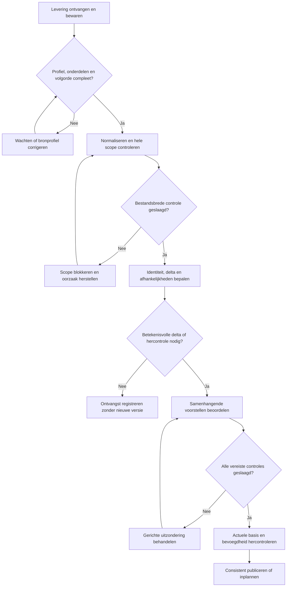

# Businessanalyse — artikelimport, prijsacceptatie en leveranciersbibliotheken

*Samengevoegd leidend bouwcontract voor CatalogImport*

Versie 1.0 (samenvoeging) | 22 september 2026

---

## 0. Documentstatus, versiehistoriek, leeswijzer

**Wat dit document is.** Dit document vervangt `business-analyse-leveranciersbibliotheken.md` (hierna **BA1**) en
`Businessanalyse_artikelimport_en_prijsacceptatie-2.md` (hierna **BA2**) als het **leidende brondocument** voor
CatalogImport. BA1 en BA2 blijven als archiefbestanden in de projectroot bestaan en worden door deze samenvoeging
niet gewijzigd of verwijderd; wie een passage tot in de kleinste redactionele nuance wil naslaan, vindt in elke
sectie hieronder een bronmarkering `[BA1 §x]`, `[BA2 §y]` of `[BA1 §x + BA2 §y]` die naar het exacte origineel
verwijst. `docs/decisions.md` blijft het gezaghebbende, chronologische beslissingslog; dit document citeert het op
de relevante plaatsen maar vervangt het niet — bij twijfel over een beslissing geldt de letterlijke tekst in
`docs/decisions.md`.

**Waarom dit nodig was.** BA1 (14/09/2026, genormaliseerd afgesloten na akkoord van de mens op 15/09/2026) is de
reconstructie van de bestaande Prodis-legacy (programma's 1232, 1170/1171/1179, 821, 956) plus drie concrete
bronvoorbeelden (VROOAM, 02006, Bebat/06509) en is het document waarop Fase 1 t/m 3 van CatalogImport gebouwd zijn.
BA2 (v1.4, 21/09/2026, "ter inhoudelijke vaststelling") is een breder, green-field functioneel ontwerp met een
eigen structuur (leveranciers-BOM's, verpakking/staffels, een systematisch ERP-leescontract, werkvoorraad/
dashboards, en het aangeleverde PSIMPORT-veldcontract met 96 Real-veldbindingen) en vijftien open beslispunten
D01–D15. Beide documenten spraken elkaar op een aantal punten tegen (centraal artikel, prijsmodel, prijsanker,
publicatiebreedte, BOM's). Op 2026-09-22 heeft de mens deze vijf verschillen beslecht (zie `docs/decisions.md`,
blokken van 2026-09-22). Dit document verwerkt die vijf beslissingen en legt de rest van de twee bronnen samen
volgens een vast stramien, met BA1 leidend op de onderwerpen die het al concreet en getest uitwerkt, en BA2 als
aanvulling op de onderwerpen die BA1 nog niet had (verpakking, staffels, BOM's, ERP-leescontract, werkvoorraad).

**Realisatiestatus per sectie.** Elke sectie krijgt een label:
- **[gebouwd: fase 1-3]** — bestaat in de code, met Liquibase-changesets en geautomatiseerde tests in
  `Web/src/test` (zie het overzicht van testklassen in hoofdstuk 30);
- **[eerstvolgende fase]** — is ontworpen (`docs/design/fase2-screening-design.md`,
  `docs/design/fase3-rules-design.md`) of normatief vastgelegd, maar nog niet of slechts ten dele gebouwd;
- **[doelbeeld]** — is een businessregel of ontwerpdoel voor een latere fase, met expliciete afhankelijkheid van
  een nog te nemen vervolgbeslissing (zoals Fase 5, ERP-integratie of de BOM-uitbreiding).

**Regel over BESLIST-markeringen.** Elke passage die rechtstreeks uit `docs/decisions.md` komt, is gemarkeerd
**BESLIST (decisions.md \<datum\>)** en wordt **niet geherformuleerd**: de tekst is een citaat, letterlijk zoals in
het logboek staat, met datum. Dit is een bewuste maatregel (zie de risico's hieronder, R1) om te voorkomen dat een
mens-beslissing bij het herschikken van het materiaal per ongeluk verwatert tot een gewone paragraaf.

**Wat dit document NIET doet.** Het schrijft geen code en wijzigt geen changesets. Het herhaalt niet elke regel
letter voor letter uit BA1 §14 (2.372 regels alleen al voor §14.23) — dat zou het document onwerkbaar maken zonder
extra informatiewaarde. Waar een BA1-sectie al precies en getest is, wordt zij samengevat met behoud van de
concrete tabelnamen, veldnamen en regel-ID's, en met een expliciete verwijzing naar het BA1-hoofdstuk voor de volle
tekst. Waar BA2 iets toevoegt dat niet in BA1 stond, wordt dat als aparte, herkenbare paragraaf geïntegreerd.

**Voor lezers van `docs/stories/catalog-import-v2.md`.** Die storyset (ST-01 t/m ST-15) veronderstelde bij het
schrijven dat D01 (centraal artikel), D05 (prijsmodel) en de BOM-vraag nog open stonden. Die zijn nu, op 2026-09-22,
beslist (zie hoofdstuk 6, 19-21 en 16 hieronder). De stories zelf blijven bruikbaar als planning van toekomstige
verticale slices, maar moeten tegen de 2026-09-22-beslissingen getoetst worden vóórdat ze worden opgepakt — met
name ST-04 (centraal artikel: nu een tussenweg, geen vrije fusie/splitsing-UI), ST-07 (prijsmodel: gefaseerd, niet
in één keer een volledig nieuw prijsstelsel) en ST-05 (BOM: bevestigd binnen scope, maar als later, apart
onderwerp met een eigen publicatieroute).

**Voor de bouwer die hierna aan de slag gaat.** Hoofdstuk 4 is het hoofdstuk om eerst te lezen: het bevat, integraal
en letterlijk, alle "Bevestigd door gebruiker"-beslissingen uit BA1 §11 en §16 én de volledige inhoud van
`docs/decisions.md`. Niets daarin is een open vraag. Hoofdstuk 33 geeft per BA2-beslispunt (D01–D15) de actuele
status. Bijlage A koppelt het aangeleverde PSIMPORT-veldcontract (96 Real-velden) aan de 17 logische velden die al
in `import_field_catalog` bestaan.

---

## 1. Bedrijfsdoel, uitgangspunten en schaal

[BA2 §1 + BA1 §2]

Leveranciers en aankoopverenigingen leveren artikelcatalogi aan die binnen Prodis **bibliotheken** heten
[BA1 §2.1]. BA1's schaalconstraint is normatief en scherper dan BA2's cijfer: **meer dan één miljoen
artikelregels** per levering moet de architectuur aankunnen, met streaming/begrensde batches, bulkdatabasebewerkingen,
hervatbaarheid en controleerbare tussenresultaten; het volledige bestand in werkgeheugen laden of per regel een los
databaseproces uitvoeren is nooit een aanvaardbaar basisontwerp [BA1 §2.4, **Important technical constraint
discovered**]. BA2 noemt losse bestanden van 10.000 tot 400.000 artikelen [BA2 §1] — dat is een deelverzameling van
BA1's schaaldoel, geen tegenspraak.

> Important business rule discovered [BA1 §2.3]
> De leverancierscatalogus is broninformatie, maar niet automatisch de waarheid. Een import mag de interne
> bibliotheek alleen wijzigen nadat de gegevens en de voorgenomen wijzigingen volgens configureerbare regels zijn
> gecontroleerd.

BA2 formuleert dezelfde kernregel scherper voor het samengevoegde doel: een levering is **een verzameling
beweringen van een bron**, geen wijzigingsopdracht. Het systeem beoordeelt die beweringen, bepaalt de werkelijke
verschillen en publiceert uitsluitend wijzigingen die aan de toepasselijke regels voldoen; een geaccepteerde
bronwaarde hoeft niet de voorkeurswaarde in de centrale bibliotheek te worden [BA2 §1]. Beide formuleringen zijn
dezelfde regel; BA2's variant is preciezer over "wat geaccepteerd is, hoeft niet te winnen" (bronvoorrang, zie
hoofdstuk 17).

Uitgangspunten die BA2 toevoegt en die niet met BA1 conflicteren [BA2 §1]:
- Een stabiele interne artikelidentiteit staat los van leverancierscodes en benamingen (zie hoofdstuk 6 voor hoe
  dit zich verhoudt tot de al beslist aanbiedingsidentiteit).
- Prijzen blijven gekoppeld aan de juiste leverancier, overeenkomst en prijsbasis.
- Een recente ontvangst bewijst geen recente inhoudelijke wijziging.
- Een fout blokkeert de kleinste groep wijzigingen die inhoudelijk samenhangt.
- Onzekere artikelidentiteit blokkeert alle wijzigingen die van die identiteit afhangen.
- Elke automatische en handmatige beslissing is herleidbaar tot bron, regels en gebruikte gegevens.
- Herhaling, parallelle verwerking en herstel na een storing mogen geen dubbele of verloren wijzigingen veroorzaken.
- Automatische acceptatie betekent dat vastgestelde controles slagen; het bewijst niet dat de bronwaarde in de
  werkelijkheid juist is.

Succes wordt beoordeeld op **actualiteit én kwaliteit**; het aandeel automatische acceptaties mag nooit als enige
doelstelling gelden, omdat versoepelde regels dat percentage kunstmatig kunnen verbeteren [BA2 §1].

**[gebouwd: fase 1-3]** voor de screening-, delta- en drempellaag; **[doelbeeld]** voor de volledige
prijsbeoordelingsmotor van hoofdstuk 19-21 en de ERP-integratie van hoofdstuk 7.

---

## 2. Reikwijdte en afbakening

[BA2 §2 + §2.1 + BA1 §15.2 + §16.12]

**Binnen scope** (samengevoegd uit beide bronnen): ontvangst van bestanden/berichten, bronprofielen, normalisatie,
herkenning, ontdubbeling, verschillenberekening (delta), validatie, prijsbeoordeling, werkvoorraad, publicatie,
bibliotheekindeling, historiek, rapportage en gecontroleerd herstel [BA2 §2]. CSV, XML en andere formaten worden via
adapters naar hetzelfde interne formaat omgezet; BA1 is concreter over de eerste productieformaten: **CSV,
delimiter-/fixed-widthtekst, XLSX, XML en JSON**, met **PDF uitdrukkelijk uitgesloten** in de eerste versie
[BA1 §16.6] — dit is preciezer dan BA2's algemene "concrete eerste formaten per pilotbron" [BA2 §2] en blijft
gelden.

De oplossing beheert nieuwe artikelen, wijzigingen, uitfaseringen, expliciete verwijderverzoeken en correcties op
eerder aangeleverde gegevens [BA2 §2]. Bibliotheken kunnen overlappen en worden op leverancier, aankoopvereniging of
eigen classificatie ingericht.

**Uitdrukkelijk buiten scope** (beide bronnen convergent): automatische onderhandelingen, bestellingen, betalingen,
voorraadoptimalisatie, berekening van verkoopmarges, en het achteraf wijzigen van historische orders of facturen
[BA2 §2]. Een zelflerend prijsmodel dat acceptatiepoorten omzeilt, valt eveneens buiten scope [BA2 §2, BA1 §9]. De
**voorraadplugin** blijft in BA1 een bewuste latere uitbreiding met een eigen veiligheidsgrens
(zie hoofdstuk 26 hieronder over de scheiding catalogus/stock) [BA1 §15.2, §15.14].

**Vastgestelde uitbreiding: leveranciers-BOM's binnen scope, eigen productie-BOM's erbuiten** [BA2 §2.1].
Leveranciers-BOM's — samenstellingen die een leverancier of fabrikant als bron aanlevert, met componenten,
hoeveelheden, versies, geldigheid en relaties — vallen binnen scope: dit is beheer van aangeleverde
artikelinformatie, geen productie-uitvoering. **Eigen BOM's voor eigen productie of zelf samengestelde kits vallen
op uitdrukkelijke keuze buiten deze analyse**: geen eigen stuklijsteditor, productieorders, materiaalverbruik, eigen
assemblagevoorraad, bewerkingsplanning of berekening van eigen productiekosten. Zie hoofdstuk 16 voor de
BESLIST-status van deze uitbreiding (Q5, 2026-09-22): BOM's komen er, maar als apart, later te bouwen onderwerp met
een eigen publicatieroute.

Het platform moet prijsvoorwaarden kunnen uitleggen en voor een gevraagde hoeveelheid een bestelbare hoeveelheid en
bedrag kunnen berekenen; dit is informatie en validatie, geen orderplaatsing, automatische bijkoop om korting te
halen, of voorraadoptimalisatie [BA2 §2.1]. Jaarafspraken en cumulatieve kortingen worden alleen berekend als de
vereiste contract- en afnamegegevens beschikbaar en bevoegd ontsloten zijn; anders worden ze als voorwaardelijk
getoond.

**ERP-gegevens uitlezen zonder een tweede ERP te bouwen** [BA2 §2.2]. Het importsysteem moet operationele
referentiegegevens en, waar nodig, commerciële of historische gegevens uit Prodis kunnen uitlezen, maar wordt geen
tweede beheeromgeving voor ERP-stamgegevens, contracten, voorraad of transacties. De opdrachtgever heeft voor Prodis
bevestigd dat er artikelen, daaraan gekoppelde bibliotheekartikelen en een aankoopvoorkeursleverancier bestaan, met
**één artikeleenheid** en **geen leveranciersdoosbarcodes of andere verpakkingseenheden** in de huidige inrichting
(zie hoofdstuk 7 en 20). Een ontbrekende ERP-aansluiting mag nooit worden voorgesteld als een afgeronde
ERP-integratie; alleen gegevens die werkelijk van ERP-referenties afhangen wachten op die referenties, onafhankelijke
leveranciersinformatie kan volgens het eigen acceptatiebeleid beschikbaar komen [BA2 §2.2].

**[gebouwd: fase 1-3]** is uitsluitend de handmatige-CSV-screeningslice (§2 hierboven, eerste alinea); alle overige
scope-onderdelen zijn **[eerstvolgende fase]** of **[doelbeeld]**.

---

## 3. Terminologie

[BA1 §3 (normatief) + BA2 §4-tabel]

BA1's terminologielijst is normatief en in de code terug te vinden (tabelnamen, entiteitsnamen); zij wordt hier
integraal overgenomen. BA2's begrippenlijst (§4) introduceert een aantal aanvullende termen voor onderwerpen die
BA1 niet had (prijscontext, staffelregeling, BOM-versie) — die worden hieronder toegevoegd, apart gemarkeerd.

| Begrip | Betekenis | Bron |
|---|---|---|
| Bron | De geregistreerde oorsprong en aanleverwijze van catalogusgegevens (leverancier, aankoopvereniging, FTP-locatie, lokaal bestand of API). | [BA1 §3] |
| Leverancier | De commerciële partij waaraan een leveranciersnummer en leveranciersspecifieke artikelreferenties gekoppeld kunnen zijn. | [BA1 §3] |
| Aankoopvereniging | Een bronorganisatie die catalogusgegevens voor één of meer leveranciers kan aanleveren zonder zelf noodzakelijk verkoper te zijn. | [BA1 §3] |
| Bibliotheek | Een logisch afgebakende Prodis-catalogus met bibliotheekartikelen, prijzen en bijbehorende artikelinformatie; legacy: één fysiek `PSARFxxx`-bestand per bibliotheek (technische partitionering, geen businessgrens). | [BA1 §3] |
| Bibliotheekzoekleverancier | `PSBIB.Leveranciernr`: voornamelijk zoek-/filtermetadata, ~98% gelijk aan de leverancier van de onderliggende artikelen, ~2% bijvoorbeeld de aankoopvereniging. Nooit een normatieve leverancierssleutel voor een detailregel. | [BA1 §3, §14.7.2] |
| Bibliotheekartikel | Een aanbieding binnen een specifieke bibliotheek, met het gekozen drie- of vierdelige identiteitsprofiel; kritieke referenties koppelen aanbiedingen indirect aan hetzelfde artikel. | [BA1 §3] |
| Artikel | De operationele vorm van een bibliotheekartikel in het centrale Prodis-artikelbestand; ontstaat normaal bij werkelijk verkoop-/aankoopgebruik. | [BA1 §3] |
| Artikelpromotie | Het gecontroleerd materialiseren van een bibliotheekartikel naar een operationeel artikel, met behoud van herkomst. | [BA1 §3, §5.7.6-5.7.8] |
| CAB-ID | Algemene externe sleutel die VROOAM als aankoopgroep gebruikt om artikelen over aangesloten partijen heen te identificeren. | [BA1 §3] |
| Supplementartikel / Supplementrelatie | Een zelfstandig artikel dat als bijkomend artikel of toeslag aan een ander artikel gekoppeld wordt; de relatie zelf. | [BA1 §3, §14.22] |
| Importdefinitie | Een configureerbare veldmapping die bronkolommen/-posities omzet naar genormaliseerde importvelden. | [BA1 §3] |
| Bulk-identiteitsincident | Een systematische wijziging of fout in een externe identificatie (bv. een prefix op duizenden CAB-ID's) die als één patroon wordt onderzocht en beslist. | [BA1 §3] |
| **Centraal artikel** | Interne ID, productvariant, levenscyclusstatus en geaccepteerde kenmerken — BA2's term voor wat BA1 impliciet via kritieke referenties koppelt. Zie hoofdstuk 6 voor de BESLIST-tussenweg. | [BA2 §4] |
| **Prijscontext / Prijsvoorwaardenset** | Leveranciersaanbieding, overeenkomst, prijssoort, valuta, belastingbasis, verpakking en prijseenheid, resp. de samenhangende versie van prijsbasis, staffelregeling, kortingen en toepassingsvoorwaarden. | [BA2 §4, §4.1] |
| **Staffelregel / Staffelregeling** | Een individuele grens-bedrag-combinatie, resp. de berekeningswijze (volumestaffel/schijvenstaffel), aggregatiescope en geldigheid van een geheel van staffelregels. | [BA2 §4.1] |
| **Leveranciers-BOM / BOM-versie / BOM-regel** | De door de bron gedefinieerde samenstelling, haar versie, en een individuele componentregel. | [BA2 §4.1] |
| **Behandelgeval / Override** | Een uitzondering met eigenaar/prioriteit/status, resp. een tijdelijke of blijvende menselijke uitzondering met scope en reden. | [BA2 §4] |

---

## 4. NORMATIEF VASTGELEGDE BESLISSINGEN

[BA1 §11 + §16 integraal + `docs/decisions.md` integraal, chronologisch]

**Dit hoofdstuk is het belangrijkste van het document (zie risico R1 in de checklist aan het eind).** Het bevat,
zonder herformulering, elke beslissing die de twee brondocumenten en het beslissingslog al hebben vastgelegd. Waar
BA1 en `docs/decisions.md` elkaar op hetzelfde onderwerp raken, geldt `docs/decisions.md` als recenter en
overrulend (zie §4.3 hieronder); waar zij niet overlappen, gelden beide.

### 4.1 BA1 §11 — Beslissingslog (14–15/09/2026), integraal

Onderstaande tabel is een letterlijke overname van BA1 §11. Elke rij is een individuele, door de gebruiker
bevestigde vaststelling ("Bevestigd door gebruiker") of een bevestigde/afgeleide vaststelling uit legacybron of
ontwerp. Niets hieronder is een open implementatiekeuze.

| Datum | Beslissing of vaststelling | Status |
|---|---|---|
| 14/09/2026 | De nieuwe oplossing wordt eerst volledig gespecificeerd; implementatie start pas na goedkeuring van de analyse. | Bevestigd |
| 14/09/2026 | De gebruiker beheert bron, bestandstype en structuur via een Prodis-scherm. | Bevestigd |
| 14/09/2026 | Alle relevante automatische acties moeten ook manueel uitvoerbaar zijn. | Bevestigd |
| 14/09/2026 | Manuele acties moeten waar zinvol in bulk kunnen worden toegepast. | Bevestigd |
| 14/09/2026 | De legacyflow wordt als bron gebruikt, maar het vroegere vertrouwen in leveranciersdata wordt niet als nieuwe businessregel overgenomen. | Bevestigd |
| 14/09/2026 | Importdefinitie `VROOAM2` bevat 37 doelveldmappings, een `BENL`-filter, leveranciervertaling en afgeleide prijspercentages. | Bevestigd uit configuratie |
| 14/09/2026 | Bronnen kunnen verschillende identificatieprofielen hebben: `cab_id` voor een aankoopgroep versus leverancier + groep + referentie voor een zelfstandige leverancier. | Bevestigd |
| 14/09/2026 | Leveranciersregels kunnen meerdere supplementrelaties bevatten; supplementartikelen bestaan in zelfstandige bibliotheken zoals Bebat. | Bevestigd |
| 14/09/2026 | Doelnr. 307 van `HT3101` is fout geconfigureerd als `REF_SUPP_INT_1` en moet inhoudelijk als `REF_SUPP_INT_2` worden gelezen. | Bevestigd door gebruiker |
| 14/09/2026 | `PA` betekent `Prijs Artikel`; voor beide supplementsets in `HT3101` is de waarde `Y`. | Bevestigd door gebruiker |
| 14/09/2026 | Een ontbrekende of lege supplementhoeveelheid kan via expliciete definitiedefault waarde `1` krijgen; niet-numerieke invoer blijft fout en expliciete nul is standaard ongeldig. | Bevestigd en normatief gesloten |
| 14/09/2026 | Legacy ondersteunt zes filteroperatoren en reken-, map-, delete-, concatenate-, percentage-, split-, numerieke- en tekstexpressietransformaties. | Bevestigd uit aanvullende documentatie |
| 14/09/2026 | Importidentiteit vereist velden 9, 10 en 11; creatiegereedheid van een volledig nieuw artikel is een afzonderlijke controle. | Bevestigd uit aanvullende documentatie |
| 14/09/2026 | De primaire bestemming van de uitgebreide catalogusimport is het bibliotheekartikel; een importregel wordt niet automatisch een operationeel artikel. | Bevestigd door gebruiker en programma 1179 |
| 14/09/2026 | Een artikel is normaal een bibliotheekartikel dat door werkelijk verkoop- of aankoopgebruik operationeel werd gemaakt. Manuele creatie is mogelijk maar heeft zonder operationele behoefte geen zakelijke meerwaarde. | Bevestigd door gebruiker |
| 14/09/2026 | Programma 1179 onderhoudt naast `PSARFBIB` ook gekoppelde prijs-, stock-, leverancier-, referentie-, barcode-, PIM-, externe leverancier-, alternatief- en supplementgegevens. | Bevestigd uit legacyprogramma 1179 |
| 14/09/2026 | De feitelijke kopie/promotie van bibliotheekartikel naar artikel loopt in legacy via programma 956 en moet idempotent blijven. | Bevestigd uit legacyprogramma 956 en zijn aanroepers |
| 14/09/2026 | Catalogusopschoning mag een operationeel artikel met verkoop-/aankoophistoriek niet verwijderen. | Bevestigd als gevolg van de artikeldefinitie |
| 14/09/2026 | Eén bibliotheek per legacy-import is een Pervasive/Magic-beperking door afzonderlijke fysieke `PSARFxxx`-bestanden, geen businessregel voor het nieuwe systeem. | Bevestigd door gebruiker en legacy |
| 14/09/2026 | `PSBIB.Leveranciernr` is niet noodzakelijk gelijk aan `PSARFxxx.ARBIB_Leverancier`; de leverancier op de detailregel blijft een afzonderlijk gegeven. | Bevestigd door gebruiker en legacydatamodellen |
| 14/09/2026 | Een afwijking tussen bibliotheekzoekleverancier en detailleverancier is alleen fout wanneer een expliciet bronbeleid dat bepaalt. | Bevestigd ontwerpgevolg |
| 14/09/2026 | `PSBIB.Leveranciernr` is voornamelijk een zoekfilter: circa 98% verwijst naar de onderliggende leverancier en circa 2% bijvoorbeeld naar de aankoopvereniging die de catalogus aanbiedt maar zelf geen artikelen verkoopt. | Bevestigd door gebruiker |
| 14/09/2026 | De referentie-inconsistenties uit programma 821 moeten in de nieuwe oplossing vóór publicatie worden gedetecteerd en getoond. | Bevestigd door gebruiker |
| 14/09/2026 | Parsing, matching, validatie, uitzonderingsherkenning en mutatieplanning gebeuren vóór goedkeuring; na goedkeuring volgt een snelle publicatie van het voorbereide plan. | Bevestigd door gebruiker; technische invulling voorlopig |
| 14/09/2026 | Een bekende inconsistentie kan voor één geval, toekomstige gevallen, een termijn of een limiet worden aanvaard, maar blijft zichtbaar en auditbaar. | Bevestigd door gebruiker |
| 14/09/2026 | Detectie van inconsistenties is read-only; wijzigingen worden pas na expliciete beslissing en validatie gepubliceerd. | Nieuw ontwerp, afgeleid uit gewenst voorafcontroleproces |
| 14/09/2026 | Systematische wijzigingen van externe IDs, zoals een foutieve prefix op duizenden `cab_id`-waarden, worden als één bulk-identiteitsincident gedetecteerd, beoordeeld en auditbaar toegepast. | Bevestigd door gebruiker; detailbeleid open |
| 15/09/2026 | CAB-/PIM-ID is niet brongebonden: dezelfde waarde is bronoverschrijdend een sterke artikelreferentie voor indirecte koppeling. Herkomst blijft traceerbaar, maar de ID is niet blind betrouwbaar en mag geen onomkeerbare migratie alleen dragen. | Bevestigd door gebruiker |
| 15/09/2026 | De Importdefinitie kiest voor de volledige importfile één bibliotheekonafhankelijk aanbiedingsidentiteitsprofiel. `kortingscode = null` betekent zonder kortingscode; expliciet leeg (`""`) of gevuld betekent met kortingscode. EAN/PIM/CAB zijn afzonderlijke artikelreferenties, uniek binnen een bibliotheek, die aanbiedingsidentiteiten indirect kunnen koppelen aan hetzelfde artikel. | Bevestigd door gebruiker |
| 15/09/2026 | Een E-supplierrelatie (`E_SUPPLIER_ARTICLE` met `E_SUPPLIER`) levert binnen de bibliotheek ook de indirecte artikelreferentie `E_MARK + ARTICLE_REFERENCE`. Deze koppelroute is traceerbaar naast EAN/PIM/CAB en wijzigt nooit de aanbiedingsidentiteit. | Bevestigd door gebruiker en legacystructuur |
| 15/09/2026 | EAN-code, `E_MARK + ARTICLE_REFERENCE`, PIM-ID en CAB-ID zijn kritieke koppelreferenties naar interne artikelen. Wijziging, verwijdering, hergebruik of dubbelzinnige toevoeging wordt nooit automatisch gepubliceerd maar altijd als individueel of bulkidentiteitsincident beoordeeld. | Bevestigd door gebruiker |
| 15/09/2026 | `null` en expliciet leeg zijn verschillende sleuteltoestanden: `null` betekent dat kortingscode niet wordt gebruikt; `""` is een expliciete lege kortingscode binnen de vierdelige sleutel. De geselecteerde sleutelvorm moet altijd eenduidig zijn. | Bevestigd door gebruiker |
| 15/09/2026 | Nieuwe aanbiedingen mogen bij initialisatie na goedkeuring worden gemaakt en dagelijks alleen onder een absolute én procentuele creatiedrempel; daarboven wordt één bulkcreatie-incident gemaakt. | Bevestigd door gebruiker (drempel is nadien 20/09 herzien naar uitsluitend percentage, zie §4.3) |
| 15/09/2026 | Een bibliotheek kan via een expliciete, volledig traceerbare herinitialisatie volledig worden leeggemaakt en opnieuw ingelezen. Herimport van dezelfde set, ook na herinitialisatie, moet dezelfde zakelijke eindtoestand opleveren. | Bevestigd door gebruiker |
| 15/09/2026 | Eenheid, verkoopaantal en bestelaantal zijn operationele artikelvelden. Een catalogusimport mag ze niet als bronbeheerde bibliotheekvelden automatisch overschrijven. | Bevestigd door gebruiker |
| 15/09/2026 | De volledige PSIMPORT-veldcatalogus is zichtbaar in de configuratie. Elk veld krijgt een standaard- en actieve eigenaar: Catalogusbron, Prijscontrole, Prodis-gebruiker of Kritieke referentie. Catalogusbron en Prodis-gebruiker zijn configureerbaar; kritieke referenties zijn vast. | Bevestigd door gebruiker |
| 15/09/2026 | Bij meerdere actieve catalogusbronnen wordt de winnende bron per bibliotheek en veldgroep bepaald door een versieerbare prioriteitsregel; gelijke prioriteit met verschillende waarden blokkeert. "Laatste import wint" is verboden. | Bevestigd door gebruiker |
| 15/09/2026 | `SUPPLIER_REF_SUPPLEMENT` koppelt hoofd- en supplementaanbieding via twee maal vier referentievelden. `EXTERNAL_PIM_SUPPLEMENT` ondersteunt daarnaast een complete supplementset via ouder- en supplement-PIM/CAB. Beide routes vereisen een expliciet volledig-set- of deltacontract. | Bevestigd door gebruiker en legacystructuur |
| 15/09/2026 | Een gevalideerde bibliotheeksupplementrelatie kan alleen naar een operationeel artikel worden doorgegeven via voorkeursleverancier of een reeds goedgekeurde indirecte artikelkoppeling; de bibliotheekrelatie en herkomst blijven behouden. | Bevestigd door gebruiker |
| 15/09/2026 | Supplementprijsberekening gebeurt buiten de catalogusimport. `Prijs via artikel` gebruikt `ARTICLES.SUPPLEMENT` en heeft voorrang op `Prijs via klant`; die laatste bepaalt anders of de klantkortingsstructuur wordt toegepast. `SUP_QTY` is per hoofdartikel en `SUP_VAST_AANTAL` maakt dit aantal vast. | Bevestigd door gebruiker |
| 15/09/2026 | `SUP_VALUE_NUM` is de bewaarde numerieke waarde; `SUP_VALUE` is programmatorisch fout en wordt niet in het nieuwe relationele model bewaard. `SUP_TYPE` groepeert supplementen zakelijk, bijvoorbeeld Bebat of Schroot. | Bevestigd door gebruiker |
| 15/09/2026 | Supplementvelden kunnen per Importdefinitie een vaste waarde, bronmapping, bronmapping met expliciete default of verklaarde lookup gebruiken. Supplementaanbiedingen, leveranciersreferentie-relaties en PIM/CAB-relaties mogen afzonderlijke imports zijn en worden in één bundel afhankelijk geordend. | Bevestigd door gebruiker |
| 15/09/2026 | Gezonde delen van een import of Publicatiebundel mogen gepubliceerd worden wanneer andere delen fouten bevatten. Publicatie blijft atomair per consistente record-, set-, verwijder- of afhankelijkheidsscope; foutieve scopes blijven zichtbaar en ongepubliceerd. | Bevestigd door gebruiker |
| 15/09/2026 | Uitzonderingen kunnen eenmalig, voor een patroon/bulk, tijdelijk per bronbeleid of permanent via een nieuwe definitie gelden. Kritieke identiteitsincidenten zijn nooit gewone uitzonderingen maar vereisen migratie- of bulkincidentgoedkeuring. | Bevestigd door gebruiker |
| 15/09/2026 | Elke import in een publicatiebundel schrijft precies één tijdstempel-/`IMPORT_MARKER`-regel naar de centrale mutatielijst, ook zonder inhoudelijke mutaties. | Bevestigd door gebruiker |
| 15/09/2026 | Na een aantoonbaar volledige set is fysieke verwijdering toegestaan voor uitsluitend catalogus-/bibliotheekartikelen die aan de verwijderbaarheidsvoorwaarden voldoen; operationele artikelen blijven beschermd. | Bevestigd door gebruiker |
| 15/09/2026 | Elke importdefinitie kiest één expliciete basisprijs die door de Prodis-gebruiker per bibliotheekartikel wordt gebruikt. Adviesprijs, aankoopprijs of een andere goedgekeurde bronprijs kan die basisprijs zijn; alle overige prijzen worden als nauwkeurig percentage van die basisprijs beheerd. | Bevestigd door gebruiker |
| 15/09/2026 | Prijsanomalieën worden vóór publicatie beoordeeld op regel-, prijscluster/groep- en volledig importniveau. GAKP, LAKP en ADI zijn obsoleet en maken geen deel uit van het nieuwe prijsmodel. | Bevestigd door gebruiker |
| 15/09/2026 | De afwijkingscontrole gebruikt uitsluitend vorige prijs, 50-daags gemiddelde en 200-daags gemiddelde als referenties. Eén instelbare procentuele grens van de importdefinitie geldt voor alle drie. | Bevestigd door gebruiker |
| 15/09/2026 | Prijscontrole geldt voor Basisprijs, AKP%, VKP1% tot en met VKP5% en VKPBruto%. De screening bundelt gelijksoortige systematische prijsfouten binnen één import als één bulkprijsincident, met details alleen op aanvraag. | Bevestigd door gebruiker |
| 15/09/2026 | Prijscontrole heeft twee alternatieve blokkerende modellen: directe procentuele afwijkingscontrole op gekozen referenties, of boxplotcontrole met historiekvenster, dekking en minimale procentuele band. Elke afgeleide prijsverhouding wordt in dezelfde streaming-normalisatie berekend en gecontroleerd. | Bevestigd; standaardgrens 15% |
| 15/09/2026 | De robuuste prijscontrole gebruikt standaard maximaal 100 goedgekeurde waarnemingen binnen 200 dagen, minimaal 20 waarnemingen en 1,5 × IQR, met een band van minstens ±15% rond de mediaan. | Bevestigd |

### 4.2 BA1 §16 — Normatieve afsluiting van de resterende beslissingen (15/09/2026), integraal

BA1 §16 is de sluitverklaring waarmee de mens op 15/09/2026 alle op dat moment nog open ontwerpkeuzes van BA1
heeft ingevuld met defaults. Dit is, samen met §16.12 hieronder, de tekst die BA2's D01–D15 grotendeels al
beantwoordt (zie hoofdstuk 33).

**§16.1 Bron, bibliotheek, scope en creatie**
- Een bronorganisatie kan leverancier, aankoopvereniging of andere cataloguseigenaar zijn, meerdere leveranciers
  leveren en door meerdere importdefinities worden hergebruikt.
- Eén importdefinitie publiceert naar één bibliotheek en één dataset/recordnode/worksheet. Eén levering mag
  meerdere importdefinities en bibliotheken voeden.
- De aanbiedingsidentiteit is de eerder vastgelegde drie- of vierdelige leverancierssleutel; kritieke referenties
  koppelen aanbiedingen aan hetzelfde artikel maar vervangen die sleutel nooit.
- Dagelijkse creatie mag automatisch zolang zowel maximaal **100 nieuwe aanbiedingen** als maximaal **1% van de
  bestaande importscope** wordt bereikt. Overschrijding van één grens maakt één bulkcreatie-incident. Initialisatie
  en herinitialisatie vereisen altijd goedkeuring. *(Het absolute aantal 100 is op 20/09/2026 vervangen door een
  zuiver percentage, zie §4.3.)*
- Een gevonden ondersteunende match creëert alleen een voorstel; uitsluitend een eenduidige aanbiedingsmatch of
  eenduidige kritieke artikelreferentie mag automatisch worden gebruikt volgens de matchingmatrix.

**§16.2 Bulkincidenten en uitzonderingen**
- Een herhaalde foutsignatuur wordt gegroepeerd zodra zij ten minste 10 records raakt. Zij geldt als formeel
  bulkincident vanaf **100 records of 1% van de scope**; kritieke referentiefouten blokkeren ongeacht volume.
- Een bulkidentiteitsincident mag een transformatie voorstellen, maar nooit autonoom toepassen.
- Een goedgekeurde migratie bewaart oude en nieuwe ID permanent in audit. De oude ID blijft standaard 365 dagen als
  historische zoekalias beschikbaar, maar matcht niet actief tenzij het migratieplan dat tijdelijk expliciet
  toestaat.
- Een tijdelijke uitzondering geldt standaard 30 dagen of 10 succesvolle leveringen, afhankelijk van wat eerst
  komt. Het systeem waarschuwt 7 dagen vóór afloop of bij 80% van de gebruikslimiet.
- Een uitzondering is minstens bron-, importdefinitie-, issuecode- en patroonspecifiek; bronoverschrijdende
  uitzonderingen zijn verboden.

**§16.3 Supplementdefaults**
- Ontbrekende `SUP_QTY` krijgt alleen waarde 1 wanneer die default expliciet in de supplementdefinitie staat.
- Een expliciete hoeveelheid 0 wordt nooit als ontbrekend of als 1 geïnterpreteerd; zij is standaard een fout,
  tenzij een expliciete `SUP_TYPE`-regel nul geldig verklaart.
- Dezelfde hoofd- en supplementaanbieding mag meer dan één relatie hebben wanneer `SUP_TYPE`/`SUP_SEQUENCE` de
  relaties eenduidig onderscheidt.
- Een onopgelost supplementdoel blokkeert uitsluitend zijn atomaire supplementset.
- Een prijswijziging van een supplementaanbieding wijzigt de bibliotheekstaat onmiddellijk na goedkeuring; de
  klantprijs wordt pas door de operationele order-/verkooplogica berekend.

**§16.4 Artikellevenscyclus en voorkeurprijzen**
- Promotie wordt idempotent aangevraagd zodra een operationele workflow een intern artikelnummer nodig heeft.
- Een bevoegde gebruiker kan individuele of bulkpromotie aanvragen met reden; bulkpromotie vereist goedkeuring.
- Annulering van de eerste transactie verwijdert een reeds aangemaakt centraal artikel niet.
- Herkomst naar bibliotheekaanbieding, levering, definitieversie en promotietrigger blijft permanent traceerbaar.
- Verdwijnt een bibliotheekaanbieding uit een bewezen volledige set, dan wordt zij niet-bestelbaar/inactief; een
  operationeel artikel en zijn historie blijven bestaan.
- Centrale aankoop- en/of verkoopprijs mag binnen dezelfde `252 IMPORT`-/WebBase-publicatie wijzigen wanneer de
  bibliotheekaanbieding de overeenkomstige voorkeursleverancier is.

**§16.5 Prijs-, valuta- en afrondingsdefaults**
- Geldbedragen: `DECIMAL`, nooit `float`; percentages minimaal schaal 12.
- Publicatie naar een Prodisgeldbedrag rondt pas op de doelgrens af op twee decimalen met commerciële `HALF_UP`.
- Valuta en BTW-code zijn expliciete dimensies; geen automatische conversie/herberekening zonder versieerbare
  regel en koersbron.
- Boxplot: standaard laatste 100 goedgekeurde waarnemingen binnen max. 200 dagen, minimaal 20 waarnemingen,
  `1,5 × IQR`, nooit een band smaller dan ±15% rond de mediaan.
- Gewone afwijkingscontrole: standaardgrens 15% tegen vorige goedgekeurde prijs, 50-daags gemiddelde,
  200-daags gemiddelde.
- Nul, ontbrekend en expliciet leeg zijn afzonderlijke prijswaarden; een ontbrekende of onleesbare prijs wordt
  nooit nul.

**§16.6 Levering, retries en immutable bronarchief**
- Een meerdelige levering wacht standaard maximaal twee uur op verwachte onderdelen.
- Connectorfouten: standaard drie pogingen met exponentiële wachttijd en jitter; authenticatie-/configuratiefouten
  worden niet eindeloos herhaald.
- Een ontvangen levering en haar bestanden zijn immutable; een correctie is een nieuwe manuele levering die naar de
  vorige verwijst.
- API-pagination heeft een stabiele snapshot/cursor; dubbel ontvangen pagina's zijn idempotent.
- Ondersteunde eerste productieformaten: **CSV, delimiter-/fixed-widthtekst, XLSX, XML, JSON**; **PDF uitgesloten**.

**§16.7 Retentie, herstel en beschikbaarheid**

| Gegeven | Standaardretentie |
|---|---:|
| Originele leveringen en manifesten | 2 jaar |
| Kandidaatstaging van geslaagde jobs | 7 dagen |
| Kandidaatstaging van mislukte/geblokkeerde jobs | 30 dagen |
| Technische applicatielogs | 90 dagen |
| Definitieversies, issues, goedkeuringen en mutatieaudit | 7 jaar |
| Actieve bronstaat | Zolang actief; vervangen snapshots 2 jaar |
| Kritieke referentiemigratie-audit | Permanent |

Normatieve startwaarden: `RPO ≤ 24 uur`, `RTO ≤ 4 uur` voor de importcontrolelaag (zie hoofdstuk 28 voor het
verschil met BA2's NF05).

**§16.8 Autorisatie, credentials en notificaties**
- De toepassing gebruikt dezelfde Prodis-Keycloakserver/realm/permissiestructuur. Vier-ogen betekent twee
  verschillende actieve Keycloakgebruikers *(deze passage is op 20/09/2026 herroepen voor CatalogImport, zie
  §4.3)*.
- Leverancierscredentials staan voorlopig leesbaar in PostgreSQL; alleen `delivery.credentials.view` mag ze
  onthullen; UI toont standaard gemaskeerde waarden.
- Secrets nooit in logging/foutmeldingen/exports/mutaties/bronpreview.
- Webnotificaties verplicht voor mislukte levering, structuurwijziging, blokkering, bulkincident, bijna vervallen
  uitzondering, publicatieresultaat; e-mail standaard voor blokkering, kritieke incidenten, mislukte
  productiepublicatie.

**§16.9 Stamdata en onbekende codes**
- Onbekende leverancier/eenheid/valuta/BTW-/groep-/kortings-/prijs-/assortimentscode blokkeert standaard.
- De import creëert of wijzigt nooit autonoom Prodisstamdata; toont hoogstens een voorstel.
- Legacywaarden waarvan de betekenis niet bewezen is (bv. vaste assortimentcode `V`) worden als
  ruwe/configureerbare waarde gemigreerd, niet semantisch geraden.

**§16.10 Migratie en parallelrun**
- Bestaande interfacesettings/importdefinities worden geïmporteerd als conceptrevisies met bronverwijzing.
- `PSIMPDEFMAP`-gegevens worden overgenomen wanneer beschikbaar; ontbrekende VROOAM2-mapdata is een
  onboarding-verificatietaak, nooit geraden.
- Iedere gemigreerde bron doorloopt structuurdetectie, volledige screening en golden-fixturevergelijking.
- Legacy en nieuw draaien minimaal drie opeenvolgende succesvolle volledige leveringen parallel; go-live vereist
  gelijk verklaarde eindstaat.
- Na omschakeling blijft legacy read-only raadpleegbaar; nieuwe leveringen hebben precies één actieve verwerker.

**§16.11 Definitieve test- en acceptatiedefaults**
- Golden fixtures: **VROOAM, 02006, 06509/Bebat en HiKOKI**, elk met bron, definitieversie, verwachte issues,
  bronstaat, mutaties en Prodisresultaat.
- Performancetest: 100.000 en 1.000.000 regels; 1 miljoen regels binnen 15 minuten tot mutatieplan; normale
  publicatie binnen 5 minuten.
- Recoverytest injecteert fouten op vijf momenten in de flow; geen scenario mag duplicaten of een onverklaarbare
  halfset opleveren.
- De `ArticleImportEnum` → Prodisdoelmatrix wordt door de adapter als versieerbare export geleverd en
  golden-getest tegen de PSARF-publicatiematrix.

**§16.12 Afbakening na afsluiting**

> Niet meer open voor de proefversie zijn identiteit, matching, prijzen, supplementen, bronprioriteit, veld-
> eigendom, volledigheid/delete, mutatielijst, publicatie, databaseplatform, securitystructuur, schermflow,
> performantie en tests.
>
> Nog per concrete bron in te vullen zijn uitsluitend configuratiewaarden: locaties/credentials,
> selectievoorwaarden, manifest, worksheet/recordnode, mapping, vaste waarden, leverancierscodes,
> identityprofielkeuze, prijsbasis, drempelafwijkingen, supplementcontract en bronprioriteit. De latere
> stockplugin blijft bewust buiten de eerste catalogusproefversie.

Dit is de kernregel achter risico **R7**: BA2's D01–D15 zet een aantal van deze als "gesloten" gemarkeerde
onderwerpen weer open te lezen. Hoofdstuk 33 legt daarom per D-punt uit wat al BESLIST was vóór BA2 en wat BA2
er werkelijk aan toevoegt.

### 4.3 `docs/decisions.md` — volledig, chronologisch (18–22/09/2026)

Dit is de tweede helft van dit kernhoofdstuk: alle beslissingen die zijn genomen **nadat** BA1 werd afgesloten
(18/09) en tijdens Fase 1-3-bouw (18-20/09), plus de vijf samenvoegingsbeslissingen van 22/09. Waar een blok
hieronder een BA1-beslissing herroept of preciseert, is dat met zoveel woorden vermeld — dit overrulet §4.1/§4.2
op dat specifieke punt.

#### 2026-09-18 — Fase 0: bestaande Prodis-tabellen (CatalogImportJob e.a.)

**Vraag:** Prodis bevat al ongebruikte entiteiten/tabellen `CatalogImportJob`, `CatalogImportRawRow`,
`CatalogImportError`, `CatalogImportApprovalEvent`, `SupplierCatalog`, `CatalogArticle` (Liquibase aanwezig, geen
service/REST erbovenop). `CatalogImportProfile`/`CatalogImportMapping` zijn wél actief in gebruik voor de bestaande
`SupplierPromoPrice`-import. Wat gebeurt hiermee?

**Beslissing:** CatalogImport bouwt een volledig eigen domeinmodel in zijn eigen database, los van deze
Prodis-tabellen. De ongebruikte scaffolding in Prodis wordt niet hergebruikt en niet aangeraakt;
`CatalogImportProfile`/`CatalogImportMapping` blijven exclusief van `SupplierPromoPrice`. Sluit aan bij het reeds
vastgelegde uitgangspunt "eigen project, eigen database, geen foreign keys tussen de databases".

**Bron:** mens / `denker-zwaar` Fase 0-intake, `Prodis/docs/internal/architecture/catalog-import-prodis-integration.md` r.54,
`Prodis/Service/.../SupplierPromoPriceImportServiceImpl.java`

---

#### 2026-09-18 — Fase 0: aanbiedingsidentiteit

**Vraag:** Wat is de sleutel die bepaalt of twee regels dezelfde aanbieding zijn — 2-delig bibliotheekgebonden
(`leverancier + referentie`, zoals de bestaande proefversie) of 3-delig bibliotheekonafhankelijk (zoals de
businessanalyse)?

**Beslissing:** `leverancier + leveranciersgroep + leveranciersreferentie`, optioneel uitgebreid met kortingscode
wanneer die gemapt is. Bibliotheek en bronorganisatie zijn **scope**, geen onderdeel van de sleutel. `null` (niet
gemapt) en `""` (expliciet leeg) zijn verschillende toestanden. Deze keuze geldt voor de volledige importfile,
nooit per record.

**Bron:** mens / `business-analyse-leveranciersbibliotheken.md` §14.23.3, §15.2 punt 5, §16.1, beslissingslog
15/09 (overstijgt `docs/requirements/catalog-import-business-rules.md` r.7 en
`docs/stories/catalog-import-proefpublicatie.md` r.33, die als achterhaald gelden)

---

#### 2026-09-18 — Fase 0: opslag van CatalogImport-permissies

**Vraag:** CatalogImport heeft geen eigen gebruikers-/rollentabellen. Waar leven de CatalogImport-permissies?

**Beslissing:** CatalogImport bevraagt Prodis' account-API voor de rechten van de ingelogde (Keycloak-)gebruiker.
Eén bron van waarheid voor rechten; vereist een nieuw of uit te breiden Prodis-contract voor het opvragen van
CatalogImport-specifieke permissiecodes voor de huidige gebruiker.

**Bron:** mens / `denker-zwaar` Fase 0-intake

**Important technical constraint discovered (te bevestigen bij implementatie):** Prodis' huidige
machine-to-machine-authenticatiepatroon (`DdaProdisApiKeyAuthenticationFilter`, `ROLE_DDA_PRODIS_API`) is in
`SecurityConfiguration` bewust beperkt tot `/api/transfer/**`, `/api/invoice-lines/**` en
`/api/generalledger/**`. Een nieuw account-/permissie-endpoint voor CatalogImport moet een apart, beperkt contract
krijgen — niet zomaar op dit patroon aansluiten, want die houder krijgt via `hasDdaProdisApiBypass()` alle
permissiecodes.

---

#### 2026-09-18 — Fase 0: permissiemodel

**Vraag:** Welk permissiemodel voor CatalogImport-acties — grofmazig, taakgescheiden, of fijnmazig conform de
businessanalyse?

**Beslissing:** Grofmazig: `catalogImport.read`, `catalogImport.manage`, `catalogImport.approve`.

**Bron:** mens / `Prodis/docs/internal/architecture/catalog-import-prodis-integration.md` §"Security en audit"

---

#### 2026-09-18 — Fase 0: publicatiedoel

**Vraag:** Publiceert CatalogImport naar de Prodis-PostgreSQL-kern (`SupplierCatalog`/`CatalogArticle`) of naar
ProDisWebbase/Pervasive (`PSARFxxx` via `252 IMPORT`)?

**Beslissing:** ProDisWebbase/Pervasive, via `252 IMPORT` (of de WebBase-variant) als enige uitvoerder van de
bestaande Prodis-logica. ProdisWebBase/Pervasive blijft eigenaar van `PSARFxxx`, `ARTICLES` en de bestaande
leveranciersrelaties.

**Bron:** mens / `business-analyse-leveranciersbibliotheken.md` §14.23.7, §15.4 (overstijgt de
Prodis-architectuurdocs die een `CatalogImportPublication`-API naar de Prodis-PostgreSQL-kern beschreven — die
positie geldt als achterhaald)

---

#### 2026-09-18 — Fase 0: goedkeurings- en publicatie-eenheid

**Vraag:** Is de eenheid van goedkeuring/publicatie de individuele mutatie (zoals de Prodis-stories) of de
Publicatiebundel (zoals de businessanalyse)?

**Beslissing:** Publicatiebundel. Een afzonderlijke importkoppeling mag nooit zelfstandig publiceren; alle
kandidaten van de gekozen imports komen samen in één Publicatiebundel. Publicatie blijft atomair per consistente
record-, set-, verwijder- of afhankelijkheidsscope binnen die bundel.

**Bron:** mens (expliciet bevestigd na challenge) / `business-analyse-leveranciersbibliotheken.md` §14.26 (harde
kernregel)

---

#### 2026-09-18 — Fase 1: bronkoppeling ImportDefinition/ImportLink + sjablonen/bookmarks

**Vraag:** `ImportDefinition` is in Fase 1 gekoppeld aan één `SourceOrganisation` (natuurlijke sleutel bron+code);
`ImportLink` draagt de concrete leverancier en bibliotheekscope, zodat één bron (bv. de VROOAM-aankoopvereniging)
via aparte `ImportLink`-rijen voor meerdere leveranciers kan dienen. Klopt deze interpretatie van "bron" uit §14.15?

**Beslissing:** Ja, bevestigd — met een expliciete nevenvoorwaarde: het sjabloon- en bookmarkmechanisme uit §14.16
(een versieerbare blauwdruk met benoemde, getypeerde invulvelden, bv. `BESTANDS_PREFIX`, waarmee per leverancier
een eigen `ImportDefinition` uit een gedeeld VROOAM-sjabloon wordt afgeleid) is **geen optionele latere uitbreiding
maar een vereiste mogelijkheid** die zonder schemamigratie moet kunnen worden toegevoegd. Fase 1/2 bouwen
sjablonen en bookmarks nog niet, maar elke volgende fase die de
`ImportDefinition`/`ImportDefinitionRevision`-structuur aanraakt moet expliciet toetsen of sjabloon-afgeleide
bookmarks er later bij kunnen zonder de dan al bestaande leveranciersdefinities te breken.

**Bron:** mens / `business-analyse-leveranciersbibliotheken.md` §14.15, §14.16

---

#### 2026-09-18 — Fase 2: ontwerp kleinste verticale slice

**Vraag:** Hoe wordt de manuele-CSV-slice (upload → archief → streaming parse → staging → identiteit → delta →
mutatielijst + IMPORT_MARKER) ontworpen?

**Beslissing:** Het ontwerp in `docs/design/fase2-screening-design.md` is bindend (tabellen `import_batch`,
`import_candidate_stage`, `import_row_issue`, `catalog_source_state`, `import_mutation`; changeset 002 additief
naast ongewijzigde 001; JDBC-bulk voor staging/bronstaat; idempotency_key per Delivery+revisie+identiteit;
archivering op bestandssysteem; screening schrijft nooit in de bronstaat; bouwstappen 2a–2e sequentieel).

**Bron:** denker-zwaar / `business-analyse-leveranciersbibliotheken.md` §14.23, §14.24, §14.26, §15.2, §15.10,
§16.1, §16.5–16.7

---

#### 2026-09-18 — Fase 2: baseline-acceptatie (`accept-baseline`)

**Vraag:** De bronstaat (`catalog_source_state`) mag volgens §14.24.6 pas na publicatie bijgewerkt worden, maar
Fase 2 kent geen publicatie. Hoe bewijzen we in Fase 2 dat een identieke herlevering 0 mutaties oplevert?

**Beslissing:** Via een aparte, geauditeerde actie `POST /batches/{id}/accept-baseline` (verplichte reden,
acceptedBy niet leeg en niet `system`, enkel vanuit status SCREENED). De screening zelf schrijft nooit in de
bronstaat. Weggeschreven bronstaatrijen krijgen `state_origin = BASELINE_ACCEPTED`; de mutaties van die batch
krijgen status `SKIPPED` met reden `BASELINE_ACCEPTED_WITHOUT_PUBLICATION`. In Fase 5 wordt dit
aangevuld/vervangen door de echte publicatieroute (`state_origin = PUBLISHED`).

**Bron:** mens / `docs/design/fase2-screening-design.md` §3, §10, §11

---

#### 2026-09-19 — Fase 3: ontwerp business rules en validatie

**Vraag:** Welke regels uit de businessanalyse horen in Fase 3 en hoe worden ze gemodelleerd?

**Beslissing:** Het ontwerp in `docs/design/fase3-rules-design.md` is bindend, inclusief de vier afwijkingen van
het Fase 0-uitgangspunt: (A) recordfilters wél in Fase 3, (B) prijsobservatiehistoriek wél in Fase 3, (C)
`TOO_MANY_ROW_ISSUES` vervalt als blokkeerreden, (D) `validation_result` als aparte statusas; `import_row_issue`
wordt uitgebreid (niet vervangen); canonicalisatieversie 2 naast 1; creatiedrempel 100 nieuwe aanbiedingen EN 1%
van de importscope (niet 100%); bouwstappen 3a-3h sequentieel, rapport aan de mens na 3d en na 3h.

**Bron:** denker-zwaar / `business-analyse-leveranciersbibliotheken.md` §14.4, §14.9, §14.11-§14.12, §14.23,
§15.12, §16.1, §16.2, §16.5

---

#### 2026-09-19 — Fase 3: vier-ogen bij accept-baseline zonder authenticatie

**Vraag:** §16.1/§14.23.7/§16.8 eisen vier-ogen-goedkeuring (twee verschillende gebruikers) bij een bulkcreatie,
bulkprijsincident of initialisatie. Er is nog geen authenticatie (Keycloak = Fase 5). Wat doet `accept-baseline`
in de tussentijd?

**Beslissing:** Zodra een batch een bulkincident, wachtende creaties (`AWAITING_APPROVAL`) of een initialisatie
heeft, is `accept-baseline` alleen toegestaan met een extra verplicht veld `approvedBy` (niet leeg, niet `system`,
verschillend van `acceptedBy`, case-insensitief). Beide namen worden persistent bewaard op `import_batch`.
Ontbreekt het veld: 409 `FOUR_EYES_APPROVAL_REQUIRED`. In Fase 5 worden beide namen vervangen door geverifieerde
Keycloak-identiteiten. Alternatief (weigeren tot Fase 4/5) is verworpen omdat het de eerste levering van elke
nieuwe koppeling onbruikbaar zou maken. *(Dit blok is op 20/09/2026 volledig herroepen, zie hieronder.)*

**Bron:** mens / `business-analyse-leveranciersbibliotheken.md` §16.1, §14.23.7, §16.8

---

#### 2026-09-19 — Fase 3e: betekenis van de 50- en 200-daagse gemiddelden

**Vraag:** De afwijkingscontrole vergelijkt met de vorige waarde en met het gemiddelde van de laatste 50 en 200
"dagwaarden". Gaat dat over de laatste N vastgelegde goedgekeurde waarden, of over N kalenderdagen met
doorgetrokken waarde (ook voor ongewijzigde dagen)?

**Beslissing:** De 50- en 200-gemiddelden zijn slechts een extra referentie naast de vorige waarde, om een
bewegend gemiddelde te hebben. Gemiddelde over de laatste N VASTGELEGDE goedgekeurde observaties volstaat; geen
doorgetrokken kalenderdagen, geen extra observaties voor ongewijzigde dagen. De vorige waarde blijft de primaire
referentie.

**Bron:** mens / `docs/design/fase3-rules-design.md` §13

---

#### 2026-09-20 — Fase 3: eindoordeel bij verworpen regels (validation_result) en kritieke kolommen

**Vraag:** Welk eindoordeel (`validation_result`) krijgt een levering met regels die door gewone fouten verworpen
zijn maar die verder doorgaat? (Open punt R-THR-06: ERROR staat niet in de regel.)

**Beslissing (mens, letterlijk):** "de gebruiker heeft zelf een waarde gegeven aan kolommen (kritiek of niet);
kritieke lijnfouten hebben een review nodig, waarschuwingen niet." Vertaling: per kolom (mapping/veld) bepaalt de
gebruiker of die KRITIEK is of niet. Een fout op een kritieke kolom (kritieke lijn) vereist een review (⇒
`REVIEW_REQUIRED`); een waarschuwing of een fout op een niet-kritieke kolom vereist geen review (⇒ hooguit
`VALID_WITH_WARNINGS`).

**Status:** uitgewerkt in `docs/design/fase3-rules-design.md` §15 (stap 3h) en gebouwd in stappen 3h-1 t/m 3h-7.

**Bron:** mens / `docs/design/fase3-rules-design.md` §9, §13

---

#### 2026-09-20 — Fase 3: eerste vastlegging van een kritieke referentie op een bestaande aanbieding

**Vraag:** §14.23.3 zegt dat ook een nieuwe referentie (EAN/PIM/CAB) op een bestaand artikel standaard de kritieke
beoordelingsroute volgt; ontwerp R-REF-06 laat de eerste vastlegging toe. Wat geldt?

**Beslissing:** Optie A, ZONDER schakelaar: de eerste vastlegging van een referentie op een bestaande aanbieding
is geen incident zolang de waarde niet al bij een andere aanbieding in dezelfde bibliotheek actief is (zoals 3f al
implementeert). Komt het massaal voor (bv. referentiekolom voor het eerst aangezet), dan vangt de bulkregel (100
records of 1% van de scope, R-THR-04) het op als één `BULK_IDENTITY_INCIDENT` ⇒ review + vier-ogen. Er komt GEEN
per-revisie schakelaar `reference_first_binding_requires_approval` (stap 3h-8 vervalt); strenger maken kan later
additief.

**Bron:** mens / `business-analyse-leveranciersbibliotheken.md` §14.23.3, §16.2; design `fase3-rules-design.md` §14

---

#### 2026-09-20 — Fase 3: drempels zijn altijd een percentage (geen vaste aantallen)

**Vraag:** Het ontwerp kende vaste aantallen (100 nieuwe aanbiedingen, 100 records ter beoordeling,
`max_rejected_records`, bulkincident vanaf 100). Kleine koppelingen worden daar onbruikbaar door.

**Beslissing (mens):** Alle drempels zijn instelbare parameters per revisie/leverancier en ALTIJD een percentage
van de omvang ("altijd een percentage-koppeling"), nooit een vast aantal. Concreet: (a) creatiedrempel =
`creation_threshold_share_percent` (default 1); (b) records ter beoordeling (kritieke lijnen + vastgehouden
identiteitsincidenten) = nieuw `max_critical_share_percent` (default 1) — boven dit percentage van de records in
scope stopt de hele levering (`BLOCKED`), daaronder is het `REVIEW_REQUIRED`; (c) verworpen regels =
`max_rejected_share_percent` (default niet geconfigureerd = `null`); (d) bulkincident = nieuw
`bulk_incident_share_percent` (default 1). De kolommen `creation_threshold_absolute`, `max_critical_records` en
`max_rejected_records` blijven bestaan (geen hernoeming/verwijdering) maar worden NIET meer gebruikt. Vergelijking
altijd decimaal: `aantal × 100 > percentage × scope`, exact op de grens is niet overschreden. Het minimum van 10
gelijke fouten om een issuegroep te vormen is een technische groeperingsdrempel (geen leveringsdrempel) en blijft.
Bij een kleine koppeling zet de beheerder het percentage per leverancier hoger.

**Bron:** mens / `docs/design/fase3-rules-design.md` §1.7, §15

---

#### 2026-09-20 — Fase 3: vier-ogen (twee verschillende gebruikers) is NOOIT vereist

**Vraag:** Het beslissingsblok van 2026-09-19 vereiste een tweede naam (`approvedBy`) bij accept-baseline voor een
bulkincident, wachtende creaties of een initialisatie (§16.1, §14.23.7, §16.8).

**Beslissing (mens):** "2 gebruikers moet nooit": een goedkeuring door twee verschillende gebruikers wordt nergens
afgedwongen. Dit HERROEPT het beslissingsblok "Fase 3: vier-ogen bij accept-baseline zonder authenticatie"
(2026-09-19) en wijkt bewust af van businessanalyse §16.8 en §14.23.7 (dit document, §4.2 §16.8) **en** van BA2's
"configureerbaar" vier-ogenbeleid (§3, zie hoofdstuk 5). Gevolg: `approvedBy`, `baseline_approved_by` en de 409
`FOUR_EYES_APPROVAL_REQUIRED` komen er niet. Een review blijft bestaan als status (`REVIEW_REQUIRED`, mutaties
`AWAITING_APPROVAL`), maar één bevoegde persoon (`acceptedBy` + verplichte reden, niet `system`) kan die afronden.
Risico dat de mens bewust neemt: één persoon kan een bulkcreatie of een initialisatie goedkeuren zonder tweede
controle. Strenger maken kan later additief.

**Bron:** mens / afwijking van `business-analyse-leveranciersbibliotheken.md` §16.1, §16.8, §14.23.7

---

#### 2026-09-22 — Samenvoeging businessanalyses: centraal artikel

**Vraag:** Komt er een 'centraal artikel' dat meerdere aanbiedingen van verschillende leveranciers aan hetzelfde
product koppelt?

**Beslissing:** Tussenweg. Een artikelcluster ontstaat alleen automatisch uit een bevestigde EAN/PIM/CAB-koppeling
(R-REF-01..09), met een vaste interne ID en volledige, permanente audit van elke samenvoeging. Geen automatisch
samenvoegen op basis van omschrijving of score, geen apart beheerscherm voor fuseren/splitsen in de eerste versie.

**Bron:** mens / analyserapport samenvoeging businessanalyses, vraag Q2

---

#### 2026-09-22 — Samenvoeging businessanalyses: prijsmodel

**Vraag:** Blijft het prijsmodel 'basisprijs + percentages' (gebouwd), of komt er een volledig prijzenstelsel bij
(verpakking, staffels, toeslagen)?

**Beslissing:** Beide lagen, gefaseerd. 'Basisprijs + percentages' blijft het publicatiemodel richting Prodis
(ongewijzigd, al gebouwd). Verpakking/staffels/toeslagen komen er in een latere fase apart bij als
importlaag-gegevens, met de harde voorwaarde dat een wijziging in verpakking/staffelgrens altijd als
prijswijziging in de deltavingerafdruk telt — anders kan een prijsstijging onzichtbaar blijven (zie het "Important
business rule discovered"-blok in het analyserapport, geciteerd in hoofdstuk 20). Normalisatie per stuk wordt niet
ingevoerd vóór deze laag gebouwd is.

**Bron:** mens / analyserapport samenvoeging businessanalyses, vraag Q3

---

#### 2026-09-22 — Samenvoeging businessanalyses: prijsanker

**Vraag:** Komt er een bevestigd prijsanker naast de bestaande afwijkingscontrole (vorige prijs, gemiddelde
50/200 dagen)?

**Beslissing:** Ja. Een vierde referentie op prijsobservatieniveau die niet automatisch meeschuift met dagelijkse
goedkeuringen; enkel een bevoegd persoon kan het anker expliciet verzetten. Beschermt tegen sluipende prijsdrift
die de bestaande drie (meeschuivende) referenties niet detecteren. Additief: geen wijziging aan bestaande
kolommen/gedrag, komt in een latere Fase-3-achtige uitbreiding van de prijscontrole.

**Bron:** mens / analyserapport samenvoeging businessanalyses, vraag Q4 (businessanalyse 2 §11.2/§11.6)

---

#### 2026-09-22 — Samenvoeging businessanalyses: leveranciers-BOM's

**Vraag:** Vallen leveranciers-onderdelenlijsten (BOM's) binnen de projectscope?

**Beslissing:** Ja, maar als apart, later te bouwen onderwerp met een eigen publicatieroute (de huidige
ProDisWebbase/PSIMPORT-route kan een volledige BOM/relatiestructuur niet dragen, businessanalyse 2 §15.10). Het
bestaande supplementmodel (BA1 §14.22/§16.3, gebouwd) blijft het implementatiemodel voor supplementen; BOM is een
generalisatie die er niet in vervangen wordt maar naast komt.

**Bron:** mens / analyserapport samenvoeging businessanalyses, vraag Q5

---

#### 2026-09-22 — Samenvoeging businessanalyses: publicatiebreedte naar Prodis

**Vraag:** Schrijft de publicatie naar Prodis alleen de velden waar de import zeggenschap over heeft, of ook een
volledige rij (met risico op overschrijven van Prodis-eigen gegevens zoals voorraad, locatie,
boekhoudrekeningen)?

**Beslissing:** Alleen eigen velden, altijd. De bestaande veldeigenaarsmatrix (BA1 §14.23: eigenaar
Catalogusbron/Prijscontrole/Kritieke referentie/Prodis-gebruiker) blijft de harde bovengrens; een veld met
eigenaar Prodis-gebruiker (eenheid, voorraad, locatie, rekeningen) wordt nooit door de import geschreven, ook niet
als "behoud van de huidige waarde". Een bredere publicatievariant (volledige rij met terugleespatch) wordt pas
overwogen nadat het behoud-/patchgedrag van de Prodis-verwerker feitelijk bewezen is — dat is geen principekeuze
die nu al anders wordt vastgelegd.

**Bron:** mens / analyserapport samenvoeging businessanalyses, vraag Q6 (BA1 §14.23 PSARF-matrix vs
businessanalyse 2 §15.8)

---

**[gebouwd/afgesloten]** voor het volledige hoofdstuk 4 — dit zijn per definitie geen open vragen meer.

---

## 5. Rollen en bevoegdheden

[BA2 §3 + `docs/decisions.md`]

BA2 beschrijft zeven rollen: Proceseigenaar, Databeheerder, Prijsverantwoordelijke, Integratiebeheerder,
Applicatiebeheerder, Bibliotheekgebruiker, Controleur — elk met verantwoordelijkheid en bevoegdheid [BA2 §3]. Eén
persoon kan meerdere rollen vervullen; het systeem legt wel vast in welke bevoegdheid een handeling gebeurt. Voor
bulkacceptaties, identiteitsfusies en verruiming van prijsregels is expliciete bevoegdheid nodig.

**BESLIST (decisions.md 2026-09-18, "Fase 0: permissiemodel").** CatalogImport gebruikt geen fijnmazig,
taakgescheiden rollenmodel zoals BA2's tabel suggereert. Het permissiemodel is **grofmazig**:
`catalogImport.read`, `catalogImport.manage`, `catalogImport.approve`. BA2's zeven rollen zijn dus een
**functionele leeswijzer** voor wie welke taken in de UI/werkvoorraad uitvoert, geen aparte permissiecodes; de
mapping van "wie mag wat" gebeurt via de drie grofmazige permissies, niet via zeven granulaire rollen.

**BESLIST (decisions.md 2026-09-18, "Fase 0: opslag van CatalogImport-permissies").** CatalogImport bevraagt
Prodis' account-API voor de rechten van de ingelogde Keycloak-gebruiker; er is geen eigen gebruikers-/
rollentabel. Zie hoofdstuk 25 voor het bijbehorende technische constraint over `DdaProdisApiKeyAuthenticationFilter`.

**BESLIST (decisions.md 2026-09-20, "vier-ogen is NOOIT vereist").** BA2 laat een vierogencontrole
"configureerbaar" en noemt de inzet ervan een "open beleidskeuze" [BA2 §3]. Voor CatalogImport is dit ingevuld:
een goedkeuring door twee verschillende gebruikers wordt **nergens afgedwongen**. Eén bevoegde persoon
(`acceptedBy` + verplichte reden, nooit `system`) kan een review afronden, ook bij een bulkincident of
initialisatie. Dit is een bewust genomen risico van de mens; strenger maken kan later additief.

**[eerstvolgende fase]** — Fase 2/3 kennen `uploadedBy`/`acceptedBy` als requestvelden zonder authenticatie;
Keycloak-koppeling en de drie permissiecodes horen bij Fase 5.

---

## 6. Logisch gegevensmodel

[BA2 §4 + §4.1 + BA1 §14.5 + §14.22 + §14.23]

### 6.1 Aanbiedingsidentiteit — de bestaande, geldende sleutel

**BESLIST (decisions.md 2026-09-18, "aanbiedingsidentiteit"; herbevestigd BA1 §14.23.3, §15.2, §16.1).** De sleutel
die bepaalt of twee regels dezelfde aanbieding zijn, is:

```text
leverancier + leveranciersgroep + leveranciersreferentie
```

optioneel uitgebreid met kortingscode wanneer die voor de **volledige importfile** gemapt is. Bibliotheek en
bronorganisatie zijn **scope**, geen onderdeel van de sleutel. `null` (niet gemapt) en `""` (expliciet leeg) zijn
verschillende toestanden — dit onderscheid wordt in de code bewaard als `identity_discount_state`
(`NOT_USED`/`EMPTY`/`VALUE`, zie `docs/design/fase2-screening-design.md` §2). Deze keuze geldt voor de volledige
importfile, nooit per record. **[gebouwd: fase 1-3]**

BA1 classificeert kandidaatvelden in vier groepen — sterk identificerend, artikelreferentie, ondersteunend,
zwak/ongeschikt [BA1 §14.5]:

| Classificatie | Betekenis | Voorbeelden |
|---|---|---|
| Sterk identificerend | Verwacht stabiel en uniek binnen afgesproken scope | leverancier + leveranciersgroep + kortingscode + leveranciersreferentie |
| Artikelreferentie | Moet uniek zijn binnen de bibliotheek, koppelt aanbiedingen indirect | artikelbarcode/EAN, PIM-ID, CAB-ID |
| Ondersteunend | Niet uniek/stabiel genoeg als sleutel, wel bewijs | merk, fabrikantnummer, leveranciersbarcode binnen leveranciercontext, artikelgroep |
| Zwak/ongeschikt | Te veranderlijk of te breed | prijs, stock, beschikbaarheid, promotietekst |

**Barcode-identiteiten zijn niet uitwisselbaar** [BA1 §14.5]: een artikelbarcode (EAN/GTIN) identificeert het
fysieke/commerciële artikel; een leveranciersbarcode is alleen betekenisvol binnen de leverancierscontext. Beide
worden met type en context bewaard.

### 6.2 Centraal artikel — de BESLIST-tussenweg van 22/09/2026

BA1 kent geen zelfstandig "centraal artikel"-object in de importlaag; het koppelt aanbiedingen aan hetzelfde
Prodis-artikel indirect via kritieke referenties (EAN/PIM-ID/CAB-ID/`E_MARK + ARTICLE_REFERENCE`, zie §6.3) [BA1
§14.23.3]. BA2 introduceert wél een eigen "Centraal artikel"-entiteit in de importlaag, met eigen interne ID,
productvariant, levenscyclusstatus en geaccepteerde kenmerken, los van iedere leverancierscode [BA2 §4]. Een
leveranciersartikel (BA2's term voor de aanbieding) verwijst naar dat centrale artikel [BA2 §4.2].

**BESLIST (decisions.md 2026-09-22, "centraal artikel", vraag Q2).**

> Tussenweg. Een artikelcluster ontstaat alleen automatisch uit een bevestigde EAN/PIM/CAB-koppeling
> (R-REF-01..09), met een vaste interne ID en volledige, permanente audit van elke samenvoeging. Geen automatisch
> samenvoegen op basis van omschrijving of score, geen apart beheerscherm voor fuseren/splitsen in de eerste
> versie.

Vertaling naar het gegevensmodel: het "artikelcluster" is géén vrijstaand, door de gebruiker beheerd BA2-achtig
Centraal-artikelobject met een eigen fusie-/splitsingsscherm [BA2 §8, "Een fusie bewaart alle oude interne IDs..."
— die BA2-functionaliteit komt er dus **niet**]. Het is een **automatisch afgeleide groepering** die uitsluitend
ontstaat wanneer BA1's bestaande, al gebouwde kritieke-referentiecontrole (§6.3 hieronder, R-REF-01..09) een
bevestigde, eenduidige koppeling vaststelt tussen twee of meer aanbiedingsidentiteiten. Zij krijgt:
- een vaste interne cluster-ID zodra de eerste bevestigde koppeling ontstaat;
- volledige, permanente audit van elke samenvoeging (wie/wanneer/welke referentie/welk bewijs) — dit sluit aan bij
  BA1's bestaande eis dat een goedgekeurde ID-migratie oude en nieuwe waarde permanent in audit bewaart [BA1
  §7.8.1];
- geen automatische samenvoeging op omschrijving, tekstscore of "hoge overeenkomst" [BA2 §8's soepelere
  "eenduidige match zonder tegenspraak kan automatisch gekoppeld worden" wordt hier dus **niet** overgenomen —
  BA1's strengere regel blijft leidend, zie R2 in de risicochecklist];
- geen apart beheerscherm voor handmatig fuseren/splitsen in deze versie.

**[doelbeeld]** — het artikelcluster-datamodel (tabel, cluster-ID, audit) is nog niet gebouwd; Fase 1-3 hebben
alleen de aanbiedingsidentiteit en de kritieke-referentiecontrole. Een volgende fase die dit bouwt, moet expliciet
toetsen dat de clustervorming **uitsluitend** loopt via R-REF-01..09 (§6.3), nooit via een apart matchingalgoritme.

### 6.3 Kritieke koppelreferenties — ongewijzigd, BA1 leidend

[BA1 §14.23.3, gebouwd via R-REF-01..09, zie hoofdstuk 14] **EAN-code, `E_MARK + ARTICLE_REFERENCE`, PIM-ID en
CAB-ID zijn kritieke koppelreferenties naar interne artikelen**, geen gewone wijzigbare importvelden. Voor een
reeds bestaand bibliotheekartikel zijn de volgende gebeurtenissen altijd `Kritiek`: een andere waarde dan de
actieve waarde; het verwijderen/leeg worden van een bestaande waarde; het hergebruiken van de waarde voor een
ander intern artikel; het toevoegen van een bijkomende waarde die een bestaande koppeling dubbelzinnig maakt. De
import maakt in die gevallen uitsluitend een `IDENTITY_REFERENCE_INCIDENT`; nooit een stille update. Een dubbele
EAN/PIM/CAB binnen dezelfde bibliotheek is een identiteitsincident. **[gebouwd: fase 1-3]**, changeset 004-8/9/13/14
(`catalog_reference_state`, `import_candidate_reference`), zie `ReferenceIncidentTest`.

### 6.4 Overige BA2-begrippen (complementair, geen conflict)

BA2's overige logische objecten (Leveringsenvelop, Leveringsonderdeel, Prijscontext, Prijsversie, Relatie,
Bibliotheek/Lidmaatschap, Wijzigingsvoorstel, Beoordeling, Publicatiegebeurtenis) [BA2 §4, §4.1] vullen BA1 aan
zonder tegenspraak; zij worden in hoofdstuk 9 (bronvoorrang), 10 (relaties/BOM), 12 (statusmodel) en 18
(acceptatie-eenheid) verder uitgewerkt. Voor financiële waarden gebruikt BA2 dezelfde regel als BA1: decimale
rekenkunde, bronprecisie blijft bewaard, niet aangeleverd/onbekend/leeg/expliciet wissen zijn afzonderlijke
toestanden [BA2 §4].

**[gebouwd: fase 1-3]** voor §6.1 en §6.3; **[doelbeeld]** voor §6.2.

---

## 7. Gegevensgrens met Prodis/ERP

[BA2 §4.2-§4.11]

Dit hoofdstuk is volledig nieuw materiaal uit BA2; BA1 beschrijft de Prodis-legacy uitvoerig (hoofdstuk 14 hierna)
maar bouwt geen systematisch ERP-leescontract. **BESLIST (decisions.md 2026-09-18, "bestaande Prodis-tabellen" en
"publicatiedoel"):** CatalogImport heeft een **eigen database, geen foreign keys** naar Prodis, en publiceert
uitsluitend via `252 IMPORT`/PSIMPORT — dit hoofdstuk beschrijft dus een **leesgrens**, geen schrijftoegang tot
Prodis-tabellen.

### 7.1 Drie rollen, geen tweede ERP

[BA2 §4.2] Er zijn drie rollen: het systeem dat een gegeven **inhoudelijk beheert**, het systeem dat een
**kandidaat aanlevert**, en het systeem dat een **lees- of auditkopie** bewaart. Een lokale kopie maakt het
importsysteem niet tot eigenaar van het ERP-gegeven. Er zijn drie te onderscheiden identiteiten: het interne
catalogus-/bronrecord van de importlaag, het bestaande Prodis-bibliotheekartikel, en het operationele Prodis-artikel.
De ERP-artikelstam blijft leidend voor bestaande ERP-artikelnummers, operationele basiseenheden en blokkeringen;
leveranciersdata kan een wijzigingsvoorstel opleveren maar wijzigt die velden niet via de leesconnector. Er zijn
**nooit twee onbeperkte schrijvers voor hetzelfde veld binnen dezelfde scope** — dit is dezelfde regel als BA1's
veldeigenaarsmatrix (hoofdstuk 17, 25) en als de 22/09-beslissing over publicatiebreedte (hoofdstuk 4, laatste
blok).

Vier verplichtingsniveaus [BA2 §4.2]:
- **Altijd verplicht voor de ERP-route:** de zeven basisdatasets **ERP01–ERP07** (§7.2) moeten ontsloten en
  inhoudelijk bruikbaar zijn voordat die route in productie gaat. Een dataset mag aantoonbaar leeg zijn; een
  ontbrekende dataset is iets anders dan een lege dataset.
- **Voorwaardelijk verplicht:** **ERP08–ERP23** (§7.3) zijn nodig zodra een genoemde functie de gegevens
  daadwerkelijk gebruikt.
- **Niet van toepassing:** de bijbehorende functie is niet actief; een beslissende voorwaarde mag niet worden
  genegeerd door de functie uit te schakelen.
- **Eigen gegevens van het importsysteem** (§7.4): geen vooraf te eisen ERP-tabellen.

### 7.2 ERP01–ERP07 — altijd verplicht

[BA2 §4.3]

| ID | Dataset | Minimaal uit te lezen | Doel/gedrag bij ontbreken |
|---|---|---|---|
| ERP01 | Administraties en integratiecontext | Instantie, administratie-ID, actieve status, basisvaluta, tijdzone, zakelijke scope | Voorkomt vermenging tussen bedrijven |
| ERP02 | Leveranciersstam | Stabiele leveranciers-ID, codes, naam, actieve/geblokkeerde status, inkoopblokkering | Onbekende/geblokkeerde relatie houdt afhankelijke aanbieding tegen |
| ERP03 | Prodis-artikelstam | Artikel-ID, artikelcode, variant, **de ene artikeleenheid**, levenscyclus-/blokkeerstatus | Eenheid is de operationele rekenbasis, wordt niet door een leveranciersdoos overschreven |
| ERP04 | Prodis-bibliotheekartikelen | Bibliotheekartikel-ID, bron-/leveranciersidentiteit, kenmerken, operationele status | Bestaande doelrecords herkennen, dubbel aanmaken voorkomen |
| ERP05 | Artikel–bibliotheekrelaties en aankoopvoorkeur | Administratie, artikel-ID, bibliotheekartikel-ID's, aankoopvoorkeur, status/versie | Bestaande relaties/voorkeur respecteren |
| ERP06 | Betekenis/precisie van de Prodis-artikeleenheid | Eenheidscode(s), betekenis/dimensie, hoeveelheidsprecisie | Eén eenheid per artikel volstaat; geen tabel met alternatieve eenheden verplicht |
| ERP07 | Valutacodes en afrondingsinstellingen | Gebruikte valuta, reken-/presentatieprecisie, afrondingsregels | Wisselkoersen alleen conditioneel via ERP21 |

Bevestigd door de opdrachtgever (niet door database-inspectie): Prodis heeft artikelen, daaraan gekoppelde
bibliotheekartikelen en een aankoopvoorkeursleverancier, met **één artikeleenheid** en géén
leveranciersdoosbarcodes/alternatieve verpakkingseenheden in de huidige inrichting [BA2 §4.6, §4.7]. Zie hoofdstuk
20 voor het gevolg voor verpakking/staffels.

### 7.3 ERP08–ERP23 — voorwaardelijk verplicht

[BA2 §4.4] Samengevat (volledige tabel in BA2 §4.4, hier niet herhaald om herhaling met §7.2 te vermijden):
ERP08 (bestelregels/toekomstige verpakkingsmodule), ERP09 (aankoopcontracten), ERP10 (aankoopverenigingen), ERP11
(contractkortingen/staffelafspraken), ERP12 (actuele operationele aankoopprijzen/overrides), ERP13 (historische
ERP-prijsversies), ERP14 (inkooporders), ERP15 (goederenontvangsten/retouren), ERP16 (aankoopfactuurregels/
creditnota's), ERP17 (voorraad/reserveringen), ERP18 (ERP-artikelgroepen/classificaties), ERP19 (bestaande
leveranciers-BOM's), ERP20 (operationele supplement-/toeslagdefinities), ERP21 (wisselkoersen), ERP22
(belastingcodes/tarieven), ERP23 (vestigingen/magazijnen/locatiescopes). Elk wordt pas verplicht "zodra" de
genoemde trigger optreedt (zie BA2 §4.4 voor de exacte triggerkolom per ID). Niet elke voorwaardelijke dataset is
een nieuwe projectfunctie: voorraad uitlezen blijft bijvoorbeeld beperkt tot een expliciet gekozen
beschikbaarheidsweergave en activeert geen voorraadoptimalisatie; ERP19 gaat uitsluitend over leveranciers-BOM's
(eigen productie-BOM's blijven buiten scope, hoofdstuk 2).

### 7.4 Eigen gegevens van het importsysteem

[BA2 §4.5] Bronprofielen/kanaalconfiguratie/mappings, ruwe leveringen/manifesten/bronrecords, interne
catalogus-/bronrecords en leveranciersaanbiedingen, geaccepteerde bronprijzen/verpakking/staffels/relaties/BOM's,
delta's/voorstellen/werkvoorraad, prijsregels/ankers/onderbouwing, bibliotheekindelingen, audit/publicatiegebeurtenissen,
en leesprojecties van ERP-gegevens worden allemaal door CatalogImport zelf beheerd. Dit is consistent met de
Fase 0-beslissing "eigen database, geen foreign keys" (hoofdstuk 4).

### 7.5 Register van werkelijke ERP-bronnen (D11)

[BA2 §4.6] Voor ERP01–ERP23 wordt tijdens inventarisatie één register bijgehouden met: eigenaar, fysieke
vindplaats, activeringsvoorwaarde, sleutels/relaties, veldmapping, toegang, wijzigingsmechanisme, actualiteitsbeleid,
volledigheid, gebruik, ontbrekingsgedrag, verificatiestatus, bewijs/tests. Er is **geen daadwerkelijke
Prodis-database geïnspecteerd**; voor artikelstam/bibliotheekartikelen/koppelingen/aankoopvoorkeur/één-eenheid is
de functionele aanwezigheid door de opdrachtgever bevestigd, fysieke mapping is nog te onderzoeken. Dit is D11
(zie hoofdstuk 33).

### 7.6 PSR-referenties en publicatievoorzieningen (OUT01/OUT02)

[BA2 §4.11] Aanvullend op ERP01–ERP23: PSR01 (BTW-codes), PSR02 (rekeningstelsel), PSR03 (locaties/depots), PSR04
(artikelclassificaties), PSR05 (prijs-/kortingscodes), PSR06 (besturings-/aanvullende codes) — elk verplicht zodra
het bijbehorende PSIMPORT-veld gezet/vertaald/gewist wordt. **OUT01** (PSIMPORT-doelcontract en toegang) is
verplicht voor operationele aflevering, niet voor loutere ontvangst/schaduwverwerking. **OUT02**
(toepassingsresultaat en correlatie) is verplicht om de PSIMPORT-route als gecontroleerd geïntegreerd vrij te
geven. Zie Bijlage A voor de koppeling met de 17 al bestaande logische velden in `import_field_catalog`.

**[doelbeeld]** — dit volledige hoofdstuk is nog niet gebouwd; Fase 5 en later.

---

## 8. Legacyreconstructie

[BA1 §4-6]

BA1's reconstructie van de legacy blijft ongewijzigd overgenomen als bewijsmateriaal voor gedragscompatibiliteit;
BA2 bevat geen legacy-reconstructie en spreekt dit hoofdstuk dus nergens tegen.

### 8.1 Onderzochte legacyprogramma's

[BA1 §4.1] De analyse is gebaseerd op: `Prg_1232_Import_Artikelen_STOCK` (hoofdorchestratie),
`Prg_1472_Interface_Settings` (registratie/configuratie), `Prg_1223_Import_Artikelen_Auto` (automatische
artikel-/bibliotheekroute), `Prg_1170_Import_Art_Import_PSIMPORT` (lezen/mappen/opbouwen van de importwerkfile),
`Prg_1171_Import_Art_Controle_PSIMPORT` (controles vóór wegschrijven), `Prg_1172` (wegschrijven naar centraal
artikelbestand), `Prg_1179_Wegschrijven_bib_in_wacht` (wegschrijven naar bibliotheek), `Prg_956` (bibliotheekartikel
→ operationeel artikel), `Prg_885_Bibliotheken` (beheer `PSBIB`/`PSARFxxx`), `Prg_800_Bibliotheekartikelen`,
`Prg_821_Controle_Externe_Lev_referenties` (achterafdetectie referentie-inconsistenties), `Prg_1251/1267/1185`
(eenvoudig stock-/prijsimportpad en prijsupdate), plus transitief 1181, 1186, 249, 710, 896, 956, 961, 996.
Programma 1203 is vanuit 1232 wel genoemd maar de aanroep is expliciet uitgeschakeld — historisch/inactief.

### 8.2 Legacy hoofdroute

[BA1 §5.2-5.4] Programma 1232 fixeert gebruiker/datum/tijd, leest interfaceparameters/mappings, bepaalt de
aanleverwijze (FTP/lokaal/API), ondersteunt datumplaceholders, maakt archiefstructuur, kan bestanden
samenvoegen/ZIP uitpakken, routeert op `Create_Articles` (`B`/`BS` = bibliotheekroute via 1223→1170→1171→1179;
`N`/leeg = eenvoudig stock-/prijsimportpad via 1251; `Y` = historisch/inactief), en archiveert/verwijdert na
verwerking.

De actieve keten voor `B`/`BS`:

```text
1232 Import Artikelen STOCK → 1223 Import Artikelen (Auto) → tijdelijke importwerkfile
→ 1170 bestand lezen en via importdefinitie mappen → 1171 werkregels controleren
→ bij geslaagde controle: 1179 (route B, naar bibliotheek) of 1172 (route A, naar centraal artikelbestand)
→ oude/ontbrekende koppelingen conditioneel opruimen → resultaatmemo/foutbericht
```

### 8.3 Programma 1179 — bibliotheekschrijfroute

[BA1 §5.7] Voor iedere geldige werkregel: intern bibliotheeknummer zoeken/aanmaken, leveranciersgroep
koppelen/aanmaken, beschrijvingen/classificaties/leverancier/referenties bijwerken, eenheden/voorraadkenmerken
bijwerken, prijsvelden volgens prijscode/-beleid berekenen, wijzigingsdatums bijhouden, koppelen aan bestaand
operationeel artikel proberen (matchbasis `EK`=PIM-ID, `ES`=extern merk+referentie, `B`=barcode, `R`=leveranciers-
referentie, ook gestript), PIM-/externe-leverancier-/barcode-/stock-/supplementkoppelingen bijwerken, niet-
teruggevonden oude records conditioneel verwijderen. Dit is legacygedrag, **geen goedgekeurde nieuwe
matchstrategie**; §6.3 (kritieke referenties) en hoofdstuk 14 zijn de normatieve vervanging.

**Bibliotheekpartitionering is een Pervasive/Magic-beperking, geen businessregel** [BA1 §5.7.1]: "eén bibliotheek
per import" komt doordat dezelfde logische bibliotheekdatabase niet gelijktijdig op twee fysieke bestanden kon
worden geopend. De nieuwe oplossing mag een levering over meerdere bibliotheken verwerken, mits elke werkregel een
eenduidige doelbibliotheek heeft.

`PSBIB.Leveranciernr` (bibliotheekzoekleverancier) is **zoek-/selectiemetadata, geen normatieve leverancierssleutel**
[BA1 §5.7.2] — zie hoofdstuk 3 (terminologie). Voor matching, prijsregels, leveranciersgroepen en artikelpromotie
is de leverancier van de detailregel leidend.

### 8.4 Programma 956 — artikelpromotie

[BA1 §5.7.6-5.7.8] Programma 956 leest het bibliotheekartikel, controleert of al een artikel/leverancier-
referentiekoppeling bestaat, kent alleen bij werkelijke creatie een nieuw intern artikelnummer toe, kopieert
relevante velden naar `ARTICLES`, maakt de voorraadstructuur aan, schrijft multi-supplier-/referentiekoppelingen,
neemt supplier-price-stock over, en retourneert het bestaande artikel wanneer de relatie al bestond. Triggers:
elektronische order (2330), import/verwerking van verkoop-/factuur-/aankoopregels (462), noodzakelijke
creatie van gekoppelde PIM-/supplementartikelen, expliciete manuele/bulkcreatie (2550/2367).

> Important business rule discovered [BA1 §5.7.6]
> Automatische catalogusimport mag geen massale artikelcreatie veroorzaken. De standaardlevenscyclus is
> `bibliotheekartikel beschikbaar` → `gekozen in verkoop/aankoop` → `operationeel artikel gecreëerd of bestaand
> artikel hergebruikt`.

Promotie moet idempotent zijn. De normatieve artikelpromotieflow [BA1 §5.7.7]: toegelaten triggers zijn een
concrete verkoop-/aankoopregel of een expliciete bevoegde aanvraag; geen automatische massapromotie op basis van
een catalogusherlezing, prijswijziging of gevonden match; zoek eerst een reeds gekoppeld artikel; bij geen
eenduidige match maak pas na de operationele trigger een nieuw centraal artikel aan; ambigue/kritieke referentie
⇒ geen automatische koppeling/creatie. Prijzen mogen binnen dezelfde `252 IMPORT`/WebBase-publicatie naar het
centrale artikel doorstromen wanneer de gekoppelde bibliotheekaanbieding op dat moment voorkeursleverancier is
[BA1 §5.7.7, §16.4].

### 8.5 Programma 821 — achterafcontrole referentie-inconsistenties

[BA1 §5.9] Vergelijkt `ARTICLES` ↔ `PSARFLEV` ↔ `PSARFLER` ↔ `PSARFxxx` (bibliotheekartikel) ↔
`E_SUPPLIER_ARTICLE`. Gevonden inconsistentiefamilies (BA1 §5.9.1, tabel met 11 families) tonen dat een
referentiefout tegelijk meerdere opgeslagen representaties kan raken — een herstelbeslissing moet daarom **één
samenhangend mutatieplan** opleveren.

**Legacygedrag dat niet mag worden overgenomen** [BA1 §5.9.3]: controle gebeurt ná import (niet vóór publicatie);
afwijkingen in een tijdelijke geheugentabel zonder blijvend issue-/auditregister; detectie is niet zuiver
read-only (maakt zelf al een record aan bij een ontbrekende `PSARFLER`); bulkherbouw zonder atomair mutatieplan;
bulkactie kan CAB-/bibliotheekgegevens tot in het centrale voorkeursartikel doorduwen; minstens één verdachte
veldtoewijzing in `Update van ARBIB`. **BESLIST (BA1 §11, 14/09/2026):** de referentie-inconsistenties uit
programma 821 moeten in CatalogImport vóór publicatie worden gedetecteerd en getoond — dit is de basis voor
hoofdstuk 14 (kritieke referenties, R-REF-01..09).

**[gebouwd: fase 1-3]** vervangt §8.3-8.5's legacygedrag inhoudelijk in hoofdstuk 14; §8 zelf is bewijsmateriaal,
geen bouwcontract.

---

## 9. Bronregistratie, kanalen, leveringsenvelop, volledigheid

[BA1 §14.1-3, §14.9, §16.6 + BA2 §5-5.5]

### 9.1 Ondersteunde bronkanalen

[BA1 §14.2] Handmatige upload (beste startpunt), lokale/netwerkschijf (beheerde serverlocatie, geen
browser-toestelpad), SFTP/FTPS/tijdelijk FTP (SFTP/FTPS voorkeur), HTTPS-download (vaste URL als virtuele
container), API (endpoint dat resources oplijst is virtuele container), beheerde DDA-cloudopslag. Klassieke
onbeveiligde FTP kan tijdelijk als compatibiliteitsoptie met zichtbare waarschuwing. E-mailbijlagen,
browserautomatisering en PDF/OCR worden niet voorzien in de eerste versie.

BA2 formuleert hetzelfde principe abstracter: "één centrale ontvangstlaag ondersteunt verschillende
leverancierskanalen" met keuze uit API/HTTPS/SFTP-ophalen, aanleveren op endpoint/SFTP, uploadportaal of
e-mailbijlagen [BA2 §5.1] — welke kanalen concreet in de pilot komen, volgt uit D02 (hoofdstuk 33). BA1's tabel is
concreter en leidend voor de eerste bouwfasen.

Een bron start altijd vanuit een **folder/container**, nooit vanuit een bestandsnaam als primaire configuratie
[BA1 §14.1]: de gebruiker bouwt een uitbreidbare bestandsselectie via "Voorwaarde toevoegen"/"Groep toevoegen"
(EN binnen een groep, OF tussen groepen), niet door zelf wildcards te typen. Het VROOAM-voorbeeld "lees zowel
`ABP9*.csv` als `ABP4*.csv`" wordt zo leesbaar: `(begint met ABP9 EN extensie csv) OF (begint met ABP4 EN
extensie csv)`.

> Important business rule discovered [BA1 §14.2]
> Catalogus en prijs worden normaal dagelijks verwerkt; stock en beschikbaarheid kunnen per kwartier wijzigen.
> Stock/availability maakt daarom geen deel uit van de cataloguspublicatie en mag deze nooit blokkeren of erdoor
> worden opgeschoond.

### 9.2 Gescheiden stromen en samenhangende levering

[BA2 §5.2] Artikelstam, commerciële voorwaarden, relaties/samenstellingen en assortimentsstatus kunnen elk een
eigen frequentie hebben en samen of afzonderlijk binnenkomen. Een logische levering kan meerdere bestanden
omvatten; ontbreekt bijvoorbeeld het verplichte toeslagenbestand, dan wacht de afhankelijke prijsscope, terwijl
onafhankelijke beschrijvingen door mogen na hun eigen controlepoort.

### 9.3 Leveringsenvelop, volledigheid en volgorde

[BA1 §14.9 (concreter) + BA2 §5.3] BA2's envelopmodel (bron/scope, levering-ID/bronvolgorde, volledig/delta,
tijden, verwachte onderdelen, controlegetallen, profielversie) [BA2 §5.3] is compatibel met en aanvullend op BA1's
header-/kolom-/omvangscontract [BA1 §14.9]: BA1 werkt dit voor CSV/flat file/Excel concreet uit met een
structuurcontract dat per veld zowel de **logische headernaam** als de **verwachte positie** bewaart (groen bij
gelijk, waarschuwing/blokkering bij verschuiving, blokkerend bij een andere header op dezelfde positie voor een
identiteits-/prijsveld). Het omvangsprofiel op leveringsniveau (ruw aantal regels, geldige/afgewezen records,
verwacht aantal bestanden) wordt met configureerbare absolute én procentuele grenzen tegen de vorige goedgekeurde
levering vergeleken.

Idempotentie wordt binnen bron en scope bepaald op leveringsidentiteit, inhoud en betekenisvolle metadata; dezelfde
bytes met een andere toepasselijke geldigheidsperiode zijn niet zonder meer dezelfde zakelijke levering [BA2 §5.3].
Een half overgedragen bestand wordt niet gepubliceerd; alleen een enige tijd onveranderde bestandsgrootte is geen
afdoende bewijs [BA2 §5.3]. **BESLIST (BA1 §16.6):** een meerdelige levering wacht standaard maximaal twee uur op
verwachte onderdelen (dit is BA1's normatieve default, waar BA2 §5.3 geen concreet getal noemt).

BA2 voegt de behandeling van **geneste CSV/XML-lijsten** toe die BA1 niet expliciet bespreekt [BA2 §5.4]:
supplementen/alternatieven kunnen als lijst-in-cel, JSON-in-CSV-cel, of als meerdere regels met een `regeltype`
worden aangeleverd. Een verwijzing naar een component definieert het component niet — het moet al bestaan of
elders worden aangeleverd. Volledige vervanging van een lijst en toevoeging/wijziging/verwijdering van losse
relaties zijn verschillende expliciete instructies; een ontbrekende kolom wijzigt niets, een lege lijst verwijdert
alleen bij vastgelegde vervangingssemantiek.

**[gebouwd: fase 1-3]** voor de manuele-CSV-envelop (één bestand, `expected_file_count=1`); **[doelbeeld]** voor
meerdelige leveringen, volledigheidsbewijs en geneste structuren.

---

## 10. Inrichting vóór de eerste import

[BA2 §5.6-5.7 + BA1 §14.18-14.19]

Dit hoofdstuk is grotendeels nieuw materiaal uit BA2 dat BA1's concrete wizardschermen (§14.4, §14.18-14.20, zie
hoofdstuk 11) systematiseert tot een expliciete inrichtingsworkflow met eigen deeltaken.

Naast de behandeling van importuitzonderingen krijgt het project een afzonderlijke **inrichtingsworkflow** [BA2
§5.6]. Een leverancier heeft één inrichtingsdossier en één of meer aanleverprofielen (bv. artikelen wekelijks,
prijzen dagelijks, relaties bij wijziging). Drie niveaus: **algemene standaarden** (ERP-aansluiting, rollen,
codelijsten, prijscontroleprofielen, Prodis-publicatieprofiel — beheerd door integratiebeheer/databeheer/
prijsverantwoordelijke), **leveranciersprofiel** (bestaande Prodis-leverancier, administratie, bibliotheekbereik,
bronautoriteit — databeheer/inkoop), **aanleverprofiel** (kanaal, planning, formaat, bronsjabloonversie, scope,
volledigheid/lijst-/prijsbetekenis — bronbeheer/databeheer/inkoop).

### 10.1 Zeven inrichtingsstappen (IN01–IN07)

[BA2 §5.7]

| Stap | Verantwoordelijke | Invoer/beslissing | Gereedcriterium |
|---|---|---|---|
| IN01 Leverancier en context | Databeheer | Administratie, bestaande Prodis-leverancier, bibliotheekbereik, brongezag | Identiteiten en bevoegd bereik bevestigd |
| IN02 Aanlevering | Integratiebeheer | Kanaal, planning, formaat, volledig/delta, scope, volgorde | Ontvangstproef geslaagd |
| IN03 Veldkoppelingen | Databeheer | Bronsjabloon, bronpaden, keys, childrecords, lijstsemantiek | Verplichte bronnen gekoppeld, geen onopgeloste bookmark |
| IN04 Prijs, verpakking, relaties | Inkoop + databeheer | Prijssoort, valuta/belastingbasis, verpakking, staffeltype, supplementen, BOM | Commerciële betekenis bevestigd |
| IN05 Acceptatiebeleid | Prijsverantwoordelijke | Regelprofiel, historie/anker, cold start, uitzonderingsroute | Beleidsversie vastgelegd; P0 blijft uitsluitend testprofiel |
| IN06 Bestemming en publicatie | Integratiebeheer + ERP-beheer | Bibliotheek, PSIMPORT-profiel, veldgezag, update-/deletebeleid | Toepasselijke doelvelden/codes bevestigd |
| IN07 Proefrun en vrijgave | Proceseigenaar + betrokken eigenaren | Proefresultaten, open punten, activatiemoment, terugvalplan | Volledige schaduwrun beoordeeld; bevoegde vrijgave |

De workflow is hervatbaar; niet-afhankelijke taken kunnen naast elkaar. Automatisch herkende velden zijn
voorstellen — herkenning van een kolom met de naam "Prijs" bevestigt geen prijsbasis. Dit koppelt rechtstreeks aan
BA1's wizardstap 6 (identiteitsprofiel eerst, hoofdstuk 11): IN03/IN04 zijn de BA2-detaillering van BA1's stappen
6-7.

Deze BA2-inrichtingslaag mapt op de al bestaande CatalogImport-domeinobjecten: `SourceOrganisation` (IN01),
`ConnectionProfile`/`DeliveryConfiguration` (IN02), `ImportDefinition`/`ImportDefinitionRevision`/
`import_field_mapping` (IN03), `import_definition_revision`-prijsvelden en het `import_field_catalog`-eigenaarschap
(IN04, IN06), `import_definition_revision.price_deviation_percent` e.a. (IN05).

### 10.2 Sjablonen, parameters, proefrun (verwijzing)

De onderdelen van BA2's IN03/IN06/IN07 die over bronsjablonen, bookmarks en het publicatieprofiel gaan, worden
in hoofdstuk 11 (sjablonen) en hoofdstuk 30 (proefrun/teststrategie) verder behandeld, om overlap te vermijden.

**[doelbeeld]** — de volledige inrichtingsworkflow (DASH07-09, IN01-07 als expliciete taken) is niet gebouwd; Fase
1-3 configureren een `ImportDefinitionRevision` rechtstreeks via de bestaande admin-API's, zonder wizardschermen.

---

## 11. Sjablonen, publicatieprofielen en bookmarks

[BA1 §14.16 + BA2 §5.8-5.10]

**BESLIST (decisions.md 2026-09-18, "bronkoppeling ImportDefinition/ImportLink + sjablonen/bookmarks").** Het
sjabloon- en bookmarkmechanisme uit BA1 §14.16 (een versieerbare blauwdruk met benoemde, getypeerde invulvelden,
bv. `BESTANDS_PREFIX`, waarmee per leverancier een eigen `ImportDefinition` uit een gedeeld VROOAM-sjabloon wordt
afgeleid) is **geen optionele latere uitbreiding maar een vereiste mogelijkheid** die zonder schemamigratie moet
kunnen worden toegevoegd. Fase 1/2 bouwen sjablonen en bookmarks nog niet, maar elke fase die
`ImportDefinition`/`ImportDefinitionRevision` aanraakt, moet toetsen of sjabloon-afgeleide bookmarks er later bij
kunnen zonder bestaande leveranciersdefinities te breken. In `docs/design/fase3-rules-design.md` §2 (004-2) staat
dit al expliciet vermeld als garantie: "Sjabloon-/bookmark-garantie: `value_kind='BOOKMARK'` + `bookmark_name`
bestaan al; later enkel extra tabellen (`import_definition_bookmark`, `import_link_bookmark_value`),
`import_field_mapping` blijft ongewijzigd." **[eerstvolgende fase, structureel al voorbereid: gebouwd: fase 1-3]**

BA1 beschrijft dit mechanisme concreet [BA1 §14.16, "Normatieve importsjablonen en bookmarks"]: een importsjabloon
bevat herbruikbare structuur, mapping, validaties, prijsbeleid en veld-eigenaars, maar geen concrete bibliotheek,
credentials of actieve leverancierfilter. Een nieuwe importdefinitie wordt aangemaakt vanuit één vastgelegde
sjabloonversie en vult bookmarks in, bv. `${BIBLIOTHEEK}`, `${BRONORGANISATIE}`, `${LEVERANCIER}`,
`${LEVERANCIERSGROEP}`, `${KORTINGSCODE}`, `${BESTANDSSELECTIE}`, `${BASISPRIJSVELD}`. Latere sjabloonwijziging
wijzigt bestaande importdefinities nooit automatisch; de gebruiker kan wel "vergelijk met sjabloon" of "neem
wijziging over" kiezen, met een impactverschil vóór activatie.

BA2 splitst dit expliciet in **twee soorten sjablonen** [BA2 §5.8], wat BA1 niet expliciet onderscheidt en dus een
zuivere aanvulling is:

| Sjabloon | Verantwoordelijkheid | Voorbeeld |
|---|---|---|
| **Bronsjabloon** | Bestandsstructuur naar het getypeerde interne model | `ArtikelNr` naar leveranciersreferentie; XML-prijsnode naar bronbedrag |
| **Prodis-publicatieprofiel** | Geaccepteerde interne gegevens naar de PSIMPORT-velden en acties | Geïdentificeerd Prodis-artikel naar `ARIMP_Nummer` |

Het publicatieprofiel hoort bij een bevestigde Prodis-inrichting en verwerkerversie en kan door alle passende
bronnen worden gebruikt; leveranciers koppelen hun brongegevens één keer aan interne begrippen, terwijl de
Prodis-doelmapping centraal wordt beheerd [BA2 §5.8].

**Bookmarks als getypeerde invulparameters** [BA2 §5.9]: geen vrije tekstvervanging of uitvoerbare code. Iedere
parameter heeft type, scope, eigenaar, verplichtheid, standaard, toegestane waarden en validatieregel. Voorbeelden:
`{{prodis_leveranciernummer}}`, `{{administratie}}`, `{{bibliotheek}}`, `{{prijscontroleprofiel}}`,
`{{publicatieprofiel}}`. Een ontbrekende verplichte parameter blokkeert de betrokken configuratie/publicatie;
verbindingsgeheimen blijven in een afzonderlijk beveiligd verbindingsprofiel, nooit in exporteerbare sjablonen.

**Instellingenscherm en overerving** [BA2 §5.10]: per veld toont het scherm zakelijke naam, technisch pad,
datatype, invulmethode, effectieve waarde, herkomst, voorwaarde voor verplichtheid en eigenaar. Overerving volgt
een vaste voorrang; cirkels en gelijke conflicterende definities blokkeren compilatie. Beschermde controles zijn
niet lokaal uit te schakelen. Dit sluit aan bij BA1's eigen expliciete regel dat een eigenaarswissel altijd een
nieuwe definitieversie en her-screening maakt [BA1 §14.23.7, "Normatieve eigenaarswissel van PSIMPORT-velden"].

**[eerstvolgende fase]** — de tabellen `import_definition_bookmark`/`import_link_bookmark_value` en het aparte
Prodis-publicatieprofiel bestaan nog niet; het schema is er wél klaar voor (garantie hierboven).

---

## 12. Statusmodel, proefrun, activering, versiebeheer

[BA1 §14.11 + §14.14 + BA2 §5.11 + §7]

### 12.1 BA1's drie statusassen — gebouwd

[BA1 §14.11] Eén statusveld is onvoldoende. BA1 onderscheidt drie onafhankelijke statusassen:

| Statusas | Waarden | Betekenis |
|---|---|---|
| Levenscyclus definitieversie | Concept, Ter goedkeuring, Actief, Opgeschort, Ingetrokken/gearchiveerd | Mag deze versie voor nieuwe leveringen gebruikt worden |
| Screeningstatus | Niet gestart, In wachtrij, Bezig, Gepauzeerd/herstelbaar, Technisch mislukt, Voltooid, Geannuleerd | Toestand van de meest recente achtergrondscreening |
| Validatieresultaat | Nog onbekend, Blokkerend, Beoordeling nodig, Geldig met waarschuwingen, Geldig | Zakelijke uitkomst van de laatst voltooide screening |

Dit derde statusas (validatieresultaat) is **al gebouwd** in Fase 3 als `import_batch.validation_result`
(`VALID | VALID_WITH_WARNINGS | REVIEW_REQUIRED | BLOCKING`, zie `docs/design/fase3-rules-design.md` §0.D en §15.3)
— rechtstreeks BA1's tweede en derde as, samengevoegd tot één praktische kolom naast `import_batch.status`
(RECEIVED→SCREENING→MUTATING→SCREENED|BLOCKED|FAILED, optioneel BASELINE_ACCEPTED). De eerste as
(definitieversie-levenscyclus: Concept/Actief/etc.) is nog **[eerstvolgende fase]**; Fase 1-3 kennen alleen een
bevroren actieve revisie, geen volledige levenscyclus met "Ter goedkeuring"/"Opgeschort".

`Technisch mislukt` is geen validatieresultaat — de bron was bijvoorbeeld niet leesbaar of een serververbinding
viel weg; de voortgang blijft bewaard en de gebruiker kan veilig opnieuw starten [BA1 §14.11]. Dit is precies wat
`ScreeningRecoveryService` doet (hoofdstuk 13, 24): SCREENING → FAILED bij herstart, MUTATING blijft hervatbaar.

**Manueel testbestand voor een servergebonden bron** [BA1 §14.11]: iedere brondefinitie krijgt een actie "Test met
manueel bestand" die uitsluitend de transportstap vervangt en verder exact dezelfde goedgekeurde/conceptversie van
formaat, mapping en controles gebruikt als de servergebonden bron; standaard uitsluitend simulatie/dry run. Dit
komt overeen met BA2's schaduwrun (§12.2 hieronder) en is nog **[doelbeeld]**.

### 12.2 BA2's voorstel-/prijsstatus — doelbeeld

[BA2 §7] Importstatus, voorstelstatus en prijsstatus zijn verschillende zaken: een afgeronde import kan nog open
behandelgevallen hebben; een aanvaarde prijs kan ingepland zijn; een actieve prijs kan later verlopen zonder
nieuwe levering. Dit **[doelbeeld]** komt bovenop BA1's drie statusassen en hoort bij de acceptatie-eenheid
(hoofdstuk 18) en de prijsbeoordelingsmotor (hoofdstuk 19-21):

| Object | Status | Betekenis |
|---|---|---|
| Import | Ontvangen/in verwerking, Wacht op volledigheid/voorganger, Geblokkeerd, Afgerond (met uitzonderingen) | |
| Voorstel | Te beoordelen, Wacht op afhankelijkheid, Geaccepteerd, Afgewezen, Vervangen, Gepubliceerd | |
| Prijsversie | Ingepland, Actief, Verlopen/ingetrokken | |

Geldigheidsintervallen worden **halfopen** behandeld: vanaf het begin inclusief, tot het einde exclusief.
Tijdstippen worden eenduidig opgeslagen; datumprijzen worden volgens de brontijdzone geïnterpreteerd [BA2 §7]. Dit
is compatibel met — en preciezer dan — BA1's algemene eis over halfopen intervallen.

**[gebouwd: fase 1-3]** voor `import_batch.status`/`validation_result`; **[doelbeeld]** voor de gescheiden
voorstel-/prijsstatus.

---

## 13. Verwerkingsflow: ontvangst → screening → delta → acceptatie → publicatie

[BA1 §15.5 + §14.23/24 + BA2 §6/6.1]

### 13.1 BA1's programmatische kernflow en statusgrenzen

[BA1 §15.5]

```text
1. Levering ontvangen en archiveren                 [geen Prodiswrite]
2. Structuur/definitie verifiëren                   [geen Prodiswrite]
3. Volledige screening en kandidaatstaat            [alleen control database]
4. Delta bepalen en PSIMPORT001 vullen              [alleen control database]
5. Imports samenvoegen tot Publicatiebundel         [alleen control database]
6. Issues/conflicten beoordelen en bundel bevriezen [alleen control database]
7. Optioneel naar controle-PSARFxxx publiceren      [alleen controlescope]
8. Productiebundel publiceren                       [gerichte Prodiswrites]
9. Bronstaat activeren en resultaat vastleggen      [control database + audit]
```

Elke grens is hervatbaar. Een mislukte stap 1-6 mag nooit productiedata hebben geraakt; een mislukte stap 7 raakt
uitsluitend de controlebibliotheek; bij stap 8 toont de status "Publicatie onderbroken/herstelbaar" alle reeds
uitgevoerde idempotente acties en resterende acties exact.

**Terminologie van de verwerkingsstappen** [BA1 §14.0]: **Publicatie** is de officiële naam voor de laatste,
muterende stap naar de bibliotheek. Ophalen/ontvangen, inlezen, screenen/preflight en testen wijzigen géén
bibliotheek-/artikelgegevens; alleen publicatie doet dat. Een API met 412 pagina's wordt dus eerst volledig
opgehaald, ingelezen en gescreend **als één levering**; pas na een geldige beoordeling wordt zij, indien gekozen,
gepubliceerd.

### 13.2 BA2's operationele flowchart — aanvullend, geen vervanging

[BA2 §6.1] BA2 geeft dezelfde flow als beslisdiagram, aanvullend op BA1 §22.1 (vijftien projectbesluiten, zie
hoofdstuk 33), met expliciete terugkoppellussen:



Een afwijzing is een expliciete einduitkomst en hoeft niet door de herstel-lus; de laatste hercontrole kan bij een
gewijzigde basis opnieuw naar beoordeling terugsturen [BA2 §6.1]. De poort geldt per afgesproken onafhankelijke
leveringsscope; een foutieve bron houdt andere bronnen niet tegen.

BA2's twaalf-stappen-tekstflow [BA2 §6] beschrijft dezelfde negen stappen als BA1 §15.5, met twee toevoegingen die
BA1 niet expliciet had: "een nieuw artikel wordt pas zichtbaar wanneer de minimale kern, identiteit en verplichte
afhankelijkheden zijn aanvaard — het ontbreken van een prijs hoeft het artikel zelf niet onzichtbaar te maken, maar
het aanbod wordt dan als 'zonder bruikbare prijs' getoond", en de expliciete publicatie-eenheid voor samengestelde
leveringen (prijslijst + verplichte toeslagen).

**[gebouwd: fase 1-3]** voor stap 1-4 (ontvangst t/m mutatiegeneratie, zonder publicatie); **[eerstvolgende
fase/doelbeeld]** voor stap 5-9.

---

## 14. Identiteit, matching, kritieke referenties, duplicaten

[BA1 §14.5+§14.23.3+§16.1-2 (LEIDEND) + BA2 §8]

**Risico R2 (zie checklist aan het eind): dit hoofdstuk verzwakt BA1's kritieke-referentieregels nergens.** BA2 §8
formuleert matching losser ("een eenduidige match zonder tegenspraak kan automatisch worden gekoppeld onder een
vastgesteld bronbeleid") — die formulering vervangt BA1's strengere regel **niet**. BA1 blijft leidend; BA2's tekst
wordt hieronder uitsluitend als aanvullende bewijsvoeringstaal opgenomen (§14.4).

### 14.1 Aanbiedingsidentiteit (herhaling met verwijzing, zie hoofdstuk 6 voor de volledige tekst)

Zie hoofdstuk 6 (§6.1) voor de volledige, BESLIST-tekst van de aanbiedingsidentiteit
(`leverancier + leveranciersgroep [+ kortingscode] + leveranciersreferentie`). Dit hoofdstuk werkt de matching- en
duplicaatregels daarrond uit.

### 14.2 Normatieve matchingvolgorde — BA1, gebouwd

[BA1 §14.23.7, "Normatieve matching- en creatiebeslissing"] De matching verloopt in een vaste volgorde:

1. Zoek eerst de **exacte aanbiedingsidentiteit** volgens het actieve profiel. Een match is dezelfde
   catalogusaanbieding; uitsluitend veld-/relatiedelta's worden berekend.
2. Bestaat geen aanbiedingsmatch, zoek dan binnen de betrokken bibliotheek op **EAN, PIM-ID, CAB-ID en
   `E_MARK + ARTICLE_REFERENCE`**. Eén eenduidige kritieke match betekent een andere leveranciersaanbieding voor
   hetzelfde artikel: de nieuwe aanbieding mag volgens creatiebeleid worden gemaakt en gekoppeld; de bestaande
   aanbiedingsidentiteit wordt **nooit vervangen**.
3. Meerdere of tegenstrijdige kritieke matches vormen een `KRITIEK_IDENTITEITSINCIDENT`. Geen creatie, merge of
   update.
4. Alleen ondersteunende overeenkomsten (omschrijving, merk, fabriekscode, artikelgroep, prijs) mogen kandidaten
   tonen maar koppelen **nooit automatisch**.
5. Zonder match maar met geldige aanbiedingsidentiteit ontstaat een nieuwe bibliotheekaanbieding volgens
   creatiebeleid en creatiedrempels (hoofdstuk 22).
6. Met onvolledige of ongeldige aanbiedingsidentiteit ontstaat geen aanbieding, ook niet bij sterke overeenkomst
   op ondersteunende velden.

"Dezelfde aanbieding" en "hetzelfde artikel via een andere leveranciersaanbieding" zijn dus afzonderlijke
uitkomsten met afzonderlijke mutaties en audit. **[gebouwd: fase 1-3]** — R-ID-01..08, R-REF-01..09 in
`docs/design/fase3-rules-design.md` §1; getest in `ReferenceIncidentTest`, `DeliveryScreeningFlowTest`.

Concreet gebouwde regels (R-ID/R-REF, samengevat uit `fase3-rules-design.md` §1):
- **R-ID-01/02**: 3/4-delige identiteit per volledige importfile, `null ≠ ""`; exacte match = zelfde aanbieding.
- **R-ID-03**: geen aanbiedingsmatch → zoek EAN/PIM-ID/CAB-ID/`E_MARK+ARTICLE_REFERENCE` binnen bibliotheek; precies
  één eenduidige match ⇒ `REFERENCE_LINK_PROPOSED` (INFO), alleen voor kandidaten met classificatie NEW.
- **R-ID-04**: meerdere/tegenstrijdige kritieke matches ⇒ `IDENTITY_REFERENCE_INCIDENT` kind `AMBIGUOUS`
  (CRITICAL); geen creatie/merge/update.
- **R-REF-01..09**: waarde genormaliseerd bewaard náást ruwe waarde; andere waarde dan actieve ⇒ kind `CHANGED`;
  gemapt maar leeg terwijl actieve waarde bestaat ⇒ kind `REMOVED`; hergebruik voor andere aanbieding in dezelfde
  bibliotheek ⇒ kind `REUSED`; bijkomende waarde die dubbelzinnig maakt ⇒ kind `AMBIGUOUS`; eerste vastlegging
  enkel na normalisatie + uniciteit + niet al aan ander artikel; blokkeren ongeacht volume, bulk ⇒ één
  `BULK_IDENTITY_INCIDENT`; eigenaarschap `CRITICAL_REFERENCE` niet wisselbaar (`CONFIG_OWNER_NOT_CHANGEABLE`);
  record met kritiek incident wordt vastgehouden (mutatie BLOCKED, later REVIEW_REQUIRED na 3h, zie hoofdstuk 22).

**BESLIST (decisions.md 2026-09-20, "eerste vastlegging van een kritieke referentie").** Optie A, zonder
schakelaar: de eerste vastlegging van een referentie op een bestaande aanbieding is geen incident zolang de
waarde niet al bij een andere aanbieding in dezelfde bibliotheek actief is. Massale eerste vastlegging vangt de
bulkregel op als `BULK_IDENTITY_INCIDENT`. Er komt géén per-revisie schakelaar
`reference_first_binding_requires_approval`.

### 14.3 Duplicaten en identiteitsclassificatie per record

[BA1 §14.23.4] Na de volledige scan krijgt elke kandidaatregel één classificatie: **Nieuw**, **Inhoudelijk
gewijzigd**, **Ongewijzigd**, **Herzien van bronmetadata**, **Identiteitsincident**, **Ongeldig**, **Mogelijk
verwijderd** (zie de volledige tabel in BA1 §14.23.4, en hoofdstuk 17 hieronder voor delta/bronstaat). Duplicaat-
detectie is set-based ná staging: `group by identity_hash having count(*) > 1`; elke betrokken rij krijgt issue
`DUPLICATE_IDENTITY_IN_DELIVERY`, batch → BLOCKED. Nooit "laatste wint" [`docs/design/fase2-screening-design.md`
§2]. **[gebouwd: fase 1-3]**

### 14.4 BA2 §8 — matching als aanvulling op bewijsvoering (niet als vervanging)

[BA2 §8] BA2's tekst wordt hier expliciet als **aanvullend bewijsmateriaal** opgenomen, niet als vervangende regel
(risico R2): "Een bestaande bevestigde leverancierskoppeling is het eerste herkenningsmiddel. Nieuwe kandidaten
worden gezocht op gecontroleerde referenties, fabrikant en productkenmerken. Een exacte codeovereenkomst is een
aanwijzing die nog consistent moet zijn met variant, merk en verpakking. Een checksum van een identificatiecode
bewijst alleen syntactische geldigheid." En: "Meerdere kandidaten, hergebruikte codes of strijdige identificerende
kenmerken gaan naar beoordeling. Alleen een vergelijkbare omschrijving of een hoge tekstscore is onvoldoende voor
automatische samenvoeging." Dit laatste zinsdeel is wél volledig consistent met BA1 en met de 22/09-beslissing
over het centraal artikel (hoofdstuk 6, §6.2): geen automatische fusie op omschrijving/score.

Bij een nieuw product zijn minimaal nodig: een stabiele bronidentiteit, voldoende onderscheidende productinformatie,
een geldige variantdefinitie en afwezigheid van een onopgelost serieus duplicaatconflict [BA2 §8]. Relaties hebben
een type en richting en zijn niet automatisch wederkerig of transitief; een onderdeel-/samenstellingsrelatie mag
geen verboden cyclus veroorzaken. Supplementen worden inhoudelijk onderscheiden: een optioneel accessoire kan apart
wachten, een verplichte toeslag beïnvloedt de prijs/bestelbaarheid en wordt in dezelfde afhankelijkheidsgroep
meegenomen [BA2 §8] — dit sluit aan bij BA1's supplementmodel (hoofdstuk 15).

**[gebouwd: fase 1-3]**

---

## 15. Supplementen

[BA1 §14.22+§16.3 (implementatiemodel, gebouwd) + BA2 §8 (generalisatie, subsectie)]

### 15.1 BA1's domeinmodel — het implementatiemodel

[BA1 §14.22] Een supplement is geen los veld van een artikel en geen tweede soort prijs. Het is een **relatie van
een concrete hoofd-aanbieding naar een concrete supplementaanbieding of een vaste toeslag**, met een eigen,
traceerbaar object, eigen validatie en levenscyclus. Vier soorten [BA1 §14.22.1]: **artikelgebonden supplement**
(verwijst naar een werkelijk bibliotheekartikel), **vaste toeslag** (bedrag/percentage zonder zelfstandig artikel),
**keuze-/optioneel supplement**, **staffel-/voorwaardelijk supplement**.

**Identiteit** [BA1 §14.22.2]: de eigenaar van een supplementset is de hoofd-aanbieding:

```text
Supplementset-eigenaar = bibliotheek + bronorganisatie + leverancier + leveranciersreferentie
                        + leveranciersgroep + kortingscode
```

Een individuele supplementregel krijgt daarbovenop een stabiele regelidentiteit: `supplementsoort + sequentie`, of
bij onbetrouwbare sequentie `supplementsoort + identiteit van de supplementaanbieding`.

**`SUPPLIER_REF_SUPPLEMENT`** is het gezaghebbende relationele model: de eerste acht velden vormen twee keer de
aanbiedingsreferentie (hoofdaanbieding: `ART_leverancier/artikelref/groep/kortingcode`; supplementaanbieding:
`SUP_leverancier/artikelref/groep/kortingcode`), gevolgd door `SUP_SEQUENCE`/`SUP_TYPE` om de individuele relatie
te onderscheiden wanneer tussen dezelfde eindpunten meer dan één relatie mogelijk is. Overige velden:
`SUP_VALUE_NUM`, `SUP_QTY`, `SUP_PRICE_CUSTOMER`, `SUP_VAST_AANTAL`, `SUP_PRIJS_ARTIKEL`, `SUP_ARTICLEGROUP`,
`SUP_DESCRIPTION`, `SUP_ASSORTMENT`, `BIB`. `SUP_VALUE` (programmatorisch fout, tekstweergave) wordt **niet** in
het nieuwe relationele model bewaard.

> Important technical constraint discovered [BA1 §14.22.2]
> In legacyprogramma 1170 wordt `SUP_PRIJS_ARTIKEL` in de updateflow geschreven vanuit de parameter `VastAantal` in
> plaats van uit de parameter `PrijsArtikel`. Dit is strijdig met de veldbetekenis en mag niet blind worden
> overgenomen; de nieuwe import mappt `SUP_PRIJS_ARTIKEL` uitsluitend vanuit de expliciete `Prijs Artikel`-waarde.

**`EXTERNAL_PIM_SUPPLEMENT`** is de tweede route: ouder-PIM/CAB-ID → supplement-PIM/CAB-ID → supplementartikel. De
twee externe ID's worden eerst via de kritieke artikelreferenties (hoofdstuk 14, 6) naar precies één
bibliotheekartikel opgelost; ontbreekt/is dubbelzinnig/botst die oplossing, dan ontstaat een kritisch
identiteitsincident en géén supplementmutatie.

**Contract per bron** [BA1 §14.22.3]: **Volledige set** (na een volledige, geldige levering alle eerder door
dezelfde bron beheerde regels atomair vervangen), **Delta** (alleen expliciet nieuwe/gewijzigde/verwijderde
regels), of **Vaste waarde op hoofdrecord**. Alleen wanneer het contract "Volledige set" is én de hele set zonder
blokkerende issues gelezen werd, mag de bestaande set atomair worden vervangen; anders blijft de vorige set intact.

**Financiële besturingsvelden** [BA1 §14.22.5, **BESLIST BA1 §16.3**]: `SUP_PRIJS_ARTIKEL`/Prijs via artikel heeft
hoogste prioriteit (gebruikt `ARTICLES.SUPPLEMENT`); `SUP_PRICE_CUSTOMER`/Prijs via klant alleen relevant wanneer
`SUP_PRIJS_ARTIKEL` niet `Y` is; `SUP_QTY` is per hoofdartikel, `SUP_VAST_AANTAL=Y` maakt dit aantal vast;
`SUP_TYPE` groepeert zakelijk (bv. Bebat, Schroot). Ontbrekende `SUP_QTY` krijgt alleen waarde 1 wanneer die
default expliciet in de supplementdefinitie staat; expliciete nul wordt nooit als 1 geïnterpreteerd en is standaard
ongeldig.

**Veilige verwerkingsflow** [BA1 §14.22.4]: lees en normaliseer de volledige kandidaatset zonder productiedata te
wijzigen → bepaal de hoofd-aanbieding → valideer per supplement → groepeer issues per hoofd-aanbieding en per
bulkpatroon (nooit één logevent per gelezen regel) → bouw een mutatieplan per set-eigenaar → laat enkel een
gevalideerde volledige set een vervangingsplan genereren → publiceer atomair per set-eigenaar → bepaal pas ná
bibliotheekpublicatie of een supplementrelatie naar een operationeel artikel mag worden doorgegeven (alleen via
voorkeursleverancier of een al goedgekeurde indirecte artikelkoppeling).

### 15.2 BA2 §8 als generalisatie — niet ter vervanging

BA2 kent geen apart supplementmodel; zij behandelt supplementen als bijzonder geval van "relaties" (§8, zie
hoofdstuk 14) en als bijzonder geval van "leveranciers-BOM" (§8.1-8.3, hoofdstuk 16). BA2's regel dat een
verplichte toeslag in dezelfde afhankelijkheidsgroep als de prijs wordt meegenomen en recursieve/dubbel getelde
toeslagberekeningen niet zijn toegestaan [BA2 §8] is een generieke formulering van BA1's veel concretere
`SUPPLIER_REF_SUPPLEMENT`-model. **Het bestaande supplementmodel (BA1 §14.22, gebouwd) wordt niet vervangen.**
Waar BOM's een generalisatie van "meerdere componenten in een samenstelling" vormen (hoofdstuk 16), blijft
"supplement" het specifieke, al gebouwde 1-op-1-of-N-relatiemodel voor toeslagen/bijkomende artikelen.

**[gebouwd: fase 1-3]** — changeset 004-8/9, `CandidateReferenceDao`, `ReferenceControlDao`, incident-mutaties (zie
hoofdstuk 14); het supplementmodel zelf (`SUPPLIER_REF_SUPPLEMENT`/`EXTERNAL_PIM_SUPPLEMENT`-tabellen) is nog
**[eerstvolgende fase]** — Fase 1-3 hebben de identiteits-/referentielaag gebouwd, niet de supplement-mutatielaag
zelf.

---

## 16. Leveranciers-BOM's

[BA2 §8.1-8.3]

**[doelbeeld, later apart — BESLIST 2026-09-22 Q5]**

> Ja, maar als apart, later te bouwen onderwerp met een eigen publicatieroute (de huidige
> ProDisWebbase/PSIMPORT-route kan een volledige BOM/relatiestructuur niet dragen, businessanalyse 2 §15.10). Het
> bestaande supplementmodel (BA1 §14.22/§16.3, gebouwd) blijft het implementatiemodel voor supplementen; BOM is
> een generalisatie die er niet in vervangen wordt maar naast komt.

### 16.1 Leveranciers-BOM's als afzonderlijk beheerde samenstelling

[BA2 §8.1] Een leveranciers-BOM beschrijft welke componenten in welke hoeveelheden behoren bij een door de bron
gedefinieerd samengesteld artikel. De bron blijft eigenaar van de definitie; de bibliotheek bewaart de
oorspronkelijke leveranciersverwijzingen en de bevestigde koppelingen naar centrale artikelen. **Eigen
productie-BOM's en eigen kits blijven uitgesloten** (hoofdstuk 2).

Voorbeeld: één leveranciersset bevat één pomp, twee aansluitstukken en vier bouten. De BOM-kop bevat bron, BOM-ID,
versie, samengesteld artikel, basishoeveelheid, eenheid, geldigheid en toepassingsscope. Iedere regel bevat een
regel-ID, component, hoeveelheid, eenheid en eventuele variantvoorwaarden. Een BOM voor tien sets wordt eerst naar
die basishoeveelheid geïnterpreteerd: vier bouten per tien sets betekent niet vier bouten per set. Een component
kan zelf een leveranciers-BOM hebben; een cyclus in de effectief toepasselijke samenstelling is verboden.

### 16.2 Acceptatie van BOM-versies

[BA2 §8.2] De **volledige resulterende BOM-versie is een acceptatie-eenheid** (dezelfde regel als BA1's
supplementset-atomiciteit, §15.1). Een delta op één regel is toegestaan, maar wordt op een gekende basisversie
toegepast en daarna als geheel gevalideerd; er ontstaat geen half gepubliceerde BOM met slechts de geldige
componentregels. Voor publicatie moeten artikelidentiteit, componentverwijzingen, regelidentificaties,
basishoeveelheid, eenheden en omzettingen geldig zijn; hoeveelheden van gewone componentregels moeten positief zijn.
Een werkelijk onbekende vereiste component laat de BOM wachten; de vorige versie blijft alleen bruikbaar binnen
haar eigen geldigheid; onafhankelijke artikelgegevens kunnen ondertussen gepubliceerd worden.

### 16.3 Prijsafhankelijkheid en gerichte hercontrole

[BA2 §8.3] De aangeboden prijs van een leveranciersset is een **eigen commerciële prijs**, niet noodzakelijk gelijk
aan de som van de losse componentprijzen; het platform overschrijft de setprijs nooit met een zelf berekende
componentensom. Een ontbrekende componentprijs maakt een structureel geldige BOM niet automatisch ongeldig — de
bronafspraak bepaalt of de setprijs zelfstandig bruikbaar is; is een component noodzakelijk voor een afgesproken
totaalprijs, dan wacht die afhankelijke prijsgroep wel. Een gewone componentprijswijziging veroorzaakt uitsluitend
hercontrole van werkelijk daarvan afhankelijke prijsvoorwaarden, geen nieuwe BOM-versie.

### 16.4 Waarom BOM niet via PSIMPORT kan (het argument achter Q5)

[BA2 §15.10, geciteerd in hoofdstuk 25] BA2 stelt zelf vast dat het aangeleverde PSIMPORT-veldcontract slechts
"enkele vervangartikelvelden" kent en "geen volledige relatierepresentatie" aantoont: "Volledige relaties in
importlaag; aparte interface vereist voor operationele overdracht die PSIMPORT niet ondersteunt." Dit is de
feitelijke, technische reden waarom de mens op 22/09/2026 heeft gekozen voor een **eigen, latere publicatieroute**
voor BOM's in plaats van ze via de bestaande `252 IMPORT`/PSIMPORT-route te laten lopen — diezelfde route draagt al
met moeite de zes staffelparen en het enkele supplementbedrag (zie hoofdstuk 25, Bijlage A).

**[doelbeeld]** — geen enkel BOM-datamodel of publicatiepad is gebouwd of ontworpen in Fase 1-3.

---

## 17. Delta, bronvoorrang, veldeigenaarschap, bibliotheekindeling

[BA1 §14.23 + BA2 §9-9.2]

**Regel R1412: "laatste import wint" is verboden** — BA1 §11, beslissingslog 15/09/2026, letterlijk: "Bij
meerdere actieve catalogusbronnen wordt de winnende bron per bibliotheek en veldgroep bepaald door een
versieerbare prioriteitsregel; gelijke prioriteit met verschillende waarden blokkeert. 'Laatste import wint' is
verboden." Dit is de kernregel van dit hoofdstuk en wordt door beide bronnen consistent herhaald.

### 17.1 Twee afzonderlijke waarheden — gebouwd

[BA1 §14.23.1]

| Gegeven | Functie | Levensduur |
|---|---|---|
| **Bronstaat / catalogussnapshot** | Wat deze bronorganisatie voor deze bibliotheek en aanbiedingsscope laatst geldig heeft verklaard. | Blijft bestaan als vergelijkingsbasis; historisch versieerbaar. |
| **Bibliotheekartikel en relaties** | De actuele Prodis-catalogusgegevens. | Worden alleen geraakt door goedgekeurde concrete mutaties. |

Dit is exact `catalog_source_state` (Fase 2) versus de nog te bouwen Prodis-publicatie (Fase 5).
`import_candidate_stage` is de tijdelijke vergelijkingsbasis voor één batch. **[gebouwd: fase 1-3]**

### 17.2 Delta-beslissing en classificatie — gebouwd

[BA1 §14.23.4] Zie hoofdstuk 14 (§14.3) voor de classificatietabel (Nieuw/Inhoudelijk gewijzigd/Ongewijzigd/
Identiteitsincident/Ongeldig/Mogelijk verwijderd). De vergelijking gebeurt per **veld en relatietype**, niet
alleen op een grote recordhash; per identiteit worden gescheiden deelvingerafdrukken (hashes) berekend: Kernartikel,
Prijsaanbieding, Referenties, Supplementset, Technisch bronbeeld — een bronbestandsdatum of niet-gemapte kolom mag
nooit per ongeluk een artikelupdate veroorzaken, en een prijswijziging mag niet verborgen blijven omdat de totale
recordhash toevallig niet zorgvuldig is samengesteld. **[gebouwd: fase 1-3]** — canonicalisatieversie 2,
`article_fingerprint`/`price_fingerprint`/`combined_fingerprint`/`reference_fingerprint`
(`docs/design/fase3-rules-design.md` §3.5).

### 17.3 Bronvoorrang bij meerdere bronnen — BA1 gebouwd, BA2 aanvullend

[BA1 §14.23.7, "Broneigenaarschap en prioriteit bij meerdere actieve bronnen"] Veldeigenaarschap bepaalt **of**
een catalogusbron een veld mag onderhouden; bronprioriteit bepaalt **welke** bron wint wanneer meer dan één
actieve bron hetzelfde bronbeheerde veld van hetzelfde bibliotheekartikel aanbiedt. De gebruiker beheert een
versieerbare prioriteitsregel per bibliotheek en veldgroep (bv. omschrijvingen, prijscomponenten,
verpakking/technische gegevens, supplementrelaties), met minstens bronorganisatie, prioriteitsrang,
geldigheidsperiode en reden.

| Situatie | Resultaat |
|---|---|
| Eén actieve bron is eigenaar van het veld | Die bron kan volgens haar veldbeleid publiceren |
| Twee bronnen leveren dezelfde waarde | Geen conflict; herkomst van beide waarnemingen blijft zichtbaar |
| Twee bronnen leveren verschillende waarden, verschillende prioriteit | Alleen de hoogste prioriteit levert de mutatie; de andere waarde wordt als overschreven bronwaarneming getraceerd |
| Twee bronnen leveren verschillende waarden, gelijke prioriteit | Blokkerend bronconflict; geen automatische publicatie |
| Kritieke referentie | Prioriteit is nooit een oplossing; blijft een kritisch identiteitsincident |
| Prodis-gebruiker is eigenaar | Geen bron kan het veld overschrijven, ongeacht prioriteit |

BA2 formuleert hetzelfde met andere woorden [BA2 §9]: "Eerst wordt per bron vastgesteld wat veranderde ten opzichte
van haar geaccepteerde toestand. Daarna wordt bepaald of de nieuwe waarde volgens bronvoorrang de centrale
voorkeurswaarde wordt. Een bronwaarde die niet wint blijft beschikbaar met herkomst." Voorrang wordt per veldgroep
en scope bepaald: toepasselijke context, expliciete menselijke override, bevoegde primaire bron, eventuele
toegestane vervangende bron, en pas daarna volgorde binnen vergelijkbare bronversies. Bij gelijkwaardige maar
tegenstrijdige bronnen blijft de bestaande waarde staan en ontstaat een conflict — "de volgorde waarin processen
toevallig eindigen mag nooit de winnaar bepalen" [BA2 §9]. Dit is dezelfde regel als BA1's tabel, in doorlopende
tekst; geen tegenspraak.

**Delta op voorwaarden en samenstellingen** [BA2 §9.1, nieuw t.o.v. BA1]: een gelijk gebleven genormaliseerde
stukprijs betekent niet dat er geen delta is. Gewijzigde doosinhoud, minimumafname, bestelveelvoud, staffelgrens,
prijsbasis, toepassingsscope of geldigheid zijn afzonderlijke betekenisvolle wijzigingen — dit is de kern van de
**Important business rule discovered** die hoort bij de 22/09-prijsmodel-beslissing (hoofdstuk 4, 20): een
verpakkings-/staffelwijziging telt altijd als prijswijziging in de deltavingerafdruk.

**ERP-gezag en tweerichtingsconflicten** [BA2 §9.2, nieuw]: bronvoorrang onderscheidt een leveranciersbewering van
een operationeel ERP-gegeven. Een nieuwe doosinhoud uit een leverancierbestand mag een bestaande operationele
ERP-basiseenheid of handmatige blokkering niet ongemerkt wijzigen — het conflict is zichtbaar en wordt behandeld
door de bevoegde eigenaar. Teruggelezen eigen publicaties worden herkend aan oorsprong, objectversie en correlatie,
zodat ze niet als onafhankelijke nieuwe prijsbevestiging tellen of een eindeloze synchronisatielus veroorzaken.

### 17.4 Bibliotheekindeling

[BA2 §9] Bibliotheken verwijzen naar geaccepteerde artikelen en aanbiedingen; groeperingsregels krijgen een versie.
Handmatige lidmaatschappen of plaatselijke omschrijvingen zijn expliciete overrides met een duidelijk bereik. Een
ontbrekend artikel in een volledige, succesvol verwerkte momentopname kan aanleiding zijn tot uitfasering volgens
het bronbeleid — een gedeeltelijk bestand of een bestand met onbekende volledigheid mag dit niet veroorzaken.

**[gebouwd: fase 1-3]** voor de delta-/fingerprintlaag; **[doelbeeld]** voor bronprioriteitsregels bij meerdere
gelijktijdige bronnen (Fase 1-3 kennen slechts één actieve bron per `import_link`) en voor bibliotheekindeling.

---

## 18. Acceptatie-eenheid: wijzigingsgroep binnen de Publicatiebundel

[BA1 §14.26 + BA2 §10/10.1]

**BESLIST (decisions.md 2026-09-18, "goedkeurings- en publicatie-eenheid").**

> Publicatiebundel. Een afzonderlijke importkoppeling mag nooit zelfstandig publiceren; alle kandidaten van de
> gekozen imports komen samen in één Publicatiebundel. Publicatie blijft atomair per consistente record-, set-,
> verwijder- of afhankelijkheidsscope binnen die bundel.

### 18.1 Publicatiebundel — de goedkeuringseenheid

[BA1 §14.26] Een afzonderlijke importkoppeling mag bestanden ophalen, parsen, screenen en verschillen voorstellen,
maar **nooit zelfstandig publiceren**. Alle kandidaten van de gekozen imports komen samen in één
**Publicatiebundel** met één overkoepelende, bevroren mutatielijst. Een bundel bevat minimaal: bundel-ID,
doelmoment, maker, status; alle opgenomen importbatches; **één tijdstempelmarker per opgenomen import** in
`PSIMPORT001`, ook zonder inhoudelijke mutaties; de verwachte baseline per betrokken scope; alle voorgestelde
mutaties; globale aantallen/issues/bulkincidenten/uitzonderingen/goedkeuringen; een volledige bundelhash en
idempotentiesleutel; het bevroren publicatiebeleid en de gekozen doelmodus (simulatie/proefbibliotheek/productie).
Een batch kan slechts in één open of bevroren bundel tegelijk zitten.

**Samenvoegen zonder verborgen overschrijving** [BA1 §14.26.2]: twee imports die verschillende artikelen/domeinen
raken worden veilig samengevoegd met herkomst per mutatie; twee bronnen die hetzelfde veld anders willen invullen
geven een conflict (geen stilzwijgende "laatste wint"); een import die verwijdert wat een andere import
onderhoudt geeft een conflict of afhankelijkheid; een import met blokkerende fouten blokkeert alleen zijn eigen
foutieve scope — onafhankelijke gezonde scopes uit dezelfde bundel mogen na goedkeuring publiceren.

Bundelstatussen [BA1 §14.26.4]: Samenstellen, Wacht op screening, Gedeeltelijk blokkerend, Ter beoordeling, Klaar
voor goedkeuring, Bevroren/goedgekeurd, Proefpublicatie bezig/Proefgepubliceerd, Productiepublicatie bezig,
Publicatie onderbroken/herstelbaar, Gedeeltelijk gepubliceerd, Gepubliceerd, Verworpen/Vervallen.

### 18.2 Wijzigingsgroep — de atomiciteitseenheid binnen de bundel

[BA2 §10/10.1] Binnen de Publicatiebundel is de **wijzigingsgroep** BA2's naam voor de kleinste samenhangende
publicatie-eenheid. Standaardgroepen zijn identiteit, beschrijving, prijsvoorwaarden, relaties en indeling; een
afhankelijkheid kan groepen samenvoegen tot één acceptatie-eenheid [BA2 §10]. Het systeem valideert ook de
resulterende combinatie van nieuwe en behouden waarden — het is onvoldoende dat iedere losse wijziging geldig
lijkt.

| Uitkomst | Publicatie | Afhandeling |
|---|---|---|
| Geldig en actueel | Automatisch | Besluit en gebruikte regels bewaren |
| Geldig met niet-blokkerende waarschuwing | Automatisch | Zichtbare melding met beperkte impact |
| Inhoudelijk twijfelachtig | Wacht | Bevoegde gebruiker beoordeelt bewijs en afwijking |
| Technisch/structureel ongeldig | Geblokkeerd | Eerst gegevens/inrichting corrigeren |
| Afhankelijkheid ontbreekt | Wacht | Gericht opnieuw verwerken zodra afhankelijkheid wijzigt |
| Geen relevante delta | Geen publicatie | Alleen ontvangst/beschikbaarheid bijwerken |
| Oud of vervangen voorstel | Geen publicatie | Historiek bewaren, werkvoorraad afsluiten |

**Uitgebreide acceptatie-eenheden** [BA2 §10.1] — dit is waar BA2's wijzigingsgroep concreet wordt voor de nieuwe
onderwerpen die BA1 nog niet kende:

| Voorstel | Samenhangende publicatie-eenheid | Wat onafhankelijk kan doorgaan |
|---|---|---|
| Nieuwe verpakking met prijs | Verpakkingsfactor, prijsbasis, besteleenheid, minimum/veelvoud, staffelset, verplichte prijscomponenten | Beschrijving en niet-afhankelijke relaties |
| Gewijzigde staffel | Volledige resulterende prijsvoorwaardenset voor de toepasselijke periode/scope | Andere onafhankelijke contracten/prijssoorten |
| Gewijzigde leveranciers-BOM | Volledige resulterende BOM-versie en vereiste verwijzingen | Losse componentartikelen en onafhankelijk bruikbare setprijs |
| Prijs met bewijs | Kandidaat, bewijsreferentie, bevoegd besluit, gecontroleerde actuele context | Onafhankelijke wijzigingsgroepen |

De eenheid wordt zo klein mogelijk gekozen, maar **nooit kleiner dan de werkelijke afhankelijkheid**: een prijs mag
niet tijdelijk met een oude doosinhoud of onvolledige staffeltabel zichtbaar worden [BA2 §10.1].

**Verzoening BA1/BA2:** de Publicatiebundel (BA1, BESLIST) is de buitenste, verplichte goedkeurings- en
publicatie-eenheid; de wijzigingsgroep (BA2) is een kleinere, optioneel samengevoegde eenheid **binnen** één
import/batch in die bundel. Beide bestaan naast elkaar zonder conflict: een bundel bevat één of meer batches, een
batch bevat één of meer wijzigingsgroepen.

**[gebouwd: fase 1-3]** voor de mutatie-eenheid op batchniveau (`import_mutation`, met `domain_mask` als
groepering per veld/component); **[doelbeeld]** voor de Publicatiebundel zelf (Fase 5) en voor BA2's expliciete
wijzigingsgroep-object.

---

## 19. Prijsmodel: basisprijs en percentages

[BA1 §16.5+r.1422]

**[gebouwd]. NIET vervangen door BA2 §11.1.**

**BESLIST (BA1 §11, r.1422, 15/09/2026).**

> Elke importdefinitie kiest één expliciete basisprijs die door de Prodis-gebruiker per bibliotheekartikel wordt
> gebruikt. Adviesprijs, aankoopprijs of een andere goedgekeurde bronprijs kan die basisprijs zijn; alle overige
> prijzen worden als nauwkeurig percentage van die basisprijs beheerd.

**BESLIST (decisions.md 2026-09-22, "prijsmodel", Q3).**

> Beide lagen, gefaseerd. 'Basisprijs + percentages' blijft het publicatiemodel richting Prodis (ongewijzigd, al
> gebouwd). Verpakking/staffels/toeslagen komen er in een latere fase apart bij als importlaag-gegevens, met de
> harde voorwaarde dat een wijziging in verpakking/staffelgrens altijd als prijswijziging in de deltavingerafdruk
> telt — anders kan een prijsstijging onzichtbaar blijven. Normalisatie per stuk wordt niet ingevoerd vóór deze
> laag gebouwd is.

Dit hoofdstuk beschrijft het **gebouwde publicatiemodel**; hoofdstuk 20 beschrijft de **later toe te voegen laag**
(verpakking/staffels/toeslagen uit BA2). Beide blijven strikt gescheiden — risico **R6**: een bouwer die aan het
prijsmodel werkt, moet altijd weten welk van de twee hij implementeert.

Het gebouwde model, seed in `import_field_catalog` (004-import-rules-core.sql, zie Bijlage A):
`BASE_PRICE`, `AKP_PCT`, `VKP1_PCT`…`VKP5_PCT`, `VKP_GROSS_PCT` — acht prijscomponenten, elk met eigendom
`PRICE_CONTROL`. De basisprijs is een bedrag (`numeric(24,6)`); de overige zeven zijn percentages van de
basisprijs (`numeric(24,12)`), berekend als:

```text
percentage = andere_prijs / basisprijs × 100
afgeleide_prijs = afronden(basisprijs × percentage / 100, 2 decimalen)
```

Reconstructie `afronden(basis × pct / 100, 2) = bronprijs op 2 decimalen`, binnen `price_derivation_tolerance`
(default 0.01); nooit een stille correctie (R-PRI-07, hoofdstuk 22). Een basisprijs van nul, ontbrekende valuta of
een niet-numerieke prijs is een prijsissue; er ontstaat dan géén percentage en géén automatische prijsupdate.

> Important technical constraint discovered [BA1 §6.3.5]
> De legacyconversies gebruiken `Val(...)`. Ongeldige of lege prijswaarden kunnen daardoor als nul eindigen.
> Calculation `A` en calculation `11` delen door de basisprijskolom zonder zichtbare voorafgaande nulcontrole. De
> nieuwe oplossing moet lege waarde, geldige nul, ongeldig getal en deling door nul als verschillende toestanden
> behandelen.

**[gebouwd: fase 1-3]** — changeset 004-5/6, `PriceRules`, `CandidatePriceDao`, `domain_mask` per component
(`PRICE:AKP`, `PRICE:VKP1`, …); zie `PriceRulesTest`, `PriceComponentScreeningFlowTest`.

---

## 20. Prijscontext, verpakking, besteleenheid, staffels

[BA2 §11.7-11.8+§4.7-8]

**[doelbeeld — BESLIST 2026-09-22 Q3, gefaseerd]**

Dit is de "andere laag" van hoofdstuk 19: importlaag-gegevens die het gebouwde basisprijs+%-publicatiemodel
**aanvullen**, niet vervangen.

### 20.1 De bevestigde Prodis-inrichting

[BA2 §4.7] Prodis heeft **één artikeleenheid per artikel** en, volgens de huidige inrichting, **geen
leveranciersdoosbarcodes of andere verpakkingseenheden**:

| Onderdeel | Huidige Prodis-situatie | Ontwerpgevolg |
|---|---|---|
| Eenheid | Eén eenheid per artikel | Naar die eenheid normaliseren; niet naar DOOS wijzigen om een import passend te maken |
| Alternatieve leverancierseenheden | Niet aanwezig | Verpakkingsvarianten/omzettingen in de importlaag bewaren |
| Barcodes van leveranciersdozen | Niet aanwezig | Bij de leveranciersverpakking in de importlaag bewaren, niet als stukbarcode of willekeurig veld wegschrijven |

Voorbeeld [BA2 §4.7]: een Prodis-artikel heeft eenheid ST, gekoppeld via een bibliotheekartikel aan
aankoopvoorkeursleverancier A. A levert dozen van twaalf voor 120 euro per doos. De importlaag bewaart
leveranciersartikelcode, verpakkings-ID, twaalf stuks per doos, eventuele doosbarcode, besteleenheid,
minimum/veelvoud, bronprijs en geldigheid. De genormaliseerde prijs is tien euro per Prodis-stuk. Prodis behoudt
ST. De aankoopvoorkeursleverancier wordt niet vervangen omdat een andere leverancier een lagere prijs aanlevert.

### 20.2 Verpakking, bestel- en prijseenheid

[BA2 §11.7]

```text
prijs_per_basiseenheid = bronbedrag / (prijsbasishoeveelheid × basiseenheden_per_prijseenheid)
```

Voor hoeveelheid en prijs worden decimale werkwaarden of exact afgesproken breuken gebruikt; afgeronde
schermbedragen worden nooit terug als rekenbasis gebruikt. Voor vijftien stuks met uitsluitend hele dozen van
twaalf zijn twee dozen (24 stuks) nodig, dus 240 euro bij 120 euro/doos; minimumafname en bestelveelvoud worden
beide toegepast. Een ontbrekende factor kan alleen worden aangevuld vanuit een reeds bevestigde, nog toepasselijke
verpakkingsversie — nooit afgeleid uit een omschrijving of prijsverhouding.

> Important business rule discovered [BA2 §9.1 / analyserapport Q3]
> Een gewijzigde doosinhoud, minimum, bestelveelvoud, staffelgrens, prijsbasis of geldigheid is een betekenisvolle
> delta, ook wanneer de stukprijs gelijk blijft. 120 euro voor twaalf stuks naar 120 euro voor tien stuks betekent
> 10 naar 12 euro per stuk (20% stijging); 120 euro voor twaalf naar 240 euro voor 24 laat de stukprijs gelijk maar
> verandert de minimale aankoop en blijft dus een delta. Dit is de harde voorwaarde uit de 22/09-prijsmodel-
> beslissing: een verpakkings-/staffelwijziging telt altijd als prijswijziging in de deltavingerafdruk — anders kan
> een prijsstijging onzichtbaar blijven.

### 20.3 Staffels als versie van prijsvoorwaarden

[BA2 §11.8] Een staffel behoort bij de leveranciersaanbieding en overeenkomst, niet als één algemene korting bij
het centrale artikel: grenshoeveelheden/eenheden, bedragen/korting, prijsbasis, geldigheid, berekeningswijze en
aggregatiescope. Volumestaffel (de bereikte prijs geldt voor alle eenheden van de bestelling) versus schijvenstaffel
(elke schijf apart berekend) zijn **niet uitwisselbaar** en de berekeningswijze mag niet uit de bedragen worden
afgeleid. Intern worden grenzen eenduidig uitgedrukt: ondergrens inclusief, bovengrens exclusief (`[1,5)`, `[5,10)`,
`[10,onbegrensd)`).

Presentatie zonder gevraagde hoeveelheid toont de staffeltabel; een vanaf-prijs vermeldt de drempel. Met een
hoeveelheid worden behoefte, werkelijk bestelbare hoeveelheid, gebruikte verpakking, toepasselijke staffel(s),
prijsbasis, toeslagen, afronding en totaal getoond [BA2 §11.8.3].

### 20.4 Toedeling en publicatiegrens

[BA2 §4.8] De benodigde gegevens voor verpakking/staffels bestaan volledig **in de importlaag**; dit wordt niet als
ontbrekende verplichte Prodis-module behandeld. Een toekomstige keuze om ze ook in Prodis onder te brengen is een
afzonderlijke uitbreidingsbeslissing. De **genormaliseerde prijs op de Prodis-eenheid** wordt pas afgeleverd naar
een **bevestigd passend prijsveld** en onder het publicatiebeleid van hoofdstuk 25.

**[doelbeeld]** — geen enkele verpakkings- of staffeltabel is gebouwd of ontworpen. Wanneer deze laag gebouwd
wordt, is de deltavingerafdruk-uitbreiding (§20.2) een harde randvoorwaarde, geen optionele verfijning.

---

## 21. Prijsbeoordeling: afwijkingscontrole, boxplot, prijsanker, bewijs/uitzonderingsroute

[BA1 r.1424-27+§16.5 (LEIDEND) + BA2 §11.2-6, §11.9]

**BESLIST (BA1 §11, 15/09/2026, betekenis 50/200-daagse gemiddelden — herbevestigd `docs/decisions.md`
2026-09-19).** De 50- en 200-gemiddelden zijn een extra referentie voor een bewegend gemiddelde; gemiddelde over
de laatste N **vastgelegde goedgekeurde observaties** volstaat, geen doorgetrokken kalenderdagen.

**BESLIST (decisions.md 2026-09-22, "prijsanker", Q4).**

> Ja. Een vierde referentie op prijsobservatieniveau die niet automatisch meeschuift met dagelijkse goedkeuringen;
> enkel een bevoegd persoon kan het anker expliciet verzetten. Beschermt tegen sluipende prijsdrift die de
> bestaande drie (meeschuivende) referenties niet detecteren. Additief: geen wijziging aan bestaande
> kolommen/gedrag, komt in een latere Fase-3-achtige uitbreiding van de prijscontrole.

### 21.1 BA1's gebouwde model 1 — afwijkingscontrole

[BA1 §14.23.2, R-PRI-10..15 in `fase3-rules-design.md`] Drie referenties: **vorige geldige waarde**, **gemiddelde
van de laatste 50 vastgelegde goedgekeurde dagwaarden**, **gemiddelde van de laatste 200**. Eén gezamenlijke
procentuele grens per revisie, default **15%**. Formule:

```text
afwijking% = (nieuw − referentie) / referentie × 100      (schaal 12, HALF_UP)
```

Ontbrekende/nul referentie → geen berekening, status `PREVIOUS/AVG50/AVG200_NOT_AVAILABLE`
(`PRICE_REFERENCE_NOT_AVAILABLE`, INFO). Anomalie wijzigt nooit prijs of percentage; bewaart oude waarde, nieuwe
waarde, afwijking per referentie en ingestelde grens. Maximaal één goedgekeurde waarde per kalenderdag per
identiteit+component; enkel goedgekeurde waarden (bij `accept-baseline`); kandidaatprijs nooit in historiek;
append-only (`insert ... where not exists`). Prijscontrole geldt voor **Basisprijs, AKP%, VKP1%-VKP5%,
VKPBruto%**. Gelijksoortige afwijkingen binnen één import ⇒ één `BULK_PRICE_INCIDENT` (BLOCKING), gegroepeerd op
koppeling+levering+component+richting+patroon.

**[gebouwd: fase 1-3]** — changeset 004-7 (`catalog_price_observation`), `PriceObservationDao`, `PriceDeviationDao`;
getest in `PriceDeviationTest`, `PriceDeviationEvaluatorTest`.

### 21.2 BA1's model 2 — boxplotcontrole (bevestigd, nog niet gebouwd)

[BA1 §14.23.2, §16.5] Elke importdefinitie kiest **precies één blokkerende controlemethode** (model 1 of 2); het
andere model mag hoogstens als niet-blokkerende voorvertoning. Boxplot: laatste **100 goedgekeurde waarnemingen
binnen 200 dagen, minimaal 20 waarnemingen, 1,5 × IQR**, band nooit smaller dan **±15%** rond de mediaan:

```text
Ondergrens = min(Q1 - 1,5×IQR, mediaan × (1 - grens%))
Bovengrens = max(Q3 + 1,5×IQR, mediaan × (1 + grens%))
```

Bij minder dan het minimum aantal waarnemingen valt model 2 automatisch terug op model 1; het systeem doet nooit
alsof een boxplotconclusie bewezen is. In `fase3-rules-design.md` staat `BOXPLOT` al als schema-waarde toegelaten
maar in de verwerking geweigerd (`CONFIG_PRICE_CONTROL_MODEL_UNSUPPORTED`). **[eerstvolgende fase]**

### 21.3 BA2 §11.9 — drie soorten vaststelling en de bewijsroute

[BA2 §11.9] BA2 voegt aan BA1's twee blokkerende modellen een expliciete **bewijsroute** toe voor economische
uitzonderingen. Dit is een aanvulling, geen vervanging van BA1's afwijkings-/boxplotgrenzen.

| Vaststelling | Voorbeeld | Behandeling |
|---|---|---|
| Aantoonbaar ongeldig volgens gegevenscontract | Niet-numeriek bedrag, verboden nulprijs, tegenstrijdige prijseenheden | Blokkering; eerst corrigeren |
| Ongebruikelijk en onvoldoende verklaard | 40% stijging bij gelijke voorwaarden | Wacht op verificatie; geen label "bewezen fout" |
| Voldoende onderbouwd binnen beleid | Bevestigde tariefwijziging die op precies deze context/datum geldt | Bevoegd accepteren, of een expliciet toegestane bevestigde contractroute |

Twee toegestane manieren om een economische uitzondering te accepteren [BA2 §11.9.2]: (1) een bevoegde gebruiker
bevestigt de concrete kandidaat na het bekijken van afwijking en onderbouwing (technische en actualiteitscontroles
blijven gelden); (2) een vooraf bevoegde, versieerbare **contractroute** controleert de kandidaat exact tegen een
bevestigde afspraak, begrensd in bron/artikelen/contract/datum/eenheden/hoeveelheid — afwijkingen buiten die scope
vallen terug op normale beoordeling. **P0 (BA2's testprofiel) activeert deze route niet.** Goedkeuring van één
kandidaat verandert niet automatisch drempels of anker; een nieuw prijsanker is een aparte bevoegde beslissing.

**BA2's parameterprofiel P0** [BA2 §11.3] is expliciet een **testprofiel**, geen productiedefault: "P0 is een exact
testprofiel voor voorbeelden en regressietests, geen voorgestelde algemene productiegrens." BA1's 15%-default
blijft de productiedefault (zie R14 conventie in het analyserapport). P0's parameters
(`HIST_WINDOW_DAYS=180`, `STEP_UP_PCT/STEP_DOWN_PCT=5%`, `ANCHOR_UP_PCT/ANCHOR_DOWN_PCT=10%`, `ALLOW_ZERO=Nee`,
enz.) zijn documentatie- en regressietestwaarden voor de latere uitbreiding, niet iets dat vandaag geconfigureerd
moet worden.

### 21.4 Het prijsanker in detail

[BA2 §11.2] Naast recente historiek is er een **bevestigd prijsanker**: een expliciet goedgekeurd uitgangspunt met
bedrag, context, datum en eigenaar. Automatische dagelijkse wijzigingen schuiven dit anker **niet** mee, waardoor
opeenvolgende kleine verhogingen niet onbeperkt de eigen acceptatiegrens kunnen verplaatsen. Voorbeeld uit BA2
§11.6 (sluipende afwijking): vorige prijs en recente mediaan 10,90 euro, historisch bereik voldoende, bevestigd
anker nog 10,00 euro; een nieuwe prijs van 11,01 euro blijft binnen de stap- en historische band maar overschrijdt
de ankergrens van 11,00 euro (10%) — uitkomst: beoordeling. Dit is exact het probleem dat de 22/09-beslissing Q4
oplost.

**[doelbeeld]** — het prijsanker-datamodel (`catalog_price_anchor` oid.) is niet gebouwd; het komt additief bovenop
`catalog_price_observation` zonder wijziging aan bestaande kolommen/gedrag.

---

## 22. Bestandsbrede kwaliteitspoort en drempels

[BA1 §14.12 + BA2 §12]

**BESLIST (decisions.md 2026-09-20, "drempels zijn altijd een percentage").** Alle drempels zijn instelbare
parameters per revisie/leverancier en **altijd een percentage** van de omvang, nooit een vast aantal:
`creation_threshold_share_percent` (default 1), `max_critical_share_percent` (default 1),
`max_rejected_share_percent` (default null), `bulk_incident_share_percent` (default 1). De oude absolute kolommen
(`creation_threshold_absolute`, `max_critical_records`, `max_rejected_records`) blijven bestaan maar worden niet
meer gebruikt. Vergelijking altijd decimaal: `aantal × 100 > percentage × scope`; exact op de grens is **niet**
overschreden. Het minimum van 10 gelijke fouten om een issuegroep te vormen blijft een technische
groeperingsdrempel (vast aantal, geen leveringsdrempel).

> Important business rule discovered [`docs/design/fase3-rules-design.md` §9, "kritiek per kolom ⇒ review"]
> Met percentage-only drempels (1%) kan een kleine koppeling nooit automatisch creëren (1% van 10 = 0,1); per
> leverancier moet het percentage worden verhoogd. Vier-ogen wordt bewust nergens afgedwongen (herroeping
> 2026-09-20).

### 22.1 BA1's kwaliteitspoort — bestandsbreed vóór delta

[BA1 §14.12] Structuurcontrole (headerpositie, kolomtelling, kolomnaam), volumecontrole (verwacht recordaantal
binnen absolute/procentuele grenzen), en de eindstatustabel per situatie. **[gebouwd: fase 1-3]** —
`ScreeningBlockedException`-paden, `HEADER_FIELD_SHIFTED`/`HEADER_UNKNOWN_COLUMN`/`HEADER_FIELD_SEMANTIC_CHANGE`.

**Kritiek-vlag per kolom (BESLIST decisions.md 2026-09-20, letterlijk):**

> "de gebruiker heeft zelf een waarde gegeven aan kolommen (kritiek of niet); kritieke lijnfouten hebben een
> review nodig, waarschuwingen niet." Vertaling: per kolom (mapping/veld) bepaalt de gebruiker of die KRITIEK is
> of niet. Een fout op een kritieke kolom (kritieke lijn) vereist een review (⇒ `REVIEW_REQUIRED`); een
> waarschuwing of een fout op een niet-kritieke kolom vereist geen review (⇒ hooguit `VALID_WITH_WARNINGS`).

Dit is gebouwd via `import_field_mapping.criticality` (`CRITICAL`/`NON_CRITICAL`) en `import_revision_field_
criticality` (voor de revisie-eigen velden identiteit/basisprijs/omschrijving). Een **kritieke lijn** is een
verworpen bronregel met ≥1 ERROR-issue op een kritieke kolom, of niet aan een kolom toewijsbaar
(`ROW_COLUMN_COUNT_MISMATCH`, `ROW_TOO_LONG`, `CSV_UNCLOSED_QUOTE`, `IDENTITY_COMPONENT_EMPTY`). Nooit kritiek:
WARNING/INFO, `FILTER_RECORD_REJECTED`, `PRICE_DEVIATION_EXCEEDED`. **[gebouwd: fase 1-3]**, stappen 3h-1/3h-2.

### 22.2 Eindoordeel — `DeliveryEffect` en `validation_result`

[`docs/design/fase3-rules-design.md` §15.3] `validation_result` wordt afgeleid uit `DeliveryEffect {NONE, REVIEW,
BLOCK}` per foutcode (`ImportIssueCatalog.IssueClassification`), niet meer rechtstreeks uit de ernst:

```text
validation_result = BLOCKING            als blocked of ≥1 issue met effect BLOCK
                  = REVIEW_REQUIRED     anders, als critical_record_count>0 of ≥1 issue met effect REVIEW
                                        of awaiting_approval_count>0
                  = VALID_WITH_WARNINGS anders, als ≥1 issue met ernst ERROR of WARNING
                  = VALID               anders
```

**[gebouwd: fase 1-3]**, stap 3h-5; getest in `ValidationResultTest`, `ThresholdBlockingTest`,
`ThresholdEvaluatorTest`.

### 22.3 BA2's bestandsbrede alarm — complementair

[BA2 §12] BA2 beschrijft dezelfde poort in algemenere taal: verschoven kolommen, gewijzigde decimalen, een
onverwacht lege catalogus, massale nulprijzen, een grote sprong in verpakkingsfactoren of een vrijwel algemene
factor 100. Een blokkerend bestandsalarm houdt de betrokken importscope tegen; overige onafhankelijke imports
mogen doorgaan. De gebruiker kan de oorzaak per getroffen set bekijken — "er worden niet duizenden identieke taken
aangemaakt" [BA2 §12], wat vooruitwijst naar hoofdstuk 23/24 (werkvoorraad, gedeelde oorzaak).

**[gebouwd: fase 1-3]** voor het volledige hoofdstuk.

---

## 23. Issues, uitzonderingen, bulkincidenten

[BA1 §7.6+§16.2]

### 23.1 Persistent issue- en uitzonderingsbeheer

[BA1 §7.6] Iedere gevonden fout of inconsistentie wordt als een persistent issue opgeslagen, met stabiele
foutcode, ernst/blokkerend karakter, bron/levering/bestand/batch/bibliotheek/werkregel, betrokken identiteiten,
verwachte/ontvangen/bestaande waarden, gebruikte detectieregel en -versie, voorgestelde herstelactie,
eerste/laatste detectie, aantal voorkomens, status/eigenaar/auditgeschiedenis. Minimale issuestatussen: GEVONDEN →
AUTOMATISCH_OPGELOST → WACHT_OP_BEOORDELING → GECORRIGEERD → AANVAARD_VOOR_DEZE_BATCH → AANVAARD_VIA_
UITZONDERINGSREGEL → AFGEWEZEN → VERVALLEN_UITZONDERING → OPNIEUW_GEOPEND. **[gebouwd, vereenvoudigd: fase 1-3]** —
`import_row_issue.handling_status` (`DETECTED, AUTO_RESOLVED, AWAITING_REVIEW, CORRECTED, ACCEPTED_FOR_BATCH,
ACCEPTED_BY_RULE, REJECTED, EXPIRED_EXCEPTION, REOPENED`); Fase 3 zet enkel `DETECTED`.

**Uitzonderingsregels** (scope: eenmalig / patroon-bulk / tijdelijk bronbeleid / permanent beleid) [BA1 §7.6.1,
§16.2, **BESLIST**]: een tijdelijke uitzondering geldt standaard 30 dagen of 10 succesvolle leveringen; het
systeem waarschuwt 7 dagen vóór afloop of bij 80% van de gebruikslimiet; een uitzondering is minstens bron-,
importdefinitie-, issuecode- en patroonspecifiek — bronoverschrijdende uitzonderingen zijn verboden. Een kritisch
identiteitsincident mag **nooit** via een gewone uitzonderingsregel worden genegeerd (hoofdstuk 14). **[doelbeeld]**
— dit volledige uitzonderingsregelmechanisme bestaat nog niet; Fase 1-3 kennen alleen directe beoordeling per
batch (`accept-baseline`), geen versieerbare, herbruikbare uitzonderingsregel.

### 23.2 Bulkincidenten — gebouwd

[BA1 §16.2, `fase3-rules-design.md` §16] Een herhaalde foutsignatuur wordt gegroepeerd zodra zij ten minste 10
records raakt (technische groeperingsdrempel); zij geldt als formeel bulkincident vanaf **100 records of 1% van de
scope** (bedrijfsdrempel — zie hoofdstuk 22). Bulkincidenten: `BULK_PRICE_INCIDENT` (BLOCKING/PRICE/DELIVERY),
`BULK_IDENTITY_INCIDENT` (CRITICAL/IDENTITY_REFERENCE/DELIVERY), `BULK_CREATION_INCIDENT`,
`INITIAL_LOAD_REQUIRES_APPROVAL`. Signaturen (kolom `import_row_issue.signature`): GENERIC `FIELD=<logisch veld>`;
PRICE `COMPONENT=<code>|DIRECTION=UP|DOWN`; IDENTITY `TYPE=<referentietype>|KIND=CHANGED|REMOVED|REUSED|
AMBIGUOUS|DUPLICATE`. Per foutcode max N (default 200) bewaarde voorbeeldrijen; het volledige aantal blijft in de
issuegroep. **[gebouwd: fase 1-3]** — `import_issue_group`, `IssueGroupDao`; getest in `IssueGroupingTest`,
`IssueGroupResumeTest`, `BulkIncidentJudgementTest`.

BA1's bulk-identiteitsincidentbeschrijving [BA1 §7.8] blijft de conceptuele achtergrond voor de gebouwde
`BULK_IDENTITY_INCIDENT`-regel: "De gebruiker beslist één keer per incident, niet 10.000 keer per regel", met
mogelijke beslissingen aanvaarden als ID-migratie, normaliseren voor deze levering, bronregel voor de toekomst
opslaan, opsplitsen of verwerpen. Patroonherkenning van bulk-ID-transformaties (prefix/suffix/leading zeroes/
hoofdlettering) zelf is **[doelbeeld]** — bewust niet in Fase 3 (zie `fase3-rules-design.md` §0/A20).

---

## 24. Werkvoorraad, behandelgevallen, deeltaken, dashboards

[BA2 §13-13.8]

**[doelbeeld — D14]**; BA1 §15.6 (schermkaart) als mapping.

> Important business rule discovered [analyserapport, samenvoeging]
> Automatische processtappen mogen NOOIT als menselijke taak verschijnen; een gedeelde oorzaak (één fout
> bronprofiel) levert één herstelgeval met een lijst getroffen voorstellen, niet honderden taken.

Dit hoofdstuk is volledig nieuw materiaal uit BA2; BA1 heeft geen taakmodel, alleen een issuemodel (hoofdstuk 23)
en een schermkaart (hoofdstuk 34). Geen conflict met wat al gebouwd is — het bouwt bovenop het bestaande
issue-/bulkincidentmodel.

### 24.1 Behandelgeval versus deeltaak

[BA2 §13.3] Een **behandelgeval** bundelt één zakelijk probleem met zijn voorstellen en getroffen artikelen; een
**deeltaak** daaronder wordt alleen aangemaakt als een menselijke handeling nodig is. Ontvangst, parseren,
omrekenen, controles uitvoeren en publiceren zijn automatische processtappen — zij worden zichtbaar gevolgd, maar
niet als te doen werk aan gebruikers toegewezen. Voor één prijsvoorwaardenset kunnen bijvoorbeeld twee deeltaken
nodig zijn (verpakking bevestigen, prijsafwijking beoordelen), zonder dat dit twee halve publicaties betekent.

Taakvelden [BA2 §13.3, tabel]: identiteit/context, taaktype, aanleiding, uitvoerbare opdracht, benodigde invoer,
gereedcriterium, verantwoordelijkheid, afhankelijkheden, prioriteit/termijn, status/audit.

Taakstatussen [BA2 §13.4]: Uitvoerbaar, Opgepakt, Wacht op voorganger, Wacht op externe informatie, **Wacht op
tweede goedkeuring** (alleen indien het vierogenbeleid geldt — voor CatalogImport is dat beleid BESLIST op
"nooit", zie hoofdstuk 5), Gereed, Vervangen/afgesloten.

Een fout in één bronprofiel of een defect ERP-contractkanaal kan honderden aanbiedingen raken: dat veroorzaakt **één
gedeeld oorzakelijk behandelgeval met één herstelactie** en een lijst van getroffen voorstellen — dit is de
gebouwde `import_issue_group`-regel (hoofdstuk 23) toegepast op het menselijke-taakniveau, geen nieuwe
architectuur.

### 24.2 Dashboards per doel en rol (DASH01-06)

[BA2 §13.5]

| Scherm | Voor wie | Wat staat centraal |
|---|---|---|
| DASH01 Teamoverzicht | Proceseigenaar/coördinator | Uitvoerbare taken, termijnen, ontbrekende actuele prijzen, gedeelde oorzaken |
| DASH02 Mijn taken | Iedere behandelaar | Alleen toegestane taken |
| DASH03 Artikelgegevens | Databeheer | Onzekere identiteit, Prodis-koppeling, verpakking, supplementen, BOM-versies |
| DASH04 Prijsbeoordeling | Prijsverantwoordelijke | Oude/nieuwe prijs, staffelgrenzen, historie, anker, bewijs |
| DASH05 Leveringen en ERP | Integratiebeheer | Onvolledige bestanden, profielproblemen, ERP-datasets |
| DASH06 Publicatie en opvolging | Beheer/proceseigenaar | Geaccepteerd vs. ingepland vs. lokaal gepubliceerd vs. toegepast |

Deze mappen op BA1's bestaande schermkaartnummers 9-14 (hoofdstuk 34): DASH01/02 ≈ scherm 9-10, DASH03 ≈ scherm
7, DASH04 ≈ scherm 11, DASH05 ≈ scherm 9, DASH06 ≈ scherm 12-14.

### 24.3 Inrichtingsdashboards (DASH07-09)

[BA2 §13.8] DASH07 Leveranciers inrichten (voortgang IN01-07), DASH08 Sjablonen en parameters, DASH09 Proefruns en
vrijgave — deze koppelen aan hoofdstuk 10/11.

**[doelbeeld]** — geen enkel taak-, behandelgeval- of dashboardobject is gebouwd; Fase 1-3 bieden alleen de
issue-/issuegroep-API's (`GET /batches/{id}/issues`, `GET /batches/{id}/issue-groups`) als basis waarop een
werkvoorraad later kan worden gebouwd.

---

## 25. Publicatie naar Prodis: route, PSARF-matrix, PSIMPORT-contract

[BA1 §14.23 PSARF-matrix + §14.25 + §14.26 + BA2 §15.5-15.12]

**BESLIST (decisions.md 2026-09-18, "publicatiedoel").** ProDisWebbase/Pervasive, via `252 IMPORT` (of de
WebBase-variant) als enige uitvoerder van de bestaande Prodis-logica. ProdisWebBase/Pervasive blijft eigenaar van
`PSARFxxx`, `ARTICLES` en de bestaande leveranciersrelaties.

**BESLIST (decisions.md 2026-09-22, "publicatiebreedte", Q6).**

> Alleen eigen velden, altijd. De bestaande veldeigenaarsmatrix (BA1 §14.23: eigenaar Catalogusbron/
> Prijscontrole/Kritieke referentie/Prodis-gebruiker) blijft de harde bovengrens; een veld met eigenaar
> Prodis-gebruiker (eenheid, voorraad, locatie, rekeningen) wordt nooit door de import geschreven, ook niet als
> "behoud van de huidige waarde". Een bredere publicatievariant (volledige rij met terugleespatch) wordt pas
> overwogen nadat het behoud-/patchgedrag van de Prodis-verwerker feitelijk bewezen is.

### 25.1 De veldeigenaarsmatrix — de harde bovengrens

[BA1 §14.23.7, "PSIMPORT-veldcatalogus en veldeigenaarschap"] Elk veld krijgt een standaard- en actieve eigenaar:

| Eigenaar | Betekenis bij verschil | Ernst/resultaat |
|---|---|---|
| **Catalogusbron** | Bron is eigenaar; geldig verschil ⇒ gerichte mutatie | Ongeldige waarde = fout; geldige wijziging = mutatie |
| **Prijscontrole** | Prijscomponent alleen via gekozen prijscontrolemodel | Binnen band = mutatie; afwijking = warning/error/bulkincident |
| **Prodis-gebruiker** | Prodis is eigenaar; bron mag tonen/vergelijken, niet overschrijven | Afwijking = informatie/warning; geen mutatie |
| **Kritieke referentie** | EAN, PIM-ID, CAB-ID, `E_MARK + ARTICLE_REFERENCE` zijn vaste koppelankers | Elke wijziging = kritisch incident; nooit automatische publicatie |

De eigenaar `Kritieke referentie` is niet wisselbaar via de gewone configuratie. Eenheid, verkoopaantal en
bestelaantal staan standaard op `Prodis-gebruiker` (BA1 §11, 15/09) — dit is exact wat de 22/09-beslissing Q6
bevestigt als "harde bovengrens", niet als wijzigbare default die de import zomaar mag overschrijven.

### 25.2 De PSARF-publicatiematrix

[BA1 §14.23.7, "Concrete PSARF-publicatiematrix: standaardroute"] Deze matrix vervangt de brede, impliciete
legacyroute van programma 1179. Elke PSIMPORT-veldfamilie krijgt een primair publicatiedoel, standaardeigenaar,
create/update-regel, delete/inactivatie-regel en een expliciete "niet toegelaten"-kolom (volledige tabel: BA1
§14.23.7). Voorbeeld voor de identiteitsfamilie: primair doel `PSARFBIB`/`PSARFLER`, eigenaar "Kritieke zakelijke
identiteit", create alleen geldige nieuwe aanbieding, bestaande sleutel nooit gewone update, delete alleen via
volledige-setverwijderbeleid of expliciete migratie, niet toegelaten: sleutelhernummering, stille merge/split of
"laatste wint".

**Hoofdregel:** de delta-engine levert sleutelwaarden en gewijzigde waarden aan `252 IMPORT` of de functioneel
identieke WebBase-uitvoerder. Die gemeenschappelijke publicatieverwerking schrijft de gekozen `PSARFxxx`-bibliotheek,
relaties en — wanneer de voorwaarden vervuld zijn — het centrale `ARTICLES`-record. **De delta-engine schrijft
nooit zelf breed naar `ARTICLES`.**

### 25.3 Het gat: CAB_ID en E_MARK_ARTICLE_REFERENCE hebben geen ARIMP-veld

BA2's aangeleverde PSIMPORT-veldcatalogus (Bijlage A) bevat geen apart `ARIMP_CAB_ID`-veld en geen apart
`E_MARK_ARTICLE_REFERENCE`-veld — alleen `ARIMP_EXTERNAL_PIM_ID` (viewnr. 105) en `ARIMP_E_SUPPLIER` (viewnr. 115)
zijn als kritieke-referentie-achtige velden expliciet aanwezig. Dit is een **echt gat** tussen BA1's logische
17-veldcatalogus (`import_field_catalog`, met `CAB_ID` en `E_MARK_ARTICLE_REFERENCE` als aparte rijen) en de
fysiek aangeleverde PSIMPORT-view. Zie Bijlage A voor de volledige koppeling en de expliciete benoeming van dit
gat.

### 25.4 BA2's PSIMPORT als stagingstructuur — complementair

[BA2 §15.6] De opdrachtgever heeft `%prodis_write%PSIMPORT` en zijn Magic-data view aangeleverd (96 Real-
veldbindingen, zie Bijlage A). Dit **bewijst nog niet** hoe de achterliggende Prodis-verwerker elk veld toepast:
"De veldnamen zijn de aangeleverde Magic-namen, niet een geverifieerde lijst SQL-kolomnamen... Er is geen live
Prodis-database of verwerkingsprogramma geïnspecteerd" [BA2 §15.6]. BA2's keten (bron ontvangen → normaliseren →
identiteit/context → delta/acceptatie → publicatieopdracht → PSIMPORT-projectie → toegepast door Prodis) [BA2
§15.6] is de **fysieke uitwerking** van BA1's al vastgelegde `252 IMPORT`-hoofdregel — geen nieuwe architectuur-
keuze.

`ARIMP_Verwerken = True` is een vaste technische waarde die uitsluitend op een complete, geaccepteerde en
operationeel vrijgegeven opdracht staat; mag nooit een prijscontrole, toekomstige ingangsdatum of ontbrekende
afhankelijkheid omzeilen [BA2 §15.9]. `ARIMP_DELETE` wordt afgeleid uit de goedgekeurde verwerkingsactie; de
exacte Alpha-1-codes zijn **nog niet aangeleverd** — er worden géén waarden zoals Y/J/1/True verondersteld [BA2
§15.9].

**Behoud van bestaande Prodis-waarden ("brede rij")** [BA2 §15.8]: als de verwerker een volledig record verwacht,
is het eventueel nodig bestaande Prodis-waarden mee te nemen om ze te behouden — dit gebeurt alleen met bevestigde
veldbetekenis, actuele referentie en conflictcontrole op het moment van toepassing; "vooraf lezen en later blind
alle velden overschrijven voorkomt geen gelijktijdigheidsverlies." **Dit is exact de bredere publicatievariant die
de 22/09-beslissing Q6 uitstelt** tot het behoud-/patchgedrag van de Prodis-verwerker bewezen is. Zolang dat niet
bewezen is, publiceert CatalogImport **uitsluitend eigen velden**, nooit een volledige rij als behoudstrategie.

### 25.5 Sleutels, terugmelding en herstel (OUT02)

[BA2 §15.11] De publisher bewaart een afleverregister met opdracht-ID, administratie, bron/import,
artikel-/bibliotheek-ID, geaccepteerde objectversie, actie, configuratieversies, doelbasistoestand, payloadhash,
toegewezen `ARIMP_Record`, pogingen, tijden, resultaat. Afleverstatussen: Klaar voor projectie, Wacht op
doelcontract/conflict, Klaar voor aflevering, Geschreven naar PSIMPORT, In verwerking/resultaat onbekend, Door
Prodis toegepast, Door Prodis afgewezen, Herstel vereist. Er is **nog geen concrete resultaatstabel aangeleverd**
[BA2 §15.11] — dit is OUT02 (hoofdstuk 7), verplicht om de PSIMPORT-route als gecontroleerd geïntegreerd vrij te
geven.

**[doelbeeld]** — dit volledige hoofdstuk (25) is niet gebouwd; Fase 5 en later. Fase 1-3's `accept-baseline` is
uitdrukkelijk **geen** publicatie (zie hoofdstuk 4, decisions.md 2026-09-18).

---

## 26. Herstel, idempotentie, reconciliatie, gelijktijdigheid

[BA1 §15.5+§16.6-7 + BA2 §15(inleiding)+§15.11]

### 26.1 BA1's herstelgaranties

[BA1 §15.5] Elke stap van de programmatische kernflow (hoofdstuk 13) is hervatbaar; een mislukte stap 1-6 raakt
nooit productiedata. **BESLIST (BA1 §16.7):** normatieve startwaarden `RPO ≤ 24 uur`, `RTO ≤ 4 uur` voor de
importcontrolelaag; de operationele Prodisdata blijft leidend, en na herstel van PostgreSQL wordt iedere onzekere
publicatiestatus via idempotentiesleutel en Prodisreconciliatie vastgesteld vóór herverwerking.

### 26.2 Fase 2-3 gebouwde idempotentie

[`docs/design/fase2-screening-design.md` §4, §9] `idempotency_key`:
- inhoudelijk: `<delivery_id>:<definition_revision_id>:<identity_hash_hex>:OFFER`
- marker: `<delivery_id>:<definition_revision_id>:MARKER`

Herlevering (nieuwe Delivery) blokkeert dus **niet**; dezelfde Delivery onder dezelfde revisie tweemaal screenen
wél (409 `DELIVERY_ALREADY_SCREENED_WITH_THIS_REVISION`). Hervatten: `INSERT ... where not exists (select 1 from
import_mutation where idempotency_key = ...)`. `ScreeningRecoveryService` op `ApplicationReadyEvent`: SCREENING →
FAILED `SCREENING_INTERRUPTED` (staging+issues weg); MUTATING → hervatbaar via `POST /batches/{id}/continue`.

> Important technical constraint discovered [`fase2-screening-design.md` §9]
> Recovery veronderstelt precies één applicatie-instantie (geen lease/heartbeat; `task_run.locked_by/locked_at`
> bestaan maar worden nog niet gebruikt). Pas oplossen in Fase 5.

**[gebouwd: fase 1-3]** — getest in `ScreeningRecoveryServiceTest`, `DeliveryScreeningFlowTest` (herstart-scenario's).

### 26.3 BA2's afleverstatussen — complementair, later

[BA2 §15 inleiding, §15.11] BA2 beschrijft de afzonderlijke afleverstatussen (§25.5 hierboven) als aanvulling op
BA1's algemene herstelprincipe, specifiek voor de PSIMPORT-uitvoerlaag die nog niet gebouwd is. "Een timeout
bewijst geen mislukking" — dit geldt voor beide lagen (screening én publicatie) en is al toegepast in Fase 2's
regel dat een technische fout tijdens mutatiegeneratie de batch `MUTATING` laat (hervatbaar), niet `FAILED`
[`fase2-screening-design.md` §16].

**[gebouwd: fase 1-3]** voor de screeninglaag; **[doelbeeld]** voor de publicatie-/reconciliatielaag.

---

## 27. Functionele eisen

[BA2 §14 + aanvulling FR93+ voor BA1-specifieke regels]

BA2 bevat een genummerde lijst van **92 functionele eisen (FR01–FR92)** en **10 niet-functionele eisen (NF01–NF10)**
[BA2 §14, §16], opgebouwd rond BA2's eigen hoofdstukindeling (bronafspraken, identiteit, prijsbeoordeling,
werkvoorraad, publicatie, ERP-integratie). Deze lijst blijft **in BA2 zelf** de volledige, gedetailleerde bron —
zij wordt hier niet regel voor regel getranscribeerd (dat zou zonder herverificatie een transcriptiefout kunnen
introduceren in een lijst die BA2 zelf al als "ter inhoudelijke vaststelling" markeert). Wie een specifieke FR
nodig heeft, raadpleegt BA2 §14 rechtstreeks; de bronmarkering en NF-tabel in hoofdstuk 28 van dit document
verwijzen ernaar.

**Wat dit hoofdstuk wél zelf toevoegt: FR93 en verder, voor BA1-specifieke regels die in BA2's FR-lijst ontbreken**
(BA2's lijst is opgebouwd rond BA2's eigen onderwerpen en bevat geen eisen voor BA1's kritieke-referentieregels,
supplementroutes, het gebouwde basisprijs/%-model of de PSARF-matrix):

| ID | Eis | Bron |
|---|---|---|
| FR93 | Een kritieke koppelreferentie (EAN, `E_MARK+ARTICLE_REFERENCE`, PIM-ID, CAB-ID) wordt bij wijziging, verwijdering, hergebruik of dubbelzinnige toevoeging nooit automatisch gepubliceerd, maar altijd als individueel of bulkidentiteitsincident beoordeeld. | [BA1 §14.23.3, hoofdstuk 6/14] |
| FR94 | De aanbiedingsidentiteit (`leverancier + leveranciersgroep [+ kortingscode] + leveranciersreferentie`) is bibliotheekonafhankelijk en wordt voor de volledige importfile in één profiel gekozen, nooit per record. | [BA1 §14.23.3, hoofdstuk 6] |
| FR95 | Een supplementrelatie wordt via `SUPPLIER_REF_SUPPLEMENT` (leveranciersreferentie) of `EXTERNAL_PIM_SUPPLEMENT` (PIM/CAB) vastgelegd met een expliciet volledig-set- of deltacontract per supplementtype. | [BA1 §14.22, hoofdstuk 15] |
| FR96 | De basisprijs en alle afgeleide percentages (AKP%, VKP1-5%, VKPBruto%) worden gecontroleerd op reconstrueerbaarheid binnen `price_derivation_tolerance`, nooit stil gecorrigeerd. | [BA1 §16.5, hoofdstuk 19] |
| FR97 | Publicatie naar Prodis respecteert de veldeigenaarsmatrix (Catalogusbron/Prijscontrole/Kritieke referentie/Prodis-gebruiker) als harde bovengrens; een veld met eigenaar Prodis-gebruiker wordt nooit door de import geschreven. | [BA1 §14.23.7 + decisions.md 2026-09-22 Q6, hoofdstuk 25] |
| FR98 | "Laatste import wint" is bij meerdere actieve bronnen op hetzelfde veld altijd verboden; een gelijke prioriteit met verschillende waarden blokkeert. | [BA1 §11 r.1412, hoofdstuk 17] |
| FR99 | Elke import in een Publicatiebundel schrijft precies één `IMPORT_MARKER`-rij naar de centrale mutatielijst, ook zonder inhoudelijke mutaties. | [BA1 §11, hoofdstuk 18/26] |
| FR100 | Drempels (creatie, kritiek, verworpen, bulkincident) zijn altijd een percentage van de scope, nooit een vast aantal. | [decisions.md 2026-09-20, hoofdstuk 22] |

**[gebouwd: fase 1-3]** dekt in de praktijk FR93, FR94, FR96 (deels), FR97 (nog niet, want geen publicatie), FR98
(deels, geen meerdere-bronnen-scenario gebouwd), FR99 (nog niet — geen Publicatiebundel), FR100 (volledig
gebouwd).

---

## 28. Niet-functionele eisen en retentie

[BA2 §16 + BA1 §16.7+§16.11]

BA2 bevat een genummerde lijst **NF01–NF10** [BA2 §16] (capaciteit, actualiteit, beschikbaarheid, beveiliging,
enz.) die net als de FR-lijst in BA2 zelf de volledige, gedetailleerde bron blijft. Het punt waar deze twee
brondocumenten elkaar tegenspreken, wordt hier expliciet benoemd, zoals vereist door risico R7/R8.

### 28.1 Het RPO-verschil — expliciet openstaand (D13)

BA1's normatieve startwaarde is `RPO ≤ 24 uur`, `RTO ≤ 4 uur` voor de importcontrolelaag [BA1 §16.7]. BA2's NF05
stelt (blijkens de analyse van het samenvoegingsrapport) een **veel strengere** `RPO ≤ 15 minuten** voor. Dit is
**geen architectuurimpact** — beide waarden passen op dezelfde technische architectuur (PostgreSQL met
back-up/hersteltests) — maar de twee documenten spreken elkaar wel degelijk tegen op het concrete getal.

**Status: openstaand infrastructuurpunt, deel van D13** (hoofdstuk 33). BA1's `RPO ≤ 24 uur` geldt als **huidige
normatieve startwaarde** totdat een expliciete beslissing het getal verlaagt. Dit hoofdstuk formuleert het
verschil bewust niet als "opgelost" — een latere Denker-analyse of de mens moet het concrete productiedoel
vaststellen op basis van werkelijke back-up-/hersteltests, niet op basis van welk document toevallig later
geschreven is.

### 28.2 Retentietabel — BA1 leidend

Zie hoofdstuk 4, §4.2, §16.7 voor de volledige retentietabel (originele leveringen 2 jaar, kandidaatstaging
7/30 dagen, technische logs 90 dagen, definitieversies/issues/audit 7 jaar, kritieke referentiemigratie-audit
permanent). BA2 voegt hier geen concrete cijfers aan toe die conflicteren; NF-eisen over retentie in BA2 §16
blijven complementair.

### 28.3 Overige NF-onderwerpen (verwijzing)

Performance-SLA's (15 minuten screening/5 minuten publicatie voor 1 miljoen regels, BA1 §14.23.7/§16.11),
security/rollen (hoofdstuk 5), en test-/acceptatiedekking (hoofdstuk 30) zijn elders in dit document behandeld
om doublures te vermijden.

**[gebouwd: fase 1-3]** voor de screening-performance (streaming, microbatch, chunk-commit); **[doelbeeld]** voor
de publicatie-SLA en voor het RPO-besluit van §28.1.

---

## 29. Monitoring en kwaliteitssturing

[BA2 §17]

Ongewijzigd overgenomen uit BA2, die hier geen tegenspraak heeft met BA1. Aanvullende kwaliteitsindicatoren [BA2
§17.1]: het aandeel automatische acceptaties mag nooit als enige succesmaat gelden (hoofdstuk 1); daarnaast
worden foutieve automatische acceptaties, correcte wijzigingen die verificatie vroegen, vertraging in de
werkvoorraad, en de verdeling per bron/prijstype gerapporteerd [BA2 §11.9.3]. Een dashboard voor
ERP-afhankelijkheden [BA2 §17.2] toont per logische dataset-ID de laatste succesvolle leesversie, geraakte
groepen en herstelactie (aansluitend bij hoofdstuk 7 en 24.1). Metingen voor inrichting en PSIMPORT [BA2 §17.3]
sluiten aan bij DASH07-09 (hoofdstuk 24.3).

**[doelbeeld]** — geen enkel monitoringdashboard is gebouwd.

---

## 30. Teststrategie, testcatalogus, golden fixtures

[BA2 §18+§25 + BA1 §16.11]

### 30.1 Golden fixtures — BA1 concreter, verplichte set voor D15

[BA1 §16.11, **BESLIST**] Vier golden fixtures: **VROOAM, 02006, 06509/Bebat en HiKOKI**, elk met bron,
definitieversie, verwachte issues, bronstaat, mutaties en Prodisresultaat. Het vereenvoudigde `02006_02006.csv` is
de eerste verticale startfixture [BA1 §15.10]. Dit is de concrete pilotset voor D15 (hoofdstuk 33).

### 30.2 BA2's testcatalogus — nog niet uitgevoerd

BA2 claimt een genummerde testcatalogus **T01–T232**, "gespecificeerd, nog niet uitgevoerd" [zie het versie-
overzicht bovenaan BA2 en §18, §25]. Deze lijst blijft, net als FR01-92 en NF01-10, in BA2 zelf de volledige bron.
Testlagen die BA2 onderscheidt [BA2 §18]: ontvangst en normalisatie, identiteit en relaties, delta en
acceptatiegroepen, prijsbeoordeling, werkvoorraad en levenscyclus, gelijktijdigheid/integratie/herstel, beheer/
beveiliging/capaciteit, gebruikersacceptatie en vrijgave.

### 30.3 Risico R4: twee kolommen — gespecificeerd versus uitgevoerd

**Dit is een risico dat expliciet vermeden moet worden (R4 in de checklist hieronder).** BA2's T01-232 zijn
gespecificeerd, geen van alle uitgevoerd. Fase 1-3 hebben daarentegen **wél uitgevoerde testdekking** in
`Web/src/test` — op het moment van deze samenvoeging bevat die map 36 testklassen, waaronder:

| Testklasse | Dekt |
|---|---|
| `CsvRecordStreamerTest`, `CandidateNormaliserTest`, `FieldTransformTest`, `FieldValueMapperTest` | Parser/normalisatie (unit) |
| `ScreeningSchemaTest`, `ImportControlSchemaTest` | Databaseconstraints |
| `DeliveryScreeningFlowTest`, `MappedFieldScreeningFlowTest`, `PriceComponentScreeningFlowTest` | End-to-end screeningflow |
| `DeliveryArchiveStoreTest`, `DeliveryUploadTest`, `DeliveryStagingTest` | Archivering en upload |
| `ScreeningRecoveryServiceTest` | Herstel na storing |
| `PriceRulesTest`, `PriceDeviationTest`, `PriceDeviationEvaluatorTest` | Prijsvalidatie en -afwijking |
| `ReferenceIncidentTest`, `ReferenceNormaliserTest` | Kritieke referenties |
| `CreationThresholdTest`, `CriticalLineCountTest`, `FieldCriticalityTest`, `ThresholdBlockingTest`, `ThresholdEvaluatorTest` | Drempels (hoofdstuk 22) |
| `IssueGroupingTest`, `IssueGroupResumeTest`, `BulkIncidentJudgementTest`, `ImportIssueCatalogTest` | Issuegroepering en -catalogus |
| `ValidationResultTest`, `ControlHierarchyTest` | Eindoordeel (hoofdstuk 22) |
| `AcceptBaselineReviewFlowTest`, `BatchBaselineHttpTest` | `accept-baseline`-flow |
| `MappingConfigValidationTest`, `HeaderPositionControlTest`, `RecordFilterEvaluatorTest` | Structuur-/mappingvalidatie |
| `ScreeningCounterReconciliationTest` | Tellerreconciliatie |
| `SetupApiFlowTest`, `SetupApiDisabledTest`, `DemoDataSeederTest` | Testopzet-API en demoprofiel |

Elke sectie in dit document die **[gebouwd: fase 1-3]** markeert, verwijst impliciet naar (een deel van) deze
lijst als bewijs. Het gerichte testcommando blijft `mvn -pl Web -am test` (nooit de volledige reactor, zie
principe 11 van AGENT.md). Buiten scope voor de mens: PostgreSQL-specifieke en performancetests (100k/1M regels).

**Twee kolommen voor hoofdstuk 30/D15 samen: "gespecificeerd" (BA2 T01-232) versus "uitgevoerd/geautomatiseerd"
(de 36 Web/src/test-klassen).** Zij overlappen inhoudelijk (bv. BA2's identiteits-/delta-/prijstests komen
inhoudelijk overeen met `ReferenceIncidentTest`/`PriceDeviationTest`), maar zijn niet 1-op-1 herleidbaar zonder een
aparte traceerbaarheidsoefening (BA2 §25 doet dit voor BA2's eigen FR/T-nummering, niet voor de Fase 1-3-code).

**[gebouwd: fase 1-3]** voor de 36 testklassen hierboven; **[doelbeeld]** voor T01-232 als geheel en voor de
golden-fixture-vergelijking met Prodisresultaat (die vereist publicatie, hoofdstuk 25).

---

## 31. Invoering, migratie, parallelrun

[BA1 §16.10 + BA2 §19]

BA1 is concreter [BA1 §16.10, **BESLIST**]: bestaande interfacesettings/importdefinities worden geïmporteerd als
conceptrevisies met bronverwijzing; `PSIMPDEFMAP`-gegevens worden overgenomen wanneer beschikbaar (ontbrekende
VROOAM2-mapdata is een onboarding-verificatietaak, nooit geraden); iedere gemigreerde bron doorloopt
structuurdetectie, volledige screening en golden-fixturevergelijking; **legacy en nieuw draaien minimaal drie
opeenvolgende succesvolle volledige leveringen parallel**; go-live vereist gelijk verklaarde zakelijke eindstaat,
verklaarde verschillen zijn alleen toegestaan waar de nieuwe regels bewust strenger/correcter zijn; na omschakeling
blijft legacy read-only raadpleegbaar, nieuwe leveringen hebben precies één actieve verwerker.

BA2 §19 voegt hier organisatorische ERP-inventarisatiestappen aan toe (§19.1-19.4: onboardinggegevens,
ERP-activering, specifiek te bevestigen in Prodis, invoering van sjablonen/publicatieprofielen) — deze zijn
compatibel met en vullen BA1's parallelrun-eis aan, geen tegenspraak.

**[doelbeeld]** — migratie en parallelrun veronderstellen een gebouwde publicatieroute (hoofdstuk 25) en zijn dus
per definitie nog niet aan de orde.

---

## 32. Projectfasen, werkpakketten, risicoanalyse

[BA2 §20-21.3 + BA1 §9 (legacyrisico's)]

BA2's projectfasen en werkpakketten (§20-20.4) beschrijven een generiek projectplan dat niet één-op-één samenvalt
met de fasegewijze bouwmethode van `AGENT.md` (Fase 0-7) waarmee dit project daadwerkelijk gebouwd wordt. Zij
worden hier niet herhaald om verwarring met de al lopende Fase-indeling te vermijden; de bouwvolgorde die
daadwerkelijk geldt, staat in `AGENT.md` §3 en is chronologisch zichtbaar in het beslissingslog (hoofdstuk 4).

BA2's risicoanalyse (§21-21.3) wordt hieronder aangevuld met BA1's legacyrisico's — dit zijn **risico's die niet
blind mogen worden overgenomen** uit de legacy, complementair aan BA2's projectrisico's:

> [BA1 §9] Legacyrisico's die niet blind mogen worden overgenomen: vertrouwen op aanwezigheid in de laatste
> import om oude records direct te verwijderen; ontbrekende of ongeldige regels uit de werkset wissen waardoor hun
> foutgeschiedenis verdwijnt; globale geslaagd/mislukt-status zonder volledige foutinventaris per regel; leesbare
> wachtwoorden in configuratie en exports; configuratie verspreid over meerdere tabellen zonder expliciete versie;
> destructieve verwerking zonder verplichte plausibiliteitsdrempels; onduidelijke of mogelijk foutieve
> recordtolerantievoorwaarde; matching waarbij de eerste gevonden kandidaat voldoende kan zijn zonder expliciete
> ambiguïteitsstatus; numerieke conversies die ongeldige tekst mogelijk stil naar nul omzetten; nul gebruiken als
> zowel geldige waarde als signaal "niet aangeleverd"; hard gecodeerde maximale aantallen kolommen/veldlengtes/
> regelaantallen; PDF-lijsten als primaire foutafhandeling; achterafcontrole van referentie-inconsistenties nadat
> foutieve gegevens al gepubliceerd zijn; productiedata wijzigen tijdens het detecteren van inconsistenties;
> tijdelijke geheugentabellen zonder blijvende issuehistoriek; delete-and-recreate-herstellingen zonder atomair
> mutatieplan en rollbackbewijs; variabele betekenis van configuratievlaggen en omgekeerde `Skip...`-semantiek.

Elk van deze punten is in Fase 1-3 al concreet vermeden: nul/ontbrekend/leeg zijn aantoonbaar gescheiden toestanden
(`ImportValueRules`), afgewezen regels blijven bewaard met issue (`import_row_issue`, nooit gewist), er is geen
globale status zonder foutinventaris (`validation_result` + issuegroepen), en de screening is volledig read-only
tot `accept-baseline`.

BA2's aanvullende risico's [BA2 §21.1-21.3] betreffen vooral de nog niet gebouwde onderwerpen (ERP-afhankelijkheden,
sjablonen/PSIMPORT) en worden per onderwerp al genoemd in de respectievelijke hoofdstukken (7, 11, 25).

**[gebouwd: fase 1-3]** — BA1's legacyrisico's zijn structureel vermeden in het gebouwde ontwerp; BA2's
projectrisico's zijn nog niet van toepassing zolang de bijbehorende functionaliteit niet gebouwd is.

---

## 33. Openstaande projectbesluiten D01–D15

[BA2 §22, met status uit het samenvoegingsrapport en verwijzing naar het relevante `docs/decisions.md`-blok]

BA2 formuleert vijftien beslispunten D01-D15 [BA2 §22] die volgens BA2 nog open stonden op 21/09/2026. Zoals
risico R7 aangeeft: BA1 §16.12 had een aanzienlijk deel daarvan al normatief **gesloten** verklaard vóór BA2
geschreven werd. Onderstaande tabel neemt daarom niet BA2's eigen "open"-aanduiding over, maar de werkelijke
status na toetsing aan BA1 en `docs/decisions.md`.

| D-punt | Onderwerp (BA2 §22) | Status | Verwijzing |
|---|---|---|---|
| D01 | Productvariant/verpakking/BOM-eigenaarschap | **Deels beantwoord.** Identiteit is beslist (hoofdstuk 6); verpakking/BOM-eigenaarschap nu beslist op 22/09 (Q3, Q5). | decisions.md 2026-09-18 "aanbiedingsidentiteit"; 2026-09-22 "prijsmodel", "leveranciers-BOM's" |
| D02 | Bronnen/kanalen/formaten/sjablonen | **Grotendeels beantwoord** door BA1 (§14.2, §16.6, eerste productieformaten) + decisions.md (sjablonen/bookmarks-garantie). | BA1 §16.6; decisions.md 2026-09-18 "ImportDefinition/ImportLink + sjablonen" |
| D03 | Bronautoriteit/ERP-eigenaarschap | **Grotendeels beantwoord** door BA1's eigenaarsmatrix (gebouwd, hoofdstuk 25). | BA1 §14.23.7; decisions.md 2026-09-22 "publicatiebreedte" |
| D04 | Verplichte supplementen | **Grotendeels beantwoord** door BA1 §16.3 (gebouwd model, hoofdstuk 15). | BA1 §16.3 |
| D05 | Prijssoorten/verpakking/staffel | **Nu beslist** (22/09, gefaseerd — hoofdstuk 19/20). | decisions.md 2026-09-22 "prijsmodel" |
| D06 | Prijsbeoordeling/bewijsroute | **Deels.** Model+15% is BA1 (gebouwd); prijsanker nu beslist (22/09, hoofdstuk 21). | BA1 §16.5; decisions.md 2026-09-22 "prijsanker" |
| D07 | Historiek/ankers bij migratie | **Deels**, hangt aan D06/D13. | hoofdstuk 21, 28 |
| D08 | Ontbrekende/ingetrokken/verlopen prijs | **BESLIST, gebouwd** (R-PRI-02/05). | `fase3-rules-design.md` §1 |
| D09 | Volledigheid/volgorde/uitfasering | **BESLIST.** | BA1 §16.6, §14.23.5 |
| D10 | Goedkeuringsrechten/vier-ogen | **BESLIST** (permissiemodel 18/09 + vier-ogen nooit 20/09). | decisions.md 2026-09-18 "permissiemodel"; 2026-09-20 "vier-ogen nooit" |
| D11 | ERP-datasets/PSIMPORT-contract | **Deels.** Technologie/grens beslist (eigen database, geen FK's); ERP-inventaris en fysiek PSIMPORT-contract nog open, hangt van Prodis-inventarisatie af — geen keuze die de mens nog moet maken, wel werk dat nog moet gebeuren. | decisions.md 2026-09-18 "bestaande Prodis-tabellen"; hoofdstuk 7.5, Bijlage A |
| D12 | Prestatiedoelen | **Deels**, geen architectuurimpact. | hoofdstuk 28 |
| D13 | Bewaring/herstel/RPO | **Deels, openstaand infrastructuurpunt.** RPO-verschil BA1 (24u) vs. BA2 (15min) expliciet niet opgelost. | hoofdstuk 28.1 |
| D14 | Deeltaken/dashboards | **Open, nieuw, scopekeuze zonder datamodelconflict.** | hoofdstuk 24 |
| D15 | Pilotsteekproef | **Deels.** BA1's golden fixtures (VROOAM, 02006, 06509/Bebat, HiKOKI) zijn de concrete pilotset. | BA1 §16.11, hoofdstuk 30.1 |

**Conclusie voor de bouwer:** van de vijftien punten zijn er op dit moment (22/09/2026) nog maar **twee** die
werkelijk een architectuur- of businessbeslissing van de mens vragen: **D13** (het concrete RPO/RTO-doel) en
**D14** (de scope van de eerste werkvoorraad-/dashboardslice). De overige dertien zijn beantwoord, grotendeels
beantwoord met alleen nog configuratiewerk, of expliciet uitgesteld naar een latere fase met een al vastgelegde
aanpak (D01, D05-D07 gefaseerd; D11-D12 wachten op Prodis-inventarisatie, geen open keuze).

---

## 34. Doelarchitectuur en modulestructuur

[BA1 §15.4+§15.6, aangepast aan de werkelijk gebouwde modulenamen]

### 34.1 BA1's voorgestelde architectuur — mini-ProdisWebBase

[BA1 §15.4] BA1 stelde een indeling voor volgens de bestaande ProdisWebBase-structuur: `DDAProdis-Model`,
`DDAProdis-dao`, `DDAProdis-Service`, `DDAProdis-WEB`. **De werkelijk gebouwde modulenamen wijken hiervan af** en
volgen in plaats daarvan het Maven-reactorpatroon uit `AGENT.md` (Domain/Dao/Service/Web):

```text
Domain    — domeinobjecten, DTO's, statussen, enums (komt overeen met BA1's DDAProdis-Model)
Dao       — repositories, JdbcTemplate-adapters, Liquibase-changelogs (komt overeen met BA1's DDAProdis-dao)
Service   — workflows, regels, screening-/mutatielogica, orchestratie (komt overeen met BA1's DDAProdis-Service)
Web       — REST-controllers, exceptionhandling (komt overeen met BA1's DDAProdis-WEB)
```

BA1's voorgestelde services [BA1 §15.4, tabel] mappen op de daadwerkelijk gebouwde Service-klassen:
`DeliveryAcquisitionService`→`DeliveryIntakeService`/`DeliveryArchiveStore`; `ImportScreeningService`→
`DeliveryScreeningService`; `SnapshotDeltaService`→`MutationDao`/delta-logica in `DeliveryScreeningService`;
`IssueDecisionService`→(nog niet gebouwd, hoofdstuk 23/24); `PublicationService`→(nog niet gebouwd, hoofdstuk 25);
`TraceService`→`BatchQueryService`. BA1's voorgestelde repositories [BA1 §15.4] mappen op de gebouwde
`CandidateStageDao`, `RowIssueDao`, `MutationDao`, `SourceStateDao`, `IssueGroupDao`.

### 34.2 Gegevensgrenzen — bevestigd, ongewijzigd

[BA1 §15.4] "De nieuwe importdatabase bewaart configuraties, bronarchieven of verwijzingen, screeningresultaten,
actieve bronstaat, issues, goedkeuringen, bundels en mutaties. ProdisWebBase/Pervasive blijft eigenaar van
`PSARFxxx`, `ARTICLES`, leveranciersrelaties en de bestaande uitvoeringslogica. Alleen de Prodis-adapter verbindt
beide werelden." Dit is precies de Fase 0-beslissing "eigen database, geen foreign keys" (hoofdstuk 4) en blijft
onveranderd gelden.

### 34.3 Schermkaart (BA1) — nog te bouwen

[BA1 §15.6] Zeventien schermen, waarvan 2-8 de wizard voor een nieuwe leverancier vormen en 9-14 de dagelijkse
verwerkingsroute. Zie hoofdstuk 24.2 voor de mapping naar BA2's DASH01-09. Geen van deze schermen is gebouwd;
Fase 1-3 zijn zuiver API's zonder UI.

**[gebouwd: fase 1-3]** voor de Domain/Dao/Service/Web-modulestructuur zelf; **[doelbeeld]** voor de UI-schermkaart.

---

## Bijlage A — PSIMPORT-veldcatalogus (96 Real-bindingen)

[BA2 §26, integraal overgenomen, gekoppeld aan `import_field_catalog` uit
`Web/src/main/resources/db/changelog/004-import-rules-core.sql`]

### A.1 Wat is fysiek aangeleverd

De opdrachtgever heeft de tijdelijke Prodis-importtabel `%prodis_write%PSIMPORT` (main source `IMPORT`, Link 1
Mode Write, key Record) en haar Magic-data view aangeleverd, met **96 als `Real` aangeduide veldbindingen** plus
vijf niet-fysieke parameters/virtuals (`P_RECORD`, `V_Value`, `V_SUPP_SUPPLIER`, `V_SUPP_GRP`,
`V_SUPP_DISCOUNT_CODE`) [BA2 §26, §26.6]. De veldnamen zijn de aangeleverde Magic-namen, geen geverifieerde
SQL-kolomnamen; de opgegeven Magic Numeric-grootte en picture zijn geen bewijs van een SQL-precision/scale. Er is
**geen live Prodis-database of verwerkingsprogramma geïnspecteerd** [BA2 §15.6, §26.7].

### A.2 De 17 logische velden die al bestaan in `import_field_catalog`

Seed uit `Web/src/main/resources/db/changelog/004-import-rules-core.sql` (004-1, changeset "Seed van de
veldcatalogus"), met kolommen `code`, `name`, `data_type`, `default_owner`, `identity_class`,
`price_component_code`, `reference_type`, `owner_changeable`, `target_route`, `sort_order`:

| `code` | `name` | `default_owner` | `owner_changeable` | `target_route` |
|---|---|---|---|---|
| `BASE_PRICE` | Basisprijs | `PRICE_CONTROL` | true | `offer.price.base` |
| `AKP_PCT` | Aankoopprijs in % van de basisprijs | `PRICE_CONTROL` | true | `offer.price.akp` |
| `VKP1_PCT` … `VKP5_PCT` | Verkoopprijs 1-5 in % van de basisprijs | `PRICE_CONTROL` | true | `offer.price.vkp1` … `vkp5` |
| `VKP_GROSS_PCT` | Brutoverkoopprijs in % van de basisprijs | `PRICE_CONTROL` | true | `offer.price.vkpGross` |
| `EAN` | EAN-barcode | `CRITICAL_REFERENCE` | **false** | `article.reference.ean` |
| `PIM_ID` | PIM-identiteit | `CRITICAL_REFERENCE` | **false** | `article.reference.pimId` |
| `CAB_ID` | CAB-identiteit | `CRITICAL_REFERENCE` | **false** | `article.reference.cabId` |
| `E_MARK_ARTICLE_REFERENCE` | E-merk met artikelreferentie | `CRITICAL_REFERENCE` | **false** | `article.reference.eMark` |
| `E_SUPPLIER` | Externe leveranciersidentiteit | `CATALOG_SOURCE` | true | `offer.externalSupplier` |
| `SUPPLIER_BARCODE` | Leveranciersbarcode | `CATALOG_SOURCE` | true | `offer.supplierBarcode` |
| `DESCRIPTION` | Omschrijving | `CATALOG_SOURCE` | true | `article.description` |
| `BRAND` | Merk | `PRODIS_USER` | **false** | `article.brand` |
| `UNIT` | Eenheid | `PRODIS_USER` | **false** | `article.unit` |

Dit zijn de 17 velden waarvoor CatalogImport vandaag al een expliciete eigenaar, identiteitsklasse en doelroute
vastlegt (changeset `004-1`/`004-1b`, `fase3-rules-design.md` §2). `owner_changeable=false` voor de vier kritieke
referenties (EAN/PIM_ID/CAB_ID/E_MARK_ARTICLE_REFERENCE) en de twee Prodis-gebruiker-velden (BRAND/UNIT) is een
databaseconstraint (`check (reference_type is null or (default_owner='CRITICAL_REFERENCE' and
owner_changeable=false))`), zodat een revisie de EAN-controle nooit stil kan uitschakelen — zie R-REF-08
(hoofdstuk 14).

### A.3 Koppeling met de 96 aangeleverde Real-velden

De onderstaande tabellen zijn een integrale overname van BA2 §26.1-26.6, met een extra kolom die aangeeft welk
logisch `import_field_catalog`-veld (indien aanwezig) hetzelfde begrip vertegenwoordigt.

**A.3.1 Identiteit, omschrijvingen en classificatie (BA2 §26.1)**

| Viewnr. | Veldbinding | Type/picture | `import_field_catalog`-koppeling | Open betekenis |
|---|---|---|---|---|
| 2 | `ARIMP_Record` | Numeric 4 (6) | — (technische toekenning, geen logisch veld) | Allocatie, uniciteit, locate/updategedrag bevestigen; geen artikel-ID |
| 3 | `ARIMP_Groep` | Alpha 8 (U8A) | — | Groep binnen administratie bevestigen; geen gelijkstelling aan bibliotheek-ID |
| 4 | `ARIMP_Nummer` | Alpha 30 (U30A) | — | Bestaand doelnummer of goedgekeurde nummerregel; leveranciersreferentie blijft apart |
| 5 | `ARIMP_Gestript` | Alpha 30 (U30A) | — | Exacte Prodis-stripregel bevestigen |
| 6-9 | `ARIMP_Omschrijving NED/FRA/DUI/ENG` | Alpha 70 (X70A) | `DESCRIPTION` (NL-tak) | Taal, lengte, ontbrekend/wisgedrag; geen stille afkapping |
| 10 | `ARIMP_Alfa naam` | Alpha 70 (X70A) | — | Zakelijke functie en afleiding bevestigen |
| 11 | `ARIMP_Leverancier Nummer` | Alpha 7 (U7A) | — (identiteitscomponent, niet in `import_field_catalog` want revisie-eigen veld) | Bestaande bevoegde leverancier; voorloopnullen behouden |
| 12 | `ARIMP_Leverancier Groep` | Alpha 10 (X10A) | — (revisie-eigen veld) | Betekenis/toegestane codes bevestigen |
| 13 | `ARIMP_Leverancier Referentie` | Alpha 25 (U25) | — (revisie-eigen veld) | Exacte identiteit inclusief voorloopnullen |
| 14 | `ARIMP_Leverancier Barcode` | Alpha 13 (#13A) | `SUPPLIER_BARCODE` | Codestelsel, lengte, verpakkingsniveau bevestigen |
| 15 | `ARIMP_Verkooprekening` | Alpha 10 (10A) | — (PSR02) | Rekening valideren indien ingesteld |
| 16 | `ARIMP_BTW` | Alpha 1 (UA) | — (PSR01) | Prodis-BTW-code is geen aangeleverd percentage |
| 17 | `ARIMP_Populariteit` | Alpha 5 (U5) | — | Betekenis/eigenaar/updatebeleid vastleggen |
| 18 | `ARIMP_Lokatie` | Alpha 10 (U10A) | — (PSR03, Prodis-gebruiker) | Leveranciersdata wijzigt geen eigen locatie zonder veldrecht |
| 19 | `ARIMP_Statistiekgroep` | Alpha 5 (U5A) | — | Codelijst/eigenaar controleren |
| 20 | `ARIMP_NIS` | Numeric 4 (#8Z) | — | Zakelijke betekenis en codestelsel open |
| 21 | `ARIMP_Barcode` | Alpha 13 (#13A) | `EAN` (artikelbarcode) | Artikel-/verpakkingsniveau bevestigen; doosbarcode niet over stukbarcode schrijven |
| 22 | `ARIMP_Assortiment` | Alpha 1 (U) | — | Toegestane waarden, verplichtheid, veldgezag |
| 23-31 | `ARIMP_Genre`/`Genre 1-8` | Alpha 8/10 | — (PSR04) | Codestelsel per dimensie afzonderlijk vastleggen |
| 32 | `ARIMP_Korting Code` | Alpha 10 | — (PSR05) | Werking naast nettobedrag/percentages; geen dubbele korting |

**A.3.2 Prijzen, percentages en supplement (BA2 §26.2)**

| Viewnr. | Veldbinding | Type/picture | `import_field_catalog`-koppeling | Open betekenis |
|---|---|---|---|---|
| 33 | `ARIMP_Decimalen Prijzen` | Numeric 2 | — | Toegestane precisie/invloed op opslag vs. weergave |
| 34 | `ARIMP_Prijs Code` | Alpha 1 (U) | — | Prijssoort/berekening/toegestane codewaarden |
| 35 | `ARIMP_Basisprijs` | Numeric 8 (#6.#3AZ) | **`BASE_PRICE`** | Prijssoort, valuta, belastingbasis, eenheid, prijsbasis, kortingwerking bevestigen |
| 36 | `ARIMP_Wijzigingsdatum` | Date 4 | — | Bronwijziging of verwerkingsdatum expliciet kiezen; niet als ingangsdatum veronderstellen |
| 37-41 | `ARIMP_Prijs 1-5` | Numeric 8 (#6.#3AZ) | **`VKP1_PCT`…`VKP5_PCT`** (afgeleide bedragen) | Functie van elk prijsniveau bevestigen |
| 42-46 | `ARIMP_Prijs 1-5 %` | Numeric 4 (N###.##AZ) | **`VKP1_PCT`…`VKP5_PCT`** | Grondslag, teken, schaal, prioriteit tegenover het bedrag |
| 47 | `ARIMP_VLTCode` | Alpha 1 (U) | — (PSR06) | Betekenis en verwerkingsgevolg open |
| 48 | `ARIMP_Akp Prijs` | Numeric 8 (#6.#3AZ) | **`AKP_PCT`** (afgeleid bedrag) | Doelprijsbasis, leverancier/contract, relatie tot Akp Prijs % |
| 49 | `ARIMP_Akp Prijs %` | Numeric 4 (N###.##AZ) | **`AKP_PCT`** | Grondslag/teken; netto aankoopprijs niet nogmaals korten |
| 50 | `ARIMP_Prijs Code Bruto` | Alpha 1 (U) | — | Toegestane codes en relatie tot Bruto Prijs |
| 51 | `ARIMP_Bruto Prijs` | Numeric 8 (#6.#3AZ) | **`VKP_GROSS_PCT`** (afgeleid bedrag) | Bruto-betekenis; niet gelijkstellen aan incl. BTW |
| 52 | `ARIMP_Bruto Prijs %` | Numeric 4 (N###.##AZ) | **`VKP_GROSS_PCT`** | Grondslag, teken, prioriteit |
| 53 | `ARIMP_Supplement` | Numeric 8 (#6.#3AZ) | — (BA1's supplementmodel, hoofdstuk 15, is breder dan dit ene bedrag) | Bedrag, basis, cumulatie bevestigen; geen lijst supplementrelaties |

**A.3.3 Eenheden, hoeveelheden en artikelbeheer (BA2 §26.3)**

| Viewnr. | Veldbinding | Type/picture | `import_field_catalog`-koppeling | Open betekenis |
|---|---|---|---|---|
| 54 | `ARIMP_Fact. EH` | Alpha 3 (UUUA) | **`UNIT`** (Prodis-gebruiker, niet schrijfbaar) | Enige operationele eenheid beschermen (hoofdstuk 20) |
| 55 | `ARIMP_Best. HV` | Numeric 8 | — (hoofdstuk 20, verpakking) | Betekenis/eenheid/verhouding tot minimum bevestigen |
| 56 | `ARIMP_Verk. HV` | Numeric 8 | — (Prodis-gebruiker) | Geen leveranciersdoosfactor veronderstellen |
| 57 | `ARIMP_Gewicht` | Numeric 8 | — | Gewichtseenheid en netto/bruto/per-stuk vastleggen |
| 58 | `ARIMP_Coefficient` | Numeric 4 | — | Werkelijke functie open; niet zonder bewijs als verpakkings-/prijsfactor gebruiken |
| 59 | `ARIMP_Dec. Vrd` | Numeric 2 | — | Hoeveelheidsprecisie |
| 60 | `ARIMP_Vervangartikel` | Alpha 20 (U20A) | — (relaties, hoofdstuk 14) | Richting/doelidentiteit; geen volledige alternatievenlijst |
| 61 | `ARIMP_Soort` | Alpha 1 (UA) | — | Artikelsoort en verplichte velden |
| 62 | `ARIMP_Aankooprekening` | Alpha 10 | — (PSR02) | Bestaande/geautoriseerde rekening; beschermen bij zuivere prijsupdate |
| 63 | `ARIMP_Land van oorsprong` | Alpha 3 | — | Landcodestelsel bevestigen |
| 64 | `ARIMP_Memo` | Alpha 200 | — | Append/vervangen/behouden expliciet |
| 65-66 | `ARIMP_Inhoud`, `ARIMP_Bestelhoev. txt` | Alpha 15 | — (verpakking, hoofdstuk 20) | Presentatietekst is geen afdwingbare bestelregel |
| 67-69 | `ARIMP_Prijstabel`, `ARIMP_Prijspolitiek`, `ARIMP_Prijs_vastgelegd` | Alpha 15/1 | — (PSR05) | Identiteit/operationele werking bevestigen; leverancier wijzigt geen prijsbeleid |
| 70-71 | `ARIMP_Min./Max. vrd` | Numeric 8 | — (Prodis-gebruiker) | Geen automatische voorraadoptimalisatie |
| 72 | `ARIMP_Wordt vervangen door` | Alpha 20 | — | Richting/verschil met Vervangartikel |
| 73 | `ARIMP_Stuurcode` | Alpha 5 | — (PSR06) | Besturingsbetekenis en effecten onderzoeken |
| 74 | `ARIMP_Verwerken` | Logical 1 | — | Vaste technische waarde `True`, uitsluitend op complete vrijgegeven opdracht (hoofdstuk 25) |
| 75 | `ARIMP_Min aantal voor korting` | Numeric 8 | — (staffels, hoofdstuk 20) | Grens-eenheid, inclusiviteit, relatie tot staffels |
| 76 | `ARIMP_Depot` | Alpha 20 | — (PSR03, Prodis-gebruiker) | Leverancier wijzigt geen depot zonder veldrecht |
| 77 | `ARIMP_Stock aantal` | Alpha 10 | — (Prodis-gebruiker, buiten scope hoofdstuk 2) | Niet als vrije voorraadmutatie gebruiken |

**A.3.4 Zes staffelparen (BA2 §26.4)** — geen van deze twaalf velden heeft een `import_field_catalog`-koppeling;
zij horen volledig bij de nog te bouwen verpakkings-/staffellaag (hoofdstuk 20):

| Viewnr. | Veldbinding | Open betekenis |
|---|---|---|
| 78-89 | `ARIMP_STAFFEL_1_FROM_QTY`/`_NET_PRICE` t/m `_6_FROM_QTY`/`_NET_PRICE` | Volledige set als één groep; grens-eenheid, inclusiviteit, ordening bevestigen; ongebruikt paar alleen volgens bevestigd wis-/behoudbeleid; zesde is het laatste aangetoonde paar — meer dan zes grenzen vraagt apart doelbeleid |

**A.3.5 Aanvullende informatie, actie en externe identiteit (BA2 §26.5)**

| Viewnr. | Veldbinding | Type/picture | `import_field_catalog`-koppeling | Open betekenis |
|---|---|---|---|---|
| 90 | `ARIMP_URL_IMAGE` | Alpha 100 | — | Lengte/formaat; geen belofte van automatische afbeeldingsdownload |
| 91-94 | `ARIMP_INFO_1-4` | Alpha 20 | — | Zakelijke betekenis, eigenaar, lengte per veld; geen generieke opslag voor relaties |
| 107 | `ARIMP_DELETE` | Alpha 1 (UA) | — (actiegestuurde delete, hoofdstuk 25) | Exacte codes en verwijder-/uitfaseerwerking open; geen `True`/`1` veronderstellen |
| 105 | `ARIMP_EXTERNAL_PIM_ID` | Alpha 25 | **`PIM_ID`** | Uniciteit/scope bevestigen; geen willekeurige idempotentiesleutel |
| 115 | `ARIMP_E_SUPPLIER` | Numeric 8 (10) | **`E_SUPPLIER`** | Niet automatisch gelijkstellen aan Leverancier Nummer |

**A.3.6 Parameters en virtuals buiten de fysieke doelvelden (BA2 §26.6)**

| Viewnr. | Naam | Aangeleverd type | Betekenis |
|---|---|---|---|
| 1 | `P_RECORD` | Alpha 512 | Programmaparameter; geen PSIMPORT-kolom |
| 103 | `V_Value` | Alpha 500 | Werkvariabele in het verwerkingsprogramma; geen fysieke doelmapping |
| 109, 112, 113 | `V_SUPP_SUPPLIER`, `V_SUPP_GRP`, `V_SUPP_DISCOUNT_CODE` | Alpha (lengte niet opgegeven) | Werkvariabelen; inhoud moet uit programmalogica blijken |

### A.4 Het gat, expliciet benoemd (herhaling van hoofdstuk 25.3, hier met volle context)

**`CAB_ID` en `E_MARK_ARTICLE_REFERENCE` hebben geen eigen `ARIMP`-veld in de aangeleverde view.** Van de vier
kritieke referenties in `import_field_catalog` (`EAN`, `PIM_ID`, `CAB_ID`, `E_MARK_ARTICLE_REFERENCE`) hebben
alleen `EAN` (via `ARIMP_Barcode`, viewnr. 21) en `PIM_ID` (via `ARIMP_EXTERNAL_PIM_ID`, viewnr. 105) een
aantoonbare fysieke doelplek in de 96 aangeleverde velden. `CAB_ID` en `E_MARK_ARTICLE_REFERENCE` **niet**. Dit
moet bij de inventarisatie van D11 (hoofdstuk 33) expliciet worden opgelost — hetzij door een extra fysiek veld
dat nog niet in de aangeleverde view zat, hetzij door te bevestigen dat een van de bestaande INFO-velden of
`ARIMP_EXTERNAL_PIM_ID` daarvoor dient (wat op zijn beurt een aparte controle vergt of dat geen conflict geeft
met de PIM-ID-functie van datzelfde veld).

### A.5 Velden met Prodis-gebruiker-eigenaar — nooit schrijfbaar door de import

Zoals `import_field_catalog` afdwingt (`owner_changeable=false` waar van toepassing) en zoals de 22/09-beslissing
Q6 bevestigt (hoofdstuk 25): `BRAND` (`ARIMP_Fact. EH` is feitelijk `UNIT`, niet `BRAND` — merk zelf staat niet
apart in de 96 velden) en `UNIT` (viewnr. 54, `ARIMP_Fact. EH`) zijn Prodis-gebruiker-eigendom. Daarnaast zijn,
blijkens BA2's eigen "Open betekenis"-kolom, **niet in `import_field_catalog` gemodelleerd maar wél
Prodis-gebruiker-eigendom volgens BA1's veldeigenaarsmatrix** (hoofdstuk 25.1): `ARIMP_Lokatie` (18),
`ARIMP_Depot` (76), `ARIMP_Stock aantal` (77), `ARIMP_Min./Max. vrd` (70-71), `ARIMP_Verkooprekening` (15),
`ARIMP_Aankooprekening` (62). Deze velden mogen door de import **nooit** geschreven worden, ook niet als "behoud
van de huidige waarde" (Q6, hoofdstuk 4/25).

---

## Bijlage B — Historische vragenlijsten en go/no-go-gaten

[BA1 §10, §15.7-8, §12 — als auditspoor, GESLOTEN]

Deze bijlage bewaart BA1's historische vragenlijsten en go/no-go-gaten als **auditspoor van hoe de analyse tot
stand kwam**, niet als resterende open vragen. Alle onderdelen hieronder zijn gesloten door de latere normatieve
beslissingen in hoofdstuk 4 (BA1 §16) en door `docs/decisions.md`.

### B.1 BA1 §10 — Historische domeinvragen (opgelost)

BA1 §10.1 bevatte elf "eerst te beantwoorden"-vragen over bron/leverancier/bibliotheek (bv. "kan één bron naar
meerdere bibliotheken schrijven?", "wat maakt een bibliotheekartikel uniek?"). Al deze vragen zijn beantwoord in
BA1 §16.1 (hoofdstuk 4, §4.2) en in de Fase 0-beslissingen (hoofdstuk 4, §4.3). Het hoofdstuk zelf zegt het al:
"De normatieve antwoorden staan in de latere beslissingen en in hoofdstuk 16; onderstaande formuleringen zijn
geen open implementatiekeuzes meer" [BA1 §10].

### B.2 BA1 §12 — Analysebacklog (volledig afgevinkt)

BA1 §12 toont een volledig afgevinkte checklist (`[x]`) van 30 analysetaken, van "Programma 1232 en hoofdroutes
identificeren" tot "Acceptatie- en scenariomatrix opstellen". Geen enkel item staat open.

### B.3 BA1 §15.7 — Go/no-go-gaten B1-B10, H1-H6 (afgesloten door hoofdstuk 16)

BA1 §15.7 somt tien "B"-gaten (bouwblokkerend) en zes "H"-gaten (belangrijk maar niet blokkerend) op die bij de
eerste eindreview golden. BA1's eigen kwalificaties bij elk punt tonen dat de meeste al bij het schrijven van
hoofdstuk 16 waren gesloten: B3, B4, B5, B6, B7 zijn gemarkeerd "Beslist als patroon/beleid/kader" in de
oorspronkelijke tabel. B1 (exacte PSARF-publicatiematrix), B2 (runtime-prijsbeslismatrix buiten de import), B8
(artikelpromotiematrix), B9 (doelplatform/databasecontract) en B10 (autorisatiematrix credentials) zijn technische
inventarisatie-/bouwtaken, geen resterende businessbeslissingen. H1-H6 (performance-SLA's, retentie, stamdata-
eigenaars, notificaties, migratieplan, voorraadleesroute) zijn eveneens ofwel normatief ingevuld (H1, H2 — zie
hoofdstuk 28) ofwel expliciet latere-fase-werk (H3-H6).

### B.4 BA1 §15.8 — Historische vragen voor de domeineigenaar (beantwoord of configuratiedata)

BA1 §15.8 somt 27 vragen op ("welke van de vier aanbiedingsvelden zijn voor iedere huidige bron verplicht?",
"wat is per bronorganisatie de officiële unieke sleutel?", enz.). BA1's eigen inleidende zin is doorslaggevend:
"Deze vragen zijn door de latere normatieve beslissingen beantwoord of expliciet geclassificeerd als
per-bronconfiguratie. Zij zijn geen open architectuurvragen meer" [BA1 §15.8]. Concrete leverancierswaarden (welke
velden voor VROOAM specifiek verplicht zijn, welke rekeningcodes gelden) blijven normale onboarding-
configuratiedata per bron, geen architectuurblokkade — dit is dezelfde regel als BA1 §16.12's "nog per concrete
bron in te vullen" lijst (hoofdstuk 4, §4.2).

**Voor `docs/stories/catalog-import-v2.md`:** de stories ST-01 t/m ST-15 in die storyset veronderstelden bij het
schrijven dat een aantal van bovenstaande punten (met name rond D01/D05/BOM) nog open stonden. Die zijn nu, op
22/09/2026, beslist (hoofdstuk 4, §4.3, hoofdstuk 6/16/19-21). De storyset zelf kan nu tegen deze beslissingen
getoetst worden vóórdat een story wordt opgepakt — zie de opmerking in hoofdstuk 0.

