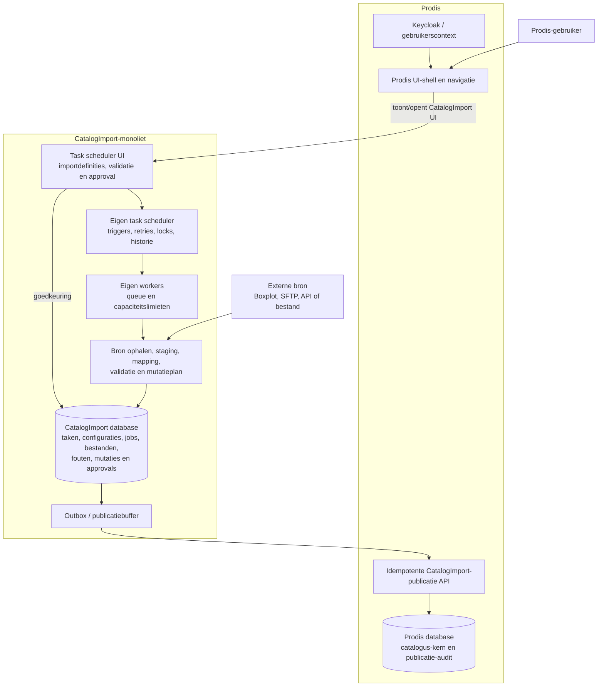

# CatalogImport — integratie met Prodis

## Beslissing

CatalogImport blijft een zelfstandig, modulair monolithisch project met een eigen database. Het bezit de volledige catalogusimportflow: importdefinities, bronconnecties, taakplanning, taakuitvoering, capaciteit, validatie, staging, mutatieplannen, goedkeuring, audit en de betrouwbare buffer voor publicatie naar Prodis.

Prodis blijft het operationele systeem en de gebruikersomgeving. Een Prodis-gebruiker opent daar de CatalogImport-schermen, maar de scherminhoud en de achterliggende API behoren tot CatalogImport. De CatalogImport scheduler is dus **geen** Prodis `ScheduledTask`; hij wordt door CatalogImport opgeslagen en uitgevoerd.

## Verantwoordelijkheden

| Onderdeel | Eigenaar | Verantwoordelijkheid |
| --- | --- | --- |
| CatalogImport UI in Prodis | CatalogImport, aangeboden via Prodis | taskconfiguratie, importdefinities, jobs, validaties en approval tonen en wijzigen |
| Identiteit en toegang | Prodis / Keycloak | gedeelde gebruikerscontext; CatalogImport controleert de aan CatalogImport toegekende rechten |
| Task scheduler | CatalogImport | triggers, retrybeleid, eigen locks, historie en manuele start van importtaken |
| Uitvoeringscapaciteit | CatalogImport | queue, workers, per bron/import gelijktijdigheid en resource-limieten |
| Bronconnectie | CatalogImport | ophalen, credentials-referenties, checksum en versiecontrole |
| Validatie en review | CatalogImport | staging, fouten, mutatieplan, approval en immutable audit |
| Catalogus-kern | Prodis | actuele bedrijfsregels en de definitieve catalogusmutatie |
| Publicatiedelivery | CatalogImport + Prodis API | outbox, retry en idempotente verwerking van goedgekeurde mutaties |

## Gebruikersflow

1. De gebruiker kiest in Prodis **CatalogImport taken**.
2. Prodis opent of host de CatalogImport scheduler-UI met de huidige Keycloak-gebruikerscontext.
3. De gebruiker maakt of wijzigt daar de CatalogImport-taak en zijn importdefinitie.
4. CatalogImport bewaart de taak, configuratieversie en planning in zijn eigen database.
5. De CatalogImport scheduler start de job; een eigen worker verwerkt de bron volgens de ingestelde capaciteit.
6. CatalogImport bewaart validatiefouten en een mutatieplan. Een reviewbare job krijgt `PENDING_APPROVAL`; dit is geen technische taakfout.
7. De gebruiker keurt mutaties in CatalogImport goed of af.
8. Alleen goedgekeurde mutaties komen in de CatalogImport-outbox en worden naar de Prodis-publicatie-API gestuurd.

## Betrouwbaarheid en integriteitsregels

- Een scheduled taak, importjob en publicatiemutatie hebben elk een stabiele externe identiteit.
- De bronchecksum en configuratieversie vormen de import-idempotentiesleutel; een retry maakt geen dubbel plan.
- De outbox bewaart de publicatie vóór het netwerkverzoek. Daardoor gaan goedgekeurde wijzigingen niet verloren wanneer Prodis tijdelijk onbereikbaar is.
- CatalogImport stuurt per mutatie een `externalMutationId`. Prodis past dezelfde mutatie hoogstens één keer toe.
- Prodis valideert bij ontvangst de actuele kernreferenties opnieuw. Een conflict wordt met reden teruggegeven aan CatalogImport voor herreview; het wordt nooit stil overschreven.
- Een onleesbare bron of technische workerfout maakt de CatalogImport-run mislukt. Een inhoudelijk ongeldige lijn blokkeert alleen die lijn en blijft zichtbaar in de validatie-UI.

## Grenzen van de huidige proefversie

De bestaande zelfstandige CSV-proefversie heeft nog geen scheduler, bronconnectors, Keycloak-integratie, persistent detailissue-model, outbox of echte Prodis-publicatie. De lokale `LibraryOffer` is uitsluitend een proefdoel en geen productiebron van Prodis-catalogusdata.

> Important technical constraint discovered
>
> De CatalogImport scheduler behoudt eigendom over planning én uitvoering. Prodis mag de UI hosten of ernaar navigeren, maar bewaart voor dit taaktype geen tweede `ScheduledTask`-record en voert de CatalogImport-job niet zelf uit.
