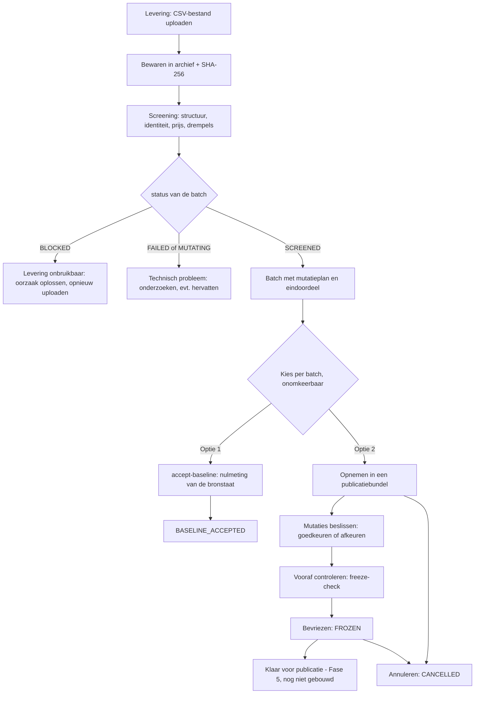

# CatalogImport — handleiding

Stand: 2026-09-24. Deze handleiding wordt bijgewerkt zodra de resterende schermen klaar zijn (zie
[Nog in aanbouw](#5-nog-in-aanbouw)).

Bijbehorende documenten:

- [`standaardflows.md`](standaardflows.md) — acht standaardflows, stap voor stap.
- [`begrippen.md`](begrippen.md) — begrippenlijst en statusreferentie.

Statuslabels in deze handleiding:

- **Beschikbaar** — werkt vandaag in het scherm (bestaat in `Frontend/src/`).
- **Alleen via API** — de backend kan het, er is nog geen scherm voor.
- **In aanbouw** — nog niet (volledig) gebouwd.

Niet alles is door mij in een draaiende applicatie uitgeprobeerd: er draaide bij het schrijven geen backend.
Wat uit de code, het beslissingslog (`docs/decisions.md`) of het scenarioscript volgt, staat als feit. Wat
ik niet kon bevestigen, is gemarkeerd met **nog te verifiëren**.

**Inhoud**

1. [Wat is CatalogImport, en wat niet](#1-wat-is-catalogimport-en-wat-niet)
2. [Het grote plaatje](#2-het-grote-plaatje)
3. [Begrippen in context](#3-begrippen-in-context)
4. [De schermen](#4-de-schermen-die-er-nu-zijn)
5. [Nog in aanbouw](#5-nog-in-aanbouw)
6. [Een screening lezen](#6-de-uitkomst-van-een-screening-lezen)
7. [Belangrijke regels en valkuilen](#7-belangrijke-regels-en-valkuilen)
8. [Foutcodes](#8-foutcodes)
9. [Voor ontwikkelaars en ops](#9-voor-ontwikkelaars-en-ops)

---

## 1. Wat is CatalogImport, en wat niet

CatalogImport controleert catalogusbestanden van leveranciers voordat iets ermee gebeurt. Een **levering**
(vandaag: een handmatig geüpload CSV-bestand) wordt ongewijzigd bewaard, gescreend tegen een vaste
**importdefinitie**, en levert een **mutatieplan** op: een lijst van wat er zou veranderen (nieuwe
artikelen, gewijzigde prijzen). Wat afwijkt komt naar boven als probleem, beoordeling of blokkade. Er
verandert nooit iets stilzwijgend.

**Wat het nog niet doet:**

- Het **publiceert nog niet naar Prodis** (ProDisWebbase/Pervasive). Publiceren is Fase 5. Een bundel
  bevriezen betekent "klaar voor publicatie", niet "gepubliceerd". De status `PUBLISHED` bestaat in het
  model maar wordt niet gezet.
- Er is **geen authenticatie of rechtenbeheer** (Keycloak volgt in Fase 5). Iedereen die de applicatie
  bereikt, kan alles wat de API toelaat. De naam van "wie doet dit" (de *actor*) is een zelf ingetypte
  naam die niet gecontroleerd wordt. Gebruik daarom nooit een andermans naam.
- Er zijn geen automatische leveringen (scheduler, SFTP, API). Alleen manuele upload van een CSV-bestand.
- De frontend is een ontwikkelhulpmiddel: hij draait alleen lokaal tegen een lokale backend en wordt niet
  uitgeleverd (`docs/decisions.md`, 2026-09-23, Q2).
- Het is dus vooral een **controle en simulatie**: u ziet wat er zou gebeuren en legt beslissingen vast.

Er is geen vier-ogenprincipe: één persoon kan een levering aanvaarden of een bundel bevriezen
(beslissing 2026-09-20). Dat risico is bewust genomen en wordt pas met authenticatie heroverwogen.

## 2. Het grote plaatje



In woorden:

1. U uploadt een CSV bij een **taak** van een **koppeling**. De screening loopt meteen mee in dat verzoek.
2. Het resultaat is een **batch** met een `status`, een eindoordeel (`validationResult`), tellers en een
   lijst **mutaties**.
3. Een gescreende batch (`SCREENED`) kan op twee manieren verder, en nooit op allebei:
   - **`accept-baseline`**: de batch wordt de nulmeting van de bronstaat. Zo weet het systeem bij een
     volgende levering wat "ongewijzigd" is. Er wordt niets gepubliceerd.
   - **Publicatiebundel**: de batch wordt in een bundel opgenomen, de mutaties worden goedgekeurd of
     afgekeurd, en de bundel wordt bevroren.
4. Bevriezen en annuleren zijn binnen de applicatie niet meer ongedaan te maken.

## 3. Begrippen in context

Een alfabetische lijst met de exacte waarden staat in [`begrippen.md`](begrippen.md). Hier de begrippen in
hun onderlinge samenhang.

- **Bronorganisatie** — wie het bestand aanlevert: een leverancier (`SUPPLIER`) of een aankoopvereniging
  (`PURCHASING_ASSOCIATION`), bijvoorbeeld een vereniging die voor meerdere leveranciers levert.
- **Leverancier** — bij een koppeling de leverancier waarvoor de artikelen bedoeld zijn (`supplierCode`).
  Ze maakt deel uit van de identiteit van een aanbieding.
- **Importdefinitie en revisie** — de beschrijving van hoe een bestand gelezen wordt: scheidingsteken,
  kolommen, welke kolom de prijs is, drempels. Een definitie heeft **revisies**; een revisie start als
  `DRAFT`, wordt met *activeren* bevroren (`ACTIVE`) en wordt later `SUPERSEDED` als er een nieuwe komt.
  Een levering wordt altijd gescreend tegen de actieve revisie op dat moment, en die revisie wordt bij de
  batch vastgelegd.
- **Sjabloon en bookmarks** — een herbruikbare blauwdruk van een definitie met benoemde invulvelden
  (bookmarks) waaruit per leverancier een eigen definitie wordt afgeleid ("materialisatie"). **Alleen via
  API** en alleen als de setup-API aanstaat.
- **Koppeling (ImportLink)** — verbindt een definitie met een leverancier en een bibliotheek
  (`libraryCode`). Alles wat u ziet in de werkvoorraad hangt aan een koppeling.
- **Taak** — de "ingang" voor leveringen op een koppeling. Een `MANUAL`-taak accepteert manuele uploads. Het
  `taskId` heeft u nodig bij een upload.
- **Levering (Delivery)** — één aangeleverd bestand met een `deliveryReference` die u zelf kiest.
- **Batch** — één screening van een levering tegen één revisie. Het is de eenheid van de werkvoorraad.
- **Aanbiedingsidentiteit** — wat bepaalt dat twee regels dezelfde aanbieding zijn: leverancier +
  leveranciersgroep + leveranciersreferentie, optioneel uitgebreid met kortingscode. Bibliotheek en
  bronorganisatie horen er niet bij. Een lege identiteitscomponent verwerpt de regel.
- **Mutatie** — één voorgestelde wijziging: `CREATE` (nieuw), `UPDATE` (gewijzigd), een
  identiteitsincident of de `IMPORT_MARKER` (bewijs dat de levering verwerkt is).
- **Issue en foutgroep** — een issue is één vaststelling (bijvoorbeeld een onleesbare prijs op regel 6).
  Gelijksoortige issues worden samengevat in een **foutgroep** met het echte aantal.
- **Bronstaat** — wat het systeem als "huidig" beschouwt per aanbieding. Alleen `accept-baseline` schrijft
  er vandaag in. De screening zelf schrijft er nooit in.
- **Publicatiebundel** — een verzameling batches die samen beoordeeld en bevroren wordt. Elke bundel heeft
  een doelmodus: `SIMULATION`, `TRIAL_LIBRARY` of `PRODUCTION`. In Fase 4 (nu) is er geen verschil in
  gedrag; kies bij twijfel `SIMULATION`.
- **Beslissing** — een vastlegging (wie, wanneer, waarom) dat een mutatie is goedgekeurd of afgekeurd, of
  dat een bundel bevroren of geannuleerd is. Het register is alleen-toevoegen: een herziening voegt een
  regel toe en wist niets.
- **Wijzigingsgroep** — alle mutaties van één aanbieding, samengehouden door dezelfde `identityHash`.

## 4. De schermen die er nu zijn

De frontend heeft een menu met twee ingangen: **Werkvoorraad** en **Publicatiebundels**. Bovenaan staat de
**actorbalk**: vul daar eenmalig uw naam in ("Uw naam"). Die wordt bewaard in de browsersessie
(`sessionStorage`) en gebruikt als "wie" bij elke schrijfactie. Sluit u de browsersessie, dan moet u de
naam opnieuw invullen.

### 4.1 Scherm 0 — Werkvoorraad (`/`) — **Beschikbaar** (alleen-lezen)

Toont alle batches, nieuwste eerst.

- **Telblokken**: totaal, en de verdeling per batchstatus en per eindoordeel. De tegel **"Niet
  vastgesteld"** telt batches waarvan het eindoordeel `null` is. Lees dat nooit als "geldig" of "0": er is
  simpelweg nog niets vastgesteld (bijvoorbeeld bij een mislukte screening).
- **Filters**: status, eindoordeel, koppeling, "aangemaakt vanaf" en "aangemaakt tot en met".
- **Tabel**: status, eindoordeel, koppeling, aangemaakt op, kritieke issues, "wacht op goedkeuring" en
  blokkeerreden. Een teller die niet vastgesteld is, staat als "—".
- Een rij klikt **niet** door naar een batchdetail (dat scherm bestaat nog niet, zie sectie 5).

Er is geen enkele schrijfactie op dit scherm.

### 4.2 Scherm 3 — Publicatiebundels (`/bundles`) — **Beschikbaar** (deels)

**Bundellijst** (`/bundles`) — Beschikbaar. Lijst met filter op status, gepagineerd, nieuwste eerst. Hier
kunt u ook een **nieuwe bundel** aanmaken: bundelreferentie (verplicht), omschrijving, **doelmodus** (verplicht,
geen voorselectie; bij `PRODUCTION` verschijnt een waarschuwing), doelmoment en publicatiebeleid (optioneel).
Dezelfde referentie met dezelfde scope geeft de bestaande bundel terug; dezelfde referentie met een andere
scope wordt geweigerd (`BUNDLE_REFERENCE_REUSED_WITH_DIFFERENT_SCOPE`).

**Bundeldetail** (`/bundles/{id}`) heeft vier tabbladen:

| Tabblad | Status | Wat u doet |
| --- | --- | --- |
| **Overzicht** | Beschikbaar (knoppen: In aanbouw) | Tellers (batches, mutaties, gereed, afgekeurd, geblokkeerd, identiteitsincidenten, vervallen, bulkincidenten, kritieke issues, waarschuwingen; zolang de bundel `ASSEMBLING` is ook "wacht op beslissing (PLANNED)" en "wacht op goedkeuring (AWAITING_APPROVAL)"), audit (wie/wanneer/waarom), bundelhash na bevriezen. De knoppen **Bevriezen** en **Annuleren** zijn er, maar staan nog uitgeschakeld. |
| **Leden** | Beschikbaar | Leden van de bundel zien (ook verwijderde, met reden), een lid **verwijderen** (reden verplicht) en **kandidaten toevoegen** (batches selecteren en toevoegen). Alles-of-niets: als één batch niet kan, wordt er geen enkele toegevoegd. |
| **Mutaties** | Beschikbaar | Mutatielijst met filters, per rij **goedkeuren** of **afkeuren** (zie 4.3). |
| **Beslissingen** | **In aanbouw** | Placeholdertekst ("nog niet geïmplementeerd"). Het register is wel bereikbaar via de API. |

Een toegestane actie die verboden is in de huidige toestand staat uitgeschakeld mét reden, niet verborgen.
Elke fout uit de backend toont de stabiele foutcode (zie sectie 8).

### 4.3 De mutatielijst: filters en wijzigingsgroep — **Beschikbaar**

Op het tabblad **Mutaties** kunt u filteren op:

| Filter | Betekenis |
| --- | --- |
| Status | een van de mutatiestatussen |
| Soort (actionType) | `CREATE`, `UPDATE`, ... |
| Batch | één batch binnen de bundel (id) |
| Statusreden | **exacte, hoofdlettergevoelige** vergelijking, bijvoorbeeld `BULK_PRICE_INCIDENT`; blanco = geen filter; een onbekende reden geeft een lege lijst |
| Wijzigingsgroep (identityHash) | alle mutaties van één aanbieding; de hash is hexadecimaal; hoofdletterongevoelig; een ongeldige hash geeft een lege lijst |

Per rij ziet u onder meer: soort, status, identiteit (leverancier/groep/referentie), basisprijs voor en na,
domeinmasker (welk deel wijzigde, bv. `PRICE`), koppelreferentie, bronregel, en de beslissing (wie,
wanneer, beslissings-id). Op de **wijzigingsgroep** klikken zet het filter op die hash, zodat de hele
groep uit de server komt (niet uit één opgehaalde pagina). Bedragen worden getoond zoals ze zijn; de
frontend rekent er nooit mee en berekent geen prijsverschil.

**Individueel beslissen:** goedkeuren (reden optioneel, verplicht bij een herziening) of afkeuren (reden
altijd verplicht). Een herziening keert een eerdere beslissing om; beide regels blijven in het register.
Dezelfde beslissing door dezelfde persoon opnieuw is idempotent (geen tweede regel; het scherm meldt dat).

**Let op:** de knop voor een **groepsbeslissing** bestaat nog niet in het scherm (sectie 5).

## 5. Nog in aanbouw

Volgens de bouwvolgorde in `docs/decisions.md` (2026-09-23, "batchdetail, scherm (2) ... en de
§16-uitbreidingen") en de code in `Frontend/src/routes.tsx` bestaan de volgende onderdelen nog niet.

| Onderdeel | Status | Wat er komt | Tussentijdse route (API) |
| --- | --- | --- | --- |
| **Batchdetail** (`/batches/:batchId`), incl. doorklik vanaf de werkvoorraad, problemen en foutgroepen | In aanbouw | Alleen-lezen weergave van een batch: tellers, eindoordeel, issues, foutgroepen, levering | `GET /batches/{id}`, `/issues`, `/issue-groups`, `/mutations`, `GET /deliveries/{id}` (flow 2 en 6) |
| **Uploadscherm** (scherm 2) | In aanbouw | CSV uploaden met twee benoemde fasen en tijdteller; idempotente herhaling als herstelroute | `POST /tasks/{taskId}/deliveries` (flow 2 en 3) |
| **accept-baseline** en **bundel-opname vanaf de batch** (typ-bevestiging) | In aanbouw | Beide keuzes op het batchscherm | `POST /batches/{id}/accept-baseline`; bundel-opname bestaat al op het tabblad **Leden** van een bundel |
| **`continue`** (hervatten van een batch op `MUTATING`) | In aanbouw | Knop met vermelding dat de actie niet op naam wordt vastgelegd | `POST /batches/{id}/continue` (flow 6) |
| **Groepsbeslissing-dialoog** | In aanbouw | Beslissen over een gefilterde selectie, met dezelfde filter als de lijst | `POST /bundles/{id}/decisions` (flow 5) |
| **Bevriezen- en annuleren-dialogen** | In aanbouw (knoppen staan al, uitgeschakeld) | Voorvlucht (freeze-check), blokkades vooraf, typ-bevestiging van de bundelreferentie | `GET /bundles/{id}/freeze-check`, `POST /bundles/{id}/freeze`, `POST /bundles/{id}/cancel` |
| **Beslissingsregister** (tabblad Beslissingen) | In aanbouw | Alleen-lezen register van beslissingen | `GET /bundles/{id}/decisions` |
| **Inrichting** (bronorganisatie, definitie, koppeling, taak) | **Alleen via API**, achter de setup-vlag | Een productiewaardig beheerscherm komt pas na Fase 5/Keycloak | Setup-API (flow 1) |
| **Sjabloon/materialisatiewizard** | **Alleen via API**, achter de setup-vlag | Nog geen scherm | `/api/catalog-import/templates/...` (flow 1) |
| **Publiceren naar Prodis** | Niet gebouwd (Fase 5) | — | — |

Alle API-voorbeelden staan in [`standaardflows.md`](standaardflows.md). Ze zijn afgeleid van
`scripts/scenario/manual-upload-scenario.sh`.

## 6. De uitkomst van een screening lezen

Een batch heeft twee aparte assen. Verwar ze niet:

- **`status`** zegt hoe ver de verwerking is geraakt.
- **`validationResult`** zegt wat de inhoud waard is.

Een batch kan dus technisch netjes afgerond zijn (`SCREENED`) en toch een oordeel `REVIEW_REQUIRED` of
`BLOCKING` hebben.

### 6.1 `status` van de batch

| Waarde | Betekenis | Terminaal? |
| --- | --- | --- |
| `RECEIVED` | geregistreerd, nog niet gestart | nee |
| `SCREENING` | bestand wordt gelezen en gestaged | nee |
| `MUTATING` | het verschil met de bronstaat wordt bepaald en de mutatielijst gemaakt; **hervatbaar** | nee |
| `SCREENED` | screening klaar, mutaties en marker geschreven | ja |
| `BLOCKED` | contract- of structuurfout (of drempel overschreden): geen inhoudelijke mutaties, wel een marker | ja |
| `FAILED` | technische fout of onderbreking: geen marker, geen mutaties | ja |
| `BASELINE_ACCEPTED` | de gescreende levering is als nulmeting aanvaard | ja |

Bij een `BLOCKED` batch staat de reden in `blockedCode` (bijvoorbeeld `DUPLICATE_IDENTITY_IN_DELIVERY`).

### 6.2 `validationResult` (eindoordeel)

| Waarde | Betekenis |
| --- | --- |
| `VALID` | geen enkel probleem van betekenis |
| `VALID_WITH_WARNINGS` | enkel waarschuwingen; de levering is bruikbaar |
| `REVIEW_REQUIRED` | een mens moet ernaar kijken: wachtende creaties, bulkincident, of een fout op een kritieke kolom |
| `BLOCKING` | een kritiek of blokkerend probleem; er gaat niets door zonder ingreep |
| `null` | **niet vastgesteld** |

`null` is een eigen toestand: er is niets vastgesteld (bijvoorbeeld na een technische fout). Lees het nooit
als 0, "geldig" of "geen problemen". Zo ook voor de tellers: een teller die `null` is, is niet vastgesteld,
en is iets anders dan 0.

De regel achter `REVIEW_REQUIRED` (beslissing 2026-09-20): per kolom bepaalt de configuratie of die kritiek
is. Een fout op een kritieke kolom vraagt een review; een waarschuwing of een fout op een niet-kritieke
kolom niet.

### 6.3 De tellers en hun optelidentiteit

De volgende relaties komen uit de code-documentatie van `GET /batches/{id}` en uit `fase3-rules-design.md`:

- `rawRecordCount = filteredOutCount + errorBeforeFilterCount + rejectedRecordCount + validRecordCount`
- `validRecordCount = newCount + changedCount + unchangedCount + duplicateIdentityCount + identityIncidentCount`

Zonder geconfigureerde recordfilters zijn `filteredOutCount` en `errorBeforeFilterCount` 0. Voorbeeld
(afgeleid uit `levering-1.csv`): 7 regels, 6 geldig, 1 afgewezen, 6 nieuw. De tweede formule volgt uit het
ontwerp; in een **geblokkeerde** batch blijven `newCount`, `changedCount` en `unchangedCount` `null`.
Ik heb de identiteit niet met een echte batch nagerekend (**nog te verifiëren** voor batches met
recordfilters of incidenten).

Andere tellers: `criticalLineCount` (afgewezen regels met een fout op een kritieke kolom),
`criticalIssueCount`, `warningCount`, `bulkIncidentCount`, `awaitingApprovalCount`,
`contentMutationCount` (inhoudelijke mutaties, zonder marker).

### 6.4 Issues versus foutgroepen

- **`/issues`** toont **voorbeeldregels**: rijnummer, code, veld, bronwaarde, ernst. Per foutcode worden
  hoogstens 200 voorbeelden bewaard (`max-sample-rows-per-code`). Een telling over deze lijst is dus
  systematisch te laag.
- **`/issue-groups`** toont per soort fout het **werkelijke aantal** (`occurrenceCount`), het aantal
  bewaarde voorbeelden (`recordedSampleCount`), het aandeel in de scope (`sharePercent`) en of het een
  **bulkincident** is.
- Een foutgroep ontstaat pas vanaf **10 gelijksoortige vaststellingen** (technische groeperingsdrempel).
  Bij een klein bestand is de lijst met groepen dus leeg terwijl er wel issues zijn.
- Ernst: `CRITICAL`, `BLOCKING`, `ERROR`, `WARNING`, `INFO`. Een `ERROR` verwerpt de regel; een
  `WARNING` houdt de levering niet tegen.

### 6.5 INITIAL_LOAD en de drempels

Bij een batch bepaalt het **creatiebeleid** (`creationOutcome`) of nieuwe aanbiedingen zonder tussenkomst
aangemaakt mogen worden:

| `creationOutcome` | Betekenis | Effect op `CREATE`-mutaties |
| --- | --- | --- |
| `AUTOMATIC` | binnen de drempel, of geen creaties | `PLANNED` |
| `INITIAL_LOAD` | de koppeling had nog **geen enkele actieve aanbieding**: deze levering bouwt de bronstaat op | `AWAITING_APPROVAL`, reden `INITIAL_LOAD_REQUIRES_APPROVAL` |
| `THRESHOLD_EXCEEDED` | te veel nieuwe artikelen ten opzichte van de bestaande omvang | `AWAITING_APPROVAL`, reden `BULK_CREATION_INCIDENT` |
| `null` | nog niet beoordeeld | — |

Alle drempels zijn **percentages** per revisie, geen vaste aantallen (beslissing 2026-09-20). Vergelijking:
`aantal × 100 > percentage × omvang`; precies op de grens is niet overschreden.

| Drempel | Standaard | Effect als overschreden |
| --- | --- | --- |
| `creationThresholdSharePercent` | 1 | creaties wachten op goedkeuring (`THRESHOLD_EXCEEDED`) |
| `maxCriticalSharePercent` | 1 | hele levering `BLOCKED` (`CRITICAL_RECORD_THRESHOLD_EXCEEDED`); eronder `REVIEW_REQUIRED` |
| `maxRejectedSharePercent` | niet geconfigureerd | (geen drempel tenzij ingesteld) |
| `bulkIncidentSharePercent` | 1 | bulkincident (`BULK_PRICE_INCIDENT` / `BULK_IDENTITY_INCIDENT`) |
| prijsafwijking | 15% in de demo (`PRICE_DEVIATION_EXCEEDED`) | waarschuwing met vorige waarde en gemiddelden van de laatste 50 en 200 goedgekeurde waarden |

Bij een klein bestand is 1% van 10 regels gelijk aan 0,1, waardoor elke creatie of fout boven de drempel
valt. De demo zet daarom `creationThresholdSharePercent` op 10 en `maxCriticalSharePercent` op 25. Voor een
kleine leverancier zet u het percentage per revisie hoger; dat is een zichtbare, geauditeerde keuze.
De standaardwaarde 1 komt uit het beslissingslog (**nog te verifiëren** in de databasekolomdefaults).
De 15% prijsafwijking is de waarde uit de demo (`README.md` van de repository); de standaard van andere
revisies is **nog te verifiëren**.

### 6.6 Mutatiesoorten en -statussen

Zie de tabellen in [`begrippen.md`](begrippen.md#mutatiesoorten-mutationactiontype) voor de volledige lijst.
Kort:

- Soorten: `CREATE`, `UPDATE`, `IDENTITY_REFERENCE_INCIDENT`, `IMPORT_MARKER`.
- Statussen die vandaag daadwerkelijk voorkomen: `PLANNED`, `AWAITING_APPROVAL`, `BLOCKED`,
  `READY_FOR_PUBLICATION`, `REJECTED`, `SKIPPED`, `RECORDED`, `EXPIRED`. `IN_PROGRESS`, `PUBLISHED` en
  `TECHNICALLY_FAILED` bestaan in het model voor Fase 5 en worden niet gezet.

## 7. Belangrijke regels en valkuilen

1. **`accept-baseline` en bundel-opname sluiten elkaar per batch uit.** Een batch in een (niet
   geannuleerde) bundel kan niet aanvaard worden (409 `BATCH_IN_PUBLICATION_BUNDLE`); een aanvaarde batch
   (`BASELINE_ACCEPTED`) kan niet in een bundel (409 `BATCH_NOT_BUNDLEABLE`, want alleen `SCREENED` mag).
   Binnen de applicatie is die keuze onomkeerbaar. Een geannuleerde bundel geeft haar batches weer vrij.
2. **Bevriezen en annuleren zijn onomkeerbaar.** Het scherm vraagt (zodra de dialogen er zijn) een
   typ-bevestiging van de bundelreferentie.
3. **`accept-baseline` kan maar één keer** per batch en alleen vanuit `SCREENED` (409
   `BATCH_NOT_ACCEPTABLE` anders). `acceptedBy` en `reason` zijn verplicht; `acceptedBy` mag niet `system`
   zijn. Ook wachtende creaties (`AWAITING_APPROVAL`) worden dan `SKIPPED`: de aanvaarding *is* de
   goedkeuring ervan. Vastgehouden identiteitsincidenten worden nooit aanvaard.
4. **Idempotente herupload.** Dezelfde `deliveryReference` met een **identiek bestand** geeft **200** en de
   bestaande levering, zonder nieuwe screening. Dezelfde referentie met een **ander bestand** geeft 409
   `DELIVERY_REFERENCE_REUSED_WITH_DIFFERENT_CONTENT`. Een nieuwe levering vraagt dus een nieuwe
   referentie. Een nieuwe referentie met exact dezelfde inhoud is wél een nieuwe batch (in het scenario:
   0 wijzigingen).
5. **Een tweede levering vóór `accept-baseline` geeft opnieuw een `INITIAL_LOAD`.** De bronstaat is pas
   gevuld na aanvaarding. Zolang de eerste levering niet aanvaard is, ziet de koppeling elke levering als
   een eerste.
6. **Groepsbeslissing: wat raakt ze?** Volgens de code (`PublicationBundleDao`, harde staart van elke
   groepsactie) raakt een groepsbeslissing alleen mutaties die **alle drie** waar zijn: soort `CREATE` of
   `UPDATE`; status `PLANNED` **of** `AWAITING_APPROVAL`; en nog **geen beslissing** (`decision_id` leeg).
   Ze raakt nooit een `BLOCKED` mutatie, een identiteitsincident, de `IMPORT_MARKER` of een reeds
   beslote mutatie. Een herziening kan alleen individueel. De filter kan die selectie alleen **versmallen**.
   Minstens één filterveld is verplicht (`batchId`, `status`, `statusReason`, `actionType`,
   `identityHash`); een lege filter is 400 `DECISION_FILTER_REQUIRED`. Let op: zonder statusfilter zijn ook
   mutaties in `AWAITING_APPROVAL` mee. Wilt u die niet raken, filter dan expliciet op `status=PLANNED`
   (zoals het scenario doet). De filter mag alleen `PLANNED` of `AWAITING_APPROVAL` als status en alleen
   `CREATE` of `UPDATE` als soort bevatten.
7. **Statusreden-filter is exact en hoofdlettergevoelig.** `bulk_price_incident` vindt niets; er is geen
   "bevat"-zoekopdracht. Een onbekende reden geeft een lege lijst en geen fout.
8. **Upload tot 1 GB is synchroon.** De screening loopt binnen het HTTP-verzoek. Voor een groot bestand kan
   dat lang duren; er is geen voortgangsbalk (de voortgang is principieel niet meetbaar). Sluit het
   verzoek niet af: herhaal bij twijfel dezelfde upload met **dezelfde** referentie (veilig, idempotent).
   Is het bestand te groot, dan antwoordt de server met 413 zonder foutcode.
9. **Bevriezen keurt `PLANNED` mee goed op uw naam.** Alle resterende `PLANNED`-mutaties worden bij het
   bevriezen in bulk `READY_FOR_PUBLICATION`, op naam van de bevriezer. Bevriezen weigert zolang er nog
   `AWAITING_APPROVAL` staat (409 `BUNDLE_HAS_UNDECIDED_MUTATIONS`): die vraag wordt nooit stilzwijgend
   beantwoord.
10. **Identiteitsincidenten** (`BLOCKED`, `IDENTITY_REFERENCE_INCIDENT`) hebben in Fase 4 geen
    goedkeur- of afkeurpad. Ze blijven zichtbaar staan en beletten het bevriezen niet.
11. **Een fout op een prijs wordt nooit 0.** Een onleesbare prijs verwerpt de regel (`PRICE_UNREADABLE`).
12. **Dubbele identiteit in één bestand blokkeert de hele levering** (`DUPLICATE_IDENTITY_IN_DELIVERY`);
    "de laatste regel wint" bestaat niet.
13. **`continue` wordt niet op naam vastgelegd.** Het endpoint kent geen actorveld (zie flow 6).
14. **Geen authenticatie.** Elke naam die u invult wordt aanvaard.
15. **Startup-recovery.** Bij het opstarten van de backend wordt een batch die op `SCREENING` bleef staan
    `FAILED` (`SCREENING_INTERRUPTED`); een batch op `MUTATING` blijft hervatbaar. Dat veronderstelt precies
    één draaiende applicatie-instantie.

## 8. Foutcodes

Elke fout van de API heeft een HTTP-status en (meestal) een stabiele `code` in de JSON:
`{"error": "...", "code": "..."}`. Een **400 zonder `code`** komt van een algemene validatie (lege naam, lege
reden, ongeldige paginering, ...) en toont enkel een Engelse tekst in `error`. Een 500 bevat bewust geen
details; zie het serverlogboek. Het scherm toont de code altijd zichtbaar.

Onderstaande tabel is een selectie. De volledige lijst voor het bundelscherm staat in
`Frontend/src/errors/codes.ts`; de overige codes komen uit de services.

### 8.1 Bundels en beslissingen

| Code | HTTP | Betekenis | Wat te doen |
| --- | --- | --- | --- |
| `BUNDLE_NOT_FOUND` | 404 | bundel bestaat niet | terug naar de lijst, id controleren |
| `BATCH_NOT_FOUND` | 404 | batch bestaat niet | id controleren |
| `BATCH_NOT_IN_BUNDLE` | 404 | batch is geen actief lid van deze bundel | ledenlijst controleren |
| `MUTATION_NOT_IN_BUNDLE` | 404 | mutatie hoort niet bij een lid van deze bundel | id controleren |
| `BUNDLE_REFERENCE_REUSED_WITH_DIFFERENT_SCOPE` | 409 | referentie bestaat al met andere doelmodus/-moment/beleid | andere referentie kiezen |
| `BUNDLE_NOT_ASSEMBLING` | 409 | de bundel is al bevroren, geannuleerd of verder; alleen `ASSEMBLING` aanvaardt wijzigingen | niets meer te wijzigen; evt. nieuwe bundel |
| `BATCH_ALREADY_IN_BUNDLE` | 409 | batch zit al in een bundel | eerst uit die bundel halen of een andere batch kiezen |
| `BATCH_NOT_BUNDLEABLE` | 409 | alleen een `SCREENED` batch (niet aanvaard) mag in een bundel | batchstatus controleren |
| `BATCH_VALIDATION_NOT_ESTABLISHED` | 409 | eindoordeel is `null` | screening (opnieuw) afronden |
| `BATCH_VALIDATION_BLOCKING` | 409 | eindoordeel is `BLOCKING` | oorzaak oplossen, opnieuw uploaden |
| `BATCH_HAS_DECIDED_MUTATIONS` | 409 | lid verwijderen zou een ondertekende beslissing wegnemen | niet verwijderen |
| `MUTATION_NOT_DECIDABLE` | 409 | mutatie staat in een status waarin beslissen niet kan (marker, terminale status) | niets te doen |
| `MUTATION_BLOCKED_BY_IDENTITY_INCIDENT` | 409 | kritiek identiteitsincident; geen beslispad in Fase 4 | blijft zichtbaar staan |
| `IDENTITY_DECISION_NOT_IN_SCOPE` | 409 | identiteitsbeslissing hoort in een latere fase | — |
| `DECISION_FILTER_REQUIRED` | 400 | groepsbeslissing zonder filterveld | minstens één filterveld meegeven |
| `BUNDLE_EMPTY` | 409 | bundel heeft geen actieve leden | eerst een batch toevoegen |
| `BUNDLE_HAS_UNDECIDED_MUTATIONS` | 409 | er staan nog mutaties op `AWAITING_APPROVAL` | goedkeuren of afkeuren, dan opnieuw bevriezen |
| `SOURCE_STATE_CHANGED_SINCE_SCREENING` | 409 | de bronstaat is veranderd sinds de screening (bv. een andere batch is aanvaard) | de levering opnieuw screenen (opnieuw uploaden) |
| `BUNDLE_OFFER_CONFLICT` | 409 | twee mutaties in deze bundel raken dezelfde aanbieding | één afkeuren |
| `OFFER_ALREADY_IN_ANOTHER_BUNDLE` | 409 | aanbieding zit al bevroren in een andere bundel | die bundel eerst publiceren of annuleren |
| `BUNDLE_CONTENT_CHANGED_DURING_FREEZE` / `..._DURING_CANCEL` | 409 | inhoud wijzigde tijdens de actie (in de praktijk onbereikbaar) | bundel herladen en opnieuw proberen |
| `BUNDLE_NOT_CANCELLABLE` | 409 | annuleren kan alleen vanuit `ASSEMBLING` of `FROZEN` | — |

### 8.2 Leveringen en batches

| Code | HTTP | Betekenis | Wat te doen |
| --- | --- | --- | --- |
| `TASK_NOT_FOUND` | 404 | taak bestaat niet | `taskId` controleren (`GET /tasks`) |
| `TASK_NOT_MANUAL` | 409 | taak is niet `MANUAL` | een manuele taak gebruiken |
| `NO_ACTIVE_REVISION` | 409 | de definitie heeft geen actieve revisie | revisie activeren |
| `CONFIG_PRICE_FIELD_MISSING` | 409 | de revisie heeft geen prijsveld | revisie corrigeren (opvolger maken) |
| `CONFIG_REQUIRED_BOOKMARK_MISSING` | 409 | verplichte bookmark niet ingevuld; niets wordt gearchiveerd | bookmark invullen |
| `TASK_RUN_IN_PROGRESS` | 409 | voor deze taak loopt al een uitvoering | wachten of het lopende probleem oplossen |
| `DELIVERY_REFERENCE_REUSED_WITH_DIFFERENT_CONTENT` | 409 | referentie al gebruikt met ander bestand | nieuwe referentie kiezen |
| `DELIVERY_NOT_FOUND` | 404 | levering bestaat niet | id controleren |
| `DELIVERY_ALREADY_SCREENED_WITH_THIS_REVISION` | 409 | levering is al gescreend met deze revisie | — |
| `RECORD_COUNT_MISMATCH` / `BYTE_SIZE_MISMATCH` | (issue/blokkade) | het verwachte aantal regels of bytes klopt niet met het bestand | bestand controleren |
| `BATCH_NOT_ACCEPTABLE` | 409 | `accept-baseline` kan alleen vanuit `SCREENED` | batchstatus controleren |
| `BATCH_IN_PUBLICATION_BUNDLE` | 409 | batch zit in een actieve bundel | bundel annuleren of doorwerken via de bundel |
| `BATCH_NOT_RESUMABLE` | 409 | `continue` kan alleen vanuit `MUTATING` | batchstatus controleren |

De exacte HTTP-status van `RECORD_COUNT_MISMATCH` en `BYTE_SIZE_MISMATCH` (issuecode of foutcode) is
**nog te verifiëren**.

### 8.3 Screening (issuecodes en blokkeerredenen)

Dit zijn geen HTTP-fouten maar vaststellingen in `/issues` of een `blockedCode`:

| Code | Betekenis |
| --- | --- |
| `PRICE_UNREADABLE` | prijs niet leesbaar; regel verworpen (nooit 0) |
| `IDENTITY_COMPONENT_EMPTY` | een identiteitscomponent (bv. groep) is leeg; regel verworpen |
| `DUPLICATE_IDENTITY_IN_DELIVERY` | dezelfde aanbieding twee keer in één bestand; levering `BLOCKED` |
| `CRITICAL_RECORD_THRESHOLD_EXCEEDED` | te veel regels met een fout op een kritieke kolom; levering `BLOCKED` |
| `PRICE_DEVIATION_EXCEEDED` | prijssprong groter dan de toegelaten afwijking; waarschuwing |
| `INITIAL_LOAD_REQUIRES_APPROVAL` | eerste levering van de koppeling; creaties wachten |
| `BULK_CREATION_INCIDENT` / `BULK_PRICE_INCIDENT` / `BULK_IDENTITY_INCIDENT` | bulkincident boven de percentagedrempel |
| `HEADER_*`, `SOURCE_*`, `ROW_*` | structuurfouten in bestand of koptekst (bv. `HEADER_FIELD_MISSING`, `SOURCE_FILE_EMPTY`) |
| `CONFIG_*` | de importdefinitie is onvolledig of ongeldig |
| `SCREENING_INTERRUPTED` / `SCREENING_FAILED` | technische onderbreking of fout tijdens de screening |

Het exacte onderscheid tussen welke van deze codes als `blockedCode` en welke als gewone issue
verschijnen, heb ik niet volledig uitgezocht (**nog te verifiëren**). Bevestigd door het scenario en de
repository-`README.md`: `PRICE_UNREADABLE`, `IDENTITY_COMPONENT_EMPTY` (beide afgewezen regels),
`DUPLICATE_IDENTITY_IN_DELIVERY` en `CRITICAL_RECORD_THRESHOLD_EXCEEDED` (beide blokkerend).

### 8.4 Setup-API

Een onbekend id geeft 404, een dubbele code 409 (bv. `DEFINITION_CODE_IN_USE`, `LINK_CODE_IN_USE`,
`SOURCE_ORGANISATION_CODE_IN_USE`, `TASK_NAME_IN_USE`), een ongeldige waarde 400. Een mapping die het
revisieveld dubbel bepaalt: `CONFIG_FIELD_MAPPING_DUPLICATES_REVISION`. Een revisie die niet meer `DRAFT`
is, kan niet meer aangepast worden (`REVISION_NOT_EDITABLE`). Staat de setup-vlag uit, dan is elk `/setup`-,
`/templates`- en `/links`-pad 404 zonder code.

## 9. Voor ontwikkelaars en ops

### 9.1 Vereisten

Java 21, Maven 3.9+, PostgreSQL, Node.js voor de frontend. Databasegegevens via omgevingsvariabelen
(`CATALOG_DB_URL`, `CATALOG_DB_USERNAME`, `CATALOG_DB_PASSWORD`); standaard
`jdbc:postgresql://localhost:5432/catalog_import` met gebruiker en wachtwoord `catalog_import`.
Liquibase voert de migraties uit bij het opstarten (`ddl-auto: validate`; het schema wordt nooit door
Hibernate aangepast).

### 9.2 Backend starten

Twee commando's, niet één:

```bash
mvn -pl Web -am install -DskipTests
mvn -pl Web spring-boot:run "-Dspring-boot.run.profiles=local,demo"
```

- Eerst `install`: het zet `Domain`, `Dao` en `Service` in de lokale Maven-repository. Doet u dat niet, dan
  draait `Web` mogelijk tegen een **verouderde** `Service`-jar (zie 9.7). `mvn -pl Web -am spring-boot:run`
  faalt met "Unable to find a suitable main class".
- De aanhalingstekens rond `-Dspring-boot.run.profiles=...` zijn nodig in PowerShell en onschadelijk in bash.
- **Opstarttijd:** enkele tientallen seconden (**nog te verifiëren**; het scenarioscript wacht maximaal
  120 × 3 s = 6 minuten op de backend).
- Poort: **8081** met profiel `local` (instelbaar met `CATALOG_SERVER_PORT`). Zonder `local` is de standaard
  van Spring 8080. Een eigen poort: `-Dspring-boot.run.arguments=--server.port=8099`.

### 9.3 Profielen

| Profiel | Wat het doet |
| --- | --- |
| `local` | Postgres-verbinding (`localhost:5432/catalog_import`), archiefmap `C:/tmp/catalogimport-archive`, poort 8081 |
| `demo` | **zet de setup-API aan**, maakt bij het opstarten een voorbeeldketen (bronorganisatie `DEMO`, definitie `DEMO-CSV`, actieve revisie, koppeling `DEMO-LINK`, taak *Demo manuele levering*) en logt de `taskId`. Archiefmap: `${java.io.tmpdir}/catalogimport-demo-archive` |
| (geen) | productieachtig: geen setup-API; `catalogimport.archive.root` is verplicht en heeft bewust geen default |

Let op: het bestaande `README.md` in de hoofdmap beschrijft het demoprofiel nog met een in-memory
H2-database en poort 8080. In `application-demo.yml` en `application-local.yml` staat echter Postgres en
poort 8081. Volg de configuratiebestanden. De frontend proxyt `/api` naar `http://localhost:8081`.

**Waarschuwing.** De setup-API (`catalogimport.setup-api.enabled`) kent geen authenticatie. Wie ze bereikt,
kan een importdefinitie en haar drempels bepalen en dus de controle uitschakelen. Zet ze nooit aan met
echte gegevens.

### 9.4 Frontend starten

```bash
npm --prefix Frontend install     # eenmalig
npm --prefix Frontend run dev
```

Vite draait dan op poort **5173** (de standaardpoort van Vite; **nog te verifiëren** voor deze installatie)
en stuurt `/api` door naar de backend op 8081. Er is geen CORS-configuratie: de frontend werkt alleen
via deze proxy. Er is geen productie-uitlevering van de frontend.

### 9.5 Database

PostgreSQL, schema via Liquibase (`Web/src/main/resources/db/changelog/`). Belangrijke ontwerpkeuzes:
unieke constraints op de leveringssleutel, de kandidaat-identiteit, de mutatie-idempotentiesleutel en de
actieve referentie per aanbieding, zodat dubbele verwerking ook bij gelijktijdigheid wordt voorkomen. De
tests draaien tegen de lokale PostgreSQL-database, niet tegen H2 (`docs/decisions.md`, 2026-09-24, C4).
Bestandsinhoud en geheimen worden nooit gelogd.

### 9.6 Testen

Draai altijd gericht, **nooit de hele reactor**. Voorbeelden:

```bash
mvn -pl Web -am test "-Dtest=SetupApiDisabledTest,SetupApiFlowTest,DemoDataSeederTest" -Dsurefire.failIfNoSpecifiedTests=false
mvn -pl Web -am test "-Dtest=DeliveryUploadTest,DeliveryScreeningFlowTest,AcceptBaselineReviewFlowTest,BatchBaselineHttpTest" -Dsurefire.failIfNoSpecifiedTests=false
```

- Neem **maximaal ongeveer 4 testklassen per run**: de databaseverbindingslimiet van de lokale Postgres is
  anders snel bereikt.
- De gegenereerde testsleutels (bronorganisatiecodes e.d.) zijn botsingsvrij tussen runs
  (`System.nanoTime()` plus teller), zodat herhaalde runs op een niet-lege database niet op eerdere rijen
  stuklopen. Dit is doorgevoerd voor `BundleHttpTest` en `CatalogImportWorkQueueHttpTest`; andere
  testklassen gebruiken deels nog het oudere patroon (**nog te verifiëren** per klasse).
- Frontendtests: `npm --prefix Frontend test` (Vitest; in `watch`-modus tenzij u `-- --run` meegeeft;
  **nog te verifiëren**).
- Na een signatuurwijziging in `Service` of `Dao` kan een groene `test-compile` misleidend zijn: zie 9.7.

### 9.7 Bekende valkuilen

- **Verouderde jar.** Draai `mvn -pl Web -am install -DskipTests` vóór elke handmatige `spring-boot:run`,
  anders draait er mogelijk een oudere `Service`-jar (beslissingslog 2026-09-24, C4).
- **`mvn test-compile` herbouwt testbronnen niet** als enkel de classpath (een andere module) wijzigde. Doe
  `mvn clean` of wijzig het testbestand.
- **Achtergrondprocessen in git-bash.** Een in de achtergrond gestarte backend (of Vite) blijft vaak
  draaien nadat de terminal sluit en houdt dan poort 8081/5173 of de database bezet. Controleer voor
  het opstarten of de poort vrij is en stop een oud proces expliciet. (Algemene ervaring met deze
  werkomgeving; niet uit de code gehaald.)
- **PowerShell:** schrijf `curl.exe` in plaats van `curl` (anders is het de alias voor
  `Invoke-WebRequest` en werkt `-F` niet) en zet JSON tussen dubbele aanhalingstekens met `\"`-escapes.
- **Eén applicatie-instantie.** Startup-recovery en het ontbreken van een lease veronderstellen dat er
  precies één backend draait.
- **Slechts één actor-naam per browsersessie**; gedeelde machines: sluit de sessie.

### 9.8 Back-up en hersteltest

Doel (beslissing D13, 2026-09-23): **RPO ≤ 24 uur, RTO ≤ 4 uur**. Uitwerking in
[`docs/design/backup-herstel-design.md`](../design/backup-herstel-design.md); scripts in `scripts/backup/`
(`backup-postgres.sh` / `.ps1`, `restore-and-verify.sh` / `.ps1`, `create-restore-role.sql`).

- Dagelijks 02:00 een `pg_dump -Fc` naar `$CATALOG_BACKUP_DIR/daily/`, met een `pg_restore --list`-controle.
  Zondags ook een kopie naar `weekly/`. Retentie: laatste 7 dagelijkse en laatste 5 wekelijkse dumps
  (een voorstel, niet uit een brondocument).
- Wekelijks (zondag 03:00) een hersteltest in een scratch-database `catalog_import_restoretest`, nooit in
  de echte database. Twee controles: Liquibase-status "up to date" en een rijentelling (> 0) op
  `source_organisation`, `import_definition`, `import_definition_revision`. Bij een fout: exitcode 1 en
  een `FAIL`-regel. Een volledige hersteltest duurde ongeveer 3,5 minuten in een repetitie.
- Verbinding via de libpq-variabelen `PGHOST`, `PGPORT`, `PGDATABASE`, `PGUSER`, `PGPASSWORD` (niet de
  `CATALOG_DB_*`-variabelen); het wachtwoord nooit als argument. `CATALOG_BACKUP_DIR` bepaalt de doelmap.
- De hersteltest heeft een rol met `CREATEDB` nodig (`catalog_import_restore`); een databasebeheerder
  voert `create-restore-role.sql` eenmalig uit.
- Wat er **niet** is: point-in-time recovery (WAL). Een strenger RPO wordt pas heroverwogen als de praktijk
  erom vraagt. Of de planning op de echte productieomgeving is ingericht, weet ik niet (**nog te
  verifiëren**; de scripts zijn gerepeteerd, de productie-installatie niet).

De stappen staan in [flow 8](standaardflows.md#flow-8--back-up-en-hersteltest-draaien).

### 9.9 Het beslissingslog

`docs/decisions.md` legt architectuur- en businessbeslissingen vast. Eerdere beslissingen zijn **bindend**
tot de mens ze expliciet herroept. Lees het bij twijfel over "waarom werkt het zo". Enkele beslissingen die
u als gebruiker raakt: één persoon volstaat voor `accept-baseline` (geen vier-ogen); de frontend is een
ontwikkelhulpmiddel; setup-API blijft een ontwikkelhulp tot Fase 5.

### 9.10 Overige documentatie

| Document | Inhoud |
| --- | --- |
| `README.md` (hoofdmap) | technische startgids en voorbeeldsessie (deels verouderd, zie 9.3) |
| `docs/design/fase2-screening-design.md` | upload, archivering, screening, `accept-baseline` |
| `docs/design/fase3-rules-design.md` | regels, drempels, foutgroepen, eindoordeel |
| `docs/design/fase4-publication-bundle-design.md` | bundels, beslissingen, bevriezen, annuleren |
| `docs/design/frontend-scherm3-bundel-design.md` | schermontwerp bundel |
| `docs/design/sjabloon-materialisatie-design.md` | sjablonen en bookmarks |
| `docs/design/backup-herstel-design.md` | back-up en hersteltest |
| `businessanalyse-catalogimport.md` | de functionele doelanalyse |
| `scripts/scenario/manual-upload-scenario.sh` | doorlopend voorbeeldscenario via de API |
