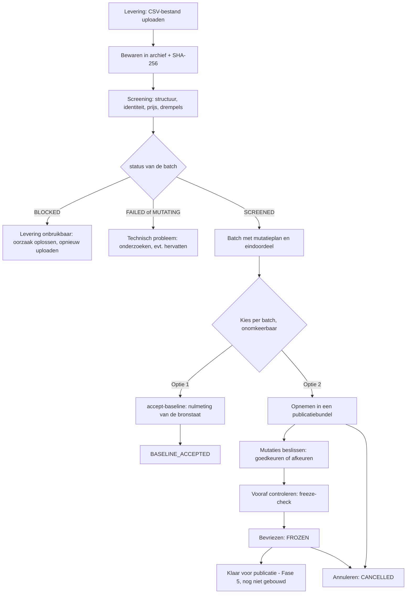

# CatalogImport — handleiding

Stand: 2026-10-01. Wat nog niet gebouwd is, staat in [Nog niet gebouwd](#5-nog-niet-gebouwd).

Bijbehorende documenten:

- [`standaardflows.md`](standaardflows.md) — acht standaardflows, stap voor stap.
- [`begrippen.md`](begrippen.md) — begrippenlijst en statusreferentie.
- [`csv-importeren.md`](csv-importeren.md) — een CSV-bestand importeren (upload, eisen, probleemoplossing).

Statuslabels in deze handleiding:

- **Beschikbaar** — werkt vandaag in het scherm (bestaat in `Frontend/src/`).
- **Alleen via API** — de backend kan het, er is (nog) geen scherm voor (nu enkel nog de PSIMPORT-preview,
  het declareren van invulpunten in een sjabloon en "Nu ophalen" bij de leverancier).
- **Niet gebouwd** — bestaat nog niet.

Niet alles is door mij in een draaiende applicatie uitgeprobeerd: er draaide bij het schrijven geen backend.
Wat uit de code, het beslissingslog (`docs/decisions.md`) of het scenarioscript volgt, staat als feit. Wat
ik niet kon bevestigen, is gemarkeerd met **nog te verifiëren**.

**Inhoud**

1. [Wat is CatalogImport, en wat niet](#1-wat-is-catalogimport-en-wat-niet)
2. [Het grote plaatje](#2-het-grote-plaatje)
3. [Begrippen in context](#3-begrippen-in-context)
4. [De schermen](#4-de-schermen-die-er-nu-zijn)
5. [Nog niet gebouwd](#5-nog-niet-gebouwd)
6. [Een screening lezen](#6-de-uitkomst-van-een-screening-lezen)
7. [Belangrijke regels en valkuilen](#7-belangrijke-regels-en-valkuilen)
8. [Foutcodes](#8-foutcodes)
9. [Voor ontwikkelaars en ops](#9-voor-ontwikkelaars-en-ops)

---

## 1. Wat is CatalogImport, en wat niet

CatalogImport controleert catalogusbestanden van leveranciers voordat iets ermee gebeurt. Een **levering**
(vandaag: een handmatig geüpload CSV-bestand) wordt ongewijzigd bewaard, gescreend tegen een vaste
**beschrijving van het bestand** (technisch: importdefinitie), en levert een **mutatieplan** op: een lijst van wat er zou veranderen (nieuwe
artikelen, gewijzigde prijzen). Wat afwijkt komt naar boven als probleem, beoordeling of blokkade. Er
verandert nooit iets stilzwijgend.

**Wat het nog niet doet:**

- Het **publiceert nog niet naar Prodis** (ProDisWebbase/Pervasive). Publiceren is Fase 5. Een bundel
  bevriezen betekent "klaar voor publicatie", niet "gepubliceerd". De status `PUBLISHED` bestaat in het
  model maar wordt niet gezet. Er is wel een read-only **PSIMPORT-preview** van een bevroren bundel (zie
  4.5); dat is geen echt PSIMPORT-formaat.
- **Rechten per actie (5-PERM) zijn er wel**, maar de **koppeling met Prodis nog niet** (5B-7): de rechten
  komen voorlopig uit een lokale YAML-lijst (zie 9.3 en de hoofd-`README.md`). Daarnaast is er een
  **Keycloak-login** (via de backend als BFF, met sessiecookie en CSRF-header): wie niet aangemeld is, krijgt
  401 `AUTHENTICATION_REQUIRED`. Aangemeld zijn volstaat niet: elke actie vraagt een recht (zie 7a). De naam
  van "wie doet dit" (de *actor*) komt uit het token (`preferred_username`), niet uit een ingetypte naam.
- Er zijn geen automatische of periodieke leveringen (geen scheduler, geen API-bron). Een levering komt binnen
  via manuele upload, via de beheerde servermap, of - voor een taak met een Leveringsconfiguratie - via
  handmatig "Nu ophalen" bij de leverancier over SFTP. Dat laatste bestaat voorlopig enkel als API
  (`POST /api/catalog-import/tasks/{id}/fetch-runs`, recht MANAGE; één bestand per keer); er is nog geen
  scherm voor (zie `docs/design/leveringsconfiguratie-design.md`).
- De frontend is een ontwikkelhulpmiddel: hij draait alleen lokaal tegen een lokale backend en wordt niet
  uitgeleverd (`docs/decisions.md`, 2026-09-23, Q2).
- Het is dus vooral een **controle en simulatie**: u ziet wat er zou gebeuren en legt beslissingen vast.

Er is geen vier-ogenprincipe: één persoon kan een levering aanvaarden of een bundel bevriezen
(beslissing 2026-09-20). Dat risico is bewust genomen; de login (5-AUTH) legt wel vast wíe het deed.

## 2. Het grote plaatje


```mermaid
flowchart TD
    A[Levering: CSV-bestand uploaden] --> B[Bewaren in archief + SHA-256]
    B --> C[Screening: structuur, identiteit, prijs, drempels]
    C --> D{status van de batch}
    D -->|BLOCKED| X[Levering onbruikbaar: oorzaak oplossen, opnieuw uploaden]
    D -->|FAILED of MUTATING| Y[Technisch probleem: onderzoeken, evt. hervatten]
    D -->|SCREENED| E[Batch met mutatieplan en eindoordeel]
    E --> F{Kies per batch, onomkeerbaar}
    F -->|Optie 1| G[accept-baseline: nulmeting van de bronstaat]
    F -->|Optie 2| H[Opnemen in een publicatiebundel]
    G --> Z1[BASELINE_ACCEPTED]
    H --> I[Mutaties beslissen: goedkeuren of afkeuren]
    I --> J[Vooraf controleren: freeze-check]
    J --> K[Bevriezen: FROZEN]
    K --> L[Klaar voor publicatie - Fase 5, nog niet gebouwd]
    H --> M[Annuleren: CANCELLED]
    K --> M
```

In woorden:

0. Eerst richt u de leverancier in en maakt u een taak (zie 4.6 "Nieuwe leverancier en taak aanmaken") en
   controleert u de koppeling (zie 4.7 "Controleren"). Dat is eenmalig per leverancier.
1. U uploadt een CSV bij een **taak** van een **koppeling**. De screening loopt meteen mee in dat verzoek.
2. Het resultaat is een **batch** met een `status`, een eindoordeel (`validationResult`), tellers en een
   lijst **mutaties**.
3. Een gescreende batch (`SCREENED`) kan op twee manieren verder, en nooit op allebei:
   - **`accept-baseline`**: de batch wordt de nulmeting van de bronstaat. Zo weet het systeem bij een
     volgende levering wat "ongewijzigd" is. Er wordt niets gepubliceerd.
   - **Publicatiebundel**: de batch wordt in een bundel opgenomen, de mutaties worden goedgekeurd of
     afgekeurd, en de bundel wordt bevroren.
4. Bevriezen en annuleren zijn binnen de applicatie niet meer ongedaan te maken.

## 3. Begrippen in context

Een alfabetische lijst met de exacte waarden staat in [`begrippen.md`](begrippen.md). Hier de begrippen in
hun onderlinge samenhang.

- **Leverancier of aankoopvereniging** — wie het bestand aanlevert: een leverancier (`SUPPLIER`) of een
  aankoopvereniging (`PURCHASING_ASSOCIATION`), bijvoorbeeld een vereniging die voor meerdere leveranciers
  levert. (Technisch: bronorganisatie, `SourceOrganisation`.)
- **Leverancier (van de artikelen)** — bij een koppeling de leverancier waarvoor de artikelen bedoeld zijn
  (`supplierCode`). Ze maakt deel uit van de identiteit van een aanbieding.
- **Beschrijving van het bestand en versie** — de beschrijving van hoe een bestand gelezen wordt:
  scheidingsteken, kolommen, welke kolom de prijs is, drempels. (Technisch: importdefinitie en revisie.) Een
  beschrijving heeft **versies**; een versie start als concept (`DRAFT`), wordt met *activeren* bevroren
  (`ACTIVE`) en wordt later vervangen (`SUPERSEDED`) als er een nieuwe komt. Er is **hoogstens één concept**
  per beschrijving tegelijk. Een levering wordt altijd gescreend tegen de actieve versie op dat moment, en
  die versie wordt bij de batch vastgelegd.
- **Sjabloon en invulpunten** — een herbruikbare blauwdruk van een beschrijving met benoemde invulpunten
  (technisch: bookmarks) waaruit per leverancier een eigen beschrijving wordt afgeleid ("materialisatie").
  Sjablonen bekijken en er een beschrijving uit afleiden kan in het scherm **Sjablonen** (en als startpunt
  in de wizard, zie 4.6). Het declareren van invulpunten in een sjabloon zelf kan alleen via de API.
- **Koppeling (ImportLink)** — verbindt een beschrijving van het bestand met een leverancier en een
  bibliotheek (`libraryCode`). Alles wat u ziet in de werkvoorraad hangt aan een koppeling.
- **Taak** — de "ingang" voor leveringen op een koppeling. Een `MANUAL`-taak accepteert manuele uploads. Het
  `taskId` heeft u nodig bij een upload.
- **Levering (Delivery)** — één aangeleverd bestand met een `deliveryReference` die u zelf kiest.
- **Batch** — één screening van een levering tegen één versie van de beschrijving van het bestand. Het is de eenheid van de werkvoorraad.
- **Aanbiedingsidentiteit** — wat bepaalt dat twee regels dezelfde aanbieding zijn: leverancier +
  leveranciersgroep + leveranciersreferentie, optioneel uitgebreid met kortingscode. Bibliotheek en
  leverancier of aankoopvereniging (de aanleverende partij) horen er niet bij. Een lege identiteitscomponent verwerpt de regel.
- **Mutatie** — één voorgestelde wijziging: `CREATE` (nieuw), `UPDATE` (gewijzigd), een
  identiteitsincident of de `IMPORT_MARKER` (bewijs dat de levering verwerkt is).
- **Issue en foutgroep** — een issue is één vaststelling (bijvoorbeeld een onleesbare prijs op regel 6).
  Gelijksoortige issues worden samengevat in een **foutgroep** met het echte aantal.
- **Bronstaat** — wat het systeem als "huidig" beschouwt per aanbieding. Alleen `accept-baseline` schrijft
  er vandaag in. De screening zelf schrijft er nooit in.
- **Publicatiebundel** — een verzameling batches die samen beoordeeld en bevroren wordt. Elke bundel heeft
  een doelmodus: `SIMULATION`, `TRIAL_LIBRARY` of `PRODUCTION`. In Fase 4 (nu) is er geen verschil in
  gedrag; kies bij twijfel `SIMULATION`.
- **Beslissing** — een vastlegging (wie, wanneer, waarom) dat een mutatie is goedgekeurd of afgekeurd, of
  dat een bundel bevroren of geannuleerd is. Het register is alleen-toevoegen: een herziening voegt een
  regel toe en wist niets.
- **Wijzigingsgroep** — alle mutaties van één aanbieding, samengehouden door dezelfde `identityHash`.

## 4. De schermen die er nu zijn

De frontend heeft een menu met onder andere **Werkvoorraad**, **Levering uploaden**, **Publicatiebundels**,
**Inrichting** (leveranciers, beschrijvingen, koppelingen en taken; hier start ook "Nieuwe leverancier en
taak") en **Sjablonen** (de exacte menuvolgorde en -labels zijn niet nagelopen: **nog te verifiëren**). Bij
het openen (`http://localhost:5173`) wordt u bij Keycloak aangemeld. Bovenaan staat
de **actorbalk**: "Aangemeld als *naam*" met een knop **Afmelden**. Die naam (uit het token) wordt gebruikt als
"wie" bij elke schrijfactie; u kunt hem niet aanpassen. Verloopt de sessie (401), dan meldt de frontend u opnieuw
aan.

### 4.1 Scherm 0 — Werkvoorraad (`/`) — **Beschikbaar** (alleen-lezen)

Toont alle batches, nieuwste eerst.

- **Telblokken**: totaal, en de verdeling per batchstatus en per eindoordeel. De tegel **"Niet
  vastgesteld"** telt batches waarvan het eindoordeel `null` is. Lees dat nooit als "geldig" of "0": er is
  simpelweg nog niets vastgesteld (bijvoorbeeld bij een mislukte screening).
- **Filters**: status, eindoordeel, koppeling, "aangemaakt vanaf" en "aangemaakt tot en met".
- **Tabel**: status, eindoordeel, koppeling, aangemaakt op, kritieke issues, "wacht op goedkeuring" en
  blokkeerreden. Een teller die niet vastgesteld is, staat als "—".
- Een rij klikt door naar het batchdetail (`/batches/:batchId`, zie 4.2); dat scherm bestaat en werkt
  (`Frontend/src/features/workqueue/WorkQueuePage.tsx`, kolom `batchId` met `<Link to={/batches/${row.batchId}}>`).

Er is geen enkele schrijfactie op dit scherm.

### 4.2 Scherm (2) — Batchdetail (`/batches/:batchId`) — **Beschikbaar**

Alleen-lezen overzicht van een batch, plus de acties die vanaf een `SCREENED`- of `MUTATING`-batch horen
(`Frontend/src/features/batches/BatchDetailPage.tsx`, `BatchActions.tsx`, `BatchDeliverySection.tsx`,
`BatchIssueGroupsSection.tsx`, `BatchIssuesSection.tsx`).

- **Stand**: status, eindoordeel (of "niet vastgesteld"), blokkeercode/-reden, koppeling, levering, poging,
  tijdstippen, creatiebeleid, alle tellers (`—` bij `null`), en — na `accept-baseline` — wie de nulmeting
  aanvaardde, wanneer en met welke reden.
- **Levering**: een aparte sectie met de leveringsgegevens (`BatchDeliverySection`).
- **Foutgroepen en issues**: `BatchIssueGroupsSection` en `BatchIssuesSection`; een groep selecteren filtert
  de issues.
- **Mutaties**: dezelfde herbruikbare mutatielijst als op het bundelscherm, gefilterd op deze batch.
- **Acties** (`BatchActions.tsx`), alleen zichtbaar in de bijpassende status:
  - Bij `SCREENED`: **Aanvaarden als nulmeting** (`accept-baseline`) en **Opnemen in bundel**. Beide via een
    bevestigingsdialoog met een verplichte reden en het overtypen van een vaste bevestigingstekst
    (`NULMETING` resp. de bundelreferentie). Een batch die al in een bundel zit of al aanvaard is, geeft de
    bekende 409-foutcodes.
  - Bij `MUTATING`: **Batch hervatten** (`continue`), met een expliciete vermelding dat deze actie niet op
    naam wordt vastgelegd (het endpoint heeft geen actorveld).
- Een teller die niet vastgesteld is, staat als "—", nooit als 0. Het scherm is bereikbaar vanuit de werkvoorraad
  en vanuit scherm 0 (klik op een rij) en vanuit het uploadscherm na een geslaagde upload.
- Foutcodes bij de acties: 409 `BATCH_IN_PUBLICATION_BUNDLE` (de batch zit al in een actieve bundel; annuleer
  die bundel of werk via de bundel door), 409 `BATCH_NOT_ACCEPTABLE` (de batch is niet (meer) `SCREENED`) en
  bij hervatten 409 `BATCH_NOT_RESUMABLE` (niet `MUTATING`).

### 4.2b Scherm — Uploaden (`/upload`) — **Beschikbaar**

Zie [`csv-importeren.md`](csv-importeren.md) §4.4. Kort: taak kiezen, bestand kiezen; de `deliveryReference`
wordt voorgesteld als `<bestandsnaam>#<12 hex SHA-256>` (deterministisch, dus veilig te herhalen); twee
benoemde fasen (uploaden, screenen) met tijdteller; bij netwerkfout of 5xx de herstelroute "Herhaal met
dezelfde referentie". **201** = levering aangemaakt en gescreend; **200** = bestaande levering teruggevonden,
niet opnieuw gescreend. `expectedRecordCount` en `expectedByteSize` zijn optioneel.

### 4.3 Scherm 3 — Publicatiebundels (`/bundles`) — **Beschikbaar**

**Bundellijst** (`/bundles`) — Beschikbaar. Lijst met filter op status, gepagineerd, nieuwste eerst. Hier
kunt u ook een **nieuwe bundel** aanmaken: bundelreferentie (verplicht), omschrijving, **doelmodus** (verplicht,
geen voorselectie; bij `PRODUCTION` verschijnt een waarschuwing), doelmoment en publicatiebeleid (optioneel).
Dezelfde referentie met dezelfde scope geeft de bestaande bundel terug; dezelfde referentie met een andere
scope wordt geweigerd (`BUNDLE_REFERENCE_REUSED_WITH_DIFFERENT_SCOPE`).

**Bundeldetail** (`/bundles/{id}`) heeft vijf tabbladen:

| Tabblad | Status | Wat u doet |
| --- | --- | --- |
| **Overzicht** | Beschikbaar | Tellers (batches, mutaties, goedgekeurd, afgekeurd, geblokkeerd, identiteitsincidenten, vervallen, bulkincidenten, kritieke issues, waarschuwingen; zolang de bundel `ASSEMBLING` is ook "wacht op beslissing (PLANNED)" en "wacht op goedkeuring (AWAITING_APPROVAL)"), audit (wie/wanneer/waarom), bundelhash na bevriezen. De knoppen **Bevriezen** en **Annuleren** werken: elk opent een dialoog met een voorvlucht/telling, blokkades met reden, en een verplichte typ-bevestiging van de bundelreferentie (`FreezeDialog.tsx`, `CancelDialog.tsx`). Een niet-toegestane actie staat uitgeschakeld mét reden, niet verborgen. |
| **Leden** | Beschikbaar | Leden van de bundel zien (ook verwijderde, met reden), een lid **verwijderen** (reden verplicht) en **kandidaten toevoegen** (batches selecteren en toevoegen). Alles-of-niets: als één batch niet kan, wordt er geen enkele toegevoegd. |
| **Mutaties** | Beschikbaar | Mutatielijst met filters, per rij **goedkeuren** of **afkeuren**, plus de groepsbeslissing (zie 4.4). |
| **Beslissingen** | Beschikbaar | Alleen-lezen, gepagineerd register van beslissingen: tijdstip, soort, bereik (mutatie/groep/bundel), beslisser, aantal, statusovergang, filter en reden (`BundleDecisionsTab.tsx`). |
| **Publicatie** | Beschikbaar (alleen proefpublicatie) | Voor een bevroren bundel kunt u een **"Proefpublicatie starten"** (recht Goedkeuren). Er wordt niets naar Prodis geschreven; echt publiceren kan nog niet. |

Een toegestane actie die verboden is in de huidige toestand staat uitgeschakeld mét reden, niet verborgen.
Elke fout uit de backend toont de stabiele foutcode (zie sectie 8).

Op het tabblad **Leden** staan de koppelingscodes van de batches (niet meer het kale `#id`). In de
annuleerdialoog staat het aantal mutaties dat vervalt: dat komt uit `BundleDetail.expirableCount`. Bij een
geannuleerde bundel is dat `null` (niet vastgesteld); **0 is een geldige waarde** ("er vervalt niets").

### 4.4 De mutatielijst: filters, wijzigingsgroep en groepsbeslissing — **Beschikbaar**

Op het tabblad **Mutaties** kunt u filteren op:

| Filter | Betekenis |
| --- | --- |
| Status | een van de mutatiestatussen |
| Soort (actionType) | `CREATE`, `UPDATE`, ... |
| Batch | één batch binnen de bundel (id) |
| Statusreden | **exacte, hoofdlettergevoelige** vergelijking, bijvoorbeeld `BULK_PRICE_INCIDENT`; blanco = geen filter; een onbekende reden geeft een lege lijst |
| Wijzigingsgroep (identityHash) | alle mutaties van één aanbieding; de hash is hexadecimaal; hoofdletterongevoelig; een ongeldige hash geeft een lege lijst |

Per rij ziet u onder meer: soort, status, identiteit (leverancier/groep/referentie), basisprijs voor en na,
domeinmasker (welk deel wijzigde, bv. `PRICE`), koppelreferentie, bronregel, en de beslissing (wie,
wanneer, beslissings-id). Op de **wijzigingsgroep** klikken zet het filter op die hash, zodat de hele
groep uit de server komt (niet uit één opgehaalde pagina). Bedragen worden getoond zoals ze zijn; de
frontend rekent er nooit mee en berekent geen prijsverschil.

**Individueel beslissen:** goedkeuren (reden optioneel, verplicht bij een herziening) of afkeuren (reden
altijd verplicht). Een herziening keert een eerdere beslissing om; beide regels blijven in het register.
Dezelfde beslissing door dezelfde persoon opnieuw is idempotent (geen tweede regel; het scherm meldt dat).

**Groepsbeslissing** (`GroupDecisionDialog.tsx`, in de werkbalk van de mutatielijst): beslist in één
bevestiging over **alle** mutaties die aan de toegepaste lijstfilter voldoen, niet enkel de zichtbare
pagina. Het aantal uit de lijst (`totalElements`) staat vóór de bevestiging in beeld als bovengrens; het
werkelijke aantal kan lager zijn (bv. omdat een mutatie al beslist is of geblokkeerd staat) en dat wordt
gemeld. Groepsafkeuren vraagt altijd een reden; groepsgoedkeuren niet. Er is geen typ-bevestiging, wel de
waarschuwing dat één bevestiging op uw naam over veel mutaties tegelijk beslist. De groepsactie weigert
onbekende velden (topniveau of `filter`) met 400 `DECISION_FILTER_UNKNOWN_FIELD`.

### 4.5 PSIMPORT-preview — **Alleen via API**

`GET /api/catalog-import/bundles/{id}/psimport-preview` (JSON, of `?format=csv`; `page`/`size`) toont voor een
**`FROZEN`** bundel welke `READY_FOR_PUBLICATION`-mutaties (`CREATE`/`UPDATE`) later naar PSIMPORT zouden gaan.
Een andere bundelstatus geeft 409 `BUNDLE_NOT_FROZEN`. Het is **read-only** (geen afleverregister, niets naar
ProDisWebbase) en **niet-contractueel**: het antwoord draagt `previewOnly` en de contractstatus
`UNVERIFIED_FIELD_INVENTORY`; velden als `ARIMP_Verwerken` krijgen nooit een waarde. Er is geen scherm voor. Zie
`docs/design/fase4-publication-bundle-design.md` §16 en `docs/decisions.md` (2026-09-25).

### 4.6 Nieuwe leverancier en taak aanmaken — **Beschikbaar** (recht Beheren)

Hiermee richt u zelf een nieuwe leverancier in, tot en met een taak waarmee u kunt uploaden. Open
**Inrichting** en kies **"Nieuwe leverancier en taak"** (route `/setup/new`). Zonder het recht *Beheren* staat
de knop uitgeschakeld, met de reden erbij. Elke stap wordt meteen bewaard; er gaat dus niets verloren als u
het scherm sluit.

Het stappenplan:

1. **Leverancier** — de leverancier of aankoopvereniging die het bestand aanlevert: code, naam en soort.
2. **Startpunt** — kies **zelf beschrijven** (u geeft zelf op hoe het bestand eruitziet) of **vanuit een
   sjabloon** van deze leverancier of aankoopvereniging (u vult de invulpunten van het sjabloon in; bij een
   aankoopvereniging kiest of maakt u eerst de leverancier waarvoor de artikelen zijn).
3. **Beschrijving van het bestand** — scheidingsteken, aanhalingsteken, tekenset, kop, welke kolommen de
   identiteit en de prijs vormen en hoe u een aanbieding herkent. U maakt hiermee een **concept** (versie 1).
   De drempels worden niet gevraagd: daarvoor gelden de standaardwaarden (u past ze later aan met een nieuwe
   versie).
4. **Koppeling** — verbindt de beschrijving met de leverancier en de bibliotheek, met een vaste valuta voor
   bestanden zonder valutakolom.
5. **Taak** — een manuele taak, de ingang waarop u later uploadt. (Een sjabloon afleiden maakt zelf nooit
   een taak; die stap blijft apart.)
6. **Klaar** — een samenvatting met de knop **"Controleer en activeer de conceptversie"**. De wizard
   activeert zelf nooit: dat doet u bewust op het scherm Controleren (4.7).

Goed om te weten:

- **Verder inrichten.** Bij een niet afgemaakte leverancier staat in **Inrichting** de knop "Verder
  inrichten"; die brengt u terug naar de eerstvolgende stap die nog moet gebeuren.
- **Bestaat de code al?** Dan meldt het scherm dat (409) en biedt het aan om **door te gaan met de bestaande**,
  maar alleen als die bij dezelfde ouder hoort. Gaat het netwerk weg tijdens een stap, dan leest het scherm
  eerst opnieuw wat er al staat voordat het iets herhaalt.
- **Hoogstens één concept per beschrijving.** Is er al een concept, dan weigert de server een tweede
  (409 `REVISION_DRAFT_ALREADY_EXISTS`) en toont de wizard het bestaande concept. Dit geldt ook als u in twee
  tabbladen tegelijk werkt.
- Een tab als scheidingsteken kan niet via deze weg worden ingesteld (**technische beperking**).
- In **Inrichting** staan de taken onder hun koppeling, met een knop "Taak toevoegen". Een taak waarvan de
  beschrijving nog geen actieve versie heeft, staat er als "nog niet klaar: versie niet geactiveerd" en is
  op het uploadscherm zichtbaar maar uitgeschakeld.

### 4.7 Controleren — **Beschikbaar**

Elke koppeling heeft een scherm **Controleren** (route `/setup/links/{linkId}/check`), bereikbaar via de
samenvatting van de wizard, via de inrichtingsboom en via een melding op het uploadscherm. Het scherm heeft
vier delen. Lezen mag met het recht *Lezen*; de proefinlezing en het activeren vragen *Beheren*.

1. **Checklist.** Alle punten die een levering nu nog zouden tegenhouden, tegelijk, elk met een zin in gewoon
   Nederlands, het betrokken veld ("Veld:", "Doelveld:", "Kolom:") en "Wat moet ik doen?". U krijgt dus alle
   fouten in de beschrijving van het bestand in één keer te zien, niet één per keer. Sommige controles hangen
   van andere af en kunnen pas lopen als die eerste in orde zijn: dan staat er een melding "Sommige controles
   konden nog niet uitgevoerd worden …" met de oorzaak. **Zo'n melding betekent niet dat alles in orde is**:
   los de genoemde fouten op en herlaad de checklist. De checklist werkt zonder bestand. Wat ze niet
   controleert: of de doelbibliotheek bestaat in Prodis (dat wordt expliciet zo gemeld) en de invulpunten die
   per koppeling pas ingevuld kunnen worden nadat de versie actief is.
2. **Proefinlezing.** U kiest een bestand en laat het volgens deze versie lezen **zonder iets op te slaan of
   te publiceren** (dat staat in een banner). Het resultaat toont: het oordeel ("Deze levering zou aanvaard
   worden" of "zou tegengehouden worden omdat …", telkens de eerste blokkade), de tellers (een "—" is niet
   vastgesteld, nooit 0), de kolommen die ontbreken, "Zo lezen we uw bestand" (de eerste voorbeeldregels
   zoals het systeem ze leest, prijs ruw en gelezen), de gevonden problemen per soort, de gebruikte
   drempels, een hint als de tekenset niet lijkt te kloppen, en alle fouten in de beschrijving van het
   bestand. Wat een proef **niet** kan controleren, staat onder "Niet gecontroleerd in een proef" (onder meer
   het creatiebeleid en de vergelijking met de bronstaat). Het lezen is begrensd door de maximale
   uploadgrootte; de server logt één regel zonder inhoud.
3. **Activeren.** Activeert de conceptversie (bestaande actie). Is er op dit scherm nog geen **geslaagde**
   proefinlezing met deze versie geweest, dan krijgt u vooraf een duidelijke **waarschuwing**. Een proef is
   dus niet verplicht (beslissing 2026-09-30), maar wel sterk aangeraden. Na het activeren wordt de
   checklist herladen.
4. **Wat nu?** Een korte uitleg van het vervolg: de **eerste echte levering** wacht na de screening nog op
   uw goedkeuring (de eerste levering van een koppeling is altijd een `INITIAL_LOAD`, zie 6.5). Dat is de
   laatste controle: pas na het aanvaarden als nulmeting of het opnemen in een bundel is er iets beslist.

## 5. Nog niet gebouwd

Deze onderdelen bestaan (nog) niet als scherm of functie. Alle schermen uit sectie 4 (werkvoorraad, upload,
batchdetail, bundeloverzicht/leden/mutaties/beslissingen, nieuwe leverancier en taak, controleren) zijn
gebouwd, gerouteerd (`Frontend/src/routes.tsx`) en werkend.

| Onderdeel | Status | Tussentijdse route (API) |
| --- | --- | --- |
| **Sjablonen beheren: invulpunten en gebruiksverklaringen declareren** | Geen scherm; alleen via de API, achter de setup-vlag (zie 7a en 9.3) | `/api/catalog-import/templates/...` (flow 1B) |
| **Publiceren naar Prodis** (Fase 5, 5-PUB) | Niet gebouwd | — |
| **Echt PSIMPORT-formaat** | Niet gebouwd; enkel de niet-contractuele preview (4.5) | — |
| **Rechten per actie** (5-PERM) | Gebouwd met een lokale rechtenbron (YAML); de Prodis-koppeling (5B-7) is **niet gebouwd** | zie sectie 7a |

Alle API-voorbeelden staan in [`standaardflows.md`](standaardflows.md). Ze zijn afgeleid van
`scripts/scenario/manual-upload-scenario.sh`.

## 6. De uitkomst van een screening lezen

Een batch heeft twee aparte assen. Verwar ze niet:

- **`status`** zegt hoe ver de verwerking is geraakt.
- **`validationResult`** zegt wat de inhoud waard is.

Een batch kan dus technisch netjes afgerond zijn (`SCREENED`) en toch een oordeel `REVIEW_REQUIRED` of
`BLOCKING` hebben.

### 6.1 `status` van de batch

| Waarde | Betekenis | Terminaal? |
| --- | --- | --- |
| `RECEIVED` | geregistreerd, nog niet gestart | nee |
| `SCREENING` | bestand wordt gelezen en gestaged | nee |
| `MUTATING` | het verschil met de bronstaat wordt bepaald en de mutatielijst gemaakt; **hervatbaar** | nee |
| `SCREENED` | screening klaar, mutaties en marker geschreven | ja |
| `BLOCKED` | contract- of structuurfout (of drempel overschreden): geen inhoudelijke mutaties, wel een marker | ja |
| `FAILED` | technische fout of onderbreking: geen marker, geen mutaties | ja |
| `BASELINE_ACCEPTED` | de gescreende levering is als nulmeting aanvaard | ja |

Bij een `BLOCKED` batch staat de reden in `blockedCode` (bijvoorbeeld `DUPLICATE_IDENTITY_IN_DELIVERY`).

### 6.2 `validationResult` (eindoordeel)

| Waarde | Betekenis |
| --- | --- |
| `VALID` | geen enkel probleem van betekenis |
| `VALID_WITH_WARNINGS` | enkel waarschuwingen; de levering is bruikbaar |
| `REVIEW_REQUIRED` | een mens moet ernaar kijken: wachtende creaties, bulkincident, of een fout op een kritieke kolom |
| `BLOCKING` | een kritiek of blokkerend probleem; er gaat niets door zonder ingreep |
| `null` | **niet vastgesteld** |

`null` is een eigen toestand: er is niets vastgesteld (bijvoorbeeld na een technische fout). Lees het nooit
als 0, "geldig" of "geen problemen". Zo ook voor de tellers: een teller die `null` is, is niet vastgesteld,
en is iets anders dan 0.

De regel achter `REVIEW_REQUIRED` (beslissing 2026-09-20): per kolom bepaalt de configuratie of die kritiek
is. Een fout op een kritieke kolom vraagt een review; een waarschuwing of een fout op een niet-kritieke
kolom niet.

### 6.3 De tellers en hun optelidentiteit

De volgende relaties komen uit de code-documentatie van `GET /batches/{id}` en uit `fase3-rules-design.md`:

- `rawRecordCount = filteredOutCount + errorBeforeFilterCount + rejectedRecordCount + validRecordCount`
- `validRecordCount = newCount + changedCount + unchangedCount + duplicateIdentityCount + identityIncidentCount`

Zonder geconfigureerde recordfilters zijn `filteredOutCount` en `errorBeforeFilterCount` 0. Voorbeeld
(afgeleid uit `levering-1.csv`): 7 regels, 6 geldig, 1 afgewezen, 6 nieuw. De tweede formule volgt uit het
ontwerp; in een **geblokkeerde** batch blijven `newCount`, `changedCount` en `unchangedCount` `null`.
Ik heb de identiteit niet met een echte batch nagerekend (**nog te verifiëren** voor batches met
recordfilters of incidenten).

Andere tellers: `criticalLineCount` (afgewezen regels met een fout op een kritieke kolom),
`criticalIssueCount`, `warningCount`, `bulkIncidentCount`, `awaitingApprovalCount`,
`contentMutationCount` (inhoudelijke mutaties, zonder marker).

### 6.4 Issues versus foutgroepen

- **`/issues`** toont **voorbeeldregels**: rijnummer, code, veld, bronwaarde, ernst. Per foutcode worden
  hoogstens 200 voorbeelden bewaard (`max-sample-rows-per-code`). Een telling over deze lijst is dus
  systematisch te laag.
- **`/issue-groups`** toont per soort fout het **werkelijke aantal** (`occurrenceCount`), het aantal
  bewaarde voorbeelden (`recordedSampleCount`), het aandeel in de scope (`sharePercent`) en of het een
  **bulkincident** is.
- Een foutgroep ontstaat pas vanaf **10 gelijksoortige vaststellingen** (technische groeperingsdrempel).
  Bij een klein bestand is de lijst met groepen dus leeg terwijl er wel issues zijn.
- Ernst: `CRITICAL`, `BLOCKING`, `ERROR`, `WARNING`, `INFO`. Een `ERROR` verwerpt de regel; een
  `WARNING` houdt de levering niet tegen.

### 6.5 INITIAL_LOAD en de drempels

Bij een batch bepaalt het **creatiebeleid** (`creationOutcome`) of nieuwe aanbiedingen zonder tussenkomst
aangemaakt mogen worden:

| `creationOutcome` | Betekenis | Effect op `CREATE`-mutaties |
| --- | --- | --- |
| `AUTOMATIC` | binnen de drempel, of geen creaties | `PLANNED` |
| `INITIAL_LOAD` | de koppeling had nog **geen enkele actieve aanbieding**: deze levering bouwt de bronstaat op | `AWAITING_APPROVAL`, reden `INITIAL_LOAD_REQUIRES_APPROVAL` |
| `THRESHOLD_EXCEEDED` | te veel nieuwe artikelen ten opzichte van de bestaande omvang | `AWAITING_APPROVAL`, reden `BULK_CREATION_INCIDENT` |
| `null` | nog niet beoordeeld | — |

Alle drempels zijn **percentages** per versie, geen vaste aantallen (beslissing 2026-09-20). Vergelijking:
`aantal × 100 > percentage × omvang`; precies op de grens is niet overschreden.

| Drempel | Standaard | Effect als overschreden |
| --- | --- | --- |
| `creationThresholdSharePercent` | 1 | creaties wachten op goedkeuring (`THRESHOLD_EXCEEDED`) |
| `maxCriticalSharePercent` | 1 | hele levering `BLOCKED` (`CRITICAL_RECORD_THRESHOLD_EXCEEDED`); eronder `REVIEW_REQUIRED` |
| `maxRejectedSharePercent` | niet geconfigureerd | (geen drempel tenzij ingesteld) |
| `bulkIncidentSharePercent` | 1 | bulkincident (`BULK_PRICE_INCIDENT` / `BULK_IDENTITY_INCIDENT`) |
| prijsafwijking | 15% in de demo (`PRICE_DEVIATION_EXCEEDED`) | waarschuwing met vorige waarde en gemiddelden van de laatste 50 en 200 goedgekeurde waarden |

Bij een klein bestand is 1% van 10 regels gelijk aan 0,1, waardoor elke creatie of fout boven de drempel
valt. De demo zet daarom `creationThresholdSharePercent` op 10 en `maxCriticalSharePercent` op 25. Voor een
kleine leverancier zet u het percentage per versie hoger (nieuwe versie); dat is een zichtbare, geauditeerde keuze.
De standaardwaarde 1 komt uit het beslissingslog (**nog te verifiëren** in de databasekolomdefaults).
De 15% prijsafwijking is de waarde uit de demo (`README.md` van de repository); de standaard van andere
revisies is **nog te verifiëren**.

### 6.6 Mutatiesoorten en -statussen

Zie de tabellen in [`begrippen.md`](begrippen.md#mutatiesoorten-mutationactiontype) voor de volledige lijst.
Kort:

- Soorten: `CREATE`, `UPDATE`, `IDENTITY_REFERENCE_INCIDENT`, `IMPORT_MARKER`.
- Statussen die vandaag daadwerkelijk voorkomen: `PLANNED`, `AWAITING_APPROVAL`, `BLOCKED`,
  `READY_FOR_PUBLICATION`, `REJECTED`, `SKIPPED`, `RECORDED`, `EXPIRED`. `IN_PROGRESS`, `PUBLISHED` en
  `TECHNICALLY_FAILED` bestaan in het model voor Fase 5 en worden niet gezet.

## 7. Belangrijke regels en valkuilen

1. **`accept-baseline` en bundel-opname sluiten elkaar per batch uit.** Een batch in een (niet
   geannuleerde) bundel kan niet aanvaard worden (409 `BATCH_IN_PUBLICATION_BUNDLE`); een aanvaarde batch
   (`BASELINE_ACCEPTED`) kan niet in een bundel (409 `BATCH_NOT_BUNDLEABLE`, want alleen `SCREENED` mag).
   Binnen de applicatie is die keuze onomkeerbaar. Een geannuleerde bundel geeft haar batches weer vrij.
2. **Bevriezen en annuleren zijn onomkeerbaar.** Het scherm vraagt een typ-bevestiging van de
   bundelreferentie (`FreezeDialog.tsx`, `CancelDialog.tsx`, zie 4.3).
3. **`accept-baseline` kan maar één keer** per batch en alleen vanuit `SCREENED` (409
   `BATCH_NOT_ACCEPTABLE` anders). `acceptedBy` en `reason` zijn verplicht; `acceptedBy` mag niet `system`
   zijn. Ook wachtende creaties (`AWAITING_APPROVAL`) worden dan `SKIPPED`: de aanvaarding *is* de
   goedkeuring ervan. Vastgehouden identiteitsincidenten worden nooit aanvaard.
4. **Idempotente herupload.** Dezelfde `deliveryReference` met een **identiek bestand** geeft **200** en de
   bestaande levering, zonder nieuwe screening. Dezelfde referentie met een **ander bestand** geeft 409
   `DELIVERY_REFERENCE_REUSED_WITH_DIFFERENT_CONTENT`. Een nieuwe levering vraagt dus een nieuwe
   referentie. Een nieuwe referentie met exact dezelfde inhoud is wél een nieuwe batch (in het scenario:
   0 wijzigingen).
5. **Een tweede levering vóór `accept-baseline` geeft opnieuw een `INITIAL_LOAD`.** De bronstaat is pas
   gevuld na aanvaarding. Zolang de eerste levering niet aanvaard is, ziet de koppeling elke levering als
   een eerste.
6. **Groepsbeslissing: wat raakt ze?** Volgens de code (`PublicationBundleDao`, harde staart van elke
   groepsactie) raakt een groepsbeslissing alleen mutaties die **alle drie** waar zijn: soort `CREATE` of
   `UPDATE`; status `PLANNED` **of** `AWAITING_APPROVAL`; en nog **geen beslissing** (`decision_id` leeg).
   Ze raakt nooit een `BLOCKED` mutatie, een identiteitsincident, de `IMPORT_MARKER` of een reeds
   beslote mutatie. Een herziening kan alleen individueel. De filter kan die selectie alleen **versmallen**.
   Minstens één filterveld is verplicht (`batchId`, `status`, `statusReason`, `actionType`,
   `identityHash`); een lege filter is 400 `DECISION_FILTER_REQUIRED`. Let op: zonder statusfilter zijn ook
   mutaties in `AWAITING_APPROVAL` mee. Wilt u die niet raken, filter dan expliciet op `status=PLANNED`
   (zoals het scenario doet). De filter mag alleen `PLANNED` of `AWAITING_APPROVAL` als status en alleen
   `CREATE` of `UPDATE` als soort bevatten.
7. **Statusreden-filter is exact en hoofdlettergevoelig.** `bulk_price_incident` vindt niets; er is geen
   "bevat"-zoekopdracht. Een onbekende reden geeft een lege lijst en geen fout.
8. **Upload tot 1 GB is synchroon.** De screening loopt binnen het HTTP-verzoek. Voor een groot bestand kan
   dat lang duren; er is geen voortgangsbalk (de voortgang is principieel niet meetbaar). Sluit het
   verzoek niet af: herhaal bij twijfel dezelfde upload met **dezelfde** referentie (veilig, idempotent).
   Is het bestand te groot, dan antwoordt de server met 413 zonder foutcode.
9. **Bevriezen keurt `PLANNED` mee goed op uw naam.** Alle resterende `PLANNED`-mutaties worden bij het
   bevriezen in bulk `READY_FOR_PUBLICATION`, op naam van de bevriezer. Bevriezen weigert zolang er nog
   `AWAITING_APPROVAL` staat (409 `BUNDLE_HAS_UNDECIDED_MUTATIONS`): die vraag wordt nooit stilzwijgend
   beantwoord.
10. **Identiteitsincidenten** (`BLOCKED`, `IDENTITY_REFERENCE_INCIDENT`) hebben in Fase 4 geen
    goedkeur- of afkeurpad. Ze blijven zichtbaar staan en beletten het bevriezen niet.
11. **Een fout op een prijs wordt nooit 0.** Een onleesbare prijs verwerpt de regel (`PRICE_UNREADABLE`).
12. **Dubbele identiteit in één bestand blokkeert de hele levering** (`DUPLICATE_IDENTITY_IN_DELIVERY`);
    "de laatste regel wint" bestaat niet.
13. **`continue` wordt niet persistent op naam vastgelegd.** Het endpoint kent geen actorveld (zie flow 6);
    uw login-naam komt enkel in een serverlogregel.
14. **Login én recht.** Sinds 5-AUTH vereist elke `/api/**`-aanroep een Keycloak-login
    (anders 401 `AUTHENTICATION_REQUIRED`) en elke schrijfaanroep een CSRF-header `X-XSRF-TOKEN` (anders 403
    `CSRF_TOKEN_INVALID`). Sinds 5-PERM vraagt elke actie bovendien een recht (zonder: 403
    `PERMISSION_DENIED`, zie 7a). De actor komt uit het token; een meegegeven actorveld dat afwijkt geeft 400
    `ACTOR_FIELD_MISMATCH` (maar de rechtencheck komt eerst). Publicatie (5-PUB) is niet gebouwd. Scripts
    (`curl`) kunnen zich voorlopig niet aanmelden.
15. **Startup-recovery.** Bij het opstarten van de backend wordt een batch die op `SCREENING` bleef staan
    `FAILED` (`SCREENING_INTERRUPTED`); een batch op `MUTATING` blijft hervatbaar. Dat veronderstelt precies
    één draaiende applicatie-instantie.

## 7a. Rechten: wat mag u?

Elke actie vraagt een recht. De rechten volgen een **hiërarchie**: *Goedkeuren* omvat *Beheren* en *Lezen*;
*Beheren* omvat *Lezen*. Wat u uiteindelijk mag (uw **effectieve rechten**) berekent de backend; het scherm
toont enkel het resultaat.

| Recht | Code | Actie |
| --- | --- | --- |
| Lezen | `catalogImport.read` | alle schermen en lijsten bekijken, preview, setup-overzicht, de checklist van Controleren |
| Beheren | `catalogImport.manage` | CSV uploaden, batch hervatten, bundel aanmaken, batches toevoegen/verwijderen uit een bundel, een nieuwe leverancier en taak inrichten (wizard, Inrichting, Sjablonen), proefinlezing, een versie activeren |
| Goedkeuren | `catalogImport.approve` | nulmeting aanvaarden (accept-baseline), mutaties goed-/afkeuren, groepsbeslissing, bundel bevriezen of annuleren |

- **Knoppen zonder recht zijn uitgeschakeld, niet verborgen**, met een reden zoals "U heeft het recht
  'Goedkeuren' (`catalogImport.approve`) niet."
- **Geen enkel recht:** het scherm toont één vlak "U heeft geen rechten voor CatalogImport" en haalt geen gegevens
  op. Vraag de beheerder om een recht.
- Wordt een actie toch geweigerd (bv. omdat uw recht net is ingetrokken), dan ziet u **403 `PERMISSION_DENIED`**
  en worden uw rechten opnieuw geladen.
- Is de rechtenbron niet bereikbaar, dan ziet u **503 `PERMISSION_SOURCE_UNAVAILABLE`**: dat is iets anders dan
  "geen rechten"; probeer het later opnieuw.
- De recht-check komt **vóór** de andere controles: zonder recht krijgt u 403 `PERMISSION_DENIED`, ook als de
  bundel niet bestaat of een actorveld niet klopt.
- De setup-vlag (`catalogimport.setup-api.enabled`) bepaalt sinds het NT-spoor **niet meer** of u kunt
  inrichten: de inrichtingspaden (leverancier, beschrijving, versie, koppeling, taak, sjablonen lezen en
  gebruiken) werken met alleen het recht *Beheren* (lezen: *Lezen*). Achter de vlag blijven enkel het
  declareren van invulpunten/gebruik in een sjabloon en `GET /setup/overview`; staat de vlag uit, dan geeft
  het eerste een 405 of 404 (zie 8.4), ook mét recht.
- `system` mag nooit beheren of goedkeuren.
- Voorlopig komen de rechten uit een lokale YAML-lijst (9.3). De koppeling met Prodis is nog niet gebouwd.

## 8. Foutcodes

Elke fout van de API heeft een HTTP-status en (meestal) een stabiele `code` in de JSON:
`{"error": "...", "code": "..."}`. Een **400 zonder `code`** komt van een algemene validatie (lege naam, lege
reden, ongeldige paginering, ...) en toont enkel een Engelse tekst in `error`. Een 500 bevat bewust geen
details; zie het serverlogboek. Het scherm toont de code altijd zichtbaar.

Onderstaande tabel is een selectie. De volledige lijst voor het bundelscherm staat in
`Frontend/src/errors/codes.ts`; de overige codes komen uit de services.

### 8.0 Rechten

| Code | HTTP | Betekenis | Wat te doen |
| --- | --- | --- | --- |
| `PERMISSION_DENIED` | 403 | u heeft het vereiste recht niet (de melding noemt de ontbrekende rechtcode); niets opgeslagen | de beheerder om het recht vragen |
| `PERMISSION_SOURCE_UNAVAILABLE` | 503 | de rechtenbron is onbereikbaar; niets opgeslagen | later opnieuw proberen |

### 8.1 Bundels en beslissingen

| Code | HTTP | Betekenis | Wat te doen |
| --- | --- | --- | --- |
| `BUNDLE_NOT_FOUND` | 404 | bundel bestaat niet | terug naar de lijst, id controleren |
| `BATCH_NOT_FOUND` | 404 | batch bestaat niet | id controleren |
| `BATCH_NOT_IN_BUNDLE` | 404 | batch is geen actief lid van deze bundel | ledenlijst controleren |
| `MUTATION_NOT_IN_BUNDLE` | 404 | mutatie hoort niet bij een lid van deze bundel | id controleren |
| `BUNDLE_REFERENCE_REUSED_WITH_DIFFERENT_SCOPE` | 409 | referentie bestaat al met andere doelmodus/-moment/beleid | andere referentie kiezen |
| `BUNDLE_NOT_ASSEMBLING` | 409 | de bundel is al bevroren, geannuleerd of verder; alleen `ASSEMBLING` aanvaardt wijzigingen | niets meer te wijzigen; evt. nieuwe bundel |
| `BATCH_ALREADY_IN_BUNDLE` | 409 | batch zit al in een bundel | eerst uit die bundel halen of een andere batch kiezen |
| `BATCH_NOT_BUNDLEABLE` | 409 | alleen een `SCREENED` batch (niet aanvaard) mag in een bundel | batchstatus controleren |
| `BATCH_VALIDATION_NOT_ESTABLISHED` | 409 | eindoordeel is `null` | screening (opnieuw) afronden |
| `BATCH_VALIDATION_BLOCKING` | 409 | eindoordeel is `BLOCKING` | oorzaak oplossen, opnieuw uploaden |
| `BATCH_HAS_DECIDED_MUTATIONS` | 409 | lid verwijderen zou een ondertekende beslissing wegnemen | niet verwijderen |
| `MUTATION_NOT_DECIDABLE` | 409 | mutatie staat in een status waarin beslissen niet kan (marker, terminale status) | niets te doen |
| `MUTATION_BLOCKED_BY_IDENTITY_INCIDENT` | 409 | kritiek identiteitsincident; geen beslispad in Fase 4 | blijft zichtbaar staan |
| `IDENTITY_DECISION_NOT_IN_SCOPE` | 409 | identiteitsbeslissing hoort in een latere fase | — |
| `DECISION_FILTER_REQUIRED` | 400 | groepsbeslissing zonder filterveld | minstens één filterveld meegeven |
| `DECISION_FILTER_UNKNOWN_FIELD` | 400 | groepsbeslissing bevat een onbekend veld (topniveau of `filter`) | veldnaam controleren; toegestaan: `decisionKind`, `decidedBy`, `reason`, `filter` en in `filter` `batchId`, `status`, `statusReason`, `actionType`, `identityHash` |
| `BUNDLE_NOT_FROZEN` | 409 | PSIMPORT-preview van een bundel die niet `FROZEN` is | eerst bevriezen |
| `BUNDLE_EMPTY` | 409 | bundel heeft geen actieve leden | eerst een batch toevoegen |
| `BUNDLE_HAS_UNDECIDED_MUTATIONS` | 409 | er staan nog mutaties op `AWAITING_APPROVAL` | goedkeuren of afkeuren, dan opnieuw bevriezen |
| `SOURCE_STATE_CHANGED_SINCE_SCREENING` | 409 | de bronstaat is veranderd sinds de screening (bv. een andere batch is aanvaard) | de levering opnieuw screenen (opnieuw uploaden) |
| `BUNDLE_OFFER_CONFLICT` | 409 | twee mutaties in deze bundel raken dezelfde aanbieding | één afkeuren |
| `OFFER_ALREADY_IN_ANOTHER_BUNDLE` | 409 | aanbieding zit al bevroren in een andere bundel | die bundel eerst publiceren of annuleren |
| `BUNDLE_CONTENT_CHANGED_DURING_FREEZE` / `..._DURING_CANCEL` | 409 | inhoud wijzigde tijdens de actie (in de praktijk onbereikbaar) | bundel herladen en opnieuw proberen |
| `BUNDLE_NOT_CANCELLABLE` | 409 | annuleren kan alleen vanuit `ASSEMBLING` of `FROZEN` | — |

### 8.2 Leveringen en batches

| Code | HTTP | Betekenis | Wat te doen |
| --- | --- | --- | --- |
| `TASK_NOT_FOUND` | 404 | taak bestaat niet | `taskId` controleren (`GET /tasks`) |
| `TASK_NOT_MANUAL` | 409 | taak is niet `MANUAL` | een manuele taak gebruiken |
| `NO_ACTIVE_REVISION` | 409 | de beschrijving heeft geen actieve versie | versie activeren (Inrichting → Controleren) |
| `CONFIG_PRICE_FIELD_MISSING` | 409 | de versie heeft geen prijsveld | versie corrigeren (opvolgerversie maken) |
| `CONFIG_REQUIRED_BOOKMARK_MISSING` | 409 | verplicht invulpunt niet ingevuld; niets wordt gearchiveerd | invulpunt invullen |
| `TASK_RUN_IN_PROGRESS` | 409 | voor deze taak loopt al een uitvoering | wachten of het lopende probleem oplossen |
| `DELIVERY_REFERENCE_REUSED_WITH_DIFFERENT_CONTENT` | 409 | referentie al gebruikt met ander bestand | nieuwe referentie kiezen |
| `DELIVERY_NOT_FOUND` | 404 | levering bestaat niet | id controleren |
| `DELIVERY_ALREADY_SCREENED_WITH_THIS_REVISION` | 409 | levering is al gescreend met deze versie | — |
| `RECORD_COUNT_MISMATCH` / `BYTE_SIZE_MISMATCH` | (issue/blokkade) | het verwachte aantal regels of bytes klopt niet met het bestand | bestand controleren |
| `BATCH_NOT_ACCEPTABLE` | 409 | `accept-baseline` kan alleen vanuit `SCREENED` | batchstatus controleren |
| `BATCH_IN_PUBLICATION_BUNDLE` | 409 | batch zit in een actieve bundel | bundel annuleren of doorwerken via de bundel |
| `BATCH_NOT_RESUMABLE` | 409 | `continue` kan alleen vanuit `MUTATING` | batchstatus controleren |

De exacte HTTP-status van `RECORD_COUNT_MISMATCH` en `BYTE_SIZE_MISMATCH` (issuecode of foutcode) is
**nog te verifiëren**.

### 8.3 Screening (issuecodes en blokkeerredenen)

Dit zijn geen HTTP-fouten maar vaststellingen in `/issues` of een `blockedCode`:

| Code | Betekenis |
| --- | --- |
| `PRICE_UNREADABLE` | prijs niet leesbaar; regel verworpen (nooit 0) |
| `IDENTITY_COMPONENT_EMPTY` | een identiteitscomponent (bv. groep) is leeg; regel verworpen |
| `DUPLICATE_IDENTITY_IN_DELIVERY` | dezelfde aanbieding twee keer in één bestand; levering `BLOCKED` |
| `CRITICAL_RECORD_THRESHOLD_EXCEEDED` | te veel regels met een fout op een kritieke kolom; levering `BLOCKED` |
| `PRICE_DEVIATION_EXCEEDED` | prijssprong groter dan de toegelaten afwijking; waarschuwing |
| `INITIAL_LOAD_REQUIRES_APPROVAL` | eerste levering van de koppeling; creaties wachten |
| `BULK_CREATION_INCIDENT` / `BULK_PRICE_INCIDENT` / `BULK_IDENTITY_INCIDENT` | bulkincident boven de percentagedrempel |
| `HEADER_*`, `SOURCE_*`, `ROW_*` | structuurfouten in bestand of koptekst (bv. `HEADER_FIELD_MISSING`, `SOURCE_FILE_EMPTY`) |
| `CONFIG_*` | de beschrijving van het bestand is onvolledig of ongeldig (de checklist op het scherm Controleren toont ze allemaal tegelijk) |
| `SCREENING_INTERRUPTED` / `SCREENING_FAILED` | technische onderbreking of fout tijdens de screening |

Het exacte onderscheid tussen welke van deze codes als `blockedCode` en welke als gewone issue
verschijnen, heb ik niet volledig uitgezocht (**nog te verifiëren**). Bevestigd door het scenario en de
repository-`README.md`: `PRICE_UNREADABLE`, `IDENTITY_COMPONENT_EMPTY` (beide afgewezen regels),
`DUPLICATE_IDENTITY_IN_DELIVERY` en `CRITICAL_RECORD_THRESHOLD_EXCEEDED` (beide blokkerend).

### 8.4 Setup-API (technische namen)

Dit zijn de API-namen achter de schermen Inrichting, Nieuwe leverancier en taak, en Controleren. Een onbekend
id geeft 404, een dubbele code 409 (bv. `DEFINITION_CODE_IN_USE`, `LINK_CODE_IN_USE`,
`SOURCE_ORGANISATION_CODE_IN_USE`, `TASK_NAME_IN_USE`; ook als twee gebruikers tegelijk dezelfde code kiezen,
dan 409 en geen 500), een ongeldige waarde 400. Een 400 uit de setup-API draagt een stabiele `code`
(`CONFIG_*`, of bij een veldfout `<VELD>_REQUIRED`, `_TOO_LONG` of `_INVALID`, bv. `DELIMITER_REQUIRED`); een
400 zonder `code` komt van een onleesbare body of een ongeldige enumwaarde. Een mapping die het
versieveld dubbel bepaalt: `CONFIG_FIELD_MAPPING_DUPLICATES_REVISION`. Een versie die niet meer `DRAFT`
is, kan niet meer aangepast worden (`REVISION_NOT_EDITABLE`). Per beschrijving kan **hoogstens één concept**
bestaan: een tweede geeft 409 `REVISION_DRAFT_ALREADY_EXISTS` (zowel bij een nieuwe versie als bij een
opvolger, ook bij gelijktijdige aanvragen).

De setup-vlag (`catalogimport.setup-api.enabled`) is **niet meer** nodig voor de inrichtpaden (`/setup/...`
behalve `GET /setup/overview`, `/templates` lezen en afleiden, `/links`); die vragen enkel het recht Beheren
(lezen: Lezen). Achter de vlag blijven `GET /setup/overview` en het declareren van invulpunten/gebruik in een
sjabloon. Staat de vlag uit, dan geeft `POST /templates/{d}/revisions/{r}/bookmarks` **405** (niet 404: het
GET-pad op dezelfde URL bestaat altijd) en de overige declaratiepaden en `GET /setup/overview` 404 zonder code.

Nieuwe endpoints voor Controleren:

| Endpoint | Recht | Wat |
| --- | --- | --- |
| `GET /api/catalog-import/import-links/{id}/readiness` | Lezen | de checklist van een koppeling: `ready` en een lijst `checks` (`code`, status `OK`, `PROBLEM` of `INFO`, onderwerp, detail; bij configuratiefouten ook het betrokken veld). Onbekende koppeling: 404 `LINK_NOT_FOUND`. Alle configuratiefouten van een concept staan er tegelijk in; overgeslagen controles staan als `INFO_CONFIG_CHECKS_SKIPPED` (telt niet mee voor `ready`). |
| `POST /api/catalog-import/revisions/{id}/trial-reads` | Beheren | proefinlezing: multipart `file`, optioneel `linkId` (enkel voor de vaste valuta). Slaat niets op. Antwoord 200 met o.a. `verdict` (`WOULD_BLOCK` of `NO_BLOCKER_FOUND`), tellers (`null` = niet vastgesteld), voorbeeldregels, probleemgroepen, `configProblems` (alle configuratiefouten) en wat niet beoordeeld is. Ontwerp: `docs/design/proefinlezing-design.md`. |

## 9. Voor ontwikkelaars en ops

### 9.1 Vereisten

Java 21, Maven 3.9+, PostgreSQL, Node.js voor de frontend. Databasegegevens via omgevingsvariabelen
(`CATALOG_DB_URL`, `CATALOG_DB_USERNAME`, `CATALOG_DB_PASSWORD`); standaard
`jdbc:postgresql://localhost:5432/catalog_import` met gebruiker en wachtwoord `catalog_import`.
Liquibase voert de migraties uit bij het opstarten (`ddl-auto: validate`; het schema wordt nooit door
Hibernate aangepast).

### 9.2 Backend starten

Twee commando's, niet één:

```bash
mvn -pl Web -am install -DskipTests
mvn -pl Web spring-boot:run "-Dspring-boot.run.profiles=local,demo"
```

- Eerst `install`: het zet `Domain`, `Dao` en `Service` in de lokale Maven-repository. Doet u dat niet, dan
  draait `Web` mogelijk tegen een **verouderde** `Service`-jar (zie 9.7). `mvn -pl Web -am spring-boot:run`
  faalt met "Unable to find a suitable main class".
- De aanhalingstekens rond `-Dspring-boot.run.profiles=...` zijn nodig in PowerShell en onschadelijk in bash.
- **Opstarttijd:** enkele tientallen seconden (**nog te verifiëren**; het scenarioscript wacht maximaal
  120 × 3 s = 6 minuten op de backend).
- Poort: **8081** met profiel `local` (instelbaar met `CATALOG_SERVER_PORT`). Zonder `local` is de standaard
  van Spring 8080. Een eigen poort: `-Dspring-boot.run.arguments=--server.port=8099`.

### 9.3 Profielen

| Profiel | Wat het doet |
| --- | --- |
| `local` | Postgres-verbinding (`localhost:5432/catalog_import`), archiefmap `C:/tmp/catalogimport-archive`, poort 8081 |
| `demo` | zelfde PostgreSQL-database als `local`, **zet de setup-vlag aan** (nodig voor sjabloonbeheer en `GET /setup/overview`), maakt bij het opstarten een voorbeeldketen (leverancier `DEMO`, beschrijving `DEMO-CSV`, actieve versie, koppeling `DEMO-LINK`, taak *Demo manuele levering*) en logt de `taskId`. Archiefmap: `${java.io.tmpdir}/catalogimport-demo-archive` |
| (geen) | productieachtig: de setup-vlag staat uit (inrichten kan wel, met het recht Beheren); `catalogimport.archive.root` is verplicht en heeft bewust geen default |

Beide profielen gebruiken PostgreSQL en poort 8081 (`application-local.yml`, `application-demo.yml`); H2
volstaat niet. De frontend proxyt `/api`, `/oauth2` en `/login` naar `http://localhost:8081`.

**Keycloak (5-AUTH, gebouwd).** Beide profielen vereisen een draaiende Prodis-Keycloak op
`http://localhost:9080`, realm `prodis`, client `catalog-import`, met de redirect-URI's
`http://localhost:8081/login/oauth2/code/keycloak` en `http://localhost:5173/login/oauth2/code/keycloak`.
Zet `CATALOG_OIDC_CLIENT_SECRET` in de omgeving: het secret heeft **geen default** en de backend start niet
zonder. (`CATALOG_OIDC_CLIENT_ID` en `CATALOG_OIDC_ISSUER_URI` hebben lokaal wel defaults.) Er is geen
omzeiling voor lokaal gebruik. De geautomatiseerde tests draaien zonder Keycloak (`TestSecurityConfiguration`);
voor de volledige testronde: `scripts/test/run-full-tests.ps1` (zie hoofd-`README.md`). Publicatie (5-PUB)
bestaat nog niet.

**Uw eigen rechten instellen (5-PERM).** Zonder toekenning heeft niemand een recht. Vul in
`application-local.yml` en/of `application-demo.yml` bij `catalogimport.permissions.grants` uw eigen
Keycloak-`preferred_username` in, met `rights: read, manage, approve`. De placeholder
`vul-hier-je-keycloak-username-in` komt met niemand overeen: zonder wijziging krijgt u 403 `PERMISSION_DENIED`
en toont de UI "U heeft geen rechten voor CatalogImport". Een YAML-lijst wordt tussen profielen vervangen, niet
samengevoegd. Herstart de backend na een wijziging.

**Waarschuwing.** Wie het recht `manage` heeft kan een beschrijving van het bestand en haar drempels bepalen
en dus de controle uitschakelen. Ken `manage` daarom bewust toe. De setup-vlag (`catalogimport.setup-api.enabled`)
beschermt sinds het NT-spoor enkel nog sjabloonbeheer (invulpunten/gebruik declareren) en
`GET /setup/overview`; zet ze niet aan met echte gegevens.

### 9.4 Frontend starten

```bash
npm --prefix Frontend install     # eenmalig
npm --prefix Frontend run dev
```

Vite draait dan op poort **5173** (de standaardpoort van Vite; **nog te verifiëren** voor deze installatie)
en stuurt `/api`, `/oauth2` en `/login` door naar de backend op 8081 (de Keycloak-callback loopt via :5173).
Er is geen CORS-configuratie: de frontend werkt alleen via deze proxy. Er is geen productie-uitlevering van de frontend.

### 9.5 Database

PostgreSQL, schema via Liquibase (`Web/src/main/resources/db/changelog/`). Belangrijke ontwerpkeuzes:
unieke constraints op de leveringssleutel, de kandidaat-identiteit, de mutatie-idempotentiesleutel en de
actieve referentie per aanbieding, zodat dubbele verwerking ook bij gelijktijdigheid wordt voorkomen. De
tests draaien tegen de lokale PostgreSQL-database, niet tegen H2 (`docs/decisions.md`, 2026-09-24, C4).
Bestandsinhoud en geheimen worden nooit gelogd.

### 9.6 Testen

Draai altijd gericht, **nooit de hele reactor**. Voorbeelden:

```bash
mvn -pl Web -am test "-Dtest=SetupApiDisabledTest,SetupApiFlowTest,DemoDataSeederTest" -Dsurefire.failIfNoSpecifiedTests=false
mvn -pl Web -am test "-Dtest=DeliveryUploadTest,DeliveryScreeningFlowTest,AcceptBaselineReviewFlowTest,BatchBaselineHttpTest" -Dsurefire.failIfNoSpecifiedTests=false
```

- Neem **maximaal ongeveer 4 testklassen per run**: een groot aantal `@SpringBootTest`-klassen in één
  Maven-run kan de PostgreSQL-verbindingen uitputten (*remaining connection slots are reserved…*). Draai
  klassen dan los.
- Frontend typecheck: `tsc --noEmit -p .` in `Frontend/` controleert niets; gebruik
  `tsc --noEmit -p tsconfig.app.json`.
- De gegenereerde testsleutels (bronorganisatiecodes e.d.) zijn botsingsvrij tussen runs
  (`System.nanoTime()` plus teller), zodat herhaalde runs op een niet-lege database niet op eerdere rijen
  stuklopen. Dit is doorgevoerd voor `BundleHttpTest` en `CatalogImportWorkQueueHttpTest`; andere
  testklassen gebruiken deels nog het oudere patroon (**nog te verifiëren** per klasse).
- Frontendtests: `npm --prefix Frontend test` (Vitest; in `watch`-modus tenzij u `-- --run` meegeeft;
  **nog te verifiëren**).
- Na een signatuurwijziging in `Service` of `Dao` kan een groene `test-compile` misleidend zijn: zie 9.7.

### 9.7 Bekende valkuilen

- **Verouderde jar.** Draai `mvn -pl Web -am install -DskipTests` vóór elke handmatige `spring-boot:run`,
  anders draait er mogelijk een oudere `Service`-jar (beslissingslog 2026-09-24, C4).
- **`mvn test-compile` herbouwt testbronnen niet** als enkel de classpath (een andere module) wijzigde. Doe
  `mvn clean` of wijzig het testbestand.
- **Achtergrondprocessen in git-bash.** Een in de achtergrond gestarte backend (of Vite) blijft vaak
  draaien nadat de terminal sluit en houdt dan poort 8081/5173 of de database bezet. Controleer voor
  het opstarten of de poort vrij is en stop een oud proces expliciet. (Algemene ervaring met deze
  werkomgeving; niet uit de code gehaald.)
- **Geen `curl`-scripts.** Sinds 5-AUTH geven `curl`-aanroepen zonder sessie 401; schrijfaanroepen hebben ook
  een `X-XSRF-TOKEN`-header nodig. Voer API-voorbeelden uit in een aangemelde browsersessie (zie hoofd-`README.md`,
  "Hoe voert u de API-voorbeelden hieronder uit?"). Het scenarioscript is een handmatige checklist geworden.
- **Eén applicatie-instantie.** Startup-recovery en het ontbreken van een lease veronderstellen dat er
  precies één backend draait.
- **Eén login per browsersessie**; op gedeelde machines: klik **Afmelden**.

### 9.8 Back-up en hersteltest

Doel (beslissing D13, 2026-09-23): **RPO ≤ 24 uur, RTO ≤ 4 uur**. Uitwerking in
[`docs/design/backup-herstel-design.md`](../design/backup-herstel-design.md); scripts in `scripts/backup/`
(`backup-postgres.sh` / `.ps1`, `restore-and-verify.sh` / `.ps1`, `create-restore-role.sql`).

- Dagelijks 02:00 een `pg_dump -Fc` naar `$CATALOG_BACKUP_DIR/daily/`, met een `pg_restore --list`-controle.
  Zondags ook een kopie naar `weekly/`. Retentie: laatste 7 dagelijkse en laatste 5 wekelijkse dumps
  (een voorstel, niet uit een brondocument).
- Wekelijks (zondag 03:00) een hersteltest in een scratch-database `catalog_import_restoretest`, nooit in
  de echte database. Twee controles: Liquibase-status "up to date" en een rijentelling (> 0) op
  `source_organisation`, `import_definition`, `import_definition_revision`. Bij een fout: exitcode 1 en
  een `FAIL`-regel. Een volledige hersteltest duurde ongeveer 3,5 minuten in een repetitie.
- Verbinding via de libpq-variabelen `PGHOST`, `PGPORT`, `PGDATABASE`, `PGUSER`, `PGPASSWORD` (niet de
  `CATALOG_DB_*`-variabelen); het wachtwoord nooit als argument. `CATALOG_BACKUP_DIR` bepaalt de doelmap.
- De hersteltest heeft een rol met `CREATEDB` nodig (`catalog_import_restore`); een databasebeheerder
  voert `create-restore-role.sql` eenmalig uit.
- Wat er **niet** is: point-in-time recovery (WAL). Een strenger RPO wordt pas heroverwogen als de praktijk
  erom vraagt. Of de planning op de echte productieomgeving is ingericht, weet ik niet (**nog te
  verifiëren**; de scripts zijn gerepeteerd, de productie-installatie niet).

De stappen staan in [flow 8](standaardflows.md#flow-8--back-up-en-hersteltest-draaien).

### 9.9 Het beslissingslog

`docs/decisions.md` legt architectuur- en businessbeslissingen vast. Eerdere beslissingen zijn **bindend**
tot de mens ze expliciet herroept. Lees het bij twijfel over "waarom werkt het zo". Enkele beslissingen die
u als gebruiker raakt: één persoon volstaat voor `accept-baseline` (geen vier-ogen); de frontend is een
ontwikkelhulpmiddel; een gebruiker met het recht Beheren richt zelf een leverancier en taak in (2026-09-30), en
alleen sjabloonbeheer en het setup-overzicht blijven achter de setup-vlag.

### 9.10 Overige documentatie

| Document | Inhoud |
| --- | --- |
| `README.md` (hoofdmap) | technische startgids en voorbeeldsessie |
| `docs/design/fase2-screening-design.md` | upload, archivering, screening, `accept-baseline` |
| `docs/design/fase3-rules-design.md` | regels, drempels, foutgroepen, eindoordeel |
| `docs/design/fase4-publication-bundle-design.md` | bundels, beslissingen, bevriezen, annuleren |
| `docs/design/frontend-scherm3-bundel-design.md` | schermontwerp bundel |
| `docs/design/sjabloon-materialisatie-design.md` | sjablonen en invulpunten (technisch: bookmarks) |
| `docs/design/proefinlezing-design.md` | de proefinlezing |
| `docs/design/configfouten-alle-tegelijk-design.md` | alle configuratiefouten tegelijk tonen |
| `docs/design/backup-herstel-design.md` | back-up en hersteltest |
| `businessanalyse-catalogimport.md` | de functionele doelanalyse |
| `scripts/scenario/manual-upload-scenario.sh` | handmatige scenario-checklist (sinds 5-AUTH niet meer scripted; stopt met een melding) |
| `docs/design/fase5-auth-design.md` | Keycloak-login, sessie, CSRF, identiteit |
